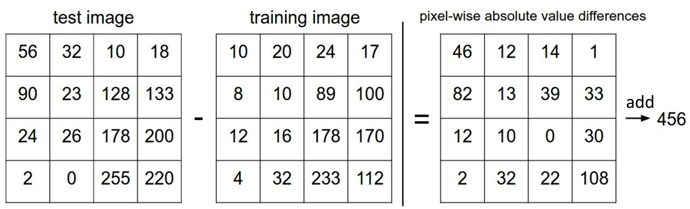
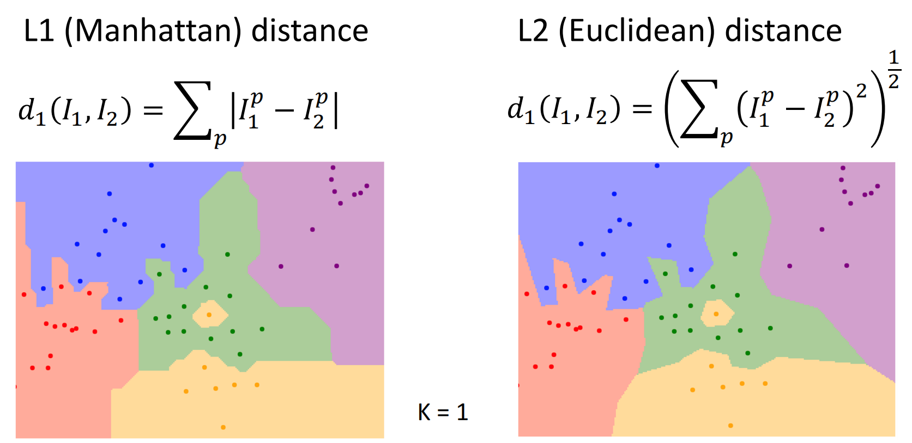

计算机与人类视觉的**Semantic Gap**：计算机看图片是一个数表，于人类而言简单的视角转换对计算机都是极大的挑战．除此之外，Interclass variation（类内变化）、Fine-Grained Categories（颗粒度分类）、Background Clutter（背景干扰）、Illumination Changes（光影改变）、Deformation（变形）、Occlusion（遮挡）等也是棘手的问题．

使用**机器学习**方法实现计算机视觉：

+ 训练（图像+标签）得到模型
+ 预测（模型+图像）得到标签

```python
def train(images, labels):
    # Machine learning!
    return model
def predict(model, test_images):
    # Use model to predict labels
    return test_labels
```

**Datasets（训练集）**提供训练图像及对应标签，下面是一些常见的训练集：

+ MNIST：含10个种类（0~9的手写数字），每张图片为28*28黑白像素
+ CIFAR10：含10个种类，每张图片为32*32RGB像素
+ CIFAR100：CIFAR10升级版，含100种类
+ ImageNet：含1000种类，约1.3M training image、50K validation images、100K test images

## Nearest Neighbor Classifier

**L1 distance（L1范数、曼哈顿距离）**：两个对象对应位置元素差值的绝对值之和，$d_(I_1,I_2)=\sum_p|I_1^p-I_2^p|$（$p$ 表示单个像素）．



Nearest Neighbor（最近邻法）将所有训练图片与标签存下来；对于测试样本，与训练样本逐一比对找到L1 distance最小的样本的标签．训练一张图片是 $O(1)$ 的，预测是 $O(n)$​​ 的．

最近邻法不适合高维的分类（如整体图像识别），因为所需要的训练集随着维度升高呈指数级增长．不过配合ConvNet后，其在特征检索方面表现良好．

最近邻法适合低维的分类．例如给定二维平面的点，其颜色与坐标呈一定关系；将每一个点预测为最接近的训练集点的颜色，可以预测整个平面的颜色构成：


这个分类算法有如下改进之处：

+ **K-Nearest Neighbors（k-近邻法）**：不一定只选取最近的一个点，而是选取接近的多个点，与出现最多的颜色相同．如当上图 k=3 时：


+ **Distance Metric（距离度量）**：可以使用L1范数/曼哈顿距离或**L2范数/欧几里得距离**，$d(I_1,I_2)=\left(\sum_p(I_1^p-I_2^p)^2\right)^\frac{1}{2}$．使用不同距离度量的对比：



可以前往[可视化网站](http://vision.stanford.edu/teaching/cs231n-demos/knn/)体验亲手调参．

## Hyperparameters

上述K与距离度量属于**Hyperparameters（超参数）**．超参数是事先给定的用来控制学习过程的参数，其不由训练得出．显然不同的超参数会对训练结果产生影响，我们希望找到最好的超参数．

我们可以将所有的数据集分为三类：

+ Train（训练集）：用于训练数据，让模型更新自身的权重参数．
+ Validation（验证集）：用于给模型调整超参数．模型不会通过它来更新权重，但开发者需要根据模型在验证集上的准确率或损失值，来决定是否停止训练，或者调整超参数。．
+ Test（测试集）：用于模型调参与训练完全结束后，客观评估其泛化能力和最终性能．测试集在训练过程必须是不可见的．

!!! question "为什么不能直接用测试集调参？"

    如果直接用测试集调节超参数，没有预留其他用于检验结果的数据，会出现模型**过拟合**的情况：模型是照着答案抄的过程；此时无法反映该模型的真正性能．

最好的调节超参数方法是**Cross-Validation（交叉验证）**：只需要训练集与测试集，将训练集分为若干个互不重叠的子集，称为Fold（折）；每次选取其中一折作为验证集而其他折作为训练集，最终将评估结果取平均值．其消除了随机性偏差，缺点是计算开销极大．

## Linear Classifier

