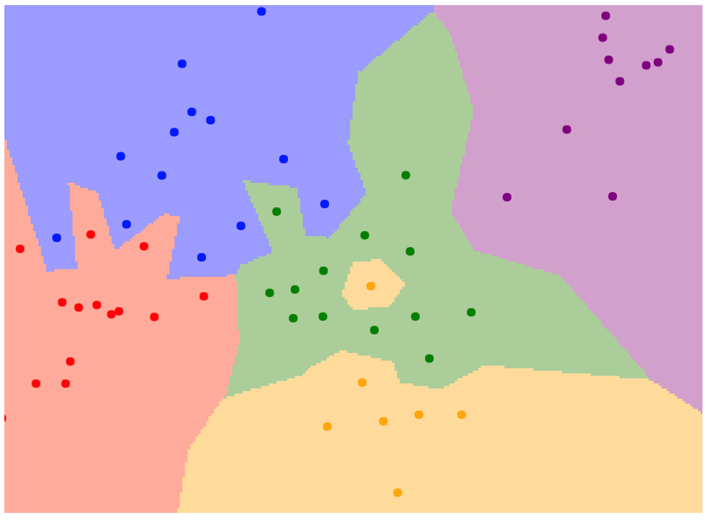
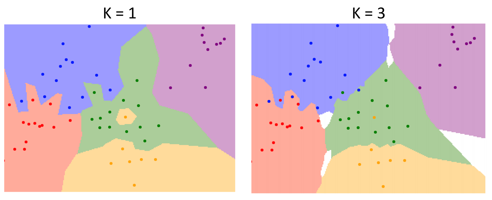
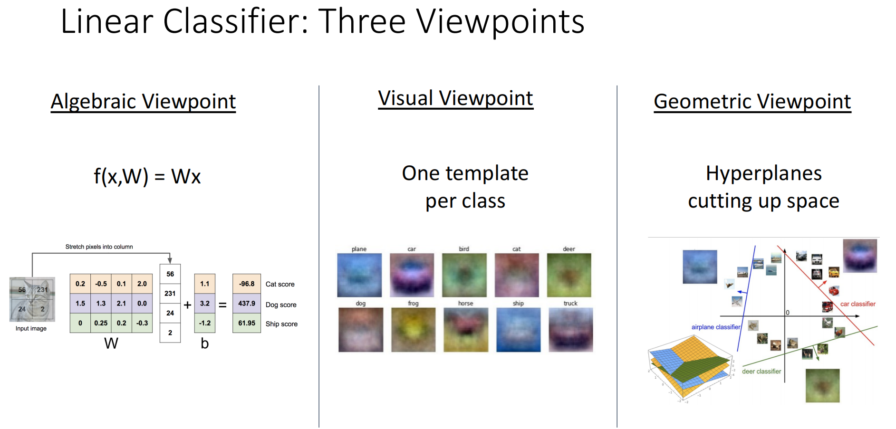
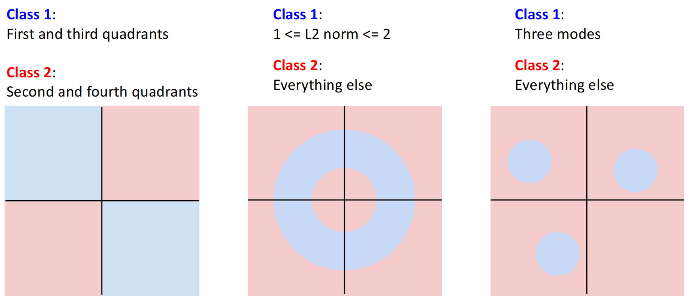

# Classification
计算机与人类视觉的**Semantic Gap**：计算机看图片是一个数表，于人类而言简单的视角转换对计算机都是极大的挑战．除此之外，Interclass variation（类内变化）、Fine-Grained Categories（颗粒度分类）、Background Clutter（背景干扰）、Illumination Changes（光影改变）、Deformation（变形）、Occlusion（遮挡）等也是棘手的问题．

使用**机器学习**方法实现计算机视觉：

+ 训练（图像+标签）得到模型
+ 预测（模型+图像）得到标签

```python
def train(images, labels):
    # Machine learning!
    return model
def predict(model, test_images):
    # Use model to predict labels
    return test_labels
```

**Datasets（训练集）**提供训练图像及对应标签，下面是一些常见的训练集：

+ MNIST：含10个种类（0~9的手写数字），每张图片为28*28黑白像素
+ CIFAR10：含10个种类，每张图片为32*32RGB像素
+ CIFAR100：CIFAR10升级版，含100种类
+ ImageNet：含1000种类，约1.3M training image、50K validation images、100K test images

## Nearest Neighbor Classifier

### 范数
**L1 distance（L1范数、曼哈顿距离）**：两个对象对应位置元素差值的绝对值之和，$d_(I_1,I_2)=\sum_p|I_1^p-I_2^p|$（$p$ 表示单个像素）．

**L2范数/欧几里得距离**：常见的距离， $d(I_1,I_2)=\left(\sum_p(I_1^p-I_2^p)^2\right)^\frac{1}{2}$．


### 最近邻法
Nearest Neighbor（最近邻法）将所有训练图片与标签存下来；对于测试样本，与训练样本逐一比对找到距离最小的样本的标签．训练一张图片是 $O(1)$ 的，预测是 $O(n)$​​ 的．

最近邻法不适合高维的分类（如整体图像识别），因为所需要的训练集随着维度升高呈指数级增长．不过配合ConvNet后，其在特征检索方面表现良好．

最近邻法适合低维的分类．例如给定二维平面的点，其颜色与坐标呈一定关系；将每一个点预测为最接近的训练集点的颜色，可以预测整个平面的颜色构成：



这个分类算法有如下改进之处：

+ **K-Nearest Neighbors（k-近邻法）**：不一定只选取最近的一个点，而是选取接近的多个点，与出现最多的颜色相同．如当上图 k=3 时：



+ **Distance Metric（距离度量）**：可以使用L1范数或L2**．使用不同距离度量的对比：


可以前往[可视化网站](http://vision.stanford.edu/teaching/cs231n-demos/knn/)体验亲手调参．

## Hyperparameters

上述K与距离度量属于**Hyperparameters（超参数）**．超参数是事先给定的用来控制学习过程的参数，其不由训练得出．显然不同的超参数会对训练结果产生影响，我们希望找到最好的超参数．

我们可以将所有的数据集分为三类：

+ Train（训练集）：用于训练数据，让模型更新自身的权重参数．
+ Validation（验证集）：用于给模型调整超参数．模型不会通过它来更新权重，但开发者需要根据模型在验证集上的准确率或损失值，来决定是否停止训练，或者调整超参数。．
+ Test（测试集）：用于模型调参与训练完全结束后，客观评估其泛化能力和最终性能．测试集在训练过程必须是不可见的．

!!! question "为什么不能直接用测试集调参？"

    如果直接用测试集调节超参数，没有预留其他用于检验结果的数据，会出现模型**过拟合**的情况：模型是照着答案抄的过程；此时无法反映该模型的真正性能．

最好的调节超参数方法是**Cross-Validation（交叉验证）**：只需要训练集与测试集，将训练集分为若干个互不重叠的子集，称为Fold（折）；每次选取其中一折作为验证集而其他折作为训练集，最终将评估结果取平均值．其消除了随机性偏差，缺点是计算开销极大．

## Linear Classifier

线性分类器属于参数化模型，其通过带有参数（权重 $W$）的函数 $f(x,W)=Wx+b$ 为图像计算出各个类别的得分．其中 $x$ 是输入向量，对于CIFAR10的数据集，其大小为 $32\times 32\times 3=3072$；$W$ 是权重矩阵，第0维为10（表示10种类别）、第1维为3072；$b$ 是一个长度为10的偏置向量．为了方便计算，可以将 $x$ 最后添加一个分量1，$W$ 第1维添加一列分量 $b$，是等效的．

### 理解线性分类器的视角

+ **代数视角**：将图像拉抻成一个列向量，通过矩阵乘法得出每个类别的得分．

+ **视觉视角**：由于权重矩阵的每一行乘以图像向量得到一个类的得分，将该行还原成图像的尺寸，可以认为其为识别一个类别的模板．当传入的图像与这个模板相似度高时，得到的内积结果较大，得分较高．我们也可以理解单模板的局限性，其无法捕捉数据的多个形态（模板可能出现有两个头的马）．
+ **几何视角**：将图像看作高维空间中的一个点．线性分类器的每一行相当于在高维空间划分出一个**Hyperplane（超平面）**，将高维空间分为两半．类别的得分在超平面的一侧为正，并且朝着该方向时增加；反方向类似（超平面维度应该为空间维度减1，例如一维空间的超平面是点，二维空间的超平面是直线，三维空间的超平面是平面）．



### 线性分类器的缺陷

由于超平面对空间的划分是线性一分为二的，其无法划分出非线性的数据．例如如下二维坐标系中的数据，以及经典的异或运算，都无法用线性分类器解决．



### 损失函数

有了分类函数 $f(x,W)=Wx+b$ 后，我们还需要一种方法来评价当前权重 $W$​ 的好坏．

**Softmax**：通过指数化与归一化，将原始分类得分转化为概率分布的一种方法．对于分类结果向量 $s=f(x,W)$，其定义为 

$$
\mathrm{Softmax}(s_i)=\dfrac{\text{exp}{(s_i)}}{\sum{\text{exp}}{(s)}}
$$

**Loss Function（损失函数）**：单个数据的损失为 $L_{i}(f(x_{i},W),y_{i})$，数据集的平均损失为 $\displaystyle\frac{1}{N}\sum_{i=1}^NL_{i}(f(x_{i},W),y_{i})$．

**Cross-Entropy（交叉熵损失）**：损失函数的一种，计算公式为 $L_i=-\log(\text{Softmax}(s_i))$．这种定义和最大似然估计有关．如果得分均随机，那么损失因为 $-\log (1/C)=\log 10 \approx2.3$​，可以作为检验的方法．

!!! quote "补充：**SVM损失**"

    公式为 $L_i=\sum_{j\ne y_i}\max(0,s_j-s_{y_i}+1)$（$y_i$ 为标签）；即对于每一个数据，如果识别出来正确的类别得分比其他分类得分至少大1，则记损失为0；反之记为得分之差加1．因此与交叉熵损失不同，SVM损失可以为零．
    
    相差得分1实际上为margin，其可以为任意值．但实际上margin取任意非零值没有区别，假如margin从1增加到10，只需将权重矩阵整体放大10倍，计算出的得分分差自然增加了10倍，不会影响最后结果．但如果margin为0，其与取非零值有差别．

