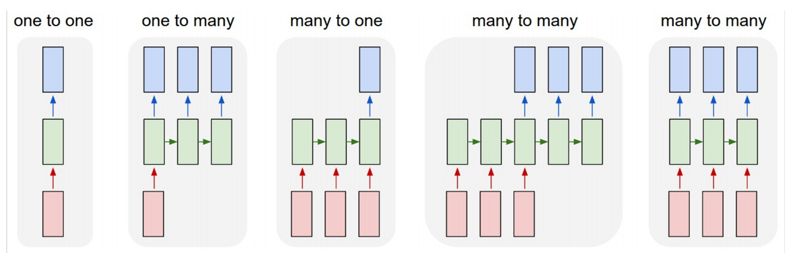
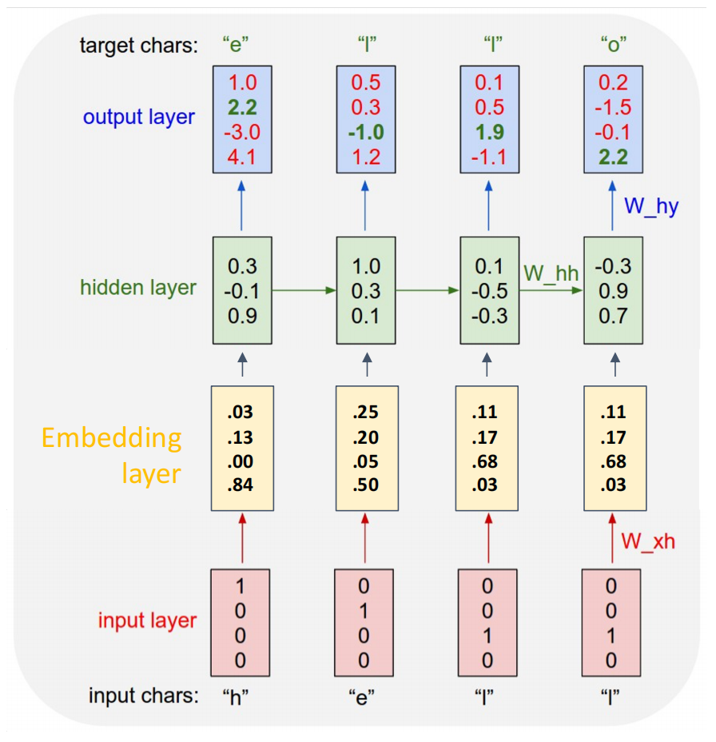
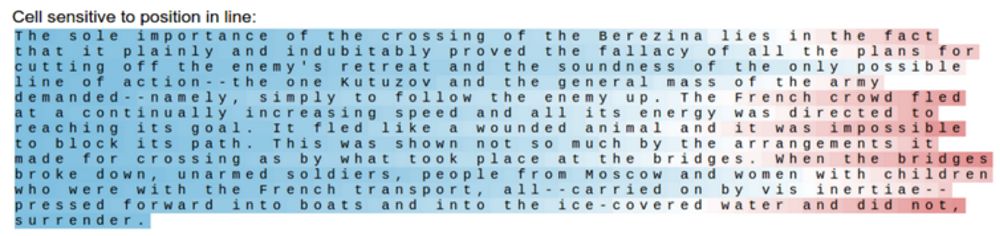
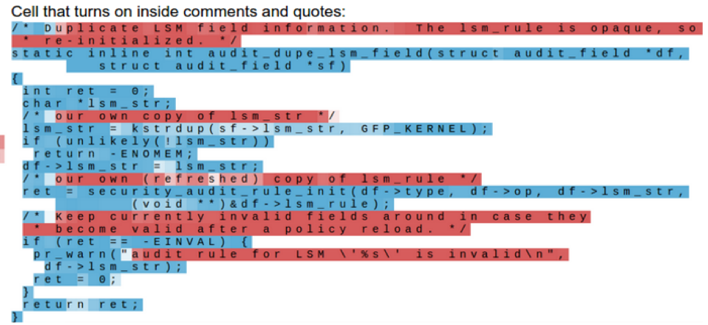
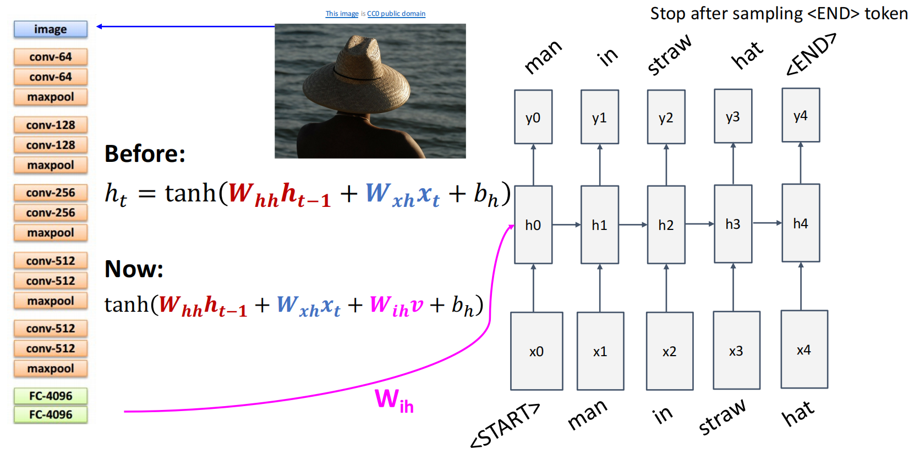
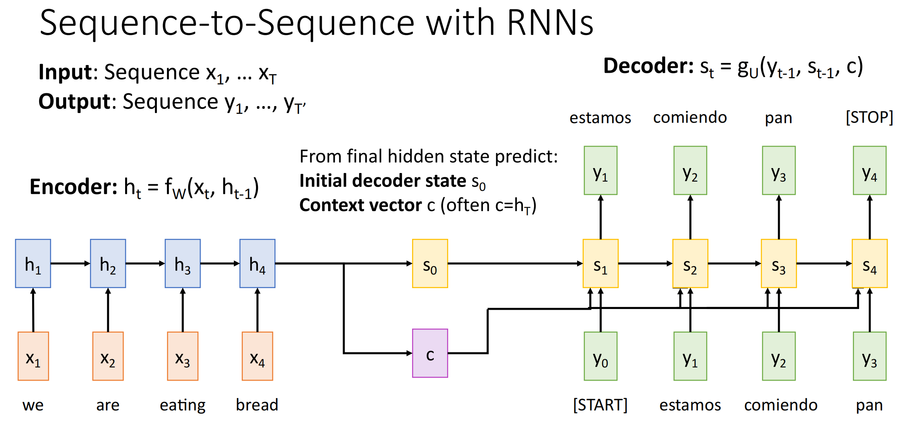

# Recurrent Neural Networks

## Process Sequences
之前的神经网络都是 one-to-one 的，即一个输入对应一个输出．循环神经网络可以生成序列，从而实现 one-to-one、one-to-many、many-to-one 甚至 many-to-many．



## Hidden States

隐状态（也称隐藏变量） $H_t\in \mathbb{R}^{n\times h}$ 记录了到时间步 $t$ 的序列信息．每一次使用 $t-1$ 时的隐状态 $H_{t-1}$ 与 $t$ 时的输入 $X_t\in \mathbb{R}^{n\times d}$ 来更新隐状态得到 $H_t$，每次用全连接层进行更新，即

$$
H_t=\phi(X_tW_{xh}+H_{t-1}W_{hh}+b_h)
$$

其中：

+ $W_{xh}\in \mathbb{R}^{d\times h}、W_{hh}\in \mathbb{R}^{h\times h}、b_h\in \mathbb{R}^{1\times h}$ 在一个 RNN 中是同一个参数；
+ $\phi$ 是带激活函数的全连接层，在 RNN 中一般使用 $\tanh$​；
+ 当然，每一次更新隐状态时也能有一个可选的输出 $y_t=H_{t}W_{hy}+b_y$．


> 根据矩阵运算，我们也可以将 $X_t$​ 与 $H_{t-1}$​ 按列拼接、将 $H_{t-1}$​ 与 $W_{hh}$​ 按行拼接，再进行一次大的矩阵乘法即可．

## Language Modeling

### Token

在处理文本时，计算机并不能直接理解文本的含义，因此我们需要和图像一样把文本处理成张量数据．**token** 是模型处理文本的最小单位，可以是字母、字符、单词等．以字母为例，我们可以将 "hello" 切成四个 token 形成词表 $[h,e,l,o]$​，每个 token 对应一个 id．

### One-hot-vector

one-hot 是把一个 token id 表示为长度为 $V$ 的向量，其中 $V$ 是词表大小；该向量只有对应位置为1，其余位置为0．如 "hello" 对应词表 $[h,e,l,o]$ 的 one-hot-vector 为：

```python
# shape = (n, V), n is number of tokens
[[1, 0, 0, 0]
 [0, 1, 0, 0]
 [0, 0, 1, 0]
 [0, 0, 1, 0]   
 [0, 0, 0, 1]]
```

### Embedding

由于不同 token 之间的*距离*不同，如 dog 与 cat 的距离一定比与 blackboard 更近，而只使用 one-hot 无法体现距离，因此需要将每一个 token 抽象为一个 $D$ 维向量，词表变成一个 $E\in \mathbb{R}^{V\times d}$ 的矩阵（如 $50000\times 512$），称为 **embedding**（嵌入层）．当 token id = $i$ 时，直接取 $E[i]$​ 即为 token 对应的向量．

> Embedding 可以在训练中学习，例如学习到 dog 与 cat 的距离相近．

### Prediction

如下图所示，简易语言模型的实现原理是训练 RNN，使得输入一个 token 后可以预测新 token，然后将新 token 加入隐状态继续生成．



> RNN 语言模型训练时和测试时采用不同的方式
>
> + 训练时：每一个输入对应一个输出，一般而言输入序列为 `<BOS>` + 原序列，输出序列为 原序列 + `<EOS>`，偏移一位；同时训练时即使输出错误，也只用于计算 loss 而不会用错误的输出继续往下计算；
> + 测试时：测试时不会提前给出正确的输出序列，如果一次输出错误，它就会接着这个错误的输出继续生成

## Backpropagation Through Time

如果最终通过 $H_4$ 预测出的 $y_4$ 的损失是 $L_4$，它不仅影响 $H_4$，由于 $H_4$ 是由前面的隐状态计算出来的，它会**随着时间反向传播**回 $H_3\to H_2\to H_1$．

因为所有时间步共享参数，所以参数梯度要把每个时间步的贡献加起来．同时梯度会包含很多连续相乘的项

$$
\frac{\partial h_T}{\partial h_1} = \frac{\partial h_T}{\partial h_{T-1}} \frac{\partial h_{T-1}}{\partial h_{T-2}} \cdots \frac{\partial h_2}{\partial h_1}
$$

容易导致梯度消失或梯度爆炸．因此普通 RNN 难以处理长距离依赖，这也是 LSTM、GRU 着重优化的部分．

!!! info "Truncated BPTT"

    实际训练时，通常不会对特别长的序列完整做 BPTT，而是用 **Truncated BPTT**（截断时间反向传播）．
    
    如一个很长的序列 $x_1,x_2,\dots, x_{1000}$，可能每 50 步切一段，反向传播时将上一段的末尾看作是常数，不跨段传播．

## Interpretable Hidden Units

训练 RNN 后，会发现有的隐变量学习到了一些语法、格式内容，具体见 [Visualizing and Understanding Recurrent Networks](https://arxiv.org/abs/1506.02078)．

???+ example "Interpretable Hidden Units"

    === "quote detection cell"
    
        
    
    === "line length tracking cell"
    
        
    
    === "if statement cell"
    
        
    
    === "quote/comment cell"
    
        

## Image Captioning

可以结合 CNN 的图像处理能力与 RNN 的序列处理能力，让神经网络为图像标注评论．例如，可以用过 $W_{ih}$ 将 CNN 提取出来的特征转化加入隐状态．



???+ example "成功样例与失败样例"

    
    
    

## Seq2seq

如果输入序列和输出序列都是长度可变的，如机器翻译问题，我们一般用 “Encoder-Decoder” 架构．

### Encoder

编码器把长度可变的输入序列转换成形状固定的上下文变量 $c$，并传入到解码器中．即通过

$$
c=q(h_1,\dots,h_t)
$$

将所有时间步的隐状态转化为上下文变量．常直接取 $c=h_t$．

### Decoder

解码器也是一个 RNN，其在时间步 $t$ 时，将来自上一时间步的输出 $y_{t-1}$、上下文变量 $c$、上一隐状态 $s_{t-1}$ 作为输入，转化为新隐状态 $s_t$，即

$$
s_t=g(y_{t-1},s_{t-1},c)
$$



## RNN Variants

### GRU

增加了两个门：

+ update gate $Z_t=\sigma(X_tW_{xz}+H_{t-1}W_{hz}+b_z)$
+ reset gate $R_t=\sigma(X_tW_{xr}+H_{t-1}W_{hr}+b_r)$

reset gate 决定“生成候选状态时是否参考旧状态”，其用于计算候选隐状态：

$$
\tilde H_t=\tanh(X_tW_{xh}+(R_t\odot H_{t-1})W_{hh}+b_h)
$$

update gate 决定“保留旧状态还是写入新状态”，其用于计算当前时间步最终的隐状态：

$$
H_t=Z_t\odot H_{t-1}+(1-Z_t)\odot \tilde H_t
$$


### LSTM

### Mutilayer RNNs

