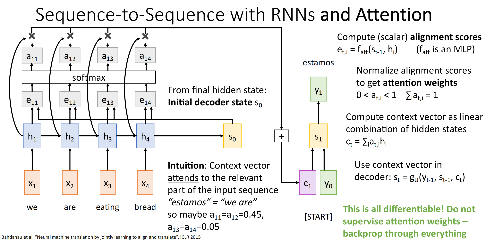
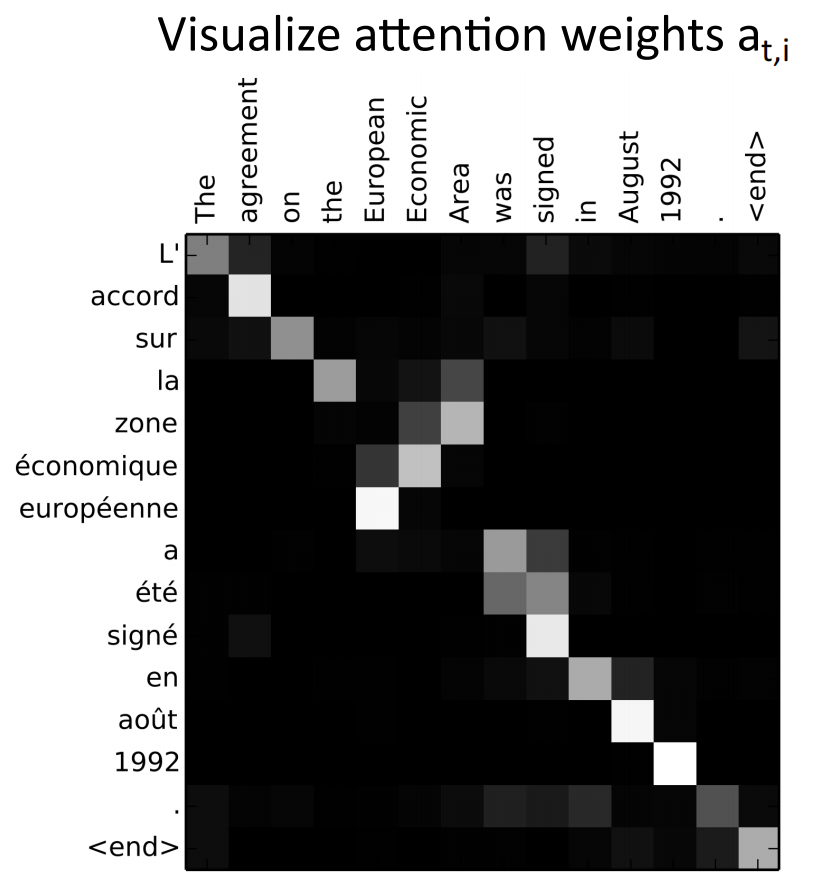
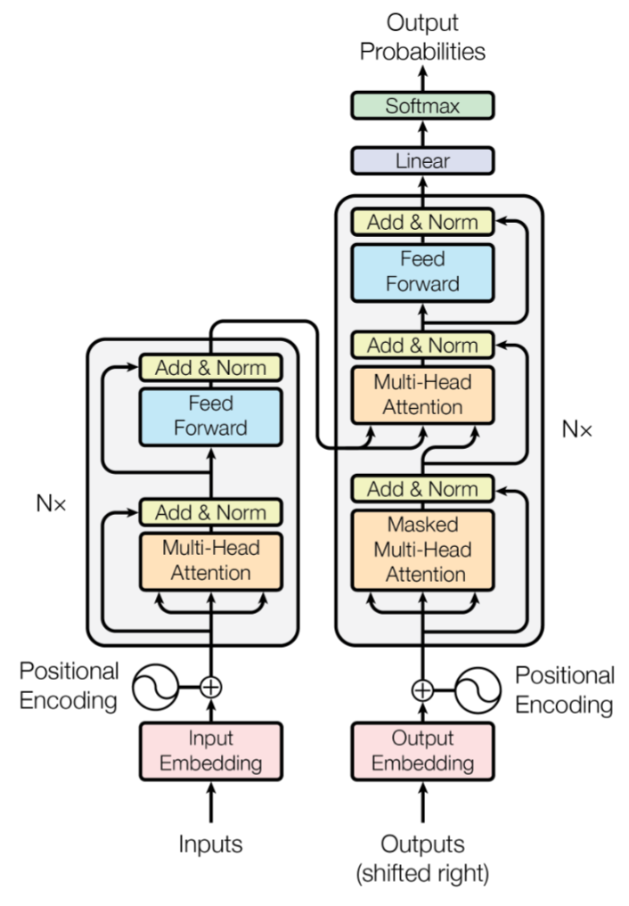

# Attention

推荐材料：

+ [Deep Learning Notes](https://jshn9515.github.io/deep-learning-notes/zh/index-parts/part04.html)
+ [Coding a Transformer from scratch on Pytorch](https://www.youtube.com/watch?v=ISNdQcPhsts)

## Bottleneck in Seq2seqw

在 RNN 中提到的 seq2seq 模型，有两个问题：

+ 信息压缩：源句越长，越难把所有信息都压进一个固定长度向量里；这个问题在 LSTM、GRU 中仍然存在．
+ 缺少动态性：翻译一句话时，生成不同目标词通常需要关注源句中的不同部分；而传统 seq2seq 中上下文向量是固定的．

按照人类的行为，如果我们来做翻译，会动态地根据前文来判断当前词语的含义．这就引出了**注意力**的概念．

## Bahdanau Attention

由于需要动态查看前文，因此不再是看一个固定的上下文向量，而是把所有的隐状态都保留下来．

解码器生成第 $t$ 个词时，模型会重新查看所有的隐状态，并将隐状态加权求和得到一个特定的上下文向量，这个向量包含了生成这个词需要特别关注的内容．

具体过程：

<div style="text-align: center; margin-top: 15px;">

</div>

+ 解码器当前状态 $s_{t-1}$ 和所有隐状态 $h_i$ 计算得到分数 $e_{i,t}$．其使用的是一个小型前馈神经网络．
+ 得到了分数后，用 softmax 函数对其进行归一化处理得到注意力权重 $\alpha_{i,t}$．
+ 再用注意力权重对隐状态进行加权求和，即 $c_t=\sum\alpha_{t,i}h_i$，得到此时的上下文向量．

!!! success "可视化"

    我们用机器翻译的结果，对注意力权重进行可视化：可以发现对应的词语的注意力权重会较高，如英语中的 Area 对应法语中的 zone、European 对应 européenne 等．
    
    <div style="text-align: center; margin-top: 15px;">
    
    </div>

## Cross-Attention

为了方便计算，我们直接取上文中计算分数的方式为向量点积．这样我们还能用矩阵来进行并行计算．这样就引出了接近现代注意力机制的 **Cross-Attention**（交叉注意力）．

### Query、Key、Value

现代 Attention 通常用 Query、Key、Value 来描述检索过程：

+ Query 表示需求；
+ Key 用来参与匹配；
+ Value 用来提供内容．

与 Bahdanau Attention（用隐状态同时来匹配与输出内容）最大的差别是把 Key 和 Value 分开了．这样的好处是用于匹配的信息和最终取回的信息可以不一致．

> 例如使用 Google 搜索“世界上最高的山是什么”，参与匹配的 key 是”世界上最高的山”这个问题本身，而“珠穆朗玛峰”才是需要的 value．

### Matrices Form

假设查询序列 $X\in \mathbb{R}^{N_x\times d}$，被查询序列 $Y \in \mathbb{R}^{N_y\times d}$．其中 $N_q、N_y$ 为查询序列的长度，$d$ 为每个 token 的维度．

投影矩阵 $W_Q\in \mathbb{R}^{d\times d_k}$，$W_K\in \mathbb{R}^{d\times d_k}$，$W_V=\in \mathbb{R}^{d\times d_v}$（一般取 $d_v=d_k$）．

首先将查询矩阵与被查询矩阵投影得到 $Q、K、V$：

+ $Q=XW_Q\in \mathbb{R}^{N_x\times d_k}$
+ $K=YW_K\in \mathbb{R}^{N_y\times d_k}$
+ $V=YW_V\in \mathbb{R}^{N_y\times d_v}$

然后计算 query 和 key 的相似度矩阵 $S=QK^T\in \mathbb{R}^{N_x\times N_y}$，其表示查询序列对被查询序列的相关性分数．

如果直接做点积运算，$S$ 中的每一个元素都是 $d_k$ 对乘积的和．当 $d_k$ 很大时，点积数值也会变大，导致 softmax 结果十分尖锐（某一位置概率接近 1，其他都接近 0），导致梯度变小等问题．具体而言，如果 $Q、K$ 元素服从标准正态分布，那么 $d_k$ 项乘积和方差接近 $d_k$，因此需要除以标准差 $\sqrt{d_k}$ 来实现方差归一化．

得到相关性分数后，再用 softmax 对分数进行归一化．接着对 value 进行加权平均，得到的维度为 $ \mathbb{R}^{N_x\times d_v}$，即每一个查询都有对应的注意力分布．

即完整公式为：

$$
\text{Attention}(Q,K,V)=\text{softmax}\left( \frac{QK^T}{\sqrt{d_k}} \right) V
$$

> 注意力机制最后得到的输出是什么？
>
> 其输出维度和输入是完全一致的，每一个 token 的词向量表示都是 $V$ 中词向量的加权组合，可以理解为融合了其他词向量．

## Self-Attention

对于一个序列里的 token，其如果想了解上下文并关注自己与其他 token 的相关性，就需要这个序列对自己做一次交叉注意力，即 **Self-Attention**（自注意力）．

自注意力与交叉注意力在形式上的区别就是查询矩阵和被查询矩阵都是 $X$．

### Sequential Modeling

<div style="text-align: center; margin-top: 15px;">

</div>

在自注意力中，任意两个 token 可以直接进行交互，信息路径更短，容易建立长距离依赖；并且其主要计算均为矩阵乘法，天生容易并行；因此其天生适合序列建模．

但自注意力机制仍然有许多不足，而这些不足将在后续内容中提出解决方案．

## Positional Encoding

>  自注意力的问题之一：它不知道 token 之间的顺序，因此不知道顺序带来的影响．

考虑两个 3 token 序列：`dog bites man` 和 `man bites dog`．这两个句子包含的词完全一样，但顺序不同，意思也完全不同．而对自注意力来说，两个输入 token 交换了顺序，但它们都是做相同的矩阵乘法，最后的结果也只是输出调换了位置．

最直接的解决方法是给每个位置加上一个 embedding 向量，即 $z_i=x_i+p_i$，或矩阵形式 $Z=X+P$．而使用相加而非拼接，好处是不会改变向量维度，可以直接套用原来的模型．

!!! example "正弦位置编码"

    在原始 Transformer 论文中，作者采用了固定的正弦位置编码，直接由公式生成；对于位置 $pos$ 和维度 $i$，其定义为：
    
    $$
    \begin{align*}
    PE_{(pos, 2i)} &= \sin \left(\frac{pos}{10000^{2i / d_\mathrm{model}}} \right) \\
    PE_{(pos, 2i+1)} &= \cos \left(\frac{pos}{10000^{2i / d_\mathrm{model}}} \right)
    \end{align*}
    $$
    
    当然，也可以使用可学习的位置编码．
    
    !!! code "正弦位置编码代码实现"
    
        ```python
        class PositionalEncoding(nn.Module):
    
            def __init__(self, d_model: int, seq_len: int, dropout: float):
                super().__init__()
                self.d_model = d_model
                self.seq_len = seq_len
                self.dropout = nn.Dropout(dropout)
    
                # Create a matrix of shape (seq_len, d_model)
                pe = torch.zeros(seq_len, d_model)
    
                # Create a vector of shape (seq_len, 1)
                position = torch.arange(0, seq_len).unsqueeze(1)
                div_term = torch.exp(torch.arange(0, d_model, 2).float() * (-math.log(10000) / d_model))
    
                # Apply the sin to even positions and the cos to odd positions
                pe[:, 0::2] = torch.sin(position * div_term)
                pe[:, 1::2] = torch.cos(position * div_term)
    
                pe = pe.unsqueeze(0) # (1, seq_len, d_model)
    
                self.register_buffer('pe', pe)
    
            def forward(self, x):
                # x: (batch, seq_len, d_model)
                # pe[:, :x.shape[1], :]: (1, seq_len of x, d_model) so can add to x
                x = x + (self.pe[:, :x.shape[1], :]).requires_grad_(False)
                return self.dropout(x)
        ```

## Multi-Head Attention

如同 CNN 需要多个卷积核提取多个特征一样，注意力也需要有一种能让一组 token 建立不同联系的方法，如语法、语义．因此 Transformer 论文中提出了 **Multi-head Attention**（多头注意力）．

对于常见的 $d_k=d_\text{model}=512、h=8$，其做法是 $W_Q,W_K,W_Q$ 用 $512 \to 512$ 的线性层让同一个 token 的表示充分融合，然后直接将这 $512$ 拆分成 $8\times 64$（此时 64 即为 $d_k$） ，再将 $h$ 维度与 $seq\_len$ 维度置换，从而方便使用矩阵进行并行计算．也就是说多个头，其实是在一个张量内部完成的．计算时 $h$ 是张量的第一维．

最后每一个头得到最后一维是 64 的输出，将它们拼起来再置换，恢复成输入形状．

???+ code "代码实现"

    ```python
    class MultiHeadAttentionBlock(nn.Module):
    
        def __init__(self, d_model: int, h: int, dropout: float):
            super().__init__()
            self.d_model = d_model
            self.h = h
            self.dropout = nn.Dropout(dropout)
    
            assert d_model % h == 0, "d_model is not divisible by h"
    
            self.d_k = d_model // h
            self.w_q = nn.Linear(d_model, d_model) 
            self.w_k = nn.Linear(d_model, d_model) 
            self.w_v = nn.Linear(d_model, d_model) 
            self.w_o = nn.Linear(d_model, d_model)    
    
        @staticmethod
        def attention(q, k, v, mask, dropout: nn.Dropout):
    
            # q, k, v: (batch, h, seq_len, d_k)
            d_k = k.shape[-1]
    
            # (batch, h, seq_len, d_k) --> (batch, h, seq_len, seq_len)
            # 多头注意力的拆分是对每个 token 的拆分，经过线性层后把每个 token 分成 h 份
            attention_scores = q @ k.transpose(-2, -1) / math.sqrt(d_k)
    
            if mask is not None:
                attention_scores.masked_fill_(mask, -1e9)
    
            attention_scores = attention_scores.softmax(dim=-1)
    
            if dropout is not None:
                attention_scores = dropout(attention_scores)
    
            return attention_scores @ v, attention_scores
    
        def forward(self, query, key, value, mask):
    
            # (batch, seq_len, d_model) --> (batch, seq_len, d_model)
            q = self.w_q(query)
            k = self.w_k(key)
            v = self.w_v(value)
    
            # (batch, seq_len, d_model) --> (batch, seq_len, h, d_k) --> (batch, h, seq_len, d_k)
            # 相当于把 h 个 Q K V 放在同一个张量里了
            q = q.view(q.shape[0], q.shape[1], self.h, self.d_k).transpose(1, 2)
            k = k.view(k.shape[0], k.shape[1], self.h, self.d_k).transpose(1, 2)
            v = v.view(v.shape[0], v.shape[1], self.h, self.d_k).transpose(1, 2)
    
            x, self.attention_scores = MultiHeadAttentionBlock.attention(q, k, v, mask, self.dropout)
    
            # (batch, h, seq_len, d_k) --> (batch, seq_len, h, d_k) --> (batch, seq_len, d_model)
            x = x.transpose(1, 2).contiguous().view(x.shape[0], -1, self.d_model)
    
            # (batch, seq_len, d_model) --> (batch, seq_len, d_model)
            return self.w_o(x)
    ```

## Layer Norm

处理文本时，由于不同序列文本长度不一致，因此 BatchNorm 在批之间归一化的方式并不好用；常使用 **Layer Normalization**（层归一化）．

Layer Norm 是把每个 token 的向量表示进行归一化．即对于 `(batch, seq_len, d_model)` 的输入，其在 `d_model` 维度进行归一化．归一化步骤同 BatchNorm：减去均值、除以标准差，再乘以可学习的缩放、加上可学习的偏置（一般维度为 `d_model`）．

!!! code "代码实现"

    ```python
    class LayerNormalization(nn.Module):
    
        def __init__(self, d_model: int, eps: float = 1e-6):
            super().__init__()
            self.eps = eps
            # gamma / beta 都是 d_model 维
            self.gamma = nn.Parameter(torch.ones(d_model)) # Multiplied
            self.beta = nn.Parameter(torch.zeros(d_model)) # Added
    
        def forward(self, x):
    
            # LayerNorm 是作用在每个 token 上的
            mean = x.mean(dim=-1, keepdim=True)
            std = x.std(dim=-1, keepdim=True, unbiased=False)
            return self.gamma * (x - mean) / (std + self.eps) + self.beta
    ```

## Transformer

至此，Transformer 架构的基本单元已经集齐．Transformer 架构图：

<div style="text-align: center; margin-top: 15px;">

</div>

### Encoder Block

### Decoder Block

