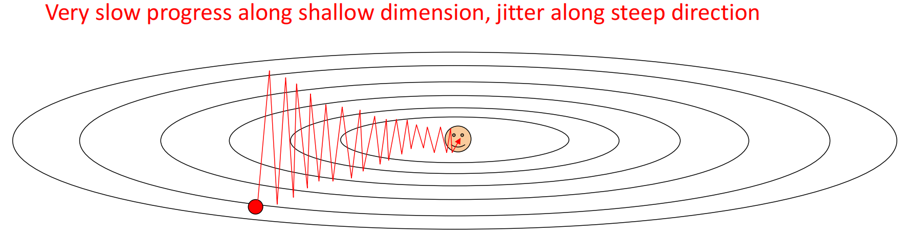
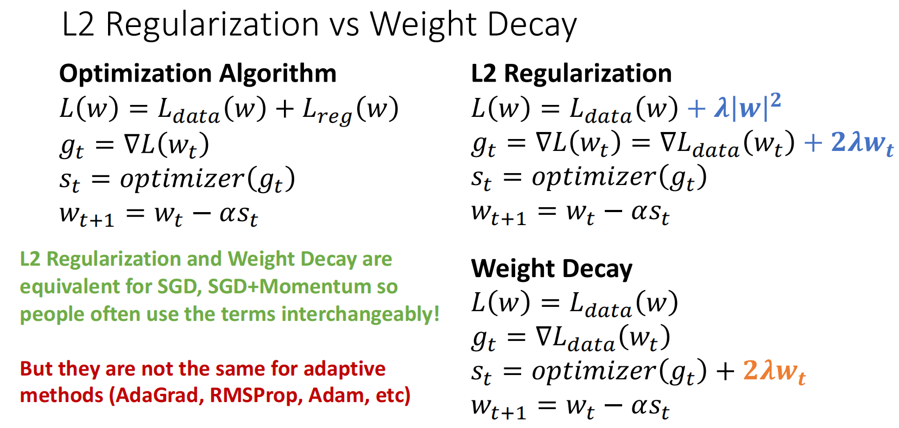

# Regularization and Optimization
## Regularization 

一个模型在训练数据表现得很好而在未知数据表现得很差，这种现象称为**过拟合**．

为了防止模型出现过拟合，在数据集的损失函数后加上一个**正则化**项，其一般是关于模型复杂度的单调递增函数．
$$
\displaystyle\frac{1}{N}\sum_{i=1}^NL_{i}(f(x_{i},W),y_{i})+\lambda R(W)
$$

+ $\lambda$ 是衡量惩罚力度的超参数．
+ $R(W)$ 是正则化项．其可以为**L1正则化** $\|W\|$ 或**L2正则化** $\|W\|^2$．

## Optimization
我们已经用损失函数量化了参数的好坏，现在我们希望找到使 $L(W)$ 最小的 $W^{*}$．

优化中常用的方法为**Gradient Descent（梯度下降）**，即求出损失函数 $L$ 关于 $W$ 每一个参数的导数（即梯度，实际上是通过计算），将 $W$ 的每个参数往负梯度方向进行变化．用代码来说就是

```python
w = initialize_weights()
for t in range(num_steps):
	dw = compute_gradient(loss_fn, data, w)
	w -= learning_rate * dw
```

其中的超参数包含：

+ 权重初始化方法
+ 执行步数
+ 学习率（即每一次走的步长）

不妨设目前的参数为 $\theta$（更常用），梯度为 $g_t=\nabla_\theta L(\theta_t)$，学习率为 $\alpha$，则最朴素的更新为

$$
\theta_{t+1}=\theta_t-\alpha g_t
$$

所有后文中介绍的基于梯度下降的优化方法都在解决两个问题：

+ 每一次更新方向用什么量代替原始梯度 $g_{t}$
+ 每一次走多大步

### Batch Gradient Descent
每一次都用所有数据计算损失与梯度．

$$
L(\theta)=\frac{1}{N}\sum_{i=1}^N L_i(\theta)+\lambda R(\theta)
$$

$$
\nabla L(\theta)=\frac{1}{N}\sum_{i=1}^N \nabla L_i(\theta)+\lambda \nabla R(\theta)
$$

然后更新 $\theta_{t+1}=\theta_t-\alpha \nabla L(\theta_t)$．

优点是无采样噪声，缺点是每一步计算代价太高，且容易卡在鞍点处．

### Stochastic Gradient Descent
随机梯度下降用部分数据来近似全数据期望，即

$$
g_t=\frac{1}{|B_t|}\sum_{i\in B_t}\nabla L_i(\theta_t)
$$

然后更新

$$
\theta_{t+1}=\theta_t-\alpha g_t
$$

由于是取部分数据，因此梯度会有噪声；好处是计算代价低，且由于每次选取的是不同的数据，不容易卡在鞍点处．

BGD和SGD有个共性的缺点：在某些方向变化太快、某些方向变化太慢时路径会抖动，例如



### Momentum
为了解决路径抖动的问题，我们考虑使用历史梯度的加权平均数．更新的梯度的权重应该更大，而更旧的应该更小．

即

$$
m_t=\beta m_{t-1}+(1-\beta)g_t
$$

$$
\theta_{t+1}=\theta_t-\alpha m_t
$$

$m_{t}$ 即为梯度的一阶指数加权平均．将 $m_{t}$ 展开，得到

$$
m_t=\beta^t m_0+(1-\beta)\sum_{i=1}^{t}\beta^{t-i}\theta_i
$$

$m_{0}$ 常被初始化为0，因此 $m_{t}=(1-\beta)\sum_{i=1}^{t}\beta^{t-i}\theta_i$．即为**EMA（指数加权平均）**．

其优点为：

+ 降噪：由于SGD带有降噪，而EMA因为取平均值，可以平滑这些噪音．
+ 抑制抖动：如果某个方向来回震荡，正负梯度会在平均中部分抵消．

### Nesterov Momentum
Momentun有可能在接近最小值点时冲过头，这样还需要更多的步骤才能到达最小值．而Nesterov Momentum的思路是在Momentum的基础上，不在当前点 $\theta_{t}$ 计算梯度，而是在走一步后到达的位置计算：

$$
\tilde\theta_t=\theta_t-\alpha \beta m_{t-1}
$$

$$
g_t=\nabla L(\tilde\theta_t)
$$

$$
m_t=\beta m_{t-1}+(1-\beta)g_t
$$

$$
\theta_{t+1}=\theta_t-\alpha m_t
$$

其相较于Momentum，加了一层**前瞻修正**．

### AdaGrad
AdaGrad用于解决学习率调节的问题，其也被称为**自适应学习率**算法．定义梯度的二阶累积量 $v_t=v_{t-1}+g_t^2$（此处为张量的逐元素平方），更新：

$$
\theta_{t+1}
=
\theta_t-\alpha \frac{g_t}{\sqrt{s_t}+\epsilon}
$$

其实 $\epsilon$ 是一个极小的正数，用于防止除以0．

当梯度一直很大时，$v_{t}$ 就会很大，此时就会自动调小学习率，即减小步长；反之如果梯度一直很小，其步长就会较大．

不过由于 $v_{t}$ 是只增不减的，最后学习率可能衰减的太厉害．因此就出现了RMSProp．

### RMSProp
RMSProp在AdaGrad基础上，将 $v_{t}$ 从累计平方和改为了 $g_{t}^{2}$ 的EMA：

$$
v_t=\beta v_{t-1}+(1-\beta)g_t^2
$$

这样的好处是学习率会自适应最近的梯度大小．如果最近的梯度大小很大，那么学习率就会较小；反之最近的梯度较小，那么学习率就会变大．

### Adam
Adam是被广泛使用的梯度下降算法．其原文[Adam: A Method for Stochastic Optimization](https://arxiv.org/abs/1412.6980)被引用次数已经超过24w．其将Momentum与RMSProp进行了结合，并加以修正．

不妨设此时

$$
m_t=\beta_1 m_{t-1}+(1-\beta_1)g_t
$$

$$
v_t=\beta_2 v_{t-1}+(1-\beta_2)g_t^2
$$

观察到它们的权重和为 $(1-\beta)\sum_{i=1}^{t}\beta^{t-i}=1-\beta^{t}$，其权重和小于1，在前几轮时得到的平均数会偏小，因此需要除以 $1-\beta^{t}$ 对数据进行偏置矫正：

$$
\hat{m_{t}}=\dfrac{m_{t}}{1-\beta_{1}^{t}}
$$

然后更新：

$$
\hat{v_{t}}=\dfrac{v_{t}}{1-\beta_{2}^{t}}
$$

$$
\theta_{t+1}=\theta_t-\alpha\frac{\hat m_t}{\sqrt{\hat v_t}+\epsilon}
$$

### AdamW
AdamW是Adam+Weight Decay的优化．

!!! quote "Weight Decay"

	Weight Decay是在 $g_{t}$ 里额外加上 $2\lambda \theta_{t}$ 的惩罚项．这里与L2正则化做一个简单的对比：
	
	
	
	L2正则化是在损失函数中添加 $\lambda \theta_{t}^{2}$ 的惩罚；而Weight Decay是在更新量中额外加上 $2\lambda \theta_{t}$．在SGD/SGC+Momentum中，二者结果是一样的；而在Adam这类自适应优化器中，由于对学习率做了自适应，结果会不同．也就是说，我们使用Weight Decay而不是L2正则化，是因为我们不希望惩罚项被自适应机制一起处理．

加入了Weight Decat后：

$$
g_t=\nabla L_{\theta}(\theta_t),\quad
s_t=\text{optimizer}(g_t)+2\lambda\theta_t,\quad
\theta_{t+1}=\theta_t-\alpha s_t
$$

得到的结果：

$$
\theta_{t+1}
=
(1-2\alpha\lambda)\theta_t
-\alpha\frac{\hat m_t}{\sqrt{\hat v_t}+\epsilon}
$$

AdamW在Adam的基础上添加了防止过拟合的参数，因此可以将其当作默认优化方法．