# Neural Networks and Backpropagation
## Feature Transformation
一些特征变换可以将在原空间下线性不可分的数据，在特征空间下变得线性可分．如下图，原空间在笛卡尔坐标下难以分类，但使用极坐标可以很容易得分类出来．

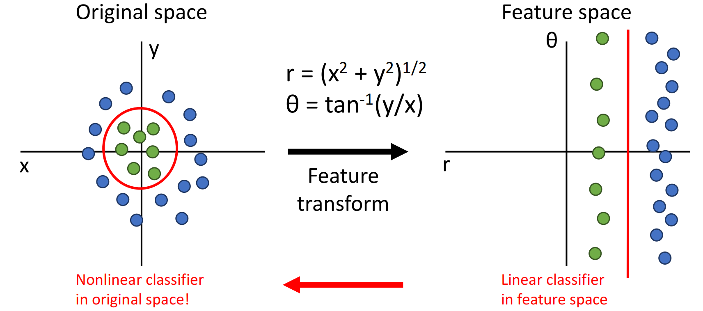

!!! warning "提示"

	在此语境下的特征变换为feature transformation．要注意此处的特征为feature，不要与线性代数中的特征弄混了，特别是特征值（feature value, eigenvalue）与特征向量（feature vector, eigenvector）．

CV历史上还使用过：

+ Color Histogram（颜色直方图）：将颜色空间分成很多桶，对图像颜色做频数统计．忽略颜色出现的空间位置，只关心出现频率．
+ Histogram of Oriented Gradients（方向梯度直方图特征）：将图像切成数个小区域（如 $8\times 8$ pixel），统计小区域的方向朝向．

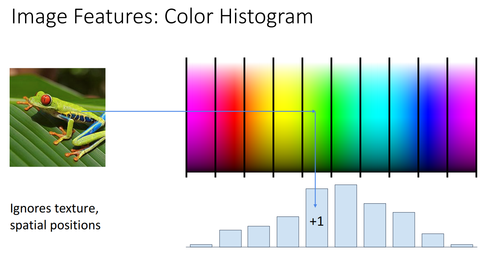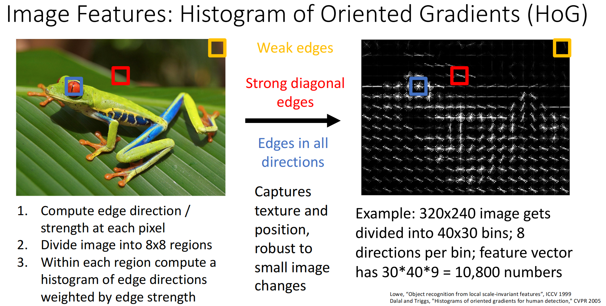

## Neural Networks

线性分类器只使用 $f(x)=Wx+b$，无法表示非线性的分类界限．而**神经网络**通过多层线性分类与非线性的**激活函数**，实现非线性分类，并且能从原始数据中**自动**学到合适的特征表示．
    
???+ quote "常用的激活函数"
    
    激活函数必须是非线性的，以下函数都可以作为激活函数：
    
    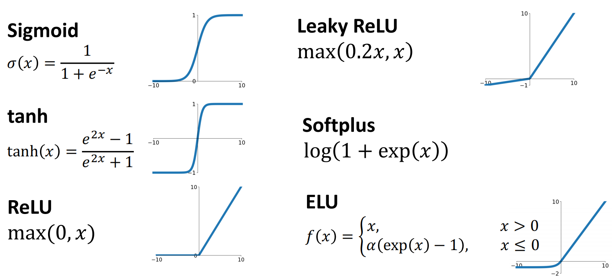
    
    在本节课中我们默认使用ReLU，因为其使用的更加广泛，且函数较为简单（反向传播时导数只可能为0或1）．

以二层神经网络为例，其形式为 $f(x)=W_{2}\max(0, W_{1}x+b_{1})+b_{2}$．如果输入 $x\in \mathbb{R}^{D}$，输出 $f(x)\in \mathbb{R}^{C}$，则有 $W_{1}\in \mathbb{R}^{H\times D},b_{1}\in \mathbb{R}^{H},W_{2}\in \mathbb{R}^{C\times H},b_{2}\in \mathbb{R}^{C}$．

神经网络也被称为**多层感知机**．神经网络的层数称为其深度，一般来说，深度越深，神经网络的拟合能力越强，也越容易出现过拟合；我们需要加入正则化项来防止过拟合（而不是通过减小深度来实现）．

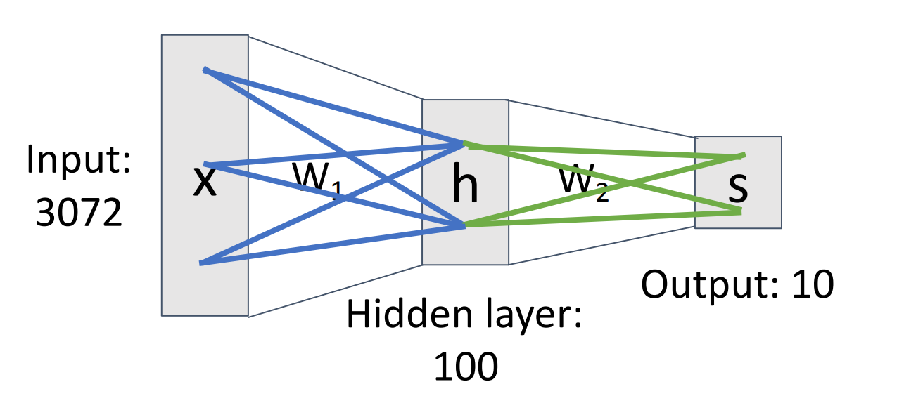

由于非线性激活函数的存在，其可以实现在原坐标系下的非线性边界．理论上，神经网络可以拟合所有 $\mathbb{R}^{N}\to \mathbb{R}^{M}$ 的任意连续函数．

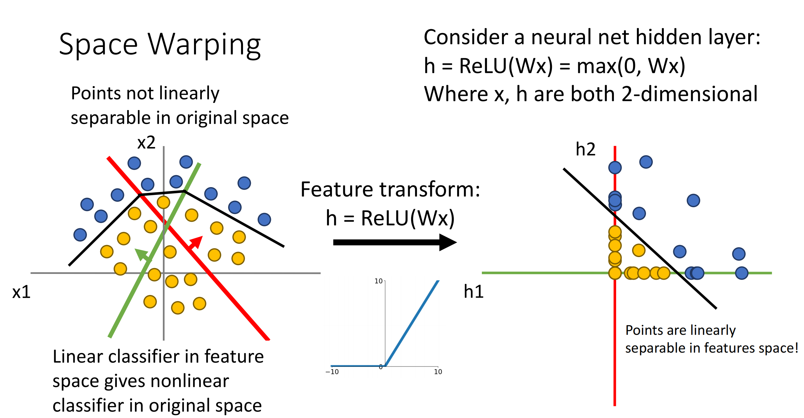

## Backpropagation

### 反向传播
对于函数 $f$，不妨其具有输入 $x,y$，输出 $z$，并且我们已知最终的结果 $L$ 关于输出 $z$  的偏导 $\dfrac{\partial{L}}{\partial{z}}$，那么就能用**链式法则**得到：

$$
\begin{aligned}
&\dfrac{\partial{L}}{\partial{x}}=\dfrac{\partial{z}}{\partial{x}}\cdot \dfrac{\partial{L}}{\partial{z}} \\
&\dfrac{\partial{L}}{\partial{y}}=\dfrac{\partial{z}}{\partial{y}}\cdot \dfrac{\partial{L}}{\partial{z}}
\end{aligned}
$$
即为**反向传播**的本质．其先求出输出的偏导，再求出输入的偏导，因此为“反向”．其中：

+ $\dfrac{\partial{L}}{\partial{z}}$：作为已知数据，称为**upstream gradient（上游梯度）**．
+ $\dfrac{\partial{z}}{\partial{x}},\dfrac{\partial{z}}{\partial{y}}$：称为**local gradient（局部梯度）**．
+ $\dfrac{\partial{L}}{\partial{x}},\dfrac{\partial{L}}{\partial{y}}$：称为**downstream gradient（下游梯度）**．

显然，下游梯度=局部梯度$\times$上游梯度．

一般而言，计算函数值时使用正向传播，而计算偏导时使用反向传播．

!!! example "例"

    对于函数 $f(x,w)=\dfrac{1}{1+e^{-(w_{0}x_{0}+w_{1}x_{1}+w_{2})}}$，给出其计算图：
    
    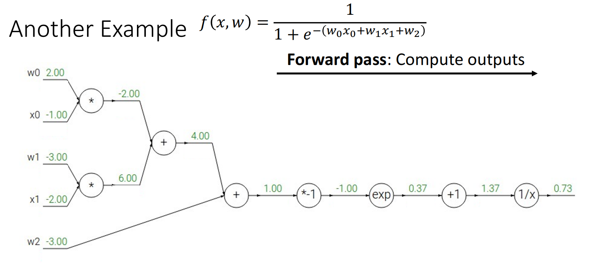
    
    不妨设最后的结果即为目标 $L$．显然 $\dfrac{\partial{L}}{\partial{L}}=1$；对于函数 $f(x)=\dfrac{1}{x}$，其输入为 $x=1.37$，输出为 $y=0.73$；因此我们得到 $\dfrac{\partial{L}}{\partial{x}}=-\dfrac{1}{x^{2}}=-\dfrac{1}{1.37^{2}}\approx 0.53$．
    
    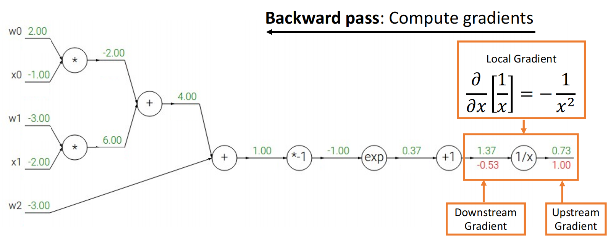
    接着是函数 $f(x)=x+1$，偏导与前一轮一样；
    
    然后是函数 $f(x)=e^{x}$，其输入为 $x=-1$，输出为 $y=0.37$，上游梯度 $\dfrac{\partial{L}}{\partial{y}}=-0.53$，因此下游梯度 $\dfrac{\partial{L}}{\partial{x}}=\dfrac{de^{x}}{dx}\cdot\dfrac{\partial{L}}{\partial{y}}=\dfrac{1}{e}\cdot 0.53\approx 0.20$．
    
    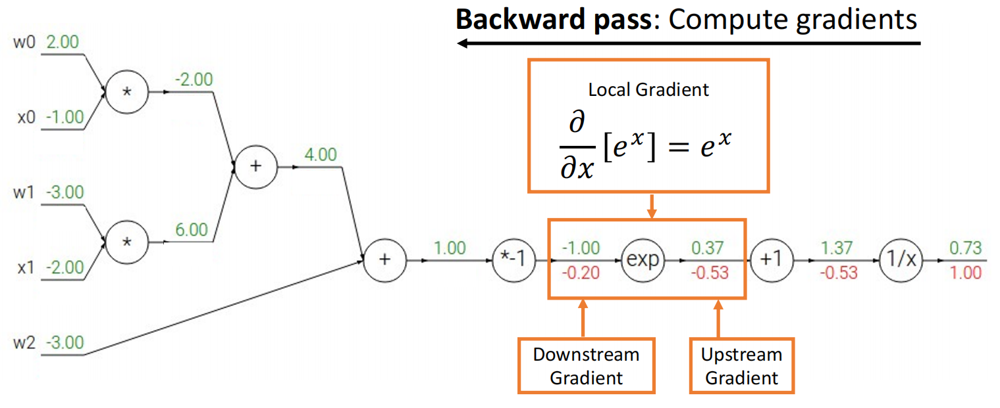
    依此类推，可以求出所有偏导：
    
    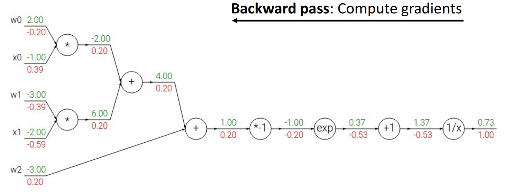

### 梯度流

我们可以预处理一些常用操作的梯度规律，使得运算时可以直接查表．

!!! example "例"

	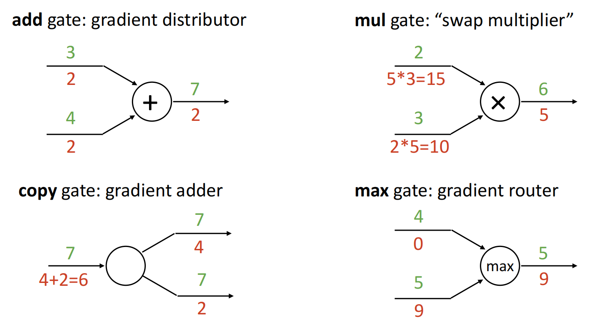
	
	+ add gate：$f(x,y)=x+y$，此时两边的局部梯度均为1，下游梯度与上游梯度相等．
	+ mul gate：$f(x,y)=xy$，此时两边的局部梯度为另一个变量．
	+ copy gate：$f(x)=(x,x)^T$，此时为向量值函数，其局部梯度为 $J_f=\left(\dfrac{\partial{x}}{\partial{x}},\dfrac{\partial{x}}{\partial{x}}\right)^{T}=(1,1)^{T}$，下游梯度为上游梯度相加．
	+ max gate：$f(x,y)=\max(x,y)$，此时较大者局部梯度为1，较小者局部梯度为0．
	
	类似的，之前例子中的 $\dfrac{1}{1+e^{-x}}$ 是sigmoid函数，其也可以预处理，得到 
	
	$$
	\dfrac{d\sigma(x)}{dx}=\dfrac{e^{-x}}{(1+e^{-x})^{2}}=\dfrac{1}{1+e^{-x}}\cdot \dfrac{e^{-x}}{1+e^{-x}}=\sigma(x)(1-\sigma(x))
	$$
	
	可以对求偏导的过程进行很大程度上的化简．

### 代码
还是那个例子，我们可以通过正向传播求函数值+反向传播求偏导的方式，模拟出来代码：

```python
def f(w0, x0, w1, x1, w2):
	# Forward Pass: Compute output
	s0 = w0 * x0
	s1 = w1 * x1
	s2 = s0 + s1
	s3 = s2 + w2
	L = sigmoid(s3)
	
	# Backward Pass: Compute grads
	grad_L = 1.0
	grad_s3 = grad_L * (1 - L) * L
	grad_s2 = s3
	grad_w2 = s3
	grad_s0 = s2
	grad_s1 = s2
	grad_w1 = grad_s1 * x1
	grad_x1 = grad_s1 * w1
	grad_w0 = grad_s1 * x0
	grad_x0 = grad_s1 * w0
```

Pytorch也提供了 `torch.autograd.Function` 基类，我们可以继承该基类，实现自己的函数方法；之后调用该方法，Pytorch就会帮我们自动求导：
```python
class Multiply(torch.autograd.Function)
	@Staticmethod
	def forward(ctx, x, y): # ctx means context, use to store inputs
		ctx.save_for_backward(x, y)
		z = x * y
		return z
	
	@Staticmethod
    def backward(ctx, grad_z):
        x, y = ctx.saved_tensors
        grad_x = y * grad_z
        grad_y = x * grad_z
        return grad_x, grad_y
```
### 向量求导
考虑 $f$ 是一个 $\mathbb{R}^{n}\to \mathbb{R}^{m}$ 的映射，其输入为 $\boldsymbol{x}=(x_{1},x_{2},\cdots,x_{n})^{T}$、输出为 $\boldsymbol{y}=(y_{1},y_{2},\cdots, y_{m})^{T}$，则 

$$
\frac{\partial \boldsymbol y}{\partial \boldsymbol x}
=
\begin{bmatrix}
\dfrac{\partial y_1}{\partial x_1} & \dfrac{\partial y_1}{\partial x_2} & \cdots & \dfrac{\partial y_1}{\partial x_n}\\[6pt]
\dfrac{\partial y_2}{\partial x_1} & \dfrac{\partial y_2}{\partial x_2} & \cdots & \dfrac{\partial y_2}{\partial x_n}\\
\vdots & \vdots & \ddots & \vdots\\
\dfrac{\partial y_m}{\partial x_1} & \dfrac{\partial y_m}{\partial x_2} & \cdots & \dfrac{\partial y_m}{\partial x_n}
\end{bmatrix}
$$

该结果是一个 $m\times n$ 的矩阵，称为Jacobian矩阵，记作 $J$．

由于 $L$ 为标量，因此 $\dfrac{\partial{L}}{\partial{\boldsymbol{y}}}$ 形状与 $\boldsymbol{y}$ 相同，为 $m\times 1$；同理 $\dfrac{\partial{L}}{\partial{\boldsymbol{x}}}$ 形状与 $\boldsymbol{x}$ 相同，为 $n\times 1$．由于Jacobian的形状为 $m\times n$，显然有

$$
\dfrac{\partial{L}}{\partial{\boldsymbol{x}}}=\left( \dfrac{\partial{\boldsymbol{y}}}{\partial{\boldsymbol{x}}} \right)^{T} \cdot  \dfrac{\partial{L}}{\partial{\boldsymbol{y}}}
=J^{T}\cdot \dfrac{\partial{L}}{\partial{\boldsymbol{y}}}
$$

!!! example "例"

    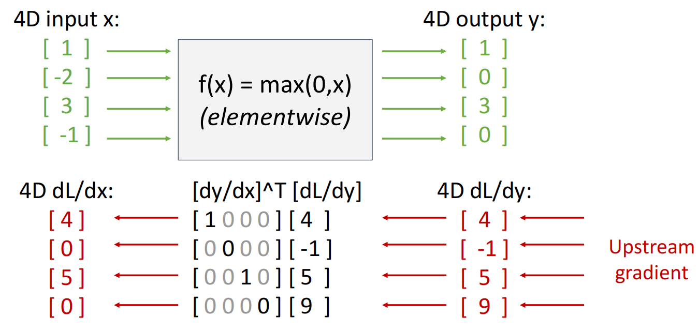
    
    实际上由于存储Jacobian矩阵需要占用大量内存，我们并不显式存储它．我们可以通过如下公式化简：
    
    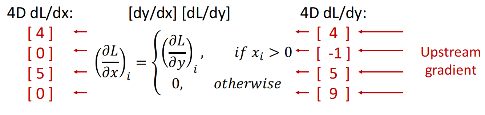

### 矩阵求导

考虑 $X\in \mathbb{R}^{N\times D},W\in \mathbb{R}^{D\times M}, Y=XW\in \mathbb{R}^{N\times M}$．接下来推导 $\dfrac{\partial{Y}}{\partial{X}},\dfrac{\partial{Y}}{\partial{W}}$．

首先写出分量形式

$$
Y_{ab} = \sum_{k=1}^{D}X_{ak}W_{kb} 
$$

我们首先考虑 $Y_{ab}$ 对单个元素 $X_{ij}$ 的梯度．带入分量形式，有

$$
\begin{aligned}
\dfrac{\partial{Y_{ab}}}{\partial{X_{ij}}}&=\dfrac{\partial}{\partial{X_{ij}}}\left( \sum_{k=1}^{D}X_{ak}W_{kb}  \right) \\
&=
\sum_{k=1}^{D}
W_{kb}\frac{\partial X_{ak}}{\partial X_{ij}} \\
&=\sum_{k=1}^{D}W_{kb}\delta_{ai}\delta_{kj}
\end{aligned}
$$

其中

$$
\delta_{ai}=
\begin{cases}
1,& a=i\\
0,& a\ne i
\end{cases}
$$


由于 $\delta_{ai}$ 与 $k$ 无关，因此

$$
\begin{aligned}
\frac{\partial Y_{ab}}{\partial X_{ij}}
&=
\sum_{k=1}^{D}
W_{kb}\,\delta_{ai}\delta_{kj} \\
&=\delta_{ai}\sum_{k=1}^{D}W_{kb}\delta_{kj}
\end{aligned}
$$

而 $\delta_{kj}$ 相当于把求和里的 $k$ 选成 $j$，因此

$$
\sum_{k=1}^{D}W_{kb}\delta_{kj}
=W_{jb}
$$

综上

$$
\frac{\partial Y_{ab}}{\partial X_{ij}}=\delta_{ai}W_{jb}
$$

设上游梯度记为

$$
G=\nabla_Y L,\quad G_{ab}=\frac{\partial L}{\partial Y_{ab}}
$$

则对于 $X_{ij}$，$\dfrac{\partial{L}}{\partial{X_{ij}}}$ 为所有 $Y_{ab}$ 链式法则之和

$$
\frac{\partial L}{\partial X_{ij}}
=
\sum_{a=1}^{N}\sum_{b=1}^{M}
\frac{\partial L}{\partial Y_{ab}}
\frac{\partial Y_{ab}}{\partial X_{ij}}
$$

带入之前的公式

$$
\frac{\partial L}{\partial X_{ij}}
=
\sum_{a=1}^{N}\sum_{b=1}^{M}
G_{ab}\,\delta_{ai}W_{jb}
$$

因为 $\delta_{ai}$ 相当于把求和里的 $a$ 选成 $i$，因此

$$
\frac{\partial L}{\partial X_{ij}}
=
\sum_{b=1}^{M} G_{ib}W_{jb}
$$

我们发现这是一个类似矩阵乘法的形式，将其还原为矩阵乘法，得到

$$
\dfrac{\partial{L}}{\partial{X}}=\dfrac{\partial{L}}{\partial{Y}}\cdot W^{T}
$$

我们可以从矩阵大小角度验证：$\dfrac{\partial{L}}{\partial{X}}\in \mathbb{R}^{N\times D},\dfrac{\partial{L}}{\partial{Y}}\in \mathbb{R}^{N\times M},W^{T}\in \mathbb{R}^{M\times D}$，结果是符合的．

同理有

$$
\dfrac{\partial{L}}{\partial{W}}=X^{T}\dfrac{\partial{L}}{\partial{Y}}
$$

这与向量求导的本质相同：由于 $Y=XW$，我们可以认为 $\dfrac{\partial{Y}}{\partial{X}}$ 是 $W$，即 $J$（实际上并不是，结果是一个四维张量）．

### 另一个视角

如果是求标量对向量的导数，我们可以反向求，这样每一次的操作都是矩阵$\times$向量，而不是矩阵$\times$矩阵．

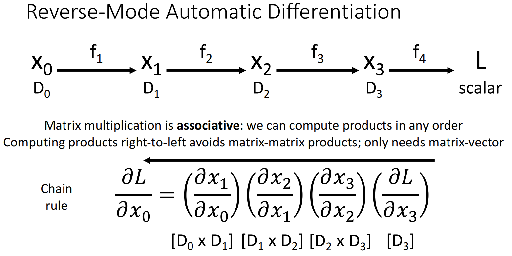

同理，如果是求向量对标量的导数，我们可以正向求．

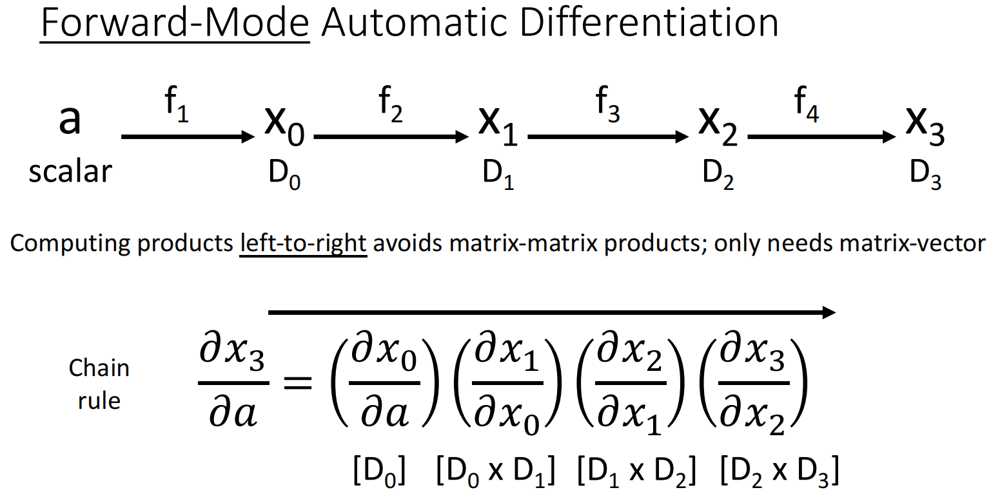

### 高阶导数
仅作了解即可．
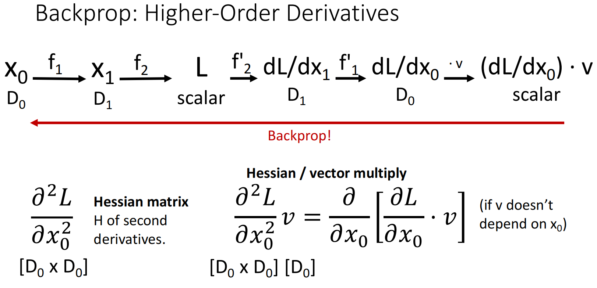

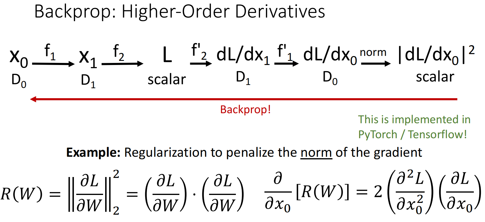
