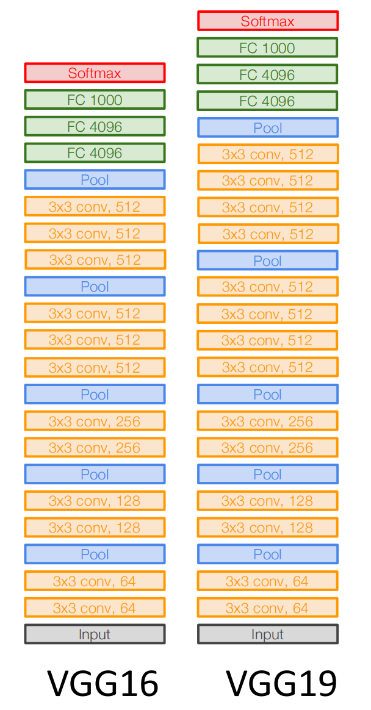
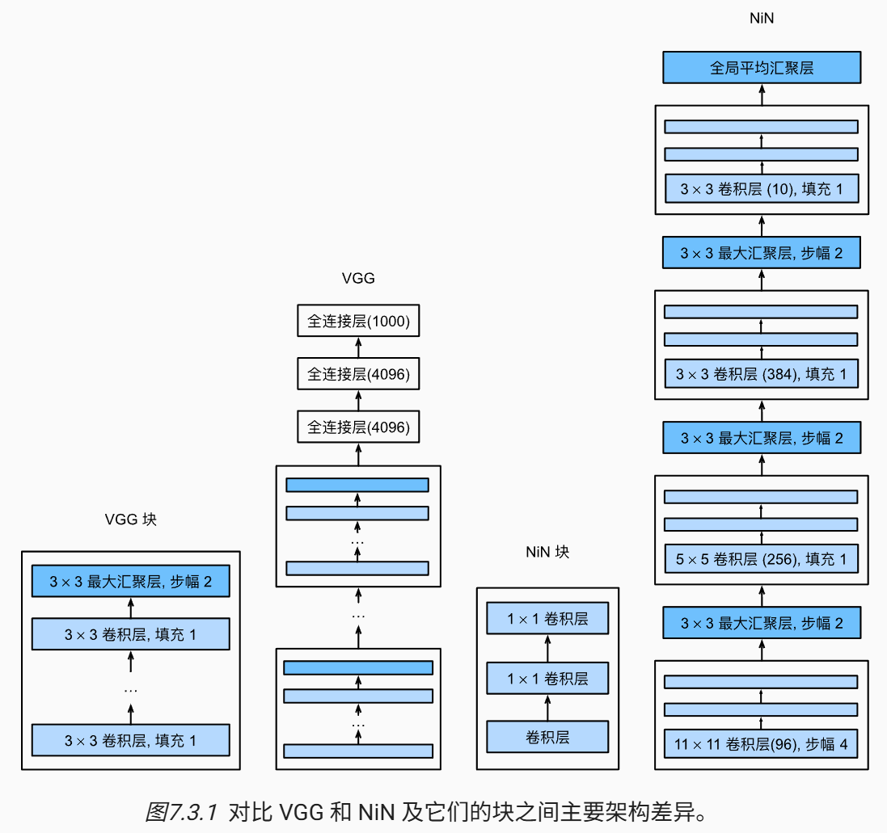

# CNN Architectures

本节课以每年的 ImageNet比赛为线索，介绍CNN架构的发展历史．

推荐阅读：[现代卷积神经网络](https://zh.d2l.ai/chapter_convolutional-modern/index.html)

## [AlexNet](https://proceedings.neurips.cc/paper_files/paper/2012/file/c399862d3b9d6b76c8436e924a68c45b-Paper.pdf)

AlexNet 是第一个使用GPU训练的深度卷积神经网络，其与 LeNet 设计理念非常相似，但要更深，且使用 ReLU 激活与最大池化．


除此之外，AlexNet 使用了 [Dropout](lec9-10.html#142-dropout) 控制模型复杂度，[Data Argumentation](lec9-10.html#143-data-argumentation) 增强图像数据．

## [VGG](https://arxiv.org/abs/1409.1556)

牛津大学 Visual Geometry Group 的 **VGG 网络**实现了使用**块**的网络．块是一个神经网络层序列，例如在 AlexNet 中是卷积层、激活函数、池化层．VGG 块使用 $3\times 3$ 卷积核（stride=1，padding=1，可能不止一个）、激活函数、$2\times 2$​ 池化层（padding=2），并且除了第一个块让通道数增加到64外，其他块均让通道数翻倍，直到达到512．

以 VGG16 为例，其由5个 VGG 块与三个全连接层组成，卷积层数量、输出通道数分别为 (2, 64)、(2, 128)、(2, 256)、(3, 512)、(3, 512)．



VGG 的设计理念：两个 $3\times 3$ 的卷积层与一个 $5\times 5$ 的卷积层拥有一样的感受野，但前者只有 $18C_{\text{input}}C_{\text{output}}$ 个参数，而后者有 $25C_{\text{input}}C_{\text{output}}$ 个．因此用简单的卷积层能用更少的参数与计算得到同样的效果．

## [NiN](https://arxiv.org/abs/1312.4400)

上述网络都是通过卷积层与池化层提取空间结构，然后通过全连接层进行处理．**NiN（网络中的网络）**在每个像素的通道上分别使用 MLP，减少了参数量的同时保留了空间结构，并且更不容易过拟合．

对单通道使用 MLP 本质上是 $1\times 1$ 卷积．因此我们可以定义一个 `nin_block`，其在卷积层后接两个 $1\times 1$ 卷积层：

```python
def nin_block(in_channels, out_channels, kernel_size, stride, padding):
    return nn.Sequential(
        nn.Conv2d(in_channels, out_channels, kernel_size, stride, padding),
        nn.ReLU(),
        nn.Conv2d(out_channels, out_channels, kernel_size=1),
        nn.ReLU(),
        nn.Conv2d(out_channels, out_channels, kernel_size=1),
        nn.ReLU()
    )
```

NiN 使用多个 NiN 块，最后的 NiN 块输出通道数等于分类数．此时输出为 $[N,10,H,W]$（以类别数 10 为例），然后通过 Global Average Pooling 对每个通道整张图求平均，得到 $[N,10,1,1]$ 即 $[N,10]$​，后者即为每个类别的得分．



## [GoogLeNet](https://arxiv.org/abs/1409.4842)


## [ResNet](https://arxiv.org/abs/1512.03385)