# Training Neural Networks

## One time setup
### Activation Functions

???+ quote "激活函数图像"

    <div style="text-align: center; margin-top: 15px;">
        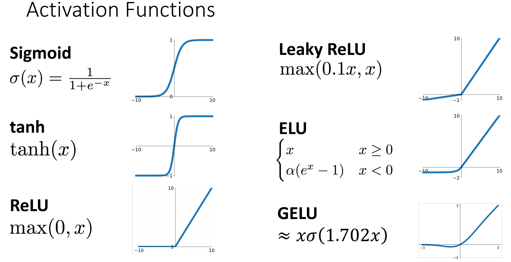
    </div>

Sigmoid $\sigma(x)=\dfrac{1}{1+e^{-x}}$：

+ 当 $|x|$ 过大时梯度消失（主要）
+ 输出永远是正的，导致下一层权重梯度方向受限
+ 计算exp比较贵

tanh：

+ 以0为中心，解决了输出永远为正的问题
+ 但 $|x|$ 过大时梯度仍然消失

ReLU $f(x)=\max(0,x)$​：

+ 在正半轴梯度不会消失
+ 计算十分简单
+ 在实践中，收敛比 sigmoid/tanh 快很多
+ 负半轴梯度为0，如果所有数据都落在负半轴，输出和梯度永远是0，称 **dead ReLU**．

Leakly ReLU $f(x)=\max(\alpha x, x)$：不会出现 dead ReLU 问题

ELU：计算exp比较贵

$$
f(x)=
\begin{cases}
x\quad x\geq 0 \\ \alpha (e^x-1) \quad x <0
\end{cases}
$$

SELU：倍增版本的ELU，参数取值很逆天

GELU $f(x)=x\sigma(1.702x)$：在 Transformer 中常用

!!! abstract "总结"

    + 不要使用 Sigmoid 或 tanh．
    + 一般来讲使用 ReLU 即可．
    + 如果想要 0.1% 数量级的提升，可以试试 Leakly ReLU / ELU / SELU/ GELU．

### Data Preprocessing

将原始数据进行**归一化**处理．可以用如下方法：

<div style="text-align: center; margin-top: 15px;">
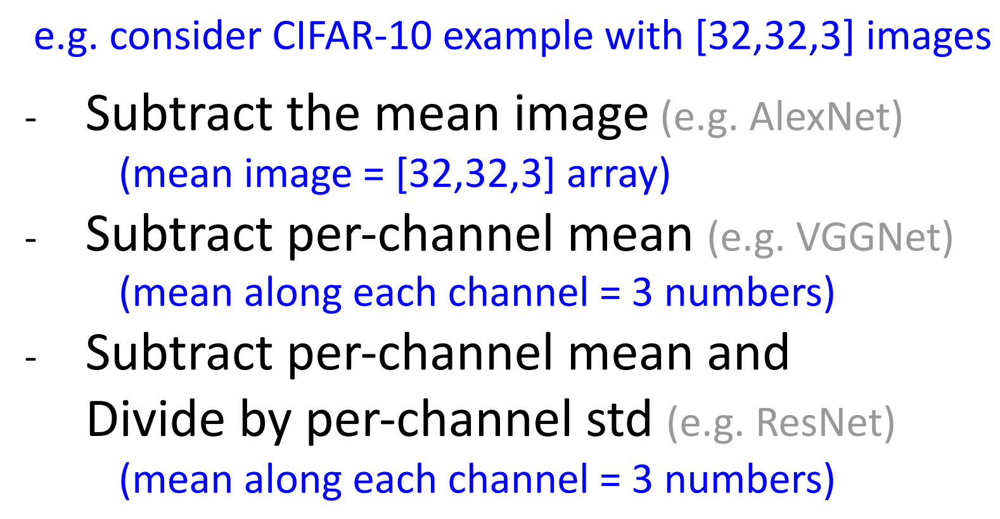
</div>

也可以对数据进行PCA（让不同维度解耦，协方差矩阵变为对角阵）、 Whitening（把每个方向上方差缩放为1，协方差矩阵变为单位阵），不过这两个在图像任务中不常见．

### Weight Initialization

将权重做特定的初始化，使得输入与输出的方差不变．

**Xavier Initialization**：让权重初始化时，采用均值为0、标准差为 $\dfrac{1}{\sqrt{D_{\text{in}}}}$​ 的正态分布．对于卷积，$D_{\text{in}}=K^2\times C_{\text{in}}$​．

```python
W = np.random.randn(Din, Dout) / np.sqrt(Din)
```

如果激活函数使用ReLU，使用 **Kaiming initialization / MSRA initialization**：$\text{std}(W)=\sqrt{\dfrac{2}{D_{\text{in}}}}$．

对于 ResNet，将第一个卷积层 MSRA 初始化，第二个卷积层全部初始化为0．这样每一个残差块输入输出方差不变．

```
x -> conv1 -> ReLU -> conv2 -> F(x)
 \                             /
  -------- shortcut ----------
              |
           x + F(x)
```

### Regularization

**正则化**的核心：训练时添加**噪声/随机性**，测试时把随机性平均/固定（Dropout、BatchNorm都是类似）．

#### Add term to loss

与之前介绍过的一样，使用 L1/L2 正则化、weight decay 等．

#### Dropout

每一次前向传播时随机屏蔽掉一些神经元的数值，一般概率取0.5．强制使网络的特征具有冗余，防止神经元都适应相同的特征．

在测试时，我们希望输出稳定下来，于是将训练时的**期望输出**作为测试输出，也就是不 drop 任何神经元，而是乘以其被 drop 的概率．

```python
p = 0.5 # 神经元参与前向传递的概率

def train_step(X):
  # 以三层神经网络为例
  H1 = np.maximum(0, np.dot(W1, X) + b1)
  U1 = (np.random.rand(*H1.shape) < p) 
  H1 *= U1 # Drop!
  H2 = np.maximun(0, np.dot(W2, H1) + b2)
  U2 = (np.random.rand(*H2.shape) < p)
  H2 *= U2
  out = np,dot(W3, H2) + b3
    
  # 反向传播...
  # 更新参数...

def predict(X):
  H1 = np.maximum(0, np.dot(W1, X) + b1) * p
  H2 = np.maximum(0, np.dot(W2, X) + b2) * p
  out = np,dot(W3, H2) + b3
```

在实际应用中，更常见的是 **Inverted Dropout**：训练时 drop 后除以 p，测试时不动．这样就和其他模型的测试统一了．

```python
# Inverted dropout
p = 0.5 # 神经元参与前向传递的概率

def train_step(X):
  # 以三层神经网络为例
  H1 = np.maximum(0, np.dot(W1, X) + b1)
  # drop mask, notice '/p' !!
  U1 = (np.random.rand(*H1.shape) < p) / p
  H1 *= U1 # Drop!
  H2 = np.maximun(0, np.dot(W2, H1) + b2)
  U2 = (np.random.rand(*H2.shape) < p) / p
  H2 *= U2
  out = np,dot(W3, H2) + b3
  # 反向传播...
  # 更新参数...

def predict(X):
  H1 = np.maximum(0, np.dot(W1, X) + b1)
  H2 = np.maximum(0, np.dot(W2, X) + b2)
  out = np,dot(W3, H2) + b3
```

#### Data Argumentation

将图像增强，可以增加数据数量、提升模型泛化能力．

**Horizontal Flips**：把图片左右翻转．

**Random Crops and Scales**：以 ResNet 为例

+ 训练时：随机选取一个 $L\in [256,480]$，将原图等比缩放使得短边长为 $L$，再截取处 $224\times 224$ 的 patch；
+ 测试时：将原图等比放缩为 $\{224, 256,384,480,640\}$，对于每个尺寸选择10个 $224\times 224$ 的crop，一般为四角+中心，以及他们的翻转．

**Color Jitter**：随机改变亮度、对比度；或者复杂些，对训练集所有 RGB 像素做 PCA，然后沿主成分方向加颜色扰动．

**RandAugment**：组合不同的变换，如旋转、平移、剪切、锐化等．

<div style="text-align: center; margin-top: 15px;">
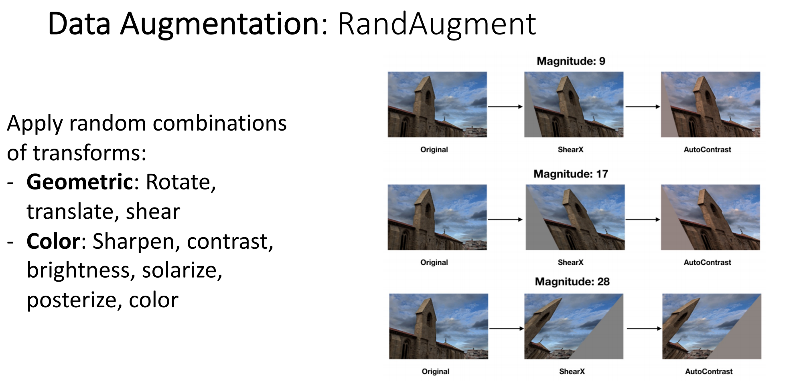
</div>

???+ info "几种少用的正则化方法"

    + DropConnect：随机将神经元之间的连接 drop；测试时使用完整连接．
    + Fractional Pooling：池化层的 Kernel 大小不固定，可以这一块 $2\times 2$ 最大池化后，下一块 $1\times 2$ 最大池化；测试时对不同 sample 的预测做平均．
    + Stochastic Depth：在 ResNet 中随机跳过一些残差块，测试时使用完整网络．这个思想后来在 EfficientNetV2、Vision Transformer 等架构中也常见．
    + Cutout：将图像的某些区域遮住（设为0或者噪音）；测试时用完整图．
    + Mixup：将两个图像按比例混合，然后 label 设为两个类别的占比（如cat 0.4，dog 0.6）；
    + Cutmix：不是整张图线性混合，而是把一张图的一块区域替换成另一张图的 crop，标签按面积比例混合；
    + Label Smoothing：不再把正确类别设成 100%，而是比如 cat：90%，其他类别分一点概率。这样可以避免模型过度自信．

在实际使用时，大型全连接层可以用 Dropout；图像任务里用 Data Augmentation；CNN 也常用 BatchNorm．其他正则化方法如果想再挤一点性能可以使用．

## Training dynamics

### Learning Rate Schedule

**学习率调度**的核心：一开始用较大学习率快速下降，后面逐渐减小学习率精细收敛．

**Step Decay**：在固定 epoch 降低学习率．

<div style="text-align: center; margin-top: 15px;">
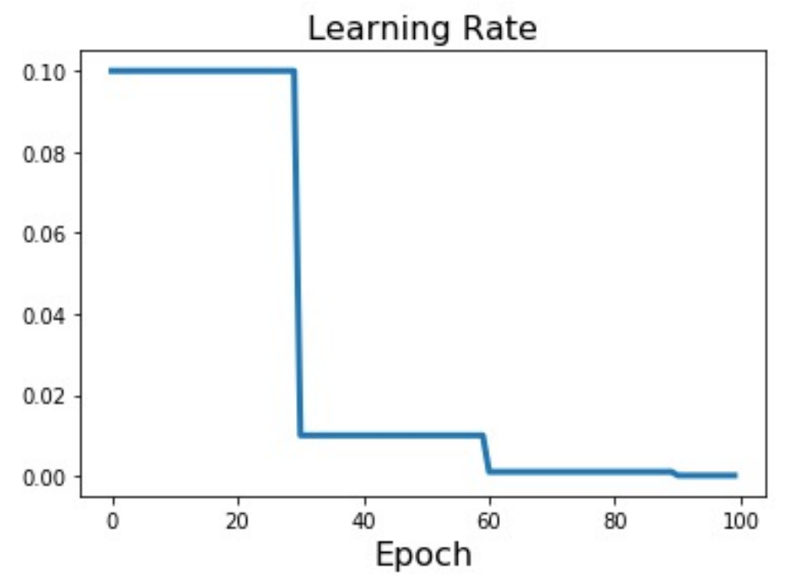
</div>

**Cosine Decay**：按照余弦函数，从初始学习率逐步下降到0．

<div style="text-align: center; margin-top: 15px;">
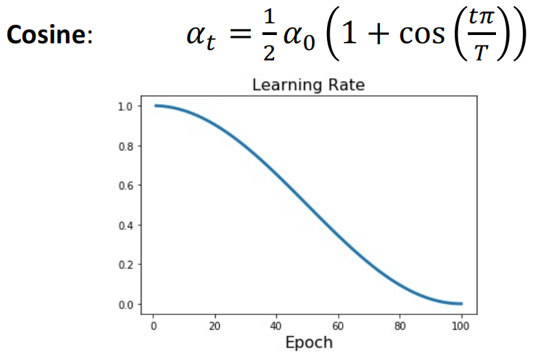
</div>

**Linear Decay**：线性衰减 $\alpha_t = \alpha_0(1-\dfrac{t}{T})$．

**Inverse sqrt decay**：$\alpha_t = \dfrac{\alpha_0}{\sqrt{t}}$．

训练策略：**Early Stopping**，当验证集的准确率降低时，停止训练模型．

### Choosing Hyperparameters

**Grid Search**：为每个超参数选择几个值 （搜索空间通常是对数线性的），计算这个超参数网格中所有可能的选择．

**Random Search**：为超参数的值划定一个范围 （通常同样在对数空间上），超参数在空间中均匀随机分布

<div style="text-align: center; margin-top: 15px;">
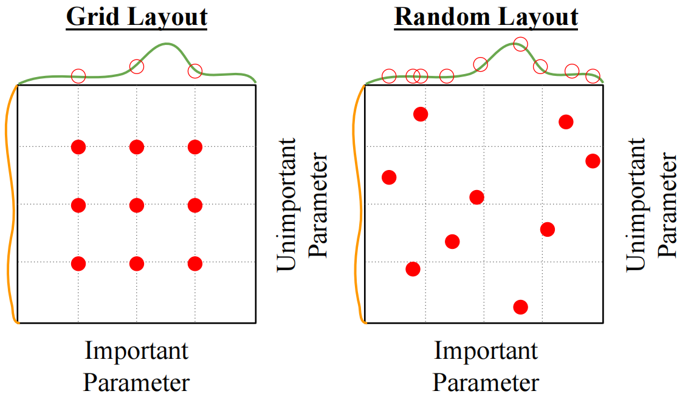
</div>

没有大量算力的情况下选择超参数的方法：

> 1.Check initial loss

检查模型刚初始化时的 loss 是否合理，如使用 softmax 分类，随机初始化时初始 loss 应该接近 $\ln C$．这一步建议关掉 weight decay．

> 2.Overfit a small sample

拿 5-10 个训练数据，关掉正则化，尝试把这小部分数据训练到接近 100%，确认模型至少有能力拟合一小块数据．

> 3.Find LR that makes loss go down

用完整训练集，打开一个小的 weight decay，然后找一个能让 loss 在前约 100 iterations 明显下降的 learning rate．LR 可以先尝试 $[10^{-1},10^{-2},10^{-3},10^{-4}]$．

> 4.Coarse grid, train for 1-5 epochs

在 Step 3 找到的大致 learning rate 附近，做粗略搜索；可以尝试 learning rate 与 weight decay 的不同组合．

> 5.Refine grid, train longer

从 Step 4 里面挑表现好的组合，在更小范围内细调．可以训练的更久，如 10-20 epochs．

> 6.Look at learning curves

观察训练曲线，判断哪里出了问题．

???+ info "曲线对应问题"

    === "权重初始化"
<div style="text-align: center; margin-top: 15px;">
        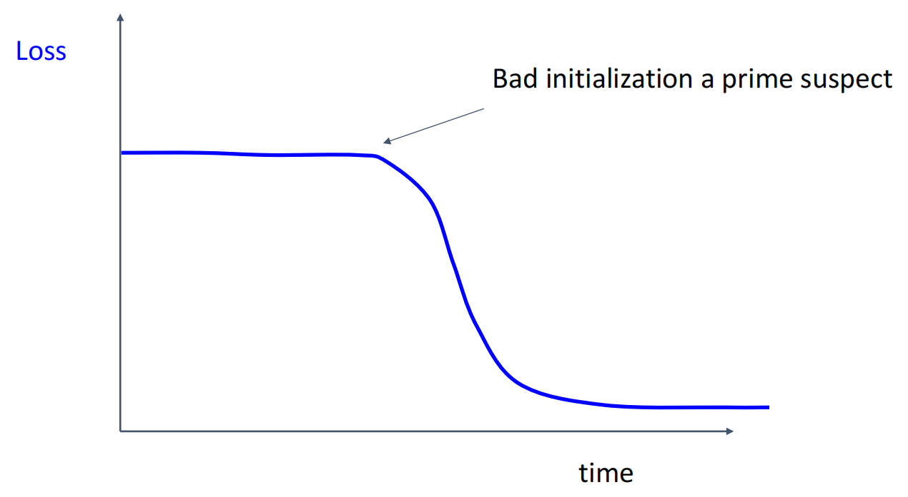
</div>

    === "学习率不衰减"
<div style="text-align: center; margin-top: 15px;">
        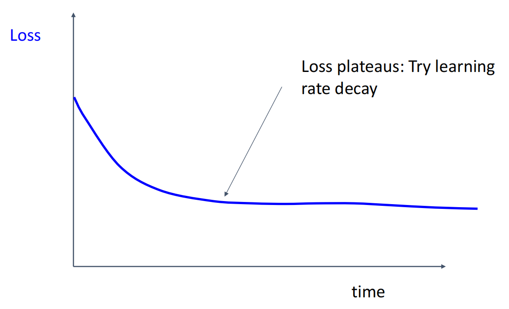
</div>

    === "学习率衰减太快"
<div style="text-align: center; margin-top: 15px;">
        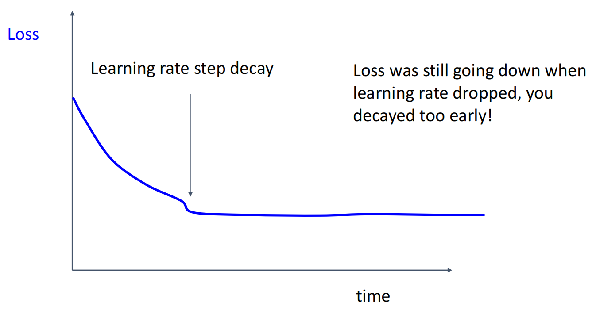
</div>

    === "训练不够久"
<div style="text-align: center; margin-top: 15px;">
        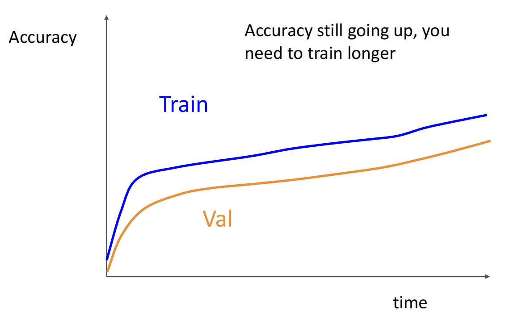
</div>

    === "过拟合"
<div style="text-align: center; margin-top: 15px;">
        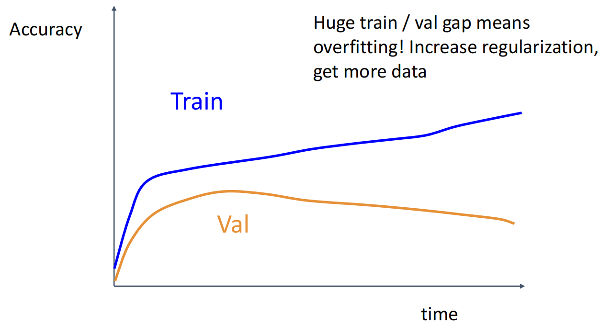
</div>

    === "欠拟合"
<div style="text-align: center; margin-top: 15px;">
        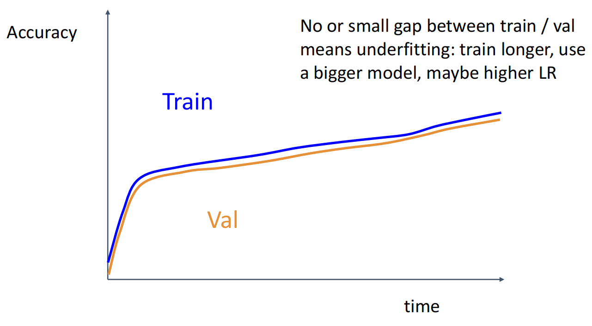
</div>

> 7.回到第 5 步，反复迭代直到找到最佳超参数．

## After training
### Model Ensemble

训练多个独立模型，测试时平均它们的预测概率分布再选出分类结果，大概能获得 2% 的额外性能．

!!! tip "tips"

    1. 不用真的训练多个模型，而是在一个模型训练过程中保存多个 checkpoint，用这些 checkpoint 做 ensemble．
    
    2. 在测试时使用参数的动态平均而不是最后的参数．
    ```python
    while True:
        data_batch = dataset.sample_data_batch()
        loss = network.forward(data_batch)
        dx = network.backward()
        x += -learning_rate * dx
        x_test = 0.995 * x_test + 0.005 * x
    ```

###  Transfer Learning

由于 CNN 的前面几层主要起到特征提取的通用作用，因此当数据量较小时，可以拿现成的 CNN，将前面的层直接拿来用，把最后的分类层拿去训练．

**Fine-Tuning**：如果我们拥有较大的数据集，我们可以在原来网络的基础上进行微调训练，冻结层数较低的层以节省训练资源；建议以原始学习率的 1/10 进行训练．
