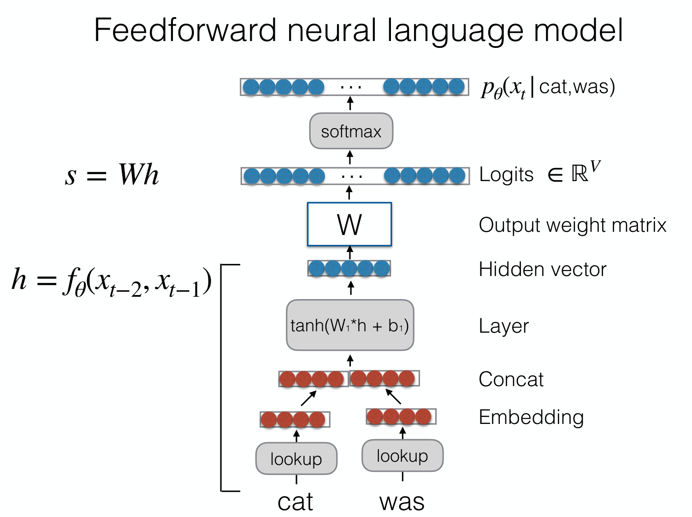

## Learned Representations

Bag of Words（BoW）：对一个 seq，将所有 token 的 one-hot 向量相加，得到出现频率向量，将文本向量化．

CBoW：改用 token 词向量表示而非 one-hot

Deep CBow：CBoW + MLP

## Language Model

Language Model：在所有 sequences 上的概率分布

+ Score sequences
+ Clasify text
+ Generate sequences（& Conditional generation：如机器翻译）

Auto-regressive Language Models：$P(X)=\prod_{t=1}^TP(x_t|x_1,\dots, x_{t-1})$．

### Bigram models: 1-token context

$$
P(X)\approx \prod_{t=1}^T p_{\theta}(x_t| x_{t-1})
$$

转化为对数：

$$
\log P(X)=\sum_{i=1}^{|X|}\log P(x_i)
$$

在训练集中进行计数，得到概率
$$
p(x_t| x_{t-1})=\frac{\text{count}(x_{t-1},x_t)}{\sum_{x'}\text{count}(x_{t-1},x')}
$$

生成时，是根据当前的字符，用 multinomial（按概率随机抽样）生成．

对生成结果进行评估：

+ Log-likelihood：最大越好，也就是生成的文本概率越高越好．

$$
LL(X_{\mathrm{test}})=\sum_{X \in X_{\mathrm{test}}}\log P(X)
$$

​	长度不同，则需要对 token 求平均：Per-word Log likelihood

$$
WLL(X_{\mathrm{test}})
=
\frac{1}{\sum_{X \in X_{\mathrm{test}}}|X|}
\sum_{X \in X_{\mathrm{test}}}\log P(X)
$$

+ Perplexity：困惑度，越低越好．

$$
PPL(X_{\mathrm{test}})
=
e^{-WLL(X_{\mathrm{test}})}
$$

### Ngram models

类似 bigram，只是上下文变成 $n - 1$ 个 token．问题是 n 大了很多上下文在训练集根本没出现过导致概率为 0．

于是引入 smoothing（概率总和还是 1，于是分母加上 $|V|$）：

$$
p(x_t \mid c)
=
\frac{1+\operatorname{count}(c,x_t)}
{|V|+\sum_{x'}\operatorname{count}(c,x')}
$$

### Neural language model

使用前馈神经网络来计算条件概率，过程如图：

好处：可以把相似的词学习到接近的词向量，这是 n-gram 做不到的；但它仍然做不到长距离依赖．
