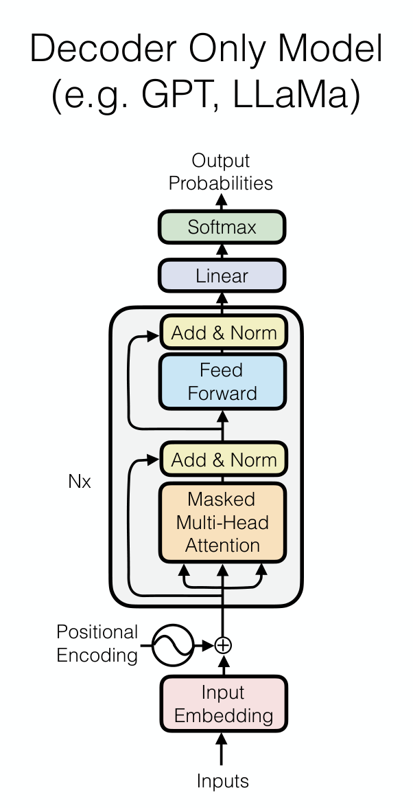

## Learned Representations

Bag of Words（BoW）：对一个 seq，将所有 token 的 one-hot 向量相加，得到出现频率向量，将文本向量化．

CBoW：改用 token 词向量表示而非 one-hot

Deep CBow：CBoW + MLP

## Language Model

Language Model：在所有 sequences 上的概率分布

+ Score sequences
+ Clasify text
+ Generate sequences（& Conditional generation：如机器翻译）

Auto-regressive Language Models：$P(X)=\prod_{t=1}^TP(x_t|x_1,\dots, x_{t-1})$．

### Bigram models: 1-token context

$$
P(X)\approx \prod_{t=1}^T p_{\theta}(x_t| x_{t-1})
$$

转化为对数：

$$
\log P(X)=\sum_{i=1}^{|X|}\log P(x_i)
$$

在训练集中进行计数，得到概率
$$
p(x_t| x_{t-1})=\frac{\text{count}(x_{t-1},x_t)}{\sum_{x'}\text{count}(x_{t-1},x')}
$$

生成时，是根据当前的字符，用 multinomial（按概率随机抽样）生成．

对生成结果进行评估：

+ Log-likelihood：最大越好，也就是生成的文本概率越高越好．

$$
LL(X_{\mathrm{test}})=\sum_{X \in X_{\mathrm{test}}}\log P(X)
$$

​	长度不同，则需要对 token 求平均：Per-word Log likelihood

$$
WLL(X_{\mathrm{test}})
=
\frac{1}{\sum_{X \in X_{\mathrm{test}}}|X|}
\sum_{X \in X_{\mathrm{test}}}\log P(X)
$$

+ Perplexity：困惑度，越低越好．

$$
PPL(X_{\mathrm{test}})
=
e^{-WLL(X_{\mathrm{test}})}
$$

### Ngram models

类似 bigram，只是上下文变成 $n - 1$ 个 token．问题是 n 大了很多上下文在训练集根本没出现过导致概率为 0．

于是引入 smoothing（概率总和还是 1，于是分母加上 $|V|$）：

$$
p(x_t \mid c)
=
\frac{1+\operatorname{count}(c,x_t)}
{|V|+\sum_{x'}\operatorname{count}(c,x')}
$$

### Neural language model

使用前馈神经网络来计算条件概率，过程如图：

好处：可以把相似的词学习到接近的词向量，这是 n-gram 做不到的；但它仍然做不到长距离依赖．

## Transformer

之前主要学习 Encoder-Decoder Transformer，而现在常见的 GPT、LLama 架构都属于 Decoder-only Transformer．

## LLama

|             	  | Vaswani et al. | LLama | LLama2 |
| -------------- | ---- | ---- | ---- |
| Norm Position       | Post | Pre | Pre |
| Norm Type           | LayerNorm | RMSNorm | RMSNorm |
| Non-linearity       | ReLU | SwiGLU | SwiGLU |
| Positional Encoding | Sinusoidal | RoPE | RoPE |
| Attention           | Multi-head | Multi-head | Grouped-query |

### Rotary Positional Encodings

### Pre-Norm

### RMSNorm

### GroupQuery

## Pretraining

使用数据预训练得到 Base Model，再用于不同的任务上

+ Prompting：靠描述任务，直接使用模型执行任务
+ Fine-tune：微调模型从而执行特定任务

预训练模型：BERT、GPT-3、Llama、DeepSeek-v3；模型主要被以下因素影响：

+ Architecture
+ Task
+ Data
+ Hyper-parameters

### Task

**Masked Language Modeling**：把原句中的一部分 token 损坏或遮住，让模型根据可见上下文预测被遮住的 token．典型模型是 BERT

**Autoregressive Language Modeling**：根据前文预测下一个 token．典型模型是 GPT、Llama

### Data

Date Factors：Quantity、Quality、Coverage

**Quantity**：

**Quality**：

Web data：Common Crawl $\to$ Extraction $\to$ Filtering $\to$ Decup $\to$ Data

+ Extraction：HTML to text，删去模板，保留 Latex、Code
+ Filtering：过滤掉不想要的文本，如语言不对、短行过多
+ Decup：删除重复文本，fuzzy strategy：minhash

**Coverage**：数据分布决定模型分布，想要模型哪方面强就需要这方面的更多数据．

classifier filtering：训练一个分类器识别想要的数据，再过滤掉不想要的数据

