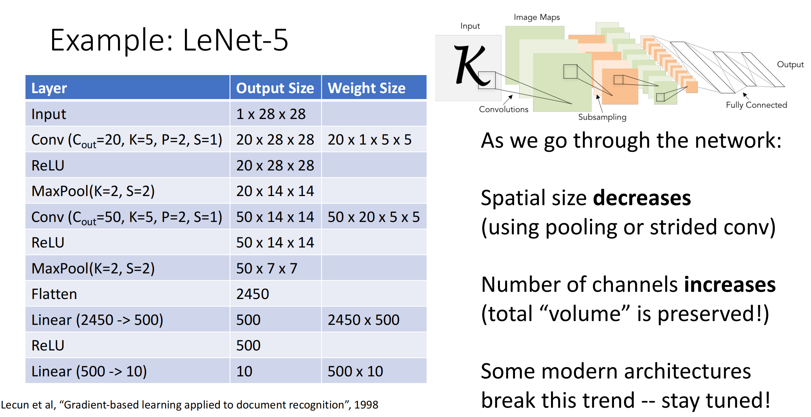
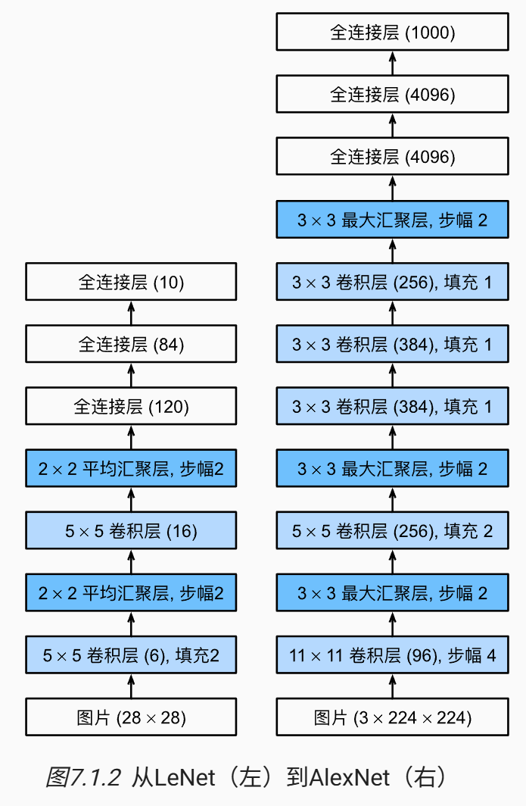

# Image Classification

本节按 ImageNet 竞赛和经典论文的线索，整理 CNN 图像分类架构从 AlexNet 到 ResNet 的演进．

## LeNet

LeNet 是最早发布的卷积神经网络之一，因其在计算机视觉任务中的高效性能而受到广泛关注．

其包含2个卷积块、3个全连接层．其中每个卷积块的基本单元是一个卷积层、一个激活函数、一个池化层．原始的 LeNet 采用 Sigmoid 激活与平均池化，而现在通常使用 ReLU 激活与最大池化．我们给出最初的 LeNet 实现代码，以及课程修改后的 LeNet：

```python
import torch
from torch import nn

net = nn.Sequential(
    # 第一个卷积块
    nn.Conv2d(1, 6, kernel_size=5, padding=2), nn.Sigmoid(),
    nn.AvgPool2d(kernel_size=2, stride=2),
    # 第二个卷积块
    nn.Conv2d(6, 16, kernel_size=5), nn.Sigmoid(),
    nn.AvgPool2d(kernel_size=2, stride=2),
    # 三个全连接层
    nn.Flatten(),
    nn.Linear(16 * 5 * 5, 120), nn.Sigmoid(),
    nn.Linear(120, 84), nn.Sigmoid(),
    nn.Linear(84, 10))

# 其对应输出维度（Batch Size = 1）
Conv2d output shape:         torch.Size([1, 6, 28, 28])
Sigmoid output shape:        torch.Size([1, 6, 28, 28])
AvgPool2d output shape:      torch.Size([1, 6, 14, 14])
Conv2d output shape:         torch.Size([1, 16, 10, 10])
Sigmoid output shape:        torch.Size([1, 16, 10, 10])
AvgPool2d output shape:      torch.Size([1, 16, 5, 5])
Flatten output shape:        torch.Size([1, 400])
Linear output shape:         torch.Size([1, 120])
Sigmoid output shape:        torch.Size([1, 120])
Linear output shape:         torch.Size([1, 84])
Sigmoid output shape:        torch.Size([1, 84])
Linear output shape:         torch.Size([1, 10])
```

<div style="text-align: center; margin-top: 15px;">

</div>

## [AlexNet](https://proceedings.neurips.cc/paper_files/paper/2012/file/c399862d3b9d6b76c8436e924a68c45b-Paper.pdf)

AlexNet 是第一个使用GPU训练的深度卷积神经网络，其与 LeNet 设计理念非常相似，但要更深，且使用 ReLU 激活与最大池化．

<div style="text-align: center; margin-top: 15px;">

</div>

除此之外，AlexNet 使用了 Dropout 控制模型复杂度，Data Augmentation 增强图像数据。

## [VGG](https://arxiv.org/abs/1409.1556)

牛津大学 Visual Geometry Group 的 **VGG 网络**实现了使用**块**的网络．块是一个神经网络层序列，例如在 AlexNet 中是卷积层、激活函数、池化层．VGG 块使用 $3\times 3$ 卷积核（stride=1，padding=1，可能不止一个）、激活函数、$2\times 2$​ 池化层（padding=2），并且除了第一个块让通道数增加到64外，其他块均让通道数翻倍，直到达到512．

以 VGG16 为例，其由5个 VGG 块与三个全连接层组成，卷积层数量、输出通道数分别为 $(2, 64)、(2, 128)、(2, 256)、(3, 512)、(3, 512)$．

<div style="text-align: center; margin-top: 15px;">

</div>

VGG 的设计理念：两个 $3\times 3$ 的卷积层与一个 $5\times 5$ 的卷积层拥有一样的感受野，但前者只有 $18C_{\text{input}}C_{\text{output}}$ 个参数，而后者有 $25C_{\text{input}}C_{\text{output}}$ 个．因此用简单的卷积层能用更少的参数与计算得到同样的效果．

## [NiN](https://arxiv.org/abs/1312.4400)

上述网络都是通过卷积层与池化层提取空间结构，然后通过全连接层进行处理．**NiN（网络中的网络）**在每个像素的通道上分别使用 MLP，减少了参数量的同时保留了空间结构，并且更不容易过拟合．

### NiN Block

对单通道使用 MLP 本质上是 $1\times 1$ 卷积．因此我们可以定义一个 `nin_block`，其在卷积层后接两个 $1\times 1$​ 卷积层：

```python
def nin_block(in_channels, out_channels, kernel_size, stride, padding):
    return nn.Sequential(
        nn.Conv2d(in_channels, out_channels, kernel_size, stride, padding),
        nn.ReLU(),
        nn.Conv2d(out_channels, out_channels, kernel_size=1),
        nn.ReLU(),
        nn.Conv2d(out_channels, out_channels, kernel_size=1),
        nn.ReLU()
    )
```

### GAP

NiN 使用多个 NiN 块，最后的 NiN 块输出通道数等于分类数．此时输出为 $[N,10,H,W]$（以类别数 10 为例），然后通过 **Global Average Pooling（全局平均池化，GAP）**对每个通道整张图求平均，得到 $[N,10,1,1]$ 即 $[N,10]$​，后者即为每个类别的得分．这样的好处是避免了 FC 层，减少了大量的参数．

<div style="text-align: center; margin-top: 15px;">

</div>
## [GoogLeNet](https://arxiv.org/abs/1409.4842)

GoogLeNet架构图：

<div style="text-align: center; margin-top: 15px;">

</div>


### Aggressive Stem

在开始阶段，GoogLeNet 使用了激进的下采样（$7\times 7$ 卷积、$3\times 3$ 最大池化），使得数据大小降低，参数量大量减少．

### Inception

GoogLeNet 使用了含有并行路径的 **Inception 块**，从不同空间大小中提取信息．单个块架构如图所示：

<div style="text-align: center; margin-top: 15px;">

</div>

中间两条通道的 $1\times 1$ 卷积是为了减少通道数，从而减少第二个卷积层的参数量．四条路径都通过合适的 padding 使输入和输出的大小一致．最后将四条线路的输出在通道维度上合并（通常输出为 $[N, C, H,W]$​，按通道合并即为 dim=1），构成 Inception 块的输出．

```python
class Inception(nn.Module):
    # c1--c4是每条路径的输出通道数
    def __init__(self, in_channels, c1, c2, c3, c4, **kwargs):
        super(Inception, self).__init__(**kwargs)
        # 线路1，单1x1卷积层
        self.p1_1 = nn.Conv2d(in_channels, c1, kernel_size=1)
        # 线路2，1x1卷积层后接3x3卷积层
        self.p2_1 = nn.Conv2d(in_channels, c2[0], kernel_size=1)
        self.p2_2 = nn.Conv2d(c2[0], c2[1], kernel_size=3, padding=1)
        # 线路3，1x1卷积层后接5x5卷积层
        self.p3_1 = nn.Conv2d(in_channels, c3[0], kernel_size=1)
        self.p3_2 = nn.Conv2d(c3[0], c3[1], kernel_size=5, padding=2)
        # 线路4，3x3最大汇聚层后接1x1卷积层
        self.p4_1 = nn.MaxPool2d(kernel_size=3, stride=1, padding=1)
        self.p4_2 = nn.Conv2d(in_channels, c4, kernel_size=1)

    def forward(self, x):
        p1 = F.relu(self.p1_1(x))
        p2 = F.relu(self.p2_2(F.relu(self.p2_1(x))))
        p3 = F.relu(self.p3_2(F.relu(self.p3_1(x))))
        p4 = F.relu(self.p4_2(self.p4_1(x)))
        # 在通道维度上连结输出
        return torch.cat((p1, p2, p3, p4), dim=1)
```

### GAP

与 NiN 相同，GoogLeNet 在最后使用一个 GAP + $(1024\to 10)$​ 的全连接层来实现分类而不是多个全连接层，减少了参数数量．

### Auxiliary Classifiers

由于网络太深，早期梯度传播困难，其在中间层添加辅助分类器，其对图像进行分类，并与最终的分类结果一起计算 loss 并优化．

## [ResNet](https://arxiv.org/abs/1512.03385)

理论上来说，更深层网络的效果肯定比浅层更好，因为其完全可以复制浅层网络，并在多出来的网络使用恒等变换．但实际上深层网络更难优化，导致学习效果可能不如浅层网络．为了解决这个问题，我们需要让网络学习恒等函数变得容易．针对这一问题，何恺明等人提出了**残差网络（ResNet）**．

### Residual Block

与之前的网络类似，残差网络堆叠**残差块**来实现功能．如图所示，残差块的核心设计理念是让网络学习目标输出 $f(x)$ 与输入 $x$ 的差 $f(x)-x$．在这种情况下，只需要将网络参数置零即可轻松地学习到恒等变换．同时，只学习变化量会比学习全量 $f(x)$ 更轻松．

<div style="text-align: center; margin-top: 15px;">

</div>

ResNet-18/34 的残差块设计如下，当学习结果 $f(x)-x$ 通道数与 $x$ 不同时，需要对 $x$ 接一层 $1\times 1$ 卷积来改变通道数，才能相加．

<div style="text-align: center; margin-top: 15px;">

</div>

### Bottleneck Block

ResNet-50/101/152 的残差块使用的是 Bottleneck Block．其先使用 $1\times 1$ 卷积压缩通道数，再使用 $3\times 3$ 卷积提取空间信息，最后再使用 $1\times 1$ 卷积将通道数还原．将昂贵的 $3\times 3$​ 卷积放在低通道数里做，能减小参数量，更适合构建深层网络．

### ResNet Model

以 ResNet-18为例，其主要由三个类型组成：

+ Stem部分：$7\times 7$ 卷积、BatchNorm、$3\times 3$ 最大池化．
+ Res Stage：由多个 Res Block 组成，第一个 Block 需要负责变化通道数，后面的不需要．ResNet-18 由4个 Stage 组成，每个 Stage 有2个 Block．其中第一个 Stage 不改变通道数，即代码中的 `first_stage`．
+ OutPut：使用 GAP 与全连接层来输出分类结果．


<div style="text-align: center; margin-top: 15px;">

</div>

???+ code "代码实现"

    ```python
    import torch
    from torch import nn
    from torch.nn import functional as F
    
    # Res Block
    class Residual(nn.Module):
        def __init__(self, input_channels, num_channels,
                     use_1x1conv=False, strides=1):
            super().__init__()
            self.conv1 = nn.Conv2d(input_channels, num_channels,
                                   kernel_size=3, padding=1, stride=strides)
            self.conv2 = nn.Conv2d(num_channels, num_channels,
                                   kernel_size=3, padding=1)
            if use_1x1conv:
                self.conv3 = nn.Conv2d(input_channels, num_channels,
                                       kernel_size=1, stride=strides)
            else:
                self.conv3 = None
            self.bn1 = nn.BatchNorm2d(num_channels)
            self.bn2 = nn.BatchNorm2d(num_channels)
    
        def forward(self, X):
            Y = F.relu(self.bn1(self.conv1(X)))
            Y = self.bn2(self.conv2(Y))
            if self.conv3:
                X = self.conv3(X)
            Y += X
            return F.relu(Y)
    
    # Res Stage
    def res_stage(input_channels, num_channels, num_residuals, first_stage=False):
        blk = []
        for i in range(num_residuals):
            # 如果不是第一个 Stage，那么第一个 Block 需要改变通道数并下采样
            # 同时要用 1*1 卷积改变 x 通道数
            if i == 0 and not first_stage:
                blk.append(Residual(input_channels, num_channels,
                                    use_1x1conv=True, strides=2))
            else:
                blk.append(Residual(num_channels, num_channels))
        return blk
    
    # Net
    stem = nn.Sequential(nn.Conv2d(3, 64, kernel_size=7, stride=2, padding=3),
                       nn.BatchNorm2d(64), nn.ReLU(),
                       nn.MaxPool2d(kernel_size=3, stride=2, padding=1))
    
    b1 = nn.Sequential(*resnet_block(64, 64, 2, first_block=True))
    b2 = nn.Sequential(*resnet_block(64, 128, 2))
    b3 = nn.Sequential(*resnet_block(128, 256, 2))
    b4 = nn.Sequential(*resnet_block(256, 512, 2))
    
    net = nn.Sequential(stem, b1, b2, b3, b4,
                        nn.AdaptiveAvgPool2d((1,1)),
                        nn.Flatten(), nn.Linear(512, 10))
    ```
    
    每一层的张量维度为：
    
    ```python
    Sequential output shape:     torch.Size([1, 64, 56, 56])
    Sequential output shape:     torch.Size([1, 64, 56, 56])
    Sequential output shape:     torch.Size([1, 128, 28, 28])
    Sequential output shape:     torch.Size([1, 256, 14, 14])
    Sequential output shape:     torch.Size([1, 512, 7, 7])
    AdaptiveAvgPool2d output shape:      torch.Size([1, 512, 1, 1])
    Flatten output shape:        torch.Size([1, 512])
    Linear output shape:         torch.Size([1, 10])
    ```
