# Object Detection

## Task Definition

**Task**：输入原始图像，输出带有边界框与对象类别的图像

+ Input：简单的 RGB 图像
+ Output：检测对象的集合，每一个检测对象包含对象的类别标签和边界框

**Challenge**：

+ 多个输出：一张图像可能会出现多个输出对象
+ 多种输出：不仅要输出 What，还要输出 Where
+ 大图像：分类问题一般在 224 * 224 图像上，而目标检测一般在 800 * 600

> [!success] Other Definitions
>
> **Bounding Boxes**（边界框）：一般是横平竖直的
>
> 

> 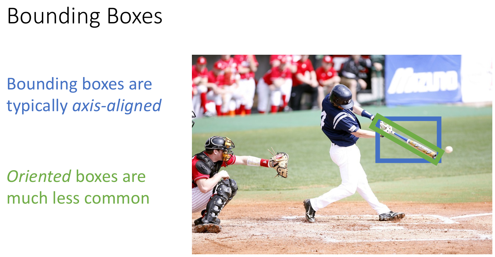
> 

>
> **Modal vs Amodal Boxes**：前者为只检测图像可见的部分；后者会一起检测被遮挡的部分
>
> 

> 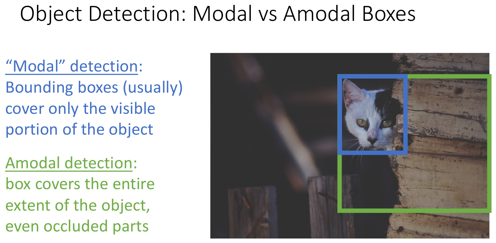
> 

>
> **Intersection over Union**（IoU）：预测边界框与 ground-truth 边界框的 交集面积 / 并集面积，用于体现预测与 ground-truth 的差距
>
> 

> 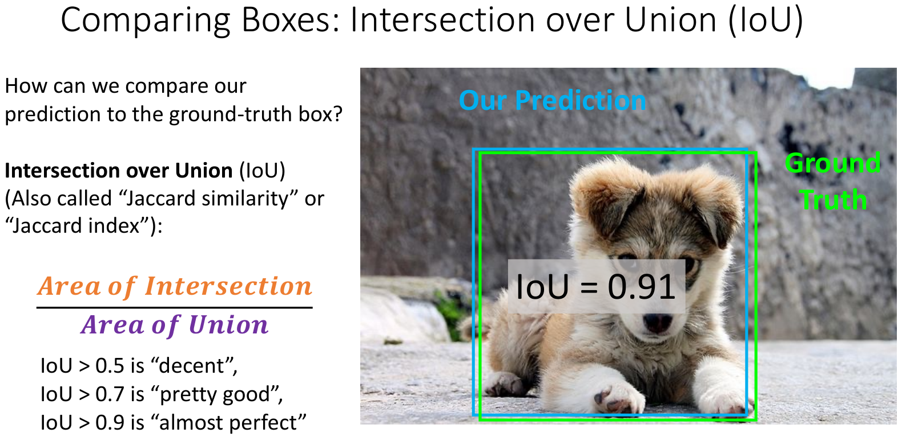
> 

## Detecting

检测单个对象：只需要在分类任务基础上额外学习边界框的参数 $(x,y,w,h)$ 即可．

检测多个对象：朴素想法是使用滑动窗口，找出图像所有子区域再分解成检测单个对象问题．但子区域的个数是 $O(H^2W^2)$​ 的，显然行不通．为了减少需要检测的子区域，可以先找出 Region Proposals（候补区域，在这里也可以成为 RoI：Regions of Interest），一般采用 Selective Search 找出 2000 个候补区域．

## R-CNN

选出候补区域后还需要解决的问题是区域大小不一致．R-CNN（Region Based CNN）先将候选区域压缩成固定的尺寸（如 $224 \times 224$​），再送入 CNN；其需要输出的是区域的对象类别和纠正所需要的变换参数．

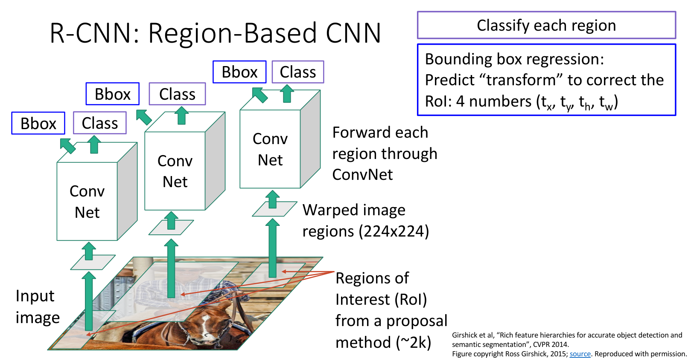

### Box Regression

考虑一个候选区域中心在 $(p_x,p_y)$，宽度高度分别为 $p_w,p_h$，模型会学习四个变换参数：$(t_x,t_y,t_w,t_h)$，最终输出为 

$$
\begin{cases}
b_x=p_x + p_wt_x\\
b_y=p_y + p_ht_y\\
b_w=p_we^{t_w}\\
b_h=p_he^{t_h}
\end{cases}
$$
根据 $(b_x,b_y,b_w,b_h)$ 与 ground truth 的差距，反解学习变换参数．这么设置变换的好处是当变换参数全为 0 时，默认进行的是不变换．

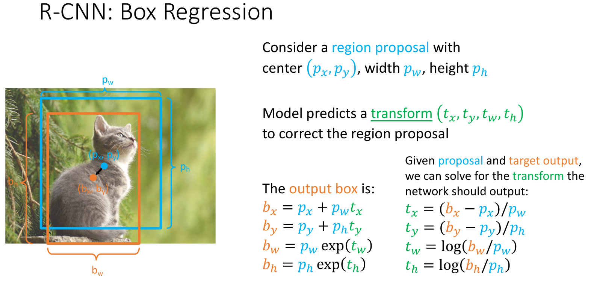

### Training

训练时，对每一个候选区域，首先计算其与所有 ground truth box 的 IoU

+ 存在 > 0.5 的 GT box，那么就将该 GT box 记为该候选区域对应的 GT，将该候选区域记为 Positive
+ 与所有 GT box 都 < 0.3，候选区域记为 Negative（可以看作用于学习背景）
+ 剩下的则为 Neutral，不加入学习（可以认为模棱两可不适合学习）

然后将所有 Positive 和 Negative 的区域压缩为固定尺寸，进入 CNN 学习分类和变换参数．

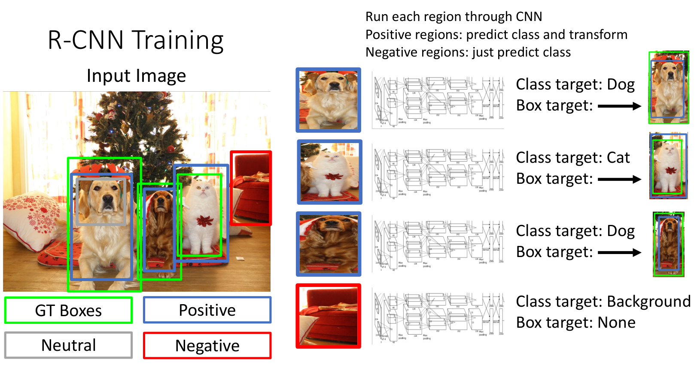

### NMS

由于候选区域多而实际目标少，可能会出现同一个目标但是多个预测框的情况．用NMS（Non-Max Suppression）处理：

+ 把同一类别的预测框按照 confidence score 从大到小排序
+ 取分数最高的框保留，计算其与剩余框的 IoU，如果大于一个阈值（如 0.7）就将后者删去
+ 重复直到剩下的所有框两两 IoU 都低于阈值

NMS 不参与训练 loss 过程，只是 post-processing 输出时用的一个算法．

缺点：如果两个目标靠的很近，可能会误删框．

### mAP

> [!quote]- 机器学习术语
>
> 可以参考 [准确度（precision）、召回率（recall）和PR曲线](https://zhuanlan.zhihu.com/p/581916990)
>
> **True / False, Positive / Negative**：第一个单词表示分类是否正确，第二个单词表示分类的预测结果
>
> - True Positive (TP)：预测为正，实际为正（判断正确）
> - True Negative (TN)：预测为负，实际为负（判断正确）
> - False Positive (FP)：预测为正，实际为负（判断错误）
> - False Negative (FN)：预测为负，实际为正（判断错误）
>
> 准确度：$\text{precision}=\dfrac{TP}{TP+FP}$ 表示预测为这一类的样本中，有多少确实是这一类
>
> 召回率：$\text{recall}=\dfrac{TP}{TP+FN}$ 表示所有实际上是这一类的样本中，有多少被判断出来了

mAP（mean Average Precision）是评价对象检测器的一个算法．

+ 先在测试集上跑一边，并用 NMS 得到输出
+ 对于每一类别，计算 Average Precision = Precision - Recall 曲线下的面积
	1. 把该类别的预测框按照 confidence score 从大到小排序
	2. 按从高到底的顺序将预测框与 ground truth 匹配，如果和某个 GT box 的 IoU 大于阈值（如 0.5），那么这个预测框记为 TP，同时将这个 ground trush 记为被其绑定（不参与后续匹配）；反之则预测框记为 FP．然后计算此时的 Precision 和 Racall，描点
	3. 重复直到所有预测框都经过上述过程，将点连起来计算面积
+ 将所有类别的 AP 取平均得到 mAP，mAP 越高表示预测结果越好

> [!example]- 例子
>
> 假设测试集中一共有 3 个真实 dog box，模型经过 NMS 后输出 5 个 dog detections，按分数排序：
>
> $$
> 0.99,\quad 0.95,\quad 0.90,\quad 0.60,\quad 0.10
> $$
>
> 逐个检查，第 1 个框匹配某个 GT，算 TP：$P=\frac{1}{1}=1,\quad R=\frac{1}{3}$；
>
> 第 2 个框也匹配另一个 GT，算 TP：$P=\frac{2}{2}=1,\quad R=\frac{2}{3}$；
>
> 第 3 个框没匹配到任何 GT，算 FP：$P=\frac{2}{3},\quad R=\frac{2}{3}$；
>
> 第 4 个框没匹配到任何 GT，算 FP：$P=\frac{2}{4},\quad R=\frac{2}{3}$；
>
> 第 5 个框匹配到最后一个 GT，算 TP：$P=\frac{3}{5},\quad R=1$；
>
> 将曲线连起来：
>
> 

> 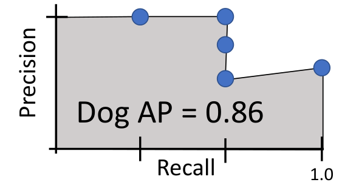
> 

## Fast R-CNN

R-CNN 的问题是 2000 个候选区域许多像素经过了重复的卷积计算，效率很低．

Fast R-CNN 先将整个图像经过卷积得到特征图，再将候选区域从原图映射到特征图上，resize 后进行小的卷积运算，由于计算量很大的 backbone network 只进行了一次，因此效率提升很大．

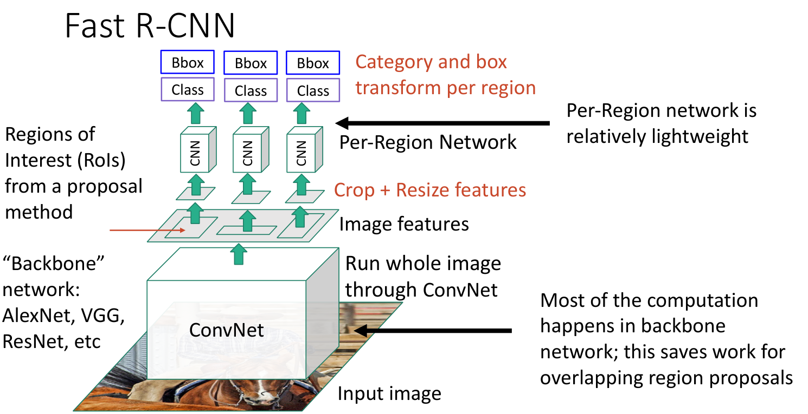

### RoI Pooling

对于有 padding 的卷积，某点在原图中的相对位置与其在特征图的相对位置一样，因此可以将候选区域直接映射到特征图上，问题是映射后不一定在整点上，同时要 resize 到相同大小方便后续 CNN，需要使用 RoI Pooling．

首先将映射后的网格取整，得到整数的网格．接着将网格内划分成后续 CNN 需要的输入形状（这里以 $2\times 2$ 为例子，常用 $7\times 7$ 或 $14\times 14$​）的多个 bin，对每一个 bin 的每一个 channel 做 max pooling．这样就能将所有的候选区域处理到相同大小方便后续接 CNN 分类头．

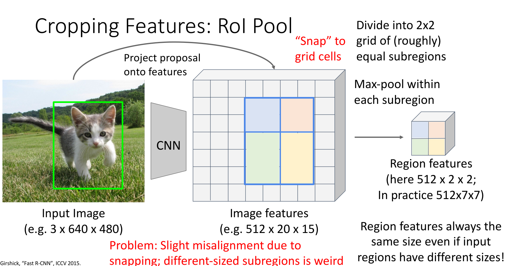

### RoI Align

RoI Pool 的缺点是取整和不同大小的 bin 对一些像素级任务处理不好．RoI Align 投影到特征图后，不进行取整，并且划分 bin 也是完全平均划分．然后每一个 bin 中取若干个采样点，采样点的特征值采用 **Bilinear Interpolation**（双线性插值），用最近四个点的加权平均计算．

公式为 

$$
f_{xy}=\sum_{i,,j}f_{i,j}\max(0,1-|x-x_i|\cdot\max(0, 1-|y-y_j|))
$$

如 

$$
f_{6.5,5.8}=f_{6,5}\cdot 0.5 \cdot 0.2+ f_{7,5}\cdot 0.5 \cdot 0.2+f_{6,6}\cdot 0.5 \cdot 0.8 + f_{7,6}\cdot 0.5 \cdot 0.8
$$
逐 channel 计算采样点的特征值后，再将一个 bin 内的采样点进行逐 channel 的 max pool．

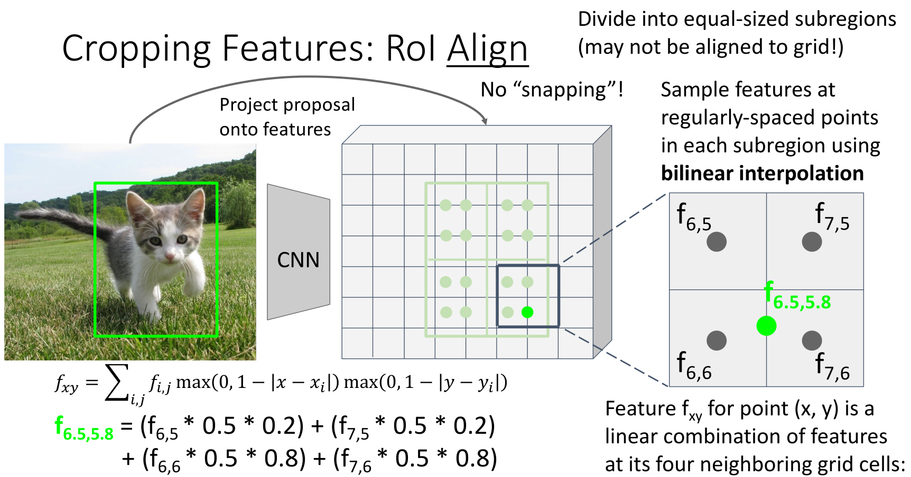

### Comparison

可以看到 Fast R-CNN 比 R-CNN 快了很多．其中主要是 Region Proposal 占用了大量时间（需要在 cpu 上跑），因此引出了后续的 Faster R-CNN．

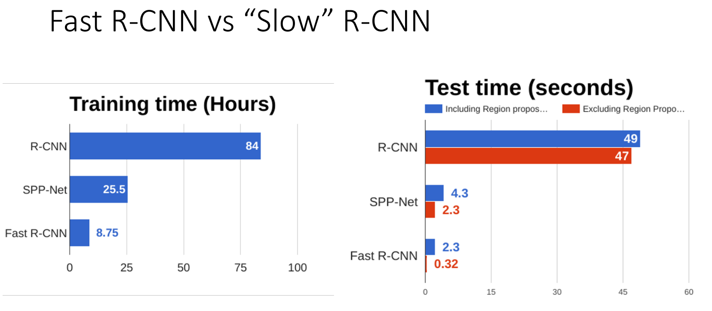

## Faster R-CNN

将耗时的候选区域也由可学习的神经网络 **RPN（Region Proposal Network）**完成：

+ 将特征图中的每一个位置放上多个 anchor boxes
+ 对于每一个 anchor，RPN 预测是否为 object、以及如何变换成 proposal box（变换参数学习同之前的）

也就是说，如果特征图大小为 $C\times H\times W$，每一个位置选取 $K$ 个 anchors，RPN 会输出：

+ $2K\times H\times W$，表示每个 anchor 的 object / not object 分数
+ $4K \times H \times W$，表示每个 anchor 的变换参数

最后选取 object 分数最高的若干个（超参数）经过变换的 anchor 作为 proposal，然后做 NMS 去重，接着送入第二阶段．

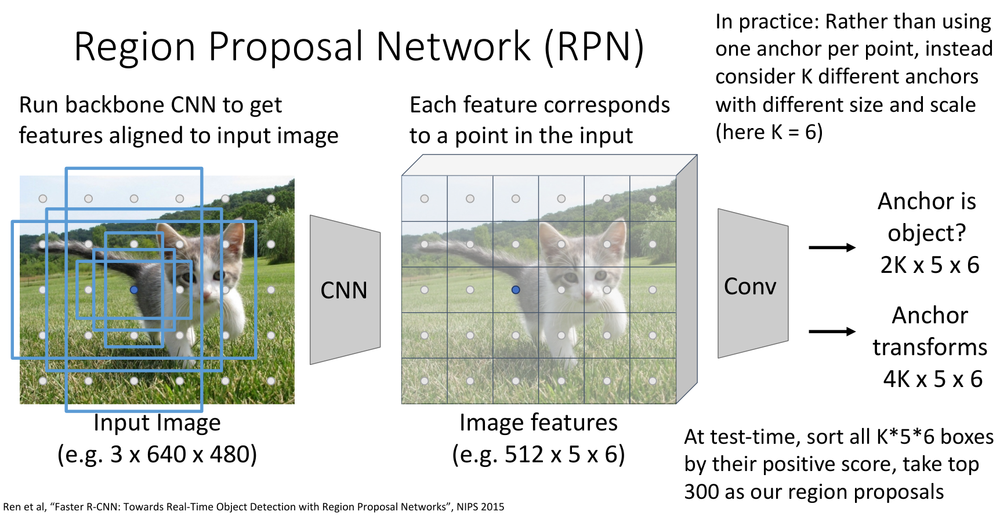

Faster R-CNN 因此是一个 **two-stage detector**．第一阶段每张图跑一次，包括 backbone 和 RPN，用来产生 proposals；第二阶段对每个 proposal 跑一次，包括 RoI Pool/Align、object classification、bbox offset prediction．

最后会产生 4 个 loss，根据这 4 个 loss 来学习：

+ RPN classification: anchor box is object / not an object
+ RPN regression: predict transform **from anchor box to proposal box**
+ Object classification: classify proposals as background / object class
+ Object regression: predict transform **from proposal box to object box**

## Feature Pyramid Netword

目标检测里同一类物体可能有不同尺度．比如同样是人，近处的人很大，远处的人很小；检测器如果只在单一尺度特征上预测，会很难同时处理大物体和小物体．

由于 CNN 的不同 stage 自带不同分辨率，底层分辨率高适合小物体定位，高层分辨率低适合大物体识别；但是底层语义信息不如高层．

**Feature Pyramid Netword**：将高层处理后的结果上采样（这样高层提取的特征可以传回底层）放入 detector，进行不同尺寸的检测．既保留低层的高分辨率，又注入高层的强语义． 

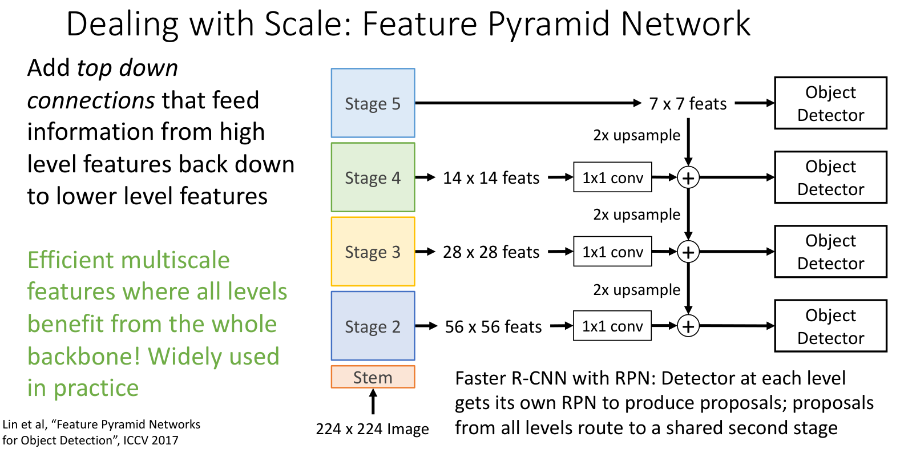

原论文 $1\times 1$ 卷积的 kernel 个数为 256，即最终得到不同大小的特征图的 channel 都等于 256；上采样使用**最近邻上采样**，即新位置直接取离它最近的原位置的值，如

$$
\begin{bmatrix}
1 & 2 \\
3 & 4
\end{bmatrix}
\to
\begin{bmatrix}
1 & 1 & 2 & 2 \\
1 & 1 & 2 & 2 \\
3 & 3 & 4 & 4 \\
3 & 3 & 4 & 4
\end{bmatrix}
$$

以 ResNet50 Backbone 为例：

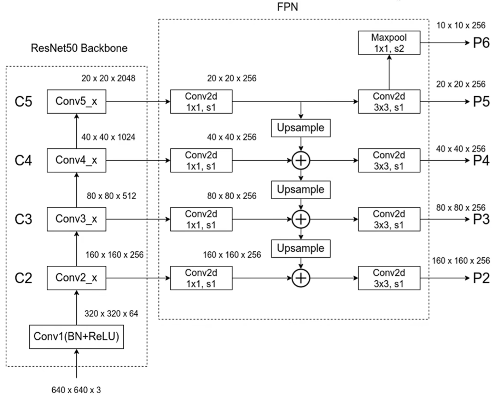

## RetinaNet

[RetinaNet](https://arxiv.org/abs/1708.02002) 发表于 ICCV2017，one-stage detector 第一次超过了 two-stage．

### FPN

> RetinaNet uses feature pyramid levels P3 to P7, where P3 to P5 are computed from the output of the corresponding ResNet residual stage (C3 through C5) using top-down and lateral connections just as in [20], P6 is obtained via a 3×3 stride-2 conv on C5, and P7 is computed by applying ReLU followed by a 3×3 stride-2 conv on P6. This differs slightly from [20]: (1) we don’t use the high-resolution pyramid level P2 for computational reasons, (2) P6 is computed by strided convolution instead of downsampling, and (3) we include P7 to improve large object detection. These minor modifications improve speed while maintaining accuracy.

RetinaNet 在 FPN 上使用 P3 - P7，由于计算复杂度放弃 P2，而 P7 是由 P6 卷积 + ReLU 得到的．

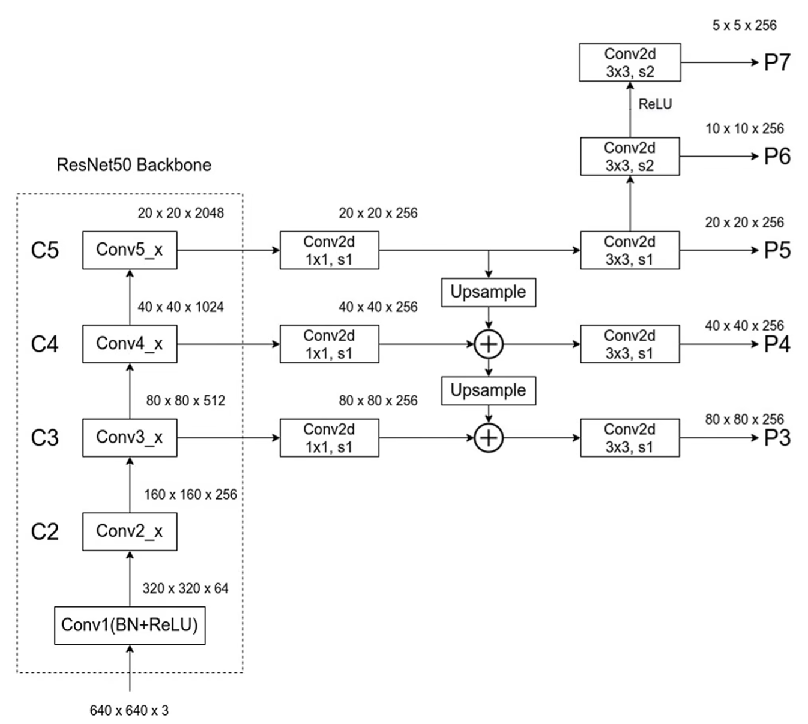

对于 anchor 的选择，P3 - P7 分别对应 32 到 512 的原始比例（对应原图，层数越低感受野越小，因此范围越小），以及 $2^0,2^{1/3},2^{2/3}$ 的 scale，和 $1:2,1:1,2:1$ 的 ratio，即每个特征图的特征对应 9 个 anchor，总 anchor 数为 $\sum_{l=3}^7 9H_lW_l$．

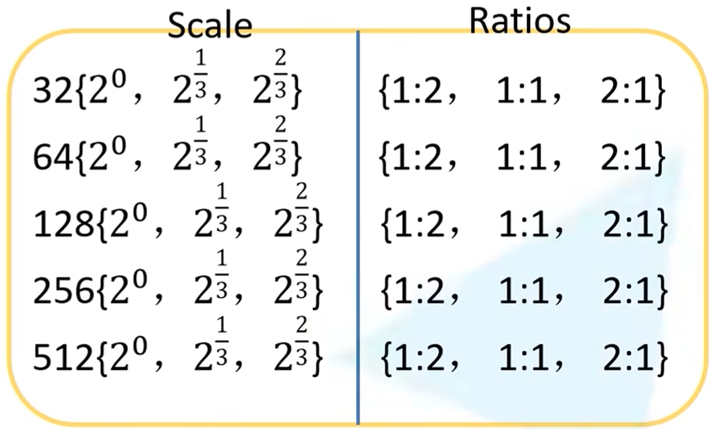

### Predictor

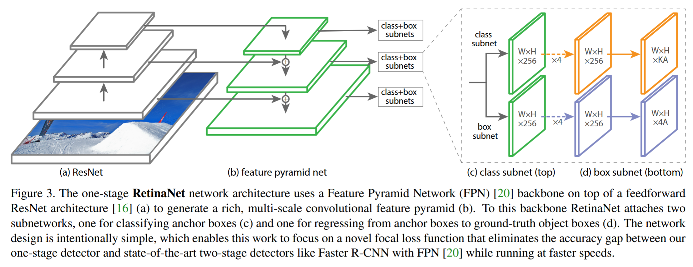

对 FPN 输出的 anchor 接入 class & box subnet，注意这里对每层使用的网络权值是共享的，具体如下图；其中 A 为 anchor 个数，这里为 9；K 为类别数（不包含背景，如 PASCAL VOC 就是 20 个类别）．其 One-stage 的特点就是找到 anchor 后直接进行分类，而不是先选择 proposal 再分类．

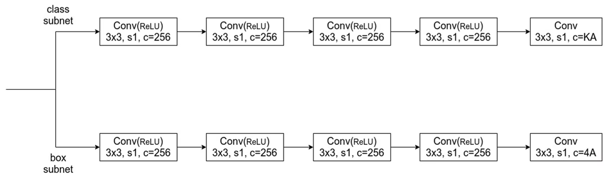

### Loss

由于 one-stage detector 直接对 anchor 进行分类，因此负样本（$\forall \text{IoU} < 0.4$）的数量会远大于正样本（$\exists \text{IoU}>0.5$），如果使用普通的 CE：$CE(p_t)=-\log p_t$（其中 $p_t$ 表示“模型分给真实类别的概率”），大量背景 anchor 很容易分类正确，但由于数量太多，总和会主导梯度，导致模型训练的大部分精力花在很容易识别的背景样本上．因此，原论文提出了 Focal Loss：

$$
FL(p_t)=-\alpha_t(1-p_t)^\gamma \log p_t
$$

其中 $\gamma$ 为超参数，原论文取 2；$\alpha_t$ 在正样本为 $\alpha$，负样本为 $1-\alpha$，$\alpha$ 为超参数，原论文 0.25．

对于很容易预测对的样本，由于 $p_t$ 高，$(1-p_t)^\gamma$ 就会很小，loss 就会很小；预测错的样本 loss 就会较大．

最后损失为**分类损失**与回归损失之和：

$$
L =
\frac{1}{N_{\text{pos}}}
\sum_i
L_{\text{cls}}(\hat{\mathbf p}_i,y_i)
+
\frac{\lambda}{N_{\text{pos}}}
\sum_j
L_{\text{reg}}(\hat{\mathbf t}_j,\mathbf t_j^*)
$$

其中 $L_\text{cls}$： Focal Loss；$L_\text{reg}$：L1 Loss；$i$：所有的正负样本；$j$：所有的正样本；$N_\text{pos}$：正样本个数．

损失设计也很显然：分类是对正负样本同时分类，因此对象为所有正负样本；而只有正样本才有 GT box 能进行回归，对象为所有正样本．

## FCOS

[FCOS](https://arxiv.org/abs/1904.01355) 也是 one-stage detector，但和 RetinaNet 的区别是其是 anchor-free 的．

### Anchor-free

Anchor 的劣势：

+ Detector 性能和 anchor 强相关，而一般 anchor 的 size 和 ratio 是固定的，难以处理形状变化大的目标、迁移学习
+ Anchor boxes 需要生成的非常密集，大部分都会被标为负样本，正负样本极度不均
+ 计算 IoU 等过程在网络训练过程很繁琐

因此 FCOS 不使用 anchor．

### Predictor

FCOS 直接对特征图的每一点进行预测，共预测三类：类别分数 $C$、相对 GT box 的上下左右距离 $(\hat{l},\hat{t},\hat{r},\hat{b})$、centerness 分数 $\hat{c}$．其中，centerness 分数的 GT 为
$$
c^*=
\sqrt{
\frac{\min(l^*,r^*)}{\max(l^*,r^*)}
\cdot
\frac{\min(t^*,b^*)}{\max(t^*,b^*)}
}
$$

centerness 的作用是压低“离目标中心很远的位置”产生的检测框分数，因为离目标中心远的点容易预测出质量差的框．最后的分数为 classification 与 centerness 的乘积，当使用 NMS、top-k 排序时，中心区域产生的框更容易留下，边缘区域的框更容易被过滤．

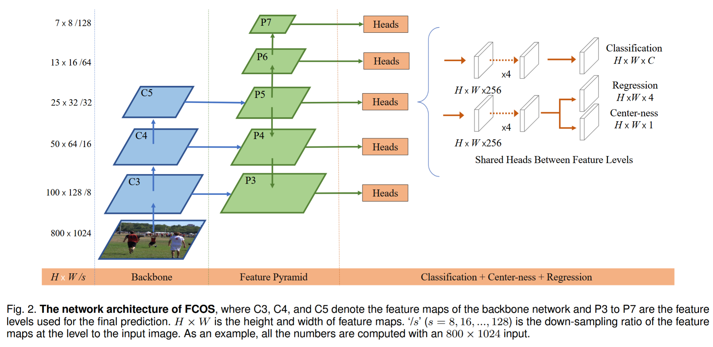

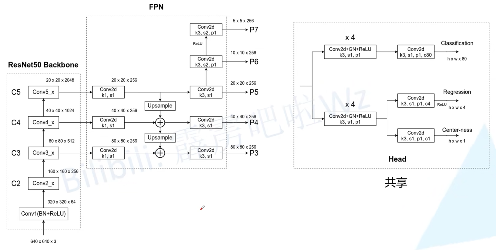

当一个点位于多个 GT box 内部时称为 ambiguity，选择让他学习面积更小的框，下右图中选择学习蓝色的框：

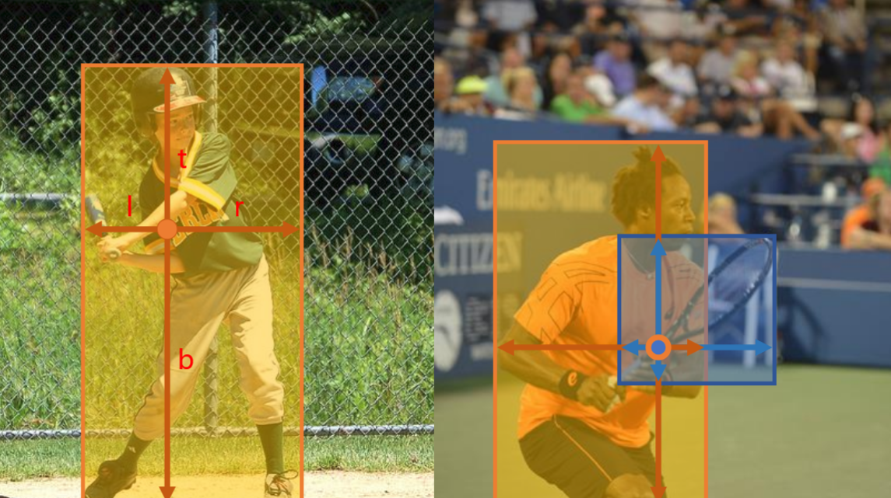

### Loss

FCOS 的完整 loss 为**分类损失**、**回归损失**、**centerness 损失**之和：

$$
L =
\frac{1}{N_{\text{pos}}}
\sum_i L_{\text{cls}}(\hat{\mathbf p}_i,y_i)
+
\frac{\lambda}{N_{\text{pos}}}
\sum_j 
L_{\text{reg}}(\hat{\mathbf t}_j,\mathbf t_j^*)
+
\frac{1}{N_{\text{pos}}}
\sum_j 
\text{BCE}(\hat c_j,c_j^*)
$$

其中 $L_{\text{cls}}$：Focal Loss；$L_\text{reg}$：[GIoU loss](https://giou.stanford.edu/)；$i$：所有正负样本；$j$：所有正样本；$N_\text{pos}$：正样本个数．
