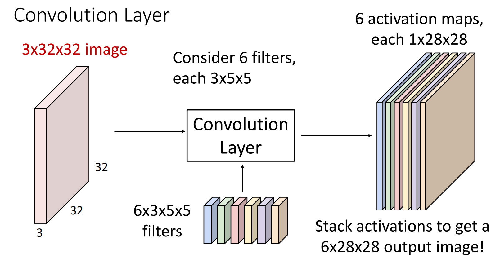
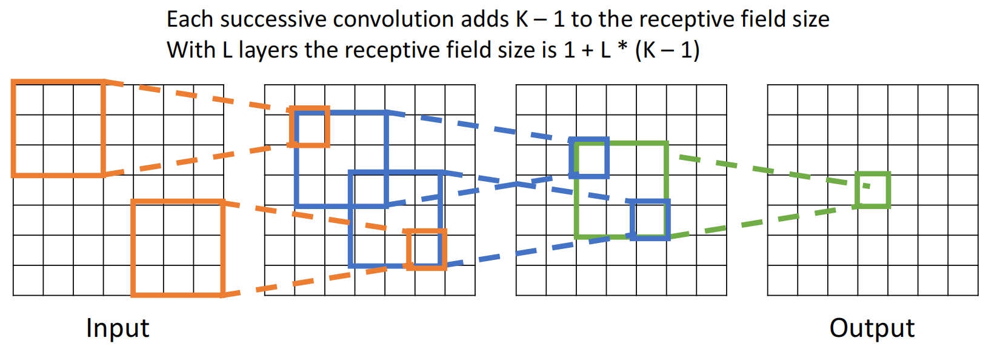
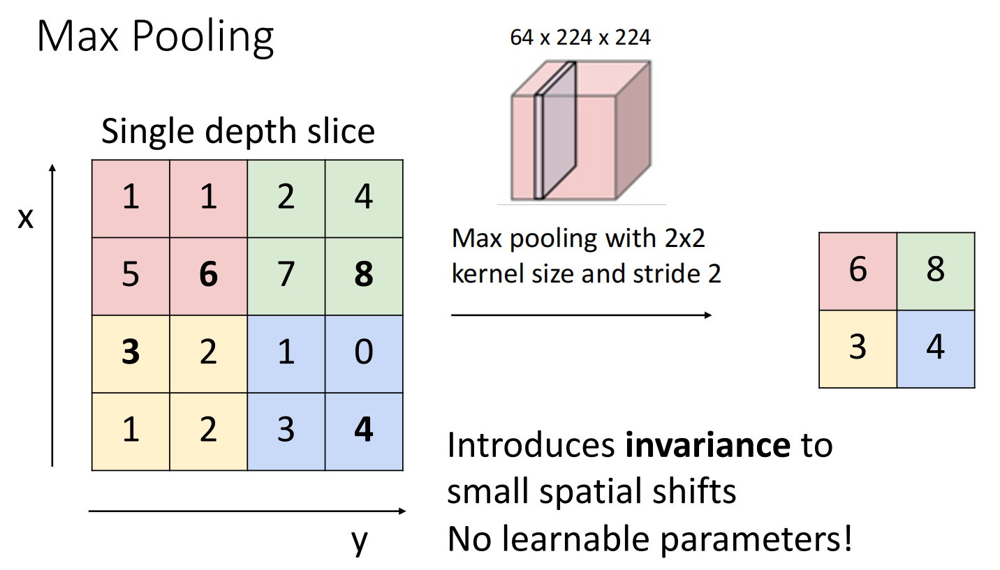
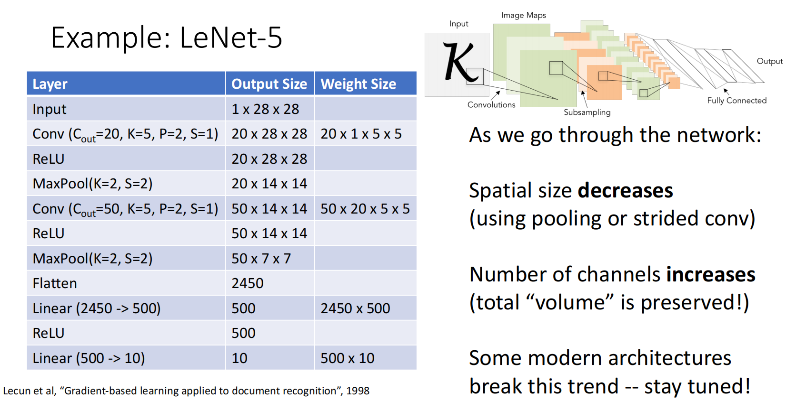
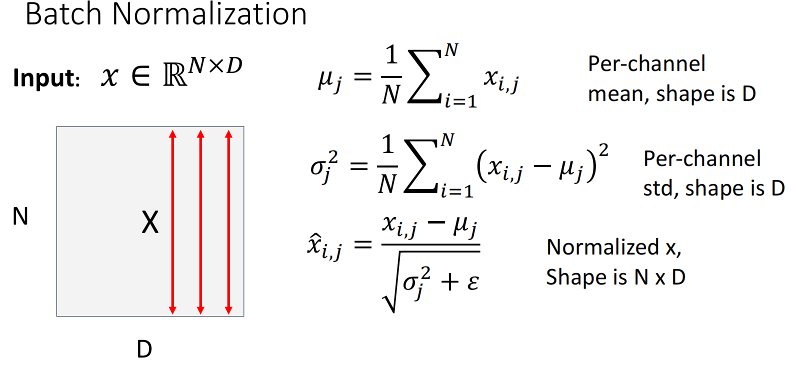
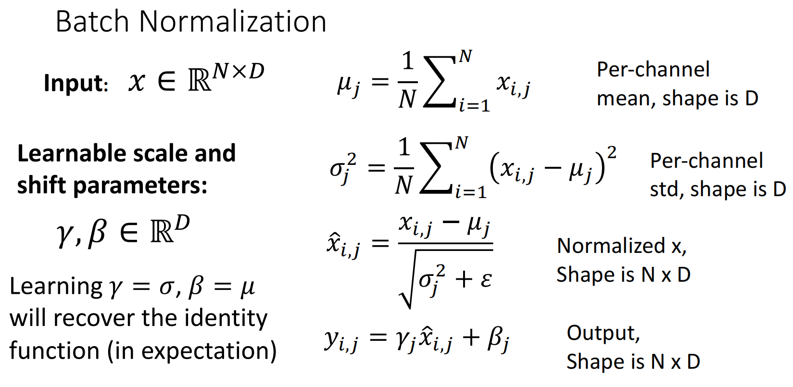
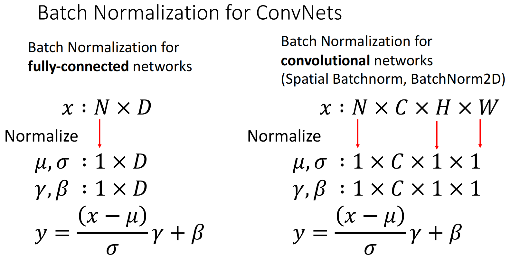
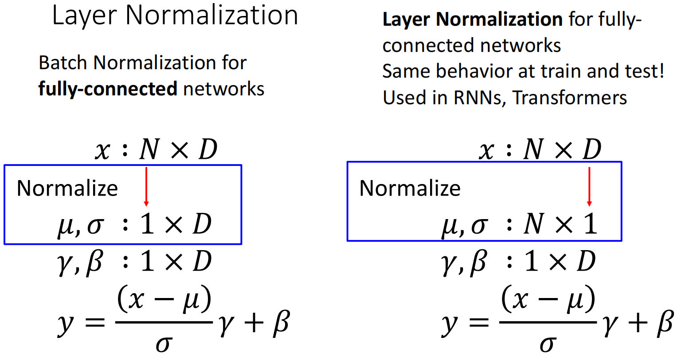
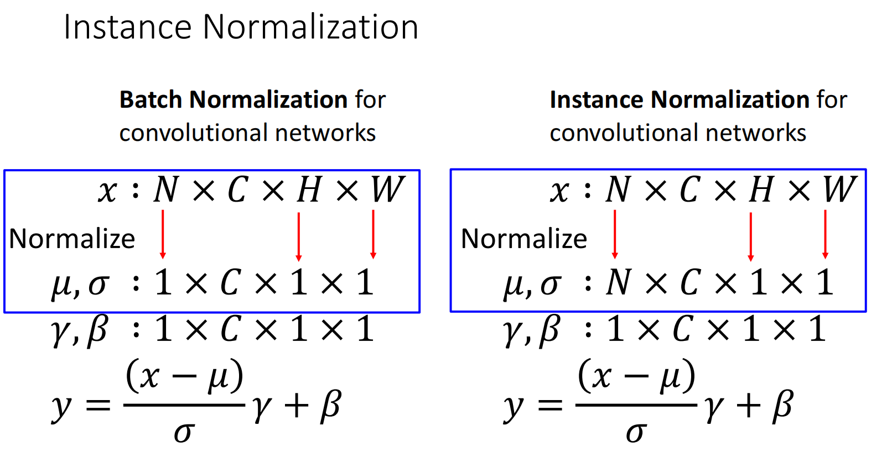
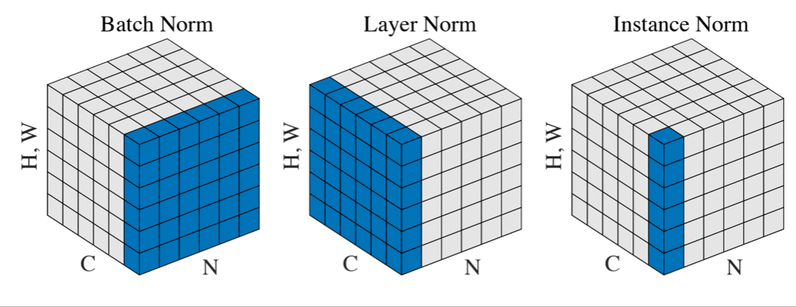

# Convolutional Neural Networks

卷积神经网络利用局部连接、权重共享和空间下采样来处理图像数据。本节记录卷积层、池化层、归一化和 LeNet 等基础结构。

多层感知机难以学习在图像不同区域的类别．为了实现**特征提取**功能，提出了**卷积神经网络**．

## Convolution Layer

### Filter

对于一张黑白图片，其只有两个参数：高度为 $H$、宽度为 $W$（大多数情况下 $H=W$，后文统一只写 $W$），可被转化为二维张量．此时有一个 $K\times K$ 的**kernel（卷积核）**从图片上滑过，每次都与原图对应位置的像素值做内积，这样得到一张新的图片，称为**avtivation map（激活图）**，其边长为 $W-K+1$．

对于一张彩色图片，其有高度、宽度、**channel（通道，如RGB）**三个参数，会被转化为三维张量．与多通道层进行运算时，卷积核也必须相同的通道数；例如 $3\times 32\times 32$ 的图像，其可以与 $3 \times 5\times 5$ 的卷积核做卷积操作．卷积核的每一个通道与图像的每一个通道一一对应，结果相加．黑白图像可以认为是单通道的．

经上述卷积核操作后得到的结果均为单通道的．为了得到多通道，可以叠加卷积核，每一个卷积核对应一个结果的通道，得到**filter（滤波器）**．如果有 $N$ 个通道数为 $C_{\text{in}}$ 的图片，经过 $C_{\text{out}}$ 个 $C_{\text{in}}$ 通道数的卷积核处理后，会得到 $N$ 个通道数为 $C_{\text{out}}$ 的图片．用张量描述即为：

$$
(N \times C_{\text{in}}\times H \times W )∗(C_{\text{out}},C_{\text{in}},K_h,K_w)=(N,C_{\text{out}},H-K_h+1, W-K_w+1)
$$

!!! warning "激活函数"

    卷积操作本质上仍然是仿射变换，因此叠加多个卷积层等效于只是用一个卷积层，所以要在卷积层之间加激活函数．

### Padding

如果kernel不是 $1\times 1$ 的，得到的激活图会比原图小，因此可以给原图加上**padding（填充）**后进行卷积操作．常用的是zero padding，即边缘补0．假设添加的边缘宽度为 $P$，则得到的输出宽度为 $W-K+1-2P$，一般取 $P=(K-1)/2$ 使得卷积操作后图像大小不变．

### Stride

经过了数个卷积层后，单个像素可以认为是一个正方形的区域的综合，这个区域被称为**Receptive Fields（感受野）**．显然卷积层越多、$K$ 越大，感受野越大．如果图像过大而 $K$ 较小，需要很多卷积层才能让感受野为整张图片．

因此引入**stride（步长）**的概念：每次kernel滑动可以不止滑动一个单位，可以是多个．例如 $7\times 7$ 的图像，经过 stride=2、Filter=3*3 的卷积后得到的是 $3\times 3$ 的图像．此时再做一次卷积操作，得到的 $1\times 1$ 像素的感受野就是全图．

此时输出的宽度公式为 $(W-K+2P)/S + 1$．

### $1\times 1$ Conv

使用 $1\times 1$ 卷积，即使不加padding也不会使图像变小．其可以看作是单个像素在每个通道的加权平均数，也可以输出多个通道，相当于对单个点的所有通道做感知机操作．

### Conv in PyTorch

卷积也有一维卷积与三维卷积，这里我们用的更多的是二维卷积。PyTorch 有内置的 [Conv2d](https://docs.pytorch.org/docs/2.11/generated/torch.nn.Conv2d.html)，可用于 `nn.Sequential` 叠加网络层。

## Pooling Layers

**Downsampling（下采样）**是一种让图像的空间尺寸变小的操作．积层也能实现下采样，但我们一般使用**pooling layer（池化层）**，因为其不学习新参数，池化层的作用效果只有三个超参数决定：

+ Kernel Size
+ Stride
+ Pooling function（max/avg）

???+ example

    对一个 $4\times 4$ 的图像进行 kernel size=2, stride=2, pooling function=max 的最大采样结果：

    

    
    

常用的max函数由于带有非线性性，因此池化层后一般不用接激活函数．

此时我们可以构建简单的卷积神经网络，用卷积层、ReLU、池化层以及全连接层：如 **LeNet-5**：

可以发现我们偏向于减小图像尺寸而增加通道数．

## Normalization

经过几层网络后，数据的尺度可能差距会很大，这对于学习率的调节不方便．因此，引入**Normalization（归一化）**将数据拉回均值接近0、方差接近1的正常范围．

### [Batch Norm](https://arxiv.org/abs/1502.03167)

**BatchNorm（批归一化）**是逐特征/通道求平均，常用于处理图像．例如单一输入 $x\in \mathbb{R}^{N\times D}$，其中 $N$ 为batch size，$D$ 为特征数量，则

加入了一个微小量 $\epsilon$ 防止除以0．为了增强模型的表达能力，BatchNorm后也可以再进行仿射变换，得到更适合的调节．其中 $\gamma,\beta$ 都是可学习参数．

由于测试集的batch size较小，得到的 $\mu,\sigma$ 没有代表性，因此测试时一般使用训练集得到的整体running average $\mu,\sigma$．同时因为使用的确定的 $\mu,\sigma,\gamma,\beta$ 值，BatchNorm在此时是一个线性运算，可以和卷积层放在一起，因此在测试时BatchNorm几乎是零开销的．

**对于CNN**：为每一个通道的平均

### Layer Norm

**LayerNorm（层归一化）**是对单一数据的不同特征取平均，因此其在测试时的取平均方式与训练时一样，不需要用running average．常用于GPT等处理文本的任务．

### Instance Norm

Instance Norm是对单一数据的每一个通道求平均．

!!! quote "不同Norm方法区别"

    

	
    

