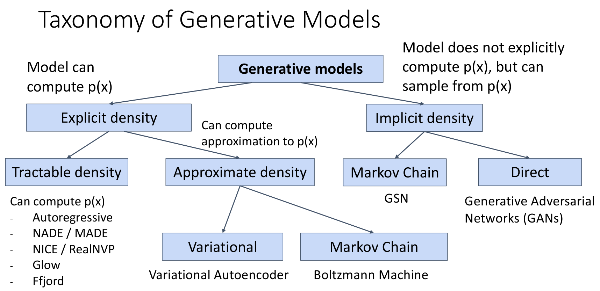
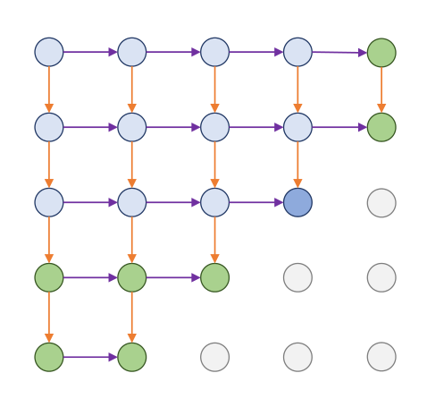
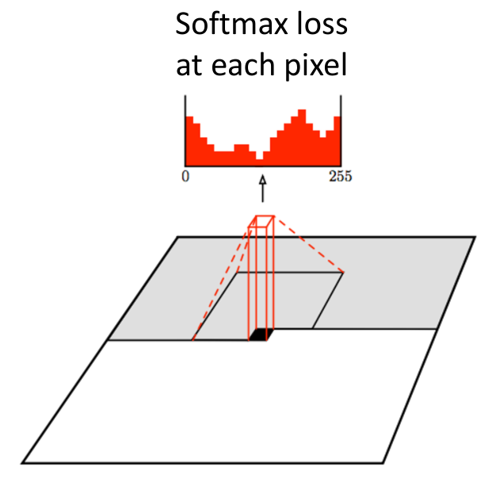
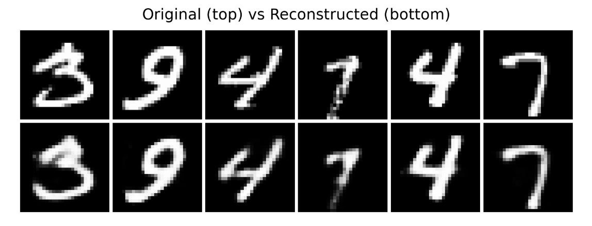
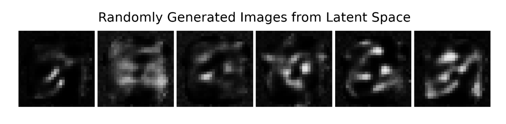
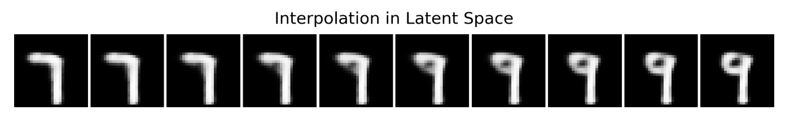

# Generative Models

## Supervised vs Unsupervised Learning

根据学习的数据类型，可以将学习分为**监督学习**和**无监督学习**：

+ 给定数据 $x$、标签 $y$，学习 $x\to y$ 映射的过程称为监督学习，如 classification、object detection、image captioning 等；
+ 只有数据 $x$，学习数据的底层结构的过程称为无监督学习，如 clustering、feature learning、density estimation 等．

## Discriminative vs Generative Models

根据模型学习目标，可以将模型分为**判别模型**和**生成模型**：

+ 判别模型通常学 $p(y\mid x)$，如在给定图片 $x$ 下标签为 $y$​ 的概率分布，最后的概率分布是 label 之间的竞争，其没有处理不合理输入的能力；
+ 生成模型直接学 $p(x)$，即学习输入本身，概率分布是 data 之间的竞争，即训练中出现多的类型的数据概率较大，其拥有“拒绝”不合理输入的能力（给它们分配低概率值）；
+ 生成模型也可以在给定条件 $y$ 时学习条件分布 $p(x\mid y)$，此时一般称为条件生成模型；

这些模型的关系可以用贝叶斯公式表示：

$$
P(x\mid y) = \frac{P(y \mid x)P(x)}{P(y)}
$$

## Taxonomy

根据生成模型显式 / 隐式刻画概率密度，以及直接计算 / 估计概率密度，可以分为如下类别：

## Autoregressive Models

### Explicit Density Estimation

显式概率密度：对于输入 $x$，能有函数 $f$ 直接计算出该输入的概率，即 $p(x)=f(x,W)$；那么 $W$ 就是训练数据的极大似然估计，即 $W$ 能让所有训练数据概率乘积最大化：

$$
W^*=\text{argmax} \prod_i p(x^{(i)})
$$

为了防止概率太小无法表示，取对数似然：

$$
W^*=\text{argmax} \sum_i \log p(x^{(i)}) = \text{argmax} \sum_i \log f(x^{(i)},W)
$$

**自回归生成模型**把联合分布按固定顺序分解为一连串条件分布：
$$
p(x)=p(x_1,x_2,\dots, x_T) =\prod_{i=1}^{T}p(x_i\mid x_1,\ldots,x_{i-1}) 
$$

由于有显式概率密度，因此每一项都是可计算的，从而可以实现自回归生成．

对语言而言，现代 llm 基本都输入自回归生成模型；对图像而言，可以按从左到右、从上到下的顺序逐像素建模．生成时每一步只预测下一个像素或通道，因此模型可以给出精确的 likelihood，但采样通常较慢．

### PixelRNN

PixelRNN 使用 RNN 按像素顺序建模图像，每个像素的分布依赖于其左上角已经生成的像素，即

$$
h_{x,y}=f(h_{x-1,y},h_{x,y-1},W)
$$

它能够捕捉较长距离的依赖，但由于像素之间的生成过程强顺序化，训练和采样都比较慢．

### PixelCNN

PixelCNN 使用 masked convolution 避免卷积核看到“未来像素”，从而保持自回归因果性．可以通过 256 个 kernel 实现输出 256 个像素，并用 softmax 选出结果；同时叠加多层来实现感受野覆盖之前所有像素．

与 PixelRNN 相比，PixelCNN 的训练更容易并行，但生成时仍然需要逐像素采样．

!!! note "Masked Convolution"

    普通卷积会同时看到当前位置周围的像素，其中包含生成顺序上的未来信息．Masked convolution 通过遮住卷积核中的未来位置，使第 $i$ 个像素只能依赖 $x_1,\ldots,x_{i-1}$．

## AutoEncoder

观测数据 $x$ 只是我们可以直接观测到的样本指标或特征，而在观测数据之下蕴含的还有一些不能直接观测到的、潜在的、未知的特征，这些特征可能对观测数据产生影响，我们称其为**隐藏特征**．

直接求解或估计 $p(x)$ 比较困难，考虑引入一个隐变量 $z$，先生成 $z$ 再通过某种变换生成最终的 $x$．

AutoEncoder 的任务：学习两个网络，将输入数据变换成隐变量（encoder），再尽可能将隐变量变换成原始数据（decoder）；这样只需在 latent space 采样 $z$ 送入 decoder 即可生成 $x$．

有原数据 $x$ 时，AutoEncoder 能较好的将其压缩成隐变量再恢复；但其 latent space 采样并解码效果很差．（如下图）

原因是我们没有对 $z$ 的分布进行约束：训练时得到的隐变量稀疏、不规则，只在特定点能解码成有意义的图像；而随机采样时往往落在训练时未覆盖或很少覆盖的区域．因此普通 AutoEncoder 无法稳定生成新的高质量样本．

## Variational Autoencoder

根据 AE 的问题，VAE 限定了 $z$ 的先验分布 $p(z)$．为了方便采样，我们假设 $z$ 服从多维标准正态分布，即 $z \sim p(z)= \mathcal{N}(0,I)$．

接下来我们希望对于给定的 $x_i$，能够得到后验分布 $p(z\mid x_i)$．为什么？因为如果其已知，我们就能取样 $z$ 并输入 decoder 生成 $\hat{x_i}$，而它是由 $x_i$ 决定的后验分布决定的，因此 $\hat{x_i}$ 和 $x_i$ 做 loss（如 MSE）就可以训练 decoder，从而生成图像．因此问题转化为了寻找后验分布 $p(z\mid x_i)$．

但我们无法直接求得该分布，因此我们希望求得一个近似分布 $q_\phi(z\mid x_i)$ 使得这两个分布最近．衡量两个分布距离常用 KL 散度，即最小化：

$$
\begin{align} KL(q_\phi(z|x_i) \parallel p(z|x_i))  &= \int q_\phi(z|x_i) \log{\frac{q_\phi(z|x_i)}{p(z|x_i)}} \, \mathrm{d}z \\ &= \mathbb{E}_{z \sim q_\phi(z|x_i)}\left[\log{\frac{q_\phi(z|x_i)}{p(z|x_i)}}\right] \\ &= \mathbb{E}_{z \sim q_\phi(z|x_i)}\left[\log{q_\phi(z|x_i)} - \log{p(z|x_i)}\right] \\ &= \mathbb{E}_{z \sim q_\phi(z|x_i)}\left[\log{q_\phi(z|x_i)} - \log{\frac{p(x_i|z)p(z)}{p(x_i)}}\right] \\ &= \mathbb{E}_{z \sim q_\phi(z|x_i)}\left[\log{q_\phi(z|x_i)} - \log{p(z)} - \log{p(x_i|z)}\right] + \log{p(x_i)} \\ &= KL(q_\phi(z|x_i) \parallel p(z)) - \mathbb{E}_{z \sim q_\phi(z|x_i)}\left[\log{p(x_i|z)}\right] + \log{p(x_i)} \end{align}
$$

记 $\mathbb{E}_{z \sim q_\phi(z|x_i)}\left[\log{p(x_i|z)}\right] - KL(q_\phi(z|x_i) \parallel p(z)) $ 为 ELBO，原 KL 散度为 $KL$，则有

$$
\log p(x_i)=\text{ELBO}+KL
$$

由于变量为 $z$，因此 $\log p(x_i)$ 为常数，最小化 $KL$ 等价于最大化 ELBO．由于

$$
\text{ELBO}=\mathbb{E}_{z \sim q_\phi(z|x_i)}\left[\log{p(x_i|z)}\right] - KL(q_\phi(z|x_i) \parallel p(z))
$$

因此目标是最大化前者并最小化后者．

为了最小化后者的 KL 散度，由于 $p(z)$ 被我们设为标准正态分布，因此我们自然地令 $q_\phi(z|x_i)$ 服从对角分布 $\mathcal{N}(\mu_\phi(x),\text{diag}(\sigma_\phi^2(x)))$，这样参数少，并且 KL 散度有闭式解，并且可以使用重参数化技巧训练．

而前者可以理解为给定 $x_i$ 后从 $z$ 的后验分布 $q_\phi(z|x_i)$ 采样得到隐变量 $z$，相当于把 $x_i$ 编码成了 $z$，对应 encode；而 $p(x_i\mid z)$ 表示给定 $z$ 又生成回 $x_i$ 的概率，反映的是把 $z$ 解码为 $x_i$ 的过程；因此可以把该期望理解为**对于给定 $x_i$ ，将其按分布 $q_\phi(z|x_i)$ 编码为某个 $z$ 后能再成功解码（重构）回 $x_i$ 的对数似然函数值的期望**．如果这个期望足够大，说明得到的 $z$ 是一个能有效反映 $x$ 的隐变量．

在实际训练中，通常写成最小化损失，所以取符号，即 

$$
\mathcal{L}=-\text{ELBO}= - \mathbb{E}_{z \sim q_\phi(z|x_i)}\left[\log{p(x_i|z)}\right] + KL(q_\phi(z|x_i) \parallel p(z))
$$

+ 第一项为重构误差，让网络尽量准确的还原出来输入 $x$．推导公式可以得到减小其误差可以转化为减小 $x_i$ 和 $\hat{x_i}$ 的 MSE；
+ 第二项为 KL 散度，让样本整体贴近正态分布．将两个正态分布带入 KL 散度公式，可以计算得到损失为 $\dfrac{1}{2}(-\ln \sigma^2 + \sigma^2 + \mu^2 - 1)$（一维情况）．

将损失扩展到 $d$ 维、$n$ 样本：

$$
\mathcal{L}
=
\frac{1}{n}\sum_{i=1}^{n}
\left[
\|x_i-\hat{x}_i\|_2^2
+
\frac{1}{2}\sum_{j=1}^{d}
\left(
-\ln \sigma_{ij}^2+\sigma_{ij}^2+\mu_{ij}^2-1
\right)
\right]
$$

有了损失的表达式，只需要让所有计算过程可导，模型就能根据反向传播训练了．为了让采样过程可以反向传播，VAE 使用重参数化技巧，即不直接在 $q_\phi(z|x_i)$ 采样（不可导），而是在标准正态分布采样后转化为 $q_\phi(z|x_i)$ 对应的正态分布：

$$
z=\mu_\phi(x)+\sigma_\phi(x)\odot \epsilon,\qquad \epsilon\sim\mathcal{N}(0,I)
$$

最后得到 VAE 的 latent space 插值可以得到平滑的图像变化，形成了一个连续的语义空间．其缺点是样本可能偏模糊．

## Generative Adversarial Network

GAN 由 **Generator** 和 **Discriminator** 组成．Generator 将随机噪声 $z$ 映射为样本 $G(z)$，Discriminator 判断输入来自真实数据还是生成模型．二者构成一个 minimax：

$$
\min_G \max_D V(D,G)=
\mathbb{E}_{x\sim p_{\text{data}}}[\log D(x)]
+\mathbb{E}_{z\sim p(z)}[\log(1-D(G(z)))]
$$

判别器 $D$ 的目标是让 $D(x)=1$（真实模型），$D(G(z))=0$，即最大化 $V(D,G)$；而生成器 $G$ 想在最优判别器的情况下最小化这个目标，即希望生成样本被判定为真的，即 $D(G(z))=1$．

经过数学推导可以得到，最优判别器为

$$
D^*=\frac{p_\text{data}(x)}{p_\text{data}(x)+p_g(x)}
$$

即最优判别器本质上在估计真实分布和生成分布的**密度比**．

当 $D$ 为最优判别器时，推导得到 GAN 的最优解当且仅当

$$
p_g=p_\text{data}
$$

此时 $D^*=\dfrac{1}{2}$，此时生成器生成的分布和真实数据分布完全一致，判别器分不出真假，只能随机猜．

训练时，由于初始时 $\log(1-D(G(z)))$ 接近 0，会导致梯度消失问题；因此实际中常用 $-\log D(G(z))$，其和原始  loss 有相同的最优点，但初期梯度更强．

GAN 通常能生成更清晰的样本，但容易出现 mode collapse、评价困难等问题．

