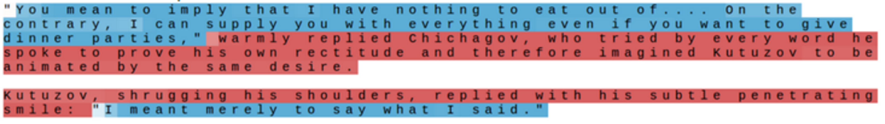
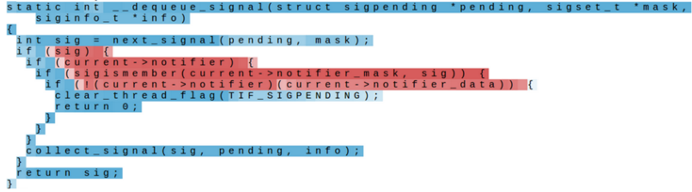
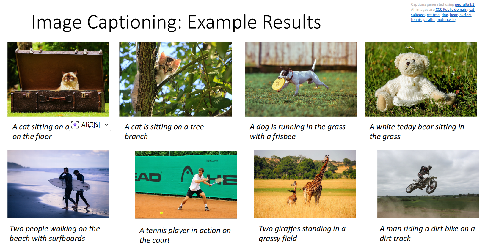

# Recurrent Neural Networks

RNN 通过 hidden state 在时间维度上传递信息，适合处理文本、语音等序列数据．这里先把 RNN 作为一种通用的深度学习结构来理解；语言模型和 Seq2Seq 等具体 NLP 用法放在 [Language Modeling](../nlp/language-modeling.md) 中．

## Process Sequences

之前的神经网络都是 one-to-one 的，即一个输入对应一个输出．循环神经网络可以生成序列，从而实现 one-to-one、one-to-many、many-to-one 甚至 many-to-many．

## Hidden States

隐状态（也称隐藏变量） $H_t\in \mathbb{R}^{n\times h}$ 记录了到时间步 $t$ 的序列信息．每一次使用 $t-1$ 时的隐状态 $H_{t-1}$ 与 $t$ 时的输入 $X_t\in \mathbb{R}^{n\times d}$ 来更新隐状态得到 $H_t$，每次用全连接层进行更新，即

$$
H_t=\phi(X_tW_{xh}+H_{t-1}W_{hh}+b_h)
$$

其中：

+ $W_{xh}\in \mathbb{R}^{d\times h}、W_{hh}\in \mathbb{R}^{h\times h}、b_h\in \mathbb{R}^{1\times h}$ 在一个 RNN 中是同一个参数；
+ $\phi$ 是带激活函数的全连接层，在 RNN 中一般使用 $\tanh$；
+ 当然，每一次更新隐状态时也能有一个可选的输出 $y_t=H_{t}W_{hy}+b_y$．

> 根据矩阵运算，我们也可以将 $X_t$ 与 $H_{t-1}$ 按列拼接、将 $H_{t-1}$ 与 $W_{hh}$ 按行拼接，再进行一次大的矩阵乘法即可．

## Backpropagation Through Time

如果最终通过 $H_4$ 预测出的 $y_4$ 的损失是 $L_4$，它不仅影响 $H_4$，由于 $H_4$ 是由前面的隐状态计算出来的，它会**随着时间反向传播**回 $H_3\to H_2\to H_1$．

因为所有时间步共享参数，所以参数梯度要把每个时间步的贡献加起来．同时梯度会包含很多连续相乘的项

$$
\frac{\partial h_T}{\partial h_1} = \frac{\partial h_T}{\partial h_{T-1}} \frac{\partial h_{T-1}}{\partial h_{T-2}} \cdots \frac{\partial h_2}{\partial h_1}
$$

容易导致梯度消失或梯度爆炸．因此普通 RNN 难以处理长距离依赖，这也是 LSTM、GRU 着重优化的部分．

!!! info "Truncated BPTT"

    实际训练时，通常不会对特别长的序列完整做 BPTT，而是用 **Truncated BPTT**（截断时间反向传播）．
    
    如一个很长的序列 $x_1,x_2,\dots, x_{1000}$，可能每 50 步切一段，反向传播时将上一段的末尾看作是常数，不跨段传播．

## Interpretable Hidden Units

训练 RNN 后，会发现有的隐变量学习到了一些语法、格式内容，具体见 [Visualizing and Understanding Recurrent Networks](https://arxiv.org/abs/1506.02078)．

???+ example "Interpretable Hidden Units"

    === "quote detection cell"
    
        

        
        

    
    === "line length tracking cell"
    
        

        
        

    
    === "if statement cell"
    
        

        
        

    
    === "quote/comment cell"
    
        

        
        

## Image Captioning

Image Captioning 本身是视觉与语言的跨模态任务，它可以结合 CNN 的图像处理能力与 RNN 的序列处理能力，让神经网络为图像标注评论．例如，可以用过 $W_{ih}$ 将 CNN 提取出来的特征转化加入隐状态．

???+ example "成功样例与失败样例"

    

    
    

    
    

    
    

## RNN Variants

普通 RNN 的隐状态会把历史信息压缩到同一个向量中．为了缓解长距离依赖和梯度传播问题，常见变体会加入门控机制，控制旧状态保留多少、新信息写入多少．

### GRU

增加了两个门：

+ update gate $Z_t=\sigma(X_tW_{xz}+H_{t-1}W_{hz}+b_z)$
+ reset gate $R_t=\sigma(X_tW_{xr}+H_{t-1}W_{hr}+b_r)$

reset gate 决定“生成候选状态时是否参考旧状态”，其用于计算候选隐状态：

$$
\tilde H_t=\tanh(X_tW_{xh}+(R_t\odot H_{t-1})W_{hh}+b_h)
$$

update gate 决定“保留旧状态还是写入新状态”，其用于计算当前时间步最终的隐状态：

$$
H_t=Z_t\odot H_{t-1}+(1-Z_t)\odot \tilde H_t
$$

### LSTM

### Multilayer RNNs
