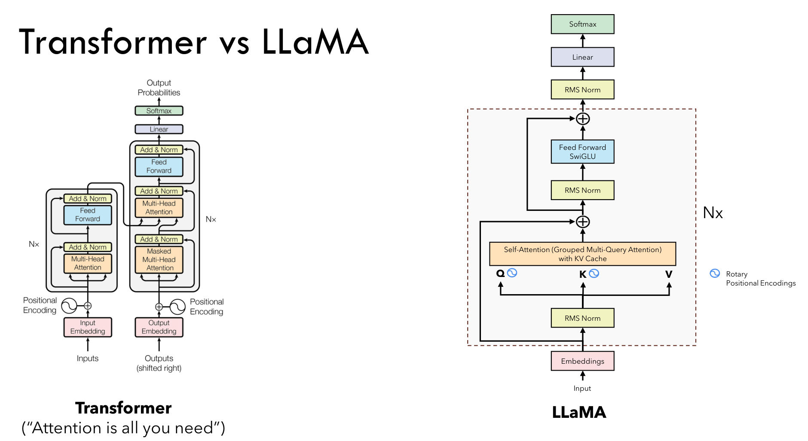
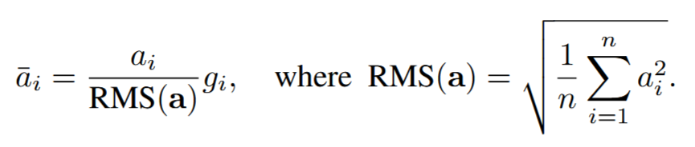
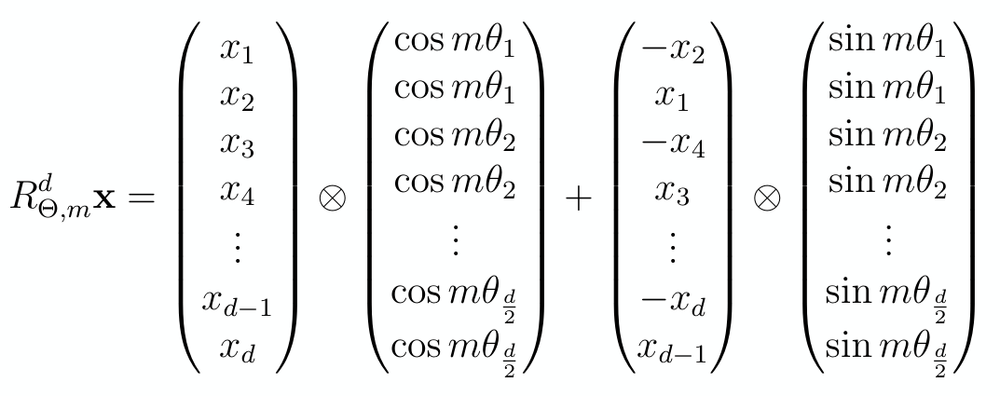
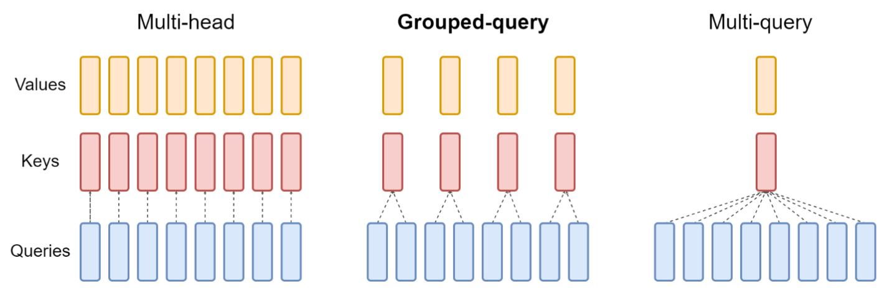
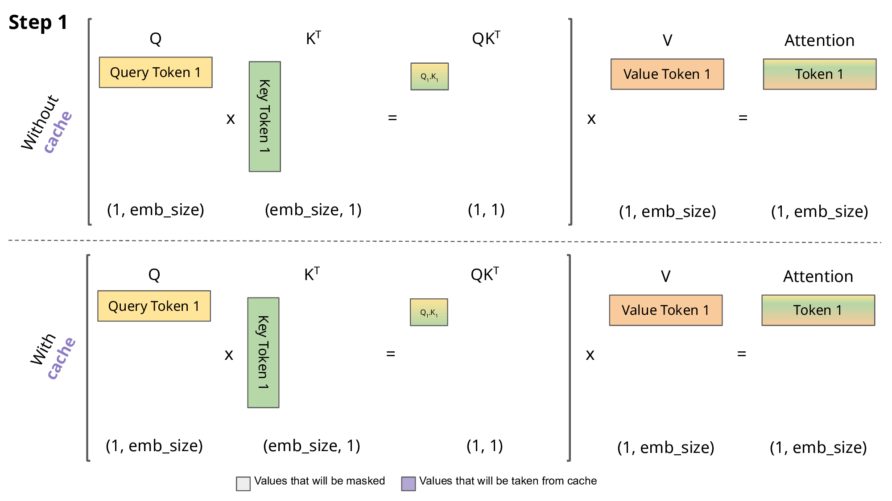

# Llama

Llama 是 Meta 发布的一系列开源大语言模型，主要基于 decoder-only Transformer 架构，通过大规模文本语料进行自回归语言建模预训练．模型的核心目标是在给定上文的条件下预测下一个 token，因此具备文本生成、问答、分类、摘要和推理等能力．

由于 Llama 提供了较为开放的模型权重和生态支持，它常被用于学术研究、模型微调、参数高效训练以及下游 NLP 任务实验．本文基于 [CMU 11-711 Assignment1](https://cmu-l3.github.io/anlp-fall2025/) 的代码框架与 [Umar Jamil](https://www.youtube.com/watch?v=ISNdQcPhsts&ab_channel=UmarJamil) 的视频介绍 Llama2 架构，代码实现见 [mini-Llama 仓库](https://github.com/kbyy123/mini-Llama)．

## Transformer VS Llama

Llama 属于 decoder-only Transformer，去除了 encoder，并引入了 RMSNorm、RoPE、GQA、KV Cache、SwiGLU 等创新．

## RMSNorm

> A well-known explanation of the success of LayerNorm is its re-centering and re-scaling invariance property. The former enables the model to be insensitive to shift noises on both inputs and weights, and the latter keeps the output representations intact when both inputs and weights are randomly scaled. In this paper, we hypothesize that the re-scaling invariance is the reason for success of LayerNorm, rather than re-centering invariance.

[论文](https://arxiv.org/abs/1910.07467)提到，re-scaling 是 LayerNorm 成功的主要原因，因此为了减少计算量，RMSNorm 放弃了计算平均数，同时使用方均根来计算缩放比例；保留了缩放参数 $g$，维度为 `dim` 用于给每个 token 的向量表示缩放．

## RoPE

Llama2采用 [Rotary Positional Embedding](https://arxiv.org/abs/2104.09864) 替代传统的绝对位置编码．其优势在于能将相对位置关系融入模型的自注意力机制中．

> RoPE 的[优点](https://ai.plainenglish.io/understanding-llama2-kv-cache-grouped-query-attention-rotary-embedding-and-more-c17e5f49a6d7)：
> 
> + **Flexibility in Sequence Length**: Traditional position embeddings often require defining a maximum sequence length, limiting their adaptability. RoPE, on the other hand, is incredibly flexible. It can generate position embeddings on-the-fly for sequences of any length.
>
> + **Decaying Inter-Token Dependency**: RoPE is smart about modeling the relationship between tokens. As tokens become more distant from each other in a sequence, RoPE naturally reduces their inter-token dependencies. This gradual decay aligns more closely with how humans understand language, where the importance of earlier words tends to diminish.
>
> + **Enhanced Self-Attention**: RoPE equips the linear self-attention mechanisms with relative position encoding, a feature not present in traditional absolute positional encoding. This enhancement allows for more precise utilization of token embeddings.

位置编码的作用对象是 Q 和 K 的 `seq_len, head_dim` 维度，对于 `head_dim` 维度，其两两分组进行二维旋转，即

旋转角度为 $\theta_{i,k}=\dfrac{i}{\Theta^{2k/d}}$，其中

+ $i$：Token 在序列中索引
+ $\Theta$：常数基数，一般为 10000
+ $k$：当前组在 token 中的索引，范围为 $[0,d/2)$​

在[代码实现](https://github.com/kbyy123/mini-Llama/blob/main/rope.py)中，将 Q 和 K 形状变为 `(batch_size, seq_len, n_head, head_dim // 2) * 2` 实部与虚部，再带入上图公式得到结果．

## GQA

原始 Transformer 中每个 Q 头对应一个 K、V 头，消耗了过多内存；MQA 提出所有 Q 头对应一个 K、V 头，但导致了生成质量下降等问题．Llama 使用 [Grouped-Query Attention ](https://arxiv.org/abs/2305.13245) 折中，将多个 Q 头对应到一个 K、V 头，形成一组．在计算注意力时，为了并行计算将 K、V 复制成与 Q 同头数．

## KV-Cache

在自回归推理中，需要让当前的 Q 与之前所有的 K、V 注意力得到结果；在朴素 Transformer 实现中，每一次自回归，所有的 Q 都和 K、V 进行了注意力，但之前的 Q 的注意力分数与当前的生成无关，消耗了大量运算资源．

因此，如果每一次得到 K、V 后将它们存起来，那么每一次只需要让当前的 Q 与 所有的 K、V 进行注意力即可．KV-Cache 是空间换时间的典型．

需要注意的是，KV-Cache 的前提是“历史 token 的 K / V 一旦算好就不会因为未来 token 改变”．如果输入 prompt 进行自注意力时，需要使用 Causal Mask 来防止 K / V 因为未来 token 而改变．

（图片来自[João Lages](https://medium.com/@joaolages/kv-caching-explained-276520203249)）

## SwiGLU

Llama 通过 SwiGLU 的门控机制，给 FFN 提供了更强的表达能力．核心公式为

$$
\text{SwiGLU}(x)=(\text{SiLU}(xW_1)\odot xW_3)W_2
$$

其中 $\text{SiLU}(x)=x\cdot \sigma(x)=\dfrac{x}{1+e^{-x}}$．$W_1$ 和 $W_3$ 负责将输入 $x$ 升维，然后 $\text{SiLU}(xW_1)$ 通过门控决定哪些信息是重要的；与 $xW_3$ 逐元素相乘后经过 $W_2$ 降维．

传统 FFN 使用了 $d\to4d \to d$ 的两个矩阵，参数量约为 $8d^2$；为了让 SwiGLU 参数量与之对齐，一般将中间维度设为 $d_{ff}=8d/3$；同时为了 GPU 计算效率，$d_{ff}$ 通常需要向上取整为 64 倍数．

