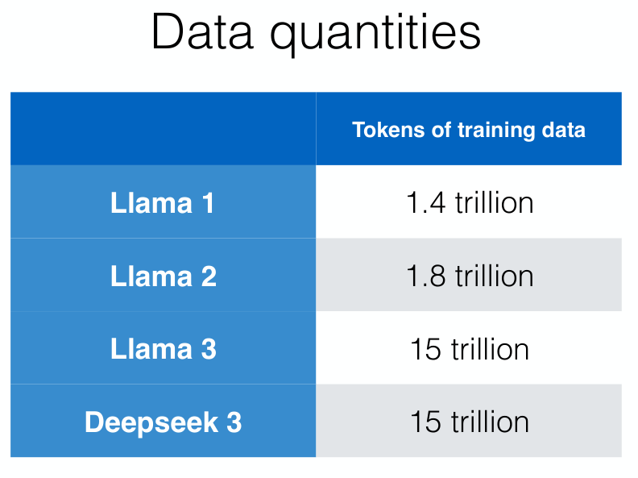

# Pretraining and Data

预训练是先用大规模通用数据训练出 Base Model，再通过提示、微调或对齐方法适配具体任务．这里默认模型结构已经进入 Transformer 之后的大模型阶段，基础结构可见 [LLM Architecture](llm-architecture.md)．

常见使用方式：

+ Prompting：靠描述任务，直接使用模型执行任务
+ Fine-tune：微调模型从而执行特定任务

预训练模型：BERT、GPT-3、LLaMA、DeepSeek-V3；模型主要被以下因素影响：

+ Architecture
+ Task
+ Data
+ Hyper-parameters

## Task

**Masked Language Modeling**：把原句中的一部分 token 损坏或遮住，让模型根据可见上下文预测被遮住的 token．典型模型是 BERT．

**Autoregressive Language Modeling**：根据前文预测下一个 token．典型模型是 GPT、LLaMA．

## Data

Data Factors：Quantity、Quality、Coverage．

### Quantity

数据量通常影响模型能力上限，但并不是越多越好；当数据质量较低或重复度很高时，继续增加数据可能带来更差的泛化效果．

### Quality

Web data：Common Crawl $\to$ Extraction $\to$ Filtering $\to$ Dedup $\to$ Data．

+ Extraction：HTML to text，删去模板，保留 LaTeX、Code
+ Filtering：过滤掉不想要的文本，如语言不对、短行过多
+ Dedup：删除重复文本，fuzzy strategy：minhash

classifier filtering：训练一个分类器识别想要的数据，再过滤掉不想要的数据．

### Coverage

数据分布决定模型分布，想要模型哪方面强，就需要这方面的更多数据．
