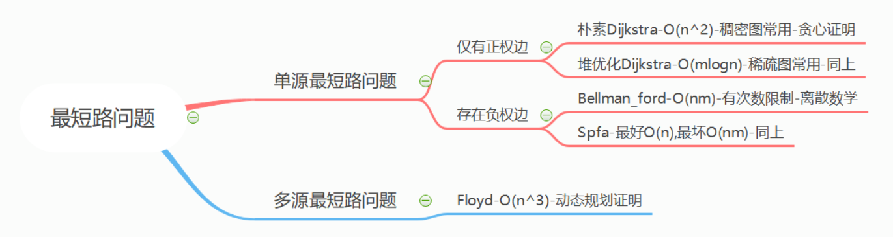

# 算法模板（用于可携带纸质材料的比赛）
## 基础算法
### 排序
快速排序：

```cpp
void quick_sort(int a[], int l, int r)
{
    // l >= r 终止防止无限递归
    if (l >= r) 
        return;
	// 由于用的是do-while循环，开始时i和j会先移动，因此初始化时i和j要比区间端点更靠外1位
    int i = l - 1, j = r + 1, x = a[(l + r)>> 1];
    while (i < j)
    {
        do{i++;} while(a[i] < x);
        do{j--;} while(a[j] > x);
        if (i < j)
            swap(a[i], a[j]);
    }
    // 由于j的循环逻辑，只有遇到a[j] <= x时才会停下，因此 j+1 到 r 全部 >= x，因此递归l到j和j+1到r即可

    quick_sort(a, l, j), quick_sort(a, j + 1, r);
    return;
}
```

归并排序：

```cpp
void merge_sort(int a[], int l, int r)
{
    if (l >= r)
        return;
    int mid = l + r >> 1;
    
    merge_sort(a, l, mid);
    merge_sort(a, mid + 1, r);
    
    int i = l, j = mid + 1, k = l;
    while (i <= mid && j <= r)
    {
        if (a[i] <= a[j])
            tmp[k++] = a[i++];
        else 
            tmp[k++] = a[j++];
    }
    while (i <= mid)
        tmp[k++] = a[i++];
    while (j <= r)
        tmp[k++] = a[j++];
    
    for (int i = l; i <= r; i++)
        a[i] = tmp[i];
}
```

### 二分
整数二分

```cpp
#include <iostream>
#include <algorithm>
#include <cstring>
using namespace std;
using ll = long long;
const int N = 1e5 + 9;

int n, q;
int a[N];

int main()
{
    ios::sync_with_stdio(0), cin.tie(0), cout.tie(0);
    cin >> n >> q;
    for (int i = 0; i < n; i++)
        cin >> a[i];
    while (q--)
    {
        int x; 
        cin >> x;
        
        // 找左临界 
        int l = -1, r = n;
        while (l + 1 != r)
        {
            int mid = l + r >> 1;
            if (a[mid] < x) l = mid;
            else r = mid;
        }
        cout << (a[r] == x ? r : -1) << ' ';
        
        // 找右临界 
        l = -1, r = n;
        while (l + 1 != r)
        {
            int mid = l + r >> 1;
            if (a[mid] > x) r = mid;
            else l = mid;
        }
        cout << (a[l] == x ? l : -1) << ' ';
        cout << '\n';
    }
    return 0;
}
```

浮点数二分：

```cpp
#include <bits/stdc++.h>
using namespace std;
typedef long long ll;
const int N = 1e4 + 9;
const double eps = 1e-8;

int a[N];

int main()
{
    ios::sync_with_stdio(0), cin.tie(0), cout.tie(0);
    double n;
    cin >> n;
    double l = -N, r = N;
    while (r - l > eps)
    {
        double mid = (l + r) / 2;
        if (mid * mid * mid < n)
            l = mid;
        else
            r = mid;
    }
    printf("%lf", l);
}
```

### 高精度
高精度加法：

```cpp
vector<int> add(vector<int> &A, vector<int> &B)
{
    vector<int> C;
    int t = 0;
    for (int i = 0; i < A.size() || i < B.size(); i++)
    {
        if (i < A.size())
            t += A[i];
        if (i < B.size())
            t += B[i];
        C.push_back(t % 10);
        t /= 10;
    }
    while (t)
    {
        C.push_back(t % 10);
        t /= 10;
    }
    while (C.size() > 1 && C.back() == 0)
        C.pop_back();
    return C;
}

int main()
{
    ios::sync_with_stdio(0), cin.tie(0), cout.tie(0);
    string a, b;
    cin >> a >> b;
    for (int i = a.size() - 1; i >= 0; i--)
        A.push_back(int(a[i] - '0'));
    for (int i = b.size() - 1; i >= 0; i--)
        B.push_back(int(b[i] - '0'));
    auto C = add(A, B);
    for (int i = C.size() - 1; i >= 0; i--)
        cout << C[i];
}
```

高精度减法：
```cpp
bool cmp(vector<int> &A, vector<int> &B)
{
    if (A.size() != B.size())
        return A.size() > B.size();
    for (int i = A.size() - 1; i >= 0; i--)
        if (A[i] != B[i])
            return A[i] > B[i];
    return true;
}

vector<int> sub(vector<int> &A, vector<int> &B)
{
    vector<int> C;
    int t = 0;
    for (int i = 0; i < A.size(); i++)
    {
        t += A[i];
        if (i < B.size())
            t -= B[i];
        if (t >= 0)
        {
            C.push_back(t);
            t = 0;
        }
        else
        {
            C.push_back(t + 10);
            t = -1;
        }
    }
    while (t)
    {
        C.push_back(t % 10);
        t /= 10;
    }
    while (C.size() > 1 && C.back() == 0)
        C.pop_back();
    return C;
}

int main()
{
    ios::sync_with_stdio(0), cin.tie(0), cout.tie(0);
    string a, b;
    cin >> a >> b;
    for (int i = a.size() - 1; i >= 0; i--)
        A.push_back(a[i] - '0');
    for (int i = b.size() - 1; i >= 0; i--)
        B.push_back(b[i] - '0');

    if (cmp(A, B))
    {
        auto C = sub(A, B);
        for (int i = C.size() - 1; i >= 0; i--)
            cout << C[i];
    }
    else
    {
        auto C = sub(B, A);
        cout << '-';
        for (int i = C.size() - 1; i >= 0; i--)
            cout << C[i];
    }
}
```

高精度乘法：
```cpp
vector<int> mul(vector<int> &A, int &b)
{
    vector<int> C;
    int t = 0;
    for (int i = 0; i < A.size(); i++)
    {
        t += A[i] * b;
        C.push_back(t % 10);
        t /= 10;
    }
    while (t)
    {
        C.push_back(t % 10);
        t /= 10;
    }
    while (C.size() > 1 && C.back() == 0)
        C.pop_back();
    return C;
}

int main()
{
    ios::sync_with_stdio(0), cin.tie(0), cout.tie(0);
    string a;
    int b;
    cin >> a >> b;
    for (int i = a.size() - 1; i >= 0; i--)
        A.push_back(int(a[i] - '0'));
    auto C = mul(A, b);
    for (int i = C.size() - 1; i >= 0; i--)
        cout << C[i];
}
```

高精度除法：
```cpp
vector<int> div(vector<int> &A, int &b)
{
    vector<int> C;
    int t = 0;
    for (int i = A.size() - 1; i >= 0; i--)
    {
        t = t * 10 + A[i];
        C.push_back(t / b);
        t %= b;
    }
    reverse(C.begin(), C.end());
    while (C.size() > 1 && C.back() == 0)
        C.pop_back();
    return C;
}

int main()
{
    ios::sync_with_stdio(0), cin.tie(0), cout.tie(0);
    string a;
    int b;
    cin >> a >> b;
    for (int i = a.size() - 1; i >= 0; i--)
        A.push_back(int(a[i] - '0'));
    auto C = div(A, b);
    for (int i = C.size() - 1; i >= 0; i--)
        cout << C[i];
    cout << '\n' << t;
}
```
### 前缀和与差分
一维前缀和：
```cpp
int a[N];
int prefix[N];
int main()
{
    ios::sync_with_stdio(0), cin.tie(0), cout.tie(0);
    int n, m;
    cin >> n >> m;
    for (int i = 1; i <= n; i++)
        cin >> a[i];
    for (int i = 1; i <= n; i++)
        prefix[i] = prefix[i - 1] + a[i];
    while (m--)
    {
        int l, r;
        cin >> l >> r;
        cout << prefix[r] - prefix[l - 1] << '\n';
    }
}
```
二维前缀和
```cpp
int a[N][N];
int prefix[N][N];

int main()
{
    ios::sync_with_stdio(0), cin.tie(0), cout.tie(0);
    int n, m, q;
    cin >> n >> m >> q;
    for (int i = 1; i <= n; i++)
        for (int j = 1; j <= m; j++)
            cin >> a[i][j];
    for (int i = 1; i <= n; i++)
        for (int j = 1; j <= m; j++)
            prefix[i][j] = prefix[i - 1][j] + prefix[i][j - 1] - prefix[i - 1][j - 1] + a[i][j];
    while (q--)
    {
        int x1, y1, x2, y2;
        cin >> x1 >> y1 >> x2 >> y2;
        cout << prefix[x2][y2] - prefix[x2][y1 - 1] - prefix[x1 - 1][y2] + prefix[x1 - 1][y1 - 1] << '\n';
    }
}
```
一维差分
```cpp
int main()
{
    ios::sync_with_stdio(0), cin.tie(0), cout.tie(0);
    int n, m;
    cin >> n >> m;
    for (int i = 1; i <= n; i++)
        cin >> a[i];
    for (int i = 1; i <= n; i++)
        d[i] = a[i] - a[i - 1];
    while (m--)
    {
        int l, r, c;
        cin >> l >> r >> c;
        d[l] += c;
        d[r + 1] -= c;
    }
    for (int i = 1; i <= n; i++)
    {
        a[i] = a[i - 1] + d[i];
        cout << a[i] << ' ';
    }
}
```
二维差分：
```cpp
void add(int x1, int y1, int x2, int y2, int c)
{
    d[x1][y1] += c;
    d[x2 + 1][y1] -= c;
    d[x1][y2 + 1] -= c;
    d[x2 + 1][y2 + 1] += c;
}

int main()
{
    ios::sync_with_stdio(0), cin.tie(0), cout.tie(0);
    int n, m, q;
    cin >> n >> m >> q;
    for (int i = 1; i <= n; i++)
        for (int j = 1; j <= m; j++)
        {
            cin >> a[i][j];
            add(i, j, i, j, a[i][j]);
        }
            
    while (q--)
    {
        int x1, y1, x2, y2, c;
        cin >> x1 >> y1 >> x2 >> y2 >> c;
        add(x1, y1, x2, y2, c);
    }
    for (int i = 1; i <= n; i++)
    {
        for (int j = 1; j <= m; j++)
        {
            a[i][j] = a[i - 1][j] + a[i][j - 1] - a[i - 1][j - 1] + d[i][j];
            cout << a[i][j] << ' ';
        }
        cout << '\n';
    }
}
```
### 双指针
最长连续不重复子序列
```cpp
int a[N];
int cnt[N];

int main()
{
	int n;
	cin >> n;
	for (int i = 1; i <= n; i++)
		cin >> a[i];
	int i = 1, j = 0, res = 0;
	while (j < n)
	{
		while (!cnt[a[j + 1]] && j < n)
		{
			j++;
			cnt[a[j]]++;
		}
		res = max(res, j - i + 1);
		cnt[a[i]]--;
		i++;
	}
	cout << res;
}
```
数组元素的目标和
```cpp
int a[N];
int b[N];
int n, m, x;

int main()
{
    ios::sync_with_stdio(0), cin.tie(0), cout.tie(0);
    cin >> n >> m >> x;
    for (int i = 0; i < n; i++)
        cin >> a[i];
    for (int i = 0; i < m; i++)
        cin >> b[i];
    for (int i = 0, j = m - 1; i < n; i++)
    {
        while (a[i] + b[j] > x) j--;
        if (a[i] + b[j] == x)
        {
            cout << i << ' ' << j << '\n';
            break;
        }
    }
}
```
### 位运算
二进制中1的个数：

`lowbit`：保留二进制中最低位的1，其余位为0
```cpp
int lowbit(int x)
{
    return x & -x;
}

int main()
{
    ios::sync_with_stdio(0), cin.tie(0), cout.tie(0);
    int n;
    cin >> n;
    for (int i = 1; i <= n; i++)
    {
        int x;
        cin >> x;
        int res = 0;
        while (x)
        {
            x -= lowbit(x);
            res++;
        }
        cout << res << ' ';
    }
}
```
### 离散化
```cpp
int p[M];
vector<int> X;
PII add[N], que[N];

int findx(int x)
{
    return lower_bound(X.begin(), X.end(), x) - X.begin() + 1;
}

int main()
{
    ios::sync_with_stdio(0), cin.tie(0), cout.tie(0);
    int n, m;
    cin >> n >> m;
    for (int i = 1; i <= n; i++)
    {
        int x, c;
        cin >> x >> c;
        X.push_back(x);
        add[i] = {x, c};
    }
    for (int i = 1; i <= m; i++)
    {
        int l, r;
        cin >> l >> r;
        X.push_back(l), X.push_back(r);
        que[i] = {l, r};
    }
    
    sort(X.begin(), X.end());
    X.erase(unique(X.begin(), X.end()), X.end());
    
    for (int i = 1; i <= n; i++)
        p[findx(add[i].first)] += add[i].second;
    for (int i = 1; i <= X.size(); i++)
        p[i] += p[i - 1];
        
    for (int i = 1; i <= m; i++)
    {
        int l = findx(que[i].first), r = findx(que[i].second);
        cout << p[r] - p[l - 1] << '\n';
    }
}
```
### 区间合并
区间合并：
```cpp
PII a[N];
vector<PII> res;
int main()
{
    ios::sync_with_stdio(0), cin.tie(0), cout.tie(0);
    int n;
    cin >> n;
    for (int i = 1; i <= n; i++)
        cin >> a[i].first >> a[i].second;
    
    sort(a + 1, a + 1 + n);
    
    int l = a[1].first, r = a[1].second;
    for (int i = 2; i <= n; i++)
    {
        int ll = a[i].first, rr = a[i].second;
        if (ll <= r)
            r = max(r, rr);
        else
        {
            res.push_back({l, r});
            l = ll, r = rr;
        }
    }
    res.push_back({l, r});
    cout << res.size() << '\n';
}
```
## 数据结构
### 单调栈/单调队列
单调栈：
```cpp
int stk[N], idx;

int main()
{
    ios::sync_with_stdio(0), cin.tie(0), cout.tie(0);
    int n;
    cin >> n;
    for (int i = 1; i <= n; i++)
    {
        int x;
        cin >> x;
        while (x <= stk[idx])
            idx--;
        cout << (idx ? stk[idx] : -1) << ' ';
        stk[++idx] = x;
    }
}
```
单调队列：
```cpp
int a[N], dq[N], hh = 1, tt = 0;
// dq存的是下标

int main()
{
    ios::sync_with_stdio(0), cin.tie(0), cout.tie(0);
    int n, k;
    cin >> n >> k;
    for (int i = 1; i <= n; i++)
        cin >> a[i];

    // 先求最小值
    for (int i = 1; i <= n; i++)
    {
        // 表示到 i - k + 1 ~ i 的最小值
        while (hh <= tt && dq[hh] <= i - k)
            hh++;
        while (hh <= tt && a[i] <= a[dq[tt]])
            tt--;
        dq[++tt] = i;
        if (i >= k)
            cout << a[dq[hh]] << ' ';
    }

    cout << '\n';
    // 再求最大值，记得重置数组
    memset(dq, 0, sizeof dq);
    for (int i = 1; i <= n; i++)
    {
        while (hh <= tt && dq[hh] <= i - k)
            hh++;
        while (hh <= tt && a[i] >= a[dq[tt]])
            tt--;
        dq[++tt] = i;
        if (i >= k)
            cout << a[dq[hh]] << ' ';
    }
}
```
### 字符串
KMP：
```cpp
vector<int> prefix_function(const string &s) {
    int n = s.size();
    vector<int> pi(n);
    for (int i = 1; i < n; i++) {
        int j = pi[i - 1];
        while (j > 0 && s[j] != s[i]) {
            j = pi[j - 1];
        }
        if (s[i] == s[j]) {
            pi[i] = j + 1;
        }
    }
    return pi;
}

int main() {
    int n, m;
    string text, pattern;
    cin >> n >> pattern >> m >> text;
    string join = pattern + "#" + text;
    vector<int> res;
    vector<int> pi = prefix_function(join);
    for (int i = n + 1; i <= n + m; i++) {
        if (pi[i] == n) {
            cout << i - 2 * n << ' ';
        }
    }
}
```

Trie：

用数组模拟Trie树，`son[N][26]` 的第一维表示某一个结点编号（每一个结点都有比单独编号，用 `idx` 记录），第二维表示它的儿子是哪一个字母，`son[N][26]` 的值表示其子结点编号．如果出现了以某个结点结束的字符串，就给此结点 `cnt++`．
```cpp
int son[N][26];
int cnt[N];
int idx, n;

void insert(string x)
{
	// 默认编号为0的点为树的根节点
    int p = 0;
    for (char ele : x)
    {
        int u = ele - 'a';
        // 如果结点p没有u的子节点，那么就新建一个结点
        if (!son[p][u])
            son[p][u] = ++idx;
        // 然后p变成子结点，进行下一个字符的循环
        p = son[p][u];
    }
    // p落在最后一个字符对应结点，字符串结束，cnt++
    cnt[p]++;
}

int query(string x)
{
    int p = 0;
    for (char ele : x)
    {
        int u = ele - 'a';
        // 如果p没有u的子结点，说明不存在查找的字符串，直接返回0
        if (!son[p][u])
            return 0;
        p = son[p][u];
    }
    // 走到最后一个字符时返回cnt
    return cnt[p];
}

int main()
{
    cin >> n;
    while (n --)
    {
        char opt;
        string x;
        cin >> opt >> x;
        if (opt == 'I')
            insert(x);
        else
            cout << query(x) << '\n';
    }
    return 0;
}
```

最大异或对：

Trie树的运用
```cpp
int n, son[N][2];
int idx;

void insert(int x)
{
    int p = 0;
    for (int i = 30; i >= 0; i--)
    {
        int u = x >> i & 1;
        if (!son[p][u])
            son[p][u] = ++idx;
        p = son[p][u];
    }
}

int query(int x)
{
    int p = 0, res = 0;
    for (int i = 30; i >= 0; i--)
    {
        res <<= 1;
        int u = x >> i & 1;
        if (son[p][!u])
        {
            p = son[p][!u];
            res += 1;
        }
        else
            p = son[p][u];
    }
    return res;
}

int main()
{
    ios::sync_with_stdio(0), cin.tie(0), cout.tie(0);
    cin >> n;
    int ans = 0;
    while (n --)
    {
        int x;
        cin >> x;
        ans = max(ans, query(x));
        insert(x);
    }
    cout << ans;
}
```

### 并查集
```cpp
int n, m, p[N];

int find(int x) 
{
    if (p[x] != x)
        p[x] = find(p[x]);
    return p[x];
}


int main()
{
    ios::sync_with_stdio(0), cin.tie(0), cout.tie(0);
    cin >> n >> m;
    for (int i = 1; i <= n; i++)
        p[i] = i;
    while (m --)
    {
        char opt;
        int a, b;
        cin >> opt >> a >> b;
        if (opt == 'M')
            p[find(a)] = find(b);
        else
            cout << (find(a) == find(b) ? "Yes" : "No") << '\n';
    }
    return 0;
}
```

### 堆
```cpp
int heap[N];
int n, m, idx;

// 上升时只需要跟父结点比，比父结点小就交换
void up(int k)
{
    int t = k / 2;
    if (t && heap[t] > heap[k])
    {
        swap(heap[t], heap[k]);
        up(t);
    }
    return;
}

// 下降时需要和两个子结点比，和更小者互换（如果和另一个换了，还要再和最小者换一次）
void down(int k)
{
    int t = k;
    if (2 * k <= idx && heap[t] > heap[2 * k])
        t = 2 * k;
    if (2 * k + 1 <= idx && heap[t] > heap[2 * k + 1])
        t = 2 * k + 1;
    if (t != k)
    {
        swap(heap[t], heap[k]);
        down(t);
    }
}

int pop()
{
    int t = heap[1];
    heap[1] = heap[idx];
    idx--;
    down(1);
    return t;
}

int main()
{
    ios::sync_with_stdio(0), cin.tie(0), cout.tie(0);
    cin >> n >> m;
    for (int i = 1; i <= n; i++)
    {
        cin >> heap[++idx];
        up(idx);
    }
    while (m --)
        cout << pop() << ' ';
    return 0;
}
```

### 哈希表
模拟散列表：
```cpp
int h[N], e[N], ne[N], idx = 1;
int n;

void insert(int x)
{
    int k = (x % N + N) % N;
    e[idx] = x;
    ne[idx] = h[k];
    h[k] = idx++;
}

bool exist(int x)
{
    int k = (x % N + N) % N;
    for (int i = h[k]; i; i = ne[i])
        if (e[i] == x)
            return true;
    return false;
}

int main()
{
    cin >> n;
    while(n --)
    {
        char opt;
        int x;
        cin >> opt >> x;
        if (opt == 'I')
            insert(x);
        else
            cout << (exist(x) ? "Yes" : "No") << '\n';
    }
}
```

字符串哈希：
```cpp
#include <iostream>
using namespace std;
typedef unsigned long long ull;
const int N = 1e5 + 9;
const int P = 131;

ull a[N], p[N];
int n, m;

ull SubHash(int l, int r)
{
    return a[r] - a[l - 1] * p[r - l + 1];
}

int main()
{
    ios::sync_with_stdio(0), cin.tie(0), cout.tie(0);
    string s;
    cin >> n >> m >> s;
    p[0] = 1;
    for (int i = 1; i <= n; i++)
    {
        a[i] = P * a[i - 1] + (ull)s[i - 1];
        // 将P的幂次提前计算出来，以便后面使用
        p[i] = P * p[i - 1];
    }
    while (m --)
    {
        int l1, r1, l2, r2;
        cin >> l1 >> r1 >> l2 >> r2;
        cout << (SubHash(l1, r1) == SubHash(l2, r2) ? "Yes" : "No") << '\n';
    }
}
```

## 搜索与图论
### DFS
排列数字：
```cpp
int n;
int path[N];
bool used[N];

void dfs(int u) // u表示当前正在处理第几个数（即已经填了u-1个数）
{
    if (u == n + 1)
    {
        for (int i = 1; i <= n; i++)
            cout << path[i] << ' ';
        cout << '\n';
        return;
    }
    // 如果到第n+1层，也就是填完了，就打印
    for (int i = 1; i <= n; i++)
    {
        if (!used[i])
        {
            path[u] = i;
            used[i] = true;
            dfs(u + 1);
            used[i] = false;
        }
        // 找到还没有被用的数，下一层填它，然后递归dfs(u+1)；递归完回溯要恢复原样，把这个数再改回没被使用
    }
}

int main()
{
    ios::sync_with_stdio(0), cin.tie(0), cout.tie(0);
    cin >> n;
    dfs(1);
}
```

树的重心：
```cpp
int h[N], e[M], ne[M], idx = 1, n;
bool st[N];
int son[N]; // son[i]表示i结点有多少子结点（含自身）

// 默认以结点1为根

int min_max = 1e9; // min_max表示连通块数量最大值的最小值

void add(int a, int b)
{
    e[idx] = b;
    ne[idx] = h[a];
    h[a] = idx++;
}

void dfs(int u)
{
    if (st[u])
        return;
    st[u] = true;
    son[u] = 1;
    int mx = 0; // mx 表示去掉点u后连通块数量的最大值
    for (int i = h[u]; i; i = ne[i])
    {
        int j = e[i];
        if (!st[j]) // 防止其往父结点遍历
        {
            dfs(j);
            son[u] += son[j];
            mx = max(mx, son[j]);
            // 遍历子结点并求出子结点连通块的值，与当前连通块最大值取大
        }
    }
    mx = max(mx, n - son[u]);
    // 最后计算除开u的子树外的连通块数量，取大，此时mx即为连通块最大值
    min_max = min(min_max, mx); // 与去掉u的连通块最大值取小
}

int main()
{
    cin >> n;
    for (int i = 1; i < n; i++)
    {
        int a, b;
        cin >> a >> b;
        add(a, b);
        add(b, a);
    }
    dfs(1);
    cout << min_max;
}
```
### BFS
走迷宫：
```cpp
int mp[N][N], dist[N][N]; // 存储地图和距离
int n, m;
int dx[4] = {1, 0, -1, 0}, dy[4] = {0, -1, 0, 1};

PII que[M]; // 队列，存储坐标对
int hh = 1, tt = 0; // 队列头尾指针

void bfs(int a, int b)
{
    que[++tt] = {a, b};
    dist[a][b] = 0;
    while (hh <= tt)
    {
        PII t = que[hh++];
        int x = t.first, y = t.second;
        for (int i = 0; i < 4; i++)
        {
            int xx = x + dx[i], yy = y + dy[i];
            if (mp[xx][yy] == 0 && xx >= 1 && xx <= n && yy >= 1 && yy <= m)
            {
                dist[xx][yy] = dist[x][y] + 1;
                mp[xx][yy] = 1;
                que[++tt] = {xx, yy};
            }
        }
    }
}

int main()
{
    ios::sync_with_stdio(0), cin.tie(0), cout.tie(0);
    cin >> n >> m;
    memset(dist, -1, sizeof dist); // 初始化距离数组为-1，如果某个位置dist仍为-1，表示该位置未被访问过
    for (int i = 1; i <= n; i++)
        for (int j = 1; j <= m; j++)
            cin >> mp[i][j];
    bfs(1, 1);
    cout << dist[n][m];
}
```
### 拓扑排序
```cpp
bool st[N];
int h[N], e[N], ne[N], in_degree[N], idx = 1;
int n, m;

int que[N], hh = 1, tt = 0;

void add(int a, int b)
{
    e[idx] = b;
    ne[idx] = h[a];
    h[a] = idx++;
}

void top_sort()
{
    // 初始化队列，将所有入度为0的点入队
    for (int i = 1; i <= n; i++)
        if (!in_degree[i])
            que[++tt] = i;
    while (hh <= tt)
    {
        int t = que[hh++];
        for (int i = h[t]; i; i = ne[i])
        {
            int j = e[i];
            st[j] = true;
            in_degree[j]--;
            // 每遍历到一个点，就将其入度减1
            if (!in_degree[j])
            	que[++tt] = j;
            // 如果入度变为0，就将其入队
        }
    }
}

int main()
{
    cin >> n >> m;
    for (int i = 1; i <= m; i++)
    {
        int a, b;
        cin >> a >> b;
        add(a, b);
        in_degree[b] += 1;
    }
    top_sort();
    if (tt == n)
    	for (int i = 1; i <= n; i++)
    		cout << que[i] << ' ';
    else
    	cout << -1;
}
```
### 最短路

Dijkstra：
```cpp
int n, m, idx = 1;
int e[N], ne[N], h[N], edge[N], dist[N];
bool st[N];
priority_queue<PII, vector<PII>, greater<PII>> heap; 

void add(int a, int b, int c)
{
    e[idx] = b;
    ne[idx] = h[a];
    h[a] = idx;
    edge[idx] = c;
    idx++;
}

int dijkstra()
{
    memset(dist, 0x3f, sizeof dist);
    dist[1] = 0;
    
    heap.push({0, 1});
    while (heap.size())
    {
        auto t = heap.top();
        heap.pop();
        
        int distance = t.first, ver = t.second;
        if (st[ver]) continue;
        st[ver] = true;
        
        for (int i = h[ver]; i; i = ne[i])
        {
            int j = e[i];
            if (!st[j])
            {
                dist[j] = min(dist[j], distance + edge[i]);
                heap.push({dist[j], j});
            }
        }
    }
    if (dist[n] > 0x3f3f3f3f / 2) return -1;
    return dist[n];
}

int main()
{
    ios::sync_with_stdio(0), cin.tie(0), cout.tie(0);
    cin >> n >> m;
    
    memset(edge, 0x3f, sizeof edge);
    
    for (int i = 1; i <= m; i++)
    {
        int a, b, c;
        cin >> a >> b >> c;
        add(a, b, c);
    }
    cout << dijkstra();
}
```
Bellman-Ford：
```cpp
int n, m, k;
int dist[N], backup[N];
struct Edge
{
    int st;
    int ed;
    int len;
}edge[N];

void bellmanford()
{
    memset(dist, 0x3f, sizeof dist);
    dist[1] = 0;
    while (k--)
    {
        memcpy(backup, dist, sizeof dist);
        for (int i = 1; i <= m; i++)
        {
            int st = edge[i].st, ed = edge[i].ed, len = edge[i].len;
            dist[ed] = min(dist[ed], backup[st] + len);
        }
    }
    if (dist[n] > 0x3f3f3f3f / 2)
        cout << "impossible" << '\n';
    else cout << dist[n] << '\n';
    return;
}

int main()
{
    ios::sync_with_stdio(0), cin.tie(0), cout.tie(0);
    cin >> n >> m >> k;

    for (int i = 1; i <= m; i++)
        cin >> edge[i].st >> edge[i].ed >> edge[i].len;
    bellmanford();
}
```
SPFA：
```cpp
int h[N], e[M], ne[M], edge[M], idx = 1;
int n, m;
int dist[N], cnt[N];

queue<int> q;
bool st[N];

void add(int a, int b, int c)
{
    e[idx] = b;
    ne[idx] = h[a];
    h[a] = idx;
    edge[idx] = c;
    idx++;
}

bool spfa()
{
    for (int i = 1; i <= n; i++)
    {
        q.push(i);
        st[i] = true;
    }
    while (!q.empty())
    {
        int t = q.front();
        q.pop();
        st[t] = false;
        for (int i = h[t]; i; i = ne[i])
        {
            int j = e[i];
            
            if (dist[j] > dist[t] + edge[i])
            {
                dist[j] = dist[t] + edge[i];
                cnt[j] = cnt[t] + 1;
                
                if (cnt[j] >= n)
                    return true;
                if (!st[j])
                {
                    q.push(j);
                    st[j] = true;
                }
            }
        }
    }
    return false;
}

int main()
{
    ios::sync_with_stdio(0), cin.tie(0), cout.tie(0);
    cin >> n >> m;
    for (int i = 1; i <= m; i++)
    {
        int a, b, c;
        cin >> a >> b >> c;
        add(a, b, c);
    }
    if (spfa())
        cout << "Yes" << '\n';
    else 
        cout << "No" << '\n';
    return 0;
}
```
Floyd：
```cpp
int n, m;
int dist[N][N];

void floyd()
{
    for (int k = 1; k <= n; k++)
        for (int i = 1; i <= n; i++)
            for (int j = 1; j <= n; j++)
                dist[i][j] = min(dist[i][j], dist[i][k] + dist[k][j]);
}

int main()
{
    ios::sync_with_stdio(0), cin.tie(0), cout.tie(0);
    int k;
    cin >> n >> m >> k;

    memset(dist, 0x3f, sizeof dist);
    for (int i = 1; i <= n; i++)
        dist[i][i] = 0;
    while (m--)
    {
        int a, b, c;
        cin >> a >> b >> c;
        dist[a][b] = min(dist[a][b], c);
    }
    floyd();
    while (k--)
    {
        int a, b;
        cin >> a >> b;
        if (dist[a][b] > 0x3f3f3f3f / 2)
            cout << "impossible" << '\n';
        else
            cout << dist[a][b] << '\n';
    }
}
```
### 最小生成树
Prim：
```cpp
int n, m;
int dist[N], edge[N][N];
bool st[N];

int prim()
{
    int res = 0;
    memset(dist, 0x3f, sizeof dist);
    for (int i = 0; i < n; i++)
    {
        int t = -1;
        for (int j = 1; j <= n; j++)
            if (!st[j] && (t == -1 || dist[t] > dist[j]))
                t = j;
        // 选出未加入最小生成树的点中距离最小的点

        st[t] = true;
        // 将该点加入最小生成树

        if (!i)
            dist[t] = 0;
        // 如果是第一个点，则将距离设为0

        if (i && dist[t] > 0x3f3f3f3f / 2)
            return dist[t];
        // 如果不是第一个点且距离为大数，说明不是连通图，不存在最小生成树

        res += dist[t];
        // 将该点的距离加入结果

        for (int j = 1; j <= n; j++)
        {
            if (!st[j])
                dist[j] = min(dist[j], edge[t][j]);
        }
        // 用该点更新其他点的距离
    }
    return res;
}

int main()
{
    // ios::sync_with_stdio(0), cin.tie(0), cout.tie(0);
    cin >> n >> m;
    memset(edge, 0x3f, sizeof edge);
    for (int i = 1; i <= m; i++)
    {
        int a, b, c;
        cin >> a >> b >> c;
        edge[a][b] = edge[b][a] = min(edge[a][b], c);
    }
    int u = prim();
    if (u > 0x3f3f3f3f / 2)
        cout << "impossible" << '\n';
    else
        cout << u;
}
```
Kruskal：
```cpp
int n, m;
int p[N];

struct Edge
{
    int st;
    int ed;
    int len;
    bool operator<(const Edge &w) const
    {
        return len < w.len;
    }
} edge[N];

int find(int x)
{
    if (p[x] != x)
        p[x] = find(p[x]);
    return p[x];
}
// 并查集的查找函数，查找一个节点的祖宗节点

int main()
{
    ios::sync_with_stdio(0), cin.tie(0), cout.tie(0);
    cin >> n >> m;
    for (int i = 1; i <= m; i++)
        cin >> edge[i].st >> edge[i].ed >> edge[i].len;
    for (int i = 1; i <= n; i++)
        p[i] = i;
    sort(edge + 1, edge + 1 + m);
    int cnt = 0, res = 0;
    // cnt记录已经加入最小生成树的边数
    // res记录最小生成树的边权和
    for (int i = 1; i <= m; i++)
    {
        int st = edge[i].st, ed = edge[i].ed, len = edge[i].len;
        st = find(st), ed = find(ed);
        if (st != ed)
        {
            res += len;
            cnt++;
            p[st] = ed;
        }
        // 如果两个节点不在同一个集合中，则将它们合并
    }
    if (cnt < n - 1)
        cout << "impossible" << '\n';
    else
        cout << res;
}
```
### 二分图
染色法：
```cpp
int n, m;
int h[N], e[M], ne[M], idx = 1;
int st[N];
// st数组存颜色，0代表未染色，1代表颜色1，2代表颜色2
// 3 - color表示另一种颜色
queue<PII> q;

void add(int a, int b)
{
    e[idx] = b;
    ne[idx] = h[a];
    h[a] = idx++;
}

bool bfs(int u)
{
    st[u] = 1;
    q.push({u, st[u]});
    while (!q.empty())
    {
        PII t = q.front();
        q.pop();
        int point = t.first, color = t.second;
        for (int i = h[point]; i; i = ne[i])
        {
            int j = e[i];
            if (!st[j])
            {
                st[j] = 3 - color;
                q.push({j, st[j]});
            }
            else if (st[j] == color)
                return false;
            // 如果j点没染色，就染成相反颜色
            // 如果j点已经染色且颜色与当前点相同，则说明不是二分图
        }
    }
    return true;
}

int main()
{
    ios::sync_with_stdio(0), cin.tie(0), cout.tie(0);
    cin >> n >> m;
    for (int i = 1; i <= m; i++)
    {
        int a, b;
        cin >> a >> b;
        add(a, b), add(b, a);
    }
    for (int i = 1; i <= n; i++)
    {
        if (!st[i])
            if (!bfs(i))
            {
                cout << "No" << '\n';
                return 0;
            }
    }
    cout << "Yes" << '\n';
    return 0;
}
```
匈牙利算法：
```cpp
int n1, n2, m;
int h[N], e[M], ne[M], idx = 1;
// 邻接表存的值只有女生
bool st[N];
// st数组用来标记每一轮女生是否被访问过
// 它的意义是防止同一轮换对象时，同一个女生一直被重复访问，导致死循环
int match[N];
// match数组用来存每个女生当前匹配的男生

void add(int a, int b)
{
    e[idx] = b;
    ne[idx] = h[a];
    h[a] = idx++;
}

bool find(int x)
{
	for (int i = h[x]; i; i = ne[i])
	{
		int j = e[i];
        // 遍历男生x能配对的女生j
		if (!st[j])
		{
			st[j] = true;
            // 如果女生j该轮还没被访问过，则标记为已访问
			if (!match[j] || find(match[j]))
			{
				match[j] = x;
				return true;
                // 如果女生j没有对象，或者她的对象能换人成功
                // 则将女生j与男生x配对成功，返回true
			}
		}
	}	
	return false;
}

int main()
{
    ios::sync_with_stdio(0), cin.tie(0), cout.tie(0);
    cin >> n1 >> n2 >> m;
    while (m--)
    {
        int u, v;
        cin >> u >> v;
        add(u, v);
        // 虽然是无向图，但由于我们只访问男生，因此只需要存男生到女生的边
    }
    int res = 0;
    for (int i = 1; i <= n1; i++)
    {
        memset(st, 0, sizeof st);
        // 由于st表示每一轮的女生状态，下一轮时需要将st数组清空，参考上述例子，如果不清空的话，男2就无法访问女1
        if (find(i))
            res++;
    }
    cout << res << '\n';
}
```

## 数学
### 质数
分解质因数：
```cpp
void divide(int x)
{
    for (int i = 2; i <= x / i; i++)
        if (x % i == 0) // 如果把if删去，会把非因数都输出一个0
        {
            int cnt = 0;
            while (x % i == 0)
            {
                x /= i;
                cnt++;
            }
            cout << i << ' ' << cnt << '\n';
        }
    if (x > 1) cout << x <<' '<< 1 << '\n';
}
```
筛质数（线性筛法）：
```cpp
bool st[N];    // false为质数
int primes[N]; // 存放质数
int idx;       // 记录质数个数

// 线性筛法的目的是让每一个合数只被它的最小质因子筛掉，实现O(n)复杂度
void get_primes(int n)
{
    for (int i = 2; i <= n; i++)
    {
        if (!st[i])
            primes[++idx] = i;
        for (int j = 1; j <= idx && primes[j] <= n / i; j++)
        {
            st[i * primes[j]] = true;
            if (i % primes[j] == 0)
                break;
        }
    }
}
```
### 约数
试除法求约数：
```cpp
vector<int> get_divisors(int x)
{
    vector<int> divisors;
    for(int i = 1; i <= x / i; i++)
    {
        if(x % i == 0)
        {
            divisors.push_back(i);
            if(i != x / i)
                divisors.push_back(x / i);
        }
    }
    sort(divisors.begin(),divisors.end());
    return divisors;
}
```
约数个数：
```cpp
const int mod = 1e9 + 7;
unordered_map<int,int> factors;

void get_divisors(int x)
{
    for(int i = 2; i <= x / i; i++)
    {
        while(x % i ==0)
        {
            x /= i;
            factors[i]++;
        }
    }
    if(x > 1)
        factors[x]++;
}

int main()
{
    ios::sync_with_stdio(0), cin.tie(0), cout.tie(0);
    int n;
    cin >> n;
    while(n--)
    {
        int x;
        cin >> x;
        get_divisors(x);
    }
    ll res = 1;
    for(auto ele : factors)
        res = res * (1 + ele.second) % mod;
    cout << res;
}
```
约数之和：
```cpp
const int mod = 1e9 + 7;
unordered_map<int, int> factors;

void get_divisors(int x)
{
    for (int i = 2; i <= x / i; i++)
    {
        while (x % i == 0)
        {
            x /= i;
            factors[i]++;
        }
    }
    if (x > 1)
        factors[x]++;
}

int main()
{
    ios::sync_with_stdio(0), cin.tie(0), cout.tie(0);
    int n;
    cin >> n;
    while (n--)
    {
        int x;
        cin >> x;
        get_divisors(x);
    }
    ll res = 1; // res存放总约数之和
    for(auto ele : factors)
    {
        ll tmp = 1; // tmp存放某个质因数的约数和
        int factor = ele.first, times = ele.second;
        for(int i = 1; i <= times; i++)
            tmp = (1 + tmp * factor) % mod;
        res = res * tmp % mod;
    }
    cout << res;
}
```
### 最大公约数
gcd与lcm：
```cpp
int gcd(int a, int b)
{
    if (!b)
        return a;
    return gcd(b, a % b);
}

int lcm(int a, int b)
{
    return a / gcd(a, b) * b;
}
```
扩展gcd：满足 $a_i \times x_i + b_i \times y_i = \gcd(a_i,b_i)$．
```cpp
int exgcd(int a, int b, int &x, int &y)
{
    if (!b)
    {
        x = 1, y = 0;
        return a;
    }
    int x1, y1, gcd = exgcd(b, a % b, x1, y1);
    x = y1;
    y = x1 - a / b * y1;
    return gcd;
}

int main()
{
    ios::sync_with_stdio(0), cin.tie(0), cout.tie(0);
    int n;
    cin >> n;
    while (n--)
    {
        int a, b, x, y;
        cin >> a >> b;
        exgcd(a, b, x, y);
        cout << x << ' ' << y << '\n';
    }
}
```

### 欧拉函数
试除法求欧拉函数：
```cpp
ll euler(int x)
{
    ll res = x;
    for(int i = 2; i <= x / i; i++)
    {
        if(x % i == 0)
        {
            res = res * (i - 1) / i;
            while(x % i == 0)
                x /= i;
        }
    }
    if(x > 1)
    res = res * (x - 1) / x;
    return res;
}

int main()
{
    ios::sync_with_stdio(0), cin.tie(0), cout.tie(0);
    int n;
    cin >> n;
    while(n--)
    {
        int x;
        cin >> x;
        cout << euler(x) << '\n';
    }
}
```
筛法求欧拉函数：
```cpp
int n;
int phi[N], primes[N], idx;
bool st[N];

void get_eulers(int n)
{
    phi[1] = 1;
    for (int i = 2; i <= n; i++)
    {
        if (!st[i])
        {
            phi[i] = i - 1;
            primes[++idx] = i;
        }
        for (int j = 1; j <= idx && primes[j] <= n / i; j++)
        {
            st[i * primes[j]] = true;
            if (i % primes[j] == 0)
            {
                phi[i * primes[j]] = phi[i] * primes[j];
                break;
            }
            else
                phi[i * primes[j]] = phi[i] * (primes[j] - 1);
        }
    }
}

int main()
{
    cin >> n;
    get_eulers(n);
    ll res = 0;
    for (int i = 1; i <= n; i++)
        res += phi[i];
    cout << res << '\n';
    return 0;
}
```
### 快速幂
```cpp
ll qmi(int a, int k, int p)
{
    ll res = 1;
    while (k)
    {
        if (k & 1)
            res = res * a % p;
        k >>= 1;
        a = (ll) a * a % p;
    }
    return res;
}
```
### 乘法逆元
乘法逆元：$\dfrac{a}{b} \equiv x \pmod p$ 则有 $a \times b_{inv} \equiv x \pmod p$

$p$ 为质数时，$b^{p-2}$ 即为 $b$ 在模 $p$ 下的乘法逆元．
```cpp
ll qmi(int a, int k, int p)
{
    ll res = 1;
    while (k)
    {
        if (k & 1)
            res = res * a % p;
        k >>= 1;
        a = (ll)a * a % p;
    }
    return res;
}

int gcd(int a, int b)
{
    if (a % b == 0)
        return b;
    return gcd(b, a % b);
}

int main()
{
    ios::sync_with_stdio(0), cin.tie(0), cout.tie(0);
    int n;
    cin >> n;
    while (n--)
    {
        int a, p;
        cin >> a >> p;
        if (gcd(a, p) == 1)
            cout << qmi(a, p - 2, p) << '\n';
        else
            cout << "impossible" << '\n';
    }
}
```

### 组合数
动态规划求法：$C_a^b = C_{a-1}^{b-1} + C_{a-1}^b$
```cpp
const int N = 2010, mod = 1e9 + 7;

ll c[N][N];

int main()
{
    for (int i = 0; i < N; i++)
        for (int j = 0; j <= i; j++)
            if (!j)
                c[i][j] = 1;
            else
                c[i][j] = (c[i - 1][j - 1] + c[i - 1][j]) % mod;
    int n;
    cin >> n;
    while (n--)
    {
        int a, b;
        cin >> a >> b;
        cout << c[a][b] << '\n';
    }
    return 0;
}
```
阶乘求法：$C_a^b \bmod p = (a! \bmod p) \times ((b!)^{-1} \bmod p) \times ((a-b)!^{-1} \bmod p) \pmod p$
```cpp
ll fact[N], infact[N];

ll qmi(int a, int k, int p)
{
    ll res = 1;
    while (k)
    {
        if (k & 1)
            res = res * a % p;
        k >>= 1;
        a = (ll)a * a % p;
    }
    return res;
}

int main()
{
    ios::sync_with_stdio(0), cin.tie(0), cout.tie(0);
    int n;
    cin >> n;
    fact[0] = 1;
    for (int i = 1; i < N; i++)
        fact[i] = fact[i - 1] * i % mod;
    for (int i = 0; i < N; i++)  
        infact[i] = qmi(fact[i], mod - 2, mod);

    while (n--)
    {
        int a, b;
        cin >> a >> b;
        cout << fact[a] * infact[b] % mod * infact[a - b] % mod << '\n';
    }
    return 0;
}
```
### Catalan数
第 $n$ 个Catalan数为 $C_{2n}^n - C_{2n}^{n- 1} = C_{2n}^n - \frac{n}{n + 1}C_{2n}^n = \frac{1}{n + 1}C_{2n}^n$．
```cpp
ll qmi(int a, int k, int p)
{
    ll res = 1;
    while (k)
    {
        if (k & 1)
            res = res * a % p;
        k >>= 1;
        a = (ll)a * a % p;
    }
    return res;
}

int main()
{
    int n;
    cin >> n;
    ll res = 1;
    for (int i = 1, j = 2 * n; i <= n; i++, j--)
    {
        res = res * j % mod;
        res = res * qmi(i, mod - 2, mod) % mod;
    }
    res = res * qmi(n + 1, mod - 2, mod) % mod;
    // 注意最后的 /(n + 1) 记得用逆元
    cout << res;
}
```
### 博弈论
Nim游戏：

状态 $a_1,a_2, \dots ,a_n$ 是必败状态，当且仅当 $a_1 \oplus a_2 \oplus \dots \oplus a_n = 0$．
## 动态规划
### 背包问题
01背包问题：

$f(i,j)$ 表示只用前 $i$ 个物品中的部分，体积不超过 $j$ 的背包物品价值的最大值．

状态转移方程：$f(i,j) = \max(f(i-1,j),f(i-1,j-v_i)+w_i)$．
```cpp
int v[MAX], w[MAX], f[MAX];

int main()
{
    int N, V;
    cin >> N >> V;
    for (int i = 1; i <= N; i++)
        cin >> v[i] >> w[i];
    for (int i = 1; i <= N; i++)
        for (int j = V; j >= v[i]; j--)
            f[j] = max(f[j], f[j - v[i]] + w[i]);
            
    cout << f[V];
    return 0;
}
```

完全背包问题：

状态转移方程：$f(i,j)=\max(f(i-1,j),f(i,j-v_i)+w_i)$．
```cpp
int v[MAX], w[MAX], f[MAX];

int main()
{
    int N, V;
    cin >> N >> V;
    for (int i = 1; i <= N; i++)
        cin >> v[i] >> w[i];
    
        
    for (int i = 1; i <= N; i++)
        for (int j = v[i]; j <= V; j++)
            f[j] = max(f[j], f[j - v[i]] + w[i]);
            
    cout << f[V];
    return 0;
}
```

多重背包问题：二进制优化为01背包

```cpp
int v[MAX];
int w[MAX];
int s[MAX];
int f[MAX];
int cnt;

int main()
{
    ios::sync_with_stdio(0), cin.tie(0), cout.tie(0);
    int N, V;
    cin >> N >> V;
    for (int i = 1; i <= N; i++)
    {
        int vv, ww, ss, k = 1;
        cin >> vv >> ww >> ss;
        while (ss >= k)
        {
            cnt++;
            v[cnt] = vv * k;
            w[cnt] = ww * k;
            ss -= k;
            k *= 2;
        }
        if (ss)
        {
            cnt++;
            v[cnt] = vv * ss;
            w[cnt] = ww * ss;
        }
    }
    N = cnt;
    for (int i = 1; i <= N; i++)
        for (int j = V; j >= v[i]; j--)
            f[j] = max(f[j], f[j - v[i]] + w[i]);
    cout << f[V];
    return 0;
}
```
分组背包：
```cpp
int v[MAX][MAX];
int w[MAX][MAX];
int s[MAX];
int f[MAX];

int main()
{
    ios::sync_with_stdio(0), cin.tie(0), cout.tie(0);
    int N, V;
    cin >> N >> V;
    for (int i = 1; i <= N; i++)
    {
        cin >> s[i];
        for (int j = 1; j <= s[i]; j++)
            cin >> v[i][j] >> w[i][j];
    }
    for (int i = 1; i <= N; i++)
        for (int j = V; j >= 0; j--)
            for (int k = 1; k <= s[i]; k++)
                if (j >= v[i][k])
                    f[j] = max(f[j], f[j - v[i][k]] + w[i][k]);
    cout << f[V];
    return 0;
}
```
### 线性DP
最长上升子序列：
```cpp
int a[N], len[N];
// len[i] 表示长度为i的上升子序列的最小尾元素
int idx;

int main()
{
    ios::sync_with_stdio(0), cin.tie(0), cout.tie(0);
    int n;
    cin >> n;
    for (int i = 1; i <= n; i++)
        cin >> a[i];
    len[++idx] = a[1];
    for (int i = 2; i <= n; i++)
    {
        if (a[i] > len[idx])
            len[++idx] = a[i];
        else
        {
            int pos = lower_bound(len + 1, len + 1 + idx, a[i]) - len;
            // 找到 >= x 的第一个i，并将 len[i] 替换为x
            // 替换原理：len[i] >= x，且len[i-1] < x，那么将x接到len[i-1]后形成的长度为i的序列结尾更小
            len[pos] = a[i];
        }
    }
    cout << idx;
    return 0;
}
```
最长公共子序列：
```cpp
char a[N], b[N];
int f[N][N];
int n, m;

int main()
{
    cin >> n >> m >> a + 1 >> b + 1;
    for (int i = 1; i <= n ;i++)
        for (int j = 1; j <= m; j++)
        {
            f[i][j] = max(f[i - 1][j], f[i][j - 1]);
            if (a[i] == b[j]) 
                f[i][j] = max(f[i][j], f[i - 1][j - 1] + 1);
        }
    cout << f[n][m];
    return 0;
}
```
### 区间DP
```cpp
int a[N], s[N];
int f[N][N];

int main()
{
    ios::sync_with_stdio(0), cin.tie(0), cout.tie(0);
    int n;
    cin >> n;
    for (int i = 1; i <= n; i++)
        cin >> a[i];
    for (int i = 1; i <= n; i++)
        s[i] = s[i - 1] + a[i];

    for (int len = 2; len <= n; len++)
        for (int l = 1, r = l + len - 1; r <= n; l++, r++)
        {
            f[l][r] = 0x3f3f3f3f;
            for (int k = l ; k <= r; k++)
                f[l][r] = min(f[l][r], f[l][k] + f[k + 1][r] + s[r] - s[l - 1]);
        }
    cout << f[1][n];
    return 0;
}
```
### 计数DP
整数划分：完全背包解法
```cpp
int f[N];

int main()
{
    ios::sync_with_stdio(0), cin.tie(0), cout.tie(0);
    int n;
    cin >> n;
    f[0] = 1;
    for (int i = 1; i <= n; i++)
        for (int j = i; j <= n; j++)
                f[j] = (f[j] + f[j - i]) % mod;
    cout << f[n];
}
```
### 状态压缩DP
最短Hamilton路径：
```cpp
#include <bits/stdc++.h>
using namespace std;
const int N = 21, M = 1 << N;

int a[N][N], f[M][N];
int n;
// f[i][j] 表示走过的点为i(状态压缩), 终点为j的最短距离
// 判断是否走过点k: i >> k & 1

int main()
{
    ios::sync_with_stdio(0), cin.tie(0), cout.tie(0);
    cin >> n;
    for (int i = 0; i < n; i++)
        for (int j = 0; j < n; j++)
            cin >> a[i][j];

    memset(f, 0x3f, sizeof f);
    f[1][0] = 0;

    // 计算f[i][j]
    for (int i = 1; i < (1 << n); i++)
        for (int j = 1; j < n; j++)
            if (i >> j & 1)
                for (int k = 0; k < n; k++)
                    if ((i >> k & 1) && j != k)
                        f[i][j] = min(f[i][j], f[i - (1 << j)][k] + a[j][k]);
    cout << f[(1 << n) - 1][n - 1];
    return 0;
}
```