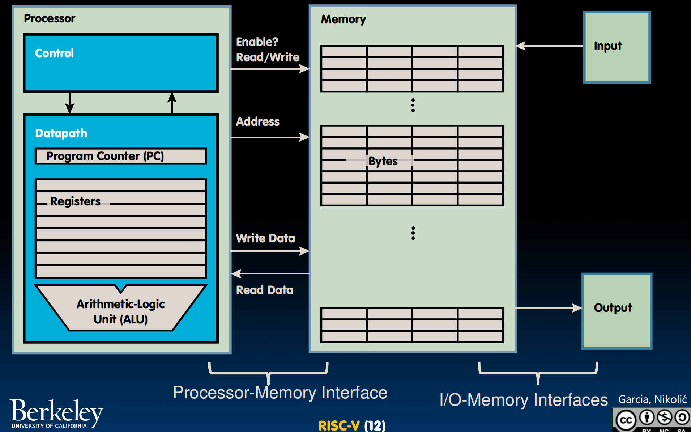
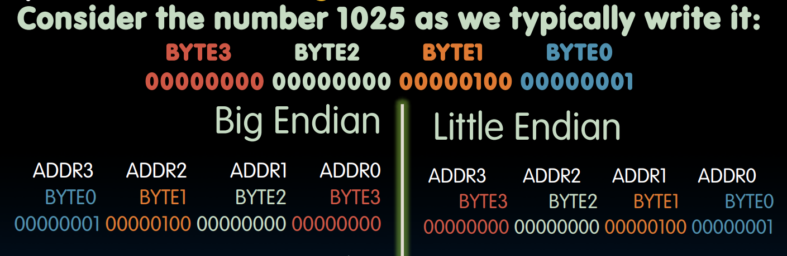
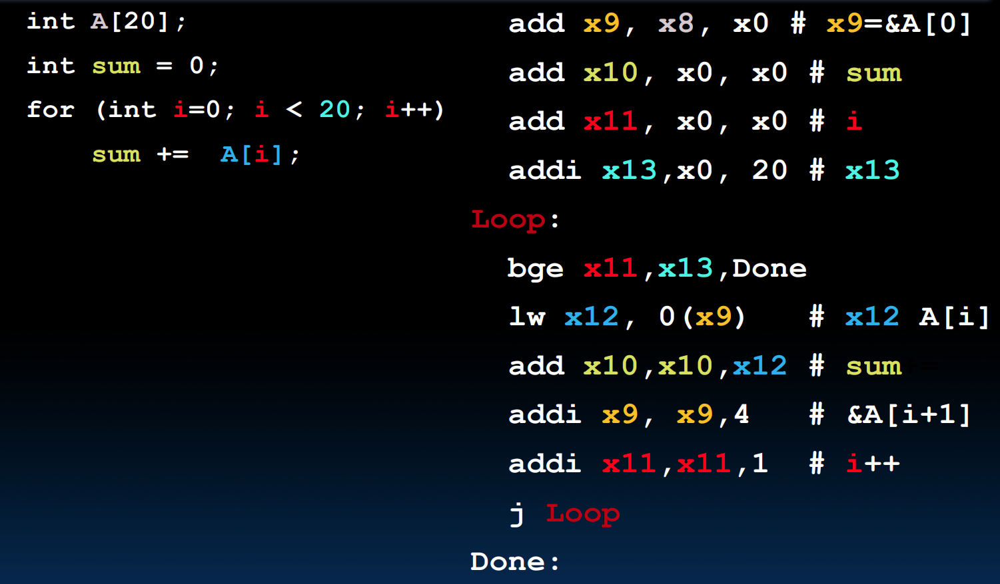

##  指令集架构
适用于某一类处理器的特定指令集被称为指令集架构（instruction set architecture），通过汇编语言来表示．

+ ARM指令集架构
+ Intel x86
+ MIPS
+ RISC-V
+ $\cdots$

## 寄存器

汇编语言的每条语句被称为一个指令（instruction），每一行最多包含一条指令．汇编语言的操作数通常为寄存器（registers）内部的数据，由于寄存器直接在硬件中，数据处理很快，但寄存器的数量也有限制．

在RISC-V中有32个寄存器，其RV32变体中，每个寄存器是32位宽；这些32位、4字节的组被称为**字**．若无特殊说明，本课程的RISC-指的均为其RV32变体．

这32个寄存器编号为x0~x31，其中x0的值永远为0．寄存器没有数据类型，操作寄存器的指令决定了我们如何处理寄存器里的数据．

## RISC-V 汇编

### 算术与逻辑运算

RISC-V的算术与逻辑运算指令具有相同的语法：`one two, three, four`：

+ one：操作的名字
+ two：操作结果的终点
+ three：第一个操作数
+ four：第二个操作数

**算术运算**：`add x1, x2, x3` 与 `sub x4, x5, x6` 等价于 `x1 = x2 + x3` 与 `x4 = x5 - x6`．由于x0恒为0，因此可以用 `add x3, x4, 0` 达到 `x3 = x4` 的效果（常用于复制数据）． 

汇编语言中的常数被称为立即数（immediate），immediate加法有特定的指令：`addi x3, x4, 10`．但是不需要 `subi`，因为 `addi` 操作的立即数可以是负数．



**逻辑运算**：含and、or、xor、sll（shift left logical逻辑左移）、srl（逻辑右移）、sra（arithmetic 算术右移）以及对应的immediate形式

and：

```python
Register:  and x5, x6, x7 # x5 = x6 & x7
Immediate: andi x5, x6, 3 # x5 = x6 & 3
```

用于掩码：与 0x000000FF andi 提取最低有效位，与0xFF000000 andi提取最高有效位．

注意到没有not，因为可以与 $(11111111)_2$​ 做异或操作来翻转每一位的值，因此not是不必要的．

注意，正数的逻辑、算数右移，负数的算术右移都是向下取整．

### 内存存储

内存（Memory）存储程序与数据．要访问内存中的每一个字，处理器（Processor）必须提供一个地址．选取完地址后，我们可以选择读取（load from memory）或写入（store to memory）．

内存中的地址是以字节为最小单位而不是字．

字节序（endianness）规定了字节在内存中的存储位置．

+ 小端序（Little-Endian）：最低有效位放在最低地址
+ 大端序（Big-Endian）：最高有效位放在最低地址

例如1025的存储：



在小端序中，字的地址与最右侧字节的地址相等．如上图中，字的地址为ADDR0． 


DRAM（dynamic random access memory）是实现内存的主流手段．其包含多种类型，如DDR（double data rate）、HBM（high bandwidth memory）．与寄存器相比，内存速度较慢而容量较高．

RISC-V的访存指令语法：`op rs2, offset(rs1)`． 

Load Word & Store Word：从内存中读取/存入整个字（4bytes），注意 x15 存的是内存的地址，且偏移量此时应该为4的倍数（因为是按字读取，需要内存对齐）

数据流（data flow）是左边写寄存器、右边写内存；lw是右流到左，sw是左流到右．

```C
// C code:
int A[100];
g = h + A[3];

// RISC-V code:
lw x10, 12(x15)
# x10 gets A[3]
# x15: base register (pointer to A[0])
# 12: offset in bytes (int = 4 bytes, so A[3] - A[0] = 12 bytes)
add x10, x12, x10
# x10 gets h + A[3]
sw x10, 40(x15)
# A[10] = h + A[3]
```

Load Bytes & Store Bytes：从内存中读取/存入字节．此时偏移量不必是4的倍数．不管偏移量是多少字节，数据总是复制到目标寄存器的最低字节位置，而剩下三个高位字节会自动全部填充那个存入字节的最高位（符号位），即符号扩展，从而不改变有符号数的大小．如果操作数是无符号数，不想让其自动扩展1，可以使用 `lbu`．

同理，sb只存放寄存器的最低位到内存．

```C
lb x10, 3(x11)
sb x10, 4(x11)
```

### 分支与跳转

**条件分支**：`bxx reg1, reg2, label`

`beq reg1, reg2, L1`：若reg1与reg2内值相等，则跳转到L1标签所在命令，否则继续下一条指令． 

+ `bne`：判断不相等
+ `blt`（branch less than）：判断小于（如果需要 `bgt`，交换顺序即可）
+ `bge`（branhc greater or equal）：判断大于等于（如果需要 `ble`，交换顺序即可）
+ `bltu`、`bgeu`：对应的无符号版本

**无条件跳转**：`j label` 

与 `beq x0, x0, label` 的差别：不用存储 `x0`，可以有更多空间存偏移量，跳得更远

**与C语言的差别**：C语言是“满足条件则执行特定内容”，RISC-V是”满足条件的跳到特定处”，因此汇编的条件判断和C通常要反着来，比如C是判断相等则执行特定代码，到汇编要变为判断不相等则跳过特定代码：


也可以加入Else分支，判断不相等后进入Else．记住要在if的结束块处加上跳转到Exit的指令，否则会顺着执行Else的部分．


### 循环

通过之前的指令已经可以实现for循环：



### 符号化寄存器名与伪指令

为了让汇编代码更易读、易写，RISC-V引入了符号化寄存器名和伪指令．

**符号化寄存器名**：为了体现寄存器的用途而起的绰号．例如a0-a7（对应x10-x17），代表存放函数参数的寄存器；x0起名为zero，代表永远为0．

**伪指令**：伪指令不是真正的硬件指令，只是汇编器提供的语法糖，汇编器会将伪指令翻译成硬件支持的基本指令．

+ `mv rd, rs` （move）将rs的值复制到rd，本质为 `addi rd, rs, 0`．
+ `li rd, 13` （load immediate）将立即数13加载到rd，本质为 `addi rd, x0, 13`
+ `nop` （no operation）发呆，本质为 `addi x0, x0, 0`．

### 函数调用

**函数调用的步骤**：

1. 将参数放在函数可以访问的地方
2. 将控制权交给函数
3. 给函数一些本地存储资源
4. 函数完成工作
5. 将返回值放在调用方可访问的地方，恢复在此期间使用过的所有寄存器状态，释放本地存储资源
6. 将控制权交给调用点

**寄存器调用约定**：

+ 参数与返回值寄存器（a0-a7，即x10-x17）：像函数传递参数．其中a0和a1还可以用于存放函数的返回值．
+ 返回地址寄存器（ra，即x1）：专门用于保存函数调用结束后的返回地址，以便程序能回到调用前的位置．
+ 保存寄存器（s0-s11，即x18-x27）：通常用于在函数调用期间保存需要保留的数据．

**函数调用的指令支持**：

+ 调用函数：使用 `jal`（jump and link），调用函数时通常使用 `jal FunctionLaber` 指令，跳转到目标函数地址，同时将当前指令的下一条指令地址存入 `ra` 中，以便后续返回．
+ 从函数返回：使用 `jr`（jump register），函数执行完毕后使用 `jr ra` 返回．函数返回不能单纯使用 `j` 的固定地址跳转，因为一个函数可能会被多处调用．伪指令 `ret` 等价于 `jr ra`．

实际上，处理这类跳转的真实指令只有：`jal rd, label`（rd表示destination register，用于保存跳转时的返回地址，即跳转前的下一条指令）与 `jalr rd, rs imm`．`jal FunctionLabel` 相当于 `jal ra, FunctionLabel`；`j Label` 相当于 `jal x0, Label`（相当于直接把返回地址丢弃）．

**过程例子**（sum函数）：

```
1000	mv a0, s0
1004	mv a1, s1
1008	jal sum
1012	...
...
2000	sum: add a0, a0, a1
2004	jr ra
```

## 编译

汇编语言的编译过程（其实就是C语言编译的后半段）：


最后的 `a.out` 太大了，无法存入寄存器，必须存在内存中．

RISC-V的每条指令都是32位，即每一个字都是一条指令．


程序计数器（program counter）位于处理器内部，其保存着下一条指令的字节地址．通过数据通路（datapath）和内存系统执行完指令后，PC需要指向下一条指令，由于32位定长，因此只需PC = PC + 4（字节）即可（或者在分支情况下加载为新地址）．


