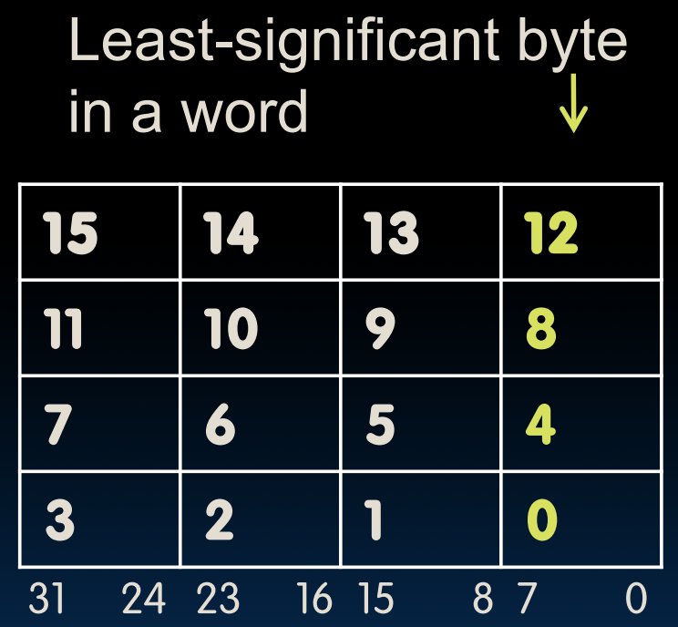
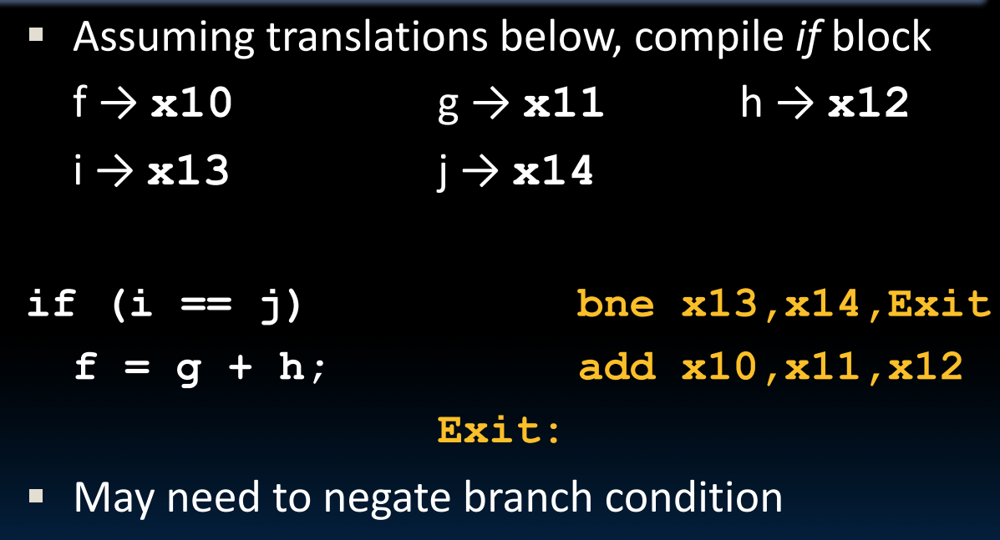
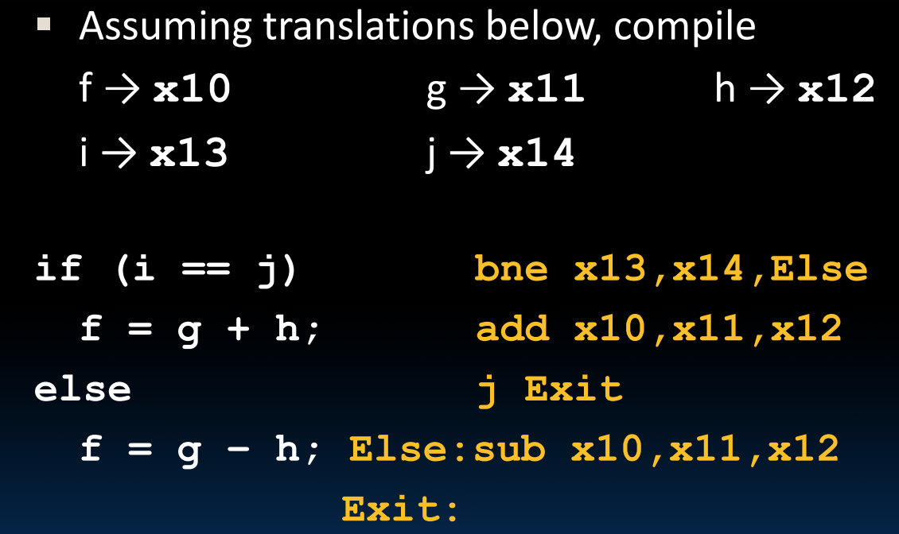
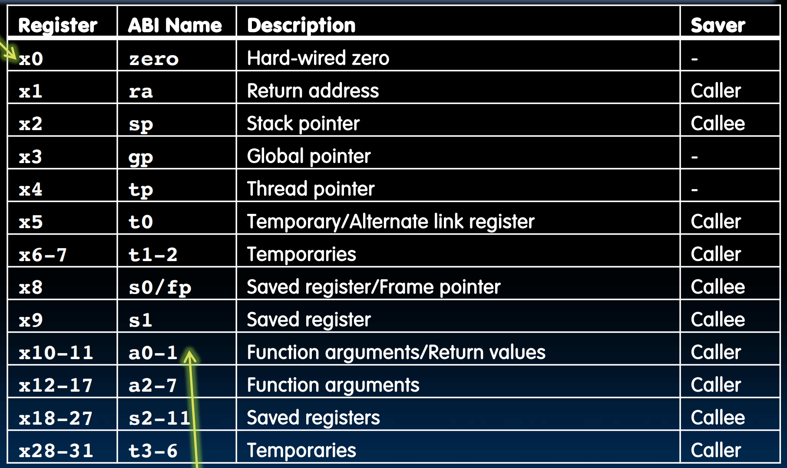
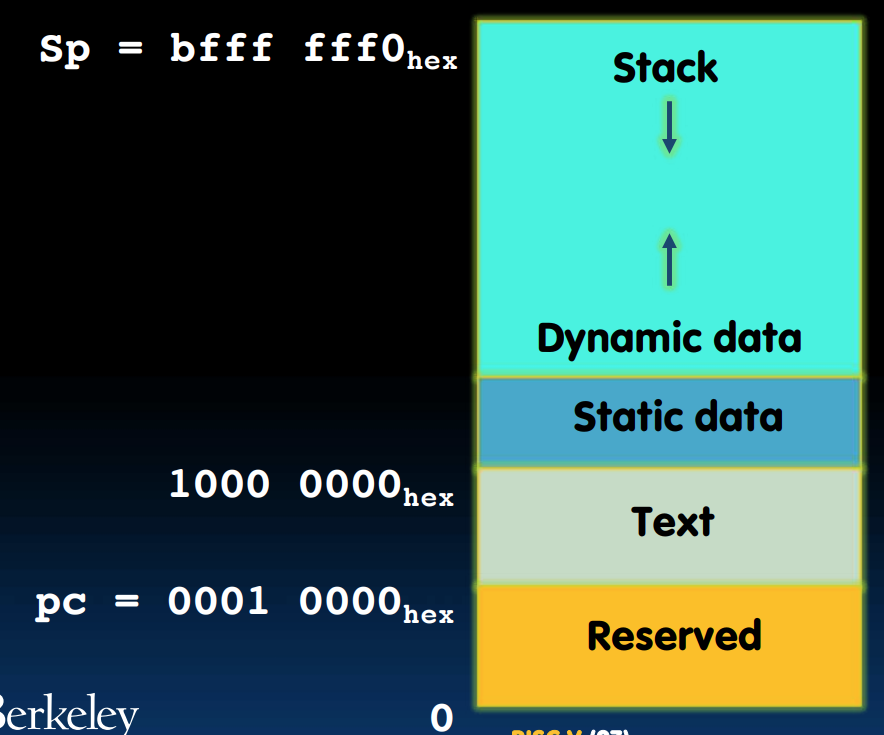
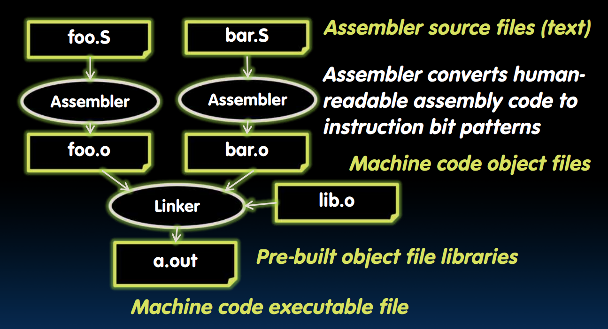
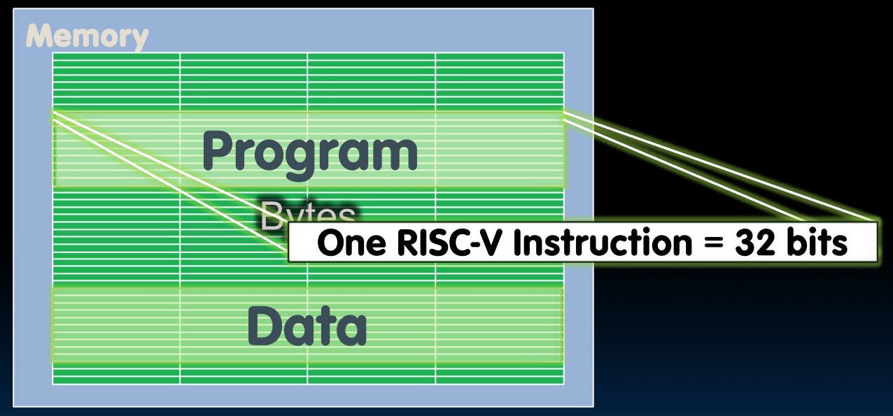
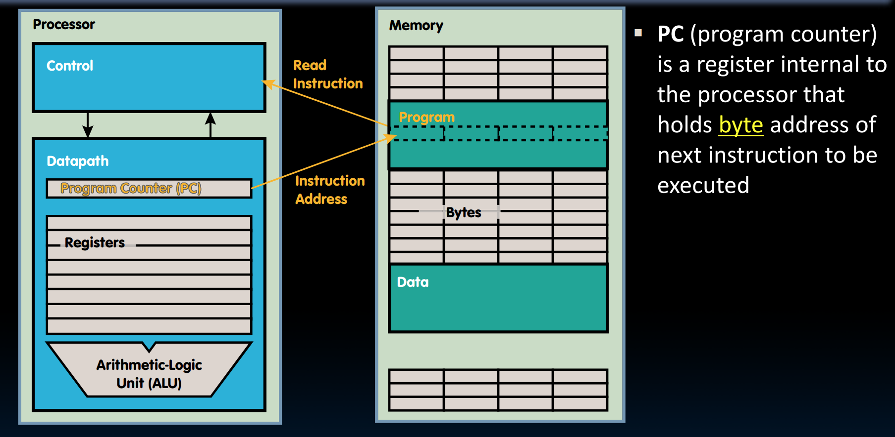
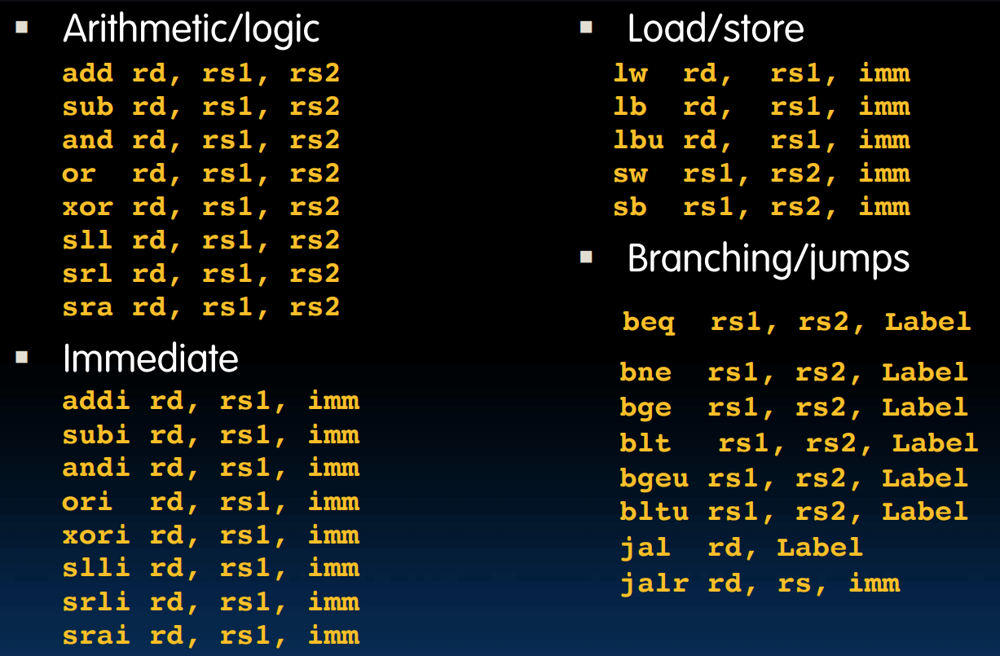

# RISC-V 姹囩紪璇█

##  鎸囦护闆嗘灦鏋?

閫傜敤浜庢煇涓€绫诲鐞嗗櫒鐨勭壒瀹氭寚浠ら泦琚О涓烘寚浠ら泦鏋舵瀯锛坕nstruction set architecture锛夛紝閫氳繃姹囩紪璇█鏉ヨ〃绀猴紟

+ ARM鎸囦护闆嗘灦鏋?
+ Intel x86
+ MIPS
+ RISC-V
+ $\cdots$

## 瀵勫瓨鍣?

姹囩紪璇█鐨勬瘡鏉¤鍙ヨ绉颁负涓€涓寚浠わ紙instruction锛夛紝姣忎竴琛屾渶澶氬寘鍚竴鏉℃寚浠わ紟姹囩紪璇█鐨勬搷浣滄暟閫氬父涓哄瘎瀛樺櫒锛坮egisters锛夊唴閮ㄧ殑鏁版嵁锛岀敱浜庡瘎瀛樺櫒鐩存帴鍦ㄧ‖浠朵腑锛屾暟鎹鐞嗗緢蹇紝浣嗗瘎瀛樺櫒鐨勬暟閲忎篃鏈夐檺鍒讹紟

鍦≧ISC-V涓湁32涓瘎瀛樺櫒锛屽叾RV32鍙樹綋涓紝姣忎釜瀵勫瓨鍣ㄦ槸32浣嶅锛涜繖浜?2浣嶃€?瀛楄妭鐨勭粍琚О涓?*瀛?*锛庤嫢鏃犵壒娈婅鏄庯紝鏈绋嬬殑RISC-鎸囩殑鍧囦负鍏禦V32鍙樹綋锛?

杩?2涓瘎瀛樺櫒缂栧彿涓簒0~x31锛屽叾涓瓁0鐨勫€兼案杩滀负0锛庡瘎瀛樺櫒娌℃湁鏁版嵁绫诲瀷锛屾搷浣滃瘎瀛樺櫒鐨勬寚浠ゅ喅瀹氫簡鎴戜滑濡備綍澶勭悊瀵勫瓨鍣ㄩ噷鐨勬暟鎹紟

## RISC-V 姹囩紪

### 绠楁湳涓庨€昏緫杩愮畻

RISC-V鐨勭畻鏈笌閫昏緫杩愮畻鎸囦护鍏锋湁鐩稿悓鐨勮娉曪細`one two, three, four`锛?

+ one锛氭搷浣滅殑鍚嶅瓧
+ two锛氭搷浣滅粨鏋滅殑缁堢偣
+ three锛氱涓€涓搷浣滄暟
+ four锛氱浜屼釜鎿嶄綔鏁?

**绠楁湳杩愮畻**锛歚add x1, x2, x3` 涓?`sub x4, x5, x6` 绛変环浜?`x1 = x2 + x3` 涓?`x4 = x5 - x6`锛庣敱浜巟0鎭掍负0锛屽洜姝ゅ彲浠ョ敤 `add x3, x4, 0` 杈惧埌 `x3 = x4` 鐨勬晥鏋滐紙甯哥敤浜庡鍒舵暟鎹級锛?

姹囩紪璇█涓殑甯告暟琚О涓虹珛鍗虫暟锛坕mmediate锛夛紝immediate鍔犳硶鏈夌壒瀹氱殑鎸囦护锛歚addi x3, x4, 10`锛庝絾鏄笉闇€瑕?`subi`锛屽洜涓?`addi` 鎿嶄綔鐨勭珛鍗虫暟鍙互鏄礋鏁帮紟


<div style="text-align: center; margin-top: 15px;"> </div>

**閫昏緫杩愮畻**锛氬惈 `and`銆乣or`銆乣xor`銆乣sll`锛坰hift left logical閫昏緫宸︾Щ锛夈€乣srl`锛堥€昏緫鍙崇Щ锛夈€乣sra`锛坅rithmetic 绠楁湳鍙崇Щ锛変互鍙婂搴旂殑immediate褰㈠紡

and锛?

```python
Register:  and x5, x6, x7 # x5 = x6 & x7
Immediate: andi x5, x6, 3 # x5 = x6 & 3
```

鐢ㄤ簬鎺╃爜锛氫笌 0x000000FF `andi` 鎻愬彇鏈€浣庢湁鏁堜綅锛屼笌0xFF000000 `andi` 鎻愬彇鏈€楂樻湁鏁堜綅锛?

娉ㄦ剰鍒版病鏈?`not`锛屽洜涓哄彲浠ヤ笌 $(11111111)_2$鈥?鍋氬紓鎴栨搷浣滄潵缈昏浆姣忎竴浣嶇殑鍊硷紝鍥犳 `not` 鏄笉蹇呰鐨勶紟

娉ㄦ剰锛屾鏁扮殑閫昏緫銆佺畻鏁板彸绉伙紝璐熸暟鐨勭畻鏈彸绉婚兘鏄悜涓嬪彇鏁达紟

### 鍐呭瓨瀛樺偍

鍐呭瓨锛圡emory锛夊瓨鍌ㄧ▼搴忎笌鏁版嵁锛庤璁块棶鍐呭瓨涓殑姣忎竴涓瓧锛屽鐞嗗櫒锛圥rocessor锛夊繀椤绘彁渚涗竴涓湴鍧€锛庨€夊彇瀹屽湴鍧€鍚庯紝鎴戜滑鍙互閫夋嫨璇诲彇锛坙oad from memory锛夋垨鍐欏叆锛坰tore to memory锛夛紟

鍐呭瓨涓殑鍦板潃鏄互瀛楄妭涓烘渶灏忓崟浣嶈€屼笉鏄瓧锛?

瀛楄妭搴忥紙endianness锛夎瀹氫簡瀛楄妭鍦ㄥ唴瀛樹腑鐨勫瓨鍌ㄤ綅缃紟

+ 灏忕搴忥紙Little-Endian锛夛細鏈€浣庢湁鏁堜綅鏀惧湪鏈€浣庡湴鍧€
+ 澶х搴忥紙Big-Endian锛夛細鏈€楂樻湁鏁堜綅鏀惧湪鏈€浣庡湴鍧€

渚嬪1025鐨勫瓨鍌細


<div style="text-align: center; margin-top: 15px;"> </div>

鍦ㄥ皬绔簭涓紝瀛楃殑鍦板潃涓庢渶鍙充晶瀛楄妭鐨勫湴鍧€鐩哥瓑锛庡涓婂浘涓紝瀛楃殑鍦板潃涓篈DDR0锛?


<div style="text-align: center; margin-top: 15px;"> </div>

DRAM锛坉ynamic random access memory锛夋槸瀹炵幇鍐呭瓨鐨勪富娴佹墜娈碉紟鍏跺寘鍚绉嶇被鍨嬶紝濡侱DR锛坉ouble data rate锛夈€丠BM锛坔igh bandwidth memory锛夛紟涓庡瘎瀛樺櫒鐩告瘮锛屽唴瀛橀€熷害杈冩參鑰屽閲忚緝楂橈紟

RISC-V鐨勮瀛樻寚浠よ娉曪細`op rs2, offset(rs1)`锛?

Load Word & Store Word锛氫粠鍐呭瓨涓鍙?瀛樺叆鏁翠釜瀛楋紙4bytes锛夛紝娉ㄦ剰 x15 瀛樼殑鏄唴瀛樼殑鍦板潃锛屼笖鍋忕Щ閲忔鏃跺簲璇ヤ负4鐨勫€嶆暟锛堝洜涓烘槸鎸夊瓧璇诲彇锛岄渶瑕佸唴瀛樺榻愶級锛屽亸绉婚噺琛ㄧず寰€楂樺湴鍧€鍋忕Щ锛?

鏁版嵁娴侊紙data flow锛夋槸宸﹁竟鍐欏瘎瀛樺櫒銆佸彸杈瑰啓鍐呭瓨锛沗lw` 鏄彸娴佸埌宸︼紝`sw` 鏄乏娴佸埌鍙筹紟

```C
// C code:
int A[100];
g = h + A[3];

// RISC-V code:
lw x10, 12(x15)
# x10 gets A[3]
# x15: base register (pointer to A[0])
# 12: offset in bytes (int = 4 bytes, so A[3] - A[0] = 12 bytes)
add x10, x12, x10
# x10 gets h + A[3]
sw x10, 40(x15)
# A[10] = h + A[3]
```

Load Bytes & Store Bytes锛氫粠鍐呭瓨涓鍙?瀛樺叆瀛楄妭锛庢鏃跺亸绉婚噺涓嶅繀鏄?鐨勫€嶆暟锛庝笉绠″亸绉婚噺鏄灏戝瓧鑺傦紝鏁版嵁鎬绘槸澶嶅埗鍒扮洰鏍囧瘎瀛樺櫒鐨勬渶浣庡瓧鑺備綅缃紝鑰屽墿涓嬩笁涓珮浣嶅瓧鑺備細鑷姩鍏ㄩ儴濉厖閭ｄ釜瀛樺叆瀛楄妭鐨勬渶楂樹綅锛堢鍙蜂綅锛夛紝鍗崇鍙锋墿灞曪紝浠庤€屼笉鏀瑰彉鏈夌鍙锋暟鐨勫ぇ灏忥紟濡傛灉鎿嶄綔鏁版槸鏃犵鍙锋暟锛屼笉鎯宠鍏惰嚜鍔ㄦ墿灞?锛屽彲浠ヤ娇鐢?`lbu`锛?

鍚岀悊锛宻b鍙瓨鏀惧瘎瀛樺櫒鐨勬渶浣庝綅鍒板唴瀛橈紟

```C
lb x10, 3(x11)
sb x10, 4(x11)
```

### 鍒嗘敮涓庤烦杞?

**鏉′欢鍒嗘敮**锛歚bxx reg1, reg2, label`

`beq reg1, reg2, L1`锛氳嫢reg1涓巖eg2鍐呭€肩浉绛夛紝鍒欒烦杞埌L1鏍囩鎵€鍦ㄥ懡浠わ紝鍚﹀垯缁х画涓嬩竴鏉℃寚浠わ紟 

+ `bne`锛氬垽鏂笉鐩哥瓑
+ `blt`锛坆ranch less than锛夛細鍒ゆ柇灏忎簬锛堝鏋滈渶瑕?`bgt`锛屼氦鎹㈤『搴忓嵆鍙級
+ `bge`锛坆ranhc greater or equal锛夛細鍒ゆ柇澶т簬绛変簬锛堝鏋滈渶瑕?`ble`锛屼氦鎹㈤『搴忓嵆鍙級
+ `bltu`銆乣bgeu`锛氬搴旂殑鏃犵鍙风増鏈?

**鏃犳潯浠惰烦杞?*锛歚j label` 

涓?`beq x0, x0, label` 鐨勫樊鍒細涓嶇敤瀛樺偍 `x0`锛屽彲浠ユ湁鏇村绌洪棿瀛樺亸绉婚噺锛岃烦寰楁洿杩?

**涓嶤璇█鐨勫樊鍒?*锛欳璇█鏄€滄弧瓒虫潯浠跺垯鎵ц鐗瑰畾鍐呭鈥濓紝RISC-V鏄€濇弧瓒虫潯浠剁殑璺冲埌鐗瑰畾澶勨€濓紝鍥犳姹囩紪鐨勬潯浠跺垽鏂拰C閫氬父瑕佸弽鐫€鏉ワ紝姣斿C鏄垽鏂浉绛夊垯鎵ц鐗瑰畾浠ｇ爜锛屽埌姹囩紪瑕佸彉涓哄垽鏂笉鐩哥瓑鍒欒烦杩囩壒瀹氫唬鐮侊細


<div style="text-align: center; margin-top: 15px;"> </div>

涔熷彲浠ュ姞鍏lse鍒嗘敮锛屽垽鏂笉鐩哥瓑鍚庤繘鍏lse锛庤浣忚鍦╥f鐨勭粨鏉熷潡澶勫姞涓婅烦杞埌Exit鐨勬寚浠わ紝鍚﹀垯浼氶『鐫€鎵цElse鐨勯儴鍒嗭紟


<div style="text-align: center; margin-top: 15px;"> </div>

### 寰幆

閫氳繃涔嬪墠鐨勬寚浠ゅ凡缁忓彲浠ュ疄鐜癴or寰幆锛?


<div style="text-align: center; margin-top: 15px;"> </div>

### 绗﹀彿鍖栧瘎瀛樺櫒鍚嶄笌浼寚浠?

涓轰簡璁╂眹缂栦唬鐮佹洿鏄撹銆佹槗鍐欙紝RISC-V寮曞叆浜嗙鍙峰寲瀵勫瓨鍣ㄥ悕鍜屼吉鎸囦护锛?

**绗﹀彿鍖栧瘎瀛樺櫒鍚?*锛氫负浜嗕綋鐜板瘎瀛樺櫒鐨勭敤閫旇€岃捣鐨勭话鍙凤紟渚嬪 `a0-a7`锛堝搴?`x10-x17` 锛夛紝浠ｈ〃瀛樻斁鍑芥暟鍙傛暟鐨勫瘎瀛樺櫒锛沗x0` 璧峰悕涓簔ero锛屼唬琛ㄦ案杩滀负0锛?

**浼寚浠?*锛氫吉鎸囦护涓嶆槸鐪熸鐨勭‖浠舵寚浠わ紝鍙槸姹囩紪鍣ㄦ彁渚涚殑璇硶绯栵紝姹囩紪鍣ㄤ細灏嗕吉鎸囦护缈昏瘧鎴愮‖浠舵敮鎸佺殑鍩烘湰鎸囦护锛?

+ `mv rd, rs` 锛坢ove锛夊皢rs鐨勫€煎鍒跺埌rd锛屾湰璐ㄤ负 `addi rd, rs, 0`锛?
+ `li rd, 13` 锛坙oad immediate锛夊皢绔嬪嵆鏁?3鍔犺浇鍒皉d锛屾湰璐ㄤ负 `addi rd, x0, 13`
+ `nop` 锛坣o operation锛夊彂鍛嗭紝鏈川涓?`addi x0, x0, 0`锛?

## 鍑芥暟璋冪敤
### 鍑芥暟璋冪敤姝ラ

1. 灏嗗弬鏁版斁鍦ㄥ嚱鏁板彲浠ヨ闂殑鍦版柟
2. 灏嗘帶鍒舵潈浜ょ粰鍑芥暟
3. 缁欏嚱鏁颁竴浜涙湰鍦板瓨鍌ㄨ祫婧?
4. 鍑芥暟瀹屾垚宸ヤ綔
5. 灏嗚繑鍥炲€兼斁鍦ㄨ皟鐢ㄦ柟鍙闂殑鍦版柟锛屾仮澶嶅湪姝ゆ湡闂翠娇鐢ㄨ繃鐨勬墍鏈夊瘎瀛樺櫒鐘舵€侊紝閲婃斁鏈湴瀛樺偍璧勬簮
6. 灏嗘帶鍒舵潈浜ょ粰璋冪敤鐐?

### 瀵勫瓨鍣ㄨ皟鐢ㄧ害瀹?

+ 鍙傛暟涓庤繑鍥炲€煎瘎瀛樺櫒锛坄a0-a7`锛屽嵆 `x10-x17`锛夛細鍍忓嚱鏁颁紶閫掑弬鏁帮紟鍏朵腑 `a0` 鍜?`a1` 杩樺彲浠ョ敤浜庡瓨鏀惧嚱鏁扮殑杩斿洖鍊硷紟
+ 杩斿洖鍦板潃瀵勫瓨鍣紙`ra`锛屽嵆 `x1`锛夛細涓撻棬鐢ㄤ簬淇濆瓨鍑芥暟璋冪敤缁撴潫鍚庣殑杩斿洖鍦板潃锛屼互渚跨▼搴忚兘鍥炲埌璋冪敤鍓嶇殑浣嶇疆锛?
+ 淇濆瓨瀵勫瓨鍣紙`s0-s11`锛屽嵆 `x18-x27`锛夛細閫氬父鐢ㄤ簬鍦ㄥ嚱鏁拌皟鐢ㄦ湡闂翠繚瀛橀渶瑕佷繚鐣欑殑鏁版嵁锛?
+ 鏍堟寚閽堬紙sp锛屽嵆 `x2`锛夛細鐢ㄤ簬鎸囧悜鏍堥《锛?

### 鎸囦护鏀寔

+ 璋冪敤鍑芥暟锛氫娇鐢?`jal`锛坖ump and link锛夛紝璋冪敤鍑芥暟鏃堕€氬父浣跨敤 `jal FunctionLaber` 鎸囦护锛岃烦杞埌鐩爣鍑芥暟鍦板潃锛屽悓鏃跺皢褰撳墠鎸囦护鐨勪笅涓€鏉℃寚浠ゅ湴鍧€瀛樺叆 `ra` 涓紝浠ヤ究鍚庣画杩斿洖锛?
+ 浠庡嚱鏁拌繑鍥烇細浣跨敤 `jr`锛坖ump register锛夛紝鍑芥暟鎵ц瀹屾瘯鍚庝娇鐢?`jr ra` 杩斿洖锛庡嚱鏁拌繑鍥炰笉鑳藉崟绾娇鐢?`j` 鐨勫浐瀹氬湴鍧€璺宠浆锛屽洜涓轰竴涓嚱鏁板彲鑳戒細琚澶勮皟鐢紟浼寚浠?`ret` 绛変环浜?`jr ra`锛?

瀹為檯涓婏紝澶勭悊杩欑被璺宠浆鐨勭湡瀹炴寚浠ゅ彧鏈夛細`jal rd, label`锛坮d琛ㄧずdestination register锛岀敤浜庝繚瀛樿烦杞椂鐨勮繑鍥炲湴鍧€锛屽嵆璺宠浆鍓嶇殑涓嬩竴鏉℃寚浠?PC+4锛変笌 `jalr rd, rs, imm`锛坮d淇濆瓨 PC+4锛岃烦杞埌 `rs +imm`锛夛紟`jal FunctionLabel` 鐩稿綋浜?`jal ra, FunctionLabel`锛沗j Label` 鐩稿綋浜?`jal x0, Label`锛堢浉褰撲簬鐩存帴鎶婅繑鍥炲湴鍧€涓㈠純锛夛紝`jr ra` 鐩稿綋浜?`jalr x0, ra, 0`锛?

**杩囩▼渚嬪瓙**锛坰um鍑芥暟锛夛細

```
1000	mv a0, s0
1004	mv a1, s1
1008	jal sum
1012	...
...
2000	sum: add a0, a0, a1
2004	jr ra
```

### 鏍堝抚

**鏍堢┖闂?*锛氬嚱鏁拌皟鐢ㄦ椂锛屽鏋滃瘎瀛樺櫒涓嶅鐢ㄦ垨闇€瑕佷繚瀛樻棫鐨勫瘎瀛樺櫒鍊硷紙濡?`ra`锛夛紝灏辫灏嗘暟鎹瓨鍏ュ唴瀛樼殑鏍堜腑锛庢爤鏄悜涓嬬敓闀跨殑锛屾柊鏁版嵁鐨勫湴鍧€鏇村皬锛巟2鏄爤鎸囬拡锛屽叾濮嬬粓鎸囧悜鏍堜腑鏈€鍚庝竴涓浣跨敤鐨勫唴瀛樼┖闂达紟

**鏍堢殑鎿嶄綔**锛?

+ push锛堝叆鏍堬級锛氫负鏁版嵁鍒嗛厤绌洪棿锛屼緥濡傚瓨鍌?瀛楄妭绌洪棿锛屽垯瑕佸噺灏弒p鐨勫€?`addi sp, sp, -8`
+ pop锛堝嚭鏍堬級锛氫负鏁版嵁鍥炴敹绌洪棿锛庡皢sp鍔犱笂涔嬪墠鍑忓幓鐨勬暟鍊硷紝灏嗘爤甯т粠鏍堜笂涓㈠純锛?

鐢宠鐨勮繖鍧楃敤浜庡瓨鍌ㄦ暟鎹殑绌洪棿琚О涓烘爤甯э紟鏍堝抚瀛樻斁鍐呭鍖呮嫭鍙傛暟锛堣秴杩嘺0-a7鐨勮寖鍥达級銆佸眬閮ㄥ彉閲忥紙鍚屽弬鏁帮級銆佽繑鍥炲湴鍧€锛堝鏋滆皟鐢ㄤ簡鍏朵粬鍑芥暟锛夈€佷繚瀛樼殑瀵勫瓨鍣紙s0-s11锛屾寜鐓х害瀹氾紝濡傛灉浣跨敤浜嗚繖浜涳紝瑕佸湪璋冪敤鍓嶅瓨浠栦滑锛夛紟

浠ヨ鍑芥暟涓轰緥瀛愶紝灏唖0涓巗1鐨勬暟鎹殏瀛橈細

```C
int Leaf(int g, int h, int i, int j)
{
    int f;
    f = (g + h) - (i + j);
    return f;
}
```

```
addi sp, sp, -8	# 鐢宠2涓猧nt绌洪棿
sw s1, 4(sp)	# 灏唖1鏁版嵁鏆傚瓨  
sw s0, 0(sp)	# 璁瞫0鏁版嵁鏆傚瓨

add s0, a0, a1 	# g + h
add s1, a2, a3 	# i + j
sub a0, s0, s1	# return value (g + h) - (i + j)

lw s0, 0(sp)	# 灏唖0鏁版嵁璇诲洖
lw s1, 4(sp)	# 灏唖1鏁版嵁璇诲洖
addi sp, sp, 8	# 灏唖p鎸囬拡鎭㈠
jr ra
```

### 宓屽鍑芥暟


<div style="text-align: center; margin-top: 15px;"> </div>

RISC-V鏈変竴濂椾弗鏍肩殑瀵勫瓨鍣ㄨ皟鐢ㄧ害瀹氾紟鎵€鏈夌殑瀵勫瓨鍣ㄥ搴斿睘鎬у彲浠ヨ涓婂浘锛?

+ 涓嶄繚璇佷繚鐣欑殑瀵勫瓨鍣細濡?`ra`銆乣a0-a7`銆乣t0-t6` 绛夛紟杩欎簺瀵勫瓨鍣ㄥ€煎湪璋冪敤鍑芥暟鍚庝細鐮村潖锛屽鏋滆皟鐢ㄦ柟鎯宠璋冪敤鍏朵粬鍑芥暟鍚庤繕鎯充娇鐢ㄨ繖浜涘€硷紝闇€瑕佽嚜宸卞皢杩欎簺鍊煎帇鏍堜繚瀛橈紟
+ 淇濊瘉淇濈暀鐨勫瘎瀛樺櫒锛氬 `s0-s11` 鍜?`sp`锛庤皟鐢ㄦ柟鍙互鏀惧績鍦拌涓鸿繖浜涘瘎瀛樺櫒鍐呴儴鐨勫€间笉浼氫慨鏀癸紟濡傛灉琚皟鐢ㄧ殑鍑芥暟闇€瑕佷慨鏀硅繖浜涘瘎瀛樺櫒涓殑鍊硷紝瀹冮渶瑕佸湪鎵ц鍓嶅皢鏃у€煎帇鏍堜繚瀛橈紝杩斿洖鍓嶅皢鏃у€煎嚭鏍堟仮澶嶏紟

浠ヨ鍑芥暟涓轰緥锛屼粙缁嶄竴涓嬪祵濂楄皟鐢ㄨ繃绋嬶細

```C
int sumSquare(int x, int y)
{
    return mult(x, x) + y;
}
```

棣栧厛鑰冭檻鎴戜滑闇€瑕佸瓨鍝簺鍊硷紟涓や釜鍙傛暟鍒嗗埆涓篴0瀛榵锛宎1瀛榶锛涘綋璋冪敤 `mult(x, x)` 鏃讹紝a1涔熶細鎴愪负x鑰宎0涓嶅彉锛屽洜姝ゆ垜浠渶瑕佸皢a1瀛樿捣鏉ワ紱鍚屾椂璁板緱姣忔宓屽蹇呴』瀛樺偍鐨剅a锛屼篃灏辨槸璇存垜浠鍦ㄦ爤鐢宠8瀛楄妭绌洪棿锛?

灏嗘暟鎹帇鏍堝悗锛屾垜浠渶瑕佸皢mult闇€瑕佺殑鍙傛暟鍑嗗濂斤紝鍗冲皢a0璧嬪€肩粰a1浣垮緱a1瀛樼殑涔熸槸x锛庤皟鐢ㄥ嚱鏁板悗灏嗘爤涓殑鍊煎彇鍑猴紝骞舵仮澶峴p锛庣劧鍚庣户缁墽琛?`sumSuqare` 鍚庣画鐨?+y 鎿嶄綔锛屾渶鍚庤繑鍥烇紟

```
# Prologue: push鎿嶄綔
addi sp, sp, -8
sw ra, 4(sp)
sw a1, 0(sp)

# Body: 璋冪敤宓屽鍑芥暟
mv a1, a0
jal mult

# Epilogue: pop鎿嶄綔
lw a1, 0(sp)
lw ra, 4(sp)
addi sp, sp, 8

# 瀹屾暣鑷繁鐨勫悗缁搷浣滐紝杩斿洖
add a0, a0, a1
jr ra
```

### 鍐呭瓨绠＄悊

RV32鐨勫唴瀛樺垎閰嶏細

+ 鏍堜粠 bfff fff0 寮€濮嬶紝寰€涓嬬敓闀匡紙鍏朵綑鍧囦负寰€涓婄敓闀匡級锛宻p鎸囧悜姝ゅ锛?
+ 绋嬪簭鏂囨浠?0001 0000 寮€濮嬶紝pc鎸囧悜姝ゅ
+ 闈欐€佹暟鎹紙甯搁噺銆乻tatic鍙橀噺锛変粠1000 0000寮€濮嬶紝gp锛坓lobal point锛夋寚鍚戞澶?
+ 鍫嗗湪闈欐€佹暟鎹笂鏂癸紟

<div style="text-align: center; margin-top: 15px;"> </div>

## 缂栬瘧

姹囩紪璇█鐨勭紪璇戣繃绋嬶紙鍏跺疄灏辨槸C璇█缂栬瘧鐨勫悗鍗婃锛夛細


<div style="text-align: center; margin-top: 15px;"> </div>

鏈€鍚庣殑 `a.out` 澶ぇ浜嗭紝鏃犳硶瀛樺叆瀵勫瓨鍣紝蹇呴』瀛樺湪鍐呭瓨涓紟

RISC-V鐨勬瘡鏉℃寚浠ら兘鏄?2浣嶏紝鍗虫瘡涓€涓瓧閮芥槸涓€鏉℃寚浠わ紟


<div style="text-align: center; margin-top: 15px;"> </div>

绋嬪簭璁℃暟鍣紙program counter锛変綅浜庡鐞嗗櫒鍐呴儴锛屽叾淇濆瓨鐫€涓嬩竴鏉℃寚浠ょ殑瀛楄妭鍦板潃锛庨€氳繃鏁版嵁閫氳矾锛坉atapath锛夊拰鍐呭瓨绯荤粺鎵ц瀹屾寚浠ゅ悗锛孭C闇€瑕佹寚鍚戜笅涓€鏉℃寚浠わ紝鐢变簬32浣嶅畾闀匡紝鍥犳鍙渶 `PC = PC + 4`锛堝瓧鑺傦級鍗冲彲锛堟垨鑰呭湪鍒嗘敮鎯呭喌涓嬪姞杞戒负鏂板湴鍧€锛夛紟


<div style="text-align: center; margin-top: 15px;"> </div>

## 鎬荤粨

鐩墠涓烘鎵€鏈夊凡瀛︿範鐨勬寚浠わ細


<div style="text-align: center; margin-top: 15px;"> </div>

