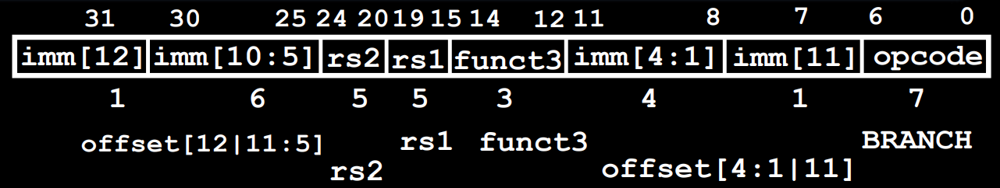
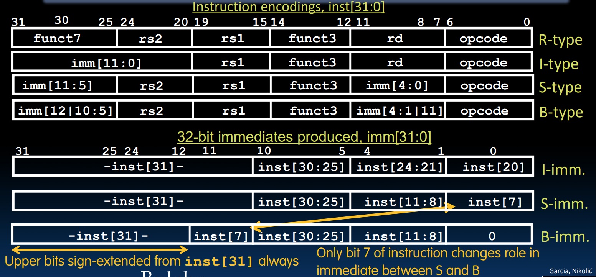
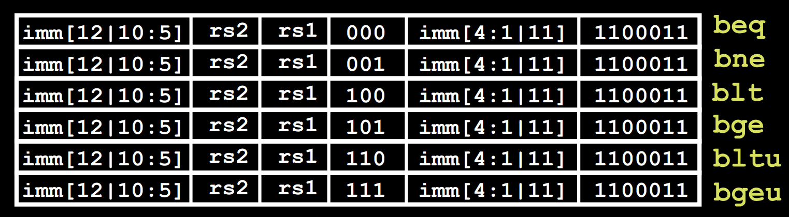
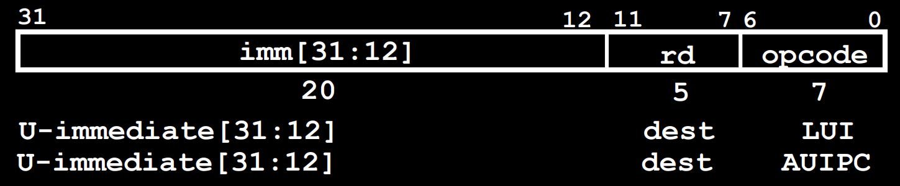
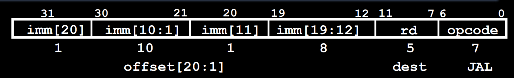
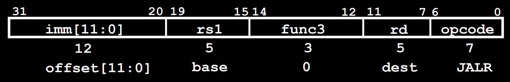
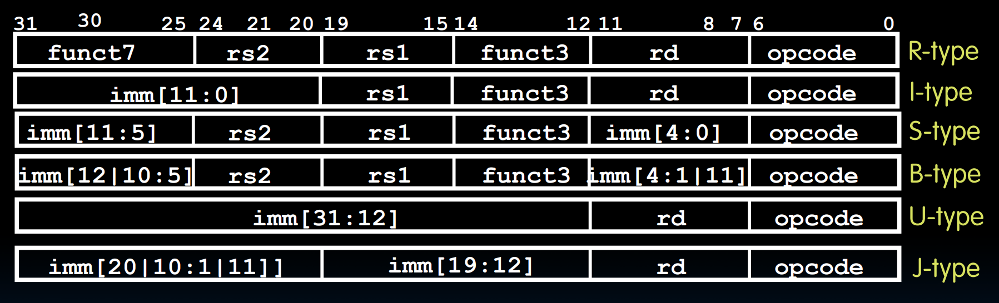

# RISC-V 鏈哄櫒璇█

## 鍐渚濇浖鏋舵瀯

**鍐渚濇浖鏋舵瀯**锛氱▼搴忕殑鎸囦护鍜屾暟鎹竴璧峰瓨鍌ㄥ湪鍐呭瓨涓紝鍙互琚鍙栥€佸啓鍏ワ紟杩欎娇寰楄绠楁満鍙互蹇€熼噸鏂扮紪绋嬭€屼笉闇€瑕佽繘琛岀‖浠舵帴绾匡紟

+ 鐢变簬鍧囧瓨鍌ㄥ湪鍐呭瓨涓紝鍥犳鎵€鏈変笢瑗匡紙鎸囦护涓庢暟鎹級閮芥槸鍙鍧€鐨勶紱涓撻棬鏈変竴涓瘎瀛樺櫒鎸囧悜绋嬪簭鎵ц鐨勬寚浠わ紙Program Counter锛夛紟
+ 绋嬪簭浠ヤ簩杩涘埗褰㈠紡鍙戝竷锛屼娇寰楀叾鏈変簩杩涘埗鍏煎鎬э細鏃х▼搴忥紙浜岃繘鍒舵枃浠讹級鍙互鐩存帴鍦ㄦ敮鎸佽鎸囦护闆嗙殑鏂版満鍣ㄤ笂杩愯锛?

## 鎸囦护缂栫爜鏍煎紡

RISC-V鐨勬墍鏈夋寚浠ら兘鍜屾暟鎹竴鏍疯璁捐涓哄浐瀹氱殑32浣嶏紟涓轰簡瀹炵幇涓嶅悓鍔熻兘锛屽皢杩?2浣嶅垝鍒嗘垚浜嗕笉鍚岀殑**瀛楁**锛屽苟瀹氫箟浜嗗叚绉嶅熀鏈牸寮忥細R銆両銆丼銆丅銆乁銆丣锛?

鐢变簬鍏辨湁32涓瘎瀛樺櫒锛屽洜姝よ〃绀哄瘎瀛樺櫒鑷冲皯闇€瑕?bit瀹斤紟

### R鏍煎紡

R鏍煎紡鐢ㄤ簬绠楁暟涓庨€昏緫鎿嶄綔鐨勬寚浠わ紟


<div style="text-align: center; margin-top: 15px;"> </div>

**瀛楁鍒掑垎**锛歚funct7` (7浣?銆乣rs2` (5浣?銆乣rs1` (5浣?銆乣funct3` (3浣?銆乣rd` (5浣?銆乣opcode` (7浣?锛?

+ `rs1`銆乣rs2`銆乣rd` 鍧囦负5浣嶏紝鍒嗗埆琛ㄧず涓変釜鎿嶄綔瀵勫瓨鍣紟
+ `opcode` 浠ｈ〃褰撳墠鎸囦护鏄粈涔堟牸寮忥紱瀵逛簬R鏍煎紡鑰岃█锛屽潎涓?110011锛?
+ `funct7` 涓?`funct3` 鍜?`opcode` 鍏卞悓鍐冲畾浜嗚鎵ц鐨勬搷浣滐紟鎿嶄綔瀵瑰簲鍏崇郴濡備笅鍥炬墍绀猴細


<div style="text-align: center; margin-top: 15px;"> </div>

> 姣斾箣鍓嶅浜嗕袱绉嶆搷浣滐細`slt` 琛ㄧずset less than锛屾寚浠や负 `slt rd, rs1, rs2`锛岃〃绀哄鏋?`rs1 < rs2` 灏卞皢 `rd` 璁句负1锛巂sltu` 涓烘棤绗﹀彿姣旇緝鐗堟湰锛?

### I鏍煎紡

I鏍煎紡鐢ㄤ簬涓庣珛鍗虫暟Immediate鏈夊叧鐨勬寚浠わ紟


<div style="text-align: center; margin-top: 15px;"> </div>

+ 鐢变簬 `addi` 鎸囦护涓?`rs2` 娌℃湁琚敤鍒帮紝鎴戜滑灏嗗叾涓?`funct7` 鍚堝苟涓?2浣嶇敤鏉ヨ〃绀虹珛鍗虫暟锛庡叾瑕嗙洊鑼冨洿涓?$[-2048, 2047]$鈥嬧€嬧€嬶紙鐢变簬鍏惰涓?`rs1` 涓?2浣嶇殑鏁拌繘琛屾搷浣滐紝鎿嶄綔鍓嶉渶瑕佺鍙锋墿灞曞埌32浣嶏級锛?
+ I鏍煎紡鐨?`opcode` 涓?010011锛?


<div style="text-align: center; margin-top: 15px;"> </div>

鐢变簬涓€涓瘎瀛樺櫒鍙湁32浣嶏紝绉诲姩瓒呰繃31浣嶇殑鍊兼病鏈夋剰涔夛紝鍥犳绉讳綅鎿嶄綔鐨勫瓧娈靛垝鍒嗕粛鐒剁被浼糝鎸囦护锛屽叾涓?`rs2` 涓虹Щ浣嶆暟锛岀30浣嶇敤浜庡尯鍒嗛€昏緫/绠楁暟鍙崇Щ锛?

涓嶳鎸囦护姣旇緝锛屽悓鏍风殑鎸囦护瀵瑰簲鐨?`funct3` 浠ｇ爜鍏跺疄涔熸槸鐩稿悓鐨勶紟

鐢变簬load word鎸囦护鐨勬牸寮忎笌绔嬪嵆鏁拌绠楀嚑涔庝竴鏍凤紙`rs1` 琛ㄧず `base`銆乣rd` 琛ㄧず `dest`銆佺珛鍗虫暟琛ㄧず鍋忕Щ閲忥級锛屽洜姝oad鎸囦护涔熸槸涓€绉嶇壒娈婄殑I鏍煎紡锛屽叾 `opcode` 涓?00011锛?


<div style="text-align: center; margin-top: 15px;"> </div>


<div style="text-align: center; margin-top: 15px;"> </div>

> `lh` 涓簂oad halfword锛屽嵆涓€娆¤鍙栧崐瀛?16瀛楄妭锛?
>
> `lb` 鍜?`lh` 閮芥槸绗﹀彿浣嶆嫇灞曪紝灏嗙粓鐐瑰瘎瀛樺櫒鐨勫叾浠栦綅鐢ㄤ簩杩涘埗鏁扮殑鏈€楂樹綅濉厖锛沗lbu` 鍜?`lhu` 瀵瑰簲鏃犵鍙峰舰寮忥紝鍏朵粬浣嶅潎涓?濉厖锛?

### S鏍煎紡

S鏍煎紡鐢ㄤ簬瀛樺偍锛坰tore锛夋寚浠わ紟铏界劧瀹冪殑鎿嶄綔鏁颁篃鏄袱涓瘎瀛樺櫒锛屼絾鍏朵腑涓€涓瘎瀛樺櫒鏄瓨鍌ㄦ簮锛屽彟涓€瀵勫瓨鍣ㄧ敤浜庡鍧€锛岃繖涓や釜閮戒笉灞炰簬 `rd` 绫诲瘎瀛樺櫒锛屽洜姝ゅ叾涓庤鍙栨寚浠や笉鍚岋紟`rs1` 琛ㄧず `base`锛宍rs2` 琛ㄧず `src`锛涜€岀敤浜庤〃绀哄亸绉婚噺鐨勭珛鍗虫暟琚埅鎴愪袱娈碉紙`funct7` 鐨?浣嶄笌鍘?`rd` 鐨?浣嶏級锛屼粛鐒剁湅浣滄暣浣?2浣嶈〃绀虹珛鍗虫暟锛?

S鏍煎紡鐨?`opcode` 涓?100011锛?


<div style="text-align: center; margin-top: 15px;"> </div>


<div style="text-align: center; margin-top: 15px;"> </div>

### B鏍煎紡

B鏍煎紡鐢ㄤ簬鍒嗘敮锛坆ranches锛夋寚浠わ紟鍒嗘敮鎸囦护甯哥敤浜巌f銆亀hile銆乫or杩欑被锛屽垎鏀殑閮ㄥ垎涓€鑸潵璇存瘮杈冪煭锛屽浜庤烦璺冭窛绂绘瘮杈冮暱鐨勯渶瑕佺敤J鏍煎紡锛庡叾浼氭牴鎹眹缂栦唬鐮佷腑鐨?`label` 涓?PC 鐨勭浉瀵硅窛绂伙紝鑷姩璁＄畻鍑洪渶瑕佺殑鍋忕Щ閲忥紟

**PC鐩稿瀵诲潃**锛氱粰瀹氱殑绔嬪嵆鏁帮紙琛ョ爜褰㈠紡锛夛紝鍗冲彲鏍规嵁褰撳墠PC鎸囧悜鍦板潃涓庤绔嬪嵆鏁板鍧€锛庤繖鍦ㄨ烦杞被鎸囦护涓緢甯歌锛庤繖鏍峰仛鐨勫ソ澶勬槸锛氱敤鐩稿鍦板潃鍙〃杈剧殑鏈夌敤鑼冨洿鏇村ぇ锛堢粷瀵瑰湴鍧€鐨勮寖鍥村緢澶氶兘娴垂锛夛紝骞朵笖褰撴暣涓唬鐮佹杩涜鍋忕Щ鏃讹紝鍙涓や釜璺宠浆鐨勫懡浠や箣闂存病鏈夋柊澧炰唬鐮侊紝灏变笉闇€瑕佹敼鍔紟

鐢变簬姣忎竴涓寚浠ゆ槸涓€涓瓧鍗?瀛楄妭闀匡紝鐞嗚涓婃潵璇存垜浠彲浠ヤ娇鐢?`PC = PC + 4 * imm` 鏉ュ疄鐜帮紱浣哛ISC-V杩樻湁涓€涓?6浣嶆寚浠ょ殑鍙樹綋锛屼负浜嗗悜鍚庡吋瀹癸紝RISC-V鐨勮烦杞潎浣跨敤 `PC = PC + 2 *imm`锛庝篃灏辨槸璇达紝涓嶅Θ璁炬垜浠璺宠浆鐨勫瓧鑺傛暟涓?`x`锛屽垯 `x` 涓€瀹氫负鍋舵暟锛岃€屾垜浠鍐欑殑绔嬪嵆鏁?`imm = x / 2`锛庝篃灏辨槸璇村疄闄呬笂鎴戜滑鍙互鐢?2浣嶆潵瀹炵幇璺宠浆13浣嶇殑鏁堟灉锛堢被浼兼诞鐐规暟鐪佺暐1锛夛紟

鏈€鍚庣殑鏁堟灉锛?2浣嶇珛鍗虫暟锛屼絾鏄彲浠ヨˉ0瀹炵幇13浣嶏紝琛ㄨ揪鐨勫瓧鑺傝寖鍥翠负 $[-2^{12},2^{12}-2]$ 瀛楄妭锛堝洜涓轰负鍋舵暟锛夛紝鍗?$[-1024,1023]$ 瀛楋紟


<div style="text-align: center; margin-top: 15px;"> </div>

B鏍煎紡涓嶴鏍煎紡绫讳技锛岄兘鏄袱涓瘎瀛樺櫒 `rs1` 涓?`rs2`锛屼唬琛ㄨ繘琛屾瘮杈冪殑涓や釜瀵勫瓨鍣紟涓嶅悓鐐规槸绔嬪嵆鏁版病鏈夌0浣嶏紙鍥犱负涓哄伓鏁帮紝鍚庤ˉ闆讹級锛岃€屽師鏉ョ0浣嶈绗?1浣嶅崰鎹紝绗?1浣嶈绗?2浣嶅崰鎹紟杩欎箞鍋氱殑濂藉鏄笌S鎸囦护鍦ㄦ渶澶х▼搴︿笂淇濇寔涓€鑷达紝澧炲姞纭欢鐨勬€ц兘锛?


<div style="text-align: center; margin-top: 15px;"> </div>

> 鍙互鐪嬪埌锛岃繖涔堝仛鐨勫ソ澶勫氨鏄彧闇€鎶婏紙鐩稿鏁翠釜瀵勫瓨鍣ㄧ殑锛夌涓冧綅锛堝師鏉ョ殑鏈€浣庝綅锛夌Щ鍔ㄥ埌鏈€楂樹綅骞惰繘琛岀鍙蜂綅鎵╁睍鍗冲彲锛?

B鏍煎紡鐨?`opcode` 涓?100011锛?


<div style="text-align: center; margin-top: 15px;"> </div>

### U鏍煎紡

濡傛灉鎴戜滑鎯宠烦杞埌 $2^{10}$ 瀛椾互澶栫殑鎸囦护澶勫憿锛熷疄闄呬笂锛宍jar` 绫绘寚浠ゅ彲浠ヨ烦寰楁洿杩滐紟鍦˙鏍煎紡鏃犳硶璺冲埌鐨勫湴鏂癸紝缂栬瘧鍣ㄤ細鑷姩鐢?`jar` 绫绘寚浠わ細

``` 
beq x10, x0, far
next instr
# 鍏剁瓑鏁堜负
bne x10, x0, next
j far
next: next instr
```

瀹為檯涓婏紝`jar` 绫绘寚浠や娇鐢ㄤ簡绫讳技U鏍煎紡鎵嶈兘瀹炵幇璺崇殑鏇磋繙锛嶶鏍煎紡鏄敤浜庡姞杞藉ぇ绔嬪嵆鏁扮殑鎸囦护锛庡叾鎻愪緵浜嗛暱杈?0浣嶇殑绔嬪嵆鏁板瓧娈碉紝浠ュ強涓€涓洰鏍囧瘎瀛樺櫒 `rd`锛嶶鏍煎紡鏈韩鐨勬寚浠ゆ湁涓や釜锛歚lui` 涓?`auipc`锛?


<div style="text-align: center; margin-top: 15px;"> </div>

**`lui`** 鍙互灏?0浣嶅ぇ绔嬪嵆鏁板姞杞藉埌鐩爣瀵勫瓨鍣ㄧ殑楂?0浣嶄笂锛庤繖鏍峰啀閰嶅悎 `addi` 灏嗗皬绔嬪嵆鏁板姞杞藉埌浣?2浣嶄笂锛屾垜浠氨鍙互鍒嗕袱娆℃妸涓€涓?2浣嶆暟瀛楀姞杞藉埌涓€涓瘎瀛樺櫒涓婁簡锛巭~锛坙ui闊充技louis锛岃€屾硶鍥芥浘缁忔湁涓€涓猯ouis涔熸槸琚垎鎴愪簡涓も€︹€︼級~~

渚嬪锛?

```
lui x10, 0x87654		# x10 = 0x87654000
addi x10, x10, 0x321	# x10 = 0x87654321
```

鐗规畩鎯呭喌锛氬綋浣?2浣嶇殑鏈€楂樹綅涓?鏃讹紝鍏朵細瀵归珮20浣嶈繘琛岀鍙锋墿灞曞皢浠栦滑鍏ㄥ姞涓?锛岄珮20浣嶅叏1鐩稿綋浜?-1锛庡洜姝ゆ鏃跺緱鍒扮殑缁撴灉鍦ㄧ12浣嶄細灏?锛庤В鍐冲姙娉曟槸浣跨敤 `lui` 鏃舵墜鍔ㄥ姞涓?锛庝緥濡傛兂瑕佸姞杞芥暟瀛?`0xdeadbeef`锛?

```
# 閿欒锛?
lui x10, 0xdeadb		# x10 = 0xdeadb000
addi x10, x10, 0xeef	# x10 = 0xdeadaeef

#姝ｇ‘锛?
lui x10, 0xdeadc		# x10 = 0xdeadc000
addi x10, x10, 0xeef	# x10 = 0xdeadbeef
```

涓嶈繃缂栬瘧鍣ㄥ凡缁忓府鎴戜滑瑙ｅ喅浜嗚繖涓棶棰橈紝浣跨敤浼寚浠?`li x10, 0xdeadbeaf`锛堣繖涓彲浠ョ敤鏉ュ姞杞戒换鎰?2浣嶈ˉ鐮侊級鍗冲彲锛?

**`auipc`** 浼氭妸20浣嶅ぇ绔嬪嵆鏁版墿灞曚负32浣嶏紙鍚庤ˉ0锛変笌PC鐩稿姞锛屽悓鏃跺皢鍜屽姞杞藉埌鐩爣瀵勫瓨鍣ㄤ笂锛庢敞鎰忚繖涓繃绋嬩笉鏀瑰彉PC鏈韩鐨勫€硷紟

!!! warning "鍖哄埆"

    `lui` 鏄洿鎺ヨ鐩栫洰鏍囧瘎瀛樺櫒鐨勯珮20浣嶏紱`auipc` 鏄皢20浣嶆墿灞曚负32浣嶅悗涓嶱C鐩稿姞锛屽苟瑕嗙洊鐩爣瀵勫瓨鍣ㄧ殑鍊硷紟
    
    涓?`lui` 鍜?`auipc` 铏界劧鍧囦负U鏍煎紡锛屼絾鏈変笉鍚岀殑opcode锛涘墠鑰呬负0110111锛屽悗鑰呬负0010111锛?

### J鏍煎紡

J鏍煎紡鐢ㄤ簬璺宠浆鎸囦护锛屽叾璺宠浆鑼冨洿鍥犱负浣跨敤浜?0浣嶏紙鐢变簬鍙互鐪佺暐鏈€鍚庣殑0锛屽疄闄呬笂鏄?1浣嶏級澶х珛鍗虫暟锛屽洜姝ゅ彲浠ュ鍧€鍒?$\pm 2^{18}$鈥?涓瓧锛巂jal rd, label` 灏嗗綋鍓嶇殑 PC + 4 瀛樺叆 `rd` 涓紝璺宠浆鍒?PC + offset 鐨勬寚浠や綅缃紙offset 鐢?label 涓嶱C鐨勭浉瀵硅窛绂荤畻鍑猴級锛?


<div style="text-align: center; margin-top: 15px;"> </div>

璺宠浆鎸囦护杩樻湁涓€涓?`jalr rd, rs, imm`锛屼絾鍏舵牸寮忓睘浜?*I鎸囦护**锛屽洜涓烘牸寮忓畬鍏ㄧ浉鍚岋細


<div style="text-align: center; margin-top: 15px;"> </div>

鍏惰礋璐ｅ皢 PC + 4 瀛樺叆 `rd` 涓紝鐒跺悗灏嗕护 `PC = rs + imm` 浠庤€岃烦杞紟

```
# ret and jr psuedo-instructions
ret = jr ra = jalr x0, ra, 0

# Call function at any 32-bit absolute address
lui x1, <hi20bits>
jalr ra, x1, <lo12bits>

# Jump PC-relative with 32-bit offset
auipc x1, <hi20bits>
jalr x0, x1, <lo12bits>
```

!!! warning "娉ㄦ剰"

	鐢变簬 `jalr` 浣跨敤鐨勬槸I鏍煎紡锛屽洜姝ゅ畠鍦ㄨ绠楄烦杞窛绂绘椂娌℃湁琛?鐨勪箻2鑼冨洿锛?

## 鎬荤粨


<div style="text-align: center; margin-top: 15px;"> </div>

