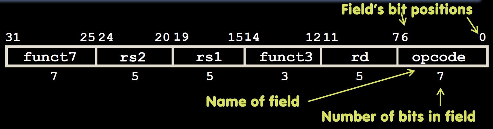
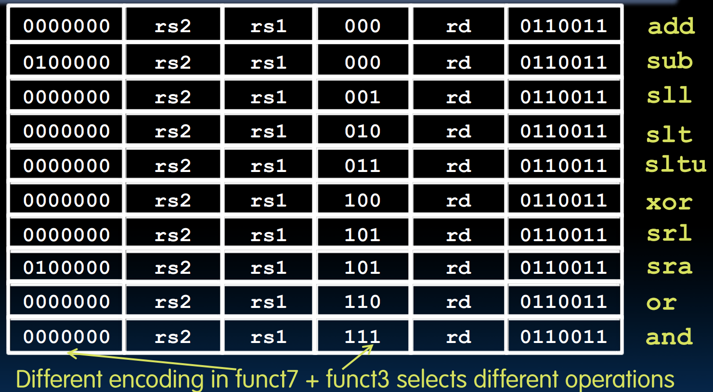
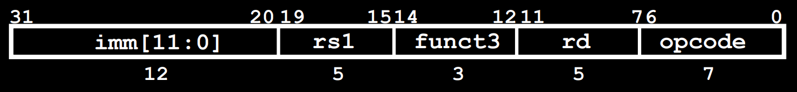
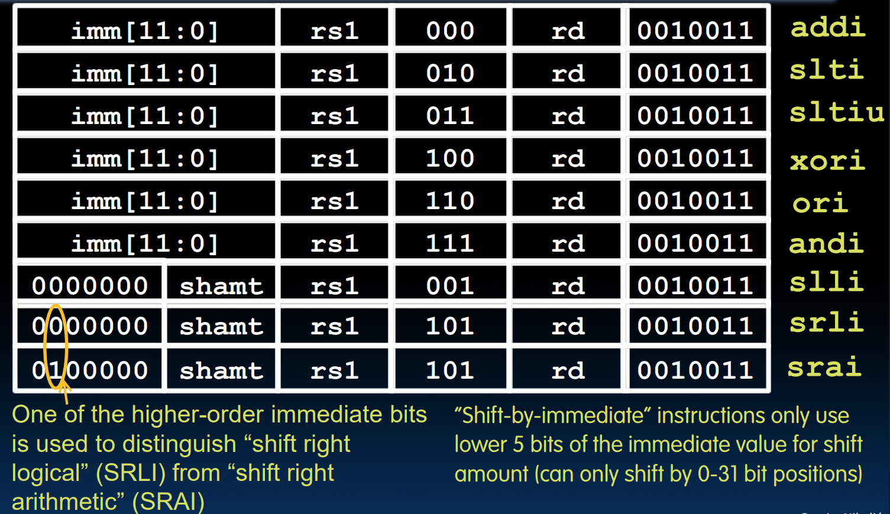
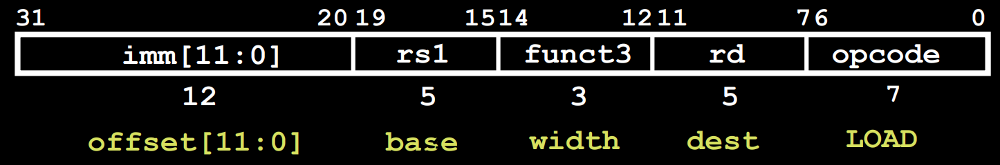
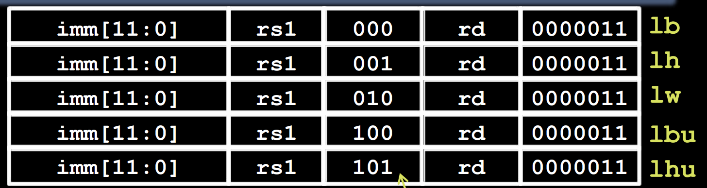
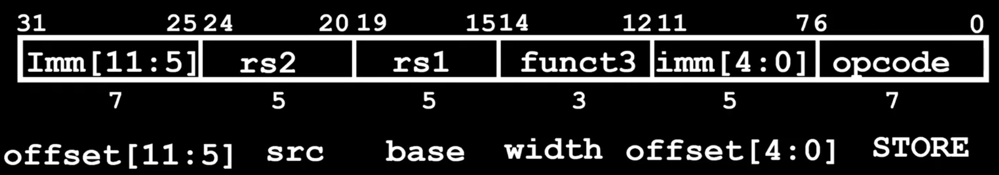
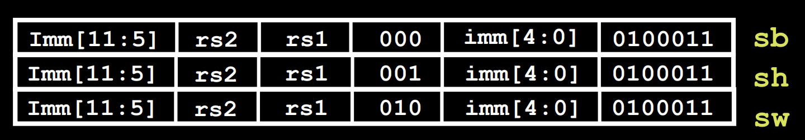

# RISC-V 机器语言

## 冯诺依曼架构

**冯诺依曼架构**：程序的指令和数据一起存储在内存中，可以被读取、写入．这使得计算机可以快速重新编程而不需要进行硬件接线．

+ 由于均存储在内存中，因此所有东西（指令与数据）都是可寻址的；专门有一个寄存器指向程序执行的指令（Program Counter）．
+ 程序以二进制形式发布，使得其有二进制兼容性：旧程序（二进制文件）可以直接在支持该指令集的新机器上运行．

## 指令编码格式

RISC-V的所有指令都和数据一样被设计为固定的32位．为了实现不同功能，将这32位划分成了不同的**字段**，并定义了六种基本格式：R、I、S、B、U、J．

由于共有32个寄存器，因此表示寄存器至少需要5bit宽．

### R格式

R格式用于算数与逻辑操作的指令．

**字段划分**：`funct7` (7位)、`rs2` (5位)、`rs1` (5位)、`funct3` (3位)、`rd` (5位)、`opcode` (7位)．

+ `rs1`、`rs2`、`rd` 均为5位，分别表示三个操作寄存器．
+ `opcode` 代表当前指令是什么格式；对于R格式而言，均为0110011．
+ `funct7` 与 `funct3` 和 `opcode` 共同决定了要执行的操作．操作对应关系如下图所示：

> 比之前多了两种操作：`slt` 表示set less than，指令为 `slt rd, rs1, rs2`，表示如果 `rs1 < rs2` 就将 `rd` 设为1．`sltu` 为无符号比较版本． 

### I格式

I格式用于与立即数Immediate有关的指令．

+ 由于 `addi` 指令中 `rs2` 没有被用到，我们将其与 `funct7` 合并为12位用来表示立即数．其覆盖范围为 $[-2048, 2047]$​​​（由于其要与 `rs1` 中32位的数进行操作，操作前需要符号扩展到32位）．
+ I格式的 `opcode` 为0010011．

由于一个寄存器只有32位，移动超过31位的值没有意义，因此移位操作的字段划分仍然类似R指令，其中 `rs2` 为移位数，第30位用于区分逻辑/算数右移．

与R指令比较，同样的指令对应的 `funct3` 代码其实也是相同的．

由于load word指令的格式与立即数计算几乎一样（`rs1` 表示 `base`、`rd` 表示 `dest`、立即数表示偏移量），因此load指令也是一种特殊的I格式，其 `opcode` 为000011．

> `lh` 为load halfword，即一次读取半字/16字节．
>
> `lb` 和 `lh` 都是符号位拓展，将终点寄存器的其他位用二进制数的最高位填充；`lbu` 和 `lhu` 对应无符号形式，其他位均为0填充．

### S格式

S格式用于存储指令．虽然它的操作数也是两个寄存器，但其中一个寄存器是存储源，另一寄存器用于寻址，这两个都不属于 `rd` 类寄存器，因此其与读取指令不同．`rs1` 表示 `base`，`rs2` 表示 `src`；而用于表示偏移量的立即数被截成两段（`funct7` 的7位与原 `rd` 的5位），仍然看作整体12位表示立即数．

S格式的 `opcode` 为0100011．

