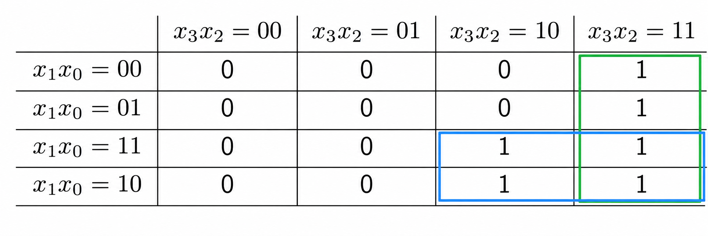

# Bit Manipulation

判断无符号数十六进制是否为字母：画**卡诺图**（Karnaugh Map）

1 个十六进制数为 4 个二进制数，画四字母版：



绿圈：$x_3x_2=1$；蓝圈：$x_3x_1=1$；故为 $x_3(x_1+x_2)$，即等价于 $x_3\land (x_1\lor x_2)$．

对 `unsigned` 的每四位进行该操作，得到单个十六进制是否为字母．

```C
unsigned hexLetters(unsigned x)
{
    unsigned x1 = x & 0x22222222; // 0b0010 = 0x2
    unsigned x2 = x & 0x44444444; // 0b0100 = 0x4 
    unsigned x3 = x & 0x88888888; // 0b1000 = 0x8
    
    x = (x3 >> 3) & (x1 >> 1 | x2 >> 2);
    return x;
}
```

