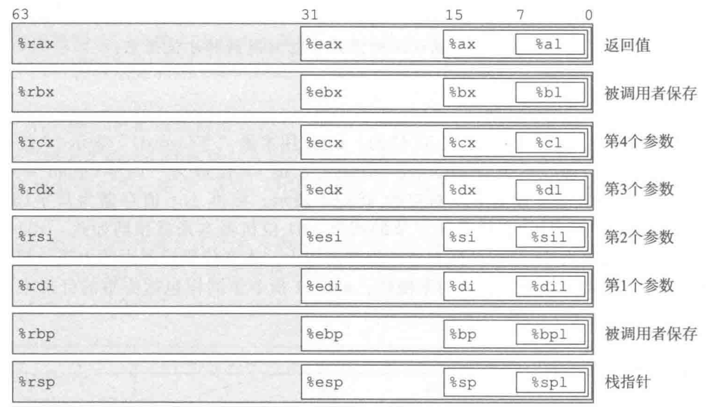
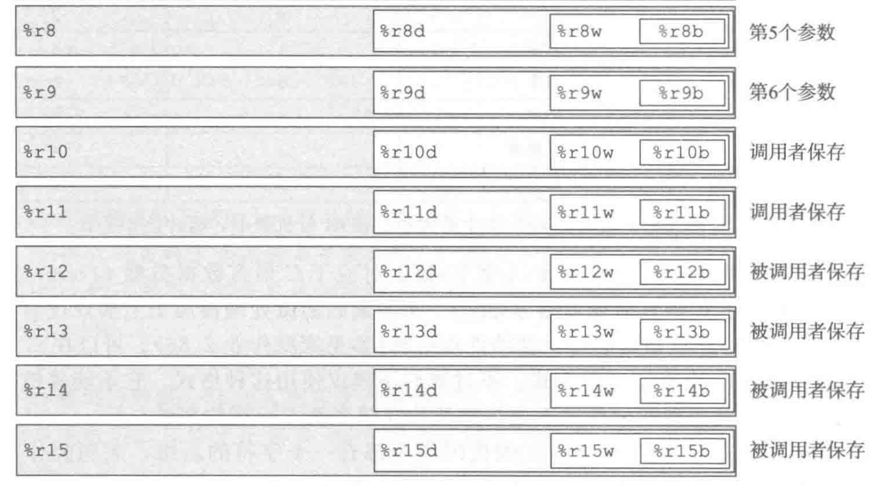
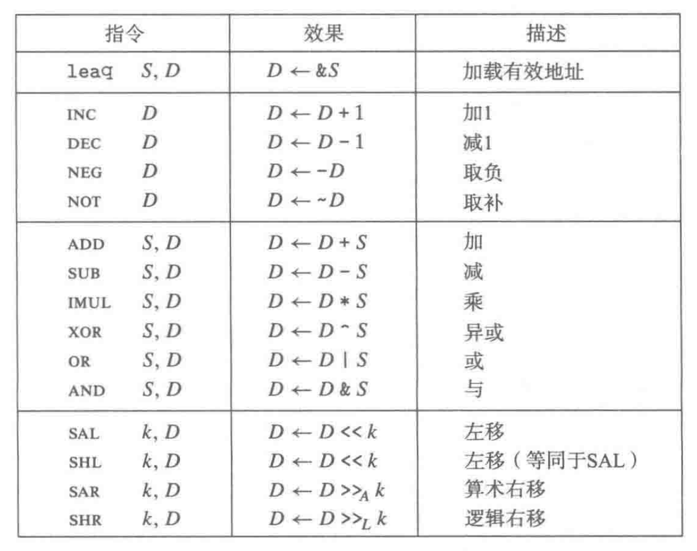
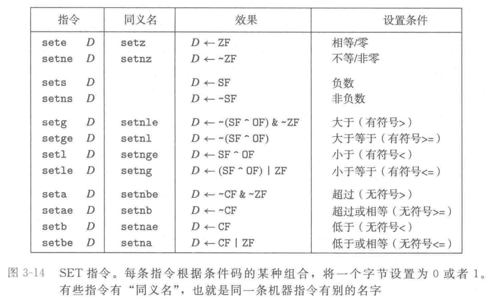
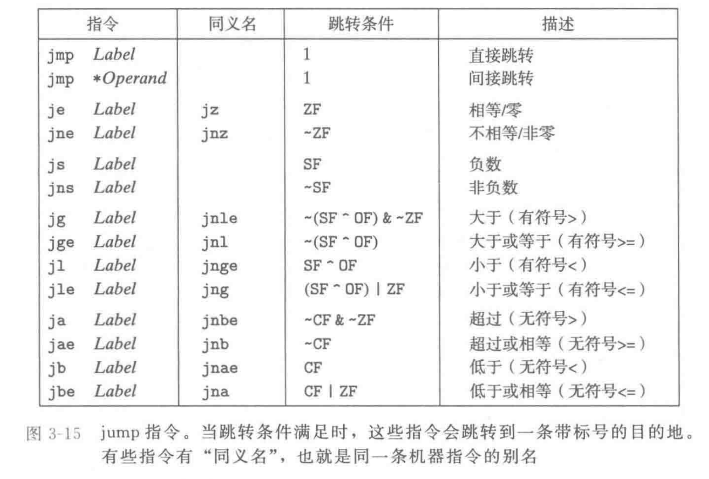

**寄存器**：





立即数前要加$．

寻址模式为 $Imm(r_b, r_i,s)$ 表示 $Imm+R[r_b]+R[r_i]\cdot s$，其中 $R[]$ 表示寄存器里的数．

**更多指令**：



movq指令在遇到寻址模式时会访问内存对应地址；而leaq在遇到寻址模式时也不会访问内存，而是直接将计算得到的结果当作一个数．因此leaq也可以当作乘法、加法操作．

移位操作的移位量为立即数，或者放在 %cl 中；对于 w 位长的数据，其移位量为 %cl 里的数对 w 取模．

**set指令**：



**跳转指令**：



其实这类指令对应的后缀（e, ne, s, ns, g, ge等）就是我们期望参数的大小关系，只不过我们要按照参数顺序在这之前先做一个cmp/test，然后调用这些访问条件码的指令．

```assembly
Breakpoint 2, 0x00005555555552db in phase_1 ()
(gdb) disas phase_1
Dump of assembler code for function phase_1:
=> 0x00005555555552db <+0>:     sub    $0x8,%rsp
   0x00005555555552df <+4>:     lea    0x17ea(%rip),%rsi        # 0x555555556ad0
   0x00005555555552e6 <+11>:    callq  0x5555555557b4 <strings_not_equal>
   0x00005555555552eb <+16>:    test   %eax,%eax
   0x00005555555552ed <+18>:    je     0x5555555552f4 <phase_1+25>
   0x00005555555552ef <+20>:    callq  0x555555555ab3 <explode_bomb>
   0x00005555555552f4 <+25>:    add    $0x8,%rsp
   0x00005555555552f8 <+29>:    retq
End of assembler dump.
(gdb) info register rsi
rsi            0x5555557586c0   93824994346688
(gdb) ni
0x00005555555552df in phase_1 ()
(gdb) info register rsi
rsi            0x5555557586c0   93824994346688
(gdb) ni
0x00005555555552e6 in phase_1 ()
(gdb) info register rsi
rsi            0x555555556ad0   93824992242384
(gdb) disas string_not_equal
No symbol "string_not_equal" in current context.
(gdb) x/s $rsi
0x555555556ad0: "A binary bomb is a program provided to students as an object-code file."
```

```assembly
Breakpoint 3, 0x00005555555552f9 in phase_2 ()
(gdb) disas phase_2
Dump of assembler code for function phase_2:
=> 0x00005555555552f9 <+0>:     push   %rbp
   0x00005555555552fa <+1>:     push   %rbx # 压栈
   0x00005555555552fb <+2>:     sub    $0x28,%rsp # 栈指针下移40字节
   0x00005555555552ff <+6>:     mov    %fs:0x28,%rax  
   0x0000555555555308 <+15>:    mov    %rax,0x18(%rsp) 
   0x000055555555530d <+20>:    xor    %eax,%eax # %eax 清零
   0x000055555555530f <+22>:    mov    %rsp,%rsi # 将 %rsp 存到 %rsi（第二个参数）
   0x0000555555555312 <+25>:    callq  0x555555555aef <read_six_numbers>
   0x0000555555555317 <+30>:    cmpl   $0x0,(%rsp)
   0x000055555555531b <+34>:    jne    0x555555555324 <phase_2+43> # 栈指针指向的a[0]不为0就爆炸
   0x000055555555531d <+36>:    cmpl   $0x1,0x4(%rsp) # 栈指针指向的a[1]不为1就爆炸
   0x0000555555555322 <+41>:    je     0x555555555329 <phase_2+48>
   0x0000555555555324 <+43>:    callq  0x555555555ab3 <explode_bomb>
   0x0000555555555329 <+48>:    mov    %rsp,%rbx # 将栈指针移动到 %rbx
   0x000055555555532c <+51>:    lea    0x10(%rsp),%rbp # %rbp = %rsp + 16，%rbp 指向a[4]
   0x0000555555555331 <+56>:    mov    0x4(%rbx),%eax # %eax 赋值为 %rbx 指向的a[1]
   0x0000555555555334 <+59>:    add    (%rbx),%eax # %eax 加上a[0] (1 + 0 = 1)
   0x0000555555555336 <+61>:    cmp    %eax,0x8(%rbx) # a[2] 不为1就爆炸
   0x0000555555555339 <+64>:    je     0x555555555340 <phase_2+71>
   0x000055555555533b <+66>:    callq  0x555555555ab3 <explode_bomb>
   0x0000555555555340 <+71>:    add    $0x4,%rbx # %rbx 加4字节，指向a[1]
   0x0000555555555344 <+75>:    cmp    %rbp,%rbx 
   # %rbx 指向第一个数a[1]， %rbp 指向a[4]
   0x0000555555555347 <+78>:    jne    0x555555555331 <phase_2+56> # 如果 a[1] != a[4]，就回到56
   # <+56>: 此时 %eax = 1, %rbx 指向 a[1] = 1，将a[2] = 1 赋值给 %eax，不变
   # <+59>: %eax 加上 a[1] = 1, 得到 %eax = 2
   # <+61> <+64>: 比较 a[3] 的值，a[3] 不等于 2 就爆炸
   # <+71>: %rbx 指向 a[2]，由于 a[2] != a[4]，继续重复
   
   # 假设 %rbx 指向 a[i]
   # <+56>: %eax = a[i + 1]
   # <+59>: %eax += a[i]
   # <+61> <+64>: 比较 a[i + 2] = a[i + 1] + a[i]
   # <+71>: 比较 i 是否为 4
   
   # 当 %rbx 指向 a[4] 时，a[6] 已经赋值完毕
   0x0000555555555349 <+80>:    mov    0x18(%rsp),%rax 
   0x000055555555534e <+85>:    xor    %fs:0x28,%rax # %rax 如果等于 %fs:0x28 就跳转
   0x0000555555555357 <+94>:    je     0x55555555535e <phase_2+101>
   0x0000555555555359 <+96>:    callq  0x555555554f00 <__stack_chk_fail@plt>
   0x000055555555535e <+101>:   add    $0x28,%rsp
   0x0000555555555362 <+105>:   pop    %rbx
   0x0000555555555363 <+106>:   pop    %rbp
   0x0000555555555364 <+107>:   retq
End of assembler dump.

数字：0 1 1 2 3 5
```

```assembly
(gdb) disas phase_3
Dump of assembler code for function phase_3:
=> 0x0000555555555365 <+0>:     sub    $0x18,%rsp
   0x0000555555555369 <+4>:     mov    %fs:0x28,%rax
   0x0000555555555372 <+13>:    mov    %rax,0x8(%rsp)
   0x0000555555555377 <+18>:    xor    %eax,%eax # %eax 清零
   0x0000555555555379 <+20>:    lea    0x4(%rsp),%rcx # %rcx = %rsp + 4
   0x000055555555537e <+25>:    mov    %rsp,%rdx # %rdx = %rsp
   0x0000555555555381 <+28>:    lea    0x1a65(%rip),%rsi        # 0x555555556ded
   0x0000555555555388 <+35>:    callq  0x555555554fa0 <__isoc99_sscanf@plt>
   # sscanf(input, format, ...) 返回读入的个数
   # 将 %rdi 作为输入字符串，%rsi 作为格式，读到 %rsp[0] 与 %rsp[1] 中
   0x000055555555538d <+40>:    cmp    $0x1,%eax # %eax 返回值表示读入个数
   0x0000555555555390 <+43>:    jg     0x555555555397 <phase_3+50> # %eax > 1，否则爆炸
   0x0000555555555392 <+45>:    callq  0x555555555ab3 <explode_bomb>
   0x0000555555555397 <+50>:    cmpl   $0x7,(%rsp) 
   0x000055555555539b <+54>:    ja     0x5555555553e1 <phase_3+124> # %rsp[0] > 7 就爆炸
   0x000055555555539d <+56>:    mov    (%rsp),%edx # %edx = %rsp[0]，最高位清零，即 %rdx = %rsp[0]
   0x00005555555553a0 <+59>:    lea    0x1799(%rip),%rax # %rax = 0x555555556b40
   0x00005555555553a7 <+66>:    movslq (%rax,%rdx,4),%rdx # 0x555555556b40 + 4 * %rdx 移动到 %rdx
   # 如果 %rax 是一个数组a，那么 %rdx = a[%rsp[0]]
   # a[0] = -5971, a[1] = -6032, a[2] = -6025, a[3] = -6018, a[4] = -6011
   # a[5] = -6004, a[6] = -5997, a[7] = -5990
   
   (gdb) x/x $rax
0x555555556b40: 0xffffe8ad
(gdb) x/x $rax + 4
0x555555556b44: 0xffffe870
(gdb) x/x $rax + 8
0x555555556b48: 0xffffe877
(gdb) x/x $rax + 12
0x555555556b4c: 0xffffe87e
(gdb) x/x $rax + 16
0x555555556b50: 0xffffe885
(gdb) x/x $rax + 20
0x555555556b54: 0xffffe88c
(gdb) x/x $rax + 24
0x555555556b58: 0xffffe893
(gdb) x/x $rax + 28
0x555555556b5c: 0xffffe89a
   
   0x00005555555553ab <+70>:    add    %rdx,%rax # %rax += %rdx
   # 跳转：a[0] 到 136
   0x00005555555553ae <+73>:    jmpq   *%rax # 跳转到 %rax 的指令
   0x00005555555553b0 <+75>:    mov    $0x44,%eax
   0x00005555555553b5 <+80>:    jmp    0x5555555553f2 <phase_3+141>
   0x00005555555553b7 <+82>:    mov    $0x29c,%eax
   0x00005555555553bc <+87>:    jmp    0x5555555553f2 <phase_3+141>
   0x00005555555553be <+89>:    mov    $0x3cb,%eax
   0x00005555555553c3 <+94>:    jmp    0x5555555553f2 <phase_3+141>
   0x00005555555553c5 <+96>:    mov    $0x3be,%eax
   0x00005555555553ca <+101>:   jmp    0x5555555553f2 <phase_3+141>
   0x00005555555553cc <+103>:   mov    $0x7c,%eax
   0x00005555555553d1 <+108>:   jmp    0x5555555553f2 <phase_3+141>
   0x00005555555553d3 <+110>:   mov    $0x9c,%eax
   0x00005555555553d8 <+115>:   jmp    0x5555555553f2 <phase_3+141>
   0x00005555555553da <+117>:   mov    $0xe7,%eax
   0x00005555555553df <+122>:   jmp    0x5555555553f2 <phase_3+141>
   0x00005555555553e1 <+124>:   callq  0x555555555ab3 <explode_bomb>
   0x00005555555553e6 <+129>:   mov    $0x0,%eax
   0x00005555555553eb <+134>:   jmp    0x5555555553f2 <phase_3+141>
   0x00005555555553ed <+136>:   mov    $0x100,%eax
   0x00005555555553f2 <+141>:   cmp    0x4(%rsp),%eax # 比较 %eax = %rsp[1]
   0x00005555555553f6 <+145>:   je     0x5555555553fd <phase_3+152>
   0x00005555555553f8 <+147>:   callq  0x555555555ab3 <explode_bomb>
   0x00005555555553fd <+152>:   mov    0x8(%rsp),%rax 
   0x0000555555555402 <+157>:   xor    %fs:0x28,%rax 
   0x000055555555540b <+166>:   je     0x555555555412 <phase_3+173>
   0x000055555555540d <+168>:   callq  0x555555554f00 <__stack_chk_fail@plt>
   0x0000555555555412 <+173>:   add    $0x18,%rsp
   0x0000555555555416 <+177>:   retq
End of assembler dump.
输入：0 0x100
```

```assembly
(gdb) disas phase_4
Dump of assembler code for function phase_4:
=> 0x000055555555544a <+0>:     sub    $0x18,%rsp
   0x000055555555544e <+4>:     mov    %fs:0x28,%rax
   0x0000555555555457 <+13>:    mov    %rax,0x8(%rsp)
   0x000055555555545c <+18>:    xor    %eax,%eax
   0x000055555555545e <+20>:    lea    0x4(%rsp),%rcx # %rcx = %rsp + 4
   0x0000555555555463 <+25>:    mov    %rsp,%rdx # %rdx = %rsp
   0x0000555555555466 <+28>:    lea    0x1980(%rip),%rsi        # 0x555555556ded
   0x000055555555546d <+35>:    callq  0x555555554fa0 <__isoc99_sscanf@plt>
   0x0000555555555472 <+40>:    cmp    $0x2,%eax # 读到 2 个参数 x 和 y
   0x0000555555555475 <+43>:    jne    0x55555555547d <phase_4+51>
   0x0000555555555477 <+45>:    cmpl   $0xe,(%rsp) # %rsp[0] <= 14
   0x000055555555547b <+49>:    jbe    0x555555555482 <phase_4+56>
   0x000055555555547d <+51>:    callq  0x555555555ab3 <explode_bomb>
   0x0000555555555482 <+56>:    mov    $0xe,%edx # %rdx = 14 传入第3个参数
   0x0000555555555487 <+61>:    mov    $0x0,%esi # %rsi = 0 传入第2个参数
   0x000055555555548c <+66>:    mov    (%rsp),%edi # %rdi = x 传入第1个参数
   # 此时 %rcx = y 传入第4个参数
   0x000055555555548f <+69>:    callq  0x555555555417 <func4>
   0x0000555555555494 <+74>:    cmp    $0x1b,%eax # 返回值不等于 27 就爆炸
   0x0000555555555497 <+77>:    jne    0x5555555554a0 <phase_4+86>
   0x0000555555555499 <+79>:    cmpl   $0x1b,0x4(%rsp) # y = 27 否则爆炸
   0x000055555555549e <+84>:    je     0x5555555554a5 <phase_4+91>
   0x00005555555554a0 <+86>:    callq  0x555555555ab3 <explode_bomb>
   0x00005555555554a5 <+91>:    mov    0x8(%rsp),%rax 
   0x00005555555554aa <+96>:    xor    %fs:0x28,%rax
   0x00005555555554b3 <+105>:   je     0x5555555554ba <phase_4+112>
   0x00005555555554b5 <+107>:   callq  0x555555554f00 <__stack_chk_fail@plt>
   0x00005555555554ba <+112>:   add    $0x18,%rsp
   0x00005555555554be <+116>:   retq
End of assembler dump.

(gdb) disas func4
Dump of assembler code for function func4(rdi = x, rsi = 0, rdx = 14):
   0x0000555555555417 <+0>:     push   %rbx
   0x0000555555555418 <+1>:     mov    %edx,%eax # %eax = 14
   0x000055555555541a <+3>:     sub    %esi,%eax # %eax -= %esi = 14
   0x000055555555541c <+5>:     mov    %eax,%ebx # %ebx = %eax = 14
   0x000055555555541e <+7>:     shr    $0x1f,%ebx # %ebx 逻辑右移 31 位 = 0
   0x0000555555555421 <+10>:    add    %ebx,%eax # %eax = 14
 
   0x0000555555555423 <+12>:    sar    %eax # %eax 算术右移 1 位 = 7
   0x0000555555555425 <+14>:    lea    (%rax,%rsi,1),%ebx # %ebx = %eax = 7
   0x0000555555555428 <+17>:    cmp    %edi,%ebx 
   0x000055555555542a <+19>:    jle    0x555555555438 <func4+33> # 如果 # %ebx <= x 跳转到33
   0x000055555555542c <+21>:    lea    -0x1(%rbx),%edx
   0x000055555555542f <+24>:    callq  0x555555555417 <func4> # 递归 func4(x, 0, 7)
   
   # func4(x, 0, %edx = 14)
   # %eax = %edx
   # %eax /= 2
   # if (%eax > x)
   #	 func4(x, 0, %eax - 1)
   
   # x = 2:
   # func4(x, 0, 14)
   # func4(x, 0, 6)
   # func4(x, 0, 2)
   
   0x0000555555555434 <+29>:    add    %ebx,%eax 
   0x0000555555555436 <+31>:    jmp    0x555555555448 <func4+49>
   0x0000555555555438 <+33>:    mov    %ebx,%eax # %eax = %ebx
   0x000055555555543a <+35>:    cmp    %edi,%ebx # %ebx >= x 结束
   0x000055555555543c <+37>:    jge    0x555555555448 <func4+49> 
   0x000055555555543e <+39>:    lea    0x1(%rbx),%esi # 如果 $edi >= %ebx
   0x0000555555555441 <+42>:    callq  0x555555555417 <func4>
   0x0000555555555446 <+47>:    add    %ebx,%eax
   0x0000555555555448 <+49>:    pop    %rbx
   0x0000555555555449 <+50>:    retq
End of assembler dump.
```

```assembly
(gdb) disas phase_5
Dump of assembler code for function phase_5:
=> 0x00005555555554bf <+0>:     sub    $0x18,%rsp
   0x00005555555554c3 <+4>:     mov    %fs:0x28,%rax
   0x00005555555554cc <+13>:    mov    %rax,0x8(%rsp)
   0x00005555555554d1 <+18>:    xor    %eax,%eax # %eax 清零
   0x00005555555554d3 <+20>:    lea    0x4(%rsp),%rcx
   0x00005555555554d8 <+25>:    mov    %rsp,%rdx
   0x00005555555554db <+28>:    lea    0x190b(%rip),%rsi        # 0x555555556ded
   0x00005555555554e2 <+35>:    callq  0x555555554fa0 <__isoc99_sscanf@plt>
   0x00005555555554e7 <+40>:    cmp    $0x1,%eax # 读到至少 2 个参数 x 和 y，否则爆炸
   0x00005555555554ea <+43>:    jg     0x5555555554f1 <phase_5+50>
   0x00005555555554ec <+45>:    callq  0x555555555ab3 <explode_bomb>
   0x00005555555554f1 <+50>:    mov    (%rsp),%eax
   0x00005555555554f4 <+53>:    and    $0xf,%eax # %eax = x & 0xf 取 x 的低4位
   0x00005555555554f7 <+56>:    mov    %eax,(%rsp) # x = x & 0b1111
   0x00005555555554fa <+59>:    cmp    $0xf,%eax 
   0x00005555555554fd <+62>:    je     0x555555555531 <phase_5+114> # 如果 x 的低4位均为1，爆炸
   0x00005555555554ff <+64>:    mov    $0x0,%ecx # %ecx 清零
   0x0000555555555504 <+69>:    mov    $0x0,%edx 
   0x0000555555555509 <+74>:    add    $0x1,%edx 
   0x000055555555550c <+77>:    cltq   # %eax 符号扩展，此时 %eax 是 x 的低4位
   0x000055555555550e <+79>:    lea    0x164b(%rip),%rsi        # 0x555555556b60 <array.3461> 数组 a
   
   # 数组 a
   0x555555556b60 <array.3461>:    10      2       14      7
   0x555555556b70 <array.3461+16>: 8       12      15      11
   0x555555556b80 <array.3461+32>: 0       4       1       13
   0x555555556b90 <array.3461+48>: 3       9       6       5
   
   # 倒序：15 6 14 2 1 10 0 8 4 9 13 11 7 3 12 5 15
   # x = 5, y = 12 + 3 + 7 + ... + 15 = 115
   
   0x0000555555555515 <+86>:    mov    (%rsi,%rax,4),%eax # %eax = a[%rax]
   0x0000555555555518 <+89>:    add    %eax,%ecx # %ecx += %eax
   0x000055555555551a <+91>:    cmp    $0xf,%eax 
   0x000055555555551d <+94>:    jne    0x555555555509 <phase_5+74> # 如果 %eax != 0b1111 重复该过程
   
   # 此处：取 x 低4位，如果为1111直接爆炸；否则sum += x，cnt += 1，取x = a[x]，直到 x 低4位为1111
   0x000055555555551f <+96>:    movl   $0xf,(%rsp) # x = 1111
   0x0000555555555526 <+103>:   cmp    $0xf,%edx # 如果 cnt != 1111，爆炸
   0x0000555555555529 <+106>:   jne    0x555555555531 <phase_5+114>
   0x000055555555552b <+108>:   cmp    0x4(%rsp),%ecx # 如果 sum == y，成功 
   0x000055555555552f <+112>:   je     0x555555555536 <phase_5+119>
   0x0000555555555531 <+114>:   callq  0x555555555ab3 <explode_bomb>
   0x0000555555555536 <+119>:   mov    0x8(%rsp),%rax
   0x000055555555553b <+124>:   xor    %fs:0x28,%rax
   0x0000555555555544 <+133>:   je     0x55555555554b <phase_5+140>
   0x0000555555555546 <+135>:   callq  0x555555554f00 <__stack_chk_fail@plt>
```

```assembly
(gdb) disas phase_6
Dump of assembler code for function phase_6:
   0x0000555555555550 <+0>:     push   %r14
   0x0000555555555552 <+2>:     push   %r13
   0x0000555555555554 <+4>:     push   %r12
   0x0000555555555556 <+6>:     push   %rbp
   0x0000555555555557 <+7>:     push   %rbx
   0x0000555555555558 <+8>:     sub    $0x60,%rsp
   0x000055555555555c <+12>:    mov    %fs:0x28,%rax
   0x0000555555555565 <+21>:    mov    %rax,0x58(%rsp)
   0x000055555555556a <+26>:    xor    %eax,%eax # %eax 清零
   0x000055555555556c <+28>:    mov    %rsp,%r13 
   0x000055555555556f <+31>:    mov    %rsp,%rsi # %rsi = %r13 = 栈指针
   0x0000555555555572 <+34>:    callq  0x555555555aef <read_six_numbers>
   0x0000555555555577 <+39>:    mov    %rsp,%r12 # %r12 = 数组起始地址/栈指针
   0x000055555555557a <+42>:    mov    $0x0,%r14d # %r14 清零 表示计数
   
   假设此时 %r13 指向 a[i], r14 存cnt
   0x0000555555555580 <+48>:    mov    %r13,%rbp # (%rbp) = a[i] 
   0x0000555555555583 <+51>:    mov    0x0(%r13),%eax # %eax = a[i]
   0x0000555555555587 <+55>:    sub    $0x1,%eax # %eax = a[i] - 1
   0x000055555555558a <+58>:    cmp    $0x5,%eax 
   0x000055555555558d <+61>:    jbe    0x555555555594 <phase_6+68> # %eax 在0到5之间，则 1 <= a[i] <= 6
   0x000055555555558f <+63>:    callq  0x555555555ab3 <explode_bomb>
   0x0000555555555594 <+68>:    add    $0x1,%r14d # %r14 += 1 cnt 从 i 变为 i + 1
   0x0000555555555598 <+72>:    cmp    $0x6,%r14d 
   0x000055555555559c <+76>:    je     0x5555555555bf <phase_6+111> # 如果 i + 1 = 6，跳转 111
   0x000055555555559e <+78>:    mov    %r14d,%ebx # %ebx = cnt = i + 1
   0x00005555555555a1 <+81>:    movslq %ebx,%rax # %rax = %ebx = i + 1
   0x00005555555555a4 <+84>:    mov    (%rsp,%rax,4),%eax # %eax = a[i + 1]
   0x00005555555555a7 <+87>:    cmp    %eax,0x0(%rbp) 
   0x00005555555555aa <+90>:    jne    0x5555555555b1 <phase_6+97> # 如果 a[i + 1] = a[i]，爆炸
   0x00005555555555ac <+92>:    callq  0x555555555ab3 <explode_bomb>
   0x00005555555555b1 <+97>:    add    $0x1,%ebx # %ebx = i + 2
   0x00005555555555b4 <+100>:   cmp    $0x5,%ebx 
   0x00005555555555b7 <+103>:   jle    0x5555555555a1 <phase_6+81> # 如果 i + 2 <= 5, 跳转到 81
   0x00005555555555b9 <+105>:   add    $0x4,%r13 # (%r13) = a[i + 1]
   0x00005555555555bd <+109>:   jmp    0x555555555580 <phase_6+48> 回到 48 
   
   # 得到：1 <= a[i] <= 6，且两两不相等
   
   0x00005555555555bf <+111>:   lea    0x18(%rsp),%rcx # %rcx = %rsp + 24
   0x00005555555555c4 <+116>:   mov    $0x7,%edx # %edx = 7
   0x00005555555555c9 <+121>:   mov    %edx,%eax 
   0x00005555555555cb <+123>:   sub    (%r12),%eax # %eax = %edx - a[0]
   0x00005555555555cf <+127>:   mov    %eax,(%r12) # a[0] = %edx - a[0]
   0x00005555555555d3 <+131>:   add    $0x4,%r12 # %r12 -> a[1]
   0x00005555555555d7 <+135>:   cmp    %r12,%rcx 
   0x00005555555555da <+138>:   jne    0x5555555555c9 <phase_6+121>
   
   # 修改元素使得 a[i] = 7 - a[i]
   
   0x00005555555555dc <+140>:   mov    $0x0,%esi # %rsi = 0
   0x00005555555555e1 <+145>:   jmp    0x5555555555fd <phase_6+173>
   0x00005555555555e3 <+147>:   mov    0x8(%rdx),%rdx # rdx = rdx[2] rdx[2] 也是地址
   0x00005555555555e7 <+151>:   add    $0x1,%eax # eax += 1
   0x00005555555555ea <+154>:   cmp    %ecx,%eax # 如果 %eax != %ecx，就重复该过程
   0x00005555555555ec <+156>:   jne    0x5555555555e3 <phase_6+147>
   0x00005555555555ee <+158>:   mov    %rdx,0x20(%rsp,%rsi,2) # %rsp + 2 * %rsi + 32 = %rdx
   0x00005555555555f3 <+163>:   add    $0x4,%rsi # %rsi += 4
   0x00005555555555f7 <+167>:   cmp    $0x18,%rsi # 如果 %rsi = 24，就到 195
   0x00005555555555fb <+171>:   je     0x555555555613 <phase_6+195>
   0x00005555555555fd <+173>:   mov    (%rsp,%rsi,1),%ecx # %ecx = a[rsi / 4]
   0x0000555555555600 <+176>:   mov    $0x1,%eax # %eax = 1
   0x0000555555555605 <+181>:   lea    0x202c24(%rip),%rdx        # 0x555555758230 <node1>
   0x000055555555560c <+188>:   cmp    $0x1,%ecx 
   0x000055555555560f <+191>:   jg     0x5555555555e3 <phase_6+147> # %ecx > 1，回到 147
   0x0000555555555611 <+193>:   jmp    0x5555555555ee <phase_6+158> # %ecx <= 1，回到 158
   
   初始：%rsi = 0, %ecx = a[0], %eax = 1, %rdx 变为一个地址
   
   如果 %ecx > 1，即 a[0] > 1，则到147，%rdx = %rdx[2]，（链表），%eax = 2，重复直到 %eax = a[0]
   也就是 %rdx 指向链表第 a[0] 个结点
   如果 a[0] = 1，那么也是指向第 1 个即第 a[0] 个结点
   
   %rsi = 0，%rsp + 32 + 0，将 %rsp 偏移32字节开始换为8字节的第 a[0] 个结点的地址
   %rsi = 4，%ecx = a[1]，找到第 a[1] 个结点并将 %rsp 偏移40字节换为第 a[1] 个结点的地址
   ...
   %rsi = 20，%rsp + 20 + 40，将 %rsp 偏移72字节换成第 a[5] 个结点的地址
   
   退出
   
   六个结点，从原链表顺序变为 a[0]、a[1]、...、a[5]
   
   0x0000555555555613 <+195>:   mov    0x20(%rsp),%rbx # %rbx = 第 a[0] 个结点的指针
   0x0000555555555618 <+200>:   lea    0x20(%rsp),%rax # %rax = 结点指针数组的起始位置
   0x000055555555561d <+205>:   lea    0x48(%rsp),%rsi # %rsi = 结点指针数组的结束位置
   0x0000555555555622 <+210>:   mov    %rbx,%rcx  # %rcx = 第 a[0] 个结点的指针
   0x0000555555555625 <+213>:   mov    0x8(%rax),%rdx # %rdx = 第 a[1] 个结点的指针
   0x0000555555555629 <+217>:   mov    %rdx,0x8(%rcx) # 第 a[0] 个结点的next指向第 a[1] 个结点的指针
   0x000055555555562d <+221>:   add    $0x8,%rax # %rax 从 a[0] 变为 a[1]
   0x0000555555555631 <+225>:   mov    %rdx,%rcx # %rcx = 第 a[1] 个结点的指针
   0x0000555555555634 <+228>:   cmp    %rax,%rsi 
   0x0000555555555637 <+231>:   jne    0x555555555625 <phase_6+213>
   
   将 a[0]->next = a[1]，直到 a[4]->next = a[5]，a[5] 的next没变
   此时 %rdx = 第 a[5] 个结点的指针，%rbx = 第 a[0] 个结点的指针
   
   0x0000555555555639 <+233>:   movq   $0x0,0x8(%rdx) # a[5]->next = 0
   0x0000555555555641 <+241>:   mov    $0x5,%ebp # %ebp = 5
   0x0000555555555646 <+246>:   mov    0x8(%rbx),%rax # %rax = a[0]->next = a[1]
   0x000055555555564a <+250>:   mov    (%rax),%eax # %eax = a[0]->next->val = a[1]->val
   0x000055555555564c <+252>:   cmp    %eax,(%rbx) # a[0]->val >= a[1]->val，否则爆炸
   0x000055555555564e <+254>:   jge    0x555555555655 <phase_6+261>
   0x0000555555555650 <+256>:   callq  0x555555555ab3 <explode_bomb>
   0x0000555555555655 <+261>:   mov    0x8(%rbx),%rbx # rbx = 第 a[1] 个节点的指针
   0x0000555555555659 <+265>:   sub    $0x1,%ebp
   0x000055555555565c <+268>:   jne    0x555555555646 <phase_6+246>
   0x000055555555565e <+270>:   mov    0x58(%rsp),%rax
   0x0000555555555663 <+275>:   xor    %fs:0x28,%rax
   0x000055555555566c <+284>:   je     0x555555555673 <phase_6+291>
   0x000055555555566e <+286>:   callq  0x555555554f00 <__stack_chk_fail@plt>
   0x0000555555555673 <+291>:   add    $0x60,%rsp
   0x0000555555555677 <+295>:   pop    %rbx
   0x0000555555555678 <+296>:   pop    %rbp
   0x0000555555555679 <+297>:   pop    %r12
   0x000055555555567b <+299>:   pop    %r13
   0x000055555555567d <+301>:   pop    %r14
   0x000055555555567f <+303>:   retq
End of assembler dump.

给定六个结点的链表，给出数组 a[6] 为这6个结点的排列，使得链表元素单调递增

957 -> 915 -> 748 -> 328 -> 179 -> 450
1 2 3 6 4 5 
6 5 4 1 3 2

(gdb) disas read_six_numbers
Dump of assembler code for function read_six_numbers:
   0x0000555555555aef <+0>:     sub    $0x8,%rsp # 栈压下8字节
   0x0000555555555af3 <+4>:     mov    %rsi,%rdx 
   0x0000555555555af6 <+7>:     lea    0x4(%rsi),%rcx
   0x0000555555555afa <+11>:    lea    0x14(%rsi),%rax
   0x0000555555555afe <+15>:    push   %rax
   0x0000555555555aff <+16>:    lea    0x10(%rsi),%rax
   0x0000555555555b03 <+20>:    push   %rax
   0x0000555555555b04 <+21>:    lea    0xc(%rsi),%r9
   0x0000555555555b08 <+25>:    lea    0x8(%rsi),%r8
   0x0000555555555b0c <+29>:    lea    0x12ce(%rip),%rsi        # 0x555555556de1
   0x0000555555555b13 <+36>:    mov    $0x0,%eax
   0x0000555555555b18 <+41>:    callq  0x555555554fa0 <__isoc99_sscanf@plt>
   0x0000555555555b1d <+46>:    add    $0x10,%rsp
   0x0000555555555b21 <+50>:    cmp    $0x5,%eax
   0x0000555555555b24 <+53>:    jg     0x555555555b2b <read_six_numbers+60>
   0x0000555555555b26 <+55>:    callq  0x555555555ab3 <explode_bomb>
   0x0000555555555b2b <+60>:    add    $0x8,%rsp
   0x0000555555555b2f <+64>:    retq
End of assembler dump.
```

