# 链表
## 题单
| 分类 | 题目 |
| :--- | :--- |
| **链表 - 反转系列** | 🟢 [206. 反转链表](https://leetcode.cn/problems/reverse-linked-list/) |
| | 🟡 [92. 反转链表 II](https://leetcode.cn/problems/reverse-linked-list-ii/) |
| | 🔴 [25. K 个一组翻转链表](https://leetcode.cn/problems/reverse-nodes-in-k-group/) |
| | 🟢 [24. 两两交换链表中的节点](https://leetcode.cn/problems/swap-nodes-in-pairs/) |
| | 🟡 [445. 两数相加 II](https://leetcode.cn/problems/add-two-numbers-ii/) |
| | 🟡 [2816. 翻倍以链表形式表示的数字](https://leetcode.cn/problems/double-a-number-represented-as-a-linked-list/) |
| **链表 - 快慢指针** | 🟢 [876. 链表的中间结点](https://leetcode.cn/problems/middle-of-the-linked-list/) |
| | 🟡 [141. 环形链表](https://leetcode.cn/problems/linked-list-cycle/) |
| | 🔴 [142. 环形链表 II](https://leetcode.cn/problems/linked-list-cycle-ii/) |
| | 🟠 [143. 重排链表](https://leetcode.cn/problems/reorder-list/) |
| | 🟢 [234. 回文链表](https://leetcode.cn/problems/palindrome-linked-list/) |
| **链表 - 删除系列** | 🟢 [237. 删除链表中的节点](https://leetcode.cn/problems/delete-node-in-a-linked-list/) |
| | 🟢 [19. 删除链表的倒数第 N 个结点](https://leetcode.cn/problems/remove-nth-node-from-end-of-list/) |
| | 🟢 [83. 删除排序链表中的重复元素](https://leetcode.cn/problems/remove-duplicates-from-sorted-list/) |
| | 🔴 [82. 删除排序链表中的重复元素 II](https://leetcode.cn/problems/remove-duplicates-from-sorted-list-ii/)|
| | 🟢 [203. 移除链表元素](https://leetcode.cn/problems/remove-linked-list-elements/)|
| | 🟢 [3217. 从链表中移除在数组中存在的节点](https://leetcode.cn/problems/delete-nodes-from-linked-list-present-in-array/)|
| | 🟢 [2487. 从链表中移除节点](https://leetcode.cn/problems/remove-nodes-from-linked-list/)|

## 基础知识
**哨兵结点**：如果需要对链表的头结点进行操作（如删除），需要加入哨兵结点便于执行操作以及最后作为返回值．

## 反转系列
### [206. 反转链表](https://leetcode.cn/problems/reverse-linked-list/)
要反转链表，我们需要将当前结点指向上一个结点，因此要保存这两个结点；将当前结点指向上一个结点后会丢失后续的结点，因此要将后续的结点也存起来，需要三个指针．

!!! note "过程"
    === "初始状态"
        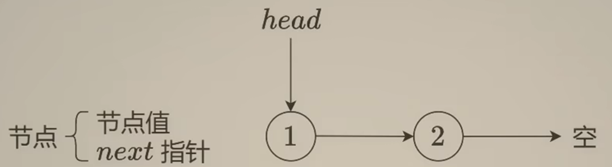

    === "中间状态1"
    	用cur指向需要修改的结点，pre指向上一结点，nxt储存下一结点．
        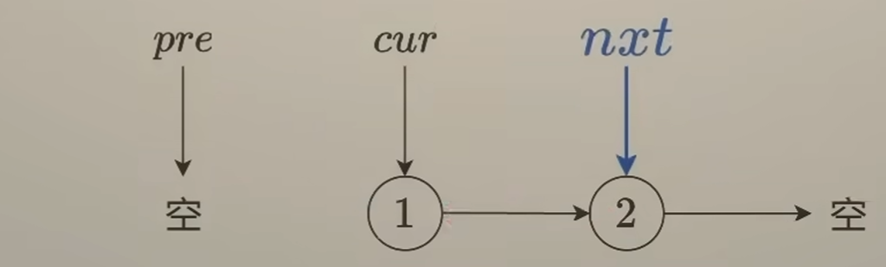
    
    === "中间状态2"
    	将cur指针反转．
        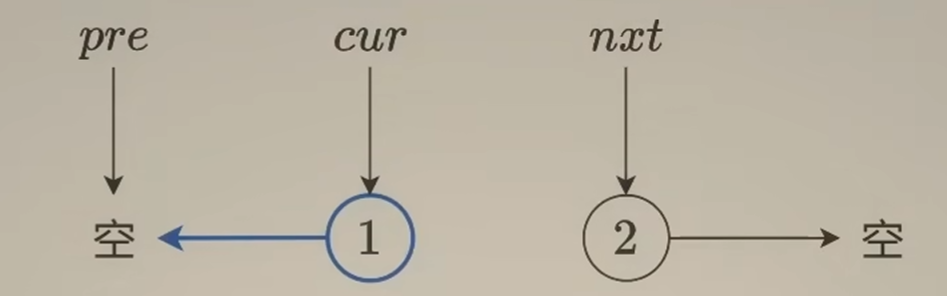
    
    === "中间状态3"
    	将pre指向当前结点cur．
        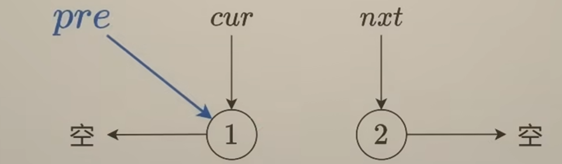
    
    === "中间状态4"
    	将cur指向下一结点nxt．
        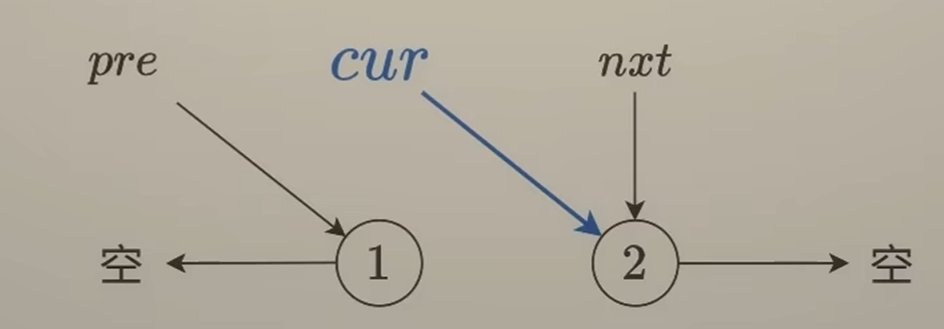
    
    === "迭代"
    	重复直到cur为空．
        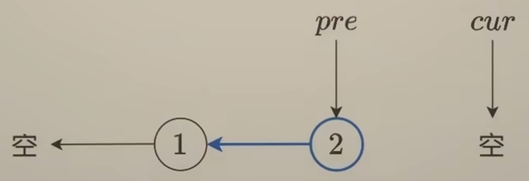
    
    初始时cur指向head，pre作为cur的前驱指向nullptr，这样可以将head的next修改成nullptr；最后cur为空，pre指向新链表的头结点，返回pre．

时间复杂度 $O(n)$，空间复杂度 $O(1)$．
```cpp
ListNode* reverseList(ListNode* head) {
    ListNode* pre = nullptr, * cur = head, * nxt;
    while (cur) 
    {
        nxt = cur->next;
        cur->next = pre;
        pre = cur;
        cur = nxt;
    }
    return pre; 
}
```
### [92. 反转链表 II](https://leetcode.cn/problems/reverse-linked-list-ii/)
!!! note "过程"
	=== "反转目标链表"
		将2~4的链表反转．此时结点2指向nullptr，pre指向结点4，cur指向结点5．
		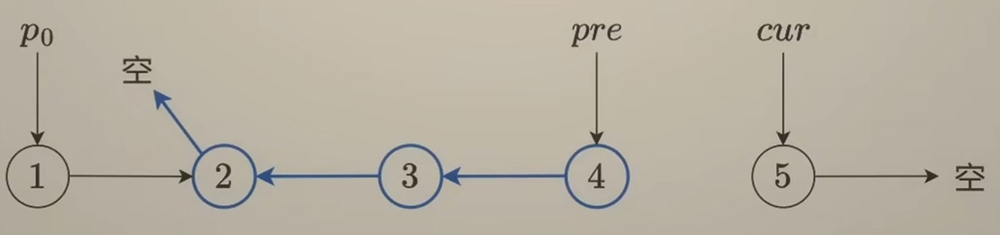

	=== "修改前后结点"
		我们需要把结点2指向剩余的部分，即cur；把反转部分的上一个结点（记作p0）接到反转后的新头结点上，即pre．
		结点2可以用 `p0->next` 表示．
		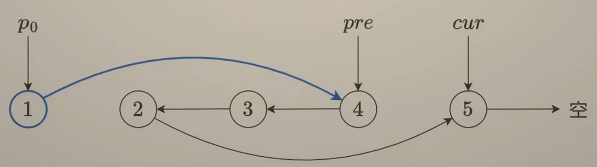
	=== "处理特殊情况"
		如果 `left == 1` 呢，p0应该是谁？我们可以加入一个哨兵结点，这样p0就存在了．
		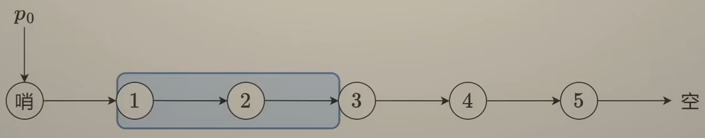
		将p0从dummy开始右移 `left - 1` 步，即可称为目标链表的前一个结点．

时间复杂度 $O(n)$，空间复杂度 $O(1)$．
```cpp
ListNode* reverseBetween(ListNode* head, int left, int right) {
    ListNode* dummy = new ListNode(-1, head), * p0 = dummy;
    for (int i = 1; i < left; i++)
        p0 = p0->next;
    ListNode* pre = p0, * cur = p0->next, * nxt;
    for (int i = 1; i <= right - left + 1; i++)
    {
        nxt = cur->next;
        cur->next = pre;
        pre = cur;
        cur = nxt;
    }
    p0->next->next = cur;
    p0->next = pre;
    return dummy->next;
}
```
### [25. K 个一组翻转链表](https://leetcode.cn/problems/reverse-nodes-in-k-group/)
大题思路与上一题类似，先遍历一遍链表得到长度算出要循环的次数．

对于每次循环：
!!! note "过程"
	=== "反转链表"
		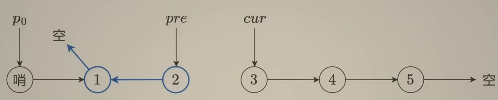
	=== "修改前后结点"
		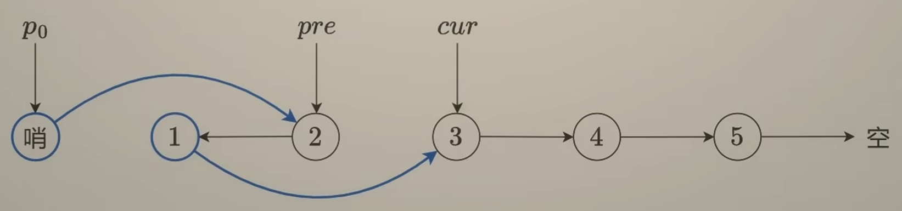
	=== "更新p0"
		p0要成为下一组反转链表的前一个结点，也就是前一组反转链表反转后的尾结点、反转前的头结点，因此在对这一组反转后、修改前后结点前存下 `p0->next`，修改后将p0更新．
		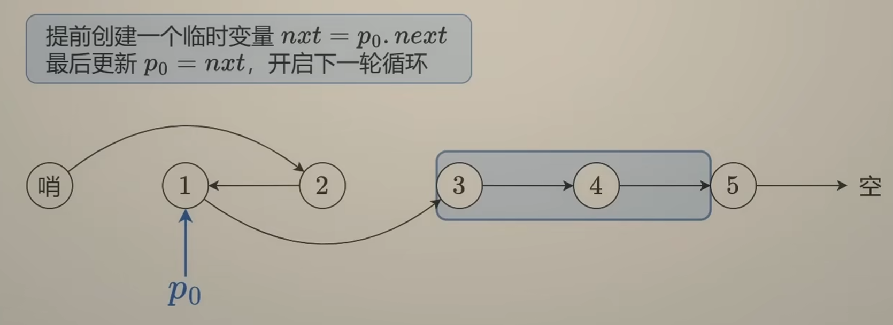

时间复杂度 $O(n)$，空间复杂度 $O(1)$．
```cpp
ListNode* reverseKGroup(ListNode* head, int k) {
    int len = 0;
    for (ListNode* cnt = head; cnt; cnt = cnt->next)
        len++;
    ListNode* dummy = new ListNode(-1, head), * p0 = dummy;
    ListNode* pre = nullptr, * cur = head, * nxt, * dnxt;
    while (len >= k)
    {
        len -= k;
        for (int i = 1; i <= k; i++)
        {
            nxt = cur->next;
            cur->next = pre;
            pre = cur;
            cur = nxt;
        }
        dnxt = p0->next;
        dnxt->next = cur;
        p0->next = pre;
        p0 = dnxt;
    }    
    return dummy->next;
}
```

### [24. 两两交换链表中的节点](https://leetcode.cn/problems/swap-nodes-in-pairs/)

25题在 k = 2 时的特解，由于只有2，完全可以不用链表反转的模板而是直接模拟修改．参考**灵茶山艾府**的图解：

??? note "图解"
	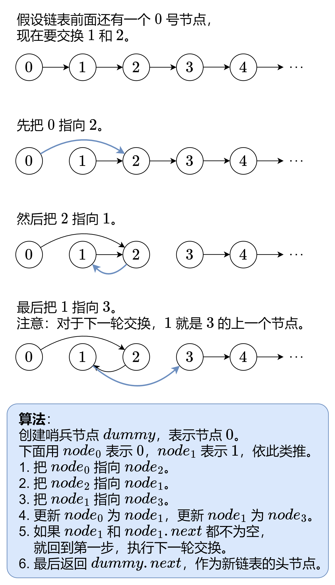
	
时间复杂度 $O(n)$，空间复杂度 $O(1)$．

```
ListNode* swapPairs(ListNode* head) {
    ListNode* dummy = new ListNode(-1, head), * n0 = dummy;
    while (n0->next && n0->next->next)
    {
        ListNode* n1 = n0->next, * n2 = n1->next, * n3 = n2->next;
        n0->next = n2;
        n2->next = n1;
        n1->next = n3;
        n0 = n1;
    }
    return dummy->next;
}
```

### [445. 两数相加 II](https://leetcode.cn/problems/add-two-numbers-ii/)

[反转链表](https://leetcode.cn/problems/reverse-linked-list/)和[两数相加](https://leetcode.cn/problems/add-two-numbers/)的混合，先将两个链表反转后转化为两数相加问题，计算出答案后再次反转即可．

时间复杂度 $O(n)$，空间复杂度 $O(n)$，其中 $n$ 为 $l_1$ 长度和 $l_2$ 长度的最大值。

```cpp
ListNode* reverse(ListNode* head)
{
    ListNode* pre = nullptr, * cur = head, * nxt;
    while (cur)
    {
        nxt = cur->next;
        cur->next = pre;
        pre = cur;
        cur = nxt;
    }   
    return pre;
}

ListNode* addTwoNumbersReversely(ListNode* l1, ListNode* l2)
{
    int carry = 0;
    ListNode* dummy = new ListNode(-1), * cur = dummy;
    while (l1 || l2)
    {
        if (l1)
        {
            carry += l1->val;
            l1 = l1->next;
        }
        if (l2)
        {
            carry += l2->val;
            l2 = l2->next;
        }
        cur->next = new ListNode(carry % 10);
        cur = cur->next;
        carry /= 10;
    }
    if (carry)
        cur->next = new ListNode(carry);
    return dummy->next;
}

ListNode* addTwoNumbers(ListNode* l1, ListNode* l2) 
{
    l1 = reverse(l1), l2 = reverse(l2);
    return reverse(addTwoNumbersReversely(l1, l2));
}
```

### [2816. 翻倍以链表形式表示的数字](https://leetcode.cn/problems/double-a-number-represented-as-a-linked-list/)

#### 方法一

可看作是[两数相加 II](https://leetcode.cn/problems/add-two-numbers-ii/)自身与自身相加．

#### 方法二

利用2倍数的特殊性：当前位的进位只能为0或者1，且只和下一位有关；只有下一位 $\ge5$ 时当前位才会进位．特别地，如果首位 $\ge5$，需要在当前链表前加入一个新的结点．


时间复杂度 $O(n)$，空间复杂度 $O(1)$（原地修改）．

```cpp
ListNode* doubleIt(ListNode* head) {
    if (!head) 
        return nullptr;
    if (head->val >= 5)
        head = new ListNode(0, head);
    for (ListNode* cur = head; cur; cur = cur->next)
    {
        cur->val = cur->val * 2 % 10;
        if (cur->next && cur->next->val >= 5)
            cur->val += 1;
    }
    return head;
}
```

## 快慢指针

### [876. 链表的中间结点](https://leetcode.cn/problems/middle-of-the-linked-list/)

通过快慢指针寻找中间结点：慢指针走一步，快指针走两步．当快指针指向空结点或其下一个结点为空结点时，慢指针指向中间结点．

!!! proof "证明"

	=== "结点数 $n$ 为奇数时"
		设 $n=2k+1$，由于快指针初始在头结点，因此在走 $k$ 步后会到达第 $2k+1$ 个结点即尾结点，此时慢指针到达第 $k+1$ 个结点，因为 $k+1=\dfrac{1}{2}(1+2k+1)$，即为中间结点．
		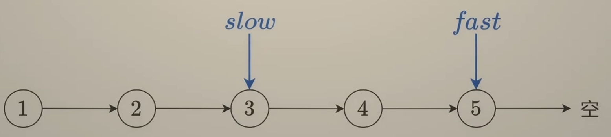
	=== "结点数 $n$ 为偶数时"
		设 $n=2k$，快指针走 $k$步后会到达第 $2k+1$ 个结点即空结点，此时慢指针到达第 $k+1$ 个结点，因为 $k+1=\lceil \dfrac{1}{2}(1+2k) \rceil$，即为第二个中间结点．
		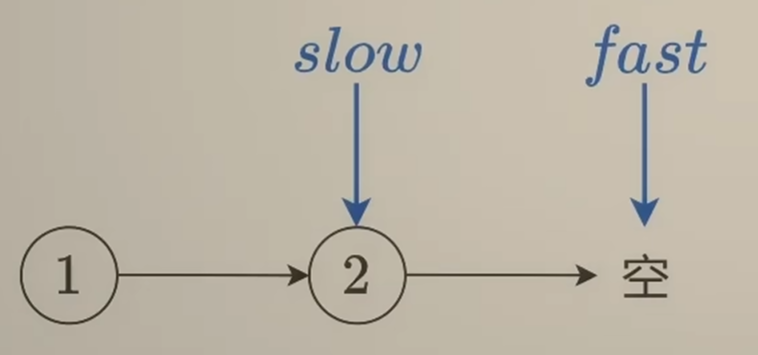

时间复杂度 $O(n)$，空间复杂度 $O(1)$．

```cpp
ListNode* middleNode(ListNode* head) {
    ListNode* slow = head, * fast = head;
    while (fast && fast->next)
    {
        slow = slow->next;
        fast = fast->next->next;
    }
    return slow;
}
```

### [141. 环形链表](https://leetcode.cn/problems/linked-list-cycle/)   

同样的快慢指针，每一次快慢指针走完后判断两指针是否相等，若相等则返回 `true`．

时间复杂度 $O(n)$，空间复杂度 $O(1)$．

??? proof "时间复杂度证明"
	不妨设共有 $n$ 个结点，其中环内有 $k$ 个结点．
	最坏情况下，入环时快指针恰好位于慢指针前方，此时需要 $k-1$ 步才能追上．因此慢指针在环内步数不超过 $k-1$ 步，总共步数不超过 $n-1$ 步，即 $O(n)$．
	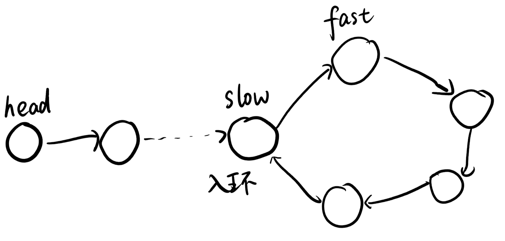

```cpp
bool hasCycle(ListNode *head) {
    ListNode* slow = head, * fast = head;
    while (fast && fast->next)
    {
        slow = slow->next;
        fast = fast->next->next;
        if (slow == fast)
            return true;
    }
    return false;
}
```


### [142. 环形链表 II](https://leetcode.cn/problems/linked-list-cycle-ii/)

当快慢指针相遇后，让慢指针和头结点同时移动，二者相遇处即为入环点．

??? proof "证明"
	**Floyd 判圈算法**
	
	$kc−a$ 是从入环口开始的步数。因为 $(kc−a)+a=kc$，所以从 $kc−a$ 开始，再走 $a$ 步，就可以走满 $k$ 圈．
	
时间复杂度 $O(n)$，空间复杂度 $O(1)$．
```cpp
ListNode *detectCycle(ListNode *head) {
    ListNode* slow = head, * fast = head;
    while (fast && fast->next)
    {
        slow = slow->next;
        fast = fast->next->next;
        if (fast == slow)
        {   
            while (slow != head)
            {
                slow = slow->next;
                head = head->next;
            }
            return head;
        }
    }
    return nullptr;
}
```

### [143. 重排链表](https://leetcode.cn/problems/reorder-list/)

链表的顺序本质就是相向双指针，先放左指针元素再放右指针元素，然后指针向中间移动，重复直到所有结点均被排完．

我们可以通过[链表的中间结点](https://leetcode.cn/problems/middle-of-the-linked-list/)和[反转链表](https://leetcode.cn/problems/reverse-linked-list/)，将中间点及以后的结点反转并得到右指针．

!!! note "过程"
	=== "得到相向双指针"
		通过取中间结点+反转得到两个朝中间结点的链表和双指针．
		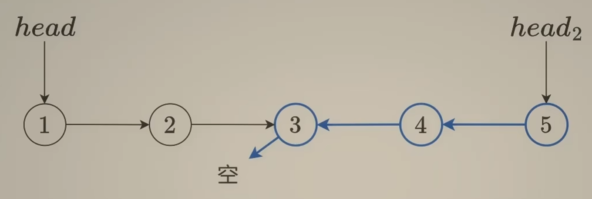
	=== "将双指针交错"
		将 `head1` 指向 `head2`，`head2` 指向 `head1->next`．
		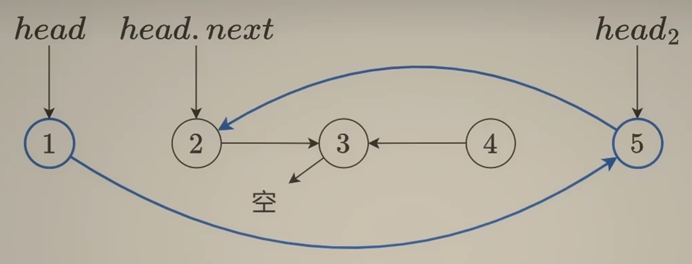
	=== "移动双指针"
		将 `head1` 移至 `head1->next`，`head2` 移至 `head2->next`．
		由于前面会将 `next` 更新，因此要提前存下来．
		当 `head2` 指向中间结点时，若长度为奇数则此时双指针均指向中间结点，可以结束；若长度为偶数则还剩中间结点和其前一结点，但其前一结点本来就指向中间结点，因此也可以结束．
		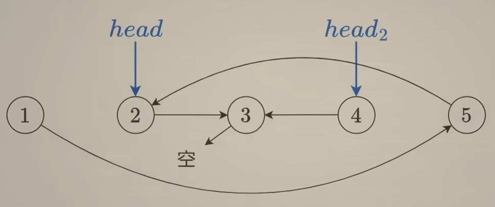

时间复杂度 $O(n)$，空间复杂度 $O(1)$．

```cpp
ListNode* getMid(ListNode* head)
{
    ListNode* slow = head, * fast = head;
    while (fast && fast->next)
    {
        slow = slow->next;
        fast = fast->next->next;
    }
    return slow;
}

ListNode* reverse(ListNode* head)
{
    ListNode* pre = nullptr, * cur = head, * nxt;
    while (cur)
    {
        nxt = cur->next;
        cur->next = pre;
        pre = cur;
        cur = nxt;
    }
    return pre;
}

void reorderList(ListNode* head1) {
    ListNode* mid = getMid(head1);
    ListNode* head2 = reverse(mid);
    while (head2 != mid)
    {
        ListNode* nxt1 = head1->next, * nxt2 = head2->next;
        head1->next = head2;
        head2->next = nxt1;
        head1 = nxt1;
        head2 = nxt2;
    }
}
```

### [234. 回文链表](https://leetcode.cn/problems/palindrome-linked-list/)

使用上题技巧用链表双指针即可．
