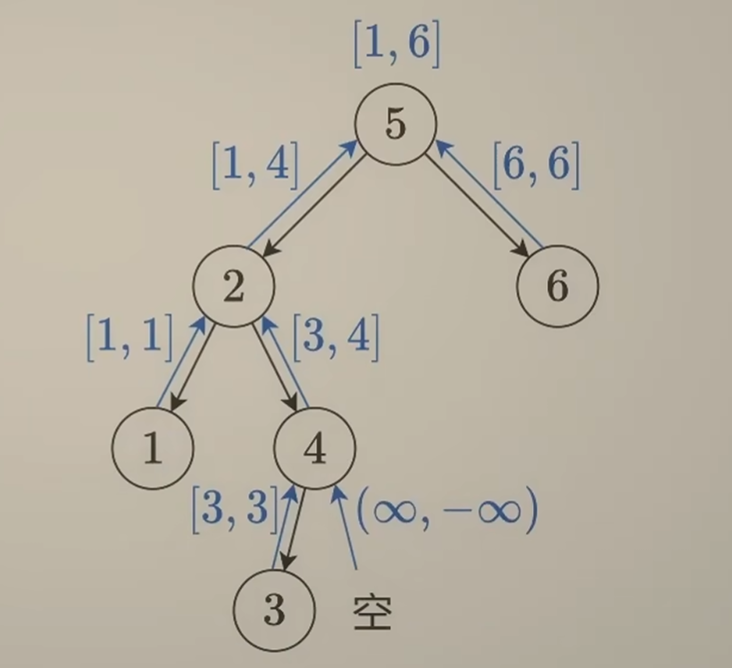

# 二叉树与递归
## 题单

| 分类 | 题目 |
| :--- | :--- |
| **二叉树与递归 - 深入理解** | 🟢 [104. 二叉树的最大深度](#104) |
| | 🟢 [111. 二叉树的最小深度](#111) |
| | 🟢 [404. 左叶子之和](#404) |
| | 🟡 [112. 路径总和](#112) |
| | 🟢 [129. 求根节点到叶节点数字之和](#129) |
| | 🟢 [1448. 统计二叉树中好节点的数目](#1448) |
| | 🟡 [987. 二叉树的垂序遍历](#987) |
| **二叉树与递归 - 灵活运用** | 🟢 [100. 相同的树](#100) |
| | 🟢 [101. 对称二叉树](#101) |
| | 🟡 [110. 平衡二叉树](#110) |
| | 🟡 [199. 二叉树的右视图](#199) |
| | 🟢 [226. 翻转二叉树](#226) |
| | 🟢 [617. 合并二叉树](#617) |
| | 🟢 [1026. 节点与其祖先之间的最大差值](#1026) |
| | 🟠 [1080. 根到叶路径上的不足节点](#1080) |
| **二叉树与递归 - 前/中/后序** | 🟡 [98. 验证二叉搜索树](#98) |
| |  [938. 二叉搜索树的范围和](#938) |
| |  [2476. 二叉搜索树最近节点查询](#2476) |
| |  [230. 二叉搜索树中第 K 小的元素](#230) |
| |  [1373. 二叉搜索子树的最大键值和](#1373) |
| | 🔴 [105. 从前序与中序遍历序列构造二叉树](#105) |
| | 🔴 [106. 从中序与后序遍历序列构造二叉树](#106) |
| |  [889. 根据前序和后序遍历构造二叉树](#889) |
| |  [1110. 删点成林](#1110) |
| **二叉树与递归 - 最近公共祖先** | [236. 二叉树的最近公共祖先](#236) |
| |  [235. 二叉搜索树的最近公共祖先](#235) |
| |  [1123. 最深叶节点的最近公共祖先](#1123) |
| **二叉树 - BFS (层序遍历)** | [102. 二叉树的层序遍历](#102) |
| |  [103. 二叉树的锯齿形层序遍历](#103) |
| |  [513. 找树左下角的值](#513) |
| |  [107. 二叉树的层序遍历 II](#107) |
| |  [116. 填充每个节点的下一个右侧节点指针](#116) |
| |  [117. 填充每个节点的下一个右侧节点指针 II](#117) |
| |  [2415. 反转二叉树的奇数层](#2415) |
| |  [2641. 二叉树的堂兄弟节点 II](#2641) |

## 模拟递归

### [104. 二叉树的最大深度](https://leetcode.cn/problems/maximum-depth-of-binary-tree/)

递归思想：整棵树的最大深度=$\max ($左子树的最大深度，右子树的最大深度$)+1$​，而左右子树的最大深度又回到了当前问题．

假设我们的方法已经能够解决子问题（即使还无法），只需要调用方法即可得到其返回值，那么我们只需要专心讨论当前结点的情况（也就是补全边界条件）；等我们讨论完当前结点的情况后，就会发现该方法也能解决子问题了．

以本题而言：若当前结点是空结点，其肯定没有左右子树，并且本身没有高度，直接 `return 0`；若当前结点不是空结点，那么本身会有1的高度；假设已知左右子树的最大深度 `leftDepth = maxDepth(root->left), rightDepth = maxDepth(root->right)`，套用上述公式 `return max(leftDepth, rightDepth) + 1` 即可．

子结点将 `maxDepth` 自底向上传递自身返回值的过程就是**「归」**．

时间复杂度 $O(n)$，空间复杂度 $O(n)$（函数递归需要开辟栈帧，只有return时才会释放内存；最坏情况下树退化成链表，递归需要 $O(n)$ 的栈空间）．

```cpp
int maxDepth(TreeNode* root) {
    if (!root) {
        return 0;
    }
    return max(maxDepth(root->left), maxDepth(root->right)) + 1;
}
```

### [111. 二叉树的最小深度](https://leetcode.cn/problems/minimum-depth-of-binary-tree/)

本题与[二叉树的最大深度](#104)看似相似，但是会更复杂一些：

原因是：二叉树的**深度**取决于叶结点；对于**非叶结点**，若一个子结点为空而另一个非空，则答案比如来源于非空一侧（因为只有非空一侧才能递归叶结点）．

- 上一题对于非叶结点而言，其空子结点直接返回 $0$ 不会造成影响，因为取 $\max$​ 后答案一定来自于有子结点的那一侧．
- 而本题对于非叶结点，若空子结点返回 $0$，由于计算时会取 $\min$，答案会来自于该空结点，不符合上述原则．

也就是说，我们不能直接对一个结点两个子结点取小 $+1$，而是判断类型：若两子都非空，取小 $+1$；若一边非空，取非空深度 $+1$；若均为空，说明为叶结点，返回 $1$．那么对于该结点为空结点的特判是否需要？我们的递归过程中，只要判定其为空结点，就不会把它塞入递归中，理应不需要特判空结点；但是题目有可能传个空树进来，因此最好还是特判一下．

时间复杂度 $O(n)$，空间复杂度 $O(n)$．

```cpp
int minDepth(TreeNode* root) {
    if (!root) {
        return 0;
    }
    if (!root->left && !root->right)
        return 1;
    if (!root->left)
        return 1 + minDepth(root->right);
    if (!root->right)
        return 1 + minDepth(root->left);
    return min(minDepth(root->left), minDepth(root->right)) + 1;
}
```

### [404. 左叶子之和](https://leetcode.cn/problems/sum-of-left-leaves/)

一个结点可以知道自己是否为叶结点，但无法判断自己是否为左叶子，需要其父结点来判断．对于一个结点，若为空结点则返回 $0$；非空则判断其左子结点是否为叶子，若是则加上其值，并加上递归左右子结点返回；不是叶子就直接递归左右子结点返回．

时间复杂度 $O(n)$，空间复杂度 $O(n)$．

```cpp
bool isLeaf(TreeNode* root) {
    return root && !root->left && !root->right;
}

int sumOfLeftLeaves(TreeNode* root) {
    if (!root)
        return 0;
   	int leftLeafVal = 0;
    if (isLeaf(root->left))
        leftLeafVal = root->left->val;
    return leftLeafVal + sumOfLeftLeaves(root->left) + sumOfLeftLeaves(root->right);
}
```

### [112. 路径总和](https://leetcode.cn/problems/path-sum/)

若根节点满足存在**根结点到叶结点**的路径使总和为 `targetSum`，如果其没有子结点（即叶结点），那么要满足自身值等于 `targetSum`；若有子结点，那么其左右子结点至少有一个满足：存在**自身到叶结点**的路径使总和为 `targetSum - root->val`．

根结点将 `targetSum` 值更新后自顶向下传递给子结点的过程就是**「递」**，子结点将布尔值自下而上返回给根节点的过程就是**「归」**．

!!! warning "注意"
	
	除了题目直接传入空树外，我们不能给递归传入空结点：对于空树且 `targetSum == 0` 而言，没有路径应返回 `false`；而如果是父结点调用，此时 `targetSum == 0` 应该返回 `true`；出现矛盾．

  时间复杂度 $O(n)$，空间复杂度 $O(n)$​．

```cpp
bool hasPathSum(TreeNode* root, int targetSum) {
    if (!root)
        return false;
    if (!root->left && !root->right)
        return root->val == targetSum;
    targetSum -= root->val;
    return hasPathSum(root->left, targetSum) || hasPathSum(root->right, targetSum);
}
```

### [129. 求根节点到叶节点数字之和](https://leetcode.cn/problems/sum-root-to-leaf-numbers/)

此题的数字是父结点在高位而子结点在地位，因此需要自顶向下遍历（因为先遍历的数升位简单而降位难，升位只需要 $\times 10$），即dfs；而dfs过程中子结点需要知道父结点的值，以便作为返回值（如叶结点返回父结点的值 $\times 10+$ `val`）．若 `root` 是空结点（题目传入空树或者是单子的结点传入的空结点），返回 $0$ 即可．

!!! info "注"

	原题的函数并没有父结点值的形参，如果我们直接加上新的形参会编译错误；但我们可以给新的形参加上默认值，这样就不会报错了．

时间复杂度 $O(n)$，空间复杂度 $O(n)$．

```cpp
int sumNumbers(TreeNode* root, int num = 0) {
    if (!root)
        return 0;
    num = num * 10 + root->val;
    if (!root->left && !root->right)
        return num;
    return sumNumbers(root->left, num) + sumNumbers(root->right, num);
}
```

### [1448. 统计二叉树中好节点的数目](https://leetcode.cn/problems/count-good-nodes-in-binary-tree/)

与上题思路类似，dfs自顶向下遍历，同时添加一个当前最大值的形参；若为空结点返回 $0$​，非空判断自身是否为好结点，再递归左右子树．

### [987. 二叉树的垂序遍历](https://leetcode.cn/problems/vertical-order-traversal-of-a-binary-tree/)

本题本质上是对每个结点进行**三关键字排序**：`col > row > val`．将同一列的放入一个 `vector` 中，在列内进行双关键字排序．同一 `vector` 中进行双关键字排序可以直接用二元组，即把 `row` 和 `val` 存入 `pair`；而 `col` 可以用一个 `map` 来对应（由于需要排序，不用写 `unordered_map`），每一个 `col` 对应一个 `vector`．

递归部分与之前类似，将坐标传入后自顶向下dfs即可．

时间复杂度 $O(n\log n)$，空间复杂度为 $O(n)$．

??? proof "时间复杂度证明"
	如果不考虑排序，时间复杂度是 $O(n)$ 的，因为无论是dfs还是创建插入 `vector` 都只遍历了一次．

	若考虑排序，那么我们应该考虑最坏情况下多少个结点可以在同一坐标．
	
	从 $(0,0)$ 出发，向左再向右、向右再向左均可以达到 $(2,0)$；这两个结点按照同样的方法可以得到 $4$ 个在 $(4,0)$ 的结点；以此类推，如果当前有 $2^k$ 个结点在同一坐标，那么增加 $2^{k+2}$ 个结点就可以得到 $2^{k+1}$ 个在同一坐标的结点．
	
	+ $n=5$ 时，最多 $2$ 结点在同一坐标．
	+ $n=5 + 8 =13$ 时，最多 $4$ 结点在同一坐标．
	+ $n=5 + 8 + 16=29$ 时，最多 $8$ 结点在同一坐标．
	+ $n=2^{k+2}-3$ 时，最多 $2^k$ 结点在同一坐标．
	
	最坏情况下有大约 $\dfrac{n}{4}$ 个结点在同一坐标，即最坏情况下在同一坐标的结点数是 $O(n)$ 的，因此对该坐标的排序就是 $O(n\log n)$ 的，瓶颈在排序上．

```cpp
map<int, vector<pair<int, int>>> groups;
void dfs(TreeNode* root, int row, int col) {
    if (!root)
        return;
    groups[col].push_back({row, root->val});
    dfs(root->left, row + 1, col - 1);
    dfs(root->right, row + 1, col + 1);
}

vector<vector<int>> verticalTraversal(TreeNode* root) {
    dfs(root, 0, 0);
    vector<vector<int>> res;
    for (auto &[key, value] : groups)
    {
        sort(value.begin(), value.end());
        vector<int> tmp;
        for (auto ele : value)
            tmp.push_back(ele.second);
        res.push_back(tmp);
    }
    return res;
}
```

### [110. 平衡二叉树](https://leetcode.cn/problems/balanced-binary-tree/)

先给出我一开始的错误示范：虽然结果是对的也能AC，但是当每次用到一个结点的 `maxDepth` 时都要重新遍历整个树；当树退化为链表时会达到 $O(n^2)$ 的复杂度．

```cpp
int maxDepth(TreeNode* root) {
    if (root == nullptr)
        return 0;
    return max(maxDepth(root->left), maxDepth(root->right)) + 1;
}

bool isBalanced(TreeNode* root) {
    if (root == nullptr) return true;
    TreeNode* l = root->left;
    TreeNode* r = root->right;
    return abs(maxDepth(l) - maxDepth(r)) <= 1 && isBalanced(l) && isBalanced(r);
}
```

实际上我们可以边计算高度边判断是否平衡：在 `maxDepth` 内我们需要求出左右子结点的 `maxDepth`，此时我们就可以直接判断了：若不平衡则可以直接返回不平衡．那我们应该如何返回不平衡？由于 `maxDepth` 本身返回值必然为非负数，因此可以用一个负数来标记不平衡，如 $-1$；这样得到结果后，自底向上再传递回去：如果结果不是 $-1$ 就正常计算高度，如果结果是 $-1$ 就让父结点也返回 $-1$ ，直到根结点；最后如果得到的最大高度为 $-1$​ 说明不平衡，反之平衡．

时间复杂度 $O(n)$，空间复杂度 $O(n)$．

```cpp
int maxDepth(TreeNode* root) {
    if (!root)
        return 0;
    int leftDepth = maxDepth(root->left), rightDepth = maxDepth(root->right);
    if (leftDepth == -1 || rightDepth == -1 || abs(leftDepth - rightDepth) > 1)
        return -1;
    return max(leftDepth, rightDepth) + 1;
}

bool isBalanced(TreeNode* root) {
    if (!root) return true;
    return maxDepth(root) != -1;
}
```

### [1080. 根到叶路径上的不足节点](https://leetcode.cn/problems/insufficient-nodes-in-root-to-leaf-paths/)

此题的**递**过程与[路径总和](#112)类似，对于每一个非空非叶结点，可以将 `limit` 减去自身的 `val` 递给子结点．

对于**不足结点**的定义，我本人在初见时理解有偏差：认为是根到某个中间节点的路径和．这导致写出来的代码出现问题：

!!! warning "易错点"

	当某个中间结点的所有叶结点被删除后，其不应该成为新的叶结点．也就是说若 `limit == 0`，由于从根到叶的两条路径均不符合，整棵树都应该被删除；而不是将两个 $-10$ 删除后在判定一次 $1+2+3>0$ 因而将这三个结点留下来．
	

接下来我们对删除条件进行深入剖析：

!!! proof "删除条件证明"

    对于叶结点，由于经过其的根到叶路径只有一条，如果该路径和小于 `limit`，就应该删除自身；即递给叶结点时若有 `limit > val` 就应该删除自身．


    对于非叶结点 `node`，如果其有一个子结点 `son` 没被删除，那么其必然不能被删除．因为经过 `son` 的路径是经过 `node` 路径的子集，`son` 没被删除，说明至少存在一条经过 `son` 的符合条件路径，而这条路径必然经过 `node`．反之，由于其所有子结点的根到叶路径的并集等于经过该结点的路径集合，若其子结点均被删除，则 `node` 也应该被删除．


    因此要删除非叶结点，**当且仅当**其子结点全部被删除．

整理一下思路：与[路径总和](#112)类似，我们不主动将空结点传入递归．对于非空结点，先将 `limit` 减去自身的 `val`；如果自身为叶结点，直接根据 `limit` 值决定返回自身还是空结点；如果自身为非叶结点，则对有子结点处进行递归；只要左右子结点有一个非空就返回自身，否则返回空结点．

时间复杂度 $O(n)$，空间复杂度 $O(n)$．

```cpp
TreeNode* sufficientSubset(TreeNode* root, int limit) {
    if (!root)
        return nullptr;
    limit -= root->val;
    if (!root->left && !root->right)
        return limit <= 0 ? root : nullptr;
    if (root->left)
        root->left = sufficientSubset(root->left, limit);
    if (root->right)
        root->right = sufficientSubset(root->right, limit);
    return root->left || root->right ? root : nullptr;
}
```

## 前中后序遍历

### [98. 验证二叉搜索树](https://leetcode.cn/problems/validate-binary-search-tree/)

本题适合锻炼二叉树的前中后序遍历．

#### 方法一：中序遍历

对于BST，最直接的想法就是中序遍历递增．用一个全局变量 `pre` 储存当前的最大值（初始化为负无穷），对于一个结点，先递归判断左子树为BST，然后将 `pre` 与 `val` 比较，若 `pre >= val` 说明不是BST，反之更新 `pre` 再递归右子树．由于空树也是BST，因此空结点需要返回 `true`．

时间复杂度 $O(n)$，空间复杂度 $O(n)$．

```cpp
long long pre = LLONG_MIN;
bool isValidBST(TreeNode* root) {
    if (!root)
        return true;
    if (!isValidBST(root->left))
        return false;
    if (pre >= root->val)
        return false;
    pre = root->val;
    return isValidBST(root->right);
}
```

#### 方法二：前序遍历

前序遍历先遍历根，我们可以根据根的范围与根的值来判断左右子结点的范围：传入参数时，将该结点应该符合的上下界一并传入，如果不符合就返回 `false`；如果符合就更新传入的参数，继续递归左右子结点．

!!! example "例子"

    以一个结点 `root` 和它的两个子结点为例：
    
    若递归 `root` 是传入的参数是 `isValidBST(root, a, b)`，记 `c = root->val`：
    
    + 若 $c\le a$ 或 $c \ge b$，不符合BST，返回 `false`．
    + 若 $a<c<b$，递归左子树时需要满足左子树均比 $c$ 小，因此需要传入 `isValidBST(root->left, a, c)`；递归右子树时需要满足右子树均比 $c$ 大，传入 `isValidBST(root->left, c, b)`．

时间复杂度 $O(n)$，空间复杂度 $O(n)$．
```cpp
bool isValidBST(TreeNode* root, long long mi = LLONG_MIN, long long mx = LLONG_MAX) {
    if (!root)
        return true;
    int val = root->val;
    return val > mi && val < mx &&
        isValidBST(root->left, mi, val) && 
        isValidBST(root->right, val, mx);
}
```

#### 方法三：后序遍历

后序遍历的顺序是左右根，要想根据左右结点来判断根结点是否合法，第一想法是直接判断 `左 < 根 <右`，但这种想法显然是错的，对于如下树


显然以 $1$ 为根的子树是BST，如果 $2$ 只判断和 $1$ 的大小关系，那么会把该树误判为BST．不过这个错误给了我们一个启发：我们返回的时候可以不返回是否为BST，而是返回以该结点为根的子树的值区间．只要父结点大于左子结点传上来的区间最大值，且小于右子结点传上来的区间最小值，就可以判断以父结点为根的子树是否为BST．

与[平衡二叉树](#110)类似，我们可以设置一个特殊值，只要判断不为BST就返回这个特殊值，归的过程中遇到该特殊值就直接返回，最后只要结果不是这个特殊值，说明整棵树是BST．根据之前的分析，我们可以把这个特殊值设为 $(-\infty,+\infty)$，归给父结点时，若为左子结点，则父结点不可能大于其最大值（$+\infty$）；若为右子结点，则父结点不可能小于其最小值（$-\infty$），因此该特殊值可以做到逐层返回．


因此可以写出初步代码：由于空结点情况不好处理，因此我们将四种情况全部讨论，避免向递归函数中传入空结点．

时间复杂度 $O(n)$，空间复杂度 $O(n)$．

```cpp
typedef long long ll;
pair<ll, ll> postOrder(TreeNode* root) {
    ll val = root->val;
    if (!root->left && !root->right)
        return {val, val};
    if (!root->right)
    {
        auto[l_min, l_max] = postOrder(root->left);
        if (val <= l_max)
            return {LLONG_MIN, LLONG_MAX};
        return {l_min, val};
    }
    if (!root->left)
    {
        auto[r_min, r_max] = postOrder(root->right);
        if (val >= r_min)
            return {LLONG_MIN, LLONG_MAX};
        return {val, r_max};
    }
    auto[l_min, l_max] = postOrder(root->left);
    auto[r_min, r_max] = postOrder(root->right);
    if (val <= l_max || val >= r_min)
        return {LLONG_MIN, LLONG_MAX};
    return {l_min, r_max};
}

bool isValidBST(TreeNode* root) {
    if (!root) 
        return true;
    return postOrder(root).second != LLONG_MAX;
}
```
??? tip "简化"

    如何处理空结点？由于返回 $(-\infty,+\infty)$ 是必然不成立，那么对应地，返回 $(+\infty,-\infty)$ 就是必然成立的．对于下图中的 $1$，其左右子结点均返回 $(+\infty,-\infty)$，要想在符合BST时让自身正常返回 $[1,1]$，我们可以对左区间取 `min`，这样 $+\infty$ 就会被 `min` 洗掉，同理对右区间取 `max`．
    
    
    
    ```cpp
    typedef long long ll;
    pair<ll, ll> postorder(TreeNode* root) {
        if (!root)
            return {LLONG_MAX, LLONG_MIN};
        auto[l_min, l_max] = postorder(root->left);
        auto[r_min, r_max] = postorder(root->right);
        ll val = root->val;
        if (val <= l_max || val >= r_min)
            return {LLONG_MIN, LLONG_MAX};
        return {min(l_min, val), max(r_max, val)};
    }
    
    bool isValidBST(TreeNode* root) {
        return postorder(root).second != LLONG_MAX;
    }
    ```

想要降低空间复杂度实现 $O(1)$，可参考[Morris遍历](https://oi-wiki.org/graph/tree-basic/#%E4%BA%8C%E5%8F%89%E6%A0%91-morris-%E9%81%8D%E5%8E%86)．（反正我没学会😭）

### [105. 从前序与中序遍历序列构造二叉树](https://leetcode.cn/problems/construct-binary-tree-from-preorder-and-inorder-traversal/)

参考资料：[反推二叉树](https://oi-wiki.org/graph/tree-basic/#%E5%8F%8D%E6%8E%A8)，只要有中序遍历+另一个遍历就能反推二叉树．

!!! example "例子"

    
    
    已知 `preorder = [3,9,20,15,7], inorder = [9,3,15,20,7]`．
    
    前序遍历是按照“根左右”遍历，中序遍历按照“左根右”．因此前序遍历的第一个数 $3$ 就是根的值．由于本题中**无重复**元素，在中序遍历中找到该根的值，其左侧即为左子树的中序遍历（$[9]$），右侧即为右子树的中序遍历（$[15,20,7]$）；然后根据左右子树的中序遍历从完整的前序遍历中截取得到左右子树的前序遍历，即 $[9]$ 和 $[20,15,7]$．然后递归构造左右子树拼接上即可．

时间复杂度 $O(n^2)$，空间复杂度 $O(n^2)$．

```cpp
TreeNode* buildTree(vector<int>& preorder, vector<int>& inorder) {
    if (preorder.empty()) return nullptr;

    TreeNode* root = new TreeNode(preorder[0]);
    int l_size;
    for (l_size = 0; l_size < inorder.size(); l_size++)
        if (inorder[l_size] == preorder[0])
            break;
    // break 时 inorder[l_size] = 根，则 0~l_size - 1 为左子树，大小为 l_size

    // 左子树的前序：取根结点后方的 l_size 个结点
    vector<int> leftpre(preorder.begin() + 1, preorder.begin() + 1 + l_size);
    // 右子树的前序：取后面剩下的结点
    vector<int> rightpre(preorder.begin() + 1 + l_size, preorder.end());
    // 左子树的中序：从开头开始，取 l_size 个结点
    vector<int> leftin(inorder.begin(), inorder.begin() + l_size);
    // 右子树的中序：跳过根结点，取剩下的结点
    vector<int> rightin(inorder.begin() + l_size + 1, inorder.end());

    root->left = buildTree(leftpre, leftin);
    root->right = buildTree(rightpre, rightin);
    return root;
}
```

!!! tip "优化"

    每一次递归查找根节点都是 $O(n)$ 复杂度，总共为 $O(n^2)$；对于 `vector` 的复制操作，当二叉树退化为链表时会进行 $O(n)$ 次，总共也是 $O(n^2)$ 复杂度．对于前者，我们可以将中序遍历的根节点值和下标用哈希表存起来，加快访问速率；对于后者，我们可以在递归时不改变数组本身而是传入下标的范围（左闭右开）．


    简化后单次查找根复杂度为 $O(1)$，查找复杂度为 $O(n)$；由于构造树只会把所有值遍历一遍，复杂度为 $O(n)$；总复杂度为 $O(n)$．由于没有开新的 `vector`，只有构建了树，因此空间复杂度为 $O(n)$．
    
    ```cpp
    unordered_map<int, int> mp;
    
    TreeNode* dfs(vector<int>& preorder, vector<int>& inorder, int l_pre, int r_pre, int l_in, int r_in)
    {
        // 如果左右区间相等，说明为空结点
        if (l_pre == r_pre)
            return nullptr;
        // 找到根的值，为前序遍历的第一个值
        int root_val = preorder[l_pre];
        // 找到根的下标
        int root_idx = mp[root_val];
        TreeNode* root = new TreeNode(root_val);
        // 得到左子树的长度
        int l_size = root_idx - li;
        // l_pre + 1 对应 preorder.begin() + 1；l_pre + 1 + l_size 对应 preorder.begin() + 1 + l_size
        // l_in 对应 inorder.begin()；l_in + l_size 对应 inorder.begin() + l_size
        root->left = dfs(preorder, inorder, l_pre + 1, l_pre + 1 + l_size, l_in, l_in + l_size);
        root->right = dfs(preorder, inorder, l_pre + 1 + l_size, r_pre, l_in + l_size + 1, r_in);
        return root;
    }
    
    TreeNode* buildTree(vector<int>& preorder, vector<int>& inorder) {
        for (int i = 0; i < inorder.size(); i++)
            mp[inorder[i]] = i;
        int size = preorder.size();
        return dfs(preorder, inorder, 0, size, 0, size);
    }
    ```

