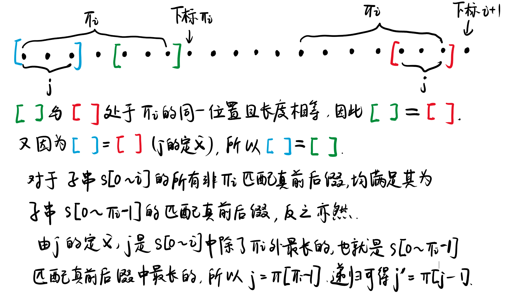

# 串

## 前缀函数与KMP算法
原文链接：

+ [Prefix function. Knuth–Morris–Pratt algorithm](https://cp-algorithms.com/string/prefix-function.html#prefix-function-definition)

+ [前缀函数与KMP算法](https://oi-wiki.org/string/kmp/)

### 前缀函数
对于一个长度为 $n$ 的字符串 $s$，其 **前缀函数** 是一个长度为 $n$ 的数组 $\pi$．而 $\pi[i]$ 为：对于 $s$ 的长度为 $i+1$ 的子串，满足 该子串 **真前后缀** 相等的最大长度．

??? example "例"

    想要让真前后缀相等，那么必要条件是真前后缀的长度要相等．对于长度为 $n$ 的字符串，其长度相等的前后缀共有 $n-1$ 对．
    对于字符串 `abcabcd`：
    
    + $\pi[0]$：取长度为 $1$ 的子串，即 `a`．该子串不存在真前缀、真后缀，因此 $\pi[0] = 0$．
    + $\pi[1]$：取长度为 $2$ 的子串，即 `ab`．该子串有一组长度相等真前后缀：
        + `a` 与 `b`：不相等；
        + 最大长度为 $0$，因此 $\pi[1] = 0$．
    + $\pi[2]$：`abc` 有两组长度相等的真前后缀：
        + `a` 与 `b`：不相等；
        + `ab` 与 `bc`：不相等；
        + 最大长度为 $0$，因此 $\pi[2] = 0$．
    + $\pi[3]$：`abca` 有三组长度相等的真前后缀：
        + `a` 与 `a`：相等，长度为 $1$；
        + `ab` 与 `ca`：不相等；
        + `abc` 与 `bca`：不相等；
        + 最大长度为 $1$，因此 $\pi[3] = 1$．
    + $\pi[4]$：`abcab` 有四组长度相等的真前后缀：
        + `a` 与 `b`：不相等；
        + `ab` 与 `ab`：相等，长度为 $2$；
        + `abc` 与 `cab`：不相等；
        + `abca` 与 `bcab`：不相等；
        + 最大长度为 $2$，因此 $\pi[4] = 2$．
    + $\pi[5]$：`abcabc` 有五组长度相等的真前后缀：
        + `a` 与 `c`：不相等；
        + `ab` 与 `bc`：不相等；
        + `abc` 与 `abc`：相等，长度为 $3$；
        + `abca` 与 `cabc`：不相等；
        + `abcab` 与 `bcabc`：不相等；
        + 最大长度为 $2$，因此 $\pi[5] = 3$．
    + $\pi[6]$：`abcabcd` 有六组长度相等的真前后缀：
        + `a` 与 `d`：不相等；
        + `ab` 与 `cd`：不相等；
        + `abc` 与 `bcd`：不相等；
        + `abca` 与 `abcd`：不相等；
        + `abcab` 与 `cabcd`：不相等；
        + `abcabc` 与 `bcabcd`：不相等；
        + 最大长度为 $2$，因此 $\pi[6] = 0$．
    
    综上，字符串 `abcabcd` 的前缀函数为 $[0,0,0,1,2,3,0]$．

用公式表示：$\pi[i]$ 是在 $s[0\dots i]$ 中寻找的，每次匹配真前后缀的长度为 $k$（其中 $k=1, 2, \dots i$），那么前缀范围就是 $s[0\dots k -1]$，后缀范围就是 $s[i - k + 1,i]$．则有

$$
\pi[i] = \max \{ k \mid 0 \le k \le i, \text{ 且 } s[0 \dots k-1] = s[i-k+1 \dots i] \}
$$

特别地，当 $k=0$ 时前缀为 $[0,-1] $，后缀为 $[i+ 1,i]$，表示为空串，其匹配长度恒为 $0$．由于此处我们写的是闭区间，而 C++ 中 `substr` 方法为左闭右开，因此我们的 $[0, -1]$ 相当于 C++ 中的 `substr[0, 0]`．

???+ note "实现"

    代码实现如下，时间复杂度为 $O(n^3)$．
    ```cpp
    std::vector<int> prefix_function(const std::string &s) {
        int n = s.size();
        std::vector<int> pi(n);
        for (int i = 1; i < n; i++) {
            int mx = 0;
            // k 最大值为 i，即取 0 ~ i - 1
            for (int k = 0; k <= i; k++) {
                if (s.substr(0, k) == s.substr(i - k + 1, k)) {
                    mx = std::max(mx, k);
                }
            }
            pi[i] = mx;
        }
        return pi;
    }
    ```

??? tip "简化"

    对于给定的 $i$，如果出现了长度为 $k$ 的匹配真前后缀，那么长度小于 $k$ 的永远不会成为答案，因此我们可以倒着求解剪枝，当得到匹配真前后缀后立即返回．虽然时间复杂度还是 $O(n^3)$，但比原方法快．
    ```cpp
    std::vector<int> prefix_function(const std::string &s) {
        int n = s.size();
        std::vector<int> pi(n);
        for (int i = 1; i < n; i++) {
            // k 最大值为 i，即取 0 ~ i - 1
            for (int k = i; k >= 0; k--) {
                if (s.substr(0, k) == s.substr(i - k + 1, k)) {
                    pi[i] = k;
                    break;
                }
            }
        }
        return pi;
    }
    ```

### 计算前缀函数的高效算法
#### 第一个优化

$$
\underbrace{\overbrace{s_0 ~ s_1 ~ s_2}^{\pi[i] = 3} ~ s_3}_{\pi[i+1] = 4} ~ \dots ~ \underbrace{\overbrace{s_{i-2} ~ s_{i-1} ~ s_{i}}^{\pi[i] = 3} ~ s_{i+1}}_{\pi[i+1] = 4}
$$

观察上图，当确定 $\pi[i] = 3$ 时，我们有 ${s_0 ~ s_1 ~ s_2}={s_{i-2} ~ s_{i-1} ~ s_{i}}$．若 $s_3=s_{i+1}$，则此时 $\pi[i+1] = 1+\pi[i] = 4$．反之，若 $s_3 \ne s_{i +1}$，必有 $\pi[i+1]<4$．因此我们可以得到： 移动到下一个位置时，前缀函数值至多增加 $1$．


???+ note "实现"

	此时的简化算法为：
	
	```cpp
	std::vector<int> prefix_function(const std::string &s) {
	    int n = s.size();
	    std::vector<int> pi(n);
	    for (int i = 1; i < n; i++) {
	        for (int k = pi[i - 1] + 1; k >= 0; k--) {
	            if (s.substr(0, k) == s.substr(i - k + 1, k)) {
	                pi[i] = k;
	                break;
	            }
	        }
	    }
	    return pi;
	}
	```
	
	!!! question "时间复杂度分析"
	
	    定义势能函数 $\Phi$：令第 $i$ 次外层循环结束时的势能 $\Phi_i = \pi[i]$，显然 $\Phi_i \ge 0$ 且 $\Phi_0 = 0$．第 $i$ 次循环开始时，$k=\pi[i-1]+1$，相当于势能增加了 $1$ 个单位；而内层循环每执行一次 `k--`，势能减少一个单位，同时触发一次字符串比较．


        在整个循环中，$\Phi$ 总增加量为 $n$（每次 $+1$，循环 $n$ 次）；由于势能 $\Phi\ge 0$，其总减少量必然小于等于 $n$；也就是说字符串比较次数为 $O(n)$ 级别．每次比较是 $O(k)$ 复杂度，在最坏情况下 $k$ 会随着 $n$ 一起线性增长，使得整体复杂度变为 $O(n^2)$．

#### 第二个优化
在第一个优化中，我们讨论了 $\pi[i] = 3$ 时 $s_3=s_{i+1}$ 的情况．转化成一般情况就是：$\pi[i]$ 表示长度为 $i+1$ 的子串 $s[0\dots i]$ 的前缀 $s[0\dots \pi[i] - 1]$ 与后缀的 $\pi[i]$ 个字母相等．如果有 $s[i+1] = s[\pi[i]]$，此时就会有 $\pi[i+1] = \pi[i] + 1$．

如果 $s[i+1] \ne s[\pi[i]]$ 呢？我们不希望再次使用 `substr` 这样的 $O(n)$ 操作从头开始找，而是希望利用我们已有的东西．记住 $\pi[i]$ 是“最长相等真前后缀长度”，最长的指望不上，我们还可以指望短一点的．如对于子串 $s[0\dots i]$，我们找到仅次于 $\pi[i]$ 的满足真前后缀相等的长度 $j$，即 $s[0 \dots j-1] = s[i-j+1,i]$：

$$
\overbrace{\underbrace{s_0 ~ s_1}_j ~ s_2 ~ s_3}^{\pi[i]} ~ \dots ~ \overbrace{s_{i-3} ~ s_{i-2} ~ \underbrace{s_{i-1} ~ s_{i}}_j}^{\pi[i]} ~ s_{i+1}
$$

若 $s[j] = s[i+1]$，那么此时就有 $\pi[i+1]=j+1$，否则，我们将继续上述过程，找到仅次于 $j$ 的满足真前后缀相等的长度 $j'$，如此反复直到相等或是 $j=0$．当 $j=0$ 时，我们就要比较 $s[0]$ 与 $s[i+1]$，若相等则 $\pi[i+1]=1$，否则 $\pi[i+1]=0$．

那我们应该如何找到这个 $j$？由于这是一个递归过程，因此只要能在 $\pi[i]$ 中找到 $j$，就能在 $j$ 中找到 $j'$．

寻找 $j$ 的过程如下图（字不好看，见谅）：



接下来转化到代码中，我们要求的是 $\pi[i]$ 而不是 $\pi[i+1]$，很简单，用 $i$ 代替 $i+1$ 即可．初始 $j=\pi[i-1]$（即前一段的最长匹配），若 $s[j]\ne s[i]$，将其变为第二长匹配 $j=\pi[j-1]$ 继续判断直到 $j=0$．退出循环时若 $s[i]=s[j]$，此时 $\pi[i]=j+1$；或者是因为 $j=0$ 而退出循环，并且此时 $s[j]\ne s[i]$，则 $\pi[j]=0$，为默认值不需要操作．

```cpp
std::vector<int> prefix_function(const std::string &s) {
    int n = s.size();
    std::vector<int> pi(n);
    for (int i = 1; i < n; i++) {
        int j = pi[i - 1];
        while (j > 0 && s[j] != s[i]) {
            j = pi[j - 1];
        }
        if (s[i] == s[j]) {
            pi[i] = j + 1;
        }
    }
    return pi;
}
```

其时间复杂度可以类比上一段证明，$j$ 的减少次数在 $O(n)$ 级别．而现在每次比较只需要单个字符 $O(1)$ 时间，因此总复杂度为 $O(n)$．

### KMP算法

KMP算法是由 Knuth、Morris 和 Pratt 共同发布的算法，用于解决在字符串查找子串问题．

给定一个长度为 $n$ 的字符串 $s$ 与一段长度为 $m$ 的文本 $t$，让我们找到 $s$ 在 $t$ 中的所有出现．我们可以将 $s$ 和 $t$ 用一个从来不在他们中出现过的字符连接起来，成为 $s\#t$．计算其前缀函数．

由于前缀函数不可能超过字符串长度，因此 $s$ 部分肯定不存在值为 $n$ 的前缀函数；如果在前缀函数中出现了 $n$，说明以该字符结尾的子串与前 $n$ 个字符相等，而前 $n$ 个字符为 $s$，并且出现 $n$ 的地方一定在 $t$ 的部分，也就是我们在 $t$ 中找到了 $s$．

如果在下标 $i$ 处有 $\pi[i] = n$，除去 $n$ 和连接字符，其在 $t$ 的下标为 $i-n-1$．那么找到的 $s$ 范围就是 $[i-2n,i-n-1]$​．


Knuth–Morris–Pratt 算法用 $O(n+m)$ 的时间解决了该问题．

```cpp
std::vector<int> kmp(const std::string &pattern, const std::string &text) {
    int n = pattern.size(), m = text.size();
    std::string join = pattern + "#" + text;
    std::vector<int> res;
    std::vector<int> pi = prefix_function(join);
    for (int i = n + 1; i <= n + m; i++) {
        if (pi[i] == n) {
            res.push_back(i - 2 * n);
        }
    }
    return res;
}
```

??? success "实战"

    [P3375 【模板】KMP](https://www.luogu.com.cn/problem/P3375)
    参考代码：
    ```cpp
    #include <cstring>
    #include <iostream>
    #include <vector>
    
    std::vector<int> prefix_function(const std::string &s) {
        int n = s.size();
        std::vector<int> pi(n);
        for (int i = 1; i < n; i++) {
            int j = pi[i - 1];
            while (j > 0 && s[j] != s[i]) {
                j = pi[j - 1];
            }
            if (s[i] == s[j]) {
                pi[i] = j + 1;
            }
        }
        return pi;
    }
    
    int main() {
        std::string text, pattern;
        std::cin >> text >> pattern;
        int n = pattern.size(), m = text.size();
        std::string join = pattern + "#" + text;
        std::vector<int> res;
        std::vector<int> pi = prefix_function(join);
        for (int i = n + 1; i <= n + m; i++) {
            if (pi[i] == n) {
                std::cout << i - 2 * n + 1 << '\n';
            }
        }
        for (int i = 0; i < n; i++) {
            std::cout << pi[i] << ' ';
        }
    }
    ```