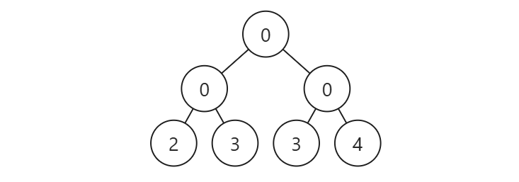
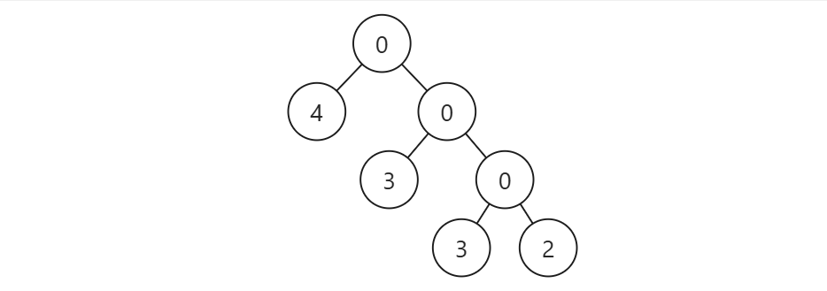

# 树
## Huffman树
### 树的带权路径长度
对于有 $n$ 个带权叶结点的二叉树，从根结点到各叶结点的路径长度与相应叶节点权值的乘积之和称为 **树的带权路径长度（Weighted Path Length of Tree，WPL）**．

$$
WPL = \sum_i^nw_il_i
$$

### Huffman算法
根据[排序不等式](https://en.wikipedia.org/wiki/Rearrangement_inequality)，想要让 $WPL$ 的值最小，肯定是让权越大的结点放在深度越低的地方更好。但是由于带权的是叶结点，一旦放了该结点相当于把这部分分支堵住了，会减少深度较低的结点数量，反而可能导致 $WPL$ 的值升高．

???+ example "例"
    
    不妨设四个叶结点权值分别为 $2,3,3,4$．
    
    === "满二叉树"
        

        此时 $WPL = 2\times(2 + 3 + 3 + 4) = 24$

    === "将权4结点放在深度为1处"
        

        此时 $WPL = 4 + 2\times 3 + 3\times 3 + 3\times 2 = 25$

    上述例子证明：**自顶向下** 的贪心行不通．因为我们无法预知树的整体形态，提前让大权节点占据浅层位置，会导致大量低权节点被迫推向极深处，从而拉高整体的 $WPL$。

自顶向下的贪心行不通，那如果是 **自底向上** 呢？最直接的想法就是把权值最低的两个结点放在树底作为最深的结点，来尝试证明一下．

!!! question "证明：权值最低的点一定在最深处"

    采用反证法：假设有一棵最优的树（WPL最小），最深处放的不是权值最小点，而权值最小点被放在了较浅的地方．假设权值最小点为 $a$，其深度为 $l_a$，权值为 $w_a$；最深处的点深度为 $l_c$，其权值为 $w_c$．

    由假设可知：$l_a<l_c,w_a<w_c$；那么将这两个结点位置交换后，得到

    $$
    \Delta WPL = (w_cl_a+w_al_c)-(w_al_a+w_cl_c)=(w_c-w_a)(l_a-l_c)<0
    $$

    交换后 WPL 变小，与原假设矛盾．因此权值最小的节点不可能比权值更大的节点浅。

!!! question "证明：最深层的叶子节点必然有兄弟"

    采用反证法：假设有一棵最优的树（WPL最小），最深层的叶子结点无兄弟（即父结点只有一个孩子），由于其父结点不是叶结点，因此父结点是无权值，可删去的；用最深的叶子结点代替父结点，由于叶结点深度减少 $1$，WPL必然变小，与原假设矛盾．因此最深层的叶子节点必然有兄弟．

!!! question "证明：权值最小的两个结点可以互为兄弟"

    由于最深层至少有两个叶结点，且权值低的结点更深，那么最深层放的肯定是权值最低的几个结点．对于权值最小的两个结点 $a, b$，他们肯定在同一层．假设 $a,b$ 不互为兄弟，由上一结论可知他们都各自有兄弟，不妨设 $a,c$ 为兄弟，$b,d$ 为兄弟；将 $b,c$ 位置对调后由于深度 $L$ 不变，WPL也不变．此时仍然是一棵最优树，因此权值最小的两个结点可以互为兄弟．

接下来我们证明可以将这两个结点合并，将其和作为父结点的值．

!!! question "证明：将权值最小的两个结点合并成父结点不影响结果"
    
    不妨权值最小的两个结点 $a,b$ 为兄弟，深度为 $L$，他们的父结点为 $c$．将 $c$ 的权值记作 $w_c=w_a+w_b$，则合并后从根节点到 $c$ 的加权长度为 $w_c\times (L-1)$；而原来的加权长度为 $(w_a+w_b)\times L$，他们的差值为定值 $w_a+w_b$．因此原问题最优解等价于将结点 $a,b$ 换成 $c$ 后的最优解加上 $w_a$ 与 $w_b$．

我们将结点 $a,b$ 换成权值为他们和的结点 $c$．此时含有 $n$ 个结点的问题被简化为含有 $n-1$ 个结点的子问题．我们对这个子问题继续重复如上步骤：选出最小权值的两点合并成一点变为 $n-2$ 个结点的子问题．直到集合中只剩下一个结点为止，该结点即为最优树的根节点．把合并的操作反向，把根节点逐渐拆回去，得到一棵最优树，该树即为 Huffman 树．

???+ code "代码"
    ```cpp
    struct TreeNode {
        int val;
        TreeNode *left;
        TreeNode *right;

        TreeNode(int x) : val(x), left(nullptr), right(nullptr) {}
    };

    struct CompareNode {
        bool operator()(TreeNode* a, TreeNode* b) const{
            return a->val > b->val; 
        }
    };

    TreeNode* buildHuffmanTree(const std::vector<int>& weights) {
        struct Cmp {
            bool operator()(TreeNode* a, TreeNode* b) const {
                return a->val > b->val;
            }
        };

        std::priority_queue<TreeNode*, std::vector<TreeNode*>, Cmp> pq;

        for (int w : weights)
            pq.push(new TreeNode(w));

        while (pq.size() > 1) {
            auto left = pq.top(); pq.pop();
            auto right = pq.top(); pq.pop();

            auto parent = new TreeNode(left->val + right->val);
            parent->left = left;
            parent->right = right;

            pq.push(parent);
        }

        return pq.top();
    }
    ```