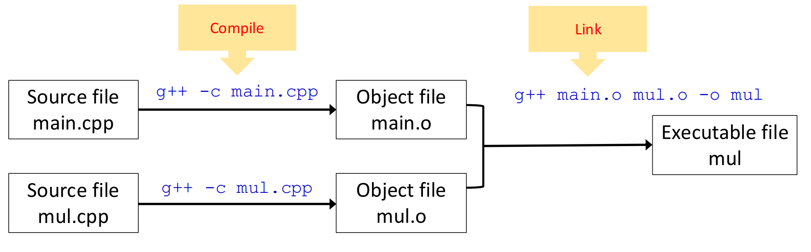

# 编译

## 头文件与源文件
为了提高大型项目的编译效率，我们可以将一个项目拆分为多个文件，并用头文件将源文件连接起来．例如，我们有 `mul.hpp` 定义了 `mul` 函数的接口，`mul.cpp` 定义了 `mul` 函数的实现，`main.cpp` 作为函数入口调用了 `mul` 函数．我们只需要将 `main.cpp` 和 `mul.cpp` 都 `#include "mul.cpp"`，在编译过程中会将他们连接起来，就可以正常调用 `mul` 函数了．

## 编译过程
C++的编译与C语言过程类似，可参考[C语言的编译过程](../../computer-system/computer-architecture/C.md#_1)．

此处我们以具体的代码与命令行来演示．

!!! example "编译过程"
	
	=== "main.cpp"
	
	    ```cpp
	    #include <iostream>
	    #include "mul.hpp"
	
	    int main() {
	        int a, b, result;
	
	        std::cout << "Pick two integers:";
	        std::cin >> a >> b;
	
	        result = mul(a, b);
	
	        std::cout << "The result is " << result << std::endl;
	        return 0;
	    }
	    ```
	=== "mul.hpp"
	
	    ```cpp
	    #pragma once
	
	    int mul(int a, int b);
	    ```
	    
	=== "mul.cpp"
	
	    ```cpp
	    #include "mul.hpp"
	
	    int mul(int a, int b) {
	        return a * b;
	    }
	    ```
	**预处理阶段**：替换头文件及宏定义，经过预处理后，`#include "mul.hpp"` 被直接替换为 `int mul(int a, int b);`．


	**编译阶段**：输入 `g++ -c main.cpp` 与 `g++ -c mul.cpp`，其中 `-c` 表示“只编译不连接”，我们可以得到两个 `object` 文件．
	
	
	**链接阶段**：输入 `g++ main.o mul.o -o mul` 得到可执行文件，其中 `-o` 表示指定可执行文件的目标文件名（不用 `-o` 默认生成 `a.out`（在windows为 `a.exe`）．
	
	> 也可以直接输入 `g++ main.cpp mul.cpp -o mul` 同时编译链接． 
	!!! warning "错误类型"
	
		+ 编译错误：比如在 `main.cpp` 中少打了一个 `;`，此时会在编译阶段失败．
		+ 链接错误：比如在 `mul.cpp` 中误将函数名写成 `Mul`，此时两个文件可以单独编译，但是会在链接时失败．
		+ 运行错误：如把0作为除数、空指针异常等．