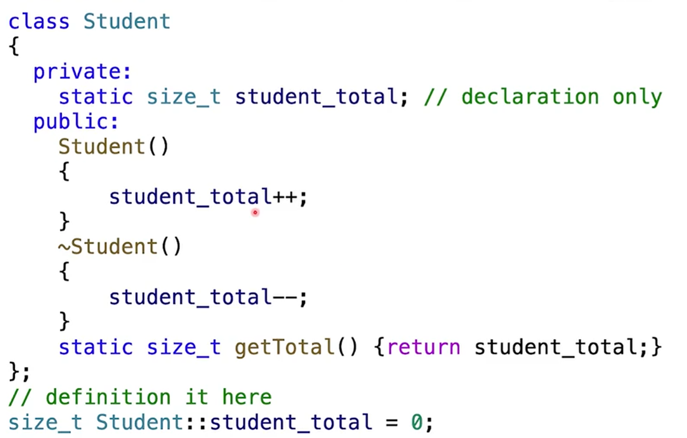
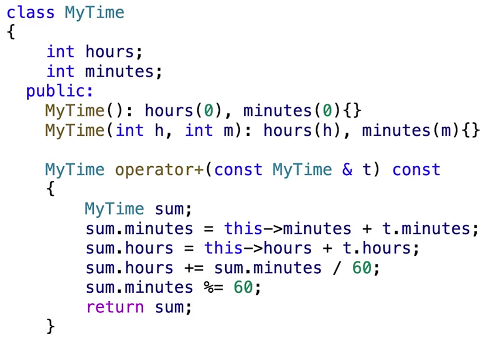
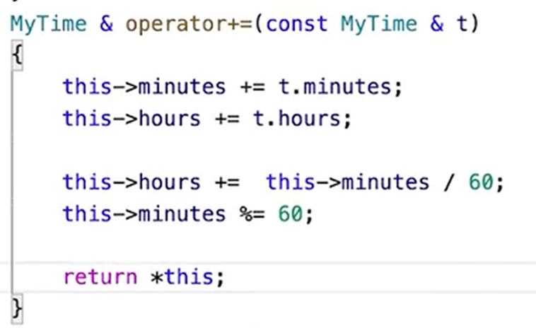
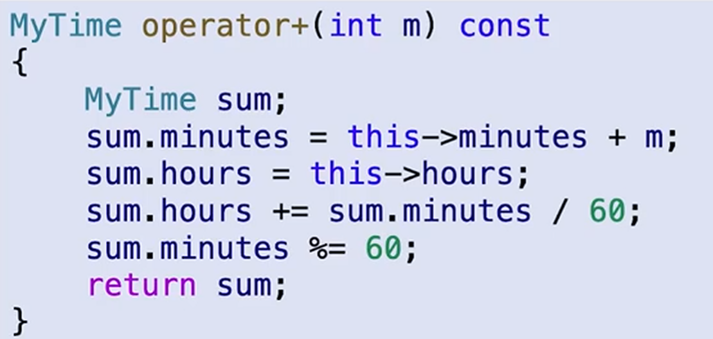
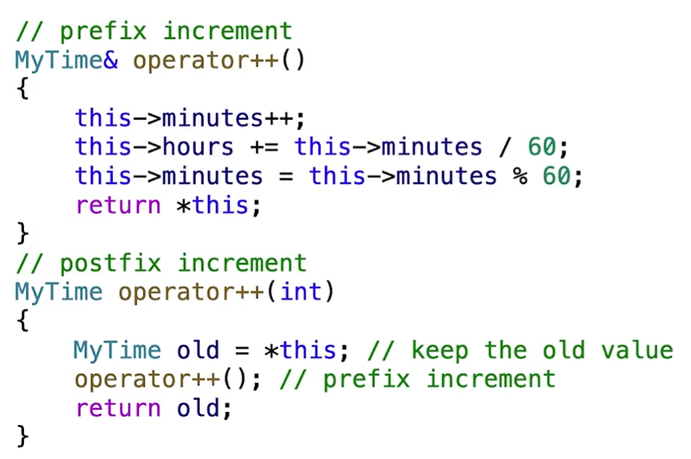
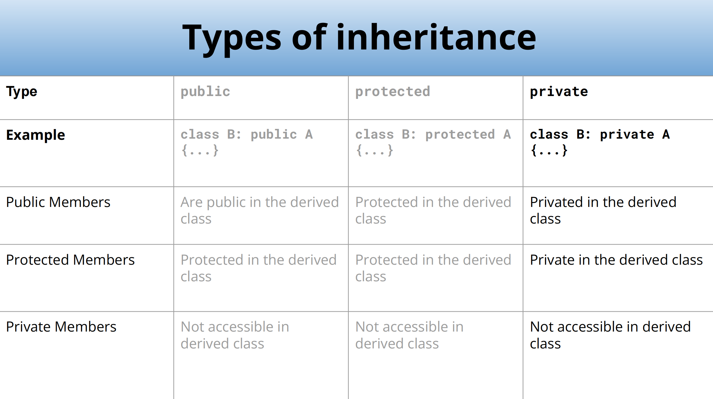

# CS106L

## TypesAndStructs

### 语言差别

编译型语言（cpp）：先编译得到.exe再运行，编译时检查错误（Compile Time Error）

解释型语言（Python）：一句句运行，运行时检查错误（Runtime Time Error）

### 结构体

结构体初始化：直接用变量名 = { }，其中内容按照结构体定义顺序，= 可省略

### pair

含两个变量的结构体：std::pair

pair本质是模板

```cpp
template <typename T1, typename T2>
struct pair {
    T1 first;
    T2 second;
};
```

### 命名空间/库

命名空间：不同的库中可能会使用相同的函数名，因此将库放在一个命名空间下，防止冲突

一般一个命名空间里有多个库，比如std对应string, utility, iostream

std：常用的命名空间 不要使用using namespace std 不好的编程习惯

使用std时需要include相关库文件

```cpp
#include <string> => std::string
#include <utility> => std::pair
#include <iostream> => std::cout, std::endl
```

### using

可以使用using A = B，给B起别名A，类似typedef

### auto

auto可以自动推断类型（但一定要确定，比如函数返回值、遍历的迭代器）

可以使用：

```cpp
std::pair<bool, std::pair<double, double>> result = solveQuadratic(a, b, c);
==>
auto result = ...
```

不能使用：

```cpp
int i = 1;
==>
auto i = 1;
```

## InitializationAndReferences

### 初始化

**直接初始化**：比如 `int numOne = 12.0` 和 `int numTwo(12.0)` 都是可以初始化的，会把float强制转化为int，这个过程叫**narrowing conversion**，将一个数据转换为另一种取值范围更小、可能导致精度丢失或数据溢出的类型

**标准初始化**：大括号 `int numOne{12.0}` 此时cpp会报错，改成12后可以编译

- 好处：安全、普遍存在

例如：

```cpp
std::map<std::string, int> ages {
    {"Alice", 25},
    {"Bob", 30},
    {"Charlie", 35}
};

std::vector<int> numbers{1, 2, 3, 4, 5};
```

以及之前结构体的初始化也是这种方法（省略括号的形式）

**结构化绑定（cpp17）**：类似python，可以将返回值打包成元组

```cpp
#include <string>
#include <tuple>

std::tuple<std::string, std::string, std::string> getClassInfo() {
	std::string className = "CS106L";
	std::string buildingName = "Thornton 110";
	std::string language = "C++";
	return {className, buildingName, language};
}
int main() {
	auto [className, buildingName, language] = getClassInfo();
    return 0;
}
```

或者 `auto [id, name] : courseMap` 这类

### 引用

```cpp
int num = 5;
int& ref = num;

ref = 10;
std::cout << num << std::endl; // Output: 10
```

类型后加&表示引用，表明该变量和原始变量是同一个，这样可以便于传入函数修改值、减少复制开销

如果我们并没有修改内容的需求，为了防止误修改内容，可以加上const

### 左值与右值

左值：可以出现在表达式左侧、拥有实际内存地址的对象

右值：只能出现在表达式右侧，在表达式求值后不持久存在

注意：在右边的也可能是左值

```cpp
int x = 10; // x是左值，10是右值
int y = x; // x y都是左值

void f(int &n);

int n = 5;
f(n); // 左值拥有实际内存地址，传入引用合法
f(5); // 右值不具有实际内存地址，不能作为引用传入
```

### const

加上const的变量无法修改，包括基本变量与容器。

不能声明一个对const变量的非const的引用，可以声明一个const变量的const引用

### 编译

使用g++编译：g++ -std=c++23 main.cpp -o main

g++：编译命令

-std=c++23：c++版本

main.cpp：源文件

-o：表示给可执行文件起一个名字，main为名字

## Streams

### 抽象

抽象：提供接口，不需要关注怎么实现，只需要怎么用
```cpp
std::string s;

std::cin >> s;
std::cout << s;

std::ofstream fout("data.txt"); // 创建一个 data.txt 文件
fout << "I'm writing to this file"; // 写入内容

std::iftream fin("data.txt"); // 输入文件流
std::string first_input;
fin >> student_input;
```

### 流

#### 流是什么

stream是读写数据的抽象接口，隐藏了数据来源（键盘、文件、网络）和去向（屏幕、硬盘）

- 统一接口：可以使用一致的界面（如 << 和 >>）来读写数据
- 类型转换：将外部字符串转化为程序内部的实际数据类型

#### 层级结构

- 基础：ios_base，维护流的状态信息（如是否出错 failbit、到达末尾 eofbit）和控制信息

- 输入流：用提取运算符>>从源头读取
- 输出流：用插入运算符<<发送到目的地

#### buffer & flush

- **buffer**：字符数组会先存储在一个中间缓冲区中，这样能提高效率

- **flush**：将缓冲区清空

  什么时候会flush？

  - 手动触发：使用 std::flush 或 std::endl（换行+flush）
  - 程序结束：退出时会自动清空
  - 缓冲区满：存不下了强制清空
  - 交互触发：cin需要获取输入时，会自动刷新cout缓冲区

#### cin && getline()

std::cin >> 会自动跳过开头的空格（包括制表符换行符），也就是从第一个非空字符开始读取，直到读到空格

注意：cin会自动判断需要输入的类型并且只接收需要的类型。

```cpp
// 输入：3.14

int a = 100;
double b;
std::cin >> a >> b; // 由于 a 是int类型，cin遇到 . 后停止，此时a读入3；然后给b读入，由于b是double，读入.14合法，b会得到0.14

```

如果一个非空白字符合法字符都没读取到，就会触发failbit：

```cpp
// 输入：1abc，由于abc不符合int，因此给a输入1后就会自动结束a的输入，剩下的abc还在缓冲区
int a;
std::cin >> a;

// 输入：abc，此时第一个非空白字符就不合法，输入完全失败，输入流触发failbit状态，后续的所有cin都会被跳过
// 同时a会变为0
```

std::getline(std::cin（或者其他输入流）, string s, char delim = '\n') 会读取一整行的内容，直到遇到delim为止（此时它会把\n吞掉，也就是缓冲区不再有\n但是字符串也没有s）。注意它不会像cin一样自动忽略开头的空格、制表符、换行符，也就是说开头的空格也会读进去，并且如果第一个字符就是\n的话会得到一个空字符串

```cpp
//例如输入：3.14\nRachel Fernandez\n
double pi, tao;
std::string name;

std::cin >> pi; // 此时pi输入3.14，然后遇到\n，cin结束，此时buffer首字符是\n
std::getline(std::cin, name); // getline在缓冲区遇到 \n，结束读入并将这个换行删除，name读入空字符串
std::cin >> tao; // 此时字符类型与double不匹配，发生failbit

// 如何修复？对于上面的例子，直接读两次getline即可；但是如果cin是因为空格、制表符停住的，这样做就会出问题。所以尽量不要把cin和getline混用
```

#### stringstream

stringstream同时继承了istream和ostream的所有特性，也就是可以使用>>和<<．

```cpp
// 初始化
std::string initial_quote = “Bjarne Stroustrup C makes it easy to shoot yourself in the foot\n”;
std::stringstream ss(initial_quote); // 或者 ss << initial_quote;

// 接着可以像cin一样提取输入

ss >> first >> last >> language;

// 如果使用 ss >> extracted_quote; 那么就只会读到 makes
std::getline(ss, extracted_quote);
```

#### 取消同步

- `std::ios::sync_with_stdio(false)`：默认情况下，C++流会与C的标准输入输出（printf）同步，也就是可以交替使用cout和printf而不会出现输出顺序混乱，但是代价是C++流必须做很多检查工作，降低性能；关闭同步流后性能提升，但是不能混用流输出和printf
- `cin.tie(NULL)`：默认情况下cin和cout是绑定的，也就是cin读取数据前程序会flush cout的缓冲区，这样用户能即时看到屏幕上的提示文字；关闭绑定后，cin时cout不再自动刷新，要把所有输入输完才会一起输出
- 注意：频繁清空缓冲区会降低速度，因此开启以上两条后不要用 std::endl 来换行而是 \n，因为前者会强制清空缓冲区

#### 输出文件流

`std::ofstream` 创建一个关联到文件的输出流，可以将流写入文件

```cpp
int main() {
    std::ofstream ofs("hello.txt");
    
    // 如果文件成功打开，将数据写入文件
    if (ofs.is_open()) {
        ofs << "Hello CS106L" << '\n';
    }
    
    // 关闭对该文件的输出流
    ofs.close();
    
    ofs << "this will not get written";
    
    ofs.open("hello.txt"); // 如果想要以追加而非覆盖形式写入，open时加入参数 ofs.open("hello.txt", std::ios::app)
    // 同时可以用 std::ofstream ofs("hello.txt", std::ios::app)
    
    ofs << "this will though! It’s open again";
    
    return 0;
}
```

#### 输入文件流

`std::ifstream` 创建一个关联到文件的输入流，将文件内容以流读出

```cpp
int inputFileStreamExample() {
    // 1. 构造时关联文件：创建一个输入文件流并尝试打开 "input.txt" 
    std::ifstream ifs("input.txt");

    // 2. 检查流是否成功打开，读取文件第一行
    if (ifs.is_open()) {
        std::string line;
        std::getline(ifs, line);
        std::cout << "Read from the file: " << line << '\n';、
    }

    // 3. 再次检查并读取下一行 
    // 注意：流内部的指针已经移动，所以这次会读取文件的第二行 
    if (ifs.is_open()) {
        std::string lineTwo;
        std::getline(ifs, lineTwo);
        std::cout << "Read from the file: " << lineTwo << '\n';
    }

    return 0;
}
```

## 容器


### 模板

模板（template）允许我们写与数据类型无关的代码，类似Java里的泛型，可以实现代码复用

```cpp
class IntVector {};
class DoubleVector {};
class StringVector {};
==>
template <typename T>
class vector {
    ...
}
```

模板也可以运用于函数：函数模板

```cpp
#include <iostream>
#include <typeinfo>

template<typename T>
T sum(T x, T y) {
    std::cout << "The input type is " << typeid(T).name() << std::endl;
    return x + y;
}

// 显式模板实例化
template double sum<double>(double, double);
template char sum<>(char, char);
template int sum(int, int);
```


### STL

STL：Standard Template Library，所有的STL容器都是模板。stl是std的真子集

STL包含：容器、迭代器、仿函数、算法

#### std::vector

```cpp
// 初始化
std::vector<int> v; // 空vector
std::vector<int> v(n); // 初始有n个0的vector
std::vector<int> v(n, k) // 初始有n个k的vector
    
// 方法
v.push_back(k); // 尾插
v.pop_back(); // 尾删
v.clear(); // 清空
if (v.empty()); // 判空
v[i]; // 访问，无边界检查，可能有未定义行为
v.at[i]; // 访问，会进行边界检查，更安全
```

PS：对STL的遍历尽量用 `for (auto const& elem : v)` 遍历

#### std::deque

deque比vector多了 `push_front` `pop_front`。deque与vector不同，其空间是由一段段等大、连续的数据块组成的，不同数据块不连续而块内连续，因此如果当前数据块满了只需要再申请一个数据块即可。

#### std::map

字典（键值对），底层结构是红黑树，要做到有序因此K必须定义<运算

`std::unordered_map<std::ifstream, int> map` 错误，因为 `ifstream` 无法比较

```cpp
std::map<std::string, int> map {
    {"Chris", 2},
    {"CS106L", 42},
    {"Keith", 14},
    {"Nick", 51},
    {"Sean", 35},
};
int sean = map["Sean"]; // 35
map["Chris"] = 31;

//方法
m.insert({k, v}); // 添加键值对
m[k] = v;
m.erase(k); // 删除键
if (m.count(k)) // 返回匹配键的数量，为0或1
if (m.contains(k)) // C++20新增，返回布尔值
if (m.empty())
```

map是 std::pair<const K, V> 的容器，const是因为要维护有序性，因此K不能随便改

遍历：

```cpp
std::map<std::string, int> map;

// 用pair
for (const auto& kv : map) {
    // kv 是 std::pair<const std::string, int>
    std::string key = kv.first;
    int value = kv.second;
}

// 用结构化绑定
for (const auto& [key, value] : map) {
    // key: const std::string&
    // value: const int&
}
```

#### std::set

大体方法和map类似，可以看作无值的map，底层是红黑树

#### std::unordered_map/set

底层是哈希表，元素不再有序，因此更快，但是空间占用更多。此时K要满足有哈希函数以及判等。

`std::unordered_map<std::ifstream, int> map` 错误，因为 `ifstream` 无哈希函数

默认负载因子（元素个数/桶个数）大于1时重新哈希

获取、修改负载因子：

```cpp
double lf = map.load_factor();
map.max_load_factor(2.0);
```

## 迭代器

### 迭代器操作

对于STL容器，我们可以用 `for (const auto& elem : container)` 来遍历，本质是因为这些容器有**迭代器**。

因为有些容器不好遍历，因此有了迭代器，方便遍历容器。可以将迭代器看作是容器的专属指针（其与指针用法高度统一）

```cpp
auto it = container.begin(); // 首元素迭代器
auto it = container.end(); // 尾元素后一个元素的迭代器
++it; // 指向下一个元素
auto& elem = *it; // 解引用
auto& elem = it->number; // 如果是装有struct的容器，可以像指针一样用->访问
if (it == container.end()) // 比较

for (auto elem : container)
// 等价于
for (auto it = container.begin(); it != container.end(); ++it) {
    const auto& elem = *it;
}
```

迭代器的数据类型：`std::container<>::iterator`

++it 和 it++ 区别：

- ++it：迭代器自增，然后返回移动后的迭代器引用
- it++：先记录当前迭代器的状态，将迭代器向前移动一位，返回的是**移动前**的那个副本

前者效率更高．

### 迭代器类型

- 输入迭代器：读取元素，`auto elem = *it`

例子：流迭代器 `std::istream_iterator`

```cpp
int main() {
	std::cout << "Enter numbers (Ctrl + D to stop):\n";
	
    // 输入流迭代器（从 cin 读取 int）
	std::istream_iterator<int> start(std::cin);
    // 结束迭代器：默认构造的迭代器，代表“流的尽头”（End-of-stream iterator），如 Ctrl+D
	std::istream_iterator<int> end;
	
    // 此处是vector的构造函数：vector(InputIterator first, InputIterator last) 
    // 把 [first, last) 区间的元素全部拷贝进 vector
	std::vector<int> numbers(start, end);
	for (const auto& elem : numbers) {
		std::cout << elem << ' ';
	}
}
```

- 输出迭代器：写入元素，`*it = elem`

例子：`std::back_insert_iterator`，适用于有 push_back 的容器

```cpp
std::vector<int> v;
// 创建一个绑定到 v 的后插迭代器
std::back_insert_iterator<std::vector<int>> out_it(v); 

*out_it = 10; // 相当于执行 v.push_back(10) 
*out_it = 20; // 相当于执行 v.push_back(20)
```

- 前向迭代器，可以让迭代器往前走 `++it`，所有迭代器都属于这一类
- 双向迭代器：可以往后走，如 `std::map` `std::set` 的迭代器属于这一类
- 随机访问迭代器：可以随便加减

```cpp
auto it2 = it + 5; // 5 ahead
auto it3 = it2 - 2; // 2 back

// Get 3rd element
auto& second = *(it + 2); 
auto& second = it[2];
```

为什么需要不同迭代器类型？

- 为所有容器提供一个统一的抽象
- C++在设计时避免提供较慢的方法，比如vector可以一下跳多步（因为其本身就支持随机访问），因此可以有随机访问迭代器；而map这类想要跳多步必须得一步一步跳过去，随机访问迭代器和双向迭代器没有本质区别
- 部分STL库算法要求必须有特定迭代器，比如 `std::sort` 要求必须有随机访问迭代器，所以对vector排序合法，对unordered_map排序不合法（因为sort通常使用快排，需要频繁地跳跃，不支持随机访问性能开销会很大，为了防止程序员写出低效代码，C++直接禁止了sort对非随机访问迭代器的使用）

`iterator` 只是一个类型别名，在不同的容器中有不同的实现方法。

## 类

### 头文件与源文件

头文件（.hpp）：定义接口、声明（定义类，以及只写部分类方法的定义）

源文件（.cpp）：实现方法（如头文件中未实现的方法）

### 构造函数

无返回类型，与类名相同，声明类对象时会自动调用．默认情况下编译器会提供一个空构造函数，当我们手写了任意构造函数后，编译器就不会提供了．

在 `.h` 文件中

```cpp
class BUPTID() {
private:
    std::string name;
    int idNumber;
    
public:
    // 构造函数接口
    BUPTID(std::string name, int idNumber);
    
    std::string getName();
    int getID();
}
```

在 `.cpp` 文件中

```cpp
#include "BUPTID.h"
#include <string>

// 使用类时要类似命名空间
// 参数化构造函数
BUPTID::BUPTID(std::string name, int idNumber) {
    this->name = name;
    this->idNumber = idNumder;
}

// 成员初始化列表
BUPTID::BUPTID(std::string name, int idNumber): name{name}, idNumber{idNumber} {};

// 默认构造函数
BUPTID::BUPTID() {
    name = "kbyy";
    idNumber = 114514;
}

std::string BUPTID::getName() {
    return this->name;
}

int BUPTID::getID() {
    return this->idNumber;
}
```

### 析构函数

当一个对象超出作用域或手动delete时，析构函数会自动调用

无返回类型，函数名为~+类名，无需参数，不可重载，只能有一个

### 访问权限

不涉及继承，`protected` 与 `private` 没区别，我们此处只讨论 `private` 和 `public`．

`private` 只在类内部可访问，注意只要在类内部，尽管是不同对象也是可访问的．

```cpp
class Person {
  private:
    int n;
  public:
    // this->n 可访问
    Person(): n(10) {}
    
    // other.n 可访问，本质是因为该函数还在Person类内部，尽管不是相同对象但还在类内部就是可访问private1
    Person(const Person& other): n(other.n) {}
    
    // this->n 和 other.n 均可访问
    void set(const Person& other) {
        this->n = other.n;
    }
} 
```


### const && static

const：在类的内部，修饰类成员变量表示不可变；修饰函数表示该函数不可改变成员变量（此时要加到函数名后）

static：不绑定到实例上，可以直接用类名调用．其中静态变量不能在类内初始化（C++17后可以类内初始化，用 `inline static size_t student_total`）．静态成员不能使用非静态成员

如果是使用 new 来申请了类数组的内存，如 `Student *psa = new Student[16]`，那么释放内存时最好加上中括号 `delete []psa`，这样才能给每一个对象调用析构函数，否则只会给第一个对象调用．



### 操作符

#### 重载运算符

`类名 operator运算符(const 类名 &t) const` 重载运算符

例如：+运算符与+=运算符，+=要返回本身，也就是*this





对于加减乘除这些，运算符传入的参数也可以不是当前类的另一个对象，比如



#### 友元函数

我们之前重载的加号，必须要求第一个是类对象才能调用，比如 `time_t + m` 是合法的，因为 `time_t` 作为一个类成员具有重载的加号；而 `m + time_t` 是不合法的，因为 `m` 作为一个int类型不具有重载的加号．此时可以用友元函数解决．

友元函数定义在类的内部，但是不是类的成员．该函数的特点在于：可以访问类内部成员，但是操作的主体不一定为类成员（类成员函数的参数默认有一个this），比如我们直接写 `MyTime operator+(int m, const MyTime& t)`，编译器会认为参数有三个：this、m、t，不符合双目运算符．在其前加上friend成为友元函数，默认操作主体就可以不是类成员了

```cpp
friend MyTime operator+(int m, const MyTime& t) {
    return t + m;
}
```

同理，`cout << ` 的原理是：cout作为一个 `ostream` 对象，其有双目运算符 `<<`，可以将右边的打印后返回一个值，而返回的这个值仍然是 `ostream` 对象，此时还可以连锁 `<<` 输出．而该运算符的第一个参数不是time对象，因此必须使用友元函数重载运算符

```cpp
friend std::ostream operator<<(std::ostream& os, const Mytime& t) {
	std::string str = std::to_string(t.hours) + "hours and " + 
        std::to_string(t.minutes) + " minutes.";
   	return os << str;
}
```

#### 类型转换操作符

如果我们想把我们的对象转化成其他类型，可以自己写转化函数．转化函数不用写返回类型，因为返回类型只能是转化的类型，分为隐式转化和显式转化，用关键字 `explicit` 区分．如果是显式转化，就必须将函数写出来．

```cpp
operator int() const {
    return this->hours * 60 + this->minutes;
}

explicit operator float() const {
    return float(this->hours * 60 + this->minutes);
}

MyTime t1(1, 20);
int minutes = t1; // 隐式转换
float f = float(t1); // 显式转换
```

如果想要把其他类型转化成对象类型，可以借助构造函数．

```cpp
MyTime(int m): hours{0}, minutes{m} {
    this->hours += this->minutes / 60;
    this->minutes %= 60;
}

// PS：虽然和
MyTime(int m) {
    this->hours = m / 60;
    this->minutes = m % 60;
}
// 看起来等价，但是用初始化列表是更好的，因为初始化列表不用经历创建（带着垃圾值）再重新赋值的过程，
```

或者也可以重载赋值运算符 `=`

```cpp
MyTime& operator=(int m) {
    this->hours = m / 60;
    this->minutes = m % 60;
    return *this;
}
```

注意：当我们执行初始化时，调用的是构造函数；而创建完后再赋值，调用的是赋值运算符．

```cpp
Mytime t1 = 80; // 构造函数

Mytime t2;
t2 = 80; // 赋值运算符
```

#### 自增自减

语法规定：前置自增不带参数，后置自增带一个int．

前置返回引用，后置返回对象．因为后置返回时对象已经变了，如果用引用返回的话就是返回自增后的值了



### 智能指针（基于RAII）

智能指针将指针封装在一个模板类里，当类对象的“被指向计数”为0时，析构函数会自动调用 `delete`．

智能指针一般在栈上创建，而它指向的对象一般在堆上创建，而栈上内存会自动销毁，我们可以通过栈内存自动销毁调用智能指针的析构函数来自动销毁堆上的内存．

#### std::shared_ptr

shared_ptr 可以实现多个指针指向同一对象，与原生指针最接近

##### 初始化

```cpp
std::shared_ptr<MyTime> mt1(new MyTime(10));
std::shared_ptr<MyTime> mt2 = mt1;
auto mt3 = std::make_shared<MyTime>(1, 70);

// 注意：智能指针本质不是指针，因此 std::shared_ptr<MyTime> mt1 = new MyTime(10); 是不合法的
// 同理 MyTime *mt1 = std::make_shared<MyTime>(1, 70); 也是不合法的  
```

##### 方法

可以和原生的指针一样使用 `*` 解引用和 `->` 访问成员．

`shared_ptr` 有一个 `use_count()` 方法，可以返回该指针指向的成员目前被多少指针指向．

#### std::unique_ptr

unique_ptr 保证一个对象只能被一个指针指向，不管其他指针是什么类型（shared_ptr也是）．

##### 初始化

```cpp
std::unique_ptr<MyTime> mt1(new MyTime(10));
auto mt2 = std::make_unique<MyTime>(1, 70); // 特殊：这个方法是 C++17 才有的

// 由于只能被一个指向，因此需要用 move 方法将 mt1 移除
std::unique_ptr<MyTime> mt3 = std::move(mt1);
```

### 继承

派生类可以继承基类，自动获得基类的属性、方法，并以此进行修改

使用 `class Derived : (public/protected/private) Base {};` 来定义继承关系，默认为private继承

#### 多继承

**多层继承**：子类还可以继续被继承

**多个继承**：一个子类可以有多个父类（容易出问题，特别是父类有相同的爷爷类时）

#### 访问权限

**基类本身访问权限**（默认为private）：

- public：公开
- protected：类内、子类可以访问
- private：只有类内可以访问

**三种继承方式效果**（默认为private）：

- public继承：基类的public到了子类还是public，protect到了子类还是protected（`is-a`关系，不改变隐私度）
- protected继承：基类的public到了子类变成protected
- private继承：基类的public和protected到了子类变成private




#### 构造函数

子类的构造函数过程：

- 申请内存
- 父类构造函数执行

- 子类构造函数执行

```cpp
// 调用父类构造函数也可以用成员参数化列表进行uniform initialization
class Derived: public Base {
  public:
    int c;
    Derived(int c): Base{c - 2, c - 1}, c{c} {
        ...
    }
};
```

#### 析构函数

与构造函数相反，先调用子类析构函数，再调用父类．

#### 虚函数

在C++中，我们可以用父类的变量类型来接受子类（向上转型）．

```cpp
class Person {
  public:
    std::string name;
    Person(std::string n): name(n){}
    void print() {
        std::cout << "Name: " << name << std::endl;
    }
}

class Student: public Person {
  public:
    std::string id;
    Student(std::string n, std::string i): Person{n}, id{i}{}
    void print() {
        std::cout << "Name: " << name << ". ID: " << id << std::endl;
    }
}

// 该函数的p既可以接收 Person 也可以接受 Student
void printObjectInfo(Person& p) {
    p.print();
}

int main() {
    {
        Student stu("lin", "2025");
        printObjectInfo(stu);
    }

    {
        Person *p = new Student("zhou", "2025");
        p->print();
        delete p;
    }
    return 0;
}
```

上述main函数的两个print分别是什么结果？

**答案**：只打印出了名字，也就是说只调用了父类的print．我们设计printObjectInfo接受父类，是希望利用向上转型让其可以接受所有子类对象并根据子类对象自己的方法打印，但是和我们的设计不符合

在父类的 print 前加上 virtual（也可以在子类函数后加上override，即 void print() override {}），此时打印结果为

```cpp
Name: lin. ID: 2025
Name: zhou. ID: 2025
```

##### 虚函数

基类的函数声明前加上 `virtual` 关键字，将对象从静态绑定变成动态绑定．

> 静态绑定：编译阶段决定调用什么函数
>
> 动态绑定：运行时决定调用什么函数

我们可以类比Java语法：

> 在Java中，我们写 `Parent p = new Child();` 然后调用 `p.doSomething()`，JVM在运行时会查看 `p` 的动态类型，发现其为 Child，因此它会调用 Child Override的该方法，而不是父类的该方法．
>
> 在C++中，我们写 `Base* p = new Derived();` （注意 C++ 多态必须通过**指针**或**引用**来实现），此时如果父类的该方法有 `virtual` 关键字，就会变得和Java一样了；反之它只会调用父类的该方法而不是子类覆写的．
>
> 也就是说，我们可以看作Java的所有方法都是virtual的．

析构函数一定是虚函数，要不然只删除父类而不删除子类的部分会出问题．

**注意**：`printObjectInfo` 中，如果我们使用**值传递**而非**引用传递/指针传递**，即使是虚函数也会调用父类的 `print`．因为在内存中，我们是先创建父类的内存，然后子类内存跟在父类后面；当我们用父类对象接受子类的值传递时，由于父类对象的大小更小，只能复制到子类对象的父类内存部分，导致子类对象退化为父类对象，因而只能调用父类的方法．

##### 虚函数表

当类里声明了至少一个虚函数时，编译器就会在编译时为这个类生成一张虚函数表．表里记着该类所有虚函数的**真实内存地址**（即在代码段中的位置），记录该类的对象要调用哪个方法．当实例化一个对象时，编译器会给对象加入一个虚函数表指针（**vptr**），指向该类的虚函数表．

#### 纯虚函数

**纯虚函数**：如果虚函数后面加上了 = 0，则为纯虚函数，如 `virtual void func() = 0` 表示这个函数在当前类中**没有实现**，只是一个接口．只要类包含了一个纯虚函数，该类就成为抽象类，无法实例化，等价于Java里的 `abstract class`．如果一个类中只有函数且有纯虚函数，我们可以把他看作Java里的 `interface`．

子类只有把所有纯虚函数都完成实现后才能实例化．

> 补充 Java 抽象类与接口的区别：
>
> - 抽象类可以有普通的成员变量，接口只能有全局静态常量
> - 抽象类可以有构造函数，接口不能有
> - 抽象类只能单继承（子类只能 `extend` 一个类），而接口可以多实现（子类可以 `implement` 多个接口）
> - 架构哲学：抽象类是 "is-a"，接口是 "can-do"

 #### 虚继承

来自Gemini3.1pro：

> ### 1. 灾难现场：菱形继承 (The Diamond Problem)
>
> 假设我们正在设计一个动物园系统：
>
> 1. **老祖宗**：`Animal`（动物），有一个成员变量 `int life;`（生命值）。
> 2. **大伯**：`Mammal`（哺乳动物），继承自 `Animal`。
> 3. **二伯**：`Bird`（鸟类），继承自 `Animal`。
> 4. **孙子**：`Bat`（蝙蝠），蝙蝠既是哺乳动物，又长着翅膀会飞，所以 C++ 允许它同时继承 `Mammal` 和 `Bird`。
>
> **代码写出来是这样的：**
>
> C++
>
> ```
> class Animal { public: int life; };
> class Mammal : public Animal {};
> class Bird : public Animal {};
> class Bat : public Mammal, public Bird {};
> ```
>
> **灾难发生了：** 当你创建一个蝙蝠对象 `Bat b;`，然后试图给它扣血 `b.life = 10;` 时，**编译器直接崩溃报错了（Ambiguous 歧义）！**
>
> 为什么？因为在物理内存中，`Bat` 的肚子里装了一个完整的 `Mammal`，又装了一个完整的 `Bird`。而这两个伯伯肚子里**各有一个 `Animal`**。 也就是说，这只蝙蝠有**两份 `life`**！当你喊 `b.life` 时，电脑根本不知道你要扣哪一份血。
>
> ------
>
> ### 2. 救星降临：虚继承 (virtual public)
>
> 为了解决这个问题，C++ 引入了 `virtual` 关键字放在继承链上：
>
> C++
>
> ```
> class Animal { public: int life; };
> // 注意这里的 virtual
> class Mammal : virtual public Animal {}; 
> class Bird : virtual public Animal {};
> class Bat : public Mammal, public Bird {};
> ```
>
> **加上 `virtual` 后发生了什么？** 你这是在向编译器下达一份特殊的声明：
>
> > “听着，`Animal` 是一个**共享祖先**。不管未来有哪个子孙同时继承了你们俩，**整个家族里只能保留一份 `Animal` 的实例（一份 `life`）！**”
>
> 现在，`Bat` 对象在内存中只包含一份独立的 `Animal` 数据，`Mammal` 和 `Bird` 会通过特殊的内部指针共同指向这一份数据。当你再次调用 `b.life = 10;` 时，毫无歧义，完美运行。
>
> ### 3. Java 是怎么看待这个烂摊子的？
>
> 如果你带着 Java 的思维来看这段 C++ 历史，你会发现 Java 的设计者极为聪明：
>
> - Java 设计者看了一眼 C++ 虚继承底层那极其复杂的指针偏移逻辑，摇了摇头说：“这太容易写出 Bug 了，而且会让内存结构变得无比复杂。”
> - 于是 **Java 直接在语法层面一刀切：封杀了类的多重继承（只允许 `extends` 一个类）**。
> - 那么蝙蝠既像哺乳动物又像鸟怎么办？Java 规定：**把“鸟”变成一个接口（Interface）**。接口里不准存成员变量（没有 `life`），只有纯粹的行为规范。
> - **没有数据，就没有数据重复的烦恼。** 这就是为什么 Java 允许无限实现接口（`implements`），却只允许单继承的原因。


