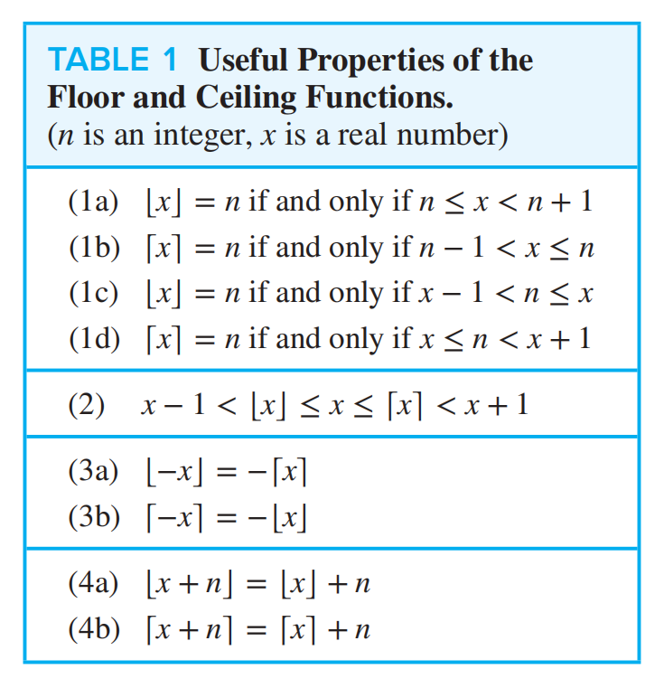

# 离散数学 Chap1–4 中文整理
## Chap1 逻辑与证明

### 命题逻辑

#### 命题

**命题**是一个具有确定真值的陈述句，其真值只能是真或假．通常用 $p,q,r$ 表示命题，用 $T$ 和 $F$ 表示真与假．疑问句、祈使句以及含有未确定变量的开放语句都不是命题．

例如，“$2+3=5$”是真命题，“$7$ 是偶数”是假命题，而“$x>3$”在没有指定 $x$ 时不是命题．

#### 逻辑运算符

设 $p,q$ 为命题．

| 名称 | 符号 | 读法 | 为真的条件 |
| --- | --- | --- | --- |
| 否定 | $\neg p$ | 非 $p$ | $p$ 为假 |
| 合取 | $p\land q$ | $p$ 且 $q$ | 二者都真 |
| 析取 | $p\lor q$ | $p$ 或 $q$ | 至少一个为真 |
| 异或 | $p\oplus q$ | $p$ 异或 $q$ | 恰有一个为真 |
| 条件 | $p\to q$ | 若 $p$ 则 $q$ | 除 $p$ 真且 $q$ 假外均为真 |
| 双条件 | $p\leftrightarrow q$ | $p$ 当且仅当 $q$ | 二者真值相同 |

条件命题 $p\to q$ 中，$p$ 是前件，$q$ 是后件．它的逆命题是 $q\to p$，否命题是 $\neg p\to\neg q$，逆否命题是 $\neg q\to\neg p$．原命题与逆否命题等值，逆命题与否命题等值．

运算优先级通常为：$\neg$、$\land$、$\lor$、$\to$、$\leftrightarrow$．有歧义时应显式加括号．

#### 真值表与位运算

含 $n$ 个命题变元的公式共有 $2^n$ 种真值指派．真值表可用于判定公式是永真式、矛盾式还是可满足式，也可验证两个公式是否逻辑等值．

将 $T,F$ 分别看作位 $1,0$ 后，按位与、按位或、按位异或分别对应 $\land,\lor,\oplus$．因此命题逻辑也能直接描述数字电路．


### 命题逻辑的应用

#### 自然语言翻译

将自然语言翻译为逻辑公式时，先确定原子命题，再识别连接词和作用范围．需要特别注意以下表达．

- “$p$ 仅当 $q$”表示 $p\to q$．
- “$p$ 是 $q$ 的充分条件”表示 $p\to q$．
- “$p$ 是 $q$ 的必要条件”表示 $q\to p$．
- “除非 $p$，否则 $q$”常表示 $\neg p\to q$，等值于 $p\lor q$．

#### 例：系统规格说明

设 $p$ 表示“文件系统已锁定”，$q$ 表示“用户可以写入文件”．规格“若文件系统已锁定，则用户不能写入文件”可写为 $p\to\neg q$．如果另一条规格要求 $p\land q$，则规格集合不可满足，说明系统要求存在冲突．

### 命题等值式与范式

若两个复合命题在每一种真值指派下真值都相同，则称它们**逻辑等值**，记作 $p\equiv q$．常用等值律如下．

| 名称 | 等值式 |
| --- | --- |
| 双重否定律 | $\neg\neg p\equiv p$ |
| 德摩根律 | $\neg(p\land q)\equiv\neg p\lor\neg q$，$\neg(p\lor q)\equiv\neg p\land\neg q$ |
| 蕴含律 | $p\to q\equiv\neg p\lor q$ |
| 逆否律 | $p\to q\equiv\neg q\to\neg p$ |
| 双条件律 | $p\leftrightarrow q\equiv(p\to q)\land(q\to p)$ |
| 分配律 | $p\land(q\lor r)\equiv(p\land q)\lor(p\land r)$ |
| 吸收律 | $p\lor(p\land q)\equiv p$，$p\land(p\lor q)\equiv p$ |

证明等值式常用两种方法：逐步应用已知等值律，或构造真值表比较最终列．

#### 合取范式与析取范式

**文字**是命题变元或其否定．若干文字的析取称为**析取子句**，若干文字的合取称为**合取子句**．

- **合取范式**（CNF）是若干析取子句的合取．
- **析取范式**（DNF）是若干合取子句的析取．
- **主合取范式**中每个极大项都包含所有命题变元．
- **主析取范式**中每个极小项都包含所有命题变元．

从真值表构造主析取范式时，对每一行真值为 $T$ 的指派写一个极小项，再将这些极小项析取．构造主合取范式时，对每一行真值为 $F$ 的指派写一个极大项，再将这些极大项合取．

#### 例：由真值表写主析取范式

若公式仅在 $(p,q)=(T,F)$ 和 $(F,T)$ 时为真，则其主析取范式为

$$
(p\land\neg q)\lor(\neg p\land q)．
$$

### 谓词与量词

包含变量的陈述 $P(x)$ 称为**谓词**．给变量指定值或使用量词约束变量后，谓词才成为命题．

- 全称量词 $\forall x\,P(x)$ 表示论域中每个 $x$ 都满足 $P$．
- 存在量词 $\exists x\,P(x)$ 表示论域中至少有一个 $x$ 满足 $P$．
- 唯一存在量词 $\exists!x\,P(x)$ 表示恰有一个 $x$ 满足 $P$．

有限论域 ${a_1,\dots,a_n}$ 上，有

$$
\forall x\,P(x)\equiv P(a_1)\land\cdots\land P(a_n)，
$$

$$
\exists x\,P(x)\equiv P(a_1)\lor\cdots\lor P(a_n)．
$$

量词的否定遵循德摩根式规律．

$$
\neg\forall x\,P(x)\equiv\exists x\,\neg P(x)，
$$

$$
\neg\exists x\,P(x)\equiv\forall x\,\neg P(x)．
$$

量词嵌套时顺序通常不可交换．例如，$\forall x\exists y\,P(x,y)$ 允许不同的 $x$ 选择不同的 $y$，而 $\exists y\forall x\,P(x,y)$ 要求同一个 $y$ 对所有 $x$ 都成立．

变量在量词辖域内称为**约束变量**，否则称为**自由变量**．不含自由变量的合式公式才具有确定真值．将公式化为**前束范式**时，应先通过换名避免变量捕获，再把量词依次移到公式最前端．

### 推理规则

一个论证由前提和结论构成．若前提全真时结论必真，则论证有效．常用命题逻辑推理规则如下．

| 规则 | 形式 |
| --- | --- |
| 假言推理 | $p,\ p\to q\ \therefore q$ |
| 拒取式 | $\neg q,\ p\to q\ \therefore\neg p$ |
| 假言三段论 | $p\to q,\ q\to r\ \therefore p\to r$ |
| 析取三段论 | $p\lor q,\ \neg p\ \therefore q$ |
| 合取 | $p,q\ \therefore p\land q$ |
| 化简 | $p\land q\ \therefore p$ |
| 附加 | $p\ \therefore p\lor q$ |
| 消解 | $p\lor q,\ \neg p\lor r\ \therefore q\lor r$ |

谓词逻辑还常用全称实例化、全称推广、存在实例化和存在推广．存在实例化时必须引入一个此前未用于其他对象的新符号，以免把“某个对象”错误地当成任意对象．

### 证明方法

#### 直接证明

证明 $p\to q$ 时，假设 $p$ 成立，通过定义、已知定理和代数推导得到 $q$．

#### 例：偶数之和仍为偶数

设 $a=2m,b=2n$，其中 $m,n\in\mathbb Z$．则 $a+b=2(m+n)$，而 $m+n\in\mathbb Z$，所以 $a+b$ 为偶数．

#### 逆否证明

利用 $p\to q\equiv\neg q\to\neg p$，转而证明逆否命题．当结论的否定更容易利用时，这种方法尤其有效．

#### 例：若 $n^2$ 为偶数，则 $n$ 为偶数

证明逆否命题．若 $n$ 为奇数，可写成 $n=2k+1$，则 $n^2=2(2k^2+2k)+1$ 为奇数．因此原命题成立．

#### 反证法

证明命题 $p$ 时，假设 $\neg p$，再推出矛盾 $r\land\neg r$．因此 $\neg p$ 不可能成立，从而 $p$ 成立．

#### 分类讨论与穷举证明

把所有可能情况划分为互斥且完备的若干类，分别证明每一类．有限论域较小时，也可逐一验证所有对象．使用分类讨论时必须确认没有遗漏且各类覆盖全部情况．

#### 存在性与唯一性证明

存在性证明可分为构造性与非构造性两类．构造性证明给出具体对象并验证性质，非构造性证明则通过逻辑或其他定理说明对象必然存在．唯一性证明通常分两步：先证明存在，再假设有两个满足条件的对象并证明它们相等．

#### 常见谬误

- **肯定后件**：由 $p\to q$ 和 $q$ 错误推出 $p$．
- **否定前件**：由 $p\to q$ 和 $\neg p$ 错误推出 $\neg q$．
- **循环论证**：在证明过程中直接或间接使用尚待证明的结论．
- **非法除法**：等式两边除以一个可能为零的表达式．
- **量词顺序混淆**：把 $\forall x\exists y$ 错换成 $\exists y\forall x$．

## Chap2 基本结构

### 集合

**集合**是不同对象组成的无序汇集，对象称为集合的元素．$x\in A$ 表示 $x$ 属于 $A$，$x\notin A$ 表示不属于．集合可用列举法、描述法或集合构造式表示．

$$
A=\{1,2,3\}=\{x\in\mathbb Z\mid 1\le x\le3\}．
$$

常用数集包括自然数集 $\mathbb N$、整数集 $\mathbb Z$、有理数集 $\mathbb Q$、实数集 $\mathbb R$ 和复数集 $\mathbb C$．

#### 子集、真子集与幂集

若 $A$ 的每个元素都属于 $B$，则 $A$ 是 $B$ 的子集，记作 $A\subseteq B$．若 $A\subseteq B$ 且 $A\ne B$，则 $A$ 是 $B$ 的真子集．

空集 $\varnothing$ 不含任何元素，并且是每个集合的子集．集合 $A$ 的所有子集组成的集合称为**幂集**，记作 $\mathcal P(A)$．若 $|A|=n$，则

$$
|\mathcal P(A)|=2^n．
$$

证明两个集合相等，通常证明互相包含，即 $A\subseteq B$ 且 $B\subseteq A$．

#### 笛卡儿积

集合 $A,B$ 的笛卡儿积为

$$
A\times B=\{(a,b)\mid a\in A\land b\in B\}．
$$

一般情况下 $A\times B\ne B\times A$．若 $A,B$ 有限，则 $|A\times B|=|A||B|$．$n$ 个集合的笛卡儿积由有序 $n$ 元组构成．

#### 集合运算

设全集为 $U$．

| 运算 | 记号 | 定义 |
| --- | --- | --- |
| 并集 | $A\cup B$ | $\{x\mid x\in A\lor x\in B\}$ |
| 交集 | $A\cap B$ | $\{x\mid x\in A\land x\in B\}$ |
| 差集 | $A-B$ | $\{x\mid x\in A\land x\notin B\}$ |
| 补集 | $\overline A$ | $U-A$ |
| 对称差 | $A\oplus B$ | $(A-B)\cup(B-A)$ |


常用集合恒等式与命题逻辑的等值律平行，包括交换律、结合律、分配律、吸收律和德摩根律．例如

$$
\overline{A\cup B}=\overline A\cap\overline B，
\qquad
\overline{A\cap B}=\overline A\cup\overline B．
$$

集合恒等式可用互相包含、集合构造式逐元素推导、成员表或文氏图证明．其中逐元素证明最适合形式化书写．

#### 容斥与加法原理

对有限集合 $A,B$，有

$$
|A\cup B|=|A|+|B|-|A\cap B|．
$$

若 $A\cap B=\varnothing$，则 $|A\cup B|=|A|+|B|$，这就是计数中的加法原理．

#### 用位串表示集合

给定有限全集 $U=\{u_1,\dots,u_n\}$，集合 $A\subseteq U$ 可表示为长度为 $n$ 的位串，其中第 $i$ 位为 $1$ 当且仅当 $u_i\in A$．于是交、并、补分别对应位与、位或、位非．

#### 多重集合与基数

多重集合允许同一个元素出现多次，元素 $x$ 的出现次数称为其重数．普通有限集合的**基数**是不同元素的个数，记作 $|A|$．

集合是**可数的**，如果它是有限集，或能与自然数集建立双射．有理数集可数，实数集不可数．康托尔对角线法通过构造一个与列表中每个实数都不同的新实数，证明区间 $(0,1)$ 不可数．

### 函数

函数 $f:A\to B$ 把定义域 $A$ 中每个元素恰好映射到陪域 $B$ 中一个元素．$f(a)$ 称为 $a$ 的像．像的集合

$$
f(A)=\{f(a)\mid a\in A\}
$$

称为值域，值域总是陪域的子集．

#### 单射、满射与双射

- **单射**：$f(a)=f(b)\Rightarrow a=b$，不同输入不会得到相同输出．
- **满射**：对每个 $y\in B$，都存在 $x\in A$ 使 $f(x)=y$．
- **双射**：同时为单射和满射．


有限集合之间存在双射当且仅当它们基数相等．双射函数才存在逆函数 $f^{-1}:B\to A$，且

$$
f^{-1}\circ f=I_A，\qquad f\circ f^{-1}=I_B．
$$

#### 函数复合

若 $f:A\to B$ 且 $g:B\to C$，则

$$
(g\circ f)(x)=g(f(x))．
$$

函数复合满足结合律，但通常不满足交换律．若 $f,g$ 都是单射、满射或双射，则 $g\circ f$ 也分别具有相应性质．

#### 常用特殊函数

下取整 $\lfloor x\rfloor$ 是不超过 $x$ 的最大整数，上取整 $\lceil x\rceil$ 是不小于 $x$ 的最小整数．它们满足

$$
\lfloor x\rfloor\le x<\lfloor x\rfloor+1，
\qquad
\lceil x\rceil-1<x\le\lceil x\rceil．
$$



阶乘函数定义为 $n!=1\cdot2\cdots n$，并规定 $0!=1$．集合 $A$ 的特征函数为

$$
\chi_A(x)=
\begin{cases}
1,&x\in A，\\
0,&x\notin A．
\end{cases}
$$

模 $n$ 函数将整数 $x$ 映射为 $x\bmod n$．偏函数允许定义域中的某些输入没有函数值，但在其实际定义域上仍必须保持单值性．

### 序列与求和

序列是以整数子集为定义域的函数，通常记作 $\{a_n\}$．

- 等差数列：$a_n=a_1+(n-1)d$．
- 等比数列：$a_n=a_1r^{n-1}$．

**递推关系**用前面的项定义后面的项，必须配合足够的初始条件才能唯一确定序列．**闭式公式**则直接用 $n$ 表示 $a_n$．通过反复代入递推关系可以猜测闭式，再用数学归纳法证明．

常用求和公式如下．

$$
\sum_{k=1}^{n}k=\frac{n(n+1)}2，
\qquad
\sum_{k=1}^{n}k^2=\frac{n(n+1)(2n+1)}6，
$$

$$
\sum_{k=0}^{n}r^k=
\begin{cases}
\dfrac{r^{n+1}-1}{r-1},&r\ne1，\\
n+1,&r=1．
\end{cases}
$$

处理求和时可利用线性性质、变换下标、拆分区间以及交换有限重求和的顺序．

### 矩阵与零一矩阵

$m\times n$ 矩阵是按 $m$ 行 $n$ 列排列的元素表．矩阵加法按元素进行，矩阵乘法定义为

$$
(AB)_{ij}=\sum_k a_{ik}b_{kj}．
$$

矩阵乘法满足结合律和分配律，但通常不满足交换律．零一矩阵仅含 $0,1$，可用于表示关系与图．若把普通加法和乘法替换为逻辑或与逻辑与，就得到布尔矩阵运算．

## Chap3 算法与复杂度

### 算法

**算法**是按照有限步骤解决一类问题的明确过程．一个良好算法通常具有输入、输出、确定性、正确性、有限性、有效性、一般性与效率等特征．

伪代码不要求固定语法，但应让读者无歧义地理解赋值、条件、循环、过程调用与返回值．赋值常写为 `x := expression`，判断相等则写为 `x = y`．

#### 例：求列表最大值

```text
procedure maximum(a1, a2, ..., an: integers)
    v := a1
    for i := 2 to n
        if ai > v then v := ai
    return v
```

#### 例：二分查找

```text
procedure binary_search(x, a1, a2, ..., an: ordered integers)
    left := 1
    right := n
    while left <= right
        mid := floor((left + right) / 2)
        if x = amid then return mid
        if x < amid then right := mid - 1
        else left := mid + 1
    return 0
```

基本算法策略包括线性查找、二分查找、冒泡排序、插入排序和贪心算法等．证明算法正确性时，常使用循环不变式：证明不变式在循环前成立，每轮迭代保持成立，并结合终止条件推出算法结果正确．

### 函数的渐进式增长

渐进分析研究输入规模 $n$ 足够大时资源消耗如何增长．比较算法时通常忽略低阶项和常数因子，从而突出增长率．

#### Big-O：渐进上界

设 $f,g$ 的定义域为自然数或实数，值域为实数．若存在常数 $c>0$ 和 $k$，使所有 $n>k$ 都满足

$$
|f(n)|\le c|g(n)|，
$$

则称 $f(n)\in O(g(n))$．常数 $c,k$ 称为该关系的见证．

#### 例：证明 $n^2+1\in O(n^2)$

当 $n>1$ 时，$n^2+1\le2n^2$．取 $c=2,k=1$ 即可．注意见证不唯一，只需给出一组有效取值．

证明多项式的 Big-O 时，可让每个低次项都由最高次项控制．例如当 $n\ge1$ 时，$3n^3+5n+7\le15n^3$，故它属于 $O(n^3)$．

#### Big-Omega：渐进下界

若存在常数 $c>0$ 和 $k$，使所有 $n>k$ 都满足

$$
|f(n)|\ge c|g(n)|，
$$

则称 $f(n)\in\Omega(g(n))$．它等价于 $g(n)\in O(f(n))$．

#### Big-Theta：紧确渐进界

若 $f(n)$ 同时属于 $O(g(n))$ 和 $\Omega(g(n))$，则

$$
f(n)\in\Theta(g(n))．
$$

等价地，存在 $c_1,c_2>0$ 和 $k$，使 $n>k$ 时

$$
c_1|g(n)|\le|f(n)|\le c_2|g(n)|．
$$

若 $f(n)=a_dn^d+\cdots+a_0$ 且 $a_d\ne0$，则 $f(n)\in\Theta(n^d)$．例如

$$
\sum_{i=1}^{n}i=\frac{n(n+1)}2\in\Theta(n^2)．
$$

<details>
  <summary>拓展：Little-o 与 Little-omega</summary>

$f(n)\in o(g(n))$ 表示 $f$ 的增长严格慢于 $g$．常用判据是

$$
\lim_{n\to\infty}\frac{f(n)}{g(n)}=0．
$$

对称地，$f(n)\in\omega(g(n))$ 表示 $f$ 的增长严格快于 $g$．

</details>

#### 增长率顺序

典型增长率从慢到快排列如下，其中常数 $a>1$．

$$
1\prec\log\log n\prec\log n\prec(\log n)^c\prec n
\prec n\log n\prec n^2\prec n^3\prec a^n\prec n!\prec n^n．
$$

任意固定次数的对数慢于任意正次数的幂函数，任意多项式慢于底数大于 $1$ 的指数函数，而固定底数的指数函数又慢于阶乘．对数底数只相差常数因子，因此在渐进记号中通常省略底数．

若 $f_1\in O(g_1)$ 且 $f_2\in O(g_2)$，则

$$
f_1+f_2\in O(\max\{g_1,g_2\})，
\qquad
f_1f_2\in O(g_1g_2)．
$$

### 算法复杂度

算法复杂度衡量计算所需资源．时间复杂度通常统计基本操作次数，空间复杂度通常统计额外存储量，并都表示为输入长度 $n$ 的函数．

- 最坏情况复杂度是在规模为 $n$ 的所有输入中取最大代价．
- 最好情况复杂度是在规模为 $n$ 的所有输入中取最小代价．
- 平均情况复杂度依赖输入的概率分布．

分析简单伪代码时，顺序语句的代价相加，条件语句取各分支的上界，单层循环用迭代次数乘以循环体代价，嵌套循环则形成嵌套求和．

| 算法 | 最好情况 | 最坏情况 | 说明 |
| --- | --- | --- | --- |
| 列表最大值 | $\Theta(n)$ | $\Theta(n)$ | 必须检查每个元素 |
| 线性查找 | $\Theta(1)$ | $\Theta(n)$ | 逐项比较 |
| 二分查找 | $\Theta(1)$ | $\Theta(\log n)$ | 每轮将区间减半 |
| 冒泡排序 | $\Theta(n)$ 或 $\Theta(n^2)$ | $\Theta(n^2)$ | 取决于是否有提前终止优化 |

#### 问题复杂度

计算问题的复杂度是解决该问题的最佳可能算法的增长阶．一个已知算法给出问题复杂度的上界，而证明不存在更快算法则需要建立下界．例如二分查找说明有序数组查找属于 $O(\log n)$，比较决策树还能证明其最坏情况需要 $\Omega(\log n)$ 次比较，因此比较模型下为 $\Theta(\log n)$．

通常把可在多项式时间内解决的问题称为**可处理问题**，但多项式与非多项式的边界是理论分类，并不完全代表工程上的可用性．

<details>
  <summary>拓展：P、NP、NP-complete 与 NP-hard</summary>

**P** 是可由确定性算法在多项式时间内解决的判定问题类．**NP** 是给定候选解后可在多项式时间内验证的判定问题类，已知 $P\subseteq NP$，但 $P=NP$ 是否成立仍是公开问题．

**NP-complete** 问题既属于 NP，又满足 NP 中每个问题都能在多项式时间内归约到它．若任一 NP-complete 问题存在多项式时间算法，则 $P=NP$．**NP-hard** 问题至少与 NP 中所有问题一样困难，但它未必属于 NP，也未必是判定问题．

</details>

<details>
  <summary>拓展：图灵机停机问题</summary>

停机问题询问是否存在一个算法，能对任意程序 $P$ 和输入 $I$ 判断 $P(I)$ 最终会不会停止．反证思路是先假设判定器 $H(P,I)$ 存在，再构造程序 $K(P)$：若 $H(P,P)$ 判断会停止，$K(P)$ 就无限循环；若判断不会停止，$K(P)$ 就立即停止．运行 $K(K)$ 后，两种判断都会与实际行为矛盾，因此不存在这样的通用判定器．

</details>

## Chap4 数论

### 整除与模运算

#### 整除

设 $a,b\in\mathbb Z$ 且 $a\ne0$．若存在 $c\in\mathbb Z$ 使 $b=ac$，则称 $a$ 整除 $b$，记作 $a\mid b$．此时 $a$ 是 $b$ 的因数，$b$ 是 $a$ 的倍数．

若 $a\mid b$ 且 $a\mid c$，则对任意 $m,n\in\mathbb Z$，都有

$$
a\mid(mb+nc)．
$$

此外，整除关系具有传递性：若 $a\mid b$ 且 $b\mid c$，则 $a\mid c$．

#### 带余除法定理

对任意整数 $a$ 和非零整数 $d$，存在唯一整数 $q,r$ 使

$$
a=dq+r，\qquad0\le r<|d|．
$$

$q$ 是商，$r$ 是余数，分别记作 $a\operatorname{ div }d$ 和 $a\bmod d$．例如 $-11=3(-4)+1$，所以 $-11\bmod3=1$．

#### 同余

设 $m\in\mathbb Z^+$．若 $m\mid(a-b)$，则称 $a$ 与 $b$ 模 $m$ 同余，记作

$$
a\equiv b\pmod m．
$$

这等价于 $a\bmod m=b\bmod m$．同余关系是等价关系，并与加法和乘法相容．若 $a\equiv b\pmod m$ 且 $c\equiv d\pmod m$，则

$$
a+c\equiv b+d\pmod m，\qquad ac\equiv bd\pmod m．
$$

但同余式不能随意约去公因子．由 $ac\equiv bc\pmod m$ 推出 $a\equiv b\pmod m$ 需要 $\gcd(c,m)=1$，或相应地调整模数．

### 整数表示与算法

#### $b$ 进制表示

对正整数 $n$ 和 $b>1$，存在唯一数字 $a_k,\dots,a_0$，其中 $0\le a_i<b$，使

$$
n=\sum_{i=0}^{k}a_ib^i．
$$

记作 $n=(a_ka_{k-1}\cdots a_0)_b$．把十进制整数转换为 $b$ 进制时，反复除以 $b$，依次记录余数，再从最后一个余数倒序读出．

```text
procedure base_b_expansion(n, b)
    q := n
    digits := empty list
    while q != 0
        append (q mod b) to digits
        q := q div b
    return reverse(digits)
```

#### 整数运算

二进制加法逐位计算和与进位．若当前位为 $a_i,b_i$，进位为 $c$，则输出位是 $(a_i+b_i+c)\bmod2$，新进位是 $(a_i+b_i+c)\operatorname{ div }2$．二进制乘法可按乘数中为 $1$ 的位，将被乘数左移相应位数后累加．

#### 模幂算法

直接计算 $b^n$ 会产生巨大中间结果．平方求幂法始终在模 $m$ 下计算，只需 $O(\log n)$ 次乘法．

```text
procedure modular_exp(b, n, m)
    result := 1
    power := b mod m
    while n > 0
        if n mod 2 = 1 then result := (result * power) mod m
        power := (power * power) mod m
        n := n div 2
    return result
```

算法的不变式可写为 $\text{result}\cdot\text{power}^{n}\equiv b^{n_0}\pmod m$，其中 $n_0$ 是原指数．

<details>
  <summary>补充：RSA 加密应用</summary>

RSA 选取大素数 $p,q$，令 $N=pq$，并选取与 $\varphi(N)=(p-1)(q-1)$ 互素的 $e$．求 $d$ 满足 $ed\equiv1\pmod{\varphi(N)}$．公钥为 $(e,N)$，私钥为 $d$，加密与解密分别计算 $C\equiv M^e\pmod N$ 和 $M\equiv C^d\pmod N$．RSA 是模幂与模逆的应用，不作为本章理论主线展开．

</details>

### 素数、最大公因数与最小公倍数

#### 素数

大于 $1$ 且正因数只有 $1$ 和自身的整数称为**素数**，大于 $1$ 但不是素数的整数称为**合数**．

#### 定理：算术基本定理

每个大于 $1$ 的整数都能唯一表示为素数的乘积，若不考虑素因子的排列顺序，则该分解唯一．

若 $n$ 是合数，则 $n$ 至少有一个不超过 $\sqrt n$ 的素因子．因此试除法判断 $n$ 是否为素数时，只需检查不超过 $\sqrt n$ 的素数．

#### 例：判断 $101$ 是否为素数

因为 $\sqrt{101}<11$，只需检查素数 $2,3,5,7$．$101$ 不被它们中的任何一个整除，因此 $101$ 是素数．

素数有无穷多个．经典反证法假设全部素数为 $p_1,\dots,p_n$，构造 $N=p_1p_2\cdots p_n+1$．$N$ 除以列表中任一素数余数都为 $1$，所以 $N$ 含有不在列表中的素因子，产生矛盾．

#### GCD 与 LCM

对不全为零的整数 $a,b$，最大公因数记作 $\gcd(a,b)$．最小的正公倍数记作 $\operatorname{lcm}(a,b)$．若

$$
a=\prod_i p_i^{\alpha_i}，\qquad b=\prod_i p_i^{\beta_i}，
$$

则

$$
\gcd(a,b)=\prod_i p_i^{\min(\alpha_i,\beta_i)}，
\qquad
\operatorname{lcm}(a,b)=\prod_i p_i^{\max(\alpha_i,\beta_i)}．
$$

对正整数 $a,b$，有

$$
ab=\gcd(a,b)\operatorname{lcm}(a,b)．
$$

若 $\gcd(a,b)=1$，则称 $a,b$ 互素．若一个整数集合中任意两个不同元素都互素，则称它们两两互素．

#### 欧几里得算法

欧几里得算法基于恒等式

$$
\gcd(a,b)=\gcd(b,a\bmod b)．
$$

```text
procedure gcd(a, b)
    while b != 0
        r := a mod b
        a := b
        b := r
    return a
```

最后一个非零余数就是最大公因数．例如

$$
\begin{aligned}
\gcd(372,164)
&=\gcd(164,44)=\gcd(44,32)\\
&=\gcd(32,12)=\gcd(12,8)\\
&=\gcd(8,4)=4．
\end{aligned}
$$

#### 贝祖定理与扩展欧几里得算法

若 $a,b$ 不全为零，则存在整数 $s,t$ 使

$$
\gcd(a,b)=sa+tb．
$$

$s,t$ 称为贝祖系数．用欧几里得算法求出最大公因数后，从最后一个非零余数开始逐层回代，即可求得贝祖系数．

#### 例：求 $252$ 与 $198$ 的贝祖系数

欧几里得算法给出

$$
252=198+54，\quad198=3\cdot54+36，\quad54=36+18．
$$

反向代入可得

$$
18=54-36=4\cdot54-198=4\cdot252-5\cdot198．
$$

贝祖定理可推出：若 $\gcd(a,b)=1$ 且 $a\mid bc$，则 $a\mid c$．若素数 $p\mid a_1a_2\cdots a_n$，则 $p$ 至少整除其中一个因子．

### 线性同余与中国剩余定理

#### 模逆

若

$$
a\bar a\equiv1\pmod m，
$$

则称 $\bar a$ 为 $a$ 模 $m$ 的逆元．逆元存在当且仅当 $\gcd(a,m)=1$，存在时模 $m$ 唯一．证明来自贝祖等式 $sa+tm=1$，取模后得到 $sa\equiv1\pmod m$．

#### 线性同余

形如

$$
ax\equiv b\pmod m
$$

的式子称为线性同余．设 $d=\gcd(a,m)$．

- 若 $d\nmid b$，则无解．
- 若 $d\mid b$，则模 $m$ 恰有 $d$ 个互不同余的解．
- 特别地，若 $d=1$，则 $x\equiv a^{-1}b\pmod m$，解模 $m$ 唯一．

一般情形可先把 $a,b,m$ 同除以 $d$，求出模 $m/d$ 的唯一解，再写出模 $m$ 下的 $d$ 个解．

#### 中国剩余定理

设 $m_1,\dots,m_n>1$ 两两互素．同余方程组

$$
\begin{cases}
x\equiv a_1\pmod{m_1}，\\
\cdots\\
x\equiv a_n\pmod{m_n}
\end{cases}
$$

在模 $M=m_1m_2\cdots m_n$ 意义下有唯一解．令 $M_k=M/m_k$，求 $y_k$ 满足 $M_ky_k\equiv1\pmod{m_k}$，则

$$
x\equiv\sum_{k=1}^{n}a_kM_ky_k\pmod M．
$$

每个 $M_ky_k$ 对模 $m_k$ 同余于 $1$，对其他模数同余于 $0$，因此它像一组“选择器”，只保留对应的余数条件．

#### 例：孙子问题

求解

$$
x\equiv2\pmod3，\qquad x\equiv3\pmod5，\qquad x\equiv2\pmod7．
$$

$M=105$，并有 $M_1=35,M_2=21,M_3=15$．对应逆元可取 $y_1=2,y_2=1,y_3=1$．因此

$$
x\equiv2\cdot35\cdot2+3\cdot21+2\cdot15
\equiv233\equiv23\pmod{105}．
$$

中国剩余定理也说明，$0\le a<M$ 的整数可由余数组

$$
(a\bmod m_1,\dots,a\bmod m_n)
$$

唯一表示，并可在各个模数下并行计算．

<details>
  <summary>补充：CRT 加速 RSA</summary>

当 RSA 模数 $N=pq$ 时，可分别计算 $C^d\bmod p$ 与 $C^d\bmod q$，再用中国剩余定理合并．两个较小模数上的运算通常比直接模 $N$ 运算更快，并且可以并行执行．

</details>

### 费马小定理、伪素数与离散对数

#### 费马小定理

若 $p$ 为素数且 $p\nmid a$，则

$$
a^{p-1}\equiv1\pmod p．
$$

因此 $a^{p-2}$ 是 $a$ 模 $p$ 的逆元．计算大指数模幂时，可先利用 $a^{p-1}\equiv1$ 化简指数，再用平方求幂法计算．

#### 伪素数

若合数 $n$ 满足

$$
b^{n-1}\equiv1\pmod n，
$$

则称 $n$ 是以 $b$ 为底的伪素数．例如 $341=11\cdot31$，但 $2^{340}\equiv1\pmod{341}$，所以仅通过一次费马检验不能保证一个数是素数．

<details>
  <summary>补充：Carmichael Numbers</summary>

Carmichael 数是满足如下性质的合数 $n$：对每个与 $n$ 互素的正整数 $b$，都有 $b^{n-1}\equiv1\pmod n$．经典例子是 $561=3\cdot11\cdot17$．它会欺骗所有与 $561$ 互素底数的费马检验，因此实际素性测试需要更可靠的方法．

</details>

#### 原根

设 $p$ 为素数．若 $r$ 的幂在模 $p$ 下遍历所有非零剩余类，即

$$
\{r^1,r^2,\dots,r^{p-1}\}\equiv\{1,2,\dots,p-1\}\pmod p，
$$

则称 $r$ 是模 $p$ 的原根．等价地，$r$ 模 $p$ 的乘法阶为 $p-1$．

#### 例：模 $11$ 的原根

$2$ 的幂模 $11$ 依次得到 $2,4,8,5,10,9,7,3,6,1$，恰好遍历所有非零剩余类，所以 $2$ 是模 $11$ 的原根．

#### 离散对数

设 $r$ 是模素数 $p$ 的原根．对任意 $a\not\equiv0\pmod p$，存在指数 $e$ 使

$$
r^e\equiv a\pmod p．
$$

该指数在模 $p-1$ 意义下唯一，称为 $a$ 以 $r$ 为底的模 $p$ 离散对数．例如 $2^8\equiv3\pmod{11}$，所以 $\log_2 3\equiv8\pmod{10}$．

<details>
  <summary>补充：离散对数的密码学应用</summary>

已知 $r,e,p$ 时计算 $r^e\bmod p$ 很高效，但在适当参数下，从 $r^e\bmod p$ 反求 $e$ 被认为很困难．Diffie–Hellman 密钥交换与 ElGamal 等密码方案利用了这种计算上的不对称性．此处只说明其与数论概念的联系，不展开协议细节．

</details>

## 复习路线

1. 先掌握命题等值、量词否定和基本推理规则，再练习直接证明、逆否证明与反证法．
2. 用集合的逐元素证明巩固逻辑语言，并掌握单射、满射、双射和函数复合．
3. 熟记 $O$、$\Omega$、$\Theta$ 的量词定义，通过找见证与循环计数完成复杂度分析．
4. 按“带余除法 → 欧几里得算法 → 贝祖定理 → 模逆 → 线性同余 → CRT”的依赖顺序学习数论．
5. 最后串联费马小定理、伪素数、原根与离散对数，区分核心定理和密码学应用．
