# Chap1 The Foundations: Logic and Proofs

## Propositional Logic
### Propositions
**proposition**(命题): A declarative sentence that is either true or false.

propositional variables(命题变量): Variables that represent propositions, usually letters like $p,q,r,s$.

atomic proposition(原子命题): Propositions that cannot be expressed by simpler propositions.

compound proposition(复合命题): Propositions that formed from existing propositions using logical operators.
### Logical Operators
#### Operators
**negation**(not, 否定): $\neg p$.

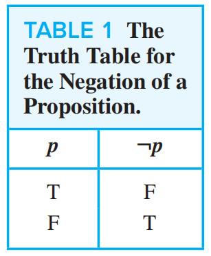

**conjunction**(and, 合取): $p\wedge q$.

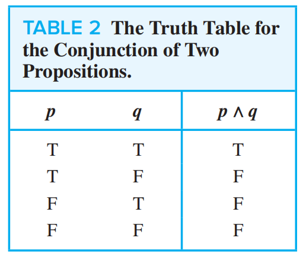

**disjunction**(inclusive or, 析取): $p\vee q$.

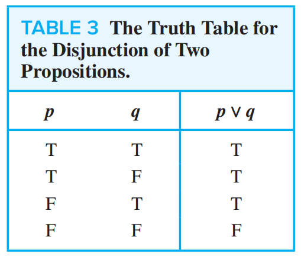

**XOR**(exclusive or, 异或): $p\oplus q$.

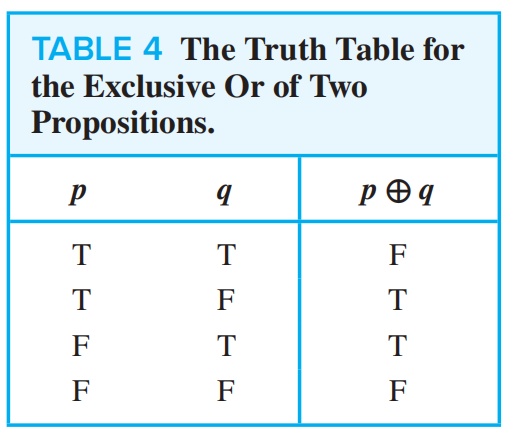

???+ tip "Supplement"

	**NOR**(not or, 或非): $p \downarrow q \equiv \neg(p \vee q)$.
	
	**NAND**(not and, 与非): $p \mid q \equiv \neg(p \wedge q)$.

**conditional statement**(implication, 蕴含): $p\to q$ .

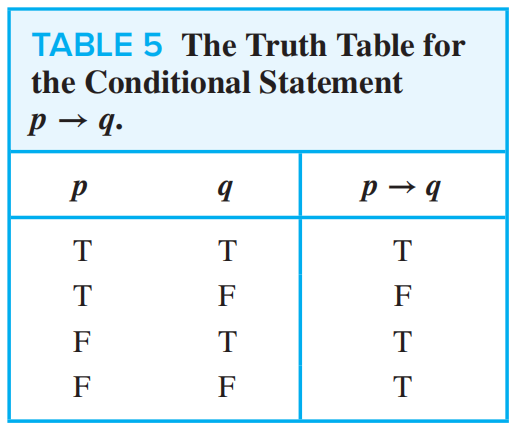

The statement p is called the **hypothesis**(假设), q is called the **conclusion**(结论).

!!! info "Related Conditional Statements"

	+ converse(逆命题): $q\to p$
	+ inverse(否命题): $\neg p\to\neg q$
	+ contrapositive(逆否命题): $\neg q \to \neg p$

!!! abstract "Equivalent Forms in English"

	

	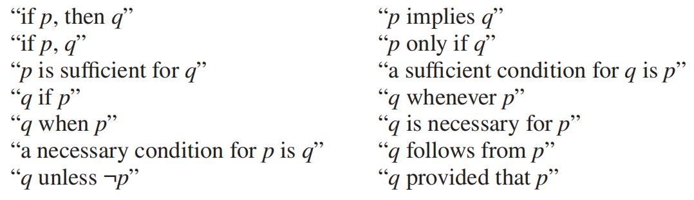
	

	
	**Implication Law**: $p\to q\equiv \neg p \vee q$

**biconditional**(equivalence, 等价): $p\leftrightarrow q$​.

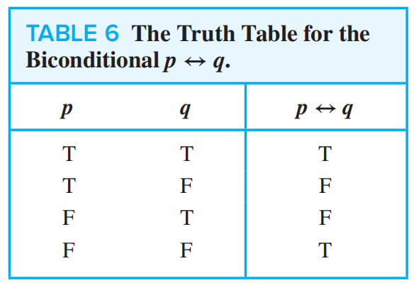

#### Precedence

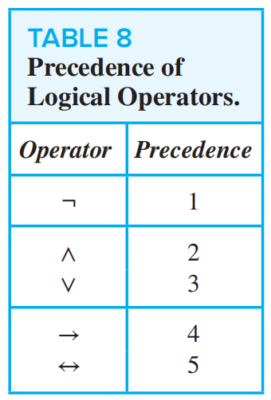

#### Bit Expression
**bit**: A binary digit 0 (false) or 1 (true). 

boolean variable: A variable whose value is either true or false. A boolean variable can be represented by a bit.

bit string: A sequence of bits. The length of bit string is the number of bits.

bit operations: Logical operations used on bits. Bitwise operations are bit operations used on strings with same length and operate for their every bit.

+ bitwise OR
+ bitwise AND
+ bitwise XOR

## Applications of Propositional Logic
### Translating English Sentences
1. Identify atomic propositions and represent using propositional variables.
2. Determine appropriate logical connectives.

### System Specifications
**consistency**: A list of proposition is consistent if it is possible to assign truth values to the proposition variables so that each proposition is true.

### Logical Circuit
Propositional logic can be applied to the design of computer hardware. 

Logic circuit or digital circuit receives input signals and produces output signals.

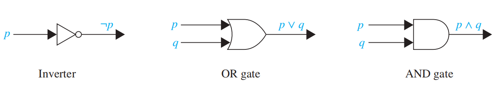
## Propositional Equivalences
### Logical Equivalences
**tautology**(永真式/重言式): A compound proposition that is always true.

**contradiction**(永假式/矛盾式): A compound proposition that is always false.

**contingency**(偶真式): A compound proposition that is neither a tautology nor a contradiction.

The compound propositions $p$ and $q$ are called **logically equivalent** if $p\leftrightarrow q$ is a tautology, noted by $p\equiv q$.

!!! note "Important Logical Equivalences"

	Exclusive OR:
	
	+ $p\oplus q\equiv(p\vee q)\wedge\neg(p \wedge q)$
	+ $p\oplus q\equiv(p \wedge \neg q)\vee (\neg p\wedge q)$
	
		

		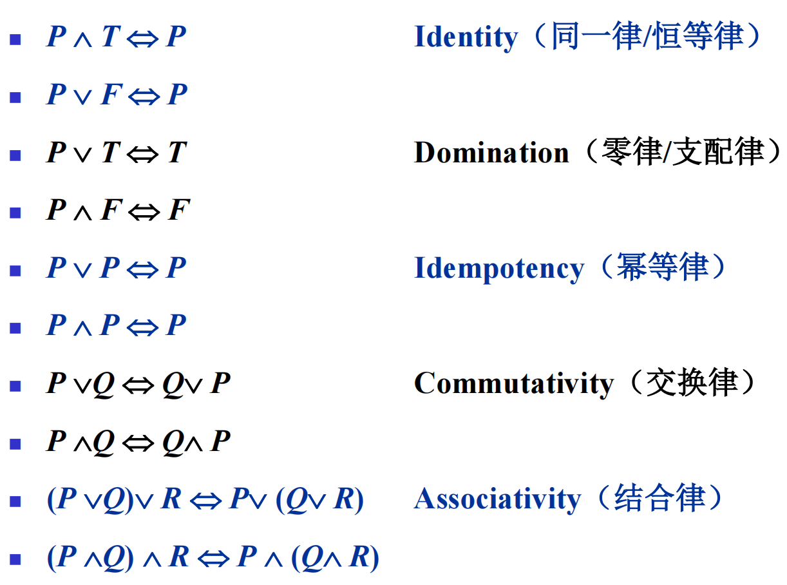
		

		
		

		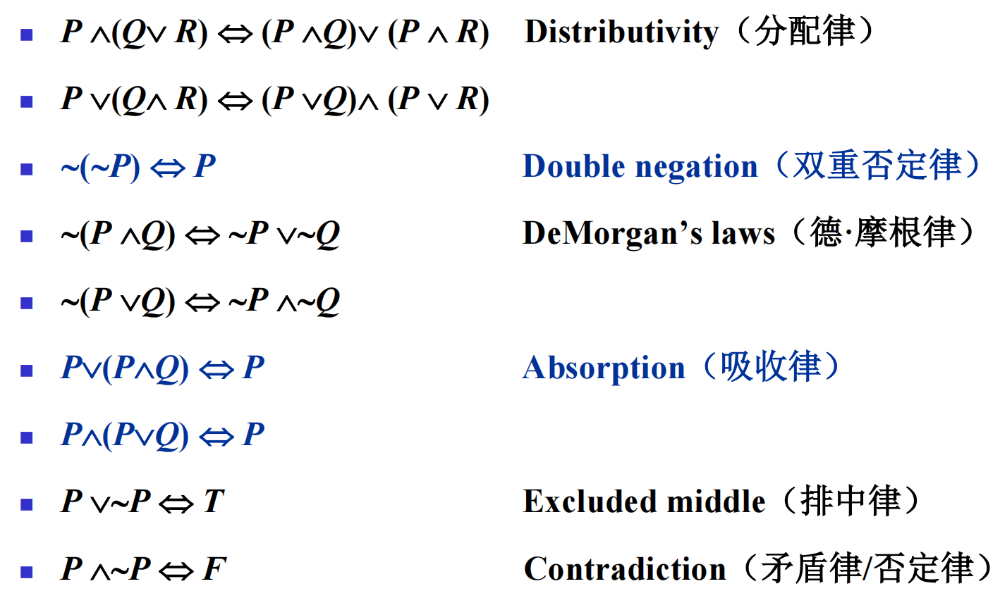
		

		
		

		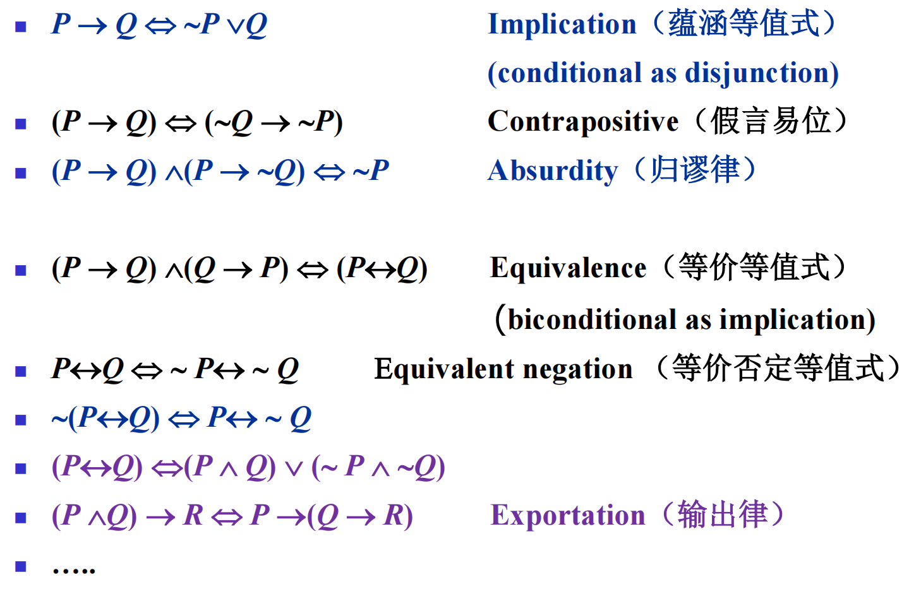
		

### Using De Morgan’s Laws
De Morgan's Laws:

+ $\neg(p\wedge q)\equiv\neg p \vee \neg q$
+ $\neg(p\vee q)\equiv\neg p \wedge \neg q$

Extension:

+ $\neg(\bigvee_{i=1}^{n}p_{i})=\bigwedge_{i=1}^{n}\neg p_{i}$
+ $\neg(\bigwedge_{i=1}^{n}p_{i})=\bigvee_{i=1}^{n}\neg p_{i}$

### Satisfiability
**Satisfiability**: A compound proposition is satisfiable if there is an assignment of truth values to its variables that makes it true (like consistency).

> satisfiability = contingency + tautology

### 范式
<!-- **Simple Disjunction**/Basic Sum(简单析取式): A disjunction with finite proposition variables or their negation.

+ $\neg P \vee Q \vee R$, $\neg P \vee P$.

**Simple Conjunction**/Basic Product(简单合取式): A conjunction with finite proposition variables or their negation.

+ $\neg Q \wedge R \wedge Q$, $\neg P \wedge P$.

**Disjunctive Normal Form**/DNF(析取范式): A disjunction with finite simple conjunctions.

+ $P\vee (P\wedge Q)\vee(\neg P\wedge \neg Q\wedge \neg R)$, $P\vee Q\vee R$.

**Conjunctive Normal Form**/CNF(合取范式): A conjunction with finite simple disjunctions.

+ $(P \vee Q) \wedge \neg Q \wedge (Q \vee \neg R \vee S)$, $P \wedge Q \wedge R$.

!!! quote "Existence Theorem of Normal Forms(范式存在性定理)"

	For any propositional formula, there exists an equivalent formula in **Disjunctive Normal Form (DNF)** and an equivalent formula in **Conjunctive Normal Form (CNF)**.
	
	Steps:
	
	1. Elimination of $\to$ and $\leftrightarrow$: Replace $P\to Q$ with $\neg P \vee Q$, $P\leftrightarrow Q$ with $(P\to Q)\wedge(Q \to P)$.
	2. De Morgan's Laws: Move negations inward so they only apply to atomic variables.
	3. Double Negation Law: Replace $\neg \neg P$ with $P$.
	4. Distributive Laws: 
	   
	  	+ To get DNF, Distribute $\wedge$ over $\vee$: $P\wedge (Q \vee R)\equiv (P \wedge Q) \vee(P \wedge R)$ 
		+ To get CNF, Distribute $\vee$ over $\wedge$: $P\vee (Q \wedge R)\equiv (P \vee Q) \wedge(P \vee R)$  

**The problem**: DNF/CNF are not unique.

**Minterm**(极小项): A minterm of $n$ variables is a **conjunction** of all $n$ variables, where each variable appears exactly once in either its direct form $P$ or its negation $\neg P$.

???+ example "Example"

	For $P,Q,R$ in a formula:
	
	+ $P \wedge Q \wedge\neg R$ is minterm.
	+ $P \wedge Q$ is not minterm, because $R$ is excluded.
	+ $P \wedge Q \wedge R \wedge \neg P$ is not minterm, because $P$ appears twice.

A minterm evaluates to True for **exactly one** combination of variable assignment, and evaluates to False for other $2^{n}-1$ combinations.

Minterms are conventionally denoted by $m_i$, where the subscript $i$ is the decimal equivalent of the binary string formed by the variables.

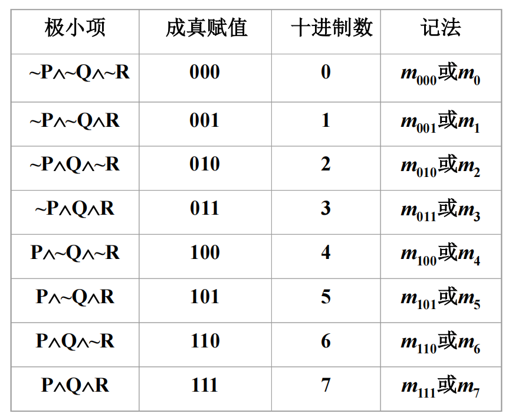

**Principle DNF**(主析取范式): A disjunction of minterms.

+ $(P\wedge Q)\vee(\neg P \wedge R)$ is DNF, but not PDNF.
+ $(P \wedge Q \wedge \neg R)\vee(\neg P \wedge Q \wedge Q)$ is PDNF, also DNF.

!!! quote "Theorem"

	For any propositional formula, there exists a unique equivalent PDNF.
	
	A PDNF of a proportional formula is the **disjunction** of the **minterms** that correspond to the rows where the formula evaluates to **True**.
	
	> How to construct PDNF?
	
	Method 1: The Truth Table Method 
	
	1. Construct the complete truth table for the formula.
	2. Write the minterm for each true rows.
	3. Connect the minterms with disjunction.
	
	

	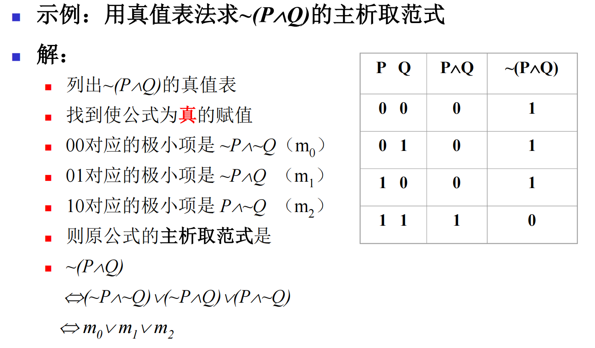
	

	
	Method 2: The Equivalence Calculus Method
	
	1. Transform the formula into DNF
	2. If a simple conjunction is missing a variable (say $R$), multiply it by a tautology($R \vee \neg R$), then expand it using the Distributive law.
	3. Remove duplicate minterms using the Idempotent law($A \vee A \equiv A$).
	
	

	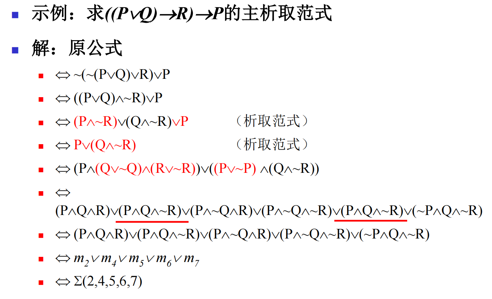
	

**Maxterm**(极大项): A maxterm of $n$ variables is a **disjunction** of all $n$ variables, where each variable appears exactly once in either its direct form $P$ or its negation $\neg P$.

A maxterm evaluates to False for **exactly one** combination of variable assignments, and evaluates to True for the other $2^n - 1$ combinations. 

Maxterms are conventionally denoted by $M_i$. The subscript $i$ is the decimal equivalent of the binary string. The binary string should make the propositional formula false.

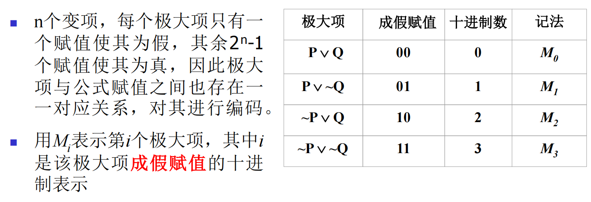

**Principle CNF**(主合取范式): A conjunction of maxterms.

!!! quote "Theorem"

	For any propositional formula, there exists a unique equivalent CDNF.
	
	The PCNF of a propositional formula is the **conjunction** of the **maxterms** that correspond to the rows where the formula evaluates to **False**.
	
	> How to construct PCNF?
	
	Method 1: The Truth Table Method 
	
	1. Construct the complete truth table for the formula.
	2. Write the maxterm for each false rows.
	3. Connect the maxterms with conjunction.
	
	

	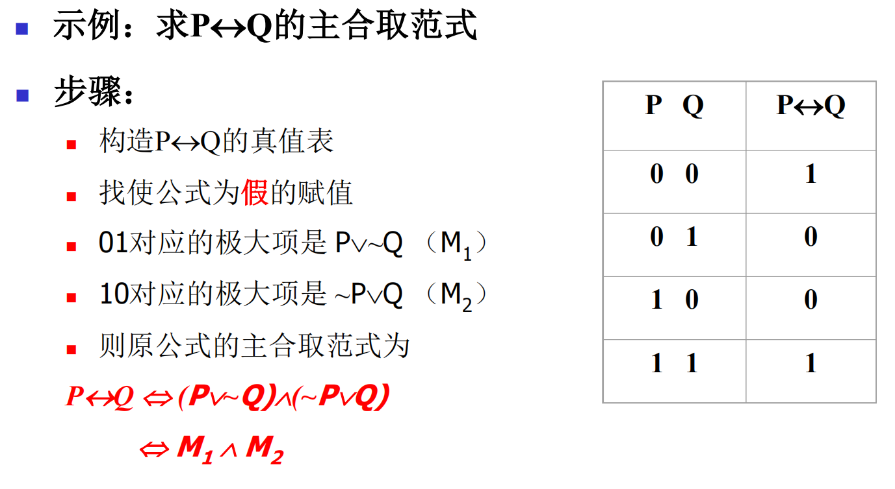
	

	
	Method 2: The Equivalence Calculus Method
	
	1. Transform the formula into CNF
	2. If a simple disjunction is missing a variable (say $R$), multiply it by a contradiction($R \wedge \neg R$), then expand it using the Distributive law.
	3. Remove duplicate maxterms using the Idempotent law($A \wedge A \equiv A$).
	
	

	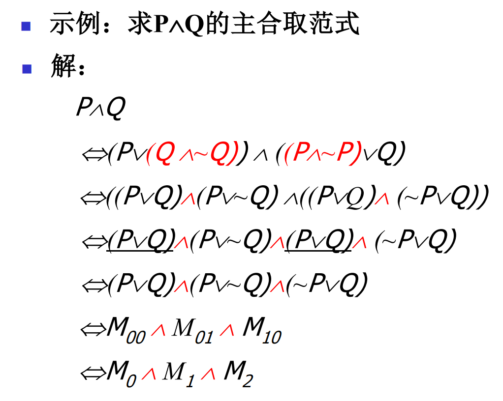
	
 -->

**简单析取式/基本和**: 仅由有限个命题变元或其否定的**析取**构成的析取式．

+ $\neg P \vee Q \vee R$, $\neg P \vee P$.

**简单合取式/基本积**: 仅由有限个命题变元或其否定的**合取**构成的合取式．

+ $\neg Q \wedge R \wedge Q$, $\neg P \wedge P$.

**析取范式/DNF**(Disjunctive Normal Form): 由有限个**简单合取式的析取**构成的析取式．

+ $P\vee (P\wedge Q)\vee(\neg P\wedge \neg Q\wedge \neg R)$, $P\vee Q\vee R$.

**合取范式/CNF**(Conjunctive Normal Form): 由有限个**简单析取式的析取**构成的合取式．

+ $(P \vee Q) \wedge \neg Q \wedge (Q \vee \neg R \vee S)$, $P \wedge Q \wedge R$.

!!! quote "范式存在性定理"

	任意一个命题公式均存在与之等值的析取范式和合取范式．
	
	证明（构造法）:
	
	1. 利用蕴含等值式消去公式中的 $\to$ 和 $\leftrightarrow$：
		+ $P\to Q \equiv \neg P \vee Q$． 
		+ $P\leftrightarrow Q \equiv (P\to Q)\wedge(Q \to P)$．
	2. 利用德摩根律将公式中的 $\neg$ 移到命题变元之前，用双重否定律消去两个连续的 $\neg$．
	3. 用分配律将公式化为基本积的析取（DNF）或基本和的合取（CNF）．   
	  	+ 为了得到DNF，将 $\wedge$ 分配给 $\vee$，使得最外层为 $\vee$: $P\wedge (Q \vee R)\equiv (P \wedge Q) \vee(P \wedge R)$．
		+ 为了得到CNF, 将 $\vee$ 分配给 $\wedge$，使得最外层为 $\wedge$: $P\vee (Q \wedge R)\equiv (P \vee Q) \wedge(P \vee R)$．

问题在于，以这种方法得到的DNF/CNF不是唯一的．
#### 主析取范式

**极小项**：$n$ 个命题变项的极小项是这 $n$ 个变元均出现一次的合取，并且保证每个变项或其否定二者仅出现一个．

???+ example "例"

	公式中出现 $P,Q,R$ 三个命题变项:
	
	+ $P \wedge Q \wedge\neg R$ 是极小项.
	+ $P \wedge Q$ 不是极小项，因为没出现 $R$.
	+ $P \wedge Q \wedge R \wedge \neg P$ 不是极小项，因为 $P$ 出现两次.

对于每一个极小项 $n$ 个变项的赋值中，只有一个赋值使其为真，其余 $2^{n-1}$ 个赋值使其为假．

编码：若极小项对应赋值为 $a_1a_2\cdots a_n$（二进制数，为每一项的成真赋值），对应的十进制数为 $k \in [0,2^n-1]$，记作 $m_{a_1a_2\cdots a_n}$ 或 $m_k$．

**主析取范式**（Principal DNF）: 若干不同的极小项组成的析取式．

+ $(P\wedge Q)\vee(\neg P \wedge R)$ 是析取范式，但不是主析取范式．
+ $(P \wedge Q \wedge \neg R)\vee(\neg P \wedge Q \wedge R)$ 是主析取范式，并且也是析取范式．

!!! quote "定理"

	命题公式的主析取范式是由赋值为真对应的极小项的析取组成的．
	
	任何一个命题公式均存在一个与之等值的主析取范式，而且是唯一的．
	
	> 如何构造主析取范式?
	
	法一：真值表法
	
	1. 为命题公式构建真值表．
	2. 将每一个结果为真的行用极小项表示出来．
	3. 用析取连接极小项，即为主析取范式．
	
	

	
	

	
	法二：等值演算法
	
	1. 将公式化为析取范式，并将一些矛盾式、永真式、重复项消去．
	2. 若析取范式的简单合取式项缺少命题变项（如 $R$），添加一个永真式（$R \vee \neg R$）然后用分配律打开．
	3. 用幂等律将重复的极小项删去（$A \vee A \equiv A$）．
	
	

	
	

#### 主合取范式
**极大项**：$n$ 个命题变项的极大项是这 $n$ 个变元均出现一次的析取，并且保证每个变项或其否定二者仅出现一个．

对于每一个极大项 $n$ 个变项的赋值中，只有一个赋值使其为假，其余 $2^{n-1}$ 个赋值使其为真．

编码：若极小项对应赋值为 $a_1a_2\cdots a_n$（二进制数，为每一项的成假赋值），对应的十进制数为 $k \in [0,2^n-1]$，记作 $M_{a_1a_2\cdots a_n}$ 或 $M_k$．

**主合取范式**（Principal CNF）：若干不同的极大项组成的合取式．

!!! quote "定理"

	命题公式的主合取范式是由赋值为假对应的极大项的合取组成的．
	
	任何一个命题公式均存在一个与之等值的主合取范式，而且是唯一的．
	
	> 如何构造 PCNF?
	
	法一：真值表法
	
	1. 为命题公式构建真值表．
	2. 将每一个结果为假的行用极大项表示出来．
	3. 用合取连接极大项，即为主合取范式．
	
	

	
	

	
	法二：等值演算法
	
	1. 将公式化为合取范式，并将一些矛盾式、永真式、重复项消去．
	2. 若合取范式的简单析取式项缺少命题变项（如 $R$），添加一个永假式（$R \vee \neg R$）然后用分配律打开．
	3. 用幂等律将重复的极大项删去（$A \vee A \equiv A$）．
	
	

	
	

总结：主析取范式和主合取范式都是求一个命题公式等价形式的方法．

主析取范式是将该命题公式所有为真的取值全部凑出来（极小项，一个极小项对应一个为真的取值）并析取；如果我们的赋值是原命题公式的成真赋值，那么一定可以对应让某一个极小项为真，从而主析取范式为真．

主合取范式是将该命题公式所有为假的取值全部凑出来（极大项，一个极大项对应一个为假的取值）并合取；如果我们的赋值是原命题的成真赋值，那么它不会让任何一个极大项为假，从而主合取范式为真；反之如果是原命题的成假赋值，其一定会对应一个极大项为假，从而主合取范式为假．

## Predicates and Quantifiers
### Predicates
predicate(谓词): Propositions which contain variables. When its variables bound by assigning it a value or an object from the **domains of discourse**(论域), predicates become propositions.

We can also regard predicate as propositional function. The result of applying a predicate $P$ to a constant $a$ is the proposition $P(a)$, to a variable $x$ is the proposition form $P(x)$.
### Quantifiers
**universal quantifiers**(全称量词): $\forall$.

$\forall xP(x)$ means: "For all $x$, $P(x)$".

**existential quantifiers**(存在量词): $\exists$.

$\exists xP(x)$ means: "For some $x$, $P(x)$".

**uniqueness quantifiers**(唯一存在量词): $\exists!$.

$\exists!xP(x)$ means: "There is one and only one $x$ such that $P(x)$".

> The uniqueness quantifier is not really need as it can be expressed with universal quantifiers and existential quantifiers:
> 
> $\exists !xP(x)\equiv \exists x(P(x)\wedge \forall y(P(y)\to y=x))$.

If the domain of discourse is null, then

+ $\forall xP(x)$ is a tautology, because we can't find a counterexample.
+ $\exists xP(x)$ is a contradiction, because we can't find any $x$ that satisfies $P(x)$.

#### Quantifiers over Finite Domains
+ $\forall xP(x)=\bigwedge_{i=1}^{n}P(i)$.
+ $\exists xP(x)=\bigvee_{i=1}^{n}P(i)$.
#### Quantifiers with Restricted Domains
+ Universal Quantifier:

	+ Rule: For a universal quantifier, a restricted domain is expressed using **implication**($\to$).

	+ Example: $\forall x \in S, P(x)\equiv\forall x (x \in S \to P(x))$.

+ Existential Quantifier:

	+ Rule: For an existential quantifier, a restricted domain is expressed using **conjunction** ($\wedge$).

	+ Example: $\exists x \in S, P(x)\equiv\exists x (x \in S \wedge P(x))$.

### Property of Quantifiers
#### Binding Variables
+ When a quantifier is used on the variable $x$, we say that this occurrence of the variable is **bound**.

+ An occurrence of a variable that is not bound by a quantifier or set equal to a particular value is said to be **free**.
#### Nesting of Quantifiers

The order of different quantifiers cannot be changed arbitrarily.

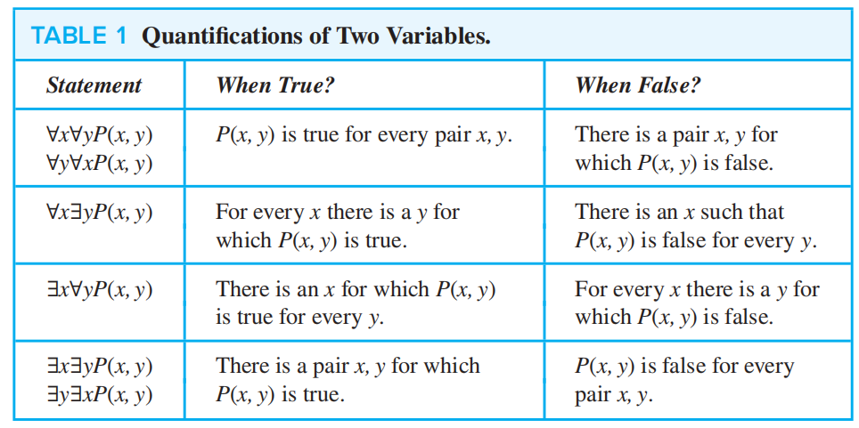

!!! example "Example"
	
	Let $P(x,y):y>x$. 
	
	+ $\forall x\exists yP(x,y)$: There isn't the biggest number.
	+ $\exists y \forall xP(x,y)$: The biggest number exists.
	Changing the order of quantifiers completely changes the meaning of the proposition.

#### Logical Equivalences Involving Quantifiers 
Statements involving predicates and quantifiers are **logically equivalent** iff they have the **same truth value** no matter which the predicates an the domain of discourse.

#### Negating Quantified Expressions
De Morgan's Laws for Quantifiers:

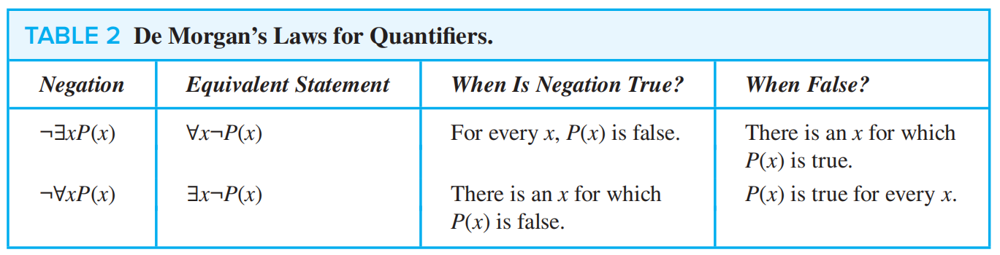

If there are more quantifiers, we can use De Morgan's Laws recursively:

$$
\neg \forall x\exists yP(x,y)\equiv \exists x\neg \exists yP(x,y) \equiv  \exists x\forall y\neg P(x,y)  
$$

<!-- > Supplement:
> 
> + $∀x(A(x)∧B(x))≡∀xA(x)∧∀xB(x)$
>+ $∃x(A(x)∨B(x))≡∃xA(x)∨∃xB(x)$
>
> But notice that the following formula can only be derived in one direction:
> 
> + $∀x(A(x)∨B(x)) ⇐∀xA(x)∨∀xB(x)$
> + $∃x(A(x)∧B(x))​⇒∃xA(x)∧∃xB(x)$ -->
#### Some Shorthands
+ $\exists x\exists y\exists  z\,P(x,y,z) \leftrightarrow_{\text{def}}\exists xyz\,P(x,y,z)$.
+  $\forall  x\forall  y\forall   z\,P(x,y,z) \leftrightarrow_{\text{def}}\forall xyz\,P(x,y,z)$.

### 一阶逻辑合式公式
#### 相关概念
**个体常项**（Constant）：表示具体的特定对象，一般用 $a,b,c$ 表示．

**个体变项**（Variable）：表示不确定的泛指对象，常与量词、谓词一起出现，一般用 $x,y,z$ 表示．

**项**（Term）：个体常项、个体变项，以及以项为自变量的函数．

**原子公式**（Atomic Formula）：以项为自变量的谓词．

**合式公式**：原子公式，以及有限次利用原子公式和逻辑运算符（$A\wedge B,A\vee B,A\to B$ 等）、量词与个体变项（$\exists xA,\forall xA$ 等）规则形成的符号串．

#### 量词辖域与变项
**指导变项**：紧跟在量词后的个体变项．

+ $\exists {\color{red}x}(F(x)\wedge\forall {\color{green}y}(G(y)\to H(x,y)))$．

**量词辖域**：在 $\exists xA,\forall xA$ 中，$A$ 是量词的辖域（也就是指导变项后紧跟的整个括号内的内容）．

+ $\exists x{\color{red}F(x)}\wedge\forall y{\color{green}(G(y)\to H(x,y))}$．
+ $\exists x\color{red}(F(x)\wedge\forall y(G(y)\to H(x,y)))$．

**约束出现**：在辖域中与指导变项同名的变项．

+ $\exists {\color{red}x}(F({\color{red}x})\wedge\forall {\color{green}y}(G({\color{green}y})\to H({\color{red}x},{\color{green}y})))$．

**自由出现**：既非指导变项又非约束出现．

+ $\forall y(G(y)\to H({\color{blue}x},y))$．

**闭式**：无自由出现的变项．

+ $F(a),\exists xF(x)$ 是闭式．
+ $F(x),\forall y(G(y)\to H(x,y))$ 不是闭式．

### 一阶逻辑等值式
等值：$A\Leftrightarrow B$．$A\Leftrightarrow B$ 当且仅当 $A\leftrightarrow B$ 是永真式．如 $\neg\forall xF(x) \Leftrightarrow \exists x \neg F(x)$．

#### 量词辖域收缩与扩张
假设 $B$ 中不含 $x$ 的出现：

**析取/合取式**直接提出/放入括号，不需要改变符号．

+ $\forall x(A(x)\vee B)\Leftrightarrow \forall xA(x)\vee B$．
+ $\forall x(A(x)\wedge B)\Leftrightarrow \forall xA(x)\wedge B$．
+ $\exists  x(A(x)\vee B)\Leftrightarrow \exists xA(x)\vee B$．
+ $\exists  x(A(x)\wedge B)\Leftrightarrow \exists  xA(x)\wedge B$．

可以推出结论：$\forall xP(x)\wedge \exists yQ(y) \Leftrightarrow \forall x \exists y(P(x)\wedge Q(y))$．该结论对任意量词组合、合取析取均成立，也就是说合取析取式的原子命题变量如果无关，可以直接提出量词成为[前束范式](#454)．事实上，由于[换名规则](#453)，也可以推出 $\forall xP(x)\wedge \exists xQ(x)$ 与上式等值．

**蕴含式**：若为前件则提出/放入括号时量词变号，若为后件则无需变号．

+ $\forall x(A(x)\to B)\Leftrightarrow \exists xA(x)\to B$．
+ $\forall x(B\to A(x))\Leftrightarrow B\to\forall x A(x)$．
+ $\exists  x(A(x)\to B)\Leftrightarrow \forall  xA(x)\to B$．
+ $\exists  x(B\to A(x))\Leftrightarrow B\to\exists x A(x)$．

???+ quote "蕴含式的证明（以全称量词为例）"

	$$
	\begin{aligned}
	&\forall x (A(x)\to B) \\
	&\Leftrightarrow \forall x(\neg A(x) \vee B) \\
	&\Leftrightarrow \forall x\neg A(x) \vee B \\
	&\Leftrightarrow \neg \exists xA(x) \vee B  \\
	&\Leftrightarrow \exists xA(x)\to B  
	\end{aligned}
	$$
	
	直观理解：对于所有 $x$，只要有 $A(x)$ 就有 $B$，那么如果我存在一个满足 $A(x)$ 的 $x$，我就一定能推出 $B$．
		
	$$
	\begin{aligned}
	&\forall x(B\to A(x)) \\
	&\Leftrightarrow  \forall x(\neg B \vee A(x)) \\
	&\Leftrightarrow \neg B\vee \forall xA(x) \\
	&\Leftrightarrow B\to \forall xA(x)     
	\end{aligned}
	$$
	
	直观理解：对于所有 $x$，如果 $B$ 满足了，它们都会满足 $A$，那么如果有条件 $B$，必然有所有 $x$ 都满足 $A(x)$．

#### 量词分配
全称量词对合取可分配，对析取单向推出：

+ $∀x(A(x)∧B(x))≡∀xA(x)∧∀xB(x)$
+ $∀x(A(x)∨B(x))⇐∀xA(x)∨∀xB(x)$

存在量词对析取可分配，对合取单向推出：

+ $∃x(A(x)∨B(x))≡∃xA(x)∨∃xB(x)$
+ $∃x(A(x)∧B(x))​⇒∃xA(x)∧∃xB(x)$

蕴含式的量词分配：

+ $\forall xA(x)\to\exists xB(x) \Leftrightarrow \exists x(A(x)\to B(x))$．
+ $\exists  xA(x)\to\forall  xB(x)\Rightarrow \forall  x(A(x)\to B(x))$．
+ $\forall x(A(x)\to B(x))\Rightarrow \forall xA(x)\to \forall xB(x)$．
+ $\forall x(A(x)\leftrightarrow  B(x))\Rightarrow \forall xA(x)\leftrightarrow \forall xB(x)$．

#### 换名规则
可以把某个指导变项和其量词辖域中所有同名的约束变项, 都换成新的个体变项符号；也可以把某个自由变项的所有出现, 都换成新的个体变项符号．

如：

+ $\forall xA(x)\wedge \forall xB(x)\Leftrightarrow \forall xA(x)\wedge \forall yB(y)$．
+ $\forall xA(x)\wedge B(x) \Leftrightarrow \forall  xA(x)∧B(y)$

#### 前束范式
**前束范式**：量词均在合式公式的开头，且它们的辖域延伸到整个公式末尾．

**存在性定理**：谓词逻辑合式公式均存在与之等值的前束范式．合式公式的前束范式是不唯一的．

???+ example "例"

	$$
	\begin{aligned}
	&(\exists xP(x)\wedge \forall yQ(y))\to \exists xR(x) \\
	&\Leftrightarrow (\exists xP(x)\wedge \forall yQ(y))\to \exists zR(z) \quad \text{换名规则} \\
	&\Leftrightarrow \exists x(P(x)\wedge \forall yQ(y)) \to \exists zR(z) \quad \text{辖域扩张}\\
	&\Leftrightarrow \exists x\forall y(P(x)\wedge Q(y))\to \exists zR(z) \quad \text{辖域扩张}\\
	&\Leftrightarrow \forall x(\forall y (P(x)\wedge Q(y))\to \exists zR(z) ) \quad \text{辖域扩张}:\exists xA(x)\to B \Leftrightarrow \forall x(A(x)\to B)     \\
	&\Leftrightarrow \forall x\exists   y((P(x)\wedge Q(y))\to \exists zR(z) ) \quad \text{辖域扩张}:\forall xA(x)\to B \Leftrightarrow \exists  x(A(x)\to B)\\
	&\Leftrightarrow \forall x\forall y\exists z((P(x)\wedge Q(y))\to R(z)) \quad \text{辖域扩张}:B\to \exists xA(x)\Leftrightarrow \exists x(B\to A(x))   
	\end{aligned}
	$$

## Rules of Inference
### Valid Arguments in Propositional Logic
**argument**(论证): A sequence of statements.

**conclusion**(结论): The final statement of the argument.

**premises**(前提): Preceding statements of the argument except for the conclusion.

**argument form**(论证形式): A augument that propositions are replaced by propositional variables.

**valid argument**(合法论证): A argument that when all its premises are true, then the conclusion must also be true.

From the definition of a valid argument form we see that the argument form with premises $p_1, p_2, …, p_n$ and conclusion $q$ is valid exactly when $(p_1 ∧ p_2 ∧ ⋯ ∧ p_{n}) \to q$ is a tautology. We denote it by $\Rightarrow$(重言蕴含).

!!! warning "$\to$ 与 $\Rightarrow$ 的区别"

	 $\to$ 为逻辑联结词，$A\to B$ 仍然是一个命题公式，其仍然有真假，当 $A$ 为真 $B$ 为假时为假．
	
	$\Rightarrow$ 为公式间的关系符，描述了两个公式间的关系，只能说 $A\Rightarrow B$ 式整体成立或不成立．
	
	$A\Rightarrow B$ 成立的充要条件是 $A\to B$ 为重言式．

### Rules of Inference for Propositional Logic
We can establish the validity of some relatively simple argument forms, called **rules of inference**(推理规则). These rules of inference can be used as building blocks to construct more complicated valid argument forms.

**modus ponens**(假言推理规则)

$$
\begin{aligned}
&P\\
&P\to Q\\
\hline
\therefore \ & Q
\end{aligned}
$$

**modus tollens**(拒取式)

$$
\begin{aligned}
&\neg Q\\
&P\to Q\\
\hline
\therefore \ & \neg P
\end{aligned}
$$

> The modus tollens is the contrapositive of modus ponens.

**addition**(析取引入规则)

$$
\begin{aligned}
&P\\
\hline
\therefore \ & P \vee  Q
\end{aligned}  
$$

**conjunction**(合取引入规则)

$$
\begin{aligned}
&P\\
&Q\\
\hline
\therefore \ & P \wedge Q
\end{aligned}
$$

**simplification**(合取消去规则)

$$
\begin{aligned}
&P\wedge Q\\
\hline
\therefore \ & P
\end{aligned} 
$$

**hypothetical syllogism**(假言三段论)

$$
\begin{aligned}
&P\to Q\\
&Q\to R\\
\hline
\therefore \ & P\to R
\end{aligned} 
$$

**disjunctive syllogism**(析取三段论)

$$
\begin{aligned}
&\neg P\\
&P\vee Q \\
\hline
\therefore \ &Q 
\end{aligned}
$$

**resolution**(消解规则)

$$
\begin{aligned}
&P \vee Q\\
&\neg P \vee  R\\
\hline
\therefore \ &Q \vee R 
\end{aligned}
$$

**constructive dilemma**(二难推论)

$$
\begin{aligned}
&(P\to Q)\vee (R\to S) \\
&P \vee R\\
\hline
\therefore \ &Q \vee S 
\end{aligned} 
$$

### Using Rules of Inference to Build Arguments
**formal proof**: To prove an argument is valid or the conclusion follows logically from the hypotheses.

+ Assume the hypotheses are true.
+ Use the rules of inference and logical equivalences to determine that the conclusion is true.

???+ warning "考试提醒 for BYR"

	在做逻辑推理时要写三列（如图），分别是序号、命题、原因，这些都会计入考试给分．
	
	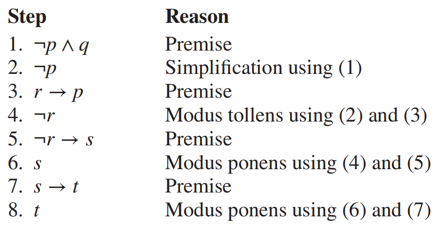

### 谓词逻辑推理规则
#### 代换实例
可以将公式代入命题逻辑规则，推理规则依然成立．

如将 $P=F(a),Q=G(a)$ 代入假言推理规则，得到：

$$
\begin{aligned}
&F(a)\\
&F(a) \to G(a)\\
\hline
\therefore \ & G(a)
\end{aligned}
$$

#### 一阶逻辑等值式生成的推理规则
即由 $A\Leftrightarrow B$ 可得 $A\Rightarrow B$ 以及 $B\Rightarrow A$．

如由 $\forall x(A(x)\wedge B(x))\Leftrightarrow \forall xA(x)\wedge\forall xB(x)$，可得

$$
\begin{aligned}
& \forall x(A(x)\wedge B(x))\Rightarrow \forall xA(x)\wedge\forall xB(x) \\
&\forall xA(x)\wedge\forall xB(x)\Rightarrow \forall x(A(x)\wedge B(x))
\end{aligned}
$$

#### 一阶逻辑蕴含式生成的推理规则
如

$$
\forall xA(x)\vee \forall xB(x)\Rightarrow \forall x(A(x)\vee B(x))   
$$

#### 一阶逻辑量词相关推理规则
**UI/全称特例化**（universal instantiation）：由全称量词谓词得到任意自由变项或个体常项的公式．

$$
\begin{aligned}
&\forall xA(x) \\ 
\hline
\therefore \ & A(y)\quad\text{其中 }y\text{ 为自由变项}\\ \\
\text{或} \\ \\
&\forall xA(x) \\
\hline
\therefore \ & A(c)\quad\text{其中 }c\text{ 为个体常项}
\end{aligned}
$$

**UG/全称泛化**（Universal Generalization）：由自由变项公式得到全称量词公式．

$$
\begin{aligned}
&A(y)\\
\hline
\therefore \ & \forall xA(x) 
\end{aligned}
$$

**EI/存在特例化**（Existential Instantiation）：由存在量词公式得到**特定**的个体常项公式．

$$
\begin{aligned}
&\exists xA(x)  \\
\hline
\therefore \ & A(c)
\end{aligned}
$$

**EG/存在泛化**（Existential Generalization）：由个体常项公式推出存在量词公式．

$$
\begin{aligned}
&A(c)\\
\hline
\therefore \ & \exists xA(x) 
\end{aligned} 
$$

!!! warning "注意事项"

	**①：特例化时量词必须在最外层**
	
	只能对主逻辑运算符是 $\forall$ 或 $\exists$ 的公式使用EI/UI．在下面例子中，需要进行等值演算化简为前束范式．
	
	+ $\neg \forall x P(x) \nRightarrow \neg P(c)$ 不能穿透否定符号．
	+ $\exists x F(x) \rightarrow \forall y G(y)$ 不能各自剥离成为 $F(c)\to G(z)$．

​	
	**②：证明顺序**
	
	当使用一阶逻辑量词相关推理规则，一定要注意“先EI，后UI”，因为我们能保证EI特定的个体常项一定在UI的论域内从而符合对应公式，当不能保证UI选取的任意个体常项即为满足EI的特定个体常项．
	
	如以前提 $\forall x(F(x)\to G(x)),\exists xF(x)$ 证明结论 $\exists xG(x)$，证明1正确而证明2错误．
	
	证明1：
	
	$$
	\begin{array}{ll}
	&(1)\exists xF(x)\quad &\text{Premise}\\
	&(2)F(c) &(1),\text{EI}\\
	&(3)\forall x(F(x)\to G(x)) &\text{Premise} \\
	&(4)F(c)\to G(c) &(3),\text{UI} \\
	&(5)G(c) & \text{(2),(4),Modus Ponens} \\
	&(6)\exists xG(x) & \text{(5),EG}  
	\end{array}
	$$
	
	证明2：
	
	$$
	\begin{array}{ll} \\
	&(1)\forall x(F(x)\to G(x)) &\text{Premise} \\
	&(2)F(c)\to G(c) &(1),\text{UI} \\
	&(3)\exists xF(x)\quad &\text{Premise}\\
	&(4)F(c) &(3),\text{EI}\\
	&(5)G(c) & \text{(2),(4),Modus Ponens} \\
	&(6)\exists xG(x) & \text{(5),EG}  
	\end{array}
	$$

### 构造证明
#### 直接证明法

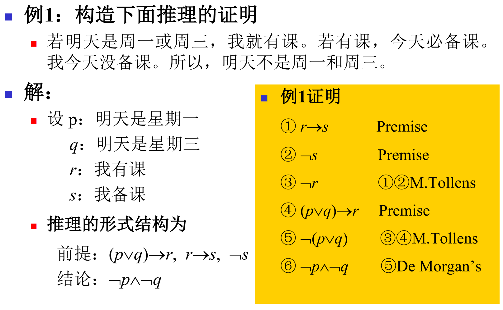

#### 附加前提证明法
**欲证明**：

+ 前提：$A_{1},A_{2},\cdots,A_{k}$
+ 结论：$C\to B$

**等价地证明**：

+ 前提：$A_{1},A_{2},\cdots,A_{k},C$
+ 结论：$B$

???+ quote "证明"

	$$
	\begin{aligned}
	&(A_{1}\wedge A_{2}\wedge \cdots \wedge A_{k})\to (C\to B) \\
	\Leftrightarrow & \neg (A_{1}\wedge A_{2}\wedge \cdots \wedge A_{k})\vee (\neg C\vee B) \\
	\Leftrightarrow &\neg A_{1}\vee \neg A_{2}\vee \cdots \vee \neg A_{k} \vee \neg C\vee B \\
	\Leftrightarrow &\neg (A_{1}\wedge A_{2}\wedge \cdots \wedge A_{k}\wedge C)\vee B  \\
	\Leftrightarrow &(A_{1}\wedge A_{2}\wedge \cdots \wedge A_{k}\wedge C)\to B  
	\end{aligned}
	$$

#### 反证法
**欲证明**：

+ 前提：$A_{1},A_{2},\cdots,A_{k}$
+ 结论：$B$

**方法**：将 $\neg B$ 加入前提，若推出矛盾，则得证结论正确．

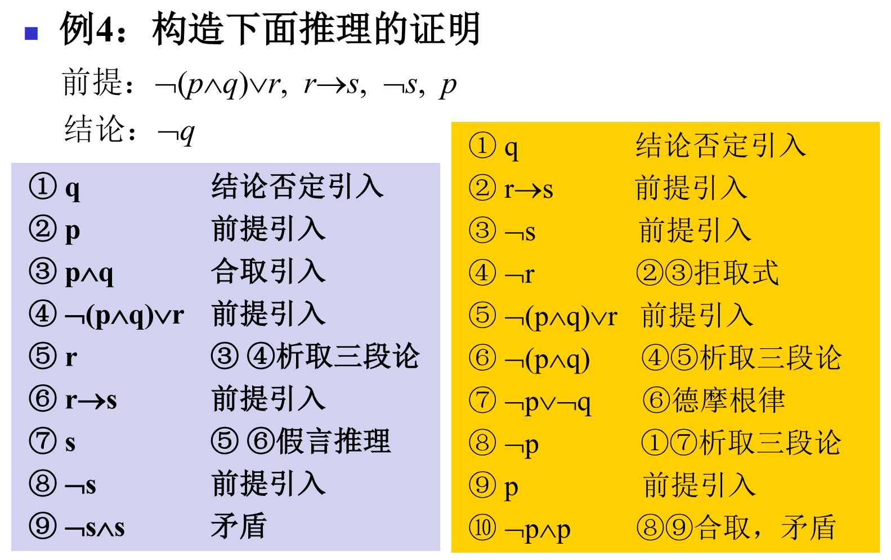

???+ quote "证明"

	$$
	\begin{aligned}
	&(A_{1}\wedge A_{2}\wedge \cdots \wedge A_{k})\to B \\
	\Leftrightarrow & \neg (A_{1}\wedge A_{2}\wedge \cdots \wedge A_{k})\vee B \\
	\Leftrightarrow &\neg A_{1}\vee \neg A_{2}\vee \cdots \vee \neg A_{k} \vee B \\
	\Leftrightarrow &\neg (A_{1}\wedge A_{2}\wedge \cdots \wedge A_{k}\wedge \neg B)  \\
	\end{aligned}
	$$
	
	原命题为重言式，当且仅当 $A_{1}\wedge A_{2}\wedge \cdots \wedge A_{k}\wedge \neg B$ 为矛盾式．

!!! warning "注意事项"

	①：记得UI/EI只能作用于前束范式．
	
	②：当要证明的蕴含式前后件被一个量词绑定时（即为前束范式时）不能使用附加前提证明法；而前后件被不同量词绑定时可以．
	
	> 例6中，我们可以化简为前束范式得到 $F(z)\to G(z)$，但不能直接由前提得到 $F(z)\to G(z)$ ．
	> 
	> 同时由于前后件被 $\forall x$ 绑定，不能使用附加前提证明．
	
	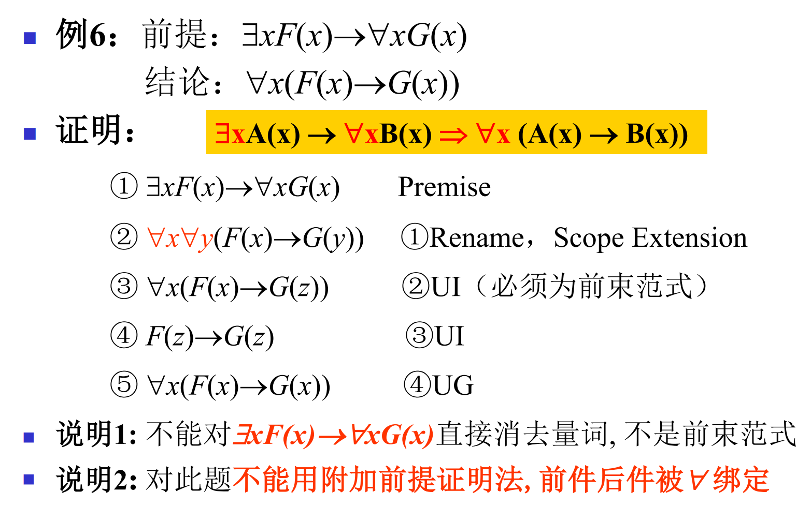
	
	> 例7中，$\forall xA(x)$ 与 $\forall xB(x)$ 分开，可以使用附加前提证明．
	
	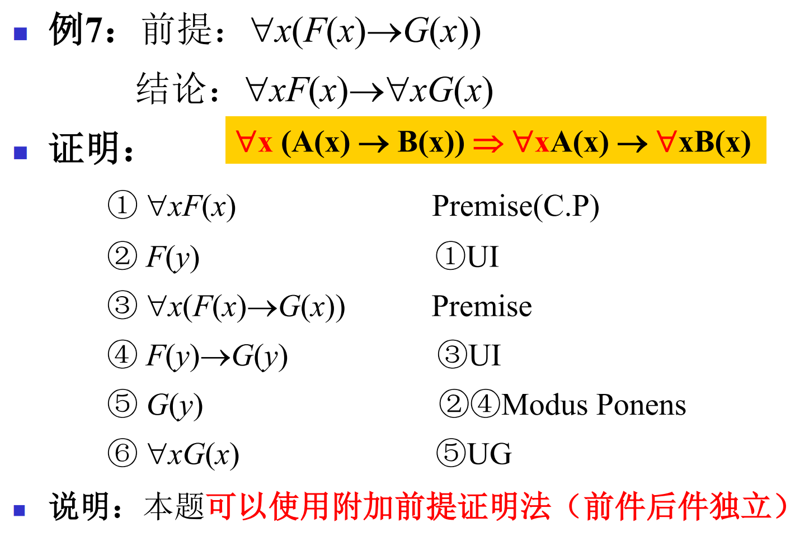