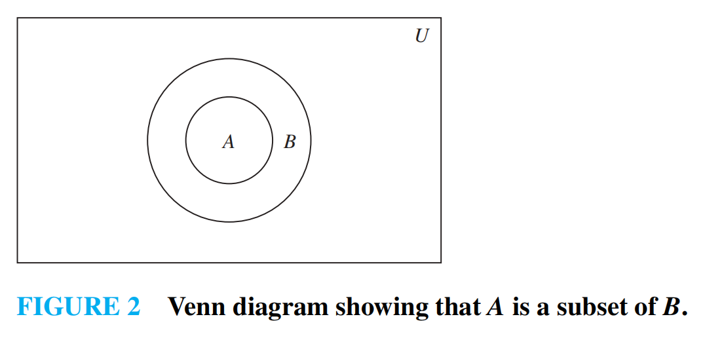
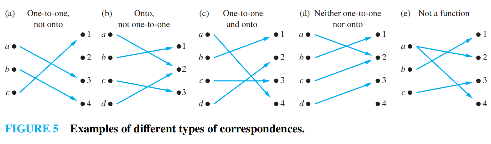

# Chap2 Basic Structures: Sets, Functions, Sequences, Sums, and Matrices

## Sets
**set**(集合): An unordered collection of zero or more distinct objects.

The objects in a set are called **elements**(元素) or **members**(成员). A set is said to **contain**(包含) its elements.

If $x$ is an element of $A$, we denote it by $x\in A$; otherwise, $x\notin A$.

!!! info "Basic Ideas"

	+ Order does not matter: $\{1,2,3\}=\{3,2,1\}$.
	+ Repetition does not matter: $\{1,1,2,3\}=\{1,2,3\}$.
	+ There is usually an underlying **universal set**(全集) $U$, either explicitly stated or understood.

### Describing Sets
**roster method**(列举法): List all elements between braces.

$$
S=\{a,b,c,d\}
$$

**set-builder notation**(集合构造式) or **specification by predicates**(谓词表示法):

$$
S=\{x\mid P(x)\}
$$

This means that $S$ contains exactly the elements $x$ in the universe that make the predicate $P(x)$ true.

???+ quote "Equality of Sets"

	Two sets $A$ and $B$ are **equal**(相等) if and only if they have exactly the same elements.

	$$
	A=B \Leftrightarrow \forall x(x\in A\leftrightarrow x\in B)
	$$

	Equivalently,

	$$
	A=B \Leftrightarrow A\subseteq B\wedge B\subseteq A
	$$

### Some Important Sets
+ $\mathbb{N}=\{0,1,2,3,\dots\}$: the set of natural numbers.
+ $\mathbb{Z}=\{\dots,-2,-1,0,1,2,\dots\}$: the set of integers.
+ $\mathbb{Z}^{+}=\{1,2,3,\dots\}$: the set of positive integers.
+ $\mathbb{Q}$: the set of rational numbers.
+ $\mathbb{R}$: the set of real numbers.
+ $\mathbb{C}$: the set of complex numbers.

!!! warning "Notation"

	Some books use $\mathbb{N}$ for $\{1,2,3,\dots\}$. Rosen uses $\mathbb{N}=\{0,1,2,\dots\}$.

### Empty Set
**empty set**(空集): The set with no members, denoted by $\emptyset$ or $\{\}$.

$$
|\emptyset|=0
$$

!!! warning "$\emptyset$ vs $\{\emptyset\}$"

	$\emptyset$ has no element.
	
	$\{\emptyset\}$ has one element, and that element is $\emptyset$.
	
	Therefore, $\emptyset\neq\{\emptyset\}$ and $|\{\emptyset\}|=1$.

### Basic Set Structures
#### Subsets
The set $A$ is a **subset**(子集) of $B$, denoted by $A\subseteq B$, iff every element of $A$ is also an element of $B$.

$$
A\subseteq B \Leftrightarrow \forall x(x\in A\to x\in B)
$$

If $A$ is not a subset of $B$, denote it by $A\nsubseteq B$.

To prove $A\nsubseteq B$, it is enough to find a counterexample $x$ such that $x\in A$ and $x\notin B$.

**superset**(超集): If $A\subseteq B$, then $B$ is a superset of $A$, denoted by $B\supseteq A$.

**proper subset**(真子集): If $A\subseteq B$ and $A\neq B$, then $A$ is a proper subset of $B$, denoted by $A\subset B$.

!!! quote "Useful Facts"

	+ $\emptyset\subseteq A$ for every set $A$.
	+ $A\subseteq A$ for every set $A$.
	+ $A\subset B$ means $A\subseteq B$ and at least one element of $B$ is not in $A$.

#### Cardinality
**cardinality**(基数): The number of distinct elements in a set $A$, denoted by $|A|$.

A set is **finite**(有限的) if its cardinality is a natural number. Otherwise, it is **infinite**(无限的).

#### Power Sets
**power set**(幂集): The set of all subsets of a set $S$, denoted by $\mathcal{P}(S)$.

$$
\mathcal{P}(S)=\{T\mid T\subseteq S\}
$$

If $|S|=n$, then

$$
|\mathcal{P}(S)|=2^n
$$

???+ example "Examples"

	If $A=\{a,b\}$, then
	
	$$
	\mathcal{P}(A)=\{\emptyset,\{a\},\{b\},\{a,b\}\}
	$$
	
	If $A=\emptyset$, then
	
	$$
	\mathcal{P}(\emptyset)=\{\emptyset\}
	$$

#### Cartesian Products
**ordered n-tuple**(有序 n 元组): A list $(a_1,a_2,\dots,a_n)$ where order matters and repetition matters.

Two ordered $n$-tuples are equal iff all corresponding entries are equal.

$$
(a_1,a_2,\dots,a_n)=(b_1,b_2,\dots,b_n)
\Leftrightarrow
\forall i(a_i=b_i)
$$

???+ example "Sets vs Ordered Tuples"

	$$
	(1,2)\neq(2,1)\neq(2,1,1)
	$$
	
	But
	
	$$
	\{1,2\}=\{2,1\}=\{2,1,1\}
	$$

**Cartesian product**(笛卡尔乘积): The Cartesian product of $A$ and $B$, denoted by $A\times B$, is the set of all ordered pairs whose first component is in $A$ and second component is in $B$.

$$
A\times B=\{(a,b)\mid a\in A\wedge b\in B\}
$$

For $n$ sets,

$$
A_1\times A_2\times\cdots\times A_n
=\{(a_1,a_2,\dots,a_n)\mid a_i\in A_i,\ 1\leq i\leq n\}
$$

If $|A|=m$ and $|B|=n$, then

$$
|A\times B|=mn
$$

!!! note "Properties"

	+ $A\times\emptyset=\emptyset$ and $\emptyset\times A=\emptyset$.
	+ Usually $A\times B\neq B\times A$.
	+ $A^n$ means $A\times A\times\cdots\times A$ with $n$ copies of $A$.

**relation**(关系): A subset of a Cartesian product. A relation from $A$ to $B$ is a subset of $A\times B$.

### Venn Diagrams
**Venn diagram**(文氏图): A diagram used to show relationships between sets.

In a Venn diagram:

+ The universal set $U$ is represented by a rectangle.
+ Sets are usually represented by circles and their interiors.
+ Shaded regions represent set operations or relationships.

Venn diagrams are useful for intuition, especially for two or three sets. For formal proofs of set identities, use mutual subsets, logical equivalences, or membership tables.

### Set Notation with Quantifiers
Restricted quantifiers can be written with set notation.

$$
\forall x\in S(P(x)) \Leftrightarrow \forall x(x\in S\to P(x))
$$

$$
\exists x\in S(P(x)) \Leftrightarrow \exists x(x\in S\wedge P(x))
$$

**truth set**(真值集): Given a predicate $P(x)$ and a domain $D$, the truth set of $P$ is

$$
\{x\in D\mid P(x)\}
$$

!!! note "Connection with Quantifiers"

	+ $\forall xP(x)$ is true over domain $D$ iff the truth set of $P$ is $D$.
	+ $\exists xP(x)$ is true over domain $D$ iff the truth set of $P$ is nonempty.

## Set Operations
Logical calculus(逻辑演算) and set theory(集合论) are both instances of an algebraic system(代数系统) called **Boolean algebra**(布尔代数).

Set operators are defined using the corresponding logical operators.

In this section, assume all sets are subsets of a fixed universal set $U$.

### Basic Set Operations
**union**(并集):

$$
A\cup B=\{x\mid x\in A\vee x\in B\}
$$

**intersection**(交集):

$$
A\cap B=\{x\mid x\in A\wedge x\in B\}
$$

If $A\cap B=\emptyset$, then $A$ and $B$ are **disjoint**(不相交).

**complement**(补集):

$$
\overline{A}=A^c=\{x\in U\mid x\notin A\}
$$

**difference**(差) or **relative complement**(相对补集):

$$
A-B=A\setminus B=\{x\mid x\in A\wedge x\notin B\}=A\cap\overline{B}
$$

**symmetric difference**(对称差):

$$
A\oplus B=(A-B)\cup(B-A)
$$

Equivalently,

$$
A\oplus B=(A\cup B)-(A\cap B)
$$

??? quote "Generalized Unions and Intersections"

	For sets $A_1,A_2,\dots,A_n$,

	$$
	\bigcup_{i=1}^{n}A_i=A_1\cup A_2\cup\cdots\cup A_n
	$$

	$$
	\bigcap_{i=1}^{n}A_i=A_1\cap A_2\cap\cdots\cap A_n
	$$

	For an indexed family $\{A_i\mid i\in I\}$,

	$$
	\bigcup_{i\in I}A_i=\{x\mid \exists i\in I(x\in A_i)\}
	$$

	$$
	\bigcap_{i\in I}A_i=\{x\mid \forall i\in I(x\in A_i)\}
	$$

	???+ example "Intervals"

		Let $A_i=[i,\infty)$ for positive integers $i$.
		
		$$
		\bigcup_{i=1}^{\infty}A_i=[1,\infty),\qquad
		\bigcap_{i=1}^{\infty}A_i=\emptyset
		$$
		
		Let $B_i=[1,i]$ for positive integers $i$.
		
		$$
		\bigcup_{i=1}^{\infty}B_i=[1,\infty),\qquad
		\bigcap_{i=1}^{\infty}B_i=\{1\}
		$$

### Addition Principle
For finite sets $A$ and $B$,

$$
|A\cup B|=|A|+|B|-|A\cap B|
$$

This is also called the **inclusion-exclusion principle**(容斥原理).

### Set Identities
**Identity laws**:

+ $A\cup\emptyset=A$
+ $A\cap U=A$

**Domination laws**:

+ $A\cup U=U$
+ $A\cap\emptyset=\emptyset$

**Idempotent laws(幂等律)**:

+ $A\cup A=A$
+ $A\cap A=A$

**Complement laws(补集律)**:

+ $A\cup\overline{A}=U$
+ $A\cap\overline{A}=\emptyset$
+ $\overline{\overline{A}}=A$
+ $\overline{\emptyset}=U$
+ $\overline{U}=\emptyset$

**Commutative laws(交换律)**:

+ $A\cup B=B\cup A$
+ $A\cap B=B\cap A$

**Associative laws(结合律)**:

+ $A\cup(B\cup C)=(A\cup B)\cup C$
+ $A\cap(B\cap C)=(A\cap B)\cap C$

**Distributive laws(分配律)**:

+ $A\cup(B\cap C)=(A\cup B)\cap(A\cup C)$
+ $A\cap(B\cup C)=(A\cap B)\cup(A\cap C)$

**De Morgan's laws(德摩根律)**:

+ $\overline{A\cup B}=\overline{A}\cap\overline{B}$
+ $\overline{A\cap B}=\overline{A}\cup\overline{B}$

**Absorption laws(吸收律)**:

+ $A\cup(A\cap B)=A$
+ $A\cap(A\cup B)=A$

**Cartesian product** distributes over union and intersection.

+ $A\times(B\cup C)=(A\times B)\cup(A\times C)$

+ $(B\cup C)\times A=(B\times A)\cup(C\times A)$

+ $A\times(B\cap C)=(A\times B)\cap(A\times C)$

+ $(B\cap C)\times A=(B\times A)\cap(C\times A)$

+ $A\times(B-C)=(A\times B)-(A\times C)$

### Proving Set Identities
To prove a set identity $S_1=S_2$, there are several common methods.

#### Mutual Subsets
Show $S_1\subseteq S_2$ and $S_2\subseteq S_1$ separately.

???+ example "Prove a Distributive Law"

	Prove
	
	$$
	A\cap(B\cup C)=(A\cap B)\cup(A\cap C)
	$$
	
	First, suppose $x\in A\cap(B\cup C)$. Then $x\in A$ and $x\in B\cup C$, so $x\in A$ and $(x\in B\vee x\in C)$.
	
	If $x\in B$, then $x\in A\cap B$.
	
	If $x\in C$, then $x\in A\cap C$.
	
	Therefore $x\in(A\cap B)\cup(A\cap C)$.
	
	The reverse direction is similar.

#### Set Builder Notation
Translate both sides into predicates and use logical equivalences.

???+ example "De Morgan's Law"

	$$
	\begin{aligned}
	\overline{A\cap B}
	&=\{x\mid x\notin A\cap B\}\\
	&=\{x\mid \neg(x\in A\wedge x\in B)\}\\
	&=\{x\mid x\notin A\vee x\notin B\}\\
	&=\overline{A}\cup\overline{B}
	\end{aligned}
	$$

#### Membership Tables
Use $1$ to indicate membership and $0$ to indicate non-membership. If the final columns are identical, the sets are equal.

???+ example "Membership Table"

	Prove $(A\cup B)-B=A-B$.
	
	| $A$ | $B$ | $A\cup B$ | $(A\cup B)-B$ | $A-B$ |
	| :-: | :-: | :-: | :-: | :-: |
	| 0 | 0 | 0 | 0 | 0 |
	| 0 | 1 | 1 | 0 | 0 |
	| 1 | 0 | 1 | 1 | 1 |
	| 1 | 1 | 1 | 0 | 0 |

#### Existing Identities
Start from one side and transform it into the other side using established identities.

### Representing Sets with Bit Strings
Let $U=\{u_1,u_2,\dots,u_n\}$ be a finite universal set with a fixed order.

A subset $A\subseteq U$ can be represented by a **bit string**(位串) $b_1b_2\cdots b_n$, where

$$
b_i=
\begin{cases}
1,&u_i\in A\\
0,&u_i\notin A
\end{cases}
$$

Set operations become bitwise operations.

+ $A\cup B$: bitwise OR.
+ $A\cap B$: bitwise AND.
+ $\overline{A}$: bitwise NOT.
+ $A-B$: $A$ AND NOT $B$.
+ $A\oplus B$: bitwise XOR.

???+ example "Example"

	Let $U=\{1,2,3,4,5,6,7,8,9,10\}$ in increasing order.
	
	+ Odd integers $\{1,3,5,7,9\}$ are represented by $1010101010$.
	+ Even integers $\{2,4,6,8,10\}$ are represented by $0101010101$.
	+ Integers not exceeding $5$ are represented by $1111100000$.

### Multisets
**multiset**(多重集): An unordered collection where elements can occur more than once.

The number of times an element appears is its **multiplicity**(重数).

For multisets $P$ and $Q$:

+ $P\cup Q$: multiplicity is the maximum of the two multiplicities.
+ $P\cap Q$: multiplicity is the minimum of the two multiplicities.
+ $P-Q$: multiplicity is the multiplicity in $P$ minus that in $Q$, but not below $0$.
+ $P+Q$: multiplicity is the sum of the two multiplicities.

## Functions
A **function**(函数), also called a **mapping**(映射) or **transformation**(变换), assigns exactly one element of one set to each element of another set.

For sets $A$ and $B$, a function from $A$ to $B$ is denoted by

$$
f:A\to B
$$

This means every $x\in A$ is assigned exactly one value $f(x)\in B$.

As a relation, $f$ is a subset of $A\times B$ satisfying existence and uniqueness:

$$
\forall x\in A\,\exists y\in B((x,y)\in f)
$$

and

$$
((x,y_1)\in f\wedge(x,y_2)\in f)\to y_1=y_2
$$

### Domain, Codomain, Image, and Range
For a function $f:A\to B$:

+ $A$ is the **domain**(域/定义域).
+ $B$ is the **codomain**(陪域).
+ If $f(x)=y$, then $y$ is the **image**(像) of $x$ under $f$.
+ If $f(x)=y$, then $x$ is a **preimage**(源像) of $y$.
+ The **range**(值域) is the set of all images of elements in the domain.

$$
\operatorname{range}(f)=f(A)=\{f(x)\mid x\in A\}
$$

If $S\subseteq A$, then the image of $S$ is

$$
f(S)=\{f(s)\mid s\in S\}
$$

If $T\subseteq B$, then the **inverse image**(逆像) of $T$ is

$$
f^{-1}(T)=\{x\in A\mid f(x)\in T\}
$$

!!! warning "Range vs Codomain"

	The codomain is the set where the function is declared to map values.
	
	The range is the set of values that the function actually reaches.
	
	Always,
	
	$$
	f(A)\subseteq B
	$$

???+ quote "Equality of Functions"

	Two functions are equal iff they have:

	+ the same domain,
	+ the same codomain,
	+ the same value at every element of the domain.

	Changing the domain or codomain gives a different function, even if the formula looks the same.

### Types of Correspondences
#### One-to-One Functions
A function $f:A\to B$ is **one-to-one**(一对一), **injective**(单射), or an **injection**(单射函数), iff different elements in the domain have different images.

$$
\forall x\forall y(f(x)=f(y)\to x=y)
$$

Equivalently,

$$
\forall x\forall y(x\neq y\to f(x)\neq f(y))
$$

> To show $f$ is injective, assume $f(x)=f(y)$ and prove $x=y$.
> 
> To show $f$ is not injective, find $x\neq y$ such that $f(x)=f(y)$.

!!! quote "Strict Monotonicity"

	If a numerical function is strictly increasing or strictly decreasing on its domain, then it is one-to-one.
	
	The converse is not necessarily true.

#### Onto Functions
A function $f:A\to B$ is **onto**(上的), **surjective**(满射), or a **surjection**(满射函数), iff every element of the codomain is an image of some element in the domain.

$$
\forall y\in B\,\exists x\in A(f(x)=y)
$$

Equivalently,

$$
f(A)=B
$$

> To show $f$ is surjective, take an arbitrary $y\in B$ and find $x\in A$ such that $f(x)=y$.
> 
> To show $f$ is not surjective, find $y\in B$ such that no $x\in A$ satisfies $f(x)=y$.

#### Bijections
A function is a **bijection**(双射) or **one-to-one correspondence**(一一对应) iff it is both injective and surjective.

For finite sets, if there is a bijection between $A$ and $B$, then

$$
|A|=|B|
$$

!!! note "Finite Domain and Codomain"

	If $A$ and $B$ are finite and $|A|=|B|$, then for $f:A\to B$:
	
	$$
	f\text{ is injective}\Leftrightarrow f\text{ is surjective}
	$$
	
	This equivalence does not always hold for infinite sets.

### Operations on Functions
#### Function Operations
For real-valued or integer-valued functions $f,g:A\to B$, operations on $B$ can be extended to functions pointwise.

For example, if $f,g:\mathbb{R}\to\mathbb{R}$:

$$
(f+g)(x)=f(x)+g(x)
$$

$$
(fg)(x)=f(x)g(x)
$$

More generally, if $\ast$ is an operation on $B$, then

$$
(f\ast g)(a)=f(a)\ast g(a)
$$

#### Inverse Functions

Let $f:A\to B$ be a bijection. The **inverse function**(逆函数) of $f$, denoted by $f^{-1}$, is the function from $B$ to $A$ defined by

$$
f^{-1}(y)=x \Leftrightarrow f(x)=y
$$

A function is **invertible**(可逆的) iff it is a bijection.

!!! warning "Notation"

	$f^{-1}$ does not mean $\frac{1}{f}$.
	
	Also, $f^{-1}(S)$ can mean inverse image for a set $S\subseteq B$, even when $f$ is not invertible.

If $f:A\to B$ is a bijection, then

$$
f^{-1}(f(x))=x,\quad x\in A
$$

$$
f(f^{-1}(y))=y,\quad y\in B
$$

#### Composition of Functions
Let $g:A\to B$ and $f:B\to C$. The **composition**(复合) of $f$ with $g$, denoted by $f\circ g$, is the function from $A$ to $C$ defined by

$$
(f\circ g)(x)=f(g(x))
$$

Usually, $f\circ g\neq g\circ f$.

Function composition is associative.

$$
(h\circ g)\circ f=h\circ(g\circ f)
$$

If $f$ and $g$ are bijections, then

$$
(f\circ g)^{-1}=g^{-1}\circ f^{-1}
$$

### Special Functions
#### Floor and Ceiling Functions
The **floor function**(向下取整), denoted by $\lfloor x\rfloor$, is the largest integer less than or equal to $x$.

$$
\lfloor x\rfloor=\max\{n\in\mathbb{Z}\mid n\leq x\}
$$

The **ceiling function**(向上取整), denoted by $\lceil x\rceil$, is the smallest integer greater than or equal to $x$.

$$
\lceil x\rceil=\min\{n\in\mathbb{Z}\mid n\geq x\}
$$

!!! note "Useful Properties"

	

#### Factorial Function
The **factorial function**(阶乘函数) maps a nonnegative integer $n$ to

$$
n!=n(n-1)(n-2)\cdots2\cdot1
$$

By convention, 0!=1.

The factorial function grows very rapidly. Stirling's formula gives an approximation:

$$
n!\sim\sqrt{2\pi n}\left(\frac{n}{e}\right)^n
$$

#### Characteristic Functions
Let $A\subseteq U$. The **characteristic function**(特征函数) of $A$ is the function $f_A:U\to\{0,1\}$ defined by

$$
f_A(x)=
\begin{cases}
1,&x\in A\\
0,&x\notin A
\end{cases}
$$

Characteristic functions connect sets with Boolean operations.

$$
f_{A\cap B}(x)=f_A(x)f_B(x)
$$

$$
f_{A\cup B}(x)=f_A(x)+f_B(x)-f_A(x)f_B(x)
$$

$$
f_{\overline{A}}(x)=1-f_A(x)
$$

$$
f_{A\oplus B}(x)=f_A(x)+f_B(x)-2f_A(x)f_B(x)
$$

#### Mod-n Functions
For a fixed positive integer $n$, the **mod-n function**(模 n 函数) maps a nonnegative integer $z$ to its remainder after division by $n$.

If

$$
z=kn+r,\qquad 0\leq r<n
$$

then

$$
f_n(z)=r=z\bmod n
$$

The function $f_n:\mathbb{N}\to\{0,1,\dots,n-1\}$ is onto but not one-to-one.

#### Partial Functions
A **partial function**(部分函数) from $A$ to $B$ assigns a unique element of $B$ only to elements in some subset of $A$.

This subset is called the **domain of definition**(定义域).

If the domain of definition equals $A$, then the function is a **total function**(全函数).

???+ example "Examples"

	+ $f:\mathbb{Z}\to\mathbb{R}$, $f(n)=1/n$, is undefined at $n=0$.
	+ $g:\mathbb{R}\to\mathbb{R}$, $g(x)=\sqrt{x}$, is undefined for negative real numbers if the codomain is restricted to real numbers.

## Sequences
A **sequence**(序列) is a function from a subset of the natural numbers to a set $S$.

Usually the domain is $\{0,1,2,\dots\}$ or $\{1,2,3,\dots\}$.

If the function is $f$, we usually write

$$
a_i=f(i)
$$

and denote the sequence by

$$
\{a_i\}_{i=0}^{\infty}
$$

The value $a_i$ is called a **term**(项) of the sequence.

!!! warning "Sequence vs Set"

	A sequence is ordered and can contain repetitions.
	
	For example,
	
	$$
	1,-1,1,-1,\dots
	$$
	
	is an infinite sequence, not the two-element set $\{1,-1\}$.

**string**(串): A finite sequence of symbols from an alphabet.

The **empty string**(空串), denoted by $\lambda$, has length $0$.

### Arithmetic and Geometric Progressions
An **arithmetic progression**(等差数列) has the form

$$
a,\ a+d,\ a+2d,\ \dots,\ a+nd,\dots
$$

The $n$th term, if starting at $n=0$, is

$$
a_n=a+nd
$$

A **geometric progression**(等比数列) has the form

$$
a,\ ar,\ ar^2,\ \dots,\ ar^n,\dots
$$

The $n$th term, if starting at $n=0$, is

$$
a_n=ar^n
$$

???+ example "Examples"

	+ $1,3,5,7,\dots$ is arithmetic with $a=1,d=2$.
	+ $1,\frac12,\frac14,\frac18,\dots$ is geometric with $a=1,r=\frac12$.
	+ $1,-1,1,-1,\dots$ is geometric with $a=1,r=-1$.

### Recurrence Relations
A **recurrence relation**(递推关系) for a sequence $\{a_n\}$ is an equation that expresses $a_n$ in terms of one or more previous terms.

A sequence is a **solution**(解) of a recurrence relation if its terms satisfy the recurrence relation.

**Initial conditions**(初始条件) specify the terms before the recurrence relation starts to apply.

???+ quote "Fibonacci Sequence"

    The **Fibonacci sequence**(斐波那契数列) is defined by

    $$
    \begin{cases}
    f_0=0\\f_1=1\\
    f_n=f_{n-1}+f_{n-2},\quad n\geq2
    \end{cases}
    $$

    The first few terms are $0,1,1,2,3,5,8,13,\dots$.

### Closed Formula and Iteration
A **closed formula**(闭式) gives $a_n$ explicitly as a function of $n$.

To solve a recurrence relation with initial conditions means to find a closed formula for the sequence.

**iteration**(迭代): Repeatedly apply the recurrence relation to discover a pattern.

+ **forward substitution**(向前代入): Start from initial conditions and compute upward.
+ **backward substitution**(向后代入): Start from $a_n$ and rewrite it in terms of earlier terms.

### Summation
**summation**(求和): A compact notation for adding terms of a sequence.

For a sequence $\{a_i\}$,

$$
\sum_{i=j}^{k}a_i=a_j+a_{j+1}+\cdots+a_k
$$

Here:

+ $i$ is the **index of summation**(求和指标).
+ $j$ is the lower limit(下界).
+ $k$ is the upper limit(上界).

For an infinite series, $\sum_{i=j}^{\infty}a_i=a_j+a_{j+1}+\cdots
$.

We can also sum over a set, $\sum_{x\in X}f(x)$.

Or over elements satisfying a predicate, $\sum_{P(x)}f(x)$.

#### Summation Manipulations

Constant multiple:

$$
\sum_{i=j}^{k}c f(i)=c\sum_{i=j}^{k}f(i)
$$

Sum of functions:

$$
\sum_{i=j}^{k}(f(i)+g(i))
=\sum_{i=j}^{k}f(i)+\sum_{i=j}^{k}g(i)
$$

Index shifting:

$$
\sum_{i=j}^{k}f(i)
=\sum_{i=j+n}^{k+n}f(i-n)
$$

Series splitting:

$$
\sum_{i=j}^{k}f(i)
=\sum_{i=j}^{m}f(i)+\sum_{i=m+1}^{k}f(i)
\quad(j\leq m<k)
$$

Order reversal:

$$
\sum_{i=0}^{k}f(i)=\sum_{i=0}^{k}f(k-i)
$$

Even-odd grouping:

$$
\sum_{i=0}^{2k+1}f(i)=\sum_{i=0}^{k}(f(2i)+f(2i+1))
$$

#### Common Summation Formulae

Geometric series(等比级数):

$$
\sum_{k=0}^{n}ar^k=
\begin{cases}
\dfrac{a(r^{n+1}-1)}{r-1},&r\neq1\\
(n+1)a,&r=1
\end{cases}
$$

Gauss's summation formula:

$$
\sum_{k=1}^{n}k=\frac{n(n+1)}{2}
$$

Quadratic series:

$$
\sum_{k=1}^{n}k^2=\frac{n(n+1)(2n+1)}{6}
$$

Cubic series:

$$
\sum_{k=1}^{n}k^3=\frac{n^2(n+1)^2}{4}
=\left(\frac{n(n+1)}{2}\right)^2
$$

Infinite geometric series:

$$
\sum_{k=0}^{\infty}ar^k=\frac{a}{1-r},\quad |r|<1
$$

#### Nested Summations
A **nested summation**(嵌套求和) is evaluated from the inside out.

???+ example "Example"

	$$
	\begin{aligned}
	\sum_{i=1}^{4}\sum_{j=1}^{3}ij
	&=\sum_{i=1}^{4}i\sum_{j=1}^{3}j\\
	&=\sum_{i=1}^{4}i(1+2+3)\\
	&=6\sum_{i=1}^{4}i\\
	&=6(10)=60
	\end{aligned}
	$$

Like quantified expressions, summations have bound variables and free variables. Renaming a bound index does not change the summation.
