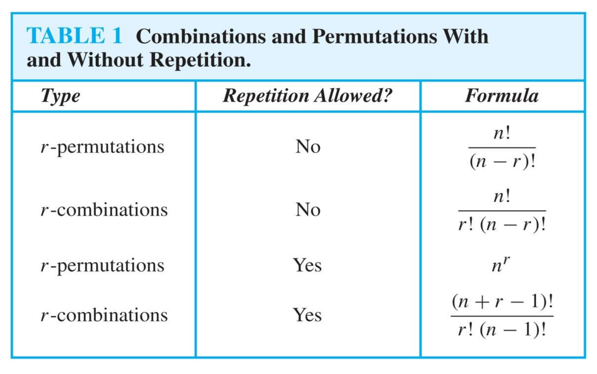

# Chap 6: Counting

## Basic Counting Principles

Let $m$ be the number of ways to do task 1 and $n$ the number of ways to do task 2.
### Sum Rule
The task “do either task 1 or task 2, but not both” can be done in $m+n$ ways.

In set notation, if $A$ and $B$ are disjoint sets of outcomes, then

$$
|A\cup B|=|A|+|B|
$$

### Product Rule

The task “do both task 1 and task 2”
can be done in $mn$ ways.

In set notation, if $A$ and $B$ are disjoint sets of outcomes, then

$$
|A\times  B|=|A|\cdot |B|
$$

### Subtraction Rule

If two cases overlap, simply adding their sizes counts the intersection twice. For finite sets $A$ and $B$,

$$
|A\cup B|=|A|+|B|-|A\cap B|.
$$

This is the **subtraction rule**, or **inclusion-exclusion**.

> [!example]+ Counting Bit Strings
>
> How many bit strings of length $8$ either begin with $1$ or end with $00$?
>
> Let $A$ be the set of strings beginning with $1$ and $B$ the set of strings ending with $00$. Then
>
> $$
> |A|=2^7,\quad |B|=2^6,\quad |A\cap B|=2^5.
> $$
>
> Therefore,
>
> $$
> |A\cup B|=2^7+2^6-2^5=160.
> $$

### Division Rule

If a counting procedure produces $N$ representations, and every actual outcome is represented exactly $d$ times. Then the number of distinct outcomes is

$$
\frac{N}{d}
$$

> [!example]+ Circular Permutations
>
> There are $n!$ ways to place $n$ distinct people in numbered seats around a table. If rotations are considered identical, each circular arrangement is counted $n$ times, once for each choice of the person in the first seat. Hence, the number of circular arrangements is
>
> $$
> \frac{n!}{n}=(n-1)!.
> $$

## Pigeonhole Principle

The **pigeonhole principle**, also called the **Dirichlet drawer principle**, states that if at least $k+1$ objects are placed into $k$ boxes, then at least one box contains at least two objects.

In terms of functions: if $f:A\rightarrow B$ and $|A|>|B|$, then $f$ cannot be one-to-one. Some element of $B$ must have at least two preimages.

**Generalized**: If $N$ objects are placed into $k$ boxes, then at least one box contains at least

$$
\left\lceil\frac{N}{k}\right\rceil
$$

objects.

> [!quote]- A Remainder Application
>
> Among any $n+1$ integers, two have the same remainder modulo $n$. 

## Permutations and Combinations

Selection problems: select $r$ elements from $n$ elements.

Most elementary selection problems can be classified by two questions:

1. **Does order matter?** 
	+ Yes: Permutation
	+ No: Combination
2. **Is repetition allowed?** 

### Permutations without Repetition

A **permutation** of a set is an ordered arrangement of all its elements. An **$r$-permutation** of a set with $n$ distinct elements is an ordered arrangement of $r$ distinct elements.

The first position has $n$ choices, the second has $n-1$ choices, and so on. Therefore,

$$
P(n,r)=n(n-1)\cdots(n-r+1)
=\frac{n!}{(n-r)!}.
$$

In particular,

$$
P(n,n)=n!
$$

### Combinations without Repetition

An **$r$-combination** of a set $S$ is an $r$-element subset of $S$. Because order does not matter, every selected group of $r$ elements corresponds to $r!$ different $r$-permutations. By the division rule,

$$
\binom nr=C(n,r)
=\frac{P(n,r)}{r!}
=\frac{n!}{r!(n-r)!}.
$$

> [!info+] Useful Identities

Choosing the $r$ selected elements is equivalent to choosing the $n-r$ unselected elements, so

$$
\binom nr=\binom n{n-r}
$$

Pascal's identity: fix a particular element $x$. An $r$-element subset either

+ excludes $x$, giving $\displaystyle\binom{n-1}{r}$ choices
+ includes $x$, leaving $\displaystyle\binom{n-1}{r-1}$ choices

so

$$
\binom nr=\binom{n-1}{r}+\binom{n-1}{r-1}
$$

### Permutations with Repetition

If each of $r$ ordered positions can be filled independently with any of $n$ elements, then repetition is allowed and the product rule gives

$$
n^r
$$

### Combinations with Repetition

An **$r$-combination with repetition** selects $r$ objects from $n$ types when order does not matter and each type may be selected more than once. The number of such selections is

$$
\binom{n+r-1}{r}
=\binom{n+r-1}{n-1}
=\frac{(n+r-1)!}{r!(n-1)!}.
$$

This formula follows from the **stars and bars** representation. Use $r$ stars for the selected objects and $n-1$ bars to divide them into $n$ types. Every selection corresponds to one arrangement of the $r$ stars and $n-1$ bars.

> [!example]+ Nonnegative Integer Solutions
>
> The number of nonnegative integer solutions of
>
> $$
> x_1+x_2+x_3=11
> $$
>
> is the number of ways to distribute $11$ identical objects among three labeled boxes. There are $11$ stars and $2$ bars, so the answer is
>
> $$
> \binom{11+3-1}{3-1}
> =\binom{13}{2}
> =78.
> $$
>
> 
> To count solutions subject to lower bounds, remove the required minimum first. If
>
> $$
> x_1+x_2+x_3=11,  x_1\geq1, x_2\geq2, x_3\geq3,
> $$
>
> let
>
> $$
> y_1=x_1-1, y_2=x_2-2, y_3=x_3-3.
> $$
>
> Then $y_1,y_2,y_3\geq0$ and
>
> $$
> y_1+y_2+y_3=5.
> $$
>
> Therefore, the number of solutions is
>
> $$
> \binom{5+3-1}{3-1}=\binom72=21.
> $$

## Generalized Counting Patterns

### Permutations of Indistinguishable Objects

Suppose $n$ objects consist of $n_1$ identical objects of type $1$, $n_2$ identical objects of type $2$, and so on, where

$$
n_1+n_2+\cdots+n_k=n.
$$

The number of distinct permutations is the **multinomial coefficient**

$$
\frac{n!}{n_1!n_2!\cdots n_k!}.
$$

> [!example]+ Rearranging `SUCCESS`
>
> `SUCCESS` has seven letters: three `S` characters, two `C` characters, one `U`, and one `E`. Hence, the number of distinct strings is
>
> $$
> \frac{7!}{3!2!}=420.
> $$

### Distributing Objects into Boxes

Many counting problems can be interpreted as distributing objects into boxes. Always determine whether the objects and boxes are distinguishable.

> [!quote]+ Common Distribution Models
>
> **Distinct objects into distinct boxes, unrestricted:** each of $r$ objects independently chooses one of $n$ boxes, giving $n^r$ distributions.
>
> **Distinct objects into distinct boxes with fixed occupancies:** if box $i$ must contain $r_i$ objects and $r_1+\cdots+r_n=r$, the number of distributions is
>
> $$
> \frac{r!}{r_1!r_2!\cdots r_n!}.
> $$
>
> **Identical objects into distinct boxes, unrestricted:** distributing $r$ identical objects among $n$ labeled boxes is equivalent to an $r$-combination with repetition, giving
>
> $$
> \binom{n+r-1}{r}.
> $$
>
> Problems with unlabeled boxes require different tools and are not covered by these formulas directly.

