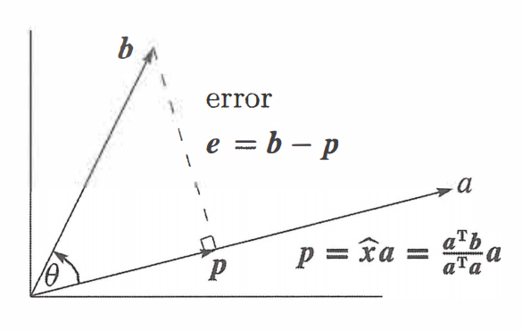
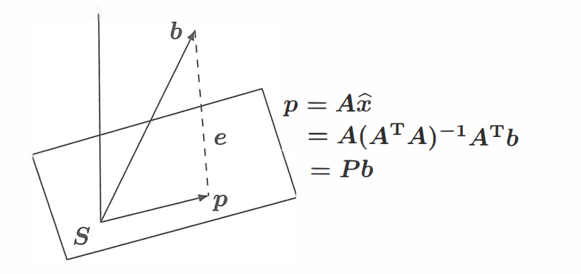

# 正交
## 正交性
### 正交向量
内积为 $0$ 的两个向量为**正交向量**，即 $\boldsymbol{x}^{T}\boldsymbol{y}=0$．
### 正交子空间
对于子空间 $S,T$，若 $\forall x\in S,\forall y\in T$ 都有 $\boldsymbol{x}^{T}\boldsymbol{y}=0$，即两个子空间的任意向量都正交，则称这两个空间为**正交子空间**．

如果两个正交子空间存在公共向量 $\boldsymbol{x}$，则有 $\boldsymbol{x}^{T}\boldsymbol{x}=0$，故 $\boldsymbol{x=0}$．

### 正交补
如果两个正交子空间充满了整个向量空间，那么称这两个空间为**正交补**．例如，行空间与零空间就是 $\mathbb{R}^{n}$ 的正交补：从一方面，行空间的任意向量与零空间的任意向量正交（因为零空间向量与行空间的基正交）；另一方面，行空间与零空间的维度之和为整个向量空间维度（$r + (n-r)=n$），因此行空间与零空间为正交补．列空间与左零空间同理．

向量空间内的任意向量必然可以**分解为两个正交补子空间上的向量**．例如 $\mathbb{R}^{n}$ 上的任意一个 $\boldsymbol{x}$ 都可以分解为行空间分量 $\boldsymbol{x}_{row}$ 与零空间分量 $\boldsymbol{x}_{null}$．当矩阵 $A$ 作用于该向量时，只作用在其行空间分量上而不作用在零空间分量上，因为 $A\boldsymbol{x}=A(\boldsymbol{x}_{row}+\boldsymbol{x}_{null})=A\boldsymbol{x}_{row} + \boldsymbol{0}=A\boldsymbol{x}_{row}$．因此多个行空间分量相同而零空间分量不同的向量被 $A$ 映射为了同一向量，从而产生了降维；而满秩矩阵的正交补只有零向量，因此向量空间中的任意向量 $\boldsymbol{x}$ 分解到满秩矩阵的行空间上时有 $\boldsymbol{x=x}_{row}$，与原向量一一对应，不会产生降维．该结论的正确性会在后文加以证明．

现在我们可以解释 Big Picture 中的直角了：也就是两空间互为正交补．

## 投影
在进入投影部分前，我们先思考一下：为什么需要投影？

当 $A\boldsymbol{x=b}$ 无解时，我们知道本质是因为 $\boldsymbol{b}$ 不在 $A$ 的列空间内．为了求得一个近似解，我们可以将 $\boldsymbol{b}$ 以某种方式变换为 $A$ 列空间内的某个向量，这样就有解了．而**投影**正是使得近似解误差最小的变换方法．
### 投影到直线
我们先从投影到直线这种简单情况说起．在 $\mathbb{R}^{n}$ 空间中给定两个向量 $\boldsymbol{a,b}$，求 $\boldsymbol{b}$ 在 $\boldsymbol{a}$ 上的投影．我们记录该投影为 $\boldsymbol{p}$，而将原向量与投影向量的误差即为 $\boldsymbol{e}$，即 $\boldsymbol{b=p+e}$．

不妨设 $\boldsymbol{p}=\boldsymbol{a}\hat{x}$，因此 $\boldsymbol{e}=\boldsymbol{b}-\boldsymbol{a}\hat{x}$，其中 $\hat{x}$ 为常数．我们有 $\boldsymbol{e}\perp\boldsymbol{a}$，即 $\boldsymbol{a}^{T}(\boldsymbol{b}-\boldsymbol{a}\hat{x})=0$，$\hat{x}\boldsymbol{a}^{T}\boldsymbol{a}=\boldsymbol{a}^{T}\boldsymbol{b}$．因此

$$
\hat{x}=\frac{\boldsymbol{a}^{T}\boldsymbol{b}}{\boldsymbol{a}^{T}\boldsymbol{a}}\quad 
\boldsymbol{p}=\boldsymbol{a}\frac{\boldsymbol{a}^{T}\boldsymbol{b}}{\boldsymbol{a}^{T}\boldsymbol{a}}
$$

考虑一个投影矩阵 $P$，它能将任意给定的向量 $\boldsymbol{b}$ 投影 $\boldsymbol{a}$ 上得到 $\boldsymbol{p}$．由于 

$$
\boldsymbol{p}=\boldsymbol{a}\frac{\boldsymbol{a}^{T}\boldsymbol{b}}{\boldsymbol{a}^{T}\boldsymbol{a}}=
\frac{\boldsymbol{a}\boldsymbol{a}^{T}}{\boldsymbol{a}^{T}\boldsymbol{a}}\boldsymbol{b}=P\boldsymbol{b}
$$

因此 $P=\dfrac{\boldsymbol{a}\boldsymbol{a}^{T}}{\boldsymbol{a}^{T}\boldsymbol{a}}$．

接下来我们讨论矩阵 $P$ 的**性质**．

首先由于 $P$ 是由 $\boldsymbol{a}\boldsymbol{a}^{T}$（列 $\times$ 行）生成的，其秩为 $1$．我们从 $P$ 的列空间也能看出这一点：其列空间是一条经过向量 $\boldsymbol{a}$ 的直线．从列空间角度，$P\boldsymbol{b}$ 的结果是 $P$ 列向量的线性组合，落在 $\boldsymbol{P}$ 的列空间内；从集合角度，$P\boldsymbol{b}$ 的结果为 $\boldsymbol{b}$ 在 $\boldsymbol{a}$ 上的投影；因此 $P$ 的列空间只有经过 $\boldsymbol{a}$ 的直线，与秩 $1$ 相照应．

其次，由于 $\boldsymbol{a}\boldsymbol{a}^{T}$ 是对称矩阵，因此 $P$ 也是对称矩阵．

最后，如果我们对一个向量做两次投影，第二次是无效的，即 $P^{2}=P$．从公式角度来看，$P^{2}=\dfrac{\boldsymbol{a}\boldsymbol{a}^{T}}{\boldsymbol{a}^{T}\boldsymbol{a}}\cdot \dfrac{\boldsymbol{a}\boldsymbol{a}^{T}}{\boldsymbol{a}^{T}\boldsymbol{a}}=\boldsymbol{a}^{T}\boldsymbol{a}\dfrac{\boldsymbol{a}\boldsymbol{a}^{T}}{(\boldsymbol{a}^{T}\boldsymbol{a})^{2}}=\dfrac{\boldsymbol{a}\boldsymbol{a}^{T}}{\boldsymbol{a}^{T}\boldsymbol{a}}=P$．

### 投影到空间
接下来我们考虑一般情况．由于投影的目的是得到方程组的近似解，因此我们通常是将任意向量 $\boldsymbol{b}$ 投影到 $A$ 的列空间上．记住这个视角，我们会发现最后得到的公式只不过是把向量 $\boldsymbol{a}$ 替换为了矩阵 $A$．

为了方便理解，我们讨论三维空间的情况．不妨设 $A$ 是一个 $3\times2$ 的矩阵，其有两个线性无关的向量 $\boldsymbol{a}_{1},\boldsymbol{a}_{2}$（视他们为 $C(A)$ 的基），即 $A=[\boldsymbol{a}_{1},\boldsymbol{a}_{2}]$．$A$ 的向量空间是过原点的平面．$\boldsymbol{b}$ 是三维空间内的一个任意向量．同样，我们记 $\boldsymbol{b}$ 在 $C(A)$ 的投影为 $\boldsymbol{p}$，误差为 $\boldsymbol{e}$，即 $\boldsymbol{b=p+e}$．

 由于 $\boldsymbol{p}$ 在 $C(A)$ 内，因此 $\boldsymbol{p}$ 可以分解为基的线性组合，即 $\boldsymbol{p}=\boldsymbol{a}_{1}\hat{x_{1}}+\boldsymbol{a}_{2}\hat{x_{2}}=A\boldsymbol{\hat{x}}$，因此 $\boldsymbol{e=b-p=b-}A\boldsymbol{\hat{x}}$．我们知道 $\boldsymbol{e}$ 与 $C(A)$ 正交，这等价于 $\boldsymbol{e}$ 与 $C(A)$ 的基 $\boldsymbol{a}_{1}, \boldsymbol{a}_{2}$ 正交，即 

$$
\begin{cases}
\boldsymbol{a}_{1}^{T}(\boldsymbol{b}-A\boldsymbol{\hat{x}})=\boldsymbol{0} \\ 
\boldsymbol{a}_{2}^{T}(\boldsymbol{b}-A\boldsymbol{\hat{x}})=\boldsymbol{0}
\end{cases}
$$

写成矩阵形式为 

$$
\begin{bmatrix}
 \boldsymbol{a}_{1}^{T} \\
  \boldsymbol{a}_{2}^{T}
\end{bmatrix}
\left(\boldsymbol{b}-A\boldsymbol{\hat{x}}\right)=\begin{bmatrix}
 0 \\
 0 
\end{bmatrix}
$$

即 

$$
A^{T}\left(\boldsymbol{b}-A\boldsymbol{\hat{x}}\right)=\boldsymbol{0}
$$

也就是 $\boldsymbol{e}$ 在 $A$ 的左零空间中．这与我们的直觉相符合，因为 $\boldsymbol{e}$ 与 $A$ 的列空间正交．

我们将方程打开得到 $A^{T}A\boldsymbol{\hat{x}}=A^{T}\boldsymbol{b}$．我们知道这个方程一定有解．也就是说，当方程组 $A\boldsymbol{x=b}$ 无解时，我们给方程组两边左乘 $A^{T}$，就可以让方程组可解，得到近似解．

继续化简方程得到 $\boldsymbol{\hat{x}}=(A^{T}A)^{-1}A^{T}\boldsymbol{b}$．从而 $\boldsymbol{p}=A\boldsymbol{x}=A(A^{T}A)^{-1}A^{T}\boldsymbol{b}$．又有 $\boldsymbol{p}=P\boldsymbol{b}$，因此将任意向量投影到 $A$ 列空间的投影矩阵为 

$$
P=A(A^{T}A)^{-1}A^{T}
$$

!!! warning "注意"

	有的人可能会用乘积逆的运算法则，将矩阵化简为 $P=A(A^{T}A)^{-1}A^{T}=AA^{-1}(A^{T})^{-1}A^{T}=I$．不能这么做的原因是我们只假设了 $A$ 列向量无关即列满秩，因此 $A^{T}A$ 是可逆方阵，而 $A$ 与 $A^{T}$ 可能不是方阵，因此分别不可逆．
	
	当然，如果 $A$ 是方阵，再加上 $A$ 为列满秩矩阵，我们得到 $A$ 本身即为可逆矩阵，此时 $P=I$ 就是正确的了．从直观上理解，$A$ 的列空间充满了整个 $\mathbb{R}^{m}$，因此任何向量往 $C(A)$ 投影都会得到其本身．

???+ question "为什么列满秩矩阵 $A$ 满足 $A^{T}A$ 可逆"

	首先 $A^TA$ 必然为方阵．如果 $A^{T}A$ 可逆，那么 $A^{T}A\boldsymbol{x=0}$ 只有零解，这是充要的．因此我们可以转化问证明 $A^{T}A\boldsymbol{x=0}$ 只有零解．
	
	两边同时左乘 $\boldsymbol{x}^{T}$ 得到 $\boldsymbol{x}^{T}A^{T}A\boldsymbol{x}=0$，即 $(A\boldsymbol{x})^{T}(A\boldsymbol{x})=0$．由于 $A\boldsymbol{x}$ 为列向量，因此该式子说明 $A\boldsymbol{x}$ 模长为 $0$，即 $A\boldsymbol{x=0}$．
	
	由于 $A$ 列满秩，因此当且仅当 $\boldsymbol{x=0}$ 有 $A\boldsymbol{x=0}$．这说明当且仅当 $\boldsymbol{x=0}$ 有 $A^{T}A\boldsymbol{x}=0$，即 $A^{T}A\boldsymbol{x}=0$ 只有零解，得证．

我们观察到 $P=A(A^{T}A)^{-1}A^{T}$ 与 $P=\dfrac{\boldsymbol{a}\boldsymbol{a}^{T}}{\boldsymbol{a}^{T}\boldsymbol{a}}$ 很相似，都是内积作为分母而内积作为分子．当 $A$ 只有一列时，其退化为后者．

如果 $\boldsymbol{b}$ 在 $C(A)$ 中，即 $\exists \boldsymbol{x}(\boldsymbol{b=}A\boldsymbol{x})$，则

$$
\boldsymbol{p}=P\boldsymbol{b}=A(A^{T}A)^{-1}A^{T}(A\boldsymbol{x})=A(A^{T}A)^{-1}(A^{T}A)\boldsymbol{x}=A\boldsymbol{x}=\boldsymbol{b}
$$

即投影向量等于本身，符合直觉．

当我们将 $\boldsymbol{b}$ 投影到 $C(A)$ 时，剩余分量 $\boldsymbol{e}$ 为 $N(A^{T})$ 内的向量，该向量对应的投影矩阵为 $I-P$，因为 $\boldsymbol{b}=P\boldsymbol{b}+(I-P)\boldsymbol{b}$．

## 最小二乘法
投影矩阵最广泛的应用就是**最小二乘法**．当我们想用直线近似几个离散点时，我们本质上是解一个线性方程组：这个线性方程组只有两个变量，分别为直线的斜率与截距；而会有多个方程限制，因此我们基本上无法满足所有方程．退而求其次，我们选择拟合误差最小的直线，而这本质上就是将数据点投影到我们的拟合直线上．

考虑用直线拟合二维坐标系上三点：$(1,1),(2,2),(3,2)$．不妨设直线方程为 $y=C+Dx$，则我们有 

$$

\begin{bmatrix}
 1 & 1 \\
 2 & 3 \\
 1 & 3 
\end{bmatrix}
\cdot
\begin{bmatrix}
 C \\
 D 
\end{bmatrix}=
\begin{bmatrix}
 1 \\
 2 \\
 2 
\end{bmatrix}

$$

与上文记号相统一，此处 

$$

A=\begin{bmatrix}
 1 & 1 \\
 2 & 3 \\
 1 & 3 
\end{bmatrix}
\quad \boldsymbol{x}=\begin{bmatrix}
 C \\
 D 
\end{bmatrix}
\quad
\boldsymbol{b}=\begin{bmatrix}
 1 \\
 2 \\
 2 
\end{bmatrix}

$$

显然方程组无解．因此我们考虑求解 $A^{T}A\boldsymbol{x}=A^{T}\boldsymbol{b}$．不妨将 $A$ 与 $\boldsymbol{b}$ 拼起来得到增广矩阵 $[A,\boldsymbol{b}]$，方便一起计算，我们有 

$$

\begin{bmatrix}
 1 & 1 & 1 \\
 1 & 2 & 3 
\end{bmatrix}
\cdot
\begin{bmatrix}
 1 & 1 & 1 \\
 1 & 2 & 2 \\
 1 & 3 & 2 
\end{bmatrix}
=\begin{bmatrix}
 3 & 6 & 5 \\
 6 & 14 & 11 
\end{bmatrix}

$$

此时我们求解 

$$

\begin{bmatrix}
 3 & 6 \\
 6 & 14 
\end{bmatrix}
\cdot
\begin{bmatrix}
 C \\
 D 
\end{bmatrix}
=\begin{bmatrix}
 5 \\
 11 
\end{bmatrix}

$$

得到

$$

\begin{cases}
C=\dfrac{2}{3} \\
D=\dfrac{1}{2}
\end{cases}

$$

因此最佳拟合直线为 $y=\dfrac{2}{3}+\dfrac{1}{2}x$．

???+ question "为什么误差最小"

	向量在列空间的投影是以垂线形式得到的最小误差 $\boldsymbol{e}$，但这并不代表我们在最小二乘中的误差是点到直线的垂直距离．实际上，由于 $\boldsymbol{e=b-}A\boldsymbol{\hat{x}}$，而 $\boldsymbol{b}$ 是我们的真实值（观测值），$A\boldsymbol{\hat{x}}_{i}$ 是我们计算出来的拟合值，他们的关系仅仅是代数加减．因此误差最小的误差指的是**真实观测值 $y_i$** 与**拟合值 $\hat{y}_i$** 之间在纵向上的**竖直距离偏差**，而不是从数据点向拟合直线作垂线所得到的几何最短距离．
	
	对于每一点拟合值 $\boldsymbol{p}_{i}=P\boldsymbol{b}_{i}$，我们在列空间内定义的误差最小其实是 $\boldsymbol{b}_{i}$ 与 $\boldsymbol{p}_{i}$ 的距离最小，即 $\boldsymbol{e}^{2}$ 最小，也就是说我们所指的误差是指 
	
	$$
	\sum\left(\boldsymbol{b}_{i}-A\boldsymbol{x}_{i}\right)=\sum \boldsymbol{e}^2_{i}
	$$
