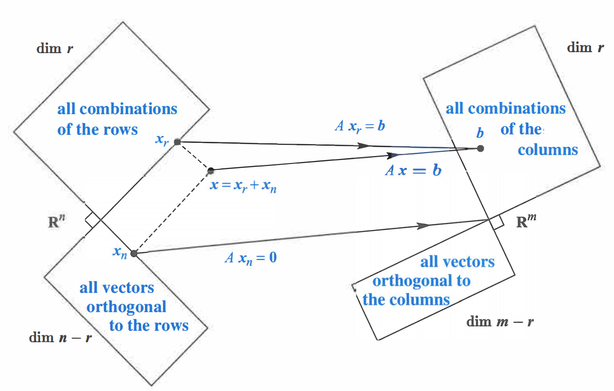
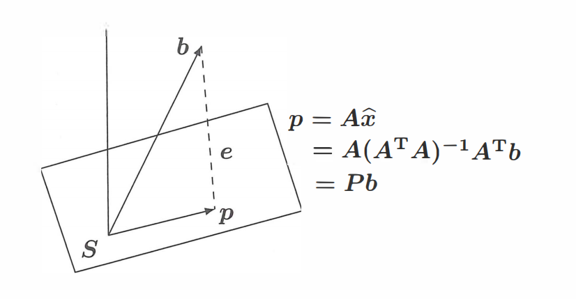
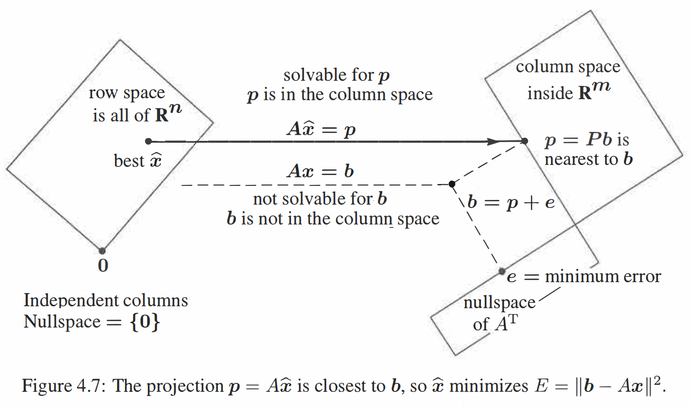

# 正交
## 正交性
### 正交向量
内积为 $0$ 的两个向量为**正交向量**，即 $\boldsymbol{x}^{T}\boldsymbol{y}=0$．
### 正交子空间
对于子空间 $S,T$，若 $\forall x\in S,\forall y\in T$ 都有 $\boldsymbol{x}^{T}\boldsymbol{y}=0$，即两个子空间的任意向量都正交，则称这两个空间为**正交子空间**．

如果两个正交子空间存在公共向量 $\boldsymbol{x}$，则有 $\boldsymbol{x}^{T}\boldsymbol{x}=0$，故 $\boldsymbol{x=0}$．

### 正交补
如果两个正交子空间充满了整个向量空间，那么称这两个空间为**正交补**．例如，行空间与零空间就是 $\mathbb{R}^{n}$ 的正交补：从一方面，行空间的任意向量与零空间的任意向量正交（因为零空间向量与行空间的基正交）；另一方面，行空间与零空间的维度之和为整个向量空间维度（$r + (n-r)=n$），因此行空间与零空间为正交补．列空间与左零空间同理．

向量空间内的任意向量必然可以**分解为两个正交补子空间上的向量**．例如 $\mathbb{R}^{n}$ 上的任意一个 $\boldsymbol{x}$ 都可以分解为行空间分量 $\boldsymbol{x}_{row}$ 与零空间分量 $\boldsymbol{x}_{null}$．当矩阵 $A$ 作用于该向量时，只作用在其行空间分量上而不作用在零空间分量上，因为 $A\boldsymbol{x}=A(\boldsymbol{x}_{row}+\boldsymbol{x}_{null})=A\boldsymbol{x}_{row} + \boldsymbol{0}=A\boldsymbol{x}_{row}$．因此多个行空间分量相同而零空间分量不同的向量被 $A$ 映射为了同一向量，从而产生了降维；而满秩矩阵的正交补只有零向量，因此向量空间中的任意向量 $\boldsymbol{x}$ 分解到满秩矩阵的行空间上时有 $\boldsymbol{x=x}_{row}$，与原向量一一对应，不会产生降维．该结论的正确性会在后文加以证明．

现在我们可以解释 Big Picture 中的直角了：也就是两空间互为正交补．

## 投影
在进入投影部分前，我们先思考一下：为什么需要投影？

当 $A\boldsymbol{x=b}$ 无解时，我们知道本质是因为 $\boldsymbol{b}$ 不在 $A$ 的列空间内．为了求得一个近似解，我们可以将 $\boldsymbol{b}$ 以某种方式变换为 $A$ 列空间内的某个向量，这样就有解了．而**投影**正是使得近似解误差最小的变换方法．
### 投影到直线
我们先从投影到直线这种简单情况说起．在 $\mathbb{R}^{n}$ 空间中给定两个向量 $\boldsymbol{a,b}$，求 $\boldsymbol{b}$ 在 $\boldsymbol{a}$ 上的投影．我们记录该投影为 $\boldsymbol{p}$，而将原向量与投影向量的误差即为 $\boldsymbol{e}$，即 $\boldsymbol{b=p+e}$．

不妨设 $\boldsymbol{p}=\boldsymbol{a}\hat{x}$，因此 $\boldsymbol{e}=\boldsymbol{b}-\boldsymbol{a}\hat{x}$，其中 $\hat{x}$ 为常数．我们有 $\boldsymbol{e}\perp\boldsymbol{a}$，即 $\boldsymbol{a}^{T}(\boldsymbol{b}-\boldsymbol{a}\hat{x})=0$，$\hat{x}\boldsymbol{a}^{T}\boldsymbol{a}=\boldsymbol{a}^{T}\boldsymbol{b}$．因此

$$
\hat{x}=\frac{\boldsymbol{a}^{T}\boldsymbol{b}}{\boldsymbol{a}^{T}\boldsymbol{a}}\quad 
\boldsymbol{p}=\boldsymbol{a}\frac{\boldsymbol{a}^{T}\boldsymbol{b}}{\boldsymbol{a}^{T}\boldsymbol{a}}
$$

考虑一个投影矩阵 $P$，它能将任意给定的向量 $\boldsymbol{b}$ 投影 $\boldsymbol{a}$ 上得到 $\boldsymbol{p}$．由于 

$$
\boldsymbol{p}=\boldsymbol{a}\frac{\boldsymbol{a}^{T}\boldsymbol{b}}{\boldsymbol{a}^{T}\boldsymbol{a}}=
\frac{\boldsymbol{a}\boldsymbol{a}^{T}}{\boldsymbol{a}^{T}\boldsymbol{a}}\boldsymbol{b}=P\boldsymbol{b}
$$

因此 $P=\dfrac{\boldsymbol{a}\boldsymbol{a}^{T}}{\boldsymbol{a}^{T}\boldsymbol{a}}$．

接下来我们讨论矩阵 $P$ 的**性质**．

首先由于 $P$ 是由 $\boldsymbol{a}\boldsymbol{a}^{T}$（列 $\times$ 行）生成的，其秩为 $1$．我们从 $P$ 的列空间也能看出这一点：其列空间是一条经过向量 $\boldsymbol{a}$ 的直线．从列空间角度，$P\boldsymbol{b}$ 的结果是 $P$ 列向量的线性组合，落在 $\boldsymbol{P}$ 的列空间内；从集合角度，$P\boldsymbol{b}$ 的结果为 $\boldsymbol{b}$ 在 $\boldsymbol{a}$ 上的投影；因此 $P$ 的列空间只有经过 $\boldsymbol{a}$ 的直线，与秩 $1$ 相照应．

其次，由于 $\boldsymbol{a}\boldsymbol{a}^{T}$ 是对称矩阵，因此 $P$ 也是对称矩阵．

最后，如果我们对一个向量做两次投影，第二次是无效的，即 $P^{2}=P$．从公式角度来看，$P^{2}=\dfrac{\boldsymbol{a}\boldsymbol{a}^{T}}{\boldsymbol{a}^{T}\boldsymbol{a}}\cdot \dfrac{\boldsymbol{a}\boldsymbol{a}^{T}}{\boldsymbol{a}^{T}\boldsymbol{a}}=\boldsymbol{a}^{T}\boldsymbol{a}\dfrac{\boldsymbol{a}\boldsymbol{a}^{T}}{(\boldsymbol{a}^{T}\boldsymbol{a})^{2}}=\dfrac{\boldsymbol{a}\boldsymbol{a}^{T}}{\boldsymbol{a}^{T}\boldsymbol{a}}=P$．

### 投影到空间
接下来我们考虑一般情况．由于投影的目的是得到方程组的近似解，因此我们通常是将任意向量 $\boldsymbol{b}$ 投影到 $A$ 的列空间上．记住这个视角，我们会发现最后得到的公式只不过是把向量 $\boldsymbol{a}$ 替换为了矩阵 $A$．

为了方便理解，我们讨论三维空间的情况．不妨设 $A$ 是一个 $3\times2$ 的矩阵，其有两个线性无关的向量 $\boldsymbol{a}_{1},\boldsymbol{a}_{2}$（视他们为 $C(A)$ 的基），即 $A=[\boldsymbol{a}_{1},\boldsymbol{a}_{2}]$．$A$ 的向量空间是过原点的平面．$\boldsymbol{b}$ 是三维空间内的一个任意向量．同样，我们记 $\boldsymbol{b}$ 在 $C(A)$ 的投影为 $\boldsymbol{p}$，误差为 $\boldsymbol{e}$，即 $\boldsymbol{b=p+e}$．

 由于 $\boldsymbol{p}$ 在 $C(A)$ 内，因此 $\boldsymbol{p}$ 可以分解为基的线性组合，即 $\boldsymbol{p}=\boldsymbol{a}_{1}\hat{x_{1}}+\boldsymbol{a}_{2}\hat{x_{2}}=A\boldsymbol{\hat{x}}$，因此 $\boldsymbol{e=b-p=b-}A\boldsymbol{\hat{x}}$．我们知道 $\boldsymbol{e}$ 与 $C(A)$ 正交，这等价于 $\boldsymbol{e}$ 与 $C(A)$ 的基 $\boldsymbol{a}_{1}, \boldsymbol{a}_{2}$ 正交，即 

$$
\begin{cases}
\boldsymbol{a}_{1}^{T}(\boldsymbol{b}-A\boldsymbol{\hat{x}})=\boldsymbol{0} \\ 
\boldsymbol{a}_{2}^{T}(\boldsymbol{b}-A\boldsymbol{\hat{x}})=\boldsymbol{0}
\end{cases}
$$

写成矩阵形式为 

$$
\begin{bmatrix}
 \boldsymbol{a}_{1}^{T} \\
  \boldsymbol{a}_{2}^{T}
\end{bmatrix}
\left(\boldsymbol{b}-A\boldsymbol{\hat{x}}\right)=\begin{bmatrix}
 0 \\
 0 
\end{bmatrix}
$$

即 

$$
A^{T}\left(\boldsymbol{b}-A\boldsymbol{\hat{x}}\right)=\boldsymbol{0}
$$

也就是 $\boldsymbol{e}$ 在 $A$ 的左零空间中．这与我们的直觉相符合，因为 $\boldsymbol{e}$ 与 $A$ 的列空间正交．实际上，我们可以直接根据 $\boldsymbol{e}$ 在 $N(A^T)$ 中而写出这个式子．

我们将方程打开得到 $A^{T}A\boldsymbol{\hat{x}}=A^{T}\boldsymbol{b}$．我们知道这个方程一定有解．也就是说，当方程组 $A\boldsymbol{x=b}$ 无解时，我们给方程组两边左乘 $A^{T}$，就可以让方程组可解，得到近似解．

继续化简方程得到 $\boldsymbol{\hat{x}}=(A^{T}A)^{-1}A^{T}\boldsymbol{b}$．从而 $\boldsymbol{p}=A\boldsymbol{x}=A(A^{T}A)^{-1}A^{T}\boldsymbol{b}$．又有 $\boldsymbol{p}=P\boldsymbol{b}$，因此将任意向量投影到 $A$ 列空间的投影矩阵为 

$$
P=A(A^{T}A)^{-1}A^{T}
$$

!!! warning "注意"

	有的人可能会用乘积逆的运算法则，将矩阵化简为 $P=A(A^{T}A)^{-1}A^{T}=AA^{-1}(A^{T})^{-1}A^{T}=I$．不能这么做的原因是我们只假设了 $A$ 列向量无关即列满秩，因此 $A^{T}A$ 是可逆方阵，而 $A$ 与 $A^{T}$ 可能不是方阵，因此分别不可逆．
	
	当然，如果 $A$ 是方阵，再加上 $A$ 为列满秩矩阵，我们得到 $A$ 本身即为可逆矩阵，此时 $P=I$ 就是正确的了．从直观上理解，$A$ 的列空间充满了整个 $\mathbb{R}^{m}$，因此任何向量往 $C(A)$ 投影都会得到其本身．
	
	???+ question "为什么列满秩矩阵 $A$ 满足 $A^{T}A$ 可逆"
	
		首先 $A^TA$ 必然为方阵．如果 $A^{T}A$ 可逆，那么 $A^{T}A\boldsymbol{x=0}$ 只有零解，这是充要的．因此我们可以转化问证明 $A^{T}A\boldsymbol{x=0}$ 只有零解．
		
		两边同时左乘 $\boldsymbol{x}^{T}$ 得到 $\boldsymbol{x}^{T}A^{T}A\boldsymbol{x}=0$，即 $(A\boldsymbol{x})^{T}(A\boldsymbol{x})=0$．由于 $A\boldsymbol{x}$ 为列向量，因此该式子说明 $A\boldsymbol{x}$ 模长为 $0$，即 $A\boldsymbol{x=0}$．
		
		由于 $A$ 列满秩，因此当且仅当 $\boldsymbol{x=0}$ 有 $A\boldsymbol{x=0}$．这说明当且仅当 $\boldsymbol{x=0}$ 有 $A^{T}A\boldsymbol{x}=0$，即 $A^{T}A\boldsymbol{x}=0$ 只有零解，得证．

我们观察到 $P=A(A^{T}A)^{-1}A^{T}$ 与 $P=\dfrac{\boldsymbol{a}\boldsymbol{a}^{T}}{\boldsymbol{a}^{T}\boldsymbol{a}}$ 很相似，都是内积作为分母而内积作为分子．当 $A$ 只有一列时，其退化为后者．

如果 $\boldsymbol{b}$ 在 $C(A)$ 中，即 $\exists \boldsymbol{x}(\boldsymbol{b=}A\boldsymbol{x})$，则

$$
\boldsymbol{p}=P\boldsymbol{b}=A(A^{T}A)^{-1}A^{T}(A\boldsymbol{x})=A(A^{T}A)^{-1}(A^{T}A)\boldsymbol{x}=A\boldsymbol{x}=\boldsymbol{b}
$$

即投影向量等于本身，符合直觉．

当我们将 $\boldsymbol{b}$ 投影到 $C(A)$ 时，剩余分量 $\boldsymbol{e}$ 为 $N(A^{T})$ 内的向量，该向量对应的投影矩阵为 $I-P$，因为 $\boldsymbol{b}=P\boldsymbol{b}+(I-P)\boldsymbol{b}$．

在前一节的 Big Picture 中，我们将 $\boldsymbol{x}$ 分解成行空间分量 $\boldsymbol{x}_{row}$ 与零空间分量 $\boldsymbol{x}_{null}$；在本节中，我们将 $\boldsymbol{b}$ 分解成列空间分量 $\boldsymbol{p}$ 与左零空间分量 $\boldsymbol{e}$．

    

## 最小二乘法
投影矩阵最广泛的应用就是**最小二乘法**．当我们想用直线近似几个离散点时，我们本质上是解一个线性方程组：这个线性方程组只有两个变量，分别为直线的斜率与截距；而会有多个方程限制，因此我们基本上无法满足所有方程．退而求其次，我们选择拟合误差最小的直线，而这本质上就是将数据点投影到我们的拟合直线上．

### 拟合三个点
考虑用直线拟合二维坐标系上三点：$(1,1),(2,2),(3,2)$．不妨设直线方程为 $y=C+Dx$，则我们有 

$$
\begin{bmatrix}
 1 & 1 \\
 2 & 3 \\
 1 & 3 
\end{bmatrix}
\cdot
\begin{bmatrix}
 C \\
 D 
\end{bmatrix}=
\begin{bmatrix}
 1 \\
 2 \\
 2 
\end{bmatrix}
$$

与上文记号相统一，此处 

$$
A=\begin{bmatrix}
 1 & 1 \\
 2 & 3 \\
 1 & 3 
\end{bmatrix}
\quad \boldsymbol{x}=\begin{bmatrix}
 C \\
 D 
\end{bmatrix}
\quad
\boldsymbol{b}=\begin{bmatrix}
 1 \\
 2 \\
 2 
\end{bmatrix}
$$

显然方程组无解．因此我们考虑求解 $A^{T}A\boldsymbol{x}=A^{T}\boldsymbol{b}$．不妨将 $A$ 与 $\boldsymbol{b}$ 拼起来得到增广矩阵 $[A,\boldsymbol{b}]$，方便一起计算，我们有 

$$
\begin{bmatrix}
 1 & 1 & 1 \\
 1 & 2 & 3 
\end{bmatrix}
\cdot
\begin{bmatrix}
 1 & 1 & 1 \\
 1 & 2 & 2 \\
 1 & 3 & 2 
\end{bmatrix}
=\begin{bmatrix}
 3 & 6 & 5 \\
 6 & 14 & 11 
\end{bmatrix}
$$

此时我们求解 

$$
\begin{bmatrix}
 3 & 6 \\
 6 & 14 
\end{bmatrix}
\cdot
\begin{bmatrix}
 C \\
 D 
\end{bmatrix}
=\begin{bmatrix}
 5 \\
 11 
\end{bmatrix}
$$

得到

$$
\begin{cases}
C=\dfrac{2}{3} \\
D=\dfrac{1}{2}
\end{cases}
$$

因此最佳拟合直线为 $y=\dfrac{2}{3}+\dfrac{1}{2}x$．

???+ question "为什么误差最小"

	向量在列空间的投影是以垂线形式得到的最小误差 $\boldsymbol{e}$，但这并不代表我们在最小二乘中的误差是点到直线的垂直距离．实际上，由于 $\boldsymbol{e=b-}A\boldsymbol{\hat{x}}$，而 $\boldsymbol{b}$ 是我们的真实值（观测值），$(A\boldsymbol{\hat{x}})_{i}$ 是我们计算出来的拟合值，他们的关系仅仅是代数加减．因此误差最小的误差指的是**真实观测值 $y_i$** 与**拟合值 $\hat{y}_i$** 之间的**竖直距离偏差**，而不是从数据点向拟合直线作垂线所得到的几何最短距离．
	
	对于空间内任意一个 $\boldsymbol{b}$，其有两个分量：在 $A$ 列空间上的分量 $\boldsymbol{p}$ 与在 $A$ 左零空间上的分量  $\boldsymbol{e}$．由于列空间与左零空间正交，由勾股定理，对于我们的拟合向量 $A\boldsymbol{x}$，误差为
	
	$$
	\|A\boldsymbol{x}-\boldsymbol{b}\|^{2}=\|A\boldsymbol{x}-\boldsymbol{p}\|^{2}+\|\boldsymbol{e}\|^{2}
	$$
	
	我们无法改变 $\|\boldsymbol{e^{2}}\|$ 的大小，只能通过调整 $\boldsymbol{x}$ 来让 $\|A\boldsymbol{x}-\boldsymbol{p}\|$ 最小，即 $A\boldsymbol{x=p}$，此时 $\|A\boldsymbol{x}-\boldsymbol{b}\|^{2}=\|\boldsymbol{e}\|^{2}$．
	
	而转化为坐标系中，由于 $\boldsymbol{e}$ 是一个 $3$ 维向量，因此 $\|\boldsymbol{e}^{2}\|=e_{1}^{2}+e_{2}^{2}+e_{3}^{2}$，即为竖直距离偏差平方和．
	
	实际上，我们也可以通过对 $E=\|A\boldsymbol{x}-\boldsymbol{b}\|^{2}=(C+D-1)^{2}+(C+2D-2)^{2}+(C+3D-2)^{2}$ 求偏导来计算极值，得到的结果与使用线性代数得到的结果一样．

### 拟合m个点
接下来我们将其扩展到直线拟合 $m$ 个点的情况．不妨设这 $m$ 个点的坐标为 $(t_{i}, b_{i})$，则我们有

$$
\begin{aligned}
&C+Dt_{1}=b_{1} \\
&C+Dt_{2}=b_{2} \\
&\qquad\vdots \\
&C+Dt_{m}=b_{m}
\end{aligned}
$$

因此矩阵 $A$、$A^{T}A$、$A^{T}\boldsymbol{b}$ 分别为

$$
A=\begin{bmatrix}
 1 & t_{1} \\
 1 & t_{2}  \\
\vdots & \vdots  \\
1 & t_{m} 
\end{bmatrix}
\quad
A^{T}A=\begin{bmatrix}
 m & \sum t_{i} \\
 \sum t_{i} & \sum t_{i}^{2} 
\end{bmatrix}
\quad
A^{T}\boldsymbol{b}=\begin{bmatrix}
 \sum b_{i} \\
\sum t_{i}b_{i}
\end{bmatrix}
$$

因此最佳拟合直线即为 $A^{T}A\boldsymbol{\hat x}=A^{T}\boldsymbol{b}$ 的解，即 

$$
\begin{bmatrix}
 m & \sum t_{i} \\
 \sum t_{i} & \sum t_{i}^{2} 
\end{bmatrix}
\begin{bmatrix}
 C \\
D
\end{bmatrix}=
\begin{bmatrix}
 \sum b_{i} \\
\sum t_{i}b_{i}
\end{bmatrix}
$$

其中误差为 $E=\|A\boldsymbol{x-b} \|^{2}=\sum(C+Dt_{i}-b_{i})^{2}$．

### 正交的优势
如果 $A$ 的两列是正交的，由于其第一列均为 $1$，因此等价于第二列和为 $0$．即 $\sum t_{i}=0$，我们会得到

$$
A^{T}A=\begin{bmatrix}
 m & 0 \\
 0 & \sum t_{i}^{2} 
\end{bmatrix}
$$

其成为了一个对角矩阵．而对角矩阵解方程是很容易的，可以轻松解得

$$
\begin{cases}
C=\dfrac{\sum b_{i}}{m}=\bar b \\
D=\dfrac{\sum t_{i}b_{i}}{\sum t_{i}^{2}}
\end{cases}
$$

事实上，我们可以手动构造出正交列．将所有的待拟合点横坐标全部减去 $\bar t=\sum t_{i}/m$，即新坐标 $t_{i}'=t_{i}-\bar t$，此时显然有 $\sum t_{i}'=0$，可以轻松地计算出 $C'=\bar b$ 与 $D$（平移不改变斜率）．拟合出的直线结果实际上是 $b=\bar{b}+D(t-\bar t)$，展开得到 $b=Dt+(\bar b-D\bar t)$，原始方程 $b=C+Dt$ 中的截距 $C=\bar b-D\bar t$．

### 拟合二次函数
最小二乘法亦适用于拟合高次函数．以二次函数 $C+Dt+Et^{2}$ 举例，虽然函数本身不线性，但将具体的点带入后其成为一个线性方程组．与一次函数不同的是，此时的矩阵 $A$ 会有三列．

## 正交矩阵
上一节中我们知道，如果 $A$ 的列向量之间正交，$A^{T}A$ 的结果会是对角矩阵．实际上，若 $A$ 的列向量之间正交且内积为 $1$，$A^{T}A$ 会成为单位矩阵 $I$，从而更加方便我们计算．

记向量组 $\boldsymbol{q}_{1},\cdots,\boldsymbol{q}_{n}$ 是**标准正交**的，当且仅当

$$
\boldsymbol{q}_{i}^{T}\boldsymbol{q}_{j}=\begin{cases}
0\quad i\neq j \\
1\quad i=j
\end{cases}
$$

即该向量组内每一个向量均为单位向量，且两两正交．我们记由标准正交向量组当作列向量拼成的矩阵 $Q$ 为**列正交矩阵**，则 $Q^{T}Q=I$．

特别的，当 $Q$ 为方阵时，称其为**正交矩阵**．由 $Q^{T}Q=I$ 我们得到 $Q^{T}=Q^{-1}$，即正交矩阵的转置与逆相等．

### 常见正交矩阵
**旋转矩阵**：如

$$
\begin{bmatrix}
 \cos{\theta} & -\sin{\theta} \\
 \sin{\theta} & \cos{\theta} 
\end{bmatrix}
$$

**置换矩阵**：由于 $P$ 是 $I$ 进行任意次行交换后的矩阵，显然 $P$ 满足每行有且仅有一个 $1$、每列有且仅有一个 $1$，因此其符合标准正交性．

**反射矩阵**：对于任意单位向量 $\boldsymbol{u}$，反射矩阵 $Q=I-2\boldsymbol{uu}^{T}$ 的效果是将向量 $\boldsymbol{x}$ 沿垂直 $\boldsymbol{u}$ 的子空间进行镜像操作．

???+ quote "反射矩阵的证明"

	$\boldsymbol{u}$ 是镜像空间的法向量．将 $\boldsymbol{x}$ 做镜像操作，等价于将其关于镜像空间的平行分量保留而翻转垂直分量，亦等价于将其关于法向量 $\boldsymbol{u}$ 的垂直分量保留而翻转平行分量．
	
	$\boldsymbol{x}$ 关于镜像空间的垂直分量，即$\boldsymbol{x}$ 关于 $\boldsymbol{u}$ 的平行分量，即为 $\boldsymbol{x}$ 到 $\boldsymbol{u}$ 的投影，为 $\boldsymbol{x}_{\perp}=\dfrac{\boldsymbol{uu}^{T}}{\boldsymbol{u}^{T}\boldsymbol{u}}\boldsymbol{x}=\boldsymbol{uu}^{T}\boldsymbol{x}$；同理可得关于镜像空间的平行分量为 $\boldsymbol{x}_{\parallel}=\boldsymbol{x}-\boldsymbol{x}_{\perp}$．
	
	因此，反射结果为 $\boldsymbol{x}_{\parallel}-\boldsymbol{x}_{\perp}=\boldsymbol{x}-2\boldsymbol{x}_{\perp}=\boldsymbol{x}-2\boldsymbol{uu}^{T}\boldsymbol{x}=(I-2\boldsymbol{uu}^{T})\boldsymbol{x}$．可得反射矩阵 $Q=I-2\boldsymbol{uu}^{T}$．

显然 $Q$ 为对称矩阵，则 $Q^{T}Q=Q^{2}=(I-2\boldsymbol{uu}^{T})^{2}=I-4\boldsymbol{uu}^{T}+4\boldsymbol{uu}^{T}\boldsymbol{uu}^{T}=I$．所以反射矩阵 $Q$ 十分特殊，其满足 $Q=Q^{T}=Q^{-1}$．

### 正交变换
正交矩阵对向量的变换称为**正交变换**，其不改变向量的长度与向量间的角度．由于长度和角度的本质都是向量内积，因此只需证明正交变换不改变向量内积结果．对于向量 $\boldsymbol{x,y}$，正交变换后的内积

$$
(Q\boldsymbol{x})^{T}(Q\boldsymbol{y})=\boldsymbol{x}^{T}Q^{T}Q\boldsymbol{y}=\boldsymbol{x}^{T}\boldsymbol{y}
$$

与正交变换前的内积相等．因此我们证明了其长度与角度的不变性．

### 标准正交基投影
当我们求 $\boldsymbol{b}$ 往某一子空间的投影时，如果选取该投影空间的一组标准正交基，形成列正交矩阵 $Q$，则有 $Q^{T}Q\boldsymbol{\hat x}=Q^{T}\boldsymbol{b}$，因此 $\boldsymbol{\hat x}=Q^{T}\boldsymbol{b}$．此时投影向量为 $QQ^{T}\boldsymbol{b}$，投影矩阵为 $QQ^{T}$．

由于列正交矩阵的特殊性，$QQ^{T}=\boldsymbol{q}_{1}\boldsymbol{q}_{1}^{T}+\cdots+\boldsymbol{q}_{n}\boldsymbol{q}_{n}^{T}$，因此投影向量为

$$
QQ^{T}\boldsymbol{b}=(\boldsymbol{q}_{1}\boldsymbol{q}_{1}^{T}+\cdots+\boldsymbol{q}_{n}\boldsymbol{q}_{n}^{T})\boldsymbol{b}=\boldsymbol{q}_{1}(\boldsymbol{q}_{1}^{T}\boldsymbol{b})+\cdots +\boldsymbol{q}_{n}(\boldsymbol{q}_{n}^{T}\boldsymbol{b})
$$

即求 $\boldsymbol{b}$ 在目标子空间的投影时，若选取一组标准正交基，那么投影结果等价于往每一个基向量上投影再直接相加．

### Gram-Schmidt 正交化
由于列正交矩阵拥有许多良好性质，因此我们希望将我们的矩阵转化为同一子空间内的列正交矩阵．不妨设三维子空间的三个线性无关向量 $\boldsymbol{a}_{1},\boldsymbol{a}_{2},\boldsymbol{a}_{3}$，我们的目标是构造出一组标准正交基．

首先是将其**正交化**．考虑正交化后的向量为 $\boldsymbol{v}_{1},\boldsymbol{v}_{2},\boldsymbol{v}_{3}$，任取第一个向量，如 $\boldsymbol{v}_{1}=\boldsymbol{a}_{1}$；然后对于后续向量，减去其在已选择的向量上的分量．

如对于 $\boldsymbol{a}_{2}$，其减去自身在 $\boldsymbol{v}_{1}$ 上的投影，得到的向量 $\boldsymbol{v}_{2}=\boldsymbol{a}_{2}-\dfrac{\boldsymbol{v}_{1}^{T}\boldsymbol{a}_{2}}{\boldsymbol{v}_{1}^{T}\boldsymbol{v}_{1}}\boldsymbol{v}_{1}$ 满足 $\boldsymbol{v}_{1},\boldsymbol{v}_{2}$ 生成空间与 $\boldsymbol{a}_{1},\boldsymbol{a}_{2}$ 生成空间一样的前提下 $\boldsymbol{v}_{1},\boldsymbol{v}_{2}$ 正交．

同理有 

$$
\boldsymbol{v}_{3}=\boldsymbol{a}_{3}-\dfrac{\boldsymbol{v}_{1}^{T}\boldsymbol{a}_{3}}{\boldsymbol{v}_{1}^{T}\boldsymbol{v}_{1}}\boldsymbol{v}_{1}-\dfrac{\boldsymbol{v}_{2}^{T}\boldsymbol{a}_{3}}{\boldsymbol{v}_{2}^{T}\boldsymbol{v}_{2}}\boldsymbol{v}_{2}
$$

得到正交基后，将其**单位化**．这一步很简单，除以各自模长即可．最后得到 $Q=[\boldsymbol{q}_{1},\boldsymbol{q}_{2},\boldsymbol{q}_{3}]$．

### A的QR分解
经过正交化后得到的正交矩阵 $Q$ 与原矩阵 $A$ 在同一子空间中，这意味着这两个矩阵的列向量之间一定可以互相表示．事实上这又是一个矩阵分解的思路，可以将 $A$ 分解为 $QR$．

事实上，由于计算 $\boldsymbol{q}_{i}$ 时只用到了 $j\le i$ 的 $\boldsymbol{a}_{j}$，因此 $R$ 矩阵一定是一个三角矩阵，确切而言是上三角矩阵．考虑将原矩阵的列向量分解到标准正交基上，由于上述性质以及标准正交基投影的性质，可以得到 

$$
\begin{cases}
\boldsymbol{a_{1}}=\boldsymbol{q}_{1}(\boldsymbol{q_{1}}^{T}\boldsymbol{a}_{1}) \\
\boldsymbol{a_{2}}=\boldsymbol{q}_{1}(\boldsymbol{q_{1}}^{T}\boldsymbol{a}_{2})+\boldsymbol{q}_{2}(\boldsymbol{q_{2}}^{T}\boldsymbol{a}_{2}) \\
\boldsymbol{a_{3}}=\boldsymbol{q}_{1}(\boldsymbol{q_{1}}^{T}\boldsymbol{a}_{3})+\boldsymbol{q}_{2}(\boldsymbol{q_{2}}^{T}\boldsymbol{a}_{3})+\boldsymbol{q}_{3}(\boldsymbol{q_{3}}^{T}\boldsymbol{a}_{3})
\end{cases}
$$

矩阵形式即为 

$$
\begin{bmatrix}
  &  &  \\
 \boldsymbol{a}_{1} & \boldsymbol{a}_{2} & \boldsymbol{a}_{3} \\
  &  &  
\end{bmatrix}=\begin{bmatrix}
  &  &  \\
 \boldsymbol{q}_{1} & \boldsymbol{q}_{2} & \boldsymbol{q}_{3} \\
  &  &  
\end{bmatrix}
\begin{bmatrix}
 \boldsymbol{q_{1}}^{T}\boldsymbol{a}_{1} & \boldsymbol{q_{1}}^{T}\boldsymbol{a}_{2} & \boldsymbol{q_{1}}^{T}\boldsymbol{a}_{3} \\
  & \boldsymbol{q_{2}}^{T}\boldsymbol{a}_{2} & \boldsymbol{q_{2}}^{T}\boldsymbol{a}_{3} \\
  &  & \boldsymbol{q_{3}}^{T}\boldsymbol{a}_{3}
\end{bmatrix}
$$

即 $A=QR$．使用了该分解后，我们有 

$$
A^{T}A=(QR)^{T}QR=R^{T}Q^{T}QR=R^{T}R
$$

则 $A^{T}A\boldsymbol{\hat x}=A^{T}\boldsymbol{b}$ 化简为 $R^{T}R\boldsymbol{\hat x}=R^{T}Q^{T}\boldsymbol{b}$．而 $R^{T}$ 是下三角矩阵，由于对角线元素（$\boldsymbol{a}_{i}$ 在 $\boldsymbol{q}_{i}$ 上的投影长度，即归一化前的模长 $\|\boldsymbol{v}_{i}\|$，若原向量组线性无关必然不为 $0$）不为 $0$，则 $R^{T}$ 可逆，因此 $R\boldsymbol{\hat x}=Q^{T}\boldsymbol{b}$．由于 $R$ 为上三角矩阵，只需从下到上回代即可轻易解出方程组．