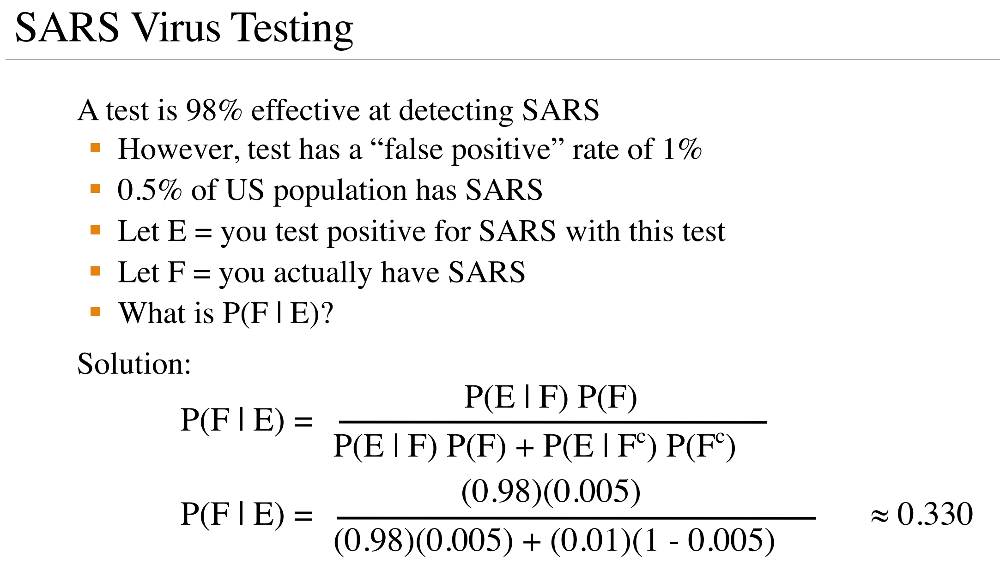
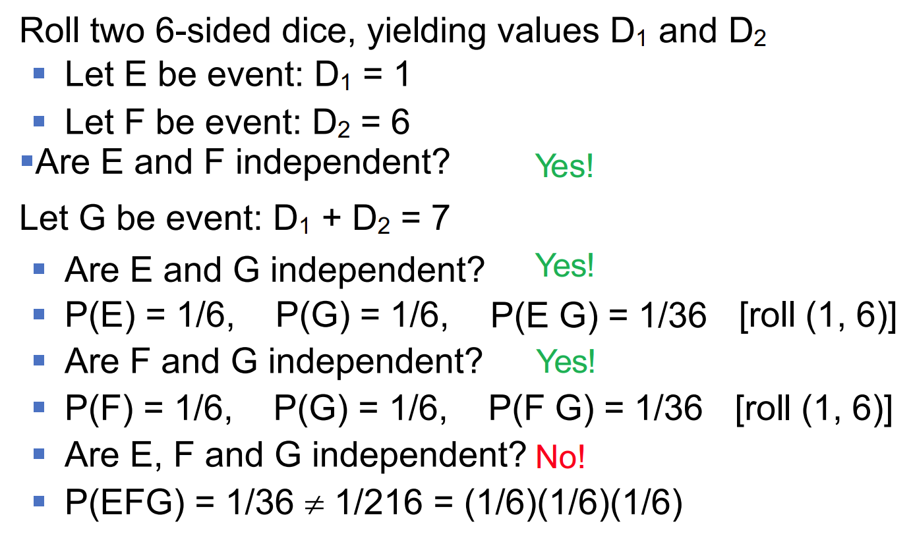

# Core Probability
## 概率基础概念
**随机试验**：

+ 可以在相同的条件下重复进行．
+ 每次试验的可能结果不止一个，并且能事先明确试验的所有可能结果．
+ 进行一次试验前不能预知结果．

**样本点**（outcome）：一次随机试验的结果．

**样本空间**（Sample Space）$S$：随机试验的所有可能结果构成的集合．

**事件** $E$：样本空间的任一子集．

**事件的运算**（此部分与离散数学中[命题关系](../discrete-math/Chap1.md#31-logical-equivalences)基本一致）：

+ 和事件：$A\cup B=\{x\mid x\in A \text{ or }x\in B\}$
+ 积事件：$A\cap B=AB=\{x\mid x\in A \text{ and }x\in B\}$
+ 差事件：$A - B = A \cap \overline{B} = \{x\mid x \in A \text{ and }\notin B\}$
+ 交换律：
	+ $A \cup B = B \cup A$
	+ $A \cap B = B \cap A$
+ 结合律：
	+ $A \cup (B \cup C) = (A \cup B) \cup C$
	+ $A \cap (B \cap C) = (A \cap B) \cap C$
+ 分配律：
	+ $A \cap (B \cup C) = (A \cap B) \cup (A \cap C)$
	+ $A \cup (B \cap C) = (A \cup B) \cap (A \cup C)$
+ 德摩根定律：
	+ $\overline{\bigcup\limits_{j=1}^n A_j} = \bigcap\limits_{j=1}^n \overline{A_j}$
	+ $\overline{\bigcap\limits_{j=1}^n A_j} = \bigcup\limits_{j=1}^n \overline{A_j}$

**事件的关系**：

+ 包含：$A\subset B$ 称为 $B$ 包含 $A$，指事件 $A$ 发生必然导致事件 $B$ 发生．
+ 互斥事件：$A\cap B=\emptyset$．
+ 对立事件：$A\cap B=\emptyset$ 且 $A\cup B=S$．

**概率**：

$$
\text{P}(\text{E})=\lim_{n\to \infty}\dfrac{n(E)}{n}
$$

### 公理
1. 非负性：$0\le \text{P}(E) \leq 1$
2. 规范性：$\text{P}(S)=1$
3. 可列可加性：若 $E$ 与 $F$ 互斥，则 $\text{P}(E\cap F)=\text{P}(E)+\text{P}(F)$

推论：$\text{P}(E)+\text{P}(\overline{E})=1$

### 等可能结果
如果每一个样本点出现的可能性相等，每个样本点的概率为 $\dfrac{1}{|S|}$．因此

$$
\text{P}(E)=\frac{\text{\# outcomes in E}}{\text{\# outcomes in S}}=\frac{|E|}{|S|}
$$

注意：为了保证等可能，计算事件时要将每一个元素看作不同的，比如骰子的 $(2,1)$ 与 $(1,2)$．

## 条件概率
事件 $E$ 在事件 $F$ 已经发生时的概率称为条件概率，记为 $\text{P}(E \mid F)$．此时样本空间为 $F$，事件为 $E\cap F$，因此

$$
\text{P}(E \mid F) =\dfrac{\text{P}(EF)}{\text{P}(F)}=\dfrac{|EF|}{|F|}
$$

### 乘法公式
当 $\text{P}(E)\ne 0,\text{P}(F)\neq 0$ 时，有

$$
\text{P}(EF)=\text{P}(E)\cdot \text{P}(F \mid E)=\text{P}(F)\cdot \text{P}(E \mid F)
$$

**链式法则**：我们用 $\text{P}(E_{j}\mid E_{1},E_{2},\cdots,E_{n})$ 表示事件 $E_{1}\sim E_{n}$ 都发生时事件 $E_{j}$ 的发生概率．则有 

$$
\text{P}(E_{1}E_{2}\cdots E_{n})=\text{P}(E_{1})\cdot \text{P}(E_{2} \mid E_{1})\cdot \text{P}(E_{3} \mid E_{1},E_{2})\cdots \text{P}(E_{n} \mid E_{1},E_{2}\cdots E_{n-1}) 
$$

### 全概率公式
将样本空间 $S$ 分为互斥且充满整个样本空间的事件 $B_{1},B_{2},\cdots,B_{n}$，即

+ $B_{i}\cap B_{j}=\emptyset$
+ $\bigcup_{i=1}^{n}{B_{i}}=S$

则

$$
\begin{aligned}
\text{P}(E)&=\sum_{i=1}^{n}\text{P}(EB_{i})\\
&=\sum_{i=1}^{n}\text{P}(B_{i})\text{P}(E \mid B_{i}) 
\end{aligned}
$$

该公式称为**全概率公式**（Law of Total Probability）．

### 贝叶斯公式
**贝叶斯公式**（Bayes' Theorem）用于求解逆向的条件概率，其二维形式为：

$$
\text{P}(F \mid E)=\dfrac{\text{P}(EF)}{\text{P}(E)}=\dfrac{\text{P}(E \mid F)\text{P}(F) }{\text{P}(E \mid F) \text{P}(F)+\text{P}(E \mid \overline{F})\text{P}(\overline{F})} 
$$

 + $\text{P}(F)$ 是观测到新证据（$E$）前的判断，被称为**先验概率**．
 + $\text{P}(F \mid E)$ 是观测到新证据后的判断，被称为**后验概率**．
 + $\text{P}(E \mid F)$ 是证据 $E$ 与假设 $F$ 的相符程度，称为**似然度**．

$n$ 维形式：

$$
\text{P}(B_{i} \mid E)=\dfrac{\text{P}(EB_{i})}{\text{P}(E)}=\dfrac{\text{P}(E \mid B_{i})\text{P}(B_{i})}{\sum_{i=1}^{n}\text{P}(B_{i})\text{P}(E \mid B_{i})}
$$

???+ example "例：SARS病毒"

	

	
	

	
	在该例中，似然度 $\text{P}(E \mid F)$ 高达 $0.98$，但由于先验概率 $\text{P}(F)$ 只有 $0.005$，导致后验概率也只有 $0.330$．
	
	因此，不建议对全人类进行罕见病的筛查，因为先验概率太低时会产生大量的假阳性病例浪费医疗资源；而先通过初步门诊增大先验概率，此时检测结果才真正具有决定性．

## 独立性
对于事件 $E,F$，如果 $E$ 的概率恰好等于 $F$ 已经发生时 $E$ 的概率（反之亦然），即 $\text{P}(E)=\text{P}(E \mid F)$，则称事件 $E,F$ 独立．

**推论**：$E,F$ 独立时有 

$$
\text{P}(EF)=\text{P}(E \mid F)\cdot \text{P}(F)=\text{P}(E)\cdot \text{P}(F)
$$

即积事件概率等于单独事件概率积，此推论也可用于独立性的判定．由此推论我们还可以得出：当 $\text{P}(E)=\text{P}(E \mid F)$ 时必然有 $\text{P}(F)=\text{P}(F \mid E)$．

!!! warning "理解错误"

	两事件独立并不一定代表两个事件互不影响，而只代表一个事件发生与否不影响另一个事件的发生概率．例如掷骰子，事件 $A$ 为“点数为偶数”，事件 $B$ 为“点数小于5”；$\text{P}(AB)=\dfrac{1}{3}=\dfrac{1}{2}\cdot \dfrac{2}{3}=\text{P}(A)\cdot \text{P}(B)$，但显然事件 $B$ 发生会影响事件 $A$，因为无法得到 $6$ 这个样本点． 

如果 $A,B$ 独立，那么 $A,\overline{B}$、$\overline{A},B$、$\overline{A},\overline{B}$ 均独立．以 $A,\overline{B}$ 为例：

$$
\begin{aligned}
\text{P}(A\overline{B})&=\text{P}(A)-\text{P}(AB)\\
&=\text{P}(A)-\text{P}(A)\text{P}(B)\\
&=\text{P}(A)[1-\text{P}(B)]\\
&=\text{P}(A)\text{P}(\overline{B})．
\end{aligned}
$$

### 相互独立
对于 $n$ 个事件，其**相互独立**的充要条件为：在 $n$ 个事件中任选 $r$ 个事件，均有

$$
\text{P}(E_{i_{1}}E_{i_{2}}\cdots E_{i_{n}})=\text{P}(E_{i_{1}})\cdot \text{P}(E_{i_{2}})\cdots \text{P}(E_{i_{r}})
$$

???+ example "例"

	对于三个事件 $A,B,C$，其相互独立要满足
	
	$$
	\begin{cases}
	\text{P}(AB)=\text{P}(A)\cdot \text{P}(B)\\
	\text{P}(AC)=\text{P}(A)\cdot \text{P}(C)\\ 
	\text{P}(BC)=\text{P}(B)\cdot \text{P}(C)\\ 
	\text{P}(ABC)=\text{P}(A)\cdot \text{P}(B)\cdot \text{P}(C)\\
	\end{cases}
	$$
	
	如下图，$E,F,G$ 两两独立但不相互独立．
	
	

	
	

### 条件独立
若 $\text{P}(E_{1},E_{2}\mid F)=\text{P}(E_{1} \mid F)\cdot \text{P}(E_{2} \mid F)$ 或 $\text{P}(E_{1}\mid G)=\text{P}(E_{1} \mid E_{2},G)$，则称事件 $E_{1},E_{2}$ 在给定事件 $F$ 下条件独立．条件独立不一定有独立，独立也不一定有条件独立．