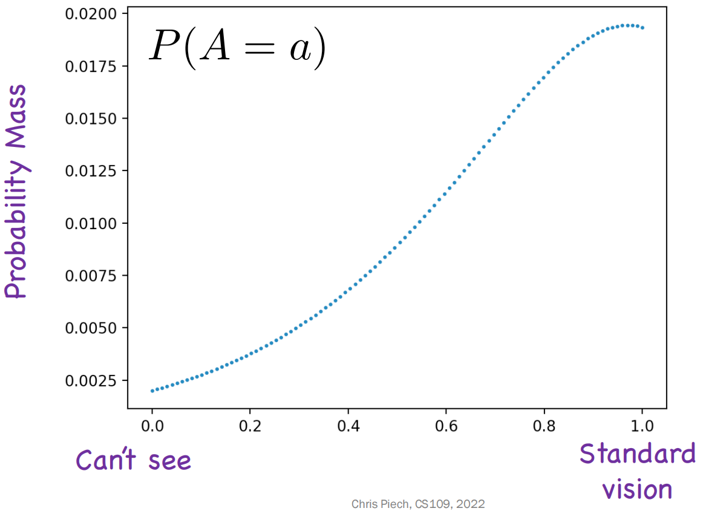
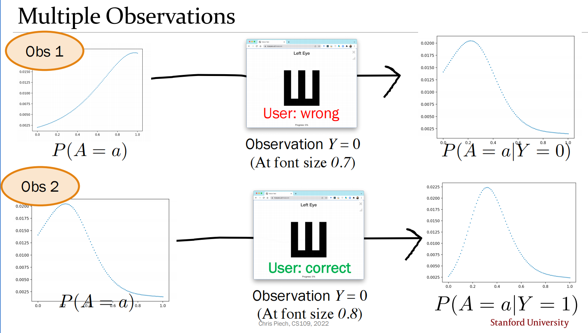

# Probabilistic Models
## 联合分布
### 离散联合分布
考虑两个离散变量 $X,Y$，则两个变量的**联合离散分布**函数接收每个变量的取值，并返回变量取该值的概率，记作 $\text{P}(X=x, Y=y)$，简写为 $\text{P}(x,y)$．

**联合概率表**：对于离散变量，可以将每个变量的所有可能情况枚举出来做成表．每多一个变量表就会多一个维度．

### 连续联合分布
如果存在一个联合概率密度函数 $f$ 使得

$$
\text{P}(a_{1}<X\leq a_{2},b_{1}<Y\leq b_{2})=\int_{a_{1}}^{a_{2}}\int_{b_{1}}^{b_{2}}f(X=x, Y=y)dy\,dx
$$

则称连续随机变量 $X,Y$ 是**联合连续分布**的．

### 边际分布
当给定联合分布时，可以通过求和或积分的方式求得单个变量取特定值的概率．本质是全概率公式．

$$
\begin{aligned}
&\text{P}(X=x)=\sum_{y}\text{P}(X=x,Y=y) \\
&\text{P}(Y=y)=\sum_{x}\text{P}(X=x,Y=y)  
\end{aligned}
$$

或

$$
\begin{aligned}
&\text{P}(X=a)=\int_{-\infty}^{\infty}f(X=a,Y=y)dy \\
&\text{P}(Y=b)=\int_{-\infty}^{\infty}f(X=x,Y=b)dx
\end{aligned}
$$

显然有 $\sum_{x}\text{P}(X=x)=\sum_{y}\text{P}(Y=y)=1$（积分同理）．

### 多项分布
**多项分布**是二项分布的多维拓展．在二项分布中结果只有成功或不成功；在多项分布中可能有多个结果（比如掷骰子）．

进行 $n$ 次独立试验，每次试验产生 $m$ 个结果之一，概率分别为 $p_{1}\sim p_{m}$（满足 $\sum p_{i}=1$）．定义 $X_{i}$ 为结果 $i$ 的出现次数，则多项分布表示：结果 $i$ 的出现次数为 $c_{i}$ 的概率．

$$
\begin{aligned}
&\text{P}(X_{1}=c_{1},X_{2}=c_{2},\cdots, X_{m}=c_{m}) \\
&=\binom{n}{c_{1},c_{2},\cdots,c_{m}}\cdot p_{1}^{c_{1}}\cdot p_{2}^{c_{2}}\cdots p_{m}^{c_{m}} \\
&= \binom{n}{c_{1},c_{2},\cdots,c_{m}}\cdot \prod_{i=1}^{m}p_{i}^{c_{i}}
\end{aligned}
$$

其中 $\dbinom{n}{c_{1},c_{2},\cdots,c_{m}}=\dfrac{n!}{c_{1}!c_{2}!\cdots c_{m}!}$．

??? quote "对数概率"

	在实际应用中，如果想要比较两个事件发生的概率，当概率很小时使用计算机计算会出现下溢出现象．此时可以对概率取对数，计算对数的大小就不会溢出了．
	
	例如 $\prod_{i=1}^{m}p_{i}^{c_{i}}$ 可以取对数成为 $\sum_{i=i}^{m}c_{i}\log p_{i}$．

### 条件分布
当某一个变量固定时，此时联合函数退化为关于另一变量的概率质量/密度函数．此时也称为**条件分布**，例如 $\text{P}(X=x \mid Y=y_{0})$，其展开后为 $\dfrac{\text{P}(X=x,Y=y_{0})}{\text{P}(Y=y_{0})}$．

## 混合公式
以贝叶斯公式为例．对于离散随机变量 $M,N$，贝叶斯公式为

$$
\text{P}(M=m \mid N=n)=\dfrac{\text{P}(N=n \mid M=m)\cdot\text{P}(M=m) }{\text{P}(N=n) } 
$$

对于 $N$ 被替换为连续随机变量 $X$ 的情况，分子分母都趋于 $0$，可以用一段**微元**近似

$$
\begin{aligned}
\text{P}(M=m \mid X=x)&= \dfrac{\text{P}(X=x \mid M=m)\cdot\text{P}(M=m) }{\text{P}(X=x) }  \\
&=\dfrac{\epsilon f(X=x\mid  M=m)\cdot \text{P}(M=m)}{\epsilon f(X=x)} \\
&=\dfrac{f(X=x\mid M=m) \cdot \text{P}(M=m)}{f(X=x)}
\end{aligned}
$$

在离散随机变量与连续随机变量混合情况下，可以用联合密度函数计算连续贝叶斯公式、条件概率、全概率公式．将该情况拓展到多个连续随机变量情况仍成立．

$\text{P}(M=m \mid X=x)$ 并不为 $0$，所以写的是 $\text{P}$；若为 $(X=x\mid M=m)$，则为 $f(X=x\mid M=m)$，因为其单点概率为 $0$．

## 推断
我们可以基于贝叶斯定理，以及先验信念与证据似然度进行推断．

???+ example "例"

	测视力时，不妨设随机变量 $A$ 表示视力的好坏，其范围为 $[0,1]$，越大表示越好．为了方便理解，先用离散随机变量来近似：将 $A$ 划分成101个值，即 $0.0,0.1,\cdots 1.0$，并且此时有 $A$ 的先验PMF：
	
	
	
	当进行一次检验后（例如识别一个字母），不妨设 $Y$ 为关于答题对错的伯努利变量，$Y=0$ 表示答错、$Y=1$ 表示答对，若我们想知道答错后 $A$ 的后验PMF，其等价于对于每一个单点的先验信念进行贝叶斯推断．
	
	$$
	\text{P}(A= a\mid Y=0)=\dfrac{\text{P}(Y=0 \mid A=a) \text{P}(A=a)}{\text{P}(Y=0) } 
	$$
	
	现在我们关注 $\text{P}(Y=0 \mid A=a)$．实际上，这个值可以通过一些估计方法得到．例如，我们将题目的难度记为 $d$，将视力水平与题目难度相减后得到的值用Sigmoid函数缩放到 $[0,1]$ 区间内，得到的值作为估计．即 $\text{P}(Y=0 \mid A=a)=\sigma(a-d)$．
	
	这个估计方法是合理的，因为显然难度越高、实力越差，答对的概率越低．得到了这个值后，我们可以计算出来所有的分子．而分母实际上是一个**归一化参数**，如果用全概率公式展开会发现其为 $A$ 每一个取值的分子的和．
	
	因此我们可以将分子先统一求出，再将值除以他们的和．得到的结果作为 $A$ 的后验PMF，而其再次作为下一次推断的先验PMF，不断重复此过程．
	
	

## 独立性
### 离散型
如果 $\forall x,y$ 有 $\text{P}(X=x,Y=y)=\text{P}(X=x)\text{P}(Y=y)$，则称离散随机变量 $X,Y$ 是独立的．

!!! quote "推论"

	如果 $X,Y$ 为独立的离散随机变量，则
	
	$$
	\forall xy, \text{P}(X<x,Y<y)=\text{P}(X<x)\text{P}(Y<y)    
	$$

### 连续型

如果 $\forall a,b$ 有 $\text{P}(X\leq a,Y\leq b)=\text{P}(X\leq a)\text{P}(Y\leq b)$，则称连续随机变量 $X,Y$ 是独立的．

这可以用概率密度函数等价地表述：

$$
f(X=x,Y=y)=f(X=x)f(Y=y)
$$

更一般的，如果可以将联合密度函数分解成两个单变量函数，那么随机变量就是独立的．

$$
\begin{aligned}
&f(X=x,Y=y)=g(x)h(y) \\
&\text{P}(X=x,Y=y)=g(x)h(y) 
\end{aligned}
$$

### 性质
+ **对称性**：若随机变量 $X$ 与 1$Y$ 独立，则 $Y$ 与 $X$ 独立．
+ **期望**：独立随机变量的乘积期望等于期望乘积，$\text{E}[XY]=\text{E}[X]\cdot\text{E}[Y]$．

## 贝叶斯网络

**贝叶斯网络**是一种用有向无环图（DAG）表示联合分布的模型．其满足以下性质：

+ 每个节点对应一个随机变量．
+ 每条有向边表示“直接概率依赖关系”．
+ 图中不允许有环．
+ 每个节点都配有一个局部条件分布（CPD）：$\text{P}(X_{i}\mid \text{Pa}(X_{i}))$．

其中 $\text{Pa}(X_{i})$ 表示节点 $X_{i}$ 的父节点集合．

<!-- ### 联合分布分解
贝叶斯网络最核心的结论是：联合分布可以分解为所有局部条件分布的乘积

$$
	ext{P}(X_{1},X_{2},\cdots,X_{n})=\prod_{i=1}^{n}\text{P}(X_{i}\mid \text{Pa}(X_{i}))
$$

这个式子本质上来自链式法则与图结构诱导的条件独立性．

!!! quote "直观理解"

	如果不利用结构，直接建模 $n$ 个变量的联合分布会非常昂贵（状态数指数增长）．
	
	贝叶斯网络通过“每个变量只依赖其父节点”这一结构假设，把一个高维联合分布拆成了许多低维分布，从而显著减少参数量．

### 条件独立与局部马尔可夫性质
在贝叶斯网络中，每个节点在给定其父节点后，与其**非后代节点**条件独立，即

$$
X_{i}\perp\!\!\!\perp \text{NonDesc}(X_{i})\mid \text{Pa}(X_{i})
$$

这就是局部马尔可夫性质．它给出了“哪些概率项可以忽略”的依据，也是上面分解式成立的关键．

### 例：三节点链
设图结构为 $A\rightarrow B\rightarrow C$，则联合分布分解为

$$
	ext{P}(A,B,C)=\text{P}(A)\text{P}(B\mid A)\text{P}(C\mid B)
$$

由图可知：在给定 $B$ 后，$A$ 与 $C$ 条件独立，即

$$
	ext{P}(C\mid A,B)=\text{P}(C\mid B)
$$

但若不条件化 $B$，一般 $A$ 与 $C$ 并不独立（因为信息可沿路径 $A\to B\to C$ 传播）．

### d-分离（d-separation）
d-分离用于从图结构判断条件独立性．一条路径是否“阻断”，取决于路径上的三种基本结构：

+ **链式**：$X\rightarrow M\rightarrow Y$ 或 $X\leftarrow M\leftarrow Y$．若条件集中包含 $M$，则路径阻断．
+ **分叉**：$X\leftarrow M\rightarrow Y$．若条件集中包含 $M$，则路径阻断．
+ **汇聚**（碰撞点）：$X\rightarrow M\leftarrow Y$．若不观测 $M$ 且不观测其后代，路径阻断；一旦观测 $M$（或其后代），路径反而被激活．

???+ example "经典现象：解释消除"

	在结构 $A\rightarrow C\leftarrow B$ 中，若未观测 $C$，则 $A,B$ 独立．
	
	但一旦观测到 $C$（例如“报警响了”），则 $A,B$ 变得相关：若已知 $A$ 很可能发生，那么对 $B$ 的需求会降低，这种现象称为解释消除（explaining away）．

### 推断任务
给定证据变量 $E=e$，常见推断目标为后验分布

$$
ext{P}(Q\mid E=e)=\frac{\text{P}(Q,E=e)}{\text{P}(E=e)}
$$

其中分母是归一化项：

$$
ext{P}(E=e)=\sum_{q}\text{P}(q,E=e)
$$

若包含连续变量时，对未观测连续变量做积分即可．实际求解通常使用变量消去、信念传播或采样方法（如 MCMC）．

### 参数学习与结构学习

+ **参数学习**：图结构已知，估计 CPD 参数（离散情形常用计数/MLE/贝叶斯估计）．
+ **结构学习**：图结构未知，从数据中搜索 DAG（常用评分搜索或条件独立检验）．

贝叶斯网络的优势在于“可解释 + 可融入先验知识 + 可做不确定性推断”，在诊断、风险评估、因果建模中都很常见． -->

## 多元正态分布
## 变量相关性
### 协方差
**协方差**是一种定量度量，用于衡量一个变量偏离其均值的程度与另一个变量偏离其均值的程度之间的匹配度．对于随机变量 $X,Y$，其协方差为：

$$
\text{Cov}(X, Y) =\text{E}[(X-\text{E}[X] )(Y-\text{E}[Y] )] 
$$

将其展开化简，得到

$$
\text{Cov}(X, Y) =\text{E}[XY]-\text{E}[X]\cdot \text{E}[Y]   
$$

由此可知：**如果两个随机变量相互独立，那么它们协方差为 $0$**．此为充分不必要条件，协方差为 $0$ 不能证明独立性．

协方差具有如下性质：

+ 对称性：$\text{Cov}(X, Y)=\text{Cov}(Y, X)$．
+ 与方差的关系：$\text{Cov}(X, X)=\text{E}[X^{2}]-\text{E}^{2}[X]=\text{Var}(X)$．
+ 与单个变量呈线性：$\text{Cov}(aX+b, Y)=a\text{Cov}(X, Y)$．
+ 分解：如果 $X=X_{1}+X_{2}+\cdots+X_{n}$，$Y=Y_{1}+Y_{2}+\cdots +Y_{m}$，则 $\text{Cov}(X, Y)=\displaystyle \sum_{i=1}^{n}\sum_{j=1}^{m}\text{Cov}(X_{i}, Y_{j})$．

### 相关系数
协方差