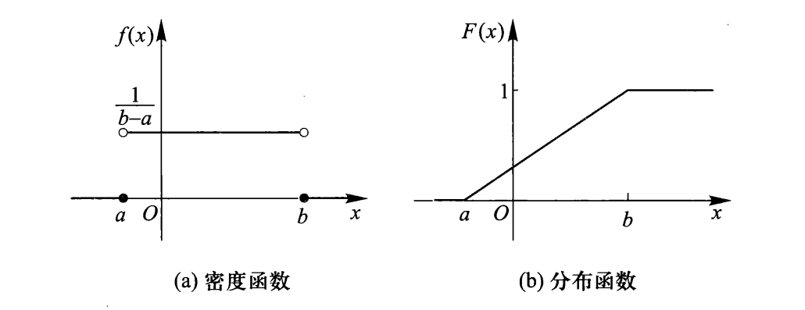
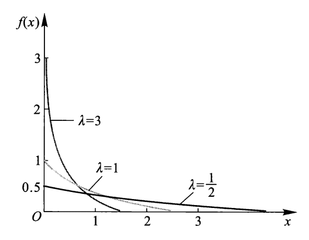

# Random Variables
## 随机变量
**随机变量**是一种以概率方式取值的变量．一般用大写字母 $X,Y,Z$ 来表示随机变量，而用 $E,F,G$ 来表示事件．

当随机变量被赋予或限定了特定的范围，其成为了事件．如 $X=2$，$Y<5$ 等．

## 离散随机变量
若一个随机变量有有限个可能取值，我们称其为离散随机变量．
### 概率密度函数
**概率质量函数**（Probability Mass Funtion）是离散随机变量在各特定取值上的概率函数．

我们通常用 $\text{P}(X=x)$ 来表示随机变量 $X$ 的PMF，有时也会简写为 $\text{P}(x)$．

???+ example "例"

	对于随机变量 $X$：掷一次骰子的点数，其PMF为
	
	$$
	P(X=x)=\dfrac{1}{6} \quad \text{if }x\in \mathbb{Z}, 1\le x\le 6
	$$

显然对于PMF，有 $\sum_{x}P(X=x)=1$，其中 $x$ 为随机变量 $X$ 的所有可能取值．

### 期望
随机变量 $X$ 所有可能取到的值与该值对应出现概率的加权平均称为随机变量 $X$ 的期望，记作 $\text{E}[X]$．

$$
\text{E}[X]=\sum_{x}x\cdot \text{P}(X=x) 
$$

期望具有如下性质：

+ 线性性：$\text{E}[aX+b]=a\text{E}[X]+b$，$\text{E}[X+Y]=\text{E}[X]+\text{E}[Y]$．（不管 $X,Y$ 具有何种关系）
+ 无意识统计学家法则（LOTUS）：$\text{E}[g(X)]=\sum_xg(x)\text{P}(X=x)$．

### 方差
方差是用来衡量随机变量离散程度的指标．对于期望为 $\text{E}[X]=\mu$ 的随机变量 $X$，其方差定义为 

$$
\text{Var}(X)=\text{E}[(X-\mu)^{2}]
$$

该计算可以被简化：

$$
\begin{aligned}
\text{Var}(X)&=\text{E}[(X-\mu)^{2}]\\
&=\sum_x(x-\mu)^{2}\text{P}(X=x)\\
&=\sum_{x} (x^{2}-2\mu x+\mu ^{2})\text{P}(X=x)\\
&=\sum_{x} x^{2}\text{P}(X=x)-2\mu \sum_{x} x\text{P}(X=x)+\mu^{2}\sum_x \text{P}(X=x) \\
&=\text{E}[X^{2}]-2\text{E}^{2}[X]+\text{E}^{2}[X]\\
&=\text{E}[X^{2}]-\text{E}^{2}[X]
\end{aligned}
$$

方差具有以下性质：

+ 线性变换的方差：$\text{Var}(aX+b)=a^{2}\text{Var}(X)$．
+ 若 $X,Y$ 为独立随机变量：$\text{Var}(X+Y)=\text{Var}(X)+\text{Var}(Y)$．

### 标准差
方差的单位是原单位的平方，为了让单位变回原来的单位，我们将方差开根号得到标准差：$\text{Std}(X)=\sqrt{\text{Var}(X)}$．

## 典型离散随机变量分布
### 伯努利随机变量
 伯努利随机变量是一个布尔变量，其取值只有 $1$ 或 $0$，概率分别为 $p$ 与 $1-p$．如果 $X$ 服从伯努利分布，则记作 $X\sim \text{Ber}(p)$．

**离散PMF**：

$$
\text{P}(X=x)= \begin{cases}p \,\,\qquad x=1, \\
1-p\,\,\,\,x=0.
\end{cases}
$$

**连续PMF**：$\text{P}(X=x)=p^{x}(1-p)^{1-x}$．

**期望**：$\text{E}[X]=p$．

**方差**：$\text{Var}(X)=p(1-p)．$

??? quote "伯努利分布期望与方差证明"

	期望：
	
	$$
	\begin{aligned}
	\text{E}[X]&=\sum_x x\cdot \text{P}(X=x)\\
	&= 1\cdot p+0\cdot(1-p)\\
	&=p
	\end{aligned}
	$$
	
	方差：
	
	$$
	\begin{aligned}
	\text{E}[X^{2}]&=\sum_x x^{2}\cdot \text{P}(X=x)\\&=1^{2}\cdot p+0^{2}\cdot(1-p)\\
	&=p\\\\
	\text{则 } \text{Var}(X)&=\text{E}[X^{2}]-\text{E}^{2}[X]\\&=p-p^{2}\\&=p(1-p)
	\end{aligned}
	$$

### 二项分布
在 $n$ 次独立重复试验中，每次试验都有 $p$ 的概率成功，则这一系列试验称为 $n$ 重伯努利试验．设 $X$ 为 $n$ 次实验中的成功次数，则 $X$ 服从**二项分布**，记作 $X\sim \text{Bin}(n,p)$．

**PMF**：

$$
\text{P}(X=k) =\binom{n}{k}p^{k}(1-p)^{n-k},k=0,1,2,\cdots, n
$$

**期望**：$\text{E}[X]=n\cdot p$．

**方差**：$\text{Var}(X)=n\cdot p(1-p)$．

??? example "二项分布的应用"

	一场七局四胜的比赛，必须比完七场，我方球队每局胜率为 $p=0.55$，则总胜率为？
	
	显然答案为
	
	$$
	\text{P(win)}=\sum_{k=4}^{7}\binom{7}{k}(0.55)^{k}(1-0.55)^{7-k} 
	$$
	
	我们用Python得到答案：
	
	```python
	from scipy import stats
	
	def binomial():  
	    n = 7  
	    p = 0.55  
	    win = sum(stats.binom.pmf(i, n, p) for i in range(4, n + 1))  
	    return win # 0.608287796875
	```
	
	如果出现某一方球队打赢了四场，那么直接判该球队获胜而不进行后续比赛，此时我方胜率又为多少？
	
	此时仍然为上述答案．因为当一方球队赢下四场后，后续单场比赛结果都不影响最终的结果，我们可以将后面的比赛当作是全概率公式的事件划分，其事件总和为样本空间而每一个情况的最终结果都是同一支队伍获胜，因此后续比赛的概率累计和为 $1$ 且贡献给同一支队伍，不影响结果．
	
	实际上，如果我们使用**负二项分布**计算，即准确在第 $k$ 场赢下第四场，则胜率为
	
	$$
	\text{P(win)} = \sum_{k=4}^{7} \binom{k-1}{3} p^4 (1-p)^{k-4}
	$$
	
	```python
	def negative_binomial():  
	    n = 7  
	    p = 0.55  
	    # nbinom.pmf(k, n, p) 中，k 为失败次数，n 为需要达到的成功次数  
	    win = sum(stats.nbinom.pmf(i - 4, 4, p) for i in range(4, n + 1))  
	    return win # 0.608287796875
	```
	
	这与我们使用二项分布计算的结果一致．

??? quote "二项分布期望与方差证明"

	不妨设 $Y$ 为成功概率为 $p$ 的伯努利变量，$Y_{i}$ 表示第 $i$ 次试验是否成功，即 $Y_{i}\sim \text{Ber}(p)$．
	
	期望：
	
	$$
	\begin{aligned}
	\text{E}[X]&=\text{E}\left[ \sum_{i=1}^{n}Y_{i}  \right] \\
	&=\sum_{i=1}^{n}\text{E}[Y_{i}]\\
	&=\sum_{i=1}^{n}p\\
	&=n\cdot p
	\end{aligned}
	$$
	
	方差：由于各次试验相互独立
	
	$$
	\begin{aligned}
	\text{Var}(X)&=\sum_{i=1}^{n}\text{Var}(Y_{i}) \\
	&=\sum_{i=1}^{n}p(1-p) \\
	&=n \cdot p(1-p)
	\end{aligned}
	$$

### 泊松分布
若事件以已知的恒定平均速率（在给定的一段时间内发生 $\lambda$ 次）发生，且与上一次事件发生的时间无关，那么描述固定时间内发生特定数量事件的概率的变量 $X$ 称作泊松随机变量，其服从**泊松分布**，记作 $X\sim\text{Poi}(\lambda)$．

**PMF**：

$$
\text{P}(X=x) = \dfrac{\lambda^{x}e^{-\lambda}}{x!},x=0,1,2,\cdots
$$

**期望**：$\text{E}[X]=\lambda$．

**方差**：$\text{Var}(X)=\lambda$．

??? quote "泊松分布PMF、期望、方差证明"

	事件在给定时间 $t$ 内平均发生 $\lambda$ 次，将给定时间等分称 $n$ 份，每一份的时间为 $t/n$，并假定每一份时间内事件最多发生一次．
	
	我们可以将其近似为二项分布，由于要保证平均发生次数一样，即这 $n$ 次的二项分布的期望要为 $\lambda$，因此每一次的发生概率为 $\lambda/n$．
	
	当 $n\to \infty$时，即为泊松分布的PMF：
	
	$$
	\begin{aligned}
	\text{P}(X=x)&=\lim_{n\to \infty}\binom{n}{x}\left(\dfrac{\lambda}{n}\right)^{x}(1-\lambda/n)^{n-x} \\
	&=\lim_{n\to \infty} \dfrac{n!}{x!(n-x)!}\cdot \dfrac{\lambda^{x}}{n^{x}}\cdot \dfrac{(1-\lambda/n)^{n}}{(1-\lambda/n)^{x}}
	\end{aligned}
	$$
	
	由于
	
	$$
	\lim_{n\to \infty}
	\begin{cases}
	(1-\lambda/n)^{n}=e^{-\lambda} \\ \\
	(1-\lambda/n)^{x}=1 \\
	\dfrac{n!}{n^{x}(n-x)!}=\dfrac{n(n-1)\cdots(n-x +1)}{n^{x}}=1
	\end{cases}
	$$
	
	则
	
	$$
	\begin{aligned}
	\text{原式}&=\lim_{n\to \infty}\dfrac{1}{x!}\cdot \lambda^{x} \cdot e^{-\lambda} \\
	&=\dfrac{\lambda^{x}e^{-\lambda}}{x!}
	\end{aligned}
	$$
	
	期望：将泊松分布视为二项分布的情况
	
	$$
	\begin{aligned}
	\text{E}[X]&= \lim_{n\to \infty}n\cdot p  \\
	&=\lim_{n\to \infty} n \cdot \dfrac{\lambda}{n} \\
	&=\lambda
	\end{aligned}
	$$
	
	同理可以得到方差：
	
	$$
	\begin{aligned} \\
	\text{Var}(X)&= \lim_{n\to \infty}n\cdot p(1-p) \\
	&=\lim_{n\to \infty} n \cdot \dfrac{\lambda}{n} (1-\dfrac{\lambda}{n})\\
	&=\lambda
	\end{aligned}
	$$

由于泊松分布计算公式简洁，当因此当二项分布 $n$ 较大（>20）而 $p$ 较小（<0.05）时，我们可以用泊松分布来近似二项分布．

若 $p$ 稍微大一些，如 $p=0.5$，对于二项分布而言期望为 $0.5p$ 而方差为 $0.25p$，而泊松分布只能模拟期望与方差相差不大的分布．当 $p$ 较大时，我们考虑使用正态分布近似．

### 几何分布
对于有 $p$ 的概率成功的试验，不断进行直到该试验成功，设 $X$ 为到成功时的试验次数，则 $X$ 服从**几何分布**，记作 $X\sim \text{Geo}(p)$．

PMF：$P(X=x)=(1-p)^{1-x}\cdot p,x=1,2,\cdots$．

期望：$\text{E}[X]=\dfrac{1}{p}$．

方差：$\text{Var}(X)=\dfrac{1-p}{p^{2}}$．
### 负二项分布
对于有 $p$ 的概率成功的试验，不断进行直到该试验成功 $r$ 次，设 $X$ 为到成功 $r$ 时的试验次数，则 $X$ 服从**负二项分布**，记作 $X\sim \text{NegBin}(r,p)$．

PMF：$P(X=x)=\dbinom{x-1}{r-1}p^{r}(1-p)^{x-r},x=r,r+1,\cdots$．

期望：$\text{E}[X]=\dfrac{r}{p}$．

方差：$\text{Var}(X)=\dfrac{r(1-p)}{p^{2}}$．
### 超几何分布
从包含 $K$ 个成功个体的总体 $N$ 中，不放回地抽取大小为 $n$ 的样本．设 $X$ 为 $n$ 个样本中成功个体的数量，则 $X$ 服从**超几何分布**，记作 $X\sim \text{HyperGeom}(N,K,n)$．

PMF：$P(X=x)=\dfrac{\dbinom{K}{x}\cdot\dbinom{N-K}{n-x}}{\dbinom{N}{n}},x=N-K+n,\cdots,K$．

期望：$\text{E}[X]=n\cdot\dfrac{K}{N}$．

方差：$\text{Var}(X)=n\cdot\dfrac{K}{N}(1-\cfrac{K}{N})\dfrac{N-n}{N-1}$．

若超几何分布的抽取数量 $n$ 远小于成功个体数 $K$ 与失败个体数 $N-K$，那么抽取对后续概率改变可忽略不计，即近似视为二项分布 $\text{Bin}(n, \dfrac{K}{N})$．

## 连续随机变量
### 概率密度函数
对于随机变量 $X$，若存在一个函数 $f(x)$，满足

$$
\begin{cases}
\text{P}(a\leq X\leq b)=\displaystyle\int_{a}^{b}f(x)dx  \\
\displaystyle\int_{-\infty}^{{+\infty}}f(x)=1 \\
f(x)\geq 0
\end{cases}
$$

则称 $X$ 为**连续随机变量**，$f(x)$ 为 $X$ 的**概率密度函数**（Probability Density Function）．

$f(x)$ 可以理解为概率对自变量的导数．易证 $\text{P}(X=a)=0$，即连续随机变量取任一定值的概率为 $0$．实际上，PDF的单点数值没有意义，只有积分结果才与概率相挂钩．

由于使用PDF计算概率时每次都要积分，因此我们引入一个**累积分布函数**（Cumulative Distribution Function）$F(x)$，定义为 $f(x)$ 的变上限积分函数：

$$
F(x)=\text{P}(X\leq x)=\int_{-\infty}^{x}f(x)dx
$$

则 $\text{P}(a\leq X\leq b)=F(b)-F(a)$．

而对于离散随机变量的CDF可看作是一个**前缀和**数组．

### 均匀分布
若连续随机变量 $X$ 在取值范围 $(a,b)$ 内等可能的取任何值，则称 $X$ 服从**均匀分布**，记作 $X\sim \text{Uni}(a,b)$．

PDF：

$$
f(x)=\begin{cases}
\dfrac{1}{b-a} \quad x \in [a,b]  \\
0\qquad \quad\,\,x<a \text{ or }x>b
\end{cases}
$$

CDF：

$$
F(x)=\begin{cases}
0 \qquad\quad x<a\\
\dfrac{x-a}{b-a} \,\,\,x\in [a, b] \\
1\qquad\quad x>b
\end{cases}
$$

期望：$\text{E}[X]=\dfrac{a+b}{2}$．

方差：$\text{Var}(X)=\dfrac{(b-a)^{2}}{12}$​．

<div style="text-align: center">

</div>

### 指数分布
如果一个事件是按照泊松分布发生的，用连续随机变量 $X$ 衡量直到下一个事件发生所需的时间，则称 $X$ 服从**指数分布**，记作 $X\sim\text{Exp}(\lambda)$，其中 $\lambda>0$，是泊松分布中的同一参数．

PDF：

$$
f(x)=\begin{cases}
0\qquad \quad x< 0\\
\lambda e^{-\lambda x}\quad x\geq 0
\end{cases}
$$

CDF：

$$
F(x)=\begin{cases}
0\qquad \qquad x< 0\\
1-e^{-\lambda x}\,\,\,\,\,x\geq 0
\end{cases}
$$

同时有：$\text{P}(X>x)=\min (e^{-\lambda x},1)$．

期望：$\text{E}[X]=\dfrac{1}{\lambda}$．

方差：$\text{Var}(X)=\dfrac{1}{\lambda^{2}}$．

<div style="text-align: center">

</div>

重要性质——**无记忆性**：

若 $X\sim\text{Exp}(\lambda)$，$\forall t>0,t_{0}>0$，有

$$
\begin{aligned}
\text{P}(X>t_{0}+t\mid X>t_{0})&=\dfrac{\text{P}(X>t_{0}+t)}{P(X>t_{0})} \\
&=\dfrac{1-F(t_{0}+t)}{1-F(t_{0})} \\
&=\dfrac{e^{-\lambda (t_{0}+t)}}{e^{-\lambda t_{0}}} \\
&=e^{-\lambda t} \\
&=\text{P}(X>t) 
\end{aligned}
$$

也就是说，在等待 $t_{0}$ 时间后，再等待 $t$ 时间等到的概率其实和一开始直接等待 $t$ 时间的概率相等；即从大于 $0$ 的任意时间开始等相同的时间，等到的概率都是相等的．
### 正态分布
