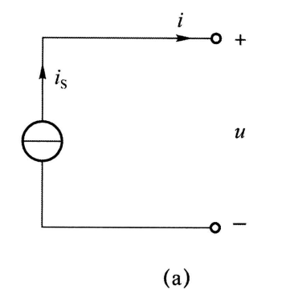
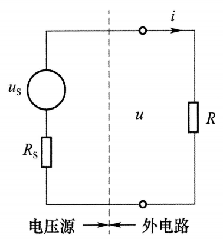
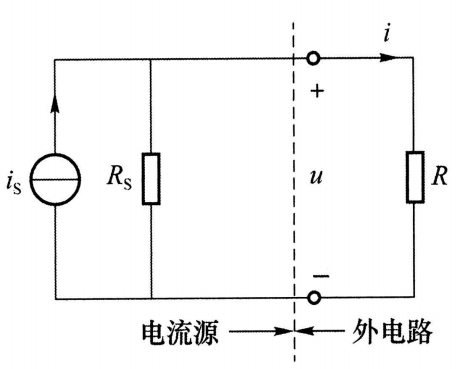
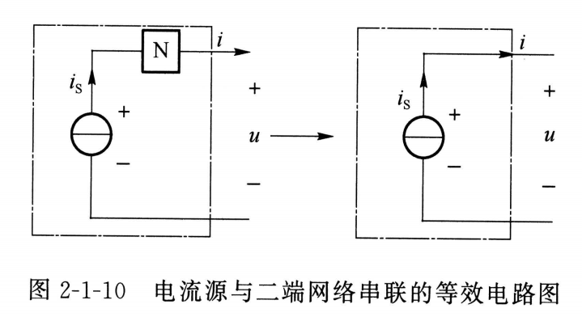
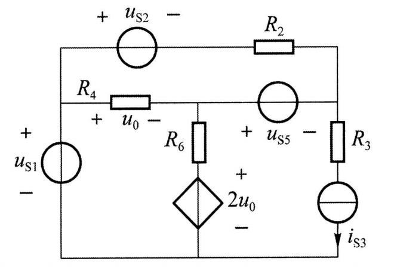

# 电路与电子学基础

!!! abstract "概要"

    + 时间：2025-2026春夏学期
    + 学分：2
    + 授课老师：魏翼飞
    + 教材：简明电路与电子学基础，北京邮电大学出版社

## 电路基础
### 记忆内容（直接背）
**集总参数电路**：当实际电路的尺寸远小于其最高工作频率对应波长 $\lambda=c/f$ 时，可以视为集总参数电路．反之则为分布参数电路．

**电路的对偶特性**：

+ 元件对偶：电阻与电导，电感与电容，理想电压源与理想电流源．
+ 电路结构对偶：开路与短路，串联与并联，非理想电压源模型与非理想电流源模型．
+ 电路定理定律对偶：KCL与KVL，戴维南定理与诺顿定理．

### 电路分析中的基本变量

**电流**：$i=\dfrac{dq}{dt}$，需要定义电流参考方向，实际电流方向与参考方向一致为正，反之为负 ．

**电压**：$u=\dfrac{dw}{dq}$，需要定义电压参考方向，高电位写 $+$，低电位写 $-$，或者写 $u_ab$ 默认 $a$ 高 $b$ 低，实际高低电位与参考方向一致为正，反之为负．

若电流参考方向与电压一致（从 $+$ 流向 $-$），则称**关联参考方向**，反之**非关联参考方向**．

**功率**：$p=u\cdot i$​，直接把数据带入（正负号也带入），若为非关联参考方向再加个负号．最后计算结果为正代表吸收功率，为负代表供出功率．

**电阻**：同高中电阻，非关联参考方向 $u=-R\cdot i$．

**电导**：电阻倒数，单位西门子（$S$）．

### 电路名词
**支路**：电流大小一样算作同一支路．

**节点**：支路与支路的连接点．直接找三线交汇的点，将重复的点（电位相等的点）保留一个即可．

**回路**：闭合路径．

**网孔**：内部不能再分出回路的回路．

**二端网络**：与外电路只有两个端钮连接的网络整体．

**单口网络**：其实就是二端网络．如果端口内只含有电阻、受控源，称为无源单口网络．

### 基尔霍夫定律

**基尔霍夫电流定律（KCL）**：对象为结点，流入结点的电流减去流出的电流等于0．直接按照这么写，方便后续节点电压法的列式．

**基尔霍夫电压定律（KVL）**：对象为回路，任意找一个电压源，从其负极开始，往其正极方向进行绕圈，电压升高写左边（遇到电压源的负极），电压降低写右边（遇到电压源的正极）．遇到电阻，看经过它的电流参考方向与绕圈方向，一致为降低电压写右边，不一致为升高电压写左边．

## 电源及其等效

### 电源

| 理想电源 | 电压源：两端的电压为定值                                     | 电流源：穿过其的支路电流为定值                               |
| -------- | ------------------------------------------------------------ | ------------------------------------------------------------ |
| 独立电源 |  |  |
| 受控电源 |  |  |

受控电源：其电压/电流的值为电路中某一个电压/电流的倍数．注意看其上方的电压/电流编号并在电路图中找出．

注意：是电压源还是电流源只与其图形有关而与控制其的变量无关，他们均可以被电压/电流控制，不用管量纲直接相乘即可．

???+ example "例"

	

	  
	

	
	$$
	i_{2}=\dfrac{4.9V}{5\Omega}=0.98A 
	$$
	
	由于经过受控电流源为 $0.98i$，而 $i_{2}$ 也经过它，因此 
	
	$$
	0.98i=i_{2},i=1A
	$$

**实际电压源**：看作是理想电压源串联电阻 $R_{s}$​．

  

**实际电流源**：看作是理想电流源并联电阻 $R_{s}$．

  

### 等效
等效：对外等效，对内不等效，不能用等效后的电路求内部元件的参数．

**电阻等效**：同高中串并联公式

**无源单口网络等效**：若无受控源，则同电阻等效；有受控源时，给单口网络外施电压 $u$，设法求出端口电流 $i$，可等效为 $R=\dfrac{u}{i}$．注意，含有受控源的网络求出的等效电阻可能是负数．

**电源等效**：

+ 电压源串联：代数和，可以用KVL中的方法，找一个负极往正极走，遇到负极加上其电压值，遇到正极减去．
+ 电压源并联：只有电压一样才能并联，总电压即为那个相同的电压值．
+ 电流源串联：只有电流一样才能串联．
+ 电流源并联：代数和，注意参考方向．
+ 电压源与二端网络并联/电流源与二端网络串联：当作其不存在

  
  

+ 实际电压源与实际电流源的等效替换：电阻串改并，并改串；注意方向不要变，此时电流方向为电压的负 $\to$ 正方向．
    + 电压 $\to$ 电流：电流大小 $i_{s}=\dfrac{u_{s}}{R_{s}}$．
    + 电流 $\to$ 电压：电压大小 $u_{s}=i_{s}R_{s}$．

  

受控电源的等效也要乘以或除以 $R_{s}$．

## 电路分析方法

### 网孔电流法

上课没讲，应该不考，略．

### 节点电压法

以该题为例：

  

先对电路进行处理：

1. 支路为电流源与电阻串联，列方程时忽视该电阻．在上题中，将 $R_{3}$ 忽视．
2. 支路为电压源与电阻串联，将其等效为电流源与电阻并联．在上题中，将 $u_{s2}$ 与 $R_{2}$ 视为 $i_{s2}$ 与 $R_{2}$ 并联．（此时不用管与电流源并联的电阻的分流作用，直接用电流源连接的节点计算即可，因为那个电阻的分流作用已经在等式左边写出）
3. 支路为理想电压源而无电阻，直接设出该支路的电流并当作电流源电流对待，再用该理想电压源两端的电压关系再列一个方程．在上题中，设流经 $U_{s1}$ 的电流为 $i_{1}$，方向向上；流经 $U_{s5}$ 的电流为 $i_{2}$，方向向左；

	或者：选择合适的参考节点，使得无阻电压源成为一个已知节点电位．
4. 将受控源当作独立源列方程，同时对控制其的电压/电流参数列个方程．在上题中，需要对 $u_{0}$ 列一个方程．

**自电导**：与当前结点直接连接的电导总和．

**互电导**：与某一个结点之间的电导．

显然，自电导= $\sum$ 互电导．

**选节点**：找出电路所有节点，设其中一个节点为参考节点（接地），然后对其他节点列方程（列其他节点的方程时要考虑参考节点，即自电导如果有和参考节点连接要加上，但由于参考节点电压为 $0$，因此没有参考节点的互电导项）．

**列方程**：

$$
\begin{aligned}
当前节点的电压 \times 自电导 -\sum 其他节点电压 \times 互电导 = \\流入的电流源电流 - 流出的电流源电流 
\end{aligned}
$$

  

对节点 $1$，与其有互电导的为：节点 $2$，节点 $3$（等效为电流源并联 $R_{2}$）．流入的电流源为 $i_{1}$ 与 $\dfrac{U_{s2}}{R_{2}}$，无流出，因此方程为

$$
\left( \dfrac{1}{R_{1}}+\dfrac{1}{R_{4}} \right)u_{1}'-\left(\dfrac{1}{R_{4}}\right)u_{2}'-\left(\dfrac{1}{R_{2}}\right)u_{3}'=i_{1}+\dfrac{U_{s2}}{R_{2}}
$$

同理可得节点 $2,3$ 的方程

$$
\begin{aligned}
-\left( \dfrac{1}{R_{4}} \right)u_{1}'+ \left( \dfrac{1}{R_{4}}+\dfrac{1}{R_{6}} \right)u_{2}'=\dfrac{2u_{0}}{R_{6}}+i_{2} \\
-\left( \dfrac{1}{R_{2}} \right)u_{1}'+\dfrac{1}{R_{2}}u_{3}'=-\dfrac{U_{s2}}{R_{2}}-i_{1}-i_{s3}
\end{aligned}
$$

接下来我们补齐在步骤 $3,4$ 额外添加的方程：

+ 理想电压源 $U_{s1}$ 关系：$u_{1}'=U_{s1}$ 
+ 理想电压源 $U_{s5}$ 关系：$u_2'-u_3'=U_{s5}$ 
+ 受控源参数 $u_{0}$ 关系：$u_{1}'-u_{2}'=u_{0}$

共有 $u_{1}',u_{2}',u_{3}',u_{0},i_{1},i_{2}$ 六个未知数，有六个方程，可解．

???+ quote "补充"

	步骤 $3$ ：“选择合适的参考节点，使得无阻电压源成为一个已知节点电位”，本题可以选择对 $U_{s1}$ 的处理用该方法，而对 $U_{s5}$ 的处理用设电流的方法．
	
	此时就不用列出节点 $1$ 的方程，我们也就不需要知道节点 $1$ 的流入电流了．方程减少了两个，但未知数也减少了两个（$u_{1}',i_{1}$），仍然是可解的．

## 电路分析基本定理
### 叠加定理
线性电路中任一元件的电压/电流可以看作每一个独立电源单独作用时在该元件产生的电压/电流．

???+ abstract "步骤"

	1. 对每一个独立电源，让其单独作用而将其他独立电源置零（电压源短路，电流源断路，可以看作是把他们的圈去掉，这样电压源剩下一根导线，电流源剩下断路）．受控电源不受影响．
	2. 叠加时，尽量将分量的方向与原来总电压/电流的方向保持一致，这样可以直接相加不用考虑正负号．
	3. 叠加定理不能计算功率．

### 替代定理
上课没讲，略．
### 戴维南定理
线性含源单口网络对外可等效为理想电压源 $u_{oc}$ 与电阻 $R_{eq}$ 的串联组合．该等效电路称为戴维南等效电路．

电阻 $R_{eq}$：除去独立电源（电压源短路，电流源断路）后网络的等效电阻．

电压 $u_{oc}$：即为端口的开路电压（注意方向）．

简单的例子：

  

**线性含源单口网络的化简**：

+ 求电压 $u_{oc}$：
    1. 先看是否存在电压源并联二端网络与电流源串联二端网络，如果有直接将其删去．
    2. 使用实际电压源与实际电流源之间的等效关系化简．
    3. 根据化简完的电路，使用之前的方法（如KVL、节点电压）计算开路电压．

+ 求电阻 $R_{eq}$（注意要用原图求，而不是上一步化简完的电路）：
    + 法一：除去独立电源，使用无源单口网络等效方法计算．
    + 法二：将端口用导线连接，计算出导线上的一个短路电流 $i_{sc}$（与计算出的开路电压同向），计算 $R_{0}=\dfrac{u_{oc}}{i_{sc}}$．

### 诺顿定理
戴维南最后的结果是电压源串联电阻，诺顿最后的结果是电流源并联电阻，而电压源串联电阻与电流源并联电阻本身就可以等效．实际上上述的短路电流法就是诺顿定理的内容．

### 最大功率传输定理
高中知识，连接有源单口网络两端的负载电阻在阻值等于 $R_{eq}$ 时，其获得的功率最大，为 $P_{max}=\dfrac{u_{oc}^{2}}{4R_{eq}}$．
