# 电路与电子学基础

> [!abstract] 概要
>
> + 时间：2025-2026春夏学期
> + 学分：2
> + 授课老师：魏翼飞
> + 教材：简明电路与电子学基础，北京邮电大学出版社

## 电路基础
### 记忆内容（直接背）
**集总参数电路**：当实际电路的尺寸远小于其最高工作频率对应波长 $\lambda=c/f$ 时，可以视为集总参数电路．反之则为分布参数电路．

**电路的对偶特性**：

+ 元件对偶：电阻与电导，电感与电容，理想电压源与理想电流源．
+ 电路结构对偶：节点与回路、开路与短路，串联与并联，非理想电压源模型与非理想电流源模型．
+ 电路定理定律对偶：KCL 与 KVL，戴维南定理与诺顿定理．

### 电路分析中的基本变量

**电流**：$i=\dfrac{dq}{dt}$，需要定义电流参考方向，实际电流方向与参考方向一致为正，反之为负 ．

**电压**：$u=\dfrac{dw}{dq}$，需要定义电压参考方向，高电位写 $+$，低电位写 $-$，或者写 $u_ab$ 默认 $a$ 高 $b$ 低，实际高低电位与参考方向一致为正，反之为负．

若电流参考方向与电压一致（从 $+$ 流向 $-$），则称**关联参考方向**，反之**非关联参考方向**．

**功率**：$p=u\cdot i$​，直接把数据带入（正负号也带入），若为非关联参考方向再加个负号．最后计算结果为正代表吸收功率，为负代表供出功率．

**电阻**：同高中电阻，非关联参考方向 $u=-R\cdot i$．

**电导**：电阻倒数，单位西门子（$S$）．

### 电路名词
**支路**：电流大小一样算作同一支路．

**节点**：支路与支路的连接点．直接找三线交汇的点，将重复的点（电位相等的点）保留一个即可．

**回路**：闭合路径．

**网孔**：内部不能再分出回路的回路．

**二端网络**：与外电路只有两个端钮连接的网络整体．

**单口网络**：其实就是二端网络．如果端口内只含有电阻、受控源，称为无源单口网络．

### 基尔霍夫定律

**基尔霍夫电流定律（KCL）**：对象为结点，流入结点的电流减去流出的电流等于0．直接按照这么写，方便后续节点电压法的列式．

**基尔霍夫电压定律（KVL）**：对象为回路，任意找一个电压源，从其负极开始，往其正极方向进行绕圈，电压升高写左边（遇到电压源的负极），电压降低写右边（遇到电压源的正极）．遇到电阻，看经过它的电流参考方向与绕圈方向，一致为降低电压写右边，不一致为升高电压写左边．

## 电源及其等效

### 电源

| 理想电源 | 电压源：两端的电压为定值                                     | 电流源：穿过其的支路电流为定值                               |
| -------- | ------------------------------------------------------------ | ------------------------------------------------------------ |
| 独立电源 | 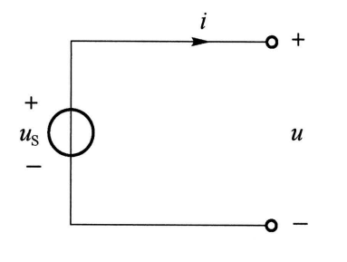 |  |
| 受控电源 | 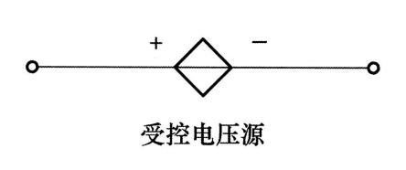 | 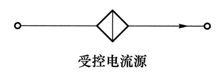 |

受控电源：其电压/电流的值为电路中某一个电压/电流的倍数．注意看其上方的电压/电流编号并在电路图中找出．

注意：是电压源还是电流源只与其图形有关而与控制其的变量无关，他们均可以被电压/电流控制，不用管量纲直接相乘即可．

> [!example]+ 例
>
> 

>   

>   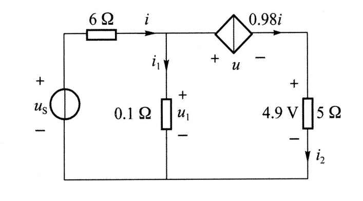
>   

> 

>
> $$
> i_{2}=\dfrac{4.9V}{5\Omega}=0.98A 
> $$
>
> 由于经过受控电流源为 $0.98i$，而 $i_{2}$ 也经过它，因此 
>
> $$
> 0.98i=i_{2},i=1A
> $$

**实际电压源**：看作是理想电压源串联电阻 $R_{s}$​．

  

  
  

**实际电流源**：看作是理想电流源并联电阻 $R_{s}$．

  

  
  

### 等效
等效：对外等效，对内不等效，不能用等效后的电路求内部元件的参数．

**电阻等效**：同高中串并联公式

**无源单口网络等效**：若无受控源，则同电阻等效；有受控源时，给单口网络外施电压 $u$，设法求出端口电流 $i$，可等效为 $R=\dfrac{u}{i}$．注意，含有受控源的网络求出的等效电阻可能是负数．

**电源等效**：

+ 电压源串联：代数和，可以用KVL中的方法，找一个负极往正极走，遇到负极加上其电压值，遇到正极减去．
+ 电压源并联：只有电压一样才能并联，总电压即为那个相同的电压值．
+ 电流源串联：只有电流一样才能串联．
+ 电流源并联：代数和，注意参考方向．
+ 电压源与二端网络并联/电流源与二端网络串联：当作其不存在

  

  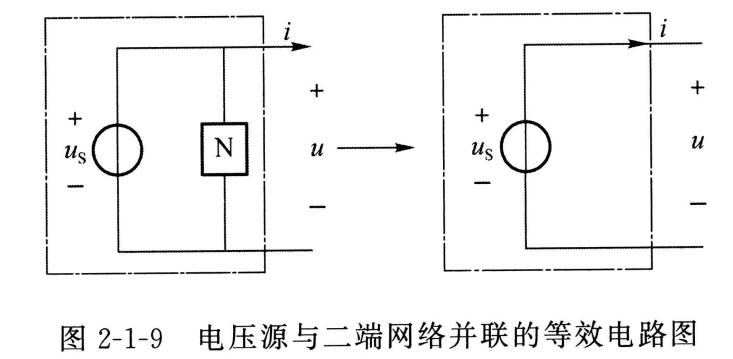
  

  

  
  

+ 实际电压源与实际电流源的等效替换：电阻串改并，并改串；注意方向不要变，此时电流方向为电压的负 $\to$ 正方向．
    + 电压 $\to$ 电流：电流大小 $i_{s}=\dfrac{u_{s}}{R_{s}}$．
    + 电流 $\to$ 电压：电压大小 $u_{s}=i_{s}R_{s}$．

  

  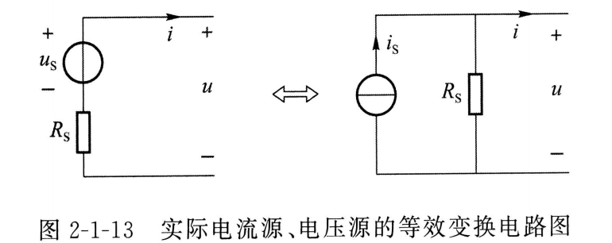
  

受控电源的等效也要乘以或除以 $R_{s}$．

## 电路分析方法

### 网孔电流法

上课没讲，应该不考，略．

### 节点电压法

以该题为例：

  

  
  

先对电路进行处理：

1. 支路为电流源与电阻串联，列方程时忽视该电阻．在上题中，将 $R_{3}$ 忽视．
2. 支路为电压源与电阻串联，将其等效为电流源与电阻并联．在上题中，将 $u_{s2}$ 与 $R_{2}$ 视为 $i_{s2}$ 与 $R_{2}$ 并联．（此时不用管与电流源并联的电阻的分流作用，直接用电流源连接的节点计算即可，因为那个电阻的分流作用已经在等式左边写出）
3. 支路为理想电压源而无电阻，直接设出该支路的电流并当作电流源电流对待，再用该理想电压源两端的电压关系再列一个方程．在上题中，设流经 $U_{s1}$ 的电流为 $i_{1}$，方向向上；流经 $U_{s5}$ 的电流为 $i_{2}$，方向向左；

	或者：选择合适的参考节点，使得无阻电压源成为一个已知节点电位．

4. 将受控源当作独立源列方程，同时对控制其的电压/电流参数列个方程．在上题中，需要对 $u_{0}$ 列一个方程．

**自电导**：与当前结点直接连接的电导总和．

**互电导**：与某一个结点之间的电导．

显然，自电导= $\sum$ 互电导．

**选节点**：找出电路所有节点，设其中一个节点为参考节点（接地），然后对其他节点列方程（列其他节点的方程时要考虑参考节点，即自电导如果有和参考节点连接要加上，但由于参考节点电压为 $0$，因此没有参考节点的互电导项）．

**列方程**：

$$
\begin{aligned}
当前节点的电压 \times 自电导 -\sum 其他节点电压 \times 互电导 = \\流入的电流源电流 - 流出的电流源电流 
\end{aligned}
$$

  

  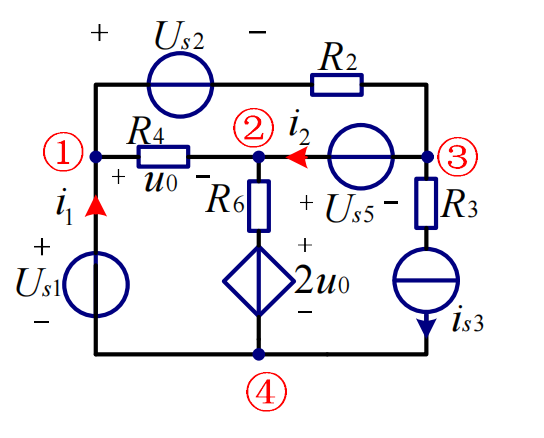
  

对节点 $1$，与其有互电导的为：节点 $2$，节点 $3$（等效为电流源并联 $R_{2}$）．流入的电流源为 $i_{1}$ 与 $\dfrac{U_{s2}}{R_{2}}$，无流出，因此方程为

$$
\left( \dfrac{1}{R_{2}}+\dfrac{1}{R_{4}} \right)u_{1}'-\left(\dfrac{1}{R_{4}}\right)u_{2}'-\left(\dfrac{1}{R_{2}}\right)u_{3}'=i_{1}+\dfrac{U_{s2}}{R_{2}}
$$

同理可得节点 $2,3$ 的方程

$$
\begin{aligned}
-\left( \dfrac{1}{R_{4}} \right)u_{1}'+ \left( \dfrac{1}{R_{4}}+\dfrac{1}{R_{6}} \right)u_{2}'=\dfrac{2u_{0}}{R_{6}}+i_{2} \\
-\left( \dfrac{1}{R_{2}} \right)u_{1}'+\dfrac{1}{R_{2}}u_{3}'=-\dfrac{U_{s2}}{R_{2}}-i_{2}-i_{s3}
\end{aligned}
$$

接下来我们补齐在步骤 $3,4$ 额外添加的方程：

+ 理想电压源 $U_{s1}$ 关系：$u_{1}'=U_{s1}$ 
+ 理想电压源 $U_{s5}$ 关系：$u_2'-u_3'=U_{s5}$ 
+ 受控源参数 $u_{0}$ 关系：$u_{1}'-u_{2}'=u_{0}$

共有 $u_{1}',u_{2}',u_{3}',u_{0},i_{1},i_{2}$ 六个未知数，有六个方程，可解．

> [!quote]+ 补充
>
> 步骤 $3$ ：“选择合适的参考节点，使得无阻电压源成为一个已知节点电位”，本题可以选择对 $U_{s1}$ 的处理用该方法，而对 $U_{s5}$ 的处理用设电流的方法．
>
> 此时就不用列出节点 $1$ 的方程，我们也就不需要知道节点 $1$ 的流入电流了．方程减少了两个，但未知数也减少了两个（$u_{1}',i_{1}$），仍然是可解的．

## 电路分析基本定理
### 叠加定理
线性电路中任一元件的电压/电流可以看作每一个独立电源单独作用时在该元件产生的电压/电流．

> [!abstract]+ 步骤
>
> 1. 对每一个独立电源，让其单独作用而将其他独立电源置零（电压源短路，电流源断路，可以看作是把他们的圈去掉，这样电压源剩下一根导线，电流源剩下断路）．受控电源不受影响．
> 2. 叠加时，尽量将分量的方向与原来总电压/电流的方向保持一致，这样可以直接相加不用考虑正负号．
> 3. 叠加定理不能计算功率．

### 替代定理
上课没讲，略．
### 戴维南定理
线性含源单口网络对外可等效为理想电压源 $u_{oc}$ 与电阻 $R_{eq}$ 的串联组合．该等效电路称为**戴维南等效电路**．

电阻 $R_{eq}$：除去独立电源（电压源短路，电流源断路）后网络的等效电阻．

电压 $u_{oc}$：即为端口的开路电压（注意方向）．

简单的例子：

  

  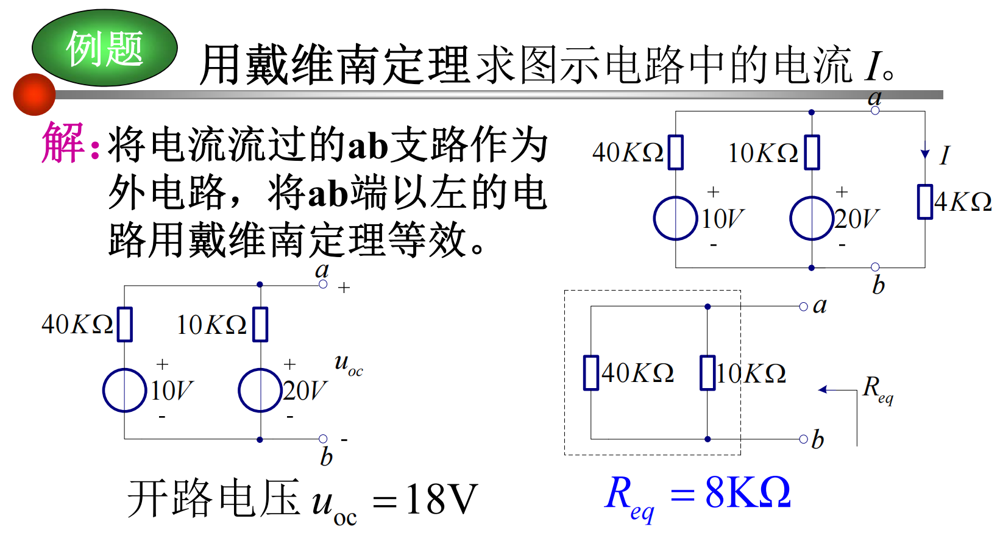
  

**线性含源单口网络的化简**：

+ 求电压 $u_{oc}$：
    1. 先看是否存在电压源并联二端网络与电流源串联二端网络，如果有直接将其删去．
    2. 使用实际电压源与实际电流源之间的等效关系化简．
    3. 根据化简完的电路，使用之前的方法（如KVL、节点电压）计算开路电压．

+ 求电阻 $R_{eq}$（注意要用原图求，而不是上一步化简完的电路）：
    + 法一：除去独立电源，使用无源单口网络等效方法计算．
    + 法二：将端口用导线连接，计算出导线上的一个短路电流 $i_{sc}$（与计算出的开路电压同向），计算 $R_{0}=\dfrac{u_{oc}}{i_{sc}}$．

### 诺顿定理
戴维南最后的结果是电压源串联电阻，诺顿最后的结果是电流源并联电阻，而电压源串联电阻与电流源并联电阻本身就可以等效．实际上上述的短路电流法就是诺顿定理的内容．

### 最大功率传输定理
高中知识，连接有源单口网络两端的负载电阻在阻值等于 $R_{eq}$ 时，其获得的功率最大，为 $P_{max}=\dfrac{u_{oc}^{2}}{4R_{eq}}$​．

## 动态电路时域分析
此处讨论的均为**一阶动态电路**，即只有一个动态元件的直流电路．

### 动态元件

**电容**：电流是电压的微分 $i_{c}(t)=C\dfrac{du_{c}(t)}{dt}$，电压是电流的积分 $u_{c}(t)=\displaystyle\dfrac{1}{C}\int_{-\infty}^{t}i_{c}(t)dt$.

+ 记忆特性：$u_{c}(t)=\displaystyle u_{c}(t_{0)}+\dfrac{1}{C}\int_{t_{0}}^{t}i_{c}(t)dt$

+ 储能特性：$W(t)=\dfrac{1}{2}Cu^{2}_{c}t$．

+ 串并联：与电阻串并联公式相反．

**电感**：电压是电流的微分 $u_{L}(t)=C\dfrac{di_{L}(t)}{dt}$，电流是电压的积分 $i_{L}(t)=\displaystyle\dfrac{1}{L}\int_{-\infty}^{t}u_{L}(t)dt$.

+ 记忆特性：$i_{L}(t)=\displaystyle i_{L}(t_{0)}+\dfrac{1}{L}\int_{t_{0}}^{t}u_{L}(t)dt$

+ 储能特性：$W(t)=\dfrac{1}{2}Li^{2}_{L}t$．

+ 串并联：与电阻串并联公式相同．

### 换路定则
**直流稳态**：直流电路中各个元件上的电压和电流都不随着时间变化．

**换路**：电路由一种工作状态变化到另外一种工作状态．

**状态变量**：电容电压与电感电流．

进入直流稳态后，分析电路：电容当作断路，电感当作短路．以此计算电容两端电压 $u_{c}(0^{-})$ 与流经电感电流 $i_{L}(0^{-})$．

**换路定则**：由于状态变量是积分结果，无法突变，因此 $u_{c}(0^{-})=u_{c}(0^{+})$，$i_{L}(0^{-})=i_{L}(0^{+})$．求 $t(0^{+})$ 时的电路状态，将电容看作大小为 $u_{c}(0^{-})$ 的电压源，电感看作大小为 $i_{L}(0^{-})$ 的电流源．

> [!example]+ 例题
>
> 

> 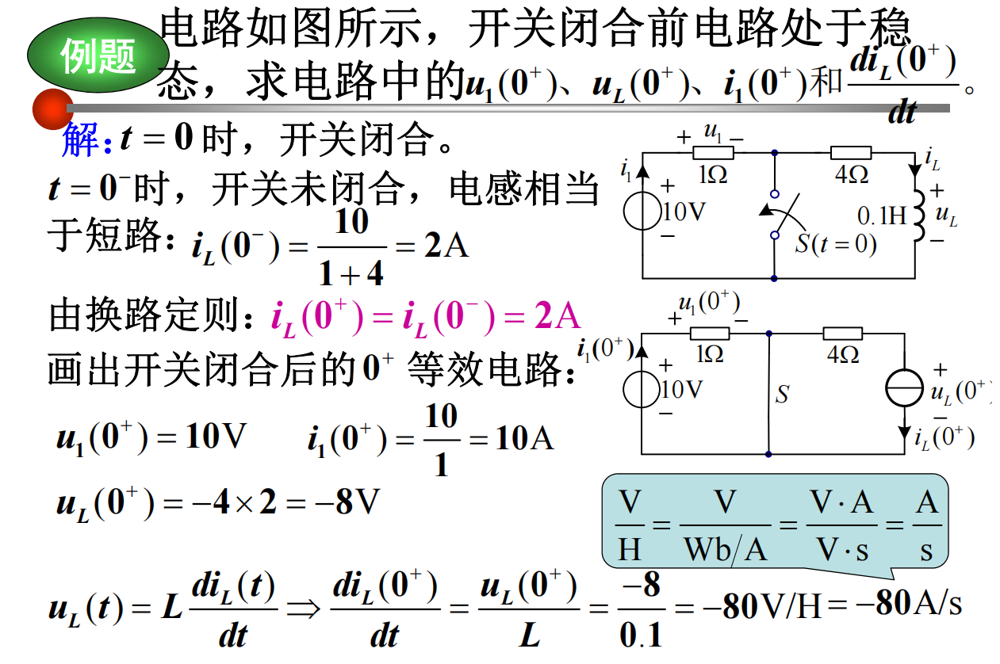
> 

### 零输入响应
电路无外加激励（无独立电源），仅由动态元件的非零初始状态引起的响应（只考虑电容电感放电）称为**零输入相应（zir）**．

将电路等效为电容/电感连接等效电阻 $R_{eq}$（就是戴维南的 $R_{eq}$），求时间常数 $\tau =RC$（电容）或 $\tau=\dfrac{L}{R}$（电感），则任意量的零输入响应都可以写成

$$
y(t)=y(0^{+})e^{-\frac{1}{\tau}t} \quad t\geq 0^{+}
$$

$\tau$ 的单位是秒，常取 $t=(3\sim 5)\tau$ 作为放电完毕所需时间．$\tau$ 越大放电越慢．

> [!example]+ 例题
>
> 

> 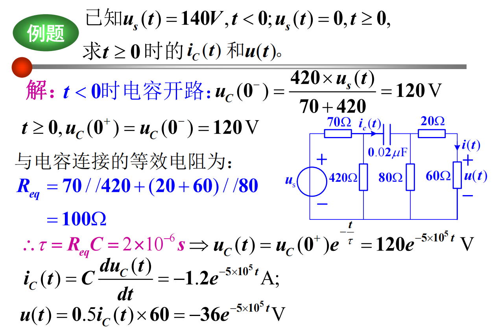
> 

>
> 

> 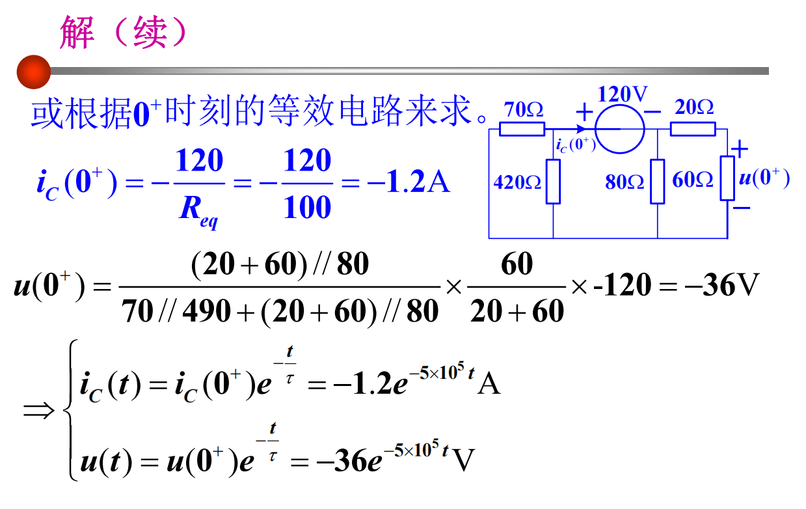
> 

### 零状态响应
在零初始状态下，仅由外加激励源产生的响应（电容电感充电过程）称为**零状态响应（zsr）**．

零状态响应并不是任意量都能写成同一公式，只有状态变量可以写成

$$
\begin{cases}
u_{c}(t)=u_{c}(\infty)(1-e^{-\frac{1}{\tau}t}) \\
i_{L}(t)=i_{L}(\infty)(1-e^{-\frac{1}{\tau}t})
\end{cases}
$$

的形式，其余变量需要根据电压电流关系推导．

充电过程中，等效电阻损耗的能量与电容/电感的储能一样，充电效率为 $50\%$．

与放电一样，$\tau$ 越大充电越慢．

> [!example]+ 例题
>
> 

> 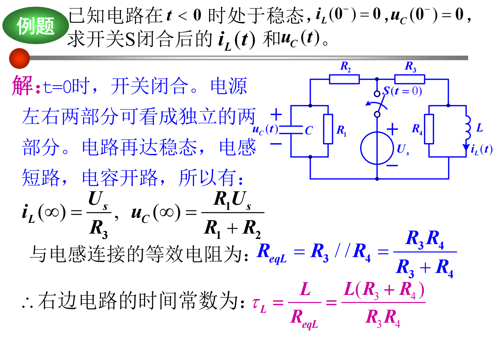
> 

>
> 

> 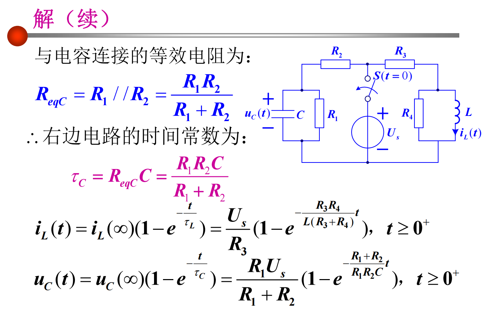
> 

### 全响应
全响应 = 零输入响应（忽略电源）+ 零状态响应（忽略初始储能）．

此时公式为 

$$
\begin{aligned}
y(t)&=y_{z.i.r}(t)+y_{z.s.r}(t)\\
&=y(0^+)e^{-\frac{1}{\tau}t}+y(\infty)(1-e^{-\frac{1}{\tau}t})
\end{aligned}
$$

或使用**三要素法**（对非状态变量也适用）：只需要知道代求量的初始值、稳态值、时间常数，即可得到

$$
y(t)=y(\infty) + [y(0^+)-y(\infty)]e^{-\frac{1}{\tau}t}
$$

其中 $y(\infty)$ 称为稳态响应，$[y(0^+)-y(\infty)]e^{-\frac{1}{\tau}t}$ 称为暂态响应．

## 正弦稳态电路分析

1. 时域 $\to$ 频域
    + 正弦电压 $U$、电流 $I$ $\to$ 相量
    + 电路元件 $R$、$L$、$C$ $\to$ 阻抗
    + 分析方法 KCL、KVL $\to$ 频域中相量形式 
2. 建立相量形式的电路方程并求解
3. 根据题目要求，将相量解转化成时域解

*易错点*：时域频域转换时忘记是最大值还是有效值，多/少乘除了 $\sqrt2$．

### 正弦电压电流的相量表示

频率相同时，正弦电压电流均可以由最大值/有效值 + 初相位一一对应．对应到的**相量**是一个复数，其可以写成极坐标形式（也就是下方默认形式），也可以写成直角坐标形式（实部 + 虚部）．

$$
\begin{aligned}
i(t)&=I_m\cos(\omega t+\varphi_i)
\quad \longrightarrow \quad
\dot{I}=I\angle\varphi_i
\ \text{或}\
\dot{I}_m=I_m\angle\varphi_i \\[6pt]
u(t)&=U_m\cos(\omega t+\varphi_u)
\quad \longrightarrow \quad
\dot{U}=U\angle\varphi_u
\ \text{或}\
\dot{U}_m=U_m\angle\varphi_u
\end{aligned}
$$

标有下标 $m$ 的是最大值，反之为有效值．正弦电压电流满足 $y_m=\sqrt2 y$．

### 分析方法的相量形式

KCL、KVL：全部换成相量，仍然满足原定律．

> 正弦时域电压电流求和：先转化成相量直角坐标形式，相加后再转回时域形式．

### 电路元件UI关系的向量形式

#### 电阻

$\dot{U}=R\dot{I}$，$\phi_u=\phi_i$．即满足欧姆定律，且 $u(t)$ 与 $i(t)$ 同相．

#### 电容

时域中：

$$
\begin{aligned}
u(t)&=\sqrt{2}U\cos(\omega t+\varphi_u) \\[6pt]
i(t)&=C\frac{du(t)}{dt} \\[6pt]
&=-\sqrt{2}U\omega C\sin(\omega t+\varphi_u) \\[6pt]
&=\sqrt{2}U\omega C\cos(\omega t+\varphi_u+90^\circ) \\[6pt]
&=\sqrt{2}I\cos(\omega t+\varphi_i)
\end{aligned}
$$

$I=\omega CU$，$\phi_i=\phi_u+90^\circ$．

频域中：$\dot{I}=jwC\dot{U}$，电容电流超前电容电压 $90^\circ$．

#### 电感

同理，$\dot{U}=jwL\dot{I}$，电感电压超前电感电流 $90^\circ$．

#### 阻抗与导纳

**阻抗** $Z$ 定义为电压相量与电流相量的比值（但是其不是相量）：

$$
Z=\dfrac{\dot{U}}{\dot{I}}=
\begin{cases}
\text{电阻}\quad R \\
\text{电感}\quad j\omega L \\
\text{电阻}\quad \frac{1}{j\omega C} =-j\frac{1}{\omega C}
\end{cases}
$$

阻抗 $Z$ 单位均为 $R$．得到欧姆定律相量形式 $\dot{U}=Z\dot{I}$​．

阻抗可能为复数 $Z=R+jX=R+j(X_L+X_C)=R+j(\omega L-\frac{1}{\omega C})$．

+ $X=0$：电阻性；
+ $X>0$：$X_L>X_C$，电感性；
+ $X<0$：$X_C>X_L$，电容性．

导纳 $Y$ 定义为阻抗的倒数．

### 电路分析方法

戴维南定理、诺顿定理：电压电流均换为相量，电阻换为阻抗，计算过程相同．

最后得到的等效电路，元件可能会出现电容、电感．

### 功率

#### 瞬时功率

$p(t)=u(t)i(t)=UI\cos\phi+UI\cos(2\omega t+\phi)$，其中 $\phi=\phi_u-\phi_i$．

#### 平均功率（有功功率）

$P=\displaystyle\frac{1}{T}\int_0^Tp(t)dt=UI\cos\phi$．

令 $\lambda=\cos\phi$ 称为功率因数，$\phi$ 功率因数角，如果是无源单口网络也有 $\phi=\phi_Z$（有源不适用）．

+ 当单口为电阻时，$P=UI$；
+ 当单口为电感/电容时，$P=0$．

> 有功功率看作是真正能消耗能量的功率：电阻能消耗能量，电感、电容不产生也不消耗能量，只是储能元件．

#### 无功功率

$Q=UI\sin \phi$．

+ 当单口为电阻时，$Q=0$；
+ 当单口为电感时，$Q=UI > 0$；
+ 当单口为电容时，$Q=-UI < 0$．

#### 视在功率

$S=UI$，为电压、电流有效值的乘积．

> [!info] 功率三角形
>
> $S=UI$，$P=UI\cos\phi$，$Q=UI\sin\phi$，$S=\sqrt{P^2+Q^2}$．
>
> 

> 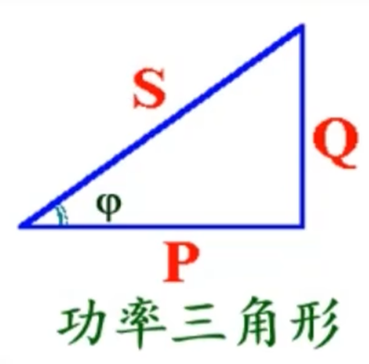
> 

#### 最大功率传输

复阻抗负载：当负载 $Z_L$ 为内阻抗 $Z_S$ 共轭时，负载获得最大功率．即 $Z_L=R_S-jX_S$（共轭匹配）．

电阻负载：当负载 $R_L$ 与内阻抗模相等时获得最大功率，即 $R_L=\sqrt{R_S^2+X_S^2}$​（等模匹配）．

最大功率为 $\dfrac{U^2}{4R_S}$．

### RLC电路的谐振

**Def.** 电容 $L$ 和电感 $C$ 的无功效应刚好抵消，含电容电感的二端网络呈现出纯电阻性．

谐振时，**电流电压同相**、功率系数为 1．

#### 串联谐振

串联时总阻抗

$$
Z=R+\dfrac{1}{j\omega C}+j\omega L=R
$$

即 $\omega L=\dfrac{1}{\omega C}$，当

$$
\omega=\omega_0 =\dfrac{1}{\sqrt{LC}}
$$

时串联谐振，对应

$$
f_0=\dfrac{1}{2\pi\sqrt{LC}}
$$

此时虚部为 0，总阻抗最小，$I=\dfrac{U}{R}$ 电流最大．

> 虽然总电压不一定很大，电感和电容两端的电压可能很大，局部形成高压；因为谐振时 $U_L$ 和 $U_C$ 大小相等、相位相反，对外互相抵消．

#### 并联谐振

并联时总导纳 

$$
Y=\dfrac{1}{R}+j\omega C+\dfrac{1}{j\omega L}=\dfrac{1}{R}
$$

仍然有 

$$
\omega=\omega_0 =\dfrac{1}{\sqrt{LC}}
$$

此时虚部为 0，总导纳最小、阻抗最大，电流最小．

> 同理虽然外部输入电流小，但电感支路和电容支路中的电流可能很大．

## 半导体

### 二极管

+ 理想二极管：正向导通视为短路，反向视为断路
+ 恒压降模型：硅管正向导通视为 0.7V 的恒压源，经过后电压降低；反向视为断路

判断二极管状态：假设断开，计算两侧电压判断是否导通；若导通视为 0.7V 恒压源参与后续计算．

### 稳压管

稳压管的参数：稳定电压、最大（小）稳定电流．稳压管工作条件是两端电压大于最大稳定电压，即被反向击穿．

与稳压管相关题目：将稳压管两端电压固定为为稳定电压，再计算通过稳压管的电流，判断其是否处于正常工作状态．

> [!example]+ 例
> 

> 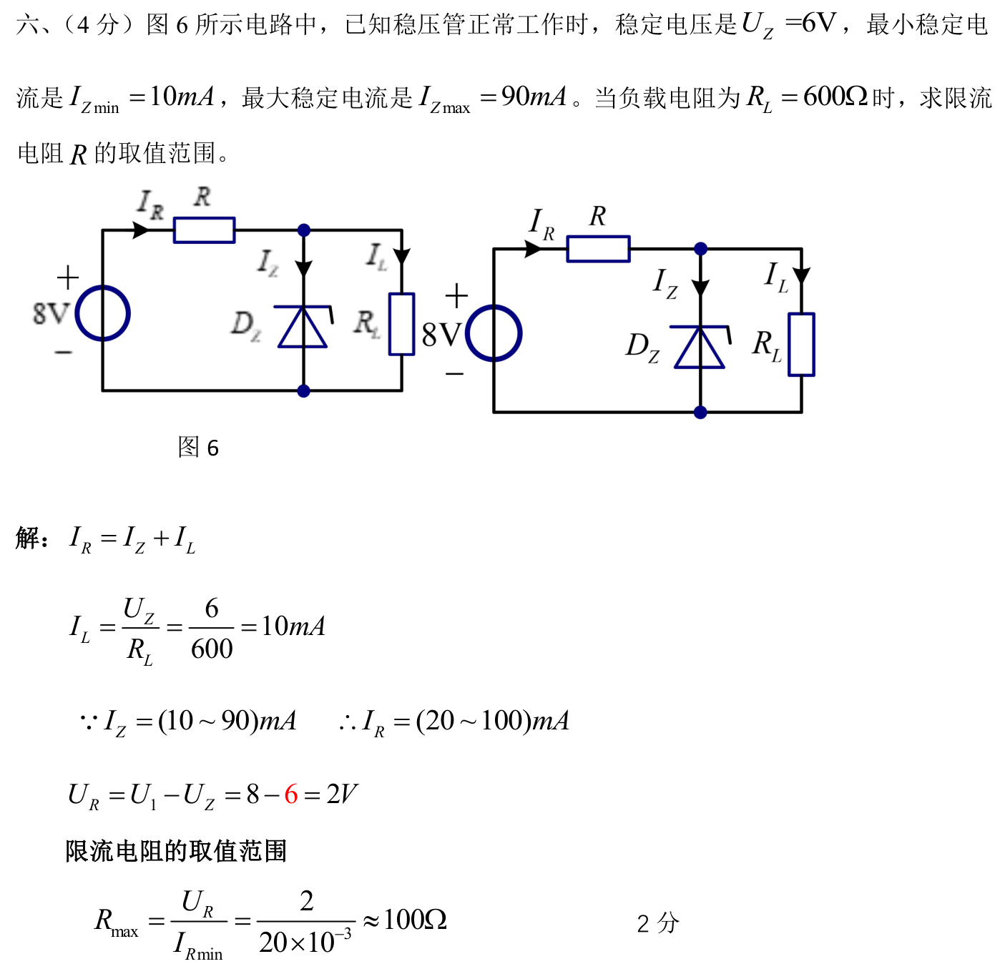
> 

### 三极管

考试常考 PNP 型三极管，分别为基极 b、集电极 c、发射极 e．基极一般接电阻 $R_{B}$，流经其电流为 $I_{B}$；集电极一般接电阻 $R_{C}$，流经其电流为 $I_{C}=\beta I_{B}$．三极管正常工作时，将 b 到 e 视为恒压降，即 $U_{BE}=0.7V$；且需要 $U_{C}>U_{B}$，即 $U_{CE}>U_{BE}$．

判断三极管处于 截止区 / 放大区 / 饱和区：

+ 若 $U_{BE}<0.7V$，截止；
+ 根据共射放大电路公式计算 $U_{CE}$，比较其与 $U_{BE}$ 大小，若大于则为放大区，反之为饱和区．

## 共射放大电路
放大电路会要求计算：

+ 直流通路时的静态工作点，包括 $I_{B},I_{C},U_{CE}$；此时将电容断开，输入 $U_{i}$ 视为短路
+ 交流通路时的交流信号如何放大，包括放大倍数 $A_{u}$，输入电阻 $R_{i}$、输出电阻 $R_{o}$；此时将电容视为短路，$V_{CC}$ 视为接地
### 直接耦合 & 阻容耦合

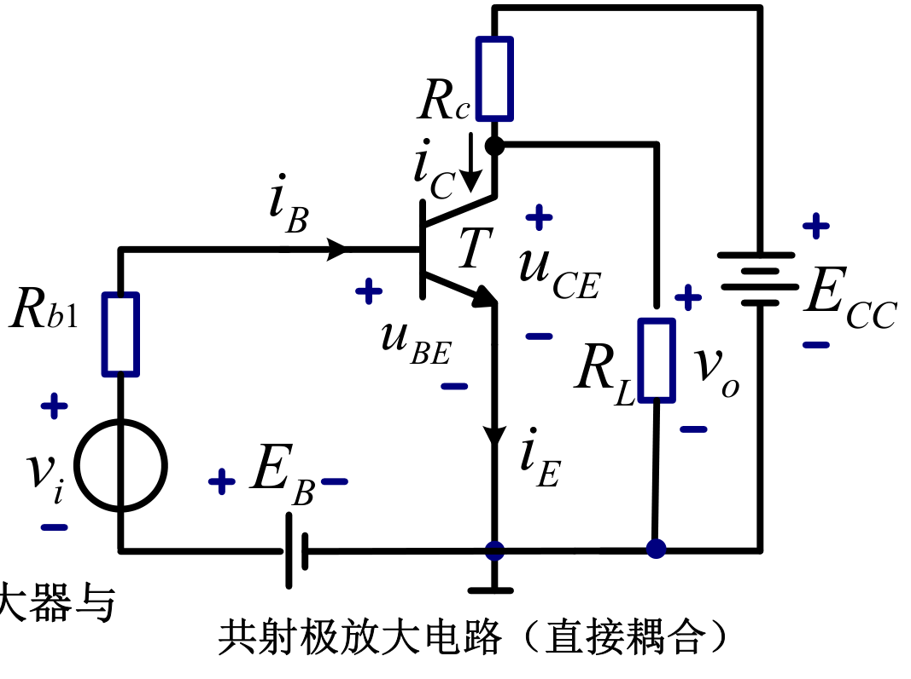
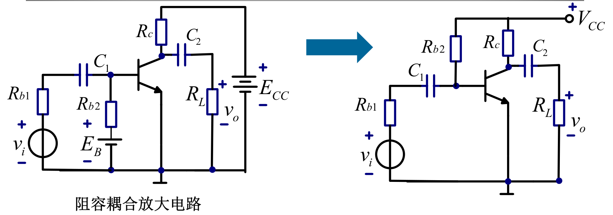

直流通路：
$$
\begin{cases}
I_{B}=\dfrac{V_{CC}- U_{BE}}{R_{B}}\\
I_{C}=\beta I_{B} \\
U_{BE}=0.7V \\
U_{CE}=V_{CC}-I_{C}R_{C}
\end{cases}
$$
