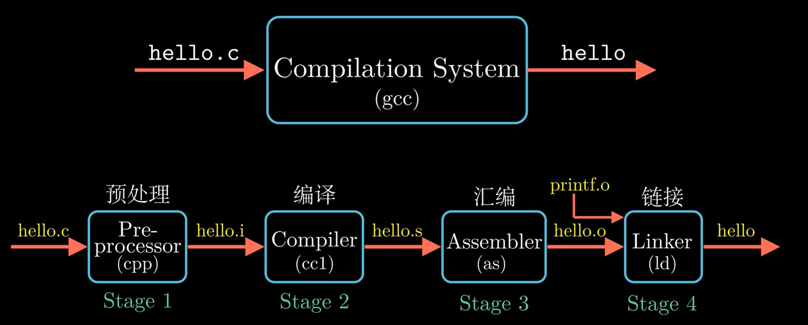

# C语言复习

## 编译

与Python、Java不同，C语言的编译与处理器类型（如MIPS，x86，RISC-V）和操作系统（如Windows、Linux、MacOS）相关．正是因为它对不同的架构做了针对的优化，其运行速度能远超其他高级语言．

> [!note] 编译过程
>
> 
>
> === "预处理阶段"
>
> 	预处理器会根据以 `#` 开头的代码，来修改原始程序．它会读取头文件（如 \<stdio.h\>）的内容并直接插入到程序文本中，同时替换所有的宏定义．这个阶段还未触及复杂的语法，只是纯粹的文本替换．
>
> 	经过预处理器处理后得到的文件通常以 `.i` 结尾．
>
> 	> [!warning] 宏定义陷阱
> 	>
> 	> 有时候我们使用宏定义来写出一些函数，例如：
> 	>
> 	> `#define min(X, Y) ((X) < (Y) ? (X) : (Y))` 
> 	>
> 	> 在某些情况下可能会出现错误．例如当Y是一个返回值为整数的函数时，该函数会被调用两次，可能会对结果产生影响．
>
> === "编译阶段"
>
> 	编译器将 `hello.i` 文件翻译成汇编程序 `hello.s`，这一过程即为编译．编译包括词法分析、语法分析、语义分析、中间代码生成以及优化等一系列中间操作．
>
> === "汇编阶段"
>
> 	汇编器将汇编程序 `hello.s` 翻译成机器指令，并将这一系列机器指令按照固定规则打包，得到可重定向目标文件——`hello.o`．此时 `hello.o` 是二进制文件，无法再用文本编辑器直接阅读．
>
> === "链接阶段"
>
> 	`hello.o` 需要和预编译好的目标文件（如 printf.o，它存在于标准 C 库中）进行合并，最终得到可执行目标文件 `hello`．

## 变量类型
C语言中的整数类型包括 `long long` `long` `int` `short`，在不同的架构下只保证：`sizeof(long long) >= sizeof (long) >= sizeof(int) >= sizeof(short)` 以及 `short` 至少为16bits、`long` 至少为32bits．这也就是推荐使用 `intN_t` 与 `uintN_t` 的原因，可以增强跨系统能力．

## 指针
指针变量的存储内容是地址．这也是C语言常用于底层操作的原因：指针可以直接对内存进行操作，极大提高了C语言的上限．

例如，在Python中将函数作为参数传入的操作，在C中可以通过函数指针实现．例如我们想要传入一个整型数组以及一个接受整型返回整型的函数，对数组的每一个元素都做一次函数操作，在Python和C中的实现分别为：

=== "Python"

    ```python
    def x10(x):
        return 10 * x
    
    def mutate_map(a, fp):
        for i in range(len(a)):
            a[i] = fp(a[i])
    
    a = [3, 1, 4]
    print(*a)
    
    mutate_map(a, x10)
    print(*a)
    ```
=== "C"

    ```C
    #include <stdio.h>
    
    int x10(int x) {
        return 10 * x;
    }
    
    void mutate_map(int a[], int n, int (*fp)(int)) {
        for (int i = 0; i < n; i++)
            a[i] = (*fp)(a[i]);
    }
    
    int main() {
        int a[] = {3, 1, 4}, n = 3;
        for (int i = 0; i < n; i++)
            printf("%d ", a[i]);
        printf("\n");
        mutate_map(a, n, &x10);
        for (int i = 0; i < n; i++)
            printf("%d ", a[i]);
    }
    ```

## 内存

### 堆区
**有关操作**：

+ `malloc()` 从堆区申请指定字节数的、未初始化的内存，并返回 `void*` 类型．
+ `free()` 用于清理动态分配的内存
+ `realloc(p, size)` 调整之前分配的内存块的大小．调整后内存块可能会移动到新的地址．

**底层实现**：

为了让 `malloc` 和 `free` 开销小、跑得快、避免碎片化（堆里有很多空闲字节，堆区有如下实现细节：

+ Header：每一个内存块都有一个 header，其由两个数据组成：内存块的大小、指向下一个内存块的指针．
+ Free List：所有空闲的内存块都被保存在一个循环链表里．
+ 合并：`free()` 会检查相邻的内存块是否也空闲，如果是就合并成更大的内存块，反之就直接把释放的内存块加入 Free List．

分配内存时的选块策略：

+ Best-fit：选择空间足够的块中最小的．
+ First-fit：选择第一个空间足够的块．
+ Next-fit：在 first-fit 的基础上，下一次寻找块从上一次结束处开始而不是从头开始．

> [!warning] 堆区容易引发的bug
>
> + 内存泄漏：申请的内存没有释放，这块内存空间无法再使用
> + 释放后使用：释放内存后再次使用会破坏其他正在使用这块内存的数据
> + 两次 Free：有可能会破坏 `malloc` 内部的管理数据结构．
> + 丢失原指针：修改申请内存后返回的指针，例如执行 `ptr++`．此时 `ptr` 会找不到该内存块的 header，不知道该内存块的大小，导致内存系统崩溃．
> + 乱用 `realloc`：`realloc` 可能会把内存块移动到新的地址，如果还保留原地址的指针并试图写入数据会出问题．