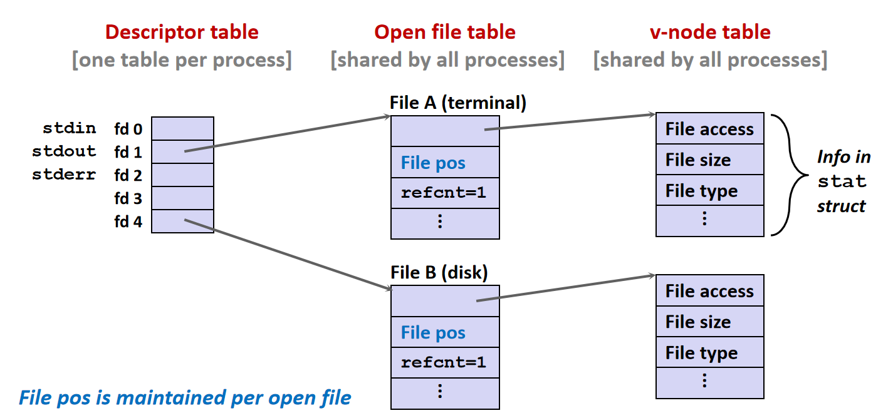
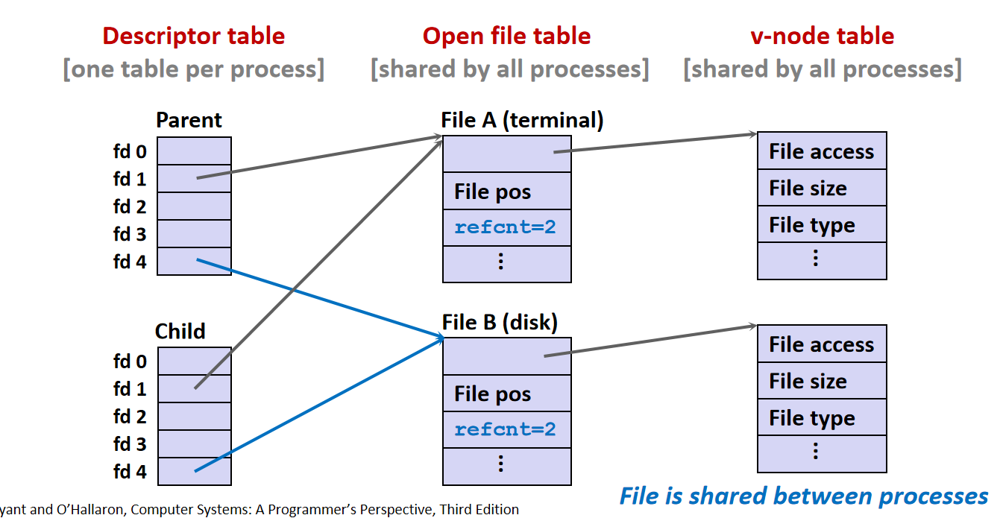

# Chap10: System-Level I/O

系统级 I/O 的主线可以分成三层：

+ **Unix I/O**：操作系统导出的低级接口，以文件描述符为中心，如 `open`、`read`、`write`、`close`、`lseek` 等．
+ **Standard I/O**：C 标准库提供的高级接口，以 `FILE *` stream 为中心，如 `fopen`、`fread`、`fprintf`、`fclose` 等，底层仍然通过 Unix I/O 实现．
+ **设备级 I/O**：CPU、内存和 I/O 设备之间真正传输数据的方式，主要包括 Programmed I/O、Interrupt driven I/O 和 DMA．

## Unix I/O

### File Abstraction

Unix 的核心抽象是：**所有 I/O 设备都被表示为文件，所有文件都可以看作字节序列**．

对于一个长度为 $m$ 字节的文件，可以表示为

$$
B_0,B_1,\cdots,B_k,\cdots,B_{m-1}
$$

内核会为打开的文件维护一个 **current file position**，表示下一次 `read` 或 `write` 开始的位置．如果当前位置为 $k$，那么下一次顺序读写会从 $B_k$ 开始，完成后文件位置随之更新．

### File Types

每个文件都有一个类型，表示它在系统中的作用：

+ **Regular file**：普通文件，包含任意数据．
+ **Directory**：目录，保存一组文件名到文件的映射．
+ **Socket**：套接字，用于和另一台机器或本机其他进程通信．

普通文件本身只是字节序列，内核并不知道文本文件和二进制文件的区别．所谓文本文件，是应用层约定的一种普通文件，其内容由 ASCII 或 Unicode 字符组成，文本行通常以换行符 `\n` 结尾．

> [!warning] 文本与二进制文件
>
> 处理二进制文件时，不应该使用 `fgets`、`scanf` 这类文本导向函数，也不应该使用 `strlen`、`strcpy`、`strcat` 这类字符串函数．因为二进制数据中的字节 `0` 会被字符串函数解释成字符串结束符．

### Directories and Pathnames

目录可以看作一个 link 数组，每个 link 将一个文件名映射到一个文件．每个目录至少包含两个特殊项：

+ `.`：指向目录自身．
+ `..`：指向父目录．

所有文件组织成一棵以 `/` 为根的层次结构．内核会为每个进程维护一个 **current working directory**，相对路径就是从当前工作目录出发解释的路径．

+ **Absolute pathname**：以 `/` 开头，从根目录开始定位，例如 `/home/bryant/hello.c`．
+ **Relative pathname**：从当前工作目录开始定位，例如 `../droh/hello.c`．

### File Descriptors

`open` 成功后会返回一个非负整数，称为 **file descriptor**，后续 Unix I/O 调用都通过这个整数标识打开的文件．

每个由 shell 启动的进程默认已经打开了三个文件：

+ `0`：standard input，标准输入，对应宏 `STDIN_FILENO`．
+ `1`：standard output，标准输出，对应宏 `STDOUT_FILENO`．
+ `2`：standard error，标准错误，对应宏 `STDERR_FILENO`．

文件描述符只在当前进程的描述符表中有意义，本质上是一个小整数索引．

## Basic Unix I/O Operations

### open

`open` 告诉内核：当前进程准备访问某个文件．

```C
#include <sys/types.h>
#include <sys/stat.h>
#include <fcntl.h>

int fd = open("/etc/hosts", O_RDONLY);
if (fd < 0) {
    perror("open");
    exit(1);
}
```

常见 flags：

+ `O_RDONLY`：只读
+ `O_WRONLY`：只写
+ `O_RDWR`：读写
+ `O_CREAT`：如果文件不存在则创建，通常需要第三个参数 `mode` 指定权限
+ `O_TRUNC`：打开时将已有内容截断为 0
+ `O_APPEND`：每次写入都追加到文件末尾

`open` 返回值小于 0 表示错误，成功时返回当前进程可用的最小文件描述符．

### close

`close` 告诉内核：当前进程不再访问这个打开文件．

```C
#include <unistd.h>

int ret = close(fd);
if (ret < 0) {
    perror("close");
    exit(1);
}
```

即使 `close` 看起来很简单，也应该检查返回值．在多线程程序中关闭一个已经关闭的描述符尤其危险，因为同一个整数编号可能已经被别的线程重新分配给另一个打开文件．

### read

`read` 从当前文件位置开始，将最多 `n` 个字节复制到内存缓冲区，并更新文件位置．

```C
#include <unistd.h>

char buf[512];
ssize_t nbytes = read(fd, buf, sizeof(buf));

if (nbytes < 0) {
    perror("read");
    exit(1);
}
```

`read` 的返回值含义：

+ `nbytes > 0`：实际读到的字节数．
+ `nbytes == 0`：遇到 EOF．
+ `nbytes < 0`：发生错误．

注意返回类型是 `ssize_t`，它是有符号整数，因为需要用负数表示错误．

### write

`write` 从内存缓冲区复制最多 `n` 个字节到当前文件位置，并更新文件位置．

```C
#include <unistd.h>

char buf[512];
ssize_t nbytes = write(fd, buf, sizeof(buf));

if (nbytes < 0) {
    perror("write");
    exit(1);
}
```

`write` 的返回值是实际写入的字节数．返回负数表示错误，返回小于请求字节数的非负值则属于 short count，不一定是错误．

### lseek

`lseek` 用于显式修改当前文件位置．

```C
#include <unistd.h>

off_t pos = lseek(fd, 0, SEEK_SET);
if (pos < 0) {
    perror("lseek");
    exit(1);
}
```

常见基准：

+ `SEEK_SET`：从文件开头计算偏移．
+ `SEEK_CUR`：从当前位置计算偏移．
+ `SEEK_END`：从文件末尾计算偏移．

套接字、管道、终端这类文件通常不支持随机定位．

### Short Counts

**Short count** 指 `read` 或 `write` 返回的字节数小于请求的字节数．它不是错误，而是 Unix I/O 编程必须显式处理的正常情况．

可能出现 short count 的场景：

+ `read` 遇到 EOF
+ 从终端读取文本行
+ 读写网络套接字
+ 被信号打断或底层设备暂时只能完成一部分传输
## Metadata

**Metadata** 是关于文件数据的数据，例如文件类型、大小、inode、链接数、拥有者、时间戳等．内核为每个文件维护 metadata，用户程序可以通过 `stat` 和 `fstat` 获取．

```C
/* Metadata returned by the stat and fstat functions */
struct stat {
    dev_t         st_dev;      /* Device */
    ino_t         st_ino;      /* inode */
    mode_t        st_mode;     /* Protection and file type */
    nlink_t       st_nlink;    /* Number of hard links */
    uid_t         st_uid;      /* User ID of owner */
    gid_t         st_gid;      /* Group ID of owner */
    dev_t         st_rdev;     /* Device type (if inode device) */
    off_t         st_size;     /* Total size, in bytes */
    unsigned long st_blksize;  /* Blocksize for filesystem I/O */
    unsigned long st_blocks;   /* Number of blocks allocated */
    time_t        st_atime;    /* Time of last access */
    time_t        st_mtime;    /* Time of last modification */
    time_t        st_ctime;    /* Time of last change */
};
```

`stat` 根据路径名查询文件，`fstat` 根据已经打开的文件描述符查询文件．

## Kernel Representation of Open Files

Linux 内核打开文件主要使用三张表：

+ **Descriptor table**：每个进程一张，文件描述符是这张表的索引．表项指向 open file table 中的某一项．
+ **Open file table**：所有进程共享，表项表示一次打开文件的实例，保存当前文件位置、引用计数、打开状态等．
+ **v-node table**：所有进程共享，表项表示文件本身，保存文件类型、大小、权限等 metadata．

current file position 维护在 open file table entry 中，而不是维护在 descriptor table entry 中．

+ `fork` 后，子进程继承父进程打开文件描述符的副本，但这些副本仍然指向原来的 open file table entry，因此父子进程共享文件位置．

<div style="text-align: center; margin-top: 15px;">

</div>

### File Sharing
同一个进程两次 `open` 同一个文件，会得到两个不同的 open file table entry，它们的文件位置相互独立．

> [!example]+
> 假设同一个文件内容为 `abcde`，连续执行三次 `open`：
> 
> ```C
> fd1 = Open(fname, O_RDONLY, 0);
> fd2 = Open(fname, O_RDONLY, 0);
> fd3 = Open(fname, O_RDONLY, 0);
> ```
> 
> 此时 `fd1`、`fd2`、`fd3` 分别指向三个不同的 open file table entry．即使它们最终对应同一个磁盘文件，三个 current file position 也是独立的．
> 
> 执行：
> 
> ```C
> Read(fd1, &c1, 1);
> Read(fd2, &c2, 1);
> Read(fd3, &c3, 1);
> ```
> 
> 三个读到的内容均为 `'a'`．

### dup & dup2

`dup` 会复制一个已有文件描述符，并返回当前进程中最小的未使用描述符．

```C
int newfd = dup(oldfd);
```

`dup2(oldfd, newfd)` 会把 `newfd` 变成 `oldfd` 的副本．如果 `newfd` 已经打开，内核会先关闭它，再让它指向 `oldfd` 对应的 open file table entry．

```C
dup2(oldfd, newfd);
```

`dup2` 复制文件描述符时，两个描述符会指向同一个 open file table entry，因此共享同一个文件位置．

> [!example]+
> 
> 考虑同上代码，但是在之前加一句 `dup2(fd2, fd3)`：
> 
> ```C
> dup2(fd2, fd3);
> Read(fd1, &c1, 1);
> Read(fd2, &c2, 1);
> Read(fd3, &c3, 1);
> ```
> 
> `dup2(fd2, fd3)` 会让 `fd3` 指向 `fd2` 指向的同一个 open file table entry，所以：
> 
> + `fd1` 独立读取第一个字节，`c1 = 'a'`． 
> + `fd2` 从自己的共享文件位置读取第一个字节，`c2 = 'a'`，共享位置前进到 1．
> + `fd3` 和 `fd2` 共享位置，因此继续读取第二个字节，`c3 = 'b'`．

> [!info]- 实现 I/O 重定向
> 
> dup2 是 shell 实现 I/O redirection 的基础．例如：
> 
> ```bash
> linux> ls > foo.txt
> ```
> 
> 1. `STDOUT_FILENO` 对应的文件描述符打开终端；再打开 `foo.txt`，假设得到文件描述符 `4`．
> 2. 子进程执行 `dup2(4, STDOUT_FILENO)`，让描述符 `1` 指向 `foo.txt`．
> 3. 子进程执行 `execve` 启动 `ls`．
> 
> `execve` 默认不会关闭已经打开的文件描述符，所以 `ls` 中对标准输出的写入会落到 `foo.txt` 中．

### fork

`fork` 调用一次，返回两次：

+ 在子进程中返回 `0`．
+ 在父进程中返回子进程 PID．

子进程几乎复制了父进程的执行状态：

+ 子进程拥有父进程虚拟地址空间的一份独立副本
+ 子进程拥有父进程打开文件描述符表的一份副本
+ 子进程 PID 与父进程不同

文件描述符表被复制，但表项指向的 open file table entry 没有复制，只是引用计数加 1，父子进程会共享打开文件的当前文件位置．

<div style="text-align: center; margin-top: 15px;">

</div>

考虑下面程序，文件内容为 `abcde`：

```C
fd1 = Open(fname, O_RDONLY, 0);
Read(fd1, &c1, 1);

if (fork()) {
    Read(fd1, &c2, 1);
    printf("Parent: c1 = %c, c2 = %c\n", c1, c2);
} else {
    Read(fd1, &c2, 1);
    printf("Child: c1 = %c, c2 = %c\n", c1, c2);
}
```

第一次 `Read` 在 `fork` 之前执行，所以父子进程的 `c1` 都是 `'a'`．`fork` 之后父子进程共享同一个 open file table entry，返回值非 0 则为父进程，反之则为子进程．

文件位置已经是 1．接下来谁先执行 `Read`，谁读到 `'b'`，另一个读到 `'c'`．

输出顺序无法预测，因为父子进程是并发执行的；输出会是二者其一：

```text
Parent: c1 = a, c2 = b
Child: c1 = a, c2 = c
```

```text
Child: c1 = a, c2 = b
Parent: c1 = a, c2 = c
```
## Standard I/O

### Stream Abstraction

C 标准库中的 Standard I/O 是比 Unix I/O 更高一层的接口．它把打开文件抽象成 **stream**，对应类型是 `FILE *`．

一个 stream 通常包含：

+ 底层文件描述符．
+ 用户态缓冲区．
+ 缓冲区当前位置、错误标志、EOF 标志等状态．

C 程序启动时默认已经打开三个 stream：

```C
#include <stdio.h>

extern FILE *stdin;
extern FILE *stdout;
extern FILE *stderr;
```

常见 Standard I/O 函数：

+ `fopen`、`fclose`：打开和关闭 stream．
+ `fread`、`fwrite`：读写二进制数据．
+ `fgets`、`fputs`：读写文本行．
+ `fscanf`、`fprintf`：格式化输入输出．
+ `fflush`：刷新输出缓冲区．
+ `fseek`：移动 stream 的文件位置．

### Buffering

Standard I/O 的核心优势是缓冲．很多程序会一个字符一个字符地处理输入输出，如果每次都调用 `read` 或 `write`，就会频繁陷入内核，开销很大．

缓冲读的思想是：

1. 底层通过一次 `read` 从内核读取一大块数据到用户态缓冲区．
2. `getc`、`fgets` 等函数从用户态缓冲区中逐字节或逐行取数据．
3. 缓冲区用完后再通过下一次 `read` 补充．

缓冲写的思想类似：

1. `printf`、`putc` 等函数先把数据放入用户态缓冲区．
2. 满足刷新条件时，再通过一次 `write` 写入底层文件描述符．

常见刷新条件：

+ 输出缓冲区满．
+ 调用 `fflush`．
+ 调用 `fclose` 或正常 `exit`．
+ `main` 返回．
+ 连接到终端的行缓冲 stream 遇到换行符．

例如多次调用：

```C
printf("h");
printf("e");
printf("l");
printf("l");
printf("o");
printf("\n");
```

底层可能只产生一次：

```text
write(1, "hello\n", 6)
```

### Standard I/O vs Unix I/O

Standard I/O 底层仍然用 Unix I/O 实现：

```text
fopen, fread, fwrite, fprintf, fflush, fclose
                 |
                 v
open, read, write, lseek, stat, close
```

两者的主要区别如下：

| 维度 | Unix I/O | Standard I/O |
| --- | --- | --- |
| 抽象对象 | `int fd` | `FILE *stream` |
| 所在层次 | 操作系统系统调用接口 | C 标准库接口 |
| 缓冲 | 通常需要程序员自己处理 | 库自动维护用户态缓冲区 |
| short count | 需要程序员显式处理 | 很多情况下由库函数自动处理 |
| metadata | 支持 `stat`、`fstat` | 不直接提供 metadata 接口 |
| 信号处理 | async-signal-safe，可用于信号处理函数 | 不是 async-signal-safe |
| 网络套接字 | 适合使用 | 不推荐直接使用 |

> [!info]+ 选择原则
>
> 一般原则是：尽量使用能满足需求的最高层 I/O 接口．
>
> + 处理磁盘文件或终端文件时，优先使用 Standard I/O，因为缓冲和文本处理更方便．
> + 在信号处理函数中使用 Unix I/O，因为 Standard I/O 不是异步信号安全的．
> + 需要访问 metadata 时使用 Unix I/O 的 `stat`、`fstat`．
> + 处理网络套接字时通常使用 Unix I/O 或专门的 robust I/O 包，不直接依赖 Standard I/O stream．

Standard I/O 的优点：

+ 缓冲机制减少 `read` 和 `write` 系统调用次数，提高效率．
+ 文本行、格式化输入输出等操作更方便．
+ 很多 short count 情况可以由库函数自动处理．

Standard I/O 的缺点：

+ 不提供访问文件 metadata 的函数．
+ 不是 async-signal-safe，不适合在信号处理函数中使用．
+ stream 的缓冲规则和套接字的半双工限制容易发生复杂交互，因此不推荐用于网络套接字．

Unix I/O 的优点：

+ 最通用、开销最低，其他 I/O 包通常都构建在它之上．
+ 可以访问文件 metadata．
+ async-signal-safe，可以安全用于信号处理函数．
+ 适合网络套接字、管道等非普通文件．

Unix I/O 的缺点：

+ short count 需要手动处理，容易出错．
+ 高效读取文本行需要自己实现缓冲．
+ 格式化输入输出不如 Standard I/O 方便．

## Device-Level I/O

从硬件角度看，在 CPU、设备和内存之间搬运数据时，常见方式有三种．

### Programmed I/O

Programmed I/O 也叫 Polling I/O，核心思想是 CPU 主动轮询设备状态寄存器，直到设备 ready，再读写数据寄存器．CPU 并不是停下来，而是在反复读取和判断状态寄存器．

Programmed I/O 的特点：

+ 实现简单，外设控制逻辑少．
+ 适合低速设备或很短的数据传输．
+ CPU 与外设串行工作，CPU 需要持续关注设备状态．
+ 查询开销很大，设备慢时 CPU 大量时间浪费在忙等待上．

> [!warning] 忙等待
>
> Polling 期间 CPU 用 100% 的执行时间为 I/O 服务，即使它只是反复检查设备是否 ready．这也是 Programmed I/O 的主要效率问题．

### Interrupt Driven I/O

Interrupt driven I/O 的核心思想是：CPU 启动 I/O 后不再持续轮询，而是去执行其他进程；设备完成当前工作后通过中断通知 CPU．

Interrupt driven I/O 的特点：

+ CPU 不需要一直忙等，设备工作期间可以运行其他进程．
+ 每完成一个字符或一个小块数据就可能触发一次中断，中断频繁时开销很大．
+ CPU 仍然参与每次数据搬运或每个阶段的启动工作．


### Direct Memory Access

Direct Memory Access，简称 DMA，核心思想是：由 DMA 控制器直接在高速外设和主存之间搬运数据，CPU 不参与每个字节或每个字的数据传输．

DMA 的基本流程：

1. CPU 将源地址、目的地址、传输长度、方向等参数写入 DMA 控制器．
2. CPU 向 DMA 控制器发送 `START` 命令．
3. DMA 控制器申请总线使用权，在设备和主存之间连续或分批传输数据．
4. 传输完成后，DMA 控制器发出 DMA 结束中断．
5. CPU 进入中断服务程序，完成确认、校验、解除阻塞等收尾工作．

DMA 的特点：

+ 适合磁盘、网卡等高速设备，以及成批数据交换．
+ CPU 只在初始化 DMA 和处理 DMA 结束中断时介入，I/O 开销很小．
+ DMA 控制器需要占用总线，因此可能和 CPU 访存产生竞争．
+ 需要考虑 cache consistency，否则 DMA 改写主存后 CPU cache 可能仍然保存旧数据．
+ 对很小的数据传输，初始化 DMA 的固定开销可能不划算．

### Three Types Comparison

| 类型 | 数据搬运者 | CPU 是否忙等 | 通知方式 | 适用场景 |
| --- | --- | --- | --- | --- |
| Programmed I/O | CPU | 是 | CPU 轮询状态寄存器 | 低速设备、小数据量 |
| Interrupt driven I/O | CPU 和设备驱动 | 否 | 设备完成后中断 CPU | 中低速设备、分散事件 |
| DMA | DMA 控制器 | 否 | DMA 完成后中断 CPU | 高速设备、成批数据 |

从效率角度看，Programmed I/O 最简单但 CPU 占用最高；Interrupt driven I/O 避免了长时间忙等，但频繁中断仍然有开销；DMA 将大批量数据搬运交给专门硬件，是高速 I/O 的主要方式．
