# Chap 3: Machine-Level Programming

## Historical Perspective

计算机指令集架构（Instruction Set Architecture）分类：

```
计算机指令集架构 ISA
│
├── CISC 风格
│   └── x86 家族
│       ├── 8086 / 80286：16 位 x86
│       ├── 80386 / i486 / Pentium：32 位 x86，也叫 IA-32
│       └── x86-64 / AMD64 / Intel 64：64 位 x86
│           ├── Intel Core / Xeon
│           └── AMD Ryzen / EPYC
│
└── RISC 风格
    ├── ARM 家族
    │   ├── ARMv7：常见 32 位 ARM
    │   └── ARMv8-A / ARMv9-A：常见 64 位 ARM，也叫 AArch64 / ARM64
    │       ├── Apple M 系列
    │       ├── Qualcomm Snapdragon
    │       └── AWS Graviton
    │
    ├── RISC-V 家族
    │   ├── RV32：32 位 RISC-V
    │   └── RV64：64 位 RISC-V
    │       ├── SiFive
    │       ├── 玄铁
    │       └── 香山等开源/研究处理器
    │
    ├── MIPS
    ├── PowerPC
    └── SPARC
```

本节课学习的 x86-64 是变长指令集（每个指令占字节数可能不一样），使用 AT&T 语法格式．

## Tools

objdump：`objdump -d bomb > bomb.asm` 反汇编

gdb：一些来自 [Arthal](https://arthals.ink/blog/bomb-lab) 的 gdb notes：

| 指令        | 全称     | 描述                                             |
| ----------- | -------- | ------------------------------------------------ |
| r           | run      | 开始执行程序，直到下一个断点或程序结束           |
| q           | quit     | 退出 GDB 调试器                                  |
| ni          | nexti    | 执行下一条指令，但不进入函数内部                 |
| si          | stepi    | 执行当前指令，如果是函数调用则进入函数           |
| b           | break    | 在指定位置设置断点                               |
| c           | continue | 从当前位置继续执行程序，直到下一个断点或程序结束 |
| p           | print    | 打印变量的值                                     |
| x           |          | 打印内存中的值                                   |
| j           | jump     | 跳转到程序指定位置                               |
| disas       |          | 反汇编当前函数或指定的代码区域                   |
| layout asm  |          | 显示汇编代码视图                                 |
| layout regs |          | 显示当前的寄存器状态和它们的值                   |

以及 `p` 或 `x` 的使用：`p` 用于打印表达式的值，`x` 用于检查内存内容：

```bash
p $rax  # 打印寄存器 rax 的值
p $rsp  # 打印栈指针的值
p/x $rsp  # 打印栈指针的值，以十六进制显示
p/d $rsp  # 打印栈指针的值，以十进制显示

x/2x $rsp  # 以十六进制格式查看栈指针 %rsp 指向的内存位置 M[%rsp] 开始的两个单位。
x/2d $rsp # 以十进制格式查看栈指针 %rsp 指向的内存位置 M[%rsp] 开始的两个单位。
x/2c $rsp # 以字符格式查看栈指针 %rsp 指向的内存位置 M[%rsp] 开始的两个单位。
x/s $rsp # 把栈指针指向的内存位置 M[%rsp] 当作 C 风格字符串来查看。

x/b $rsp # 检查栈指针指向的内存位置 M[%rsp] 开始的 1 字节。
x/h $rsp # 检查栈指针指向的内存位置 M[%rsp] 开始的 2 字节（半字）。
x/w $rsp # 检查栈指针指向的内存位置 M[%rsp] 开始的 4 字节（字）。
x/g $rsp # 检查栈指针指向的内存位置 M[%rsp] 开始的 8 字节（双字）。

info registers  # 打印所有寄存器的值
info breakpoints  # 打印所有断点的信息

delete breakpoints 1  # 删除第一个断点，可以简写为 d 1
```

## Registers

x86-64 有 16 个通用寄存器，每个寄存器为 8 字节大小．

主要关注：栈指针 `%rsp`、返回值 `%rax`、六个参数寄存器、Caller saved / Callee saved．

<div style="text-align: center; margin-top: 15px;">
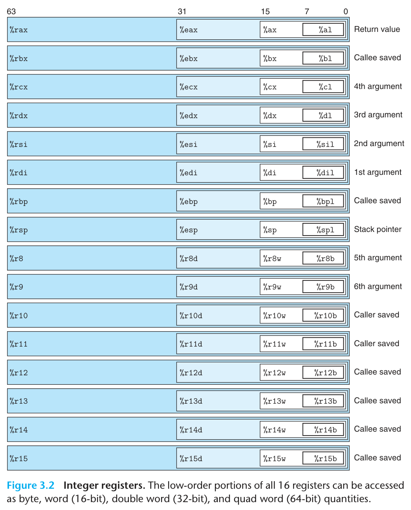
</div>

还有 Program Counter 寄存器：`%rip`（指向正在执行的指令地址）；条件码寄存器：`%rflags`．

## Instructions

### Operand

操作数可以为立即数、寄存器、内存寻址．

+ 立即数前要加 `$`，若不加 `$` 则表示寻址

+ 寻址模式为 $Imm(r_b, r_i,s)$ 表示 $Imm+R[r_b]+R[r_i]\cdot s$，其中 $R[]$ 表示寄存器里的数，$s$ 只能为 1, 2, 4, 8．可以当作是数组来使用，$R[r_b]$ 为基址，$s$ 为数组数据类型大小，$R[r_i]$ 为数组下标．立即数 $Imm$ 可以是一个数组名（也就是地址）

+ 一般而言，操作符（如move）的两个操作数不能都是内存寻址；以及一些想得到的不合法操作（如 `moveq %rax, $3` 修改立即数）

### Basics

根据操作数的字节数，大部分操作符都可以加上四种后缀：b (byte)、w (word，2字节)、l (long，4字节)、q (quad，8字节)．特别地，当对一个寄存器低 4 字节操作时，会自动清零其高 4 字节．

> [!example] 例
>
> ```bash
> movb %al, (%rbx)    # 移动 1 字节
> movw %ax, (%rbx)    # 移动 2 字节
> movl %eax, (%rbx)   # 移动 4 字节，同时高 4 字节清零
> movq %rax, (%rbx)   # 移动 8 字节
> ```

基础指令表：

<div style="text-align: center; margin-top: 15px;">
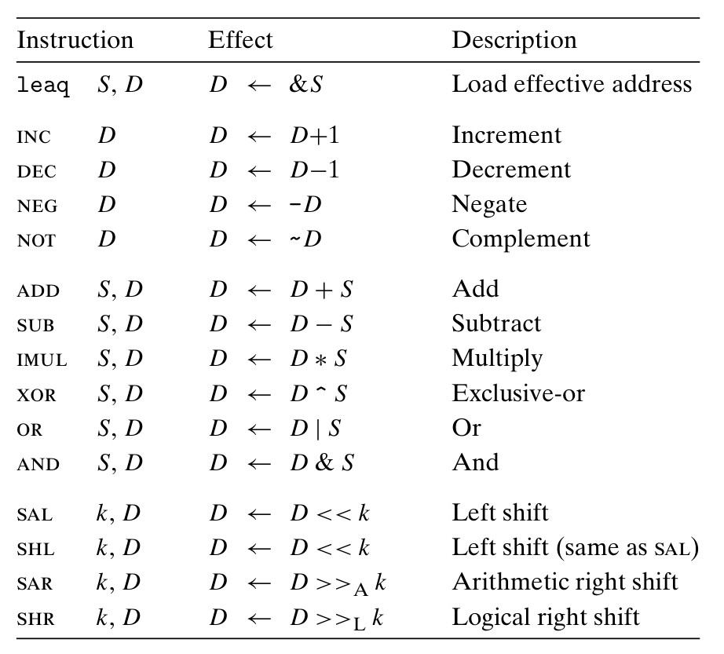
</div>
`mov` 指令与 `leaq` 指令不同之处：前者遇到寻址会进入内存地址，取出对应地址的数并做相应的操作；后者不进入内存，计算出寻址后将得到的地址做相应的操作（实际上是为了指针设计的，让一个变量存另一个的地址）．因此，编译器常用 `leaq` 完成一些乘法操作，如 `leaq (%rdi, %rdi, 2), %rax` 等同于 `%rax = %rdi + 2 * %rdi`．

`movzbl` 是使用零扩展（z，s对应符号扩展）将数据从 b（byte）扩展到 l（long）．由于对低 4 字节操作，因此该命令会把高 4 字节清零．注意没有 `movzlq`，因为 `movl` 会把高 4 字节清零．

移位操作的第一个操作数只能是立即数或 `%cl`；对于 w 位长的数据，其移位量为 `%cl` 里的数对 w 取模．

### Control 

`%rflags` 存放最近的测试状态，用于条件跳转．下图中每个 flag 都是单一 bit．机器通过条件码的排列组合判断最近的比较结果．在*基础指令表*中除了 `leaq` 的所有指令都会改变条件码．

<div style="text-align: center; margin-top: 15px;">
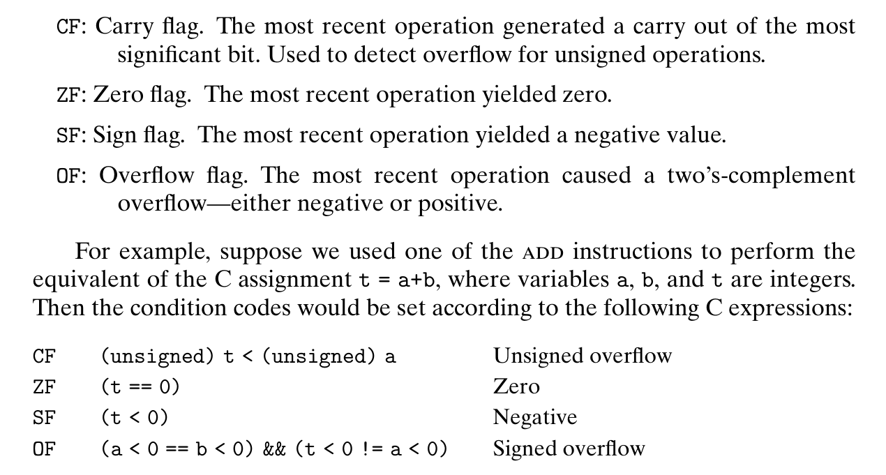
</div>
以 8 位为例：

+ CF：无符号进位 / 借位时为 1，如 `0xFFu + 0x01u = 0x00`（进位）或 `0x00u - 0x01u = 0xFF`（借位）
+ ZF：运算结果为 0 时为 1
+ SF：运算结果为负数时为 1
+ OF：有符号运算溢出时为 1，包括加法（正+正=负，负+负=正）和减法（正-负=负，负-正=正）

`cmp` 和 `test` 都是对两个操作数进行运算（前者是减法，后者是按位与），并根据运算结果设置条件码，但不更新其他寄存器．注意 `cmp` 的操作数顺序：如果想用 `jle` 判断 `x <= y`，应该用`cmp y, x`．

通常会把 `test` 的两个操作数设为同一个寄存器来判 0． 

<div style="text-align: center; margin-top: 15px;">
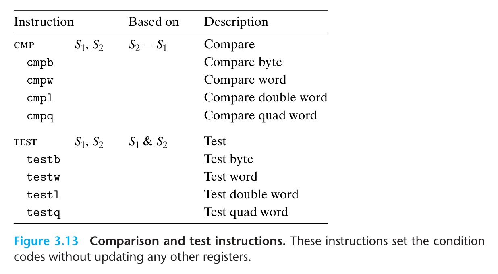
</div>

**`set` 类指令**：根据当前条件码状态来将单一字节设置为 0 / 1（因此操作数只能为单一字节寄存器）．这些操作对应的条件码不需要死记硬背，它的后缀就是我们期望的大小关系：

```C
int gt(long x, long y)
{
    return x > y;
}
```


```assembly
comp	%rsi, 	%rdi # x in %rdi, y in %rsi
setg	%al			 # set when >
movzbl	%al,	%eax # zero rest of %rax
ret
```

<div style="text-align: center; margin-top: 15px;">
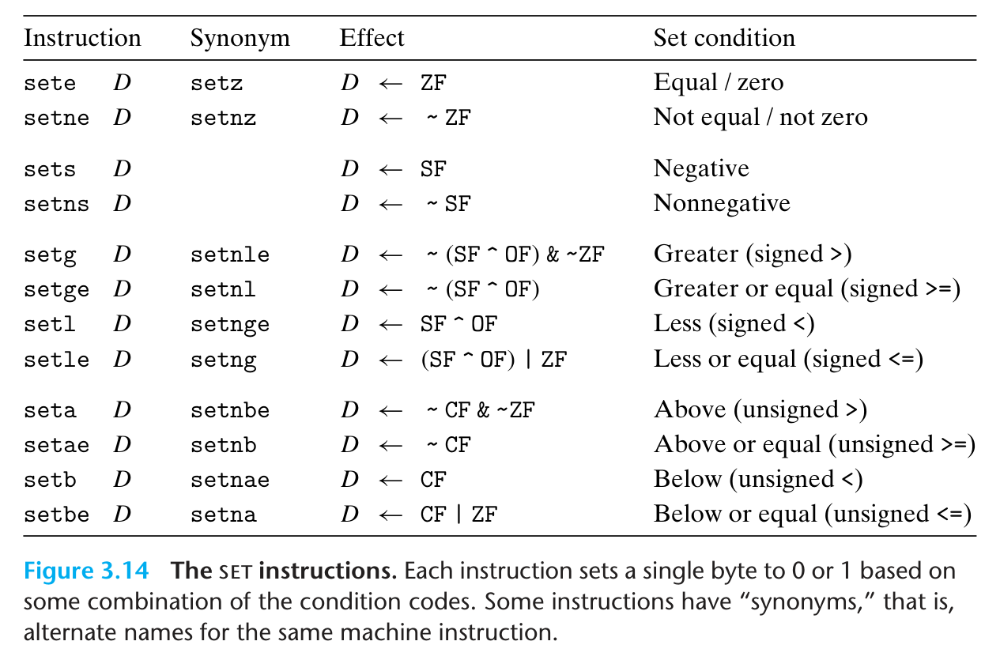
</div>

**`j` 类指令**：相当于修改 program counter `%rip` 的值到 label 的地址

<div style="text-align: center; margin-top: 15px;">
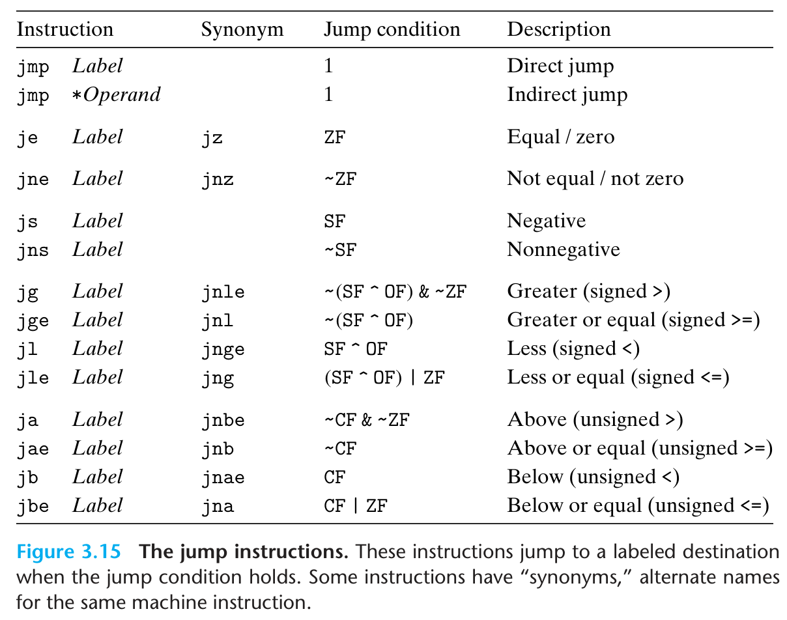
</div>

其实这类指令对应的后缀（e, ne, s, ns, g, ge 等）就是我们期望参数的大小关系，只不过我们要按照参数顺序在这之前先做一个cmp/test，然后调用这些访问条件码的指令．

**Conditional Move**：现代 CPU 流水线很深，可以理解为在流水线上放好了很多指令；在遇到条件跳转时，CPU 会猜跳转结果并按照猜的结果将指令放在流水线上．如果猜对了流水线可以继续运行，猜错就要把放的指令重新丢弃，pipeline flush．

因此，编译器对一些简单的分支会进行优化，例如

```C
long absdiff(long x, long y)
{
    long result;
    if (x > y) result = x - y;
    else result = y - x;
    return result;
}
```

编译器并不是根据分支来计算 `result`，而是将 `x - y` 和 `y - x` 的值都计算好，最后使用 `cmov` 判断条件来决定返回的是哪一个．也就是说汇编代码为：

```bash
# long absdiff(long x, long y)
# x in %rdi, y in %rsi
absdiff:
	movq	%rsi, %rax
	subq	%rdi, %rax	# rval = y - x
	movq	%rdi, %rdx	
	subq	%rsi, %rdx	# eval = x - y
	cmpq	%rsi, %rdi	# Compare x : y
	cmovge	%rdx, %rax	# If >=, rval = eval
	ret					# Return rval
```

如果条件分支的计算很复杂、有可能导致危险（如解引用空指针）、有副作用，那么编译器将不会使用 Conditional Move．

**Loop**：

Do-While Loop 在汇编代码中是最顺畅的，编译器也会偏向于优化成这类样式．我们可以用 `goto` 类型的 C 代码来感受代码的整体样式：

```C
loop:
	Body;
	if (Test)
    	goto loop
```

而 While-Loop 要先判断条件再执行，因此需要多一次测试跳转：

```C
	goto test;
loop:
	Body;
test:
	if (Test)
        goto loop;
```

For-Loop 可以换成 While-Loop，具体而言，

```C
for (Init; Test; Update)
{
    Body;
}
// 等价于
Init;
while (Test)
{
    Body;
    Update;
}
// 因此 goto 风格类似
    Init;
    goto test;
loop:
    Body;
    Update;
test:
    if (Test)
        goto loop;
```

**Switch**：当 case 值比较稀疏时，编译器会将其视作 if-else．稠密时，编译器会建立跳转表（类似数组索引，数组每一个元素的值都是一段其他代码的地址），实现 $O(1)$ 跳转（相较于 if-else 的 $O(n)$ 跳转），中间没有的数据就跳到 default．

> 小 tip：如果要判断 $x\geq 0$ 且 $x\le 6$，可以用无符号比较跳转 `ja`，当 $x>6$ 时跳转．因为是无符号比较，所以 $x<0$​ 时会被视为大正数，也会跳转走，用一个指令实现两个判断．  

> [!example]+ 例
>
> <div style="text-align: center; margin-top: 15px;">
> 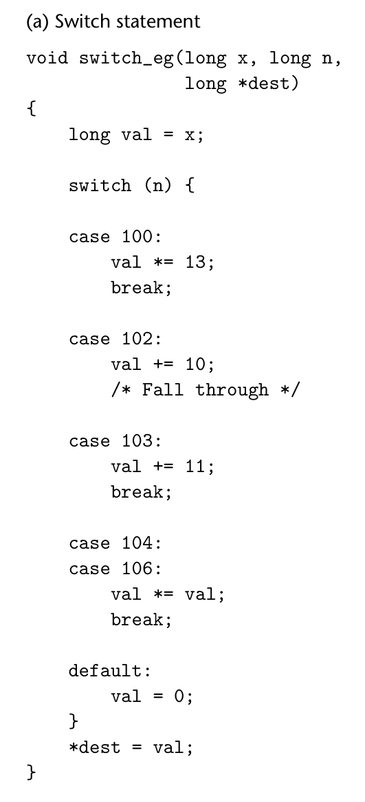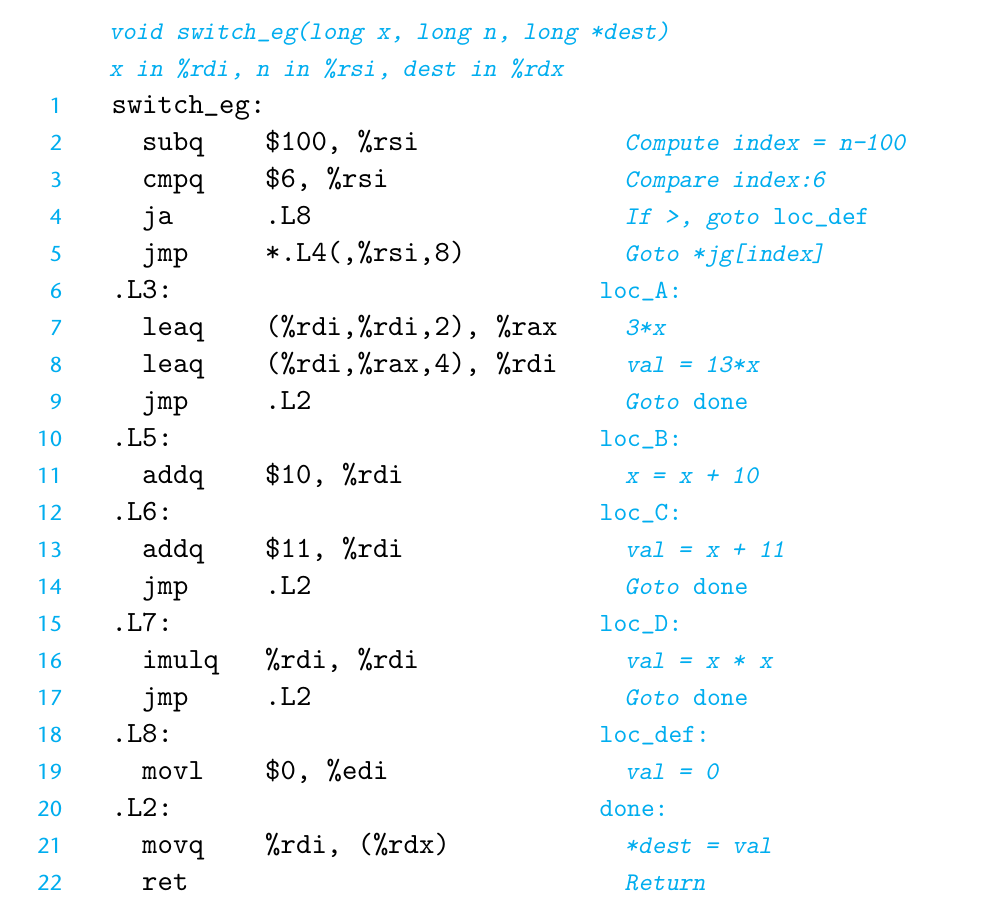
> </div>
>
> 其中 `*L4(, %rsi, 8)` 的 `*` 表示不是跳到 `L4(, %rsi, 8)` 本身，而是把这个地址里的内容取出来（也就是跳转表），把它当作目标地址跳过去．
>
> 实际上的跳转表如下图，他根据写好的代码块，将不同的 case 用下标对照到不同的代码块．
>
> <div style="text-align: center; margin-top: 15px;">
> 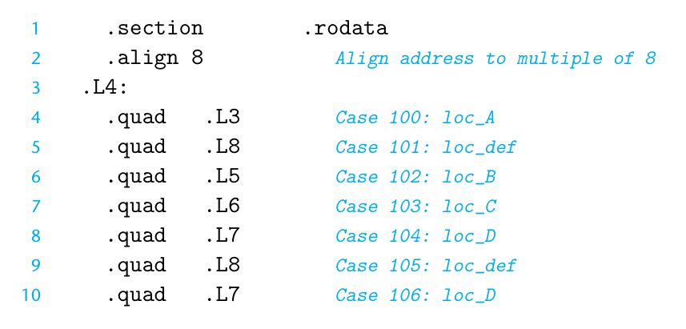
> </div>

### Procedures

**栈**：`%rsp` 指向栈顶地址，栈向低地址方向生长（通过减小 `%rsp`）．`

**`push & pop`**：

+ `pushq src`：栈指针减小 8 字节，取 src 的操作数（可以是立即数、寄存器、内存）写入栈指针指向的地址
+ `popq dest`：取栈指针指向地址的值写入 dest（必须是寄存器），栈指针增大 8 字节

**`call & ret`**：

+ `call label`：将返回地址（为 `call` 的下一条指令地址）压栈，跳到 label 处
+ `ret`：将返回地址弹出栈，跳回返回地址

> 虽然 call 和 ret 相当于 push、pop、jump 的组合，但无法用它们替代，因为我们无法修改 `%rip` 的值．

**栈帧**：每次调用函数所占用的栈空间，如返回地址、超过 6 个的参数、保存的寄存器、局部变量等．

通过栈来**传递参数**时，所有数据大小都向 8 的倍数对齐；即变量可能占 1、2、4 字节，但仍然给他们开 8 字节空间．

另外，如果需要将**局部变量**的地址作为参数传入函数时，必须压入栈中才能有地址（存在寄存器中没地址）．局部变量压栈时不需要 8 字节对齐，但需要**字节对齐**（参考结构体的内存对齐）．

```C
long call_proc()
{
    // 局部变量不需要 8 字节对齐
    long x1 = 1; 
    int x2 = 2;
    short x3 = 3; 
    char x4 = 4;
    // 传入的参数 x4 和 &x4 需要 8 字节对齐
    proc(x1, &x1, x2, &x2, x3, &x3, x4, &x4);
    return (x1 + x2) * (x3 - x4);
}
```

<div style="text-align: center; margin-top: 15px;">
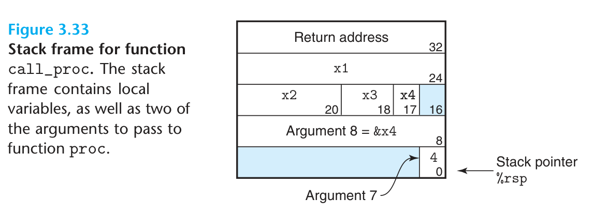
</div>

**寄存器调用约定**：

+ Caller Saved（包含 6 个参数寄存器、`%r10`、`%r11`）
+ Callee Saved（`%rbx`、`%r12`、`%r13`、`%r14`、`%rbp`、`%rsp`）

使用 Callee Saved 寄存器时，Callee 需要在使用前将它们压入栈中，并在返回前弹出．

> [!example] 典型的递归函数
>
> <div style="text-align: center; margin-top: 15px;">
> 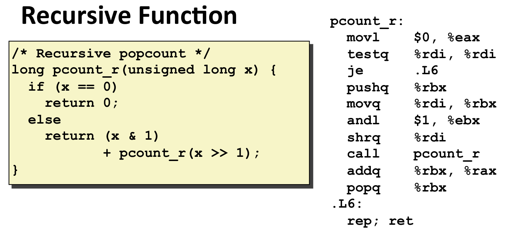
> </div>
>
> 返回值存 `%rax`、被调用者保存 `%rbp`，汇编程序都遵循 ABI（Application Binary Interface），程序才能正常运作．

## Data

**数组**：在机器层面，`a[i]` 等价于 `a` 的地址 + `i * sizeof(T)`，其中 T 为数组数据类型占用字节数．

<div style="text-align: center; margin-top: 15px;">
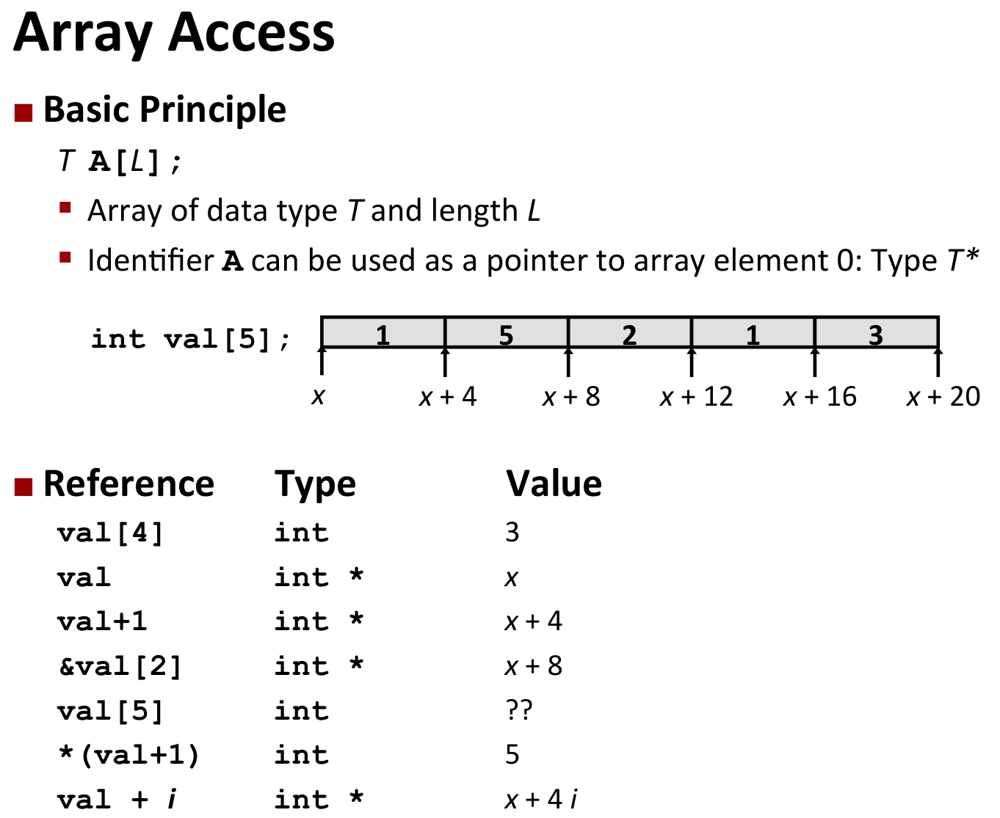
</div>

数组名与指针很相似，当在 C 语言中声明一个数组时，我们既分配了空间，也创建了一个允许使用指针计算的数组名称（指向分配的空间）；声明一个指针时，只是为指针本身分配了空间，但没有将其指向任何东西．

> [!info] 指针与数组辨析
>
> 下表给出一些指针和数组细微区别．Cmp 表示能否通过编译；Bad 表示使用空指针、野指针等不好的行为．
>
> <table class="compact-table">
>   <thead>
>     <tr>
>       <th rowspan="2">Decl</th>
>       <th colspan="3"><code>A<sub>n</sub></code></th>
>       <th colspan="3"><code>&ast;A<sub>n</sub></code></th>
>       <th colspan="3"><code>&ast;&ast;A<sub>n</sub></code></th>
>     </tr>
>     <tr>
>       <th>Cmp</th>
>       <th>Bad</th>
>       <th>Size</th>
>       <th>Cmp</th>
>       <th>Bad</th>
>       <th>Size</th>
>       <th>Cmp</th>
>       <th>Bad</th>
>       <th>Size</th>
>     </tr>
>   </thead>
>   <tbody>
>     <tr>
>       <td><code>int A1[3]</code>数组</td>
>       <td>Y</td>
>       <td>N</td>
>       <td>12</td>
>       <td>Y</td>
>       <td>N</td>
>       <td>4</td>
>       <td>N</td>
>       <td>-</td>
>       <td>-</td>
>     </tr>
>     <tr>
>       <td><code>int &ast;A2[3]</code>指针数组</td>
>       <td>Y</td>
>       <td>N</td>
>       <td>24</td>
>       <td>Y</td>
>       <td>N</td>
>       <td>8</td>
>       <td>Y</td>
>       <td>Y</td>
>       <td>4</td>
>     </tr>
>     <tr>
>       <td><code>int (&ast;A3)[3]</code>数组指针</td>
>       <td>Y</td>
>       <td>N</td>
>       <td>8</td>
>       <td>Y</td>
>       <td>Y</td>
>       <td>12</td>
>       <td>Y</td>
>       <td>Y</td>
>       <td>4</td>
>     </tr>
>     <tr>
>       <td><code>int (&ast;A4[3])</code>指针数组</td>
>       <td>Y</td>
>       <td>N</td>
>       <td>24</td>
>       <td>Y</td>
>       <td>N</td>
>       <td>8</td>
>       <td>Y</td>
>       <td>Y</td>
>       <td>4</td>
>     </tr>
>   </tbody>
> </table>
>
> （`A4` 和 `A2` 是等价的）
>
> <div style="text-align: center; margin-top: 15px;">
> 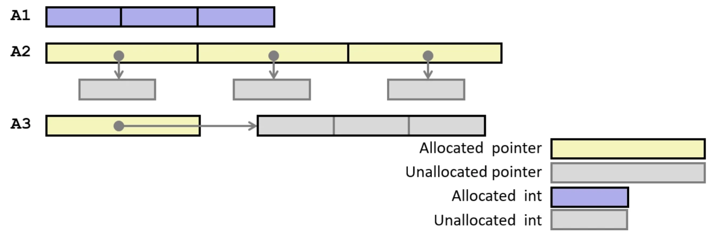
> </div>

二维数组是按照先行后列的顺序在内存中连续存储的．对于二维数组 `int A[R][C]`，每一个 `A[i]` 都是大小为 C 的数组，地址为 `A + (i*C*4)`；`A[i][j]` 地址为 `A + (i*C + j)*4`．

二维数组和指针数组的差别：指针数组在不同指针之间内存不是连续的．下图体现了两种嵌套数组的区别．

<div style="text-align: center; margin-top: 15px;">
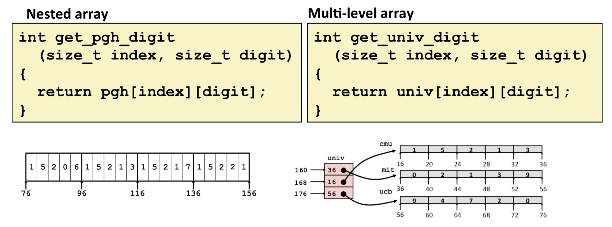
</div>

对于指针数组：内存不连续，因此要先访问指针存的内容得到数组地址；`univ(, %rdi, 8)` 是得到指针 `univ[index]` 并取它存的值，也就是它指向数组的地址．

<div style="text-align: center; margin-top: 15px;">
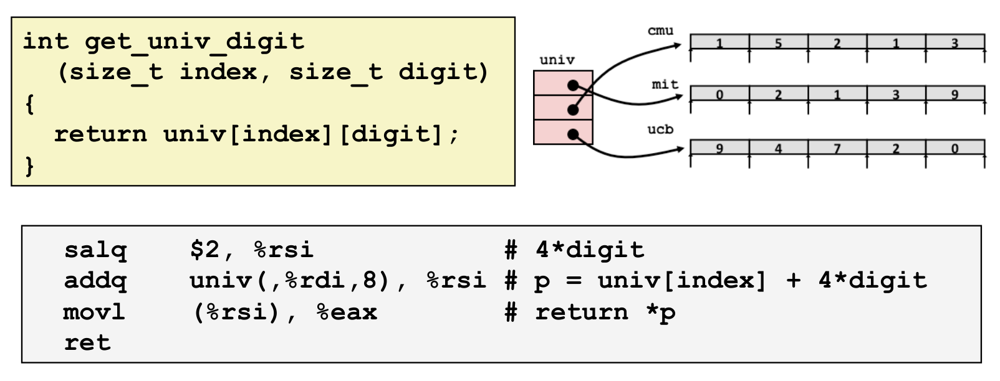
</div>

**结构体**：按照变量定义顺序，在内存中连续存储．但是要内存对齐：

+ 对于占用 K 字节的数据类型，其起始地址必须是 K 的倍数
+ 结构体占用内存大小必须是结构体内最大基本类型大小的倍数

原因是现在机器一次取内存 64 字节，内存对齐可以防止一个数据跨越了两个块的边界；而第二个是为了保证使用结构体数组时仍然可以对齐．

我们应当设计变量顺序，减少内存占用．

<div style="text-align: center; margin-top: 15px;">
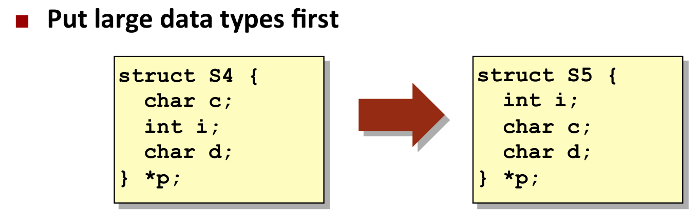
</div>
**联合体**：所有字段共享同一存储区域，联合体大小取决于最大字段大小．可以用于在不改变位模式下的数据类型转换，如 Datalab 中的 `bit2float` 函数：

```C
typedef union {
    float f;
    unsigned u;
} bit_float_t;

float bit2float(unsigned u)
{
	bit_float_t = arg;
    arg.u = u;
    return arg.f;
}
```

**浮点数**：浮点参数一般放在寄存器 `%xmm0 / %xmm1 / ...`（所有 `%xmm` 寄存器都是 caller-saved，返回值为 `%xmm0`）里，并且使用 `addss`（scalar single）、`addsd`（scalar double） 等操作． 

## Memory

### Layout

虽然 x86-64 属于 64 位机器，但只使用 48 位的地址，共 256 TB，其中 128 TB 内核空间，128 TB 用户空间（也就是栈底地址 0x0000 7FFF FFFF FFFF）．

内存区域对应代码示意图（由 GPT 生成）：

<div style="text-align: center; margin-top: 15px;">
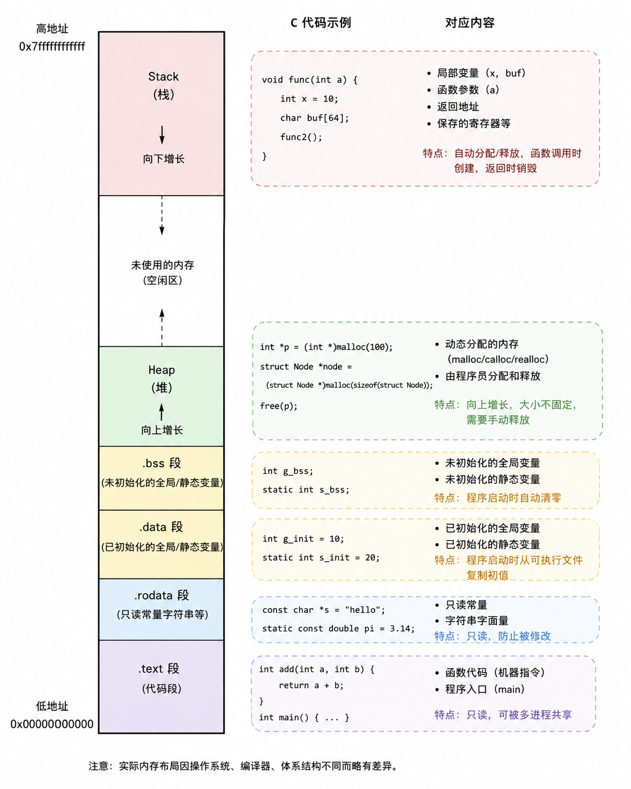
</div>

### Buffer Overflow

Unix `gets` 函数的实现：

```C
char *gets(char *dest)
{
    int c = getchar();
    char *p = dest;
    while (c != EOF && c != '\n') {
    	*p++ = c;
    	c = getchar();
    }
    *p = '\0';
    return dest;
}
```

其中 `dest` 为分配的缓冲区．但这个函数并不能判断是否填满缓冲区，如果读入内容比缓冲区大，就会出现**缓冲区溢出**问题．类似的函数还有 `strcpy`、`strcat`．

> [!example]+ 例
>
> 看下方的程序：
>
> ```C
> void echo()
> {
>     char buf[4]; /* Way too small! */
>     gets(buf);
>     puts(buf);
> }
> 
> void call_echo() {
>     echo();
> }
> ```
>
> 编译器会给 `buf` 开 24 字节的空间（尽管我们只写了 4 字节），当输入了 24 个字符时，程序会将空间全部填满，同时最后一个 `'\0'` 会破坏栈其他数据．此处它将 `call_echo` 压入栈的返回地址破坏，导致返回到奇怪的地方，出现问题．  
>
> <div style="text-align: center; margin-top: 15px;">
> 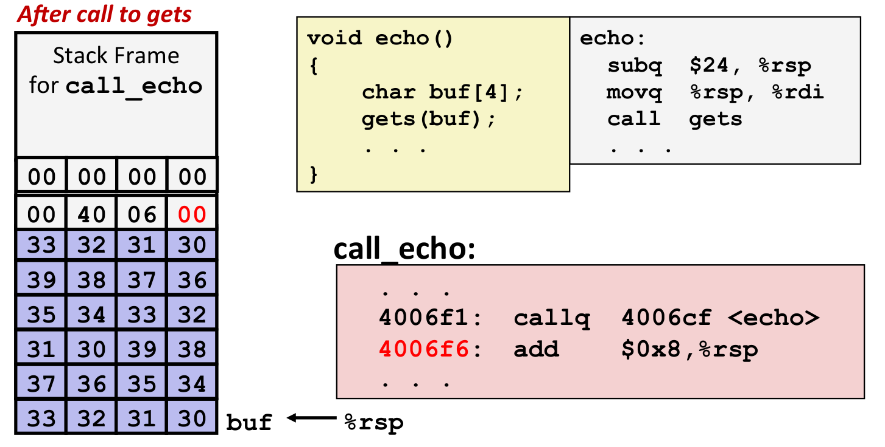
> </div>

### Avoid Attack

gcc 默认开启栈保护，编译时加入 `-fstack-protector` 可以将栈保护关闭．

1. 使用安全的函数：如使用 `fget` 而不是 `get`．前者会有一个参数表示最多读入多少字节，超过截断
2. ASLR（Address Space Layout Randomization）：让每次程序运行时地址都不一样，攻击者无法预测缓冲区的地址
3. 限制可执行代码区域：将栈标记为可读、可写，但是不可执行
4. 栈金丝雀：在缓冲区和栈保存的内容之间加入一个随机特殊值（金丝雀值），根据这个特殊值是否被修改判断程序是否被攻击

```bash
40072f: sub 	$0x18,%rsp
400733: mov 	%fs:0x28,%rax	# %fx:0x28 是内存中的某个值，即为此处的 canary
40073c: mov 	%rax,0x8(%rsp)	# 将 canary 存入栈指针偏移 8 字节处 (8 字节是为了字节对齐)
400741: xor 	%eax,%eax	
400743: mov 	%rsp,%rdi
400746: callq 	4006e0 <gets>
40074b: mov 	%rsp,%rdi
40074e: callq 	400570 <puts@plt>
400753: mov 	0x8(%rsp),%rax 	# 将 canary 从栈中取出来
400758: xor 	%fs:0x28,%rax	# 和 %fx:0x28 相等就没有问题，反之调用栈报错
400761: je 		400768 <echo+0x39>
400763: callq 	400580 <__stack_chk_fail@plt>
400768: add 	$0x18,%rsp
40076c: retq
```
