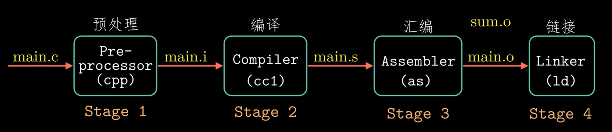
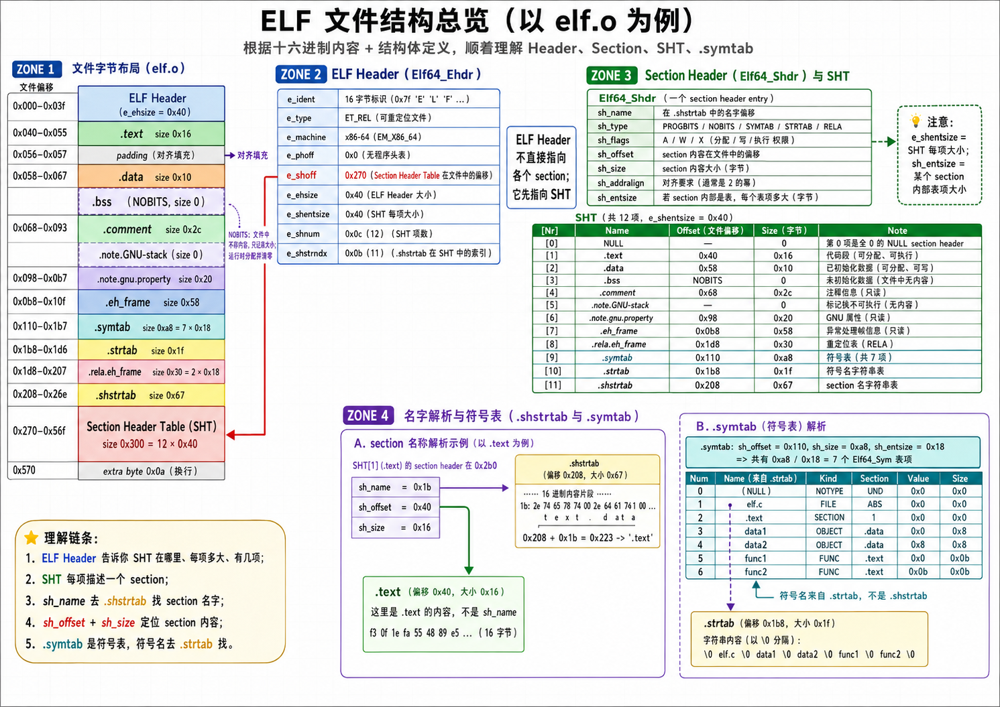
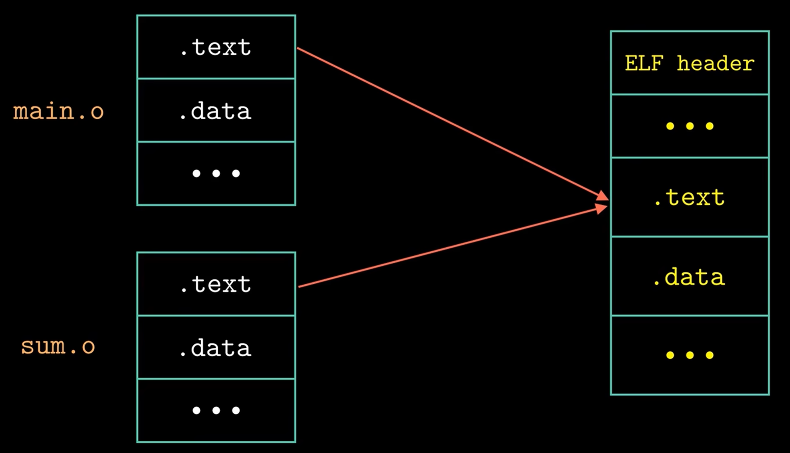

# Chap 7: Linking

## Compilation
广义上的**编译**分为以下几个步骤：
<div style="text-align: center; margin-top: 15px;">

</div>

1. C pre-processor：对源文件进行预处理，主要为库、宏定义替换，得到 `.i` 文件
2. Compiler：将 `.i` 文件翻译成汇编 `.s` 文件
3. Assembler：将 `.s` 文件翻译成可重定位目标文件 `.o`
4. Linker：将可重定位目标文件链接成可执行文件

## Sections

**ELF**：Executable and Linkable Format（可执行可链接格式）

每一个 ELF 分为三个部分：

+ ELF Header
+ Sections
+ Section Header Table（SHT）

以下面的 C 语言代码为例：

```C
unsigned long long data1 = 0xdddddddd11111111;
unsigned long long data2 = 0xdddddddd22222222;

void func1() {}
void func2() {}
```

**ELF Header**：在 x86/64 下通常为 64 字节，主要包含 SHT 的起始位置、SHT 的表项数量、每个表项的大小．根据这些可以推断出 SHT 的位置．

**SHT**：SHT 的每个表项对应一个 Section．

**Sections**：

+ `.text` 已编译程序的机器代码
+ `.data` 已初始化的全局和静态变量
+ `.bss` 未初始化或初始化为 0 的全局或静态变量．其不占用可执行文件中的实际数据空间，但运行时会占用内存空间（SHT 会记录 `.bss` 应该有多大，但这些空间由于最后会被初始化为 0，所以不需要记录那么多 0 占用空间）
	+ 对于未初始化的全局变量，由于其可能被外部引用而被赋值，因此其是暂定定义 tentative．在编译阶段，其符号为 COMMON．经过链接后，若外部将其赋值为非零，则存放于 `.data` 中，反之存放于 `.bss` 中．

<div style="text-align: center; margin-top: 15px;">

</div>

## Symbol

### Symbol Table

`linux> readelf -s main.o` 可以查看 ELF 的符号表．符号表包含了所有的符号，包括全局 / 静态变量、函数，每个符号有三个重要参数：

+ Bind：一般为 local / global / weak；只有 `static` 变量是 local（因为局部变量在栈存储，不会记录在符号表），只有用 `__attribute__((weak))` 修饰的函数 / 变量为 weak，属于弱符号（但弱符号不一定都是 weak bind）
+ Type：一般为 object / func / notype；如果函数声明而未定义、`extern` 变量声明而未定义则为 notype
+ Section：所在的 Section，或者 COMMON

```C
// (bind, type, section)

// extern 对函数来说基本没区别，因为 extern 作用在函数上时表示 “外部可见”，而函数默认外部可见
// 但对全局变量来说，加 extern 表示 x 在别的地方定义，此处只是引用
// extern int x = 1 这种写法会被自动忽略为 int x = 1

/*--------------------------------------------------*/
/* function (bind, type, section index) */
/*--------------------------------------------------*/

extern void f1(); // global, notype, undefined
extern void f2() {} // global, func, .text

void f3(); // global, notype, undefined
void f4() {} // global, func, .text

__attribute__((weak)) extern void f5(); // weak, notype, undefined
__attribute__((weak)) extern void f6() {}; // weak, func, .text

__attribute__((weak)) void f7(); // weak, notype, undefined
__attribute__((weak)) void f8() {}; // weak, func, .text

// warning: ‘f9’ used but never defined - fallback to f3
// static but not implement, so compiler delete "static"
static void f9(); // global, notype, undefined
static void fa() {} // local, func, .text

/*--------------------------------------------------*/
/* object (bind, type, section index) */
/*--------------------------------------------------*/

extern int d1; // global, notype, undefined
// warning: ‘d2’ initialized and declared ‘extern’ - fallback to d8
extern int d2 = 0; // global, object, .bss
// warning: ‘d3’ initialized and declared ‘extern’ - fallback to d9
extern int d3 = 1; // global, object, .data

// fallback to d5 - static define
static int d4; // local, object, .bss
static int d5 = 0; // local, object, .bss
static int d6 = 1; // local, object, .data

int d7; // global, object, COMMON
int d8 = 0; // global, object, .bss
int d9 = 1; // global, object, .data

// fallback to db
__attribute__((weak)) int da; // weak, object, .bss
__attribute__((weak)) int db = 0; // weak, object, .bss
__attribute__((weak)) int dc = 1; // weak, object, .data
```

### Strong / Weak Symbol

**强符号**：函数和已初始化的全局变量

**弱符号**：未初始化的全局变量

规则：不允许出现多个同名强符号，重定位时优先选择强符号．

## Static Libraries
可以将多个 `.o` 文件打包成一个静态库 `.a` 文件．静态库本质上是若干可重定位目标文件的集合，链接器在需要某个符号时，才会从静态库中抽取相应的成员目标文件．

使用静态库时，链接器会从左到右按照命令行出现的顺序扫描可重定位目标文件和静态库文件．在扫描过程中，链接器会维护三个集合：

- $E$：已经被加入最终可执行文件的目标文件集合；
- $U$：当前还没有解析的未定义符号集合；
- $D$：已经定义的符号集合．

对于普通 `.o` 文件，链接器会无条件将其加入 $E$；对于静态库 `.a` 文件，链接器只会抽取其中能够解析 $U$ 中未定义符号的成员目标文件．因此，静态库的顺序非常重要．

简单来说，命令行中文件的输入顺序应满足“先需求，后供给”：

- 普通目标文件 `.o` 通常放在前面，因为它们会先产生未定义符号；
- 静态库 `.a` 通常放在后面，因为它们负责提供符号定义；
- 如果多个库相互独立，它们可以以任意顺序放在命令行结尾；
- 如果库之间存在依赖关系，也需要满足“先需求，后供给”的顺序；
- 如果库之间存在循环依赖，可以在命令行中重复出现某些库，或者使用链接器的分组机制．

> [!example]+ 静态库链接顺序  
>  
> **Case 1：无循环依赖**  
>  
> 假设 `foo.o` 调用了 `libx.a` 和 `libz.a` 中的函数，而 `libx.a` 和 `libz.a` 又调用了 `liby.a` 中的函数，即：  
>  
> ```text  
> foo.o → libx.a  
> foo.o → libz.a  
> libx.a → liby.a  
> libz.a → liby.a  
> ```  
>  
> 此时应先放产生需求的文件，再放提供符号的库：  
>  
> ```bash  
> gcc -static -o foo foo.o libx.a libz.a liby.a  
> ```  
>  
> 其中 `libx.a` 和 `libz.a` 都依赖 `liby.a`，所以 `liby.a` 应放在它们之后．`libx.a` 和 `libz.a` 彼此独立，二者顺序可以互换．
>  
> **Case 2：存在循环依赖**  
>  
> 假设依赖关系为：  
>  
> ```text  
> foo.o → libx.a  
> foo.o → liby.a  
> libx.a → liby.a  
> liby.a → libx.a  
> ```  
>  
> 此时 `libx.a` 和 `liby.a` 之间存在循环依赖．一种可行写法是：  
>  
> ```bash  
> gcc -o foo foo.o libx.a liby.a libx.a  
> ```  
>  
> 也可以写成：  
>  
> ```bash  
> gcc -o foo foo.o liby.a libx.a liby.a  
> ```  
>  
> 这里重复出现某个库，是为了让链接器在扫描后面的库产生新未定义符号后，能够再次扫描前面的库来解析这些新需求．  
>  
> **Case 3：CS:APP Practice Problem 7.3 C**  
>  
> 依赖关系为：  
>  
> ```text  
> p.o → libx.a → liby.a  
> liby.a → libx.a → p.o  
> ```  
>  
> 一个最小可行命令是：  
>  
> ```bash  
> gcc -static -o p p.o libx.a liby.a libx.a  
> ```  
>  
> 解释如下：  
>  
> ```text  
> p.o 先加入链接，产生对 libx.a 中符号的需求  
> libx.a 解析 p.o 的需求，同时产生对 liby.a 的需求  
> liby.a 解析 libx.a 的需求，同时又产生对 libx.a 的新需求  
> libx.a 再次扫描，解析 liby.a 新产生的需求  
> ```  
>  
> 这里不需要在最后再次写 `p.o`．因为普通 `.o` 文件一旦出现，就会被无条件加入链接；而且 `p.o` 已经在最前面加入过了．后面真正需要重复扫描的是静态库 `libx.a`，不是目标文件 `p.o`．

## Relocation

考虑这两个函数

```C
// main.c
int sum(int* a, int n);

int array[2] = {1, 2};

int main()
{
	int val = sum(array, 2);
	return val;
}

// sum.c
int sum(int *a, int n)
{
	int i, s = 0;
	for (i = 0;  i < n; i++)
		s += a[i];
	return s;
}
```

分别对应可重定位目标文件 `main.o` 和 `sum.o`．

**第一步**：链接器会把相同类型的 section 合并为一个新的 section．这一步完成后，程序中每条指令、全局变量都有了唯一的运行时地址．

<div style="text-align: center; margin-top: 15px;">

</div>

**第二步**：重定位 section 中的符号引用．此时外部符号的目的地址为全 0，需要进行重定位．`.text` 段起始位置一般为 `0x4004d0`．

```assembly
00000000004004d0 <main>:
  4004d0:   48 83 ec 08             sub    $0x8, %rsp
  4004d4:   be 02 00 00 00          mov    $0x2, %esi
  4004d9:   bf 00 00 00 00          mov    $0x0, %edi  # %edi = &array  
  4004de:   e8 00 00 00 00          callq  13 <main+13>  # &sum
  4004e3:   48 83 c4 08             add    $0x8, %rsp
  4004e7:   c3                      retq
00000000004004e8 <sum>:
  ......
```
执行重定位需要重定位条目．只有 `.data` 和 `.text` 内的数据需要重定位，对应的重定位条目分别放在 `.rel.data` 和 `.rel.text` 中．

重定位条目的结构如图所示：
```C
typedef struct {
	long offset;    
	long type:32,
	     symbol:32;
	long addend;
} ELF64_Rela;
```
以 `callq sum` 为例：

+ `offset` 表示该需要重定位的项相对其所在函数的起始地址．对于 `sum` 而言，`offset = 0xf`
+ `type` 中最重要的两种类型是 `R_X86_64_PC32` 相对地址重定位和 `R_X86_64_32` 绝对地址重定位，此处为前者
+ `symbol` 表示重定位的目标符号名，此处为 `sum`
+ `addend` 表示用于修正的偏移量常数，由于使用 PC 相对寻址，并且在执行指令 `callq sum` 时 `%rip` 指向下一条指令地址 `0x4004e3`，而目标为 `0x4004df`，因此 `addend = -4`

链接器会通过当前函数地址和 `offset` 计算需要重定位的项的地址：

```C
ref_addr = ADDR(main) + r.offset
		 = 0x4004d0 + 0xf
		 = 0x4004df
```

再根据 `sum` 的地址、`ref_addr` 和 `addend` 计算得到其相对 PC 的地址：

```C
*ref_ptr = ADDR(sum) - ref_addr + r.addend
		 = 0x4004e8 - 0x4004df + (-4)
		 = 0x5
```

当 CPU 执行 `callq` 命令时，PC 的值为下一条指令地址 `0x4004e3`：

+ 将 PC 压栈
+ `PC <- PC + 0x5 = 0x4004e3 + 0x5 = 0x4004e8` 恰好为 `sum` 第一条命令地址