# Design and Debugging

这份课件的主线不是“会用几个调试命令”这么简单，而是训练一种工程思维：程序一定会有缺陷，人脑一定会被复杂性压垮，所以我们要用系统化调试、可测试设计、清晰沟通和可靠性测试来降低风险．

从零基础角度看，本章可以分成四层：

+ **Debugging**：程序出错后，怎样一步一步定位缺陷．
+ **Design**：写代码时，怎样提前降低调试难度．
+ **Reliability**：怎样理解故障、错误、失效和可靠度．
+ **Testing**：怎样用测试尽早暴露问题，而不是等上线后出事故．

## Debugging

### Defect、Error 和 Failure

调试之前，先区分三个词：

| 英文 | 常见译法 | 含义 | 例子 |
| --- | --- | --- | --- |
| Defect / Fault | 缺陷 / 故障 | 程序员写进代码或设计里的错误原因 | 忘记初始化变量，把 64 位浮点数强转成 16 位整数 |
| Error | 错误状态 | 缺陷被触发后，程序内部数据或控制流变错 | 某个变量变成垃圾值，程序跳到了不该跳的分支 |
| Failure | 失效 | 错误状态继续传播，最终在系统边界表现为不符合规格的行为 | 输出错误结果，系统崩溃，交易金额扣错 |

<div style="text-align: center; margin-top: 15px;">
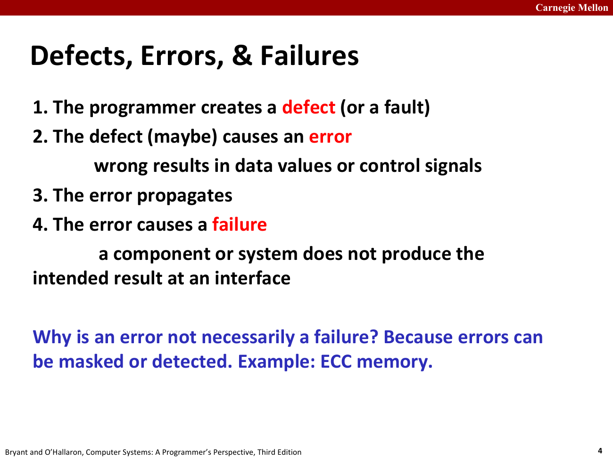
</div>

这三个概念之间的关系是：**缺陷不一定触发错误，错误不一定造成失效，但失效一定说明某处已经有错误状态暴露出来**．

> [!info]+ 为什么错误不一定变成失效
>
> 比如内存中某一位翻转，如果 ECC 内存及时检测并纠正，系统对外仍然给出正确结果，这时内部出现过错误状态，但没有变成用户可见的失效．

课件还强调一点：**不是所有缺陷都会马上表现出来**．有些缺陷是 latent defect，也就是潜伏缺陷．它可能藏在很少执行的分支里，也可能只在某个特殊输入、特殊时序、特殊平台上被触发．

### 显式调试：先把问题说清楚

很多调试失败不是因为工具不够强，而是因为一开始没有说清楚“到底哪里错了”．

显式调试的第一步是把问题写下来或说出来：

+ 我运行了什么程序．
+ 输入是什么．
+ 我期望得到什么．
+ 实际得到了什么．
+ 为什么实际结果违反了规格．

这就是常说的 rubber duck debugging，也就是把问题讲给一个“不会打断你”的对象听．真正有用的不是对象，而是你被迫把模糊感觉整理成清晰描述．

> [!tip]+ 调试时最重要的问题
>
> 不要一上来问“代码哪里错了”，先问“根据规格，它本来应该怎样”．如果不知道正确行为，就无法判断输出是不是 failure．

### 科学调试流程

课件推荐的调试方法类似科学实验：

1. **构造假设**：提出一个可能的缺陷，并解释它为什么能导致当前失效．
2. **做出预测**：如果这个假设成立，在某个新条件下程序应该出现什么现象．
3. **设计实验**：只改变一个条件，运行程序或观察状态．
4. **记录观察**：只记录事实，不急着解释．
5. **形成诊断**：如果多个实验支持假设，就把假设升级成 diagnosis．
6. **修复并确认**：修改代码后，确认原失效消失，而且没有引入新失效．
7. **总结学习**：把这次条件加入测试集，反思自己常犯的缺陷类型．

这里最容易犯的错是“同时改很多东西”．如果你一次改了三处，程序好了，你无法知道是哪一处真正修复了失效．

> [!warning]+ 不要越过第一个 bug
>
> 如果当前已经发现一个确定的缺陷，先修它并验证．不要一边修一边继续猜别的 bug，否则实验条件会混在一起，后面所有观察都变得不可靠．

### 例子：有 bug 的 Fibonacci

课件中的核心调试例子是 Fibonacci 函数．先看有缺陷的版本：

```C
int fib(int n)
{
    int f, f0 = 1, f1 = 1;

    while (n > 1) {
        n = n - 1;
        f = f0 + f1;
        f0 = f1;
        f1 = f;
    }

    return f;
}
```

主程序从大到小打印 `fib(9)` 到 `fib(1)`，可能得到：

```text
fib(9)=55
fib(8)=34
...
fib(2)=2
fib(1)=134513905
```

<div style="text-align: center; margin-top: 15px;">
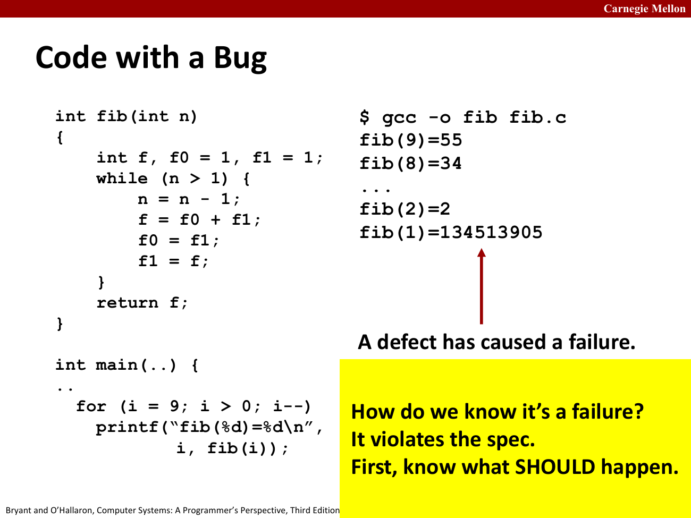
</div>

为什么我们知道 `fib(1)=134513905` 是 failure？因为规格定义第一个 Fibonacci 数是 `1`，程序输出违反了规格．

#### 第一步：构造假设

读代码后可以提出三个候选假设：

| 现象 | 假设 |
| --- | --- |
| `main` 从 `9` 调到 `1` | 结果依赖调用顺序，可能是上一次调用留下的状态影响下一次 |
| `while (n > 1)` | 循环条件可能错了，`n=1` 时没有进入循环 |
| `int f;` | `f` 没有初始化，`n=1` 时直接返回了垃圾值 |

对零基础读者来说，最关键的是理解第三点：在 C 语言里，函数内部的普通局部变量如果没有初始化，它的值是未定义的．`int f;` 只是告诉编译器“栈上有一个 int 位置叫 f”，但没有说这个位置里应该放什么．

当 `n=1` 时，`while (n > 1)` 为假，循环体一次都不执行，于是 `f = f0 + f1` 从来没有发生，最后 `return f;` 返回了一个未初始化变量．

#### 第二步：做出预测

每个假设都要能产生可检查的预测：

+ 如果结果依赖调用顺序，那么单独先调用 `fib(1)` 应该可能返回正确值．
+ 如果循环条件错了，把条件改成 `n >= 1` 后应该修复问题．
+ 如果 `f` 未初始化，把它改成 `int f = 1;` 后应该修复问题．

#### 第三步：实验和观察

课件里的实验结果是：

+ 先调用 `fib(1)`，仍然失败，说明“只由调用顺序导致”的假设站不住．
+ 把条件改成 `n >= 1`，`fib(1)` 变成 `2`，反而不符合规格，说明循环条件不是正确修复点．
+ 把 `int f;` 改成 `int f = 1;`，结果符合规格．

于是诊断是：**当 `n <= 1` 时，循环不会给 `f` 赋值，函数返回未初始化局部变量，导致未定义行为**．

可以这样修：

```C
int fib(int n)
{
    int f = 1, f0 = 1, f1 = 1;

    while (n > 1) {
        n = n - 1;
        f = f0 + f1;
        f0 = f1;
        f1 = f;
    }

    return f;
}
```

如果规格还要求处理 `fib(0)` 或负数，就应该额外写清楚输入合同，例如 `n >= 1`，或者显式处理非法输入．

> [!example]+ 这个例子真正想教什么
>
> 不要只记“变量要初始化”．更重要的是：先用规格确认 failure，再提出多个假设，然后用只改变一个条件的实验排除错误假设．这就是科学调试．

### 编译器警告：最便宜的第一道防线

课件要求编译时必须加：

```bash
gcc -Wall -Werror -O3 -o badfib badfib.c
```

+ `-Wall` 打开常见警告．
+ `-Werror` 把警告当成错误，让有风险的代码不能继续混过去．
+ `-O3` 是高优化级别，会暴露一些优化相关问题．

对上面的 Fibonacci 代码，编译器可能报：

```text
error: 'f' may be used uninitialized in this function [-Werror=maybe-uninitialized]
```

这其实已经把问题指到 `return f;` 附近了．

> [!warning]+ 不要忽略 warning
>
> 很多 C 语言 bug 在运行前已经被编译器提醒了．把 warning 当成“黄色装饰”会让后续调试成本暴涨．

### 为什么不同优化级别输出不同

课件展示了同一份代码在不同优化级别下的不同结果：

```text
gcc -O3 -o badfib badfib.c
fib(2)=2
fib(1)=0
fib(0)=0

gcc -O1 -o badfib badfib.c
fib(2)=2
fib(1)=9
fib(0)=9

gcc -O0 -o badfib badfib.c
fib(2)=2
fib(1)=2
fib(0)=2
```

这不是编译器“随机坏了”，而是 C 语言的未定义行为给了编译器很大自由．未初始化变量的值没有语义保证，优化器可以基于自己的假设重排、删减或复用寄存器，所以不同优化级别会得到不同输出．

调试时至少试 `-O0` 和 `-O3`：

+ `-O0` 更贴近源代码，方便 GDB 单步和看变量．
+ `-O3` 更接近最终提交或运行环境，能暴露优化下才出现的问题．

### Valgrind

Valgrind 是 Linux 下常用的 C/C++ 内存调试工具集．从使用者角度看，它会把程序放到一个受监控的虚拟执行环境里，检查内存访问、未初始化值、泄漏等问题．

常用编译方式：

```bash
gcc -g -O0 -o badfib badfib.c
valgrind ./badfib
```

+ `-g` 生成调试信息，让工具能把错误定位到源代码行．
+ `-O0` 让源码行和机器行为更容易对应．

课件展示了一个重要现象：在 `-O3` 下，Valgrind 对这个 Fibonacci 程序可能没有报错；在 `-O0` 下，它报告了未初始化值被 `printf` 使用．

<div style="text-align: center; margin-top: 15px;">
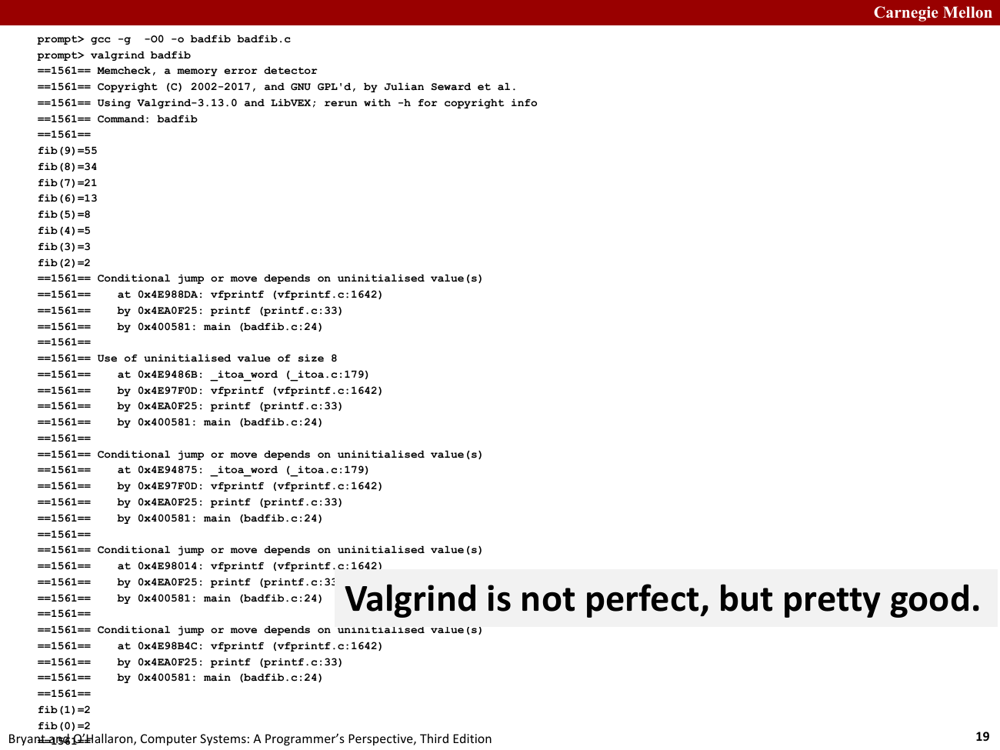
</div>

这说明 Valgrind 很有用，但不是完美神谕．它只能观察实际执行路径上的问题，而且会受优化、编译方式、运行条件影响．

更详细追踪未初始化值来源时，可以加：

```bash
valgrind --track-origins=yes ./badfib
```

### Valgrind 和 GDB 组合使用

Valgrind 擅长发现“这里发生了内存错误”，GDB 擅长让你停下来查看变量、栈帧和控制流．两者可以组合：

```bash
valgrind --vgdb=yes --vgdb-error=0 ./my_program
```

含义是：

+ `--vgdb=yes`：打开 Valgrind 与 GDB 的连接能力．
+ `--vgdb-error=0`：程序一启动就暂停，等待 GDB 连接．

<div style="text-align: center; margin-top: 15px;">

</div>

一般流程是：

1. 用 Valgrind 启动程序并暂停．
2. 另开终端启动 GDB．
3. 在 GDB 里连接 Valgrind 提供的目标．
4. 等 Valgrind 报错时，用 GDB 查看当前调用栈、局部变量和内存内容．

> [!tip]+ 工具分工
>
> Valgrind 更像自动巡检员，告诉你“这里有可疑内存行为”．GDB 更像显微镜，让你在可疑点附近逐步观察程序状态．

### 观察程序状态时要小心

课件提醒：观察本身可能改变程序行为．

最常见例子是 `printf` 调试．`printf` 会改变时序、栈布局、寄存器使用和 I/O 行为．对于并发 bug、未初始化变量 bug、内存越界 bug，加入 `printf` 后 bug 可能消失，这不是 bug 被修好了，而是实验条件变了．

更稳妥的做法是：

+ 每次只改变一个条件．
+ 把实验条件写下来．
+ 不要把“打印后正常”当成修复．
+ 对并发和内存问题优先用 GDB、Valgrind、sanitizer、日志级别控制等工具．

### 诊断、修复和学习

当一个假设解释了已有观察，并能预测新实验结果时，它就变成诊断．修复时要避免一个常见逻辑错误：post hoc, ergo propter hoc，也就是“改了之后好了，所以一定是这个改动修好的”．这不一定成立，因为你可能同时改了别的条件．

修复后要做三件事：

+ 重跑原来失败的场景，确认 failure 消失．
+ 跑相关场景，确认没有破坏原本正确的行为．
+ 把这次 failure 对应的输入加入测试集，防止以后回归．

断言和不变量也很重要．例如某个函数要求 `n >= 1`，可以在入口处写：

```C
#include <assert.h>

int fib(int n)
{
    assert(n >= 1);
    ...
}
```

但是断言不能有副作用：

```C
assert(i++ < n);   // 不推荐
```

因为发布构建里可能定义 `NDEBUG`，此时 `assert` 会被移除，`i++` 也会消失，程序行为就变了．

### Quick and Dirty 调试时间盒

课件给了一个实用时间分配：

| 时间 | 做法 |
| --- | --- |
| 0 分钟 | 先加 `-Wall`、`-Werror`，跑 Valgrind |
| 1 到 10 分钟 | 做非正式调试，快速检查 obvious mistake |
| 10 到 60 分钟 | 进入科学调试流程，写假设、预测、实验 |
| 超过 60 分钟 | 休息或找人帮助 |

这不是说 60 分钟后一定不能继续，而是提醒你：长时间盯着同一个错误时，大脑会陷入局部循环．换一个人或换一种表达方式，常常能打破盲点．

### 常见 Code Smells

课件列出的典型坏味道包括：

+ 未初始化变量．
+ 计算出来但没有使用的值．
+ 不可达代码．
+ 内存泄漏．
+ 接口误用．
+ 空指针．

这些不一定都是已发生的 failure，但都是缺陷高发区．

## Design

### 设计的目标

好设计要同时考虑性能、可用性、可修改性、可移植性、可扩展性、安全性、可测试性、易用性、构建成本和运行成本．

但课件强调：**最重要的是 readable**．不可读的代码会让所有目标都变难：

+ 性能问题难定位．
+ 安全问题难审计．
+ 功能修改难评估影响范围．
+ 测试用例难设计．
+ 未来的你也会看不懂．

所以好设计的两个核心任务是：

+ **Complexity Management**：管理复杂性．
+ **Communication**：和机器、同事、评审者、未来的自己沟通．

### 管理复杂性

人脑能同时处理的细节很有限．程序一旦变大，就不能靠“我记得住所有情况”来写代码．常见复杂性管理方法包括：

+ Separation of concerns：把不同关注点分开．
+ Modularity：模块化．
+ Reusability：复用可测试的小块．
+ Extensibility：未来容易扩展．
+ DRY：不要重复自己．
+ Abstraction：抽象出稳定接口．
+ Information hiding：隐藏内部细节．

这些词听起来抽象，但落地到代码就是：**函数只做一件明确的事，模块通过接口交流，测试能直接覆盖每个小块**．

### 例子：cache access 如何拆成可测试组件

课件用 cache simulator 举例．一次 cache access 看起来只是“访问一下地址”，但里面其实有很多步骤：

1. 把地址拆成 tag、set index、block offset．
2. 用 set index 找到对应 set．
3. 在 set 中检查是否有 line 的 tag 匹配．
4. 如果匹配，就是 hit．
5. 如果不匹配，就是 miss．
6. miss 时找到 LRU line．
7. 必要时驱逐 LRU line．
8. 从内存读入新 line．
9. 更新 LRU 信息．
10. 如果操作是 store，还要更新 dirty 标记．

<div style="text-align: center; margin-top: 15px;">
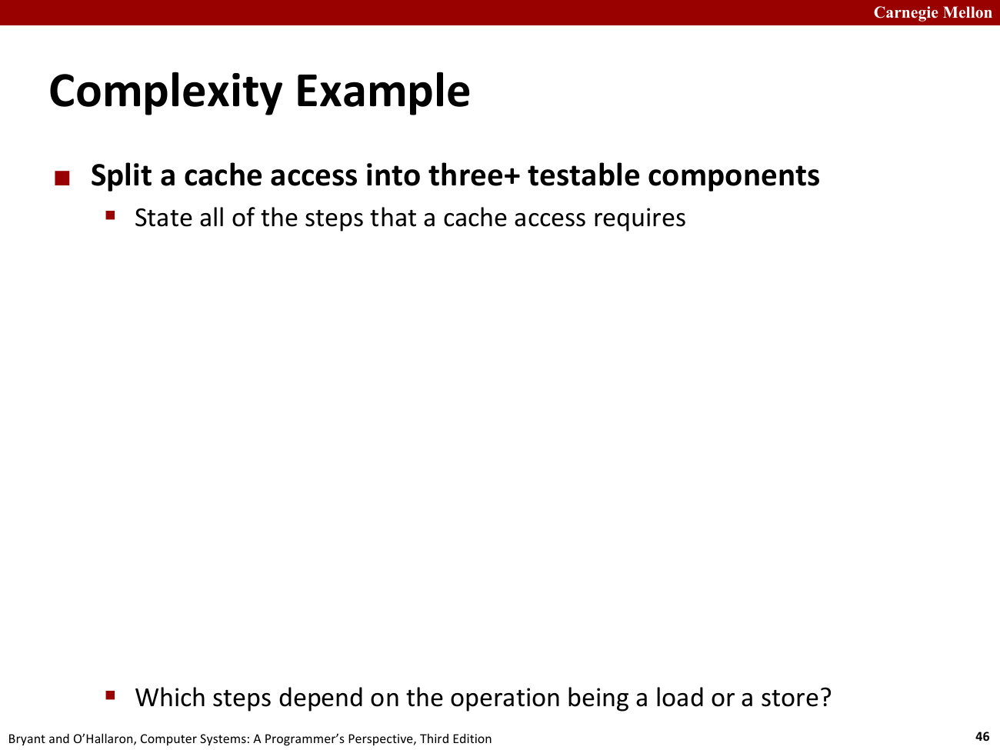
</div>

如果把这些步骤全写在一个大函数里，调试会很痛苦．更好的拆法是：

```C
AddressParts split_address(uint64_t address, int set_bits, int block_bits);
CacheLine *find_matching_line(CacheSet *set, uint64_t tag);
CacheLine *select_victim_line(CacheSet *set);
void update_lru(CacheSet *set, CacheLine *line);
void mark_dirty_if_store(CacheLine *line, AccessType type);
```

这样每个函数都能单独测试．比如 `split_address` 只关心位运算，完全不需要真实 cache．`select_victim_line` 只关心 LRU 规则，也不需要知道地址怎么拆．

> [!example]+ cache hit 测试 trace
>
> 课件给出一个最小 trace：
>
> ```text
> L 50, 1
> L 50, 1
> ```
>
> 第一次读取地址 `50` 时，如果 cache 为空，应该是 miss 并把对应 block 放入 cache．第二次读取同一地址，应该命中同一 line，所以应该是 hit．

> [!example]+ dirty byte 测试 trace
>
> ```text
> S 100, 1
> ```
>
> `S` 表示 store．store 不只是访问 cache，还会把对应 line 标成 dirty，因为 cache 中的数据比下层内存更新．如果 simulator 最后要统计 dirty bytes，这种单独 trace 就能专门验证 dirty 逻辑．

### Testing 和 Contract 都是设计活动

课件说 testing 和 contracts 不是只在最后验证代码，而是设计的一部分．

Contract 是接口承诺，例如：

+ 输入必须满足什么前置条件．
+ 函数会返回什么结果．
+ 函数会不会修改传入对象．
+ 出错时如何报告．

测试是 executable documentation，也就是可执行文档．读测试的人能看出函数应该怎样用，应该怎样响应边界条件．

### Trust the Compiler

课件说要信任编译器：

+ 多用临时变量．
+ 多用小函数．
+ 让编译器做优化计算．

这句话的意思不是“随便写低效代码”，而是不要为了手工省一两个变量，把逻辑写成读不懂的表达式．现代编译器很擅长消除不必要的临时变量和内联小函数，但它不能帮你把混乱设计变清楚．

## Communication

### 代码是在和谁沟通

写代码时，你同时在和四类对象沟通：

+ 机器：编译器和 CPU 要执行你的指令．
+ 其他开发者：他们要维护你的代码．
+ code reviewer：他们要判断代码是否正确．
+ 未来的自己：几周后你可能已经忘了当初为什么这样写．

沟通手段包括测试、命名、注释、commit message、code review 和设计模式．

### 命名就是理解

课件引用了一句话：如果你不知道一个东西应该叫什么，你就不知道它是什么；如果你不知道它是什么，你就写不出正确代码．

好命名的原则：

1. 从含义和意图出发．
2. 使用精确词汇，少用 `data`、`info`、`perform` 这类泛词．
3. 名字少而准，不堆长短语．
4. 避免随意缩写．
5. 借助 code review 改名．
6. 把代码读出来，检查是否顺口．
7. 真的去重命名，不要怕改．

#### 不要故意使用无意义名称

`a`、`foo`、`blah`、`tmp` 大多数时候都不好，因为它们不给读者任何语义．

但也有合理例外：

```C
void swap(int *a, int *b)
{
    int tmp = *a;
    *a = *b;
    *b = tmp;
}
```

这里 `a`、`b` 是对称的两个参数，`tmp` 的生命期很短，作用就是临时交换．这种情况下短名反而清楚．

#### 单字母名要谨慎

单字母不可搜索，也没有语义．循环计数器 `i`、`j` 是例外，C/Unix 里还有一些传统短名也可以接受，例如：

+ `fd` 表示 file descriptor．
+ `str` 表示 string 参数．
+ `fp` 表示 file pointer．

关键是：**遵循已有风格，并确保读者能立刻知道含义**．

#### 控制名字长度和词数

课件给出对比：

+ `arraysOfSetsOfLinesOfBlocks` vs `cache`．
+ `evictedData` vs `evictedDataBytes`．

第一个名字把实现细节都塞进变量名，读者反而抓不住抽象．如果这个对象在业务上就是一个 cache，那么叫 `cache` 更好．

第二组里，如果变量单位是 bytes，`evictedDataBytes` 比 `evictedData` 更精确．

#### 用领域术语

在 cache lab 里，`line`、`set`、`tag`、`block offset` 是领域术语．如果作业说明里叫 line，就不要自己改叫 element，否则读者会怀疑你是不是指另一个概念．

#### 精确使用反义词

常见成对词要统一：

+ `first` / `last`．
+ `begin` / `end`．
+ `min` / `max`．
+ `open` / `close`．
+ `push` / `pop`．

不要写 `first` / `end` 这种混搭，除非项目已有固定约定．

### 注释：不要解释代码在做什么，要解释为什么

坏注释有三类：

+ 重复代码已经表达的事实．
+ 替难懂逻辑打补丁，而不是重构逻辑．
+ 注释太多，后来过期．

课件给了一个非常典型的可读性例子：

```C
(*(void **)((*(void **)(bp)) + DSIZE)) = (*(void **)(bp + DSIZE));
```

这行代码也许在操作隐式空闲链表，但读者几乎不可能一眼看懂．如果结构体和字段抽象得好，同样状态更新可以写成：

```C
bp->prev->next = bp->next;
```

<div style="text-align: center; margin-top: 15px;">
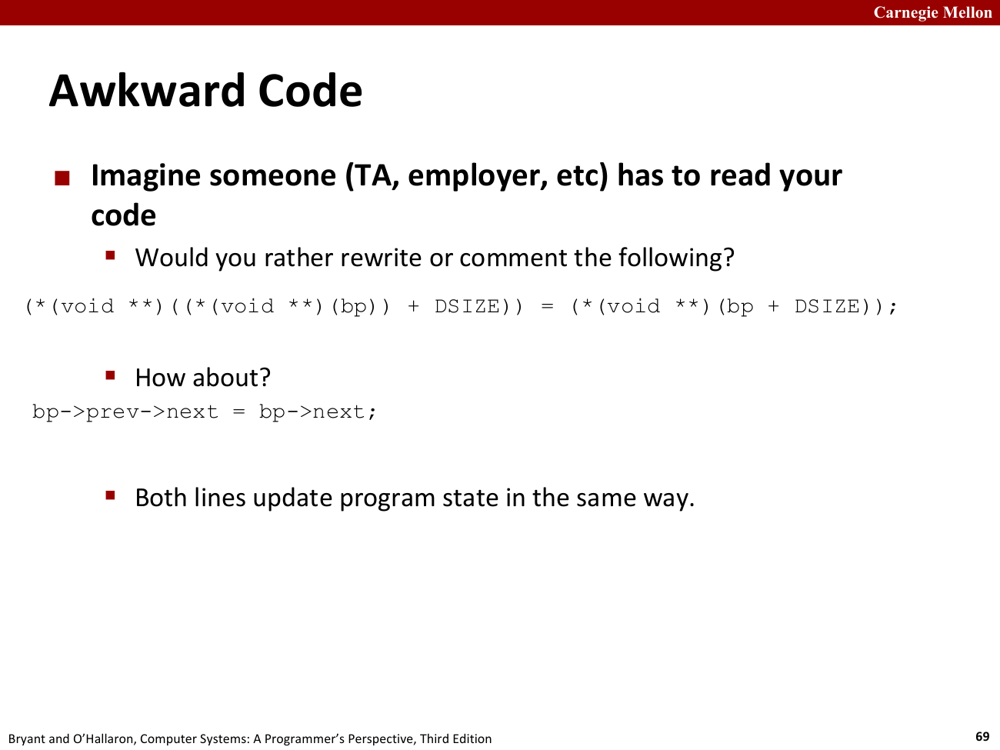
</div>

这两行可能更新的是同一个程序状态，但第二行把“前一个节点的 next 指向当前节点的 next”说清楚了．这比写一大段注释解释第一行更可靠．

> [!tip]+ 写注释前先问
>
> 我是不是能通过改名、拆函数、引入结构体或中间变量，让代码本身更清楚？如果可以，先改代码，再写必要注释．

好注释回答这些问题：

+ 为什么这段代码存在．
+ 什么时候应该用它．
+ 什么时候不应该用它．
+ 有没有替代方案．

#### 魔数注释

例如：

```C
// Each address is 64-bit, which is 16 hex digits plus '\0'.
const int MAX_ADDRESS_LENGTH = 17;
```

这里注释不是说“定义了一个常量”，而是解释为什么是 `17`．这就是有价值的注释．

#### Code by commenting

课件建议先写短注释帮助设计，再写代码，再修订注释和代码．例如快速排序可以先写：

```C
// Initialize locals.
// Pick a pivot value.
// Reorder array around the pivot.
// Recurse on the partitions.
```

然后分别实现每一步．如果某一步代码变得很长或注释很难写，就说明可能需要继续拆函数．

### Commit Message

commit 不只是保存代码，也是工作记录．它能防止系统故障和误操作，也能让未来的你知道当时做了什么．

好的 commit message 至少要一行说明变化，例如：

```text
Parse command line arguments
Fix unique test bug, race condition not solved
Finish segregated list implementation
```

如果一个 commit 同时改了很多无关事情，message 就会变得很难写．这通常说明 commit 粒度太大．

## 软件可靠性

### 可靠性的定义

课件给了两个定义角度：

+ IEEE 1983：在规定条件下、规定时间内，软件不引起系统失效的概率．
+ GB/T-11457：在规定时间周期内、规定条件下，程序执行所要求功能的能力．

简单说，可靠性关心的是：**在给定环境和时间里，系统持续正确工作的能力**．

### 硬件和软件中的 Fault、Error、Failure

在可靠性语境里也要区分：

+ Fault：故障或缺陷，是潜在原因．
+ Error：错误，是故障在程序状态或数据结构中的表现．
+ Failure：失效，是系统没有按规格提供服务．

软件故障通常来自设计错误、实现错误、需求理解错误和操作失误．硬件故障还会来自元器件老化、环境应力和物理损坏．

### 故障来源

课件列出三类主要来源：

+ **元器件失效**：硬件老化、损耗、制造缺陷．电子元件常见失效率曲线包括早期失效、中期稳定、晚期磨损三个阶段．
+ **环境因素**：温度、湿度、冲击、振动、电磁场、辐射、盐雾、霉菌等．
+ **设计故障**：硬件或软件设计与规格不一致，软件规模越大越常见．

<div style="text-align: center; margin-top: 15px;">
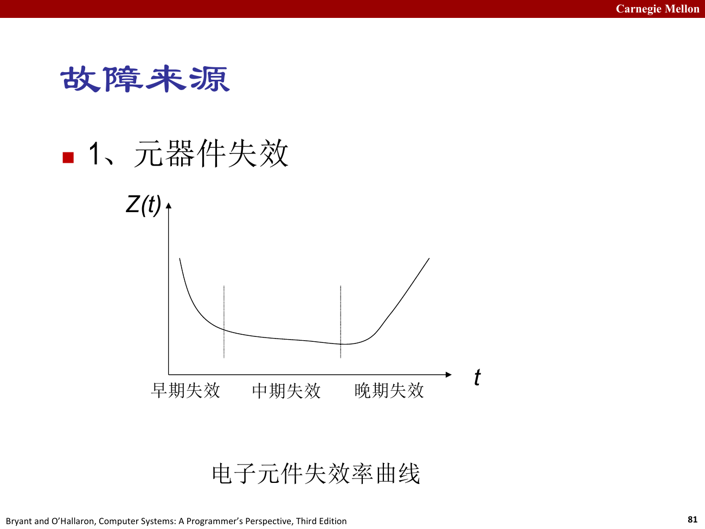
</div>

### 故障模型

故障表现非常多，工程上会用模型抽象它们．一个模型越广泛，越能覆盖真实问题，但也越难处理；一个模型越简单，越容易检测和容忍，但覆盖范围可能有限．

#### 逻辑级故障模型

+ 固定型故障：某条线或某个输出固定为 `0` 或 `1`．
+ 短路或开路故障：元件输出线短路、悬空或异常连接．
+ 桥接故障：两条不应相连的线被连在一起．

这些模型更接近硬件逻辑电路．

#### 数据结构级故障

+ 独立差错：一个二进制位改变．
+ 算术差错：某个数据值增加或减少 $2^i$．
+ 单项差错：二进制向量中某些位朝同一方向改变，例如都从 `0` 变 `1`．

#### 软件故障和软件差错

软件故障是设计或实现与说明不一致．它在运行中可能表现为：

+ 非法转移．
+ 误转移．
+ 死循环．
+ 空间溢出．
+ 把数据当代码执行．
+ 无意义或不合理数据．

#### 系统级故障模型

系统级关注的是功能错误，即系统输出与设计说明不一致．按持续时间可以分为：

+ 永久性：连续稳定存在的故障或错误．
+ 间歇性：由不稳定硬件或变化的软件状态引起，偶然出现．
+ 瞬时性：由临时环境条件引起，出现后可能消失．

### Dependability 可信属性

Dependability 指系统提供“有理由被信任”的服务能力．常见属性包括：

| 属性 | 含义 |
| --- | --- |
| Availability | 需要时能提供正确服务 |
| Reliability | 正确服务能持续不中断 |
| Safety | 不造成灾难性后果 |
| Integrity | 系统不被不当修改 |
| Maintainability | 能被修改和修复 |
| Confidentiality | 信息不被未授权泄露 |

这些属性不是完全独立的．例如一个银行系统可能可用性很高，但如果完整性差，交易金额会错，那仍然不可接受．

### 可靠度计算

如果假设系统失效率为常数 $\lambda$，可靠度可以写成 $R(t)=e^{-\lambda t}$．这里 $R(t)$ 表示系统在时间 $t$ 内不失效的概率．

可维修系统常用 MTBF，Mean Time Between Failures，平均系统失效间隔时间．不可维修系统常用 MTTF，Mean Time To Failure，平均无故障运行时间．在常数失效率模型下，$MTBF=\int_0^\infty e^{-\lambda t}\,dt=\frac{1}{\lambda}$．

<div style="text-align: center; margin-top: 15px;">
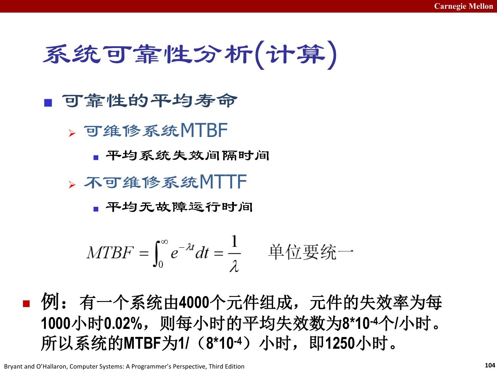
</div>

因为 $MTBF=\frac{1}{\lambda}$，所以也可以写 $R(t)=e^{-t/MTBF}$．当 $t=MTBF$ 时，$R(t)=e^{-1}\approx36.8\%$．这常常让初学者意外：平均寿命不是“到这个时间还大概率正常”，而是可靠度已经降到约三分之一．

当 $\lambda t$ 很小时，可以用近似 $R(t)\approx1-\lambda t$．因为 $\lambda=\frac{1}{MTBF}$，所以 $R(t)\approx1-\frac{t}{MTBF}$，也就是 $MTBF\approx\frac{t}{1-R(t)}$．

#### 例题 1：4000 个元件的 MTBF

题目：一个系统由 4000 个元件组成，每个元件的失效率为每 1000 小时 $0.02\%$，求系统 MTBF．

逐步算：

+ 每个元件每 1000 小时失效率是 $0.02\%=0.0002$．
+ 换成每小时失效率：$\lambda=\frac{0.0002}{1000}=2\times10^{-7}$ 每小时．
+ 4000 个元件近似串联系统，总失效率 $\lambda_s=4000\times2\times10^{-7}=8\times10^{-4}$ 每小时．
+ 所以 $MTBF=\frac{1}{\lambda_s}=\frac{1}{8\times10^{-4}}=1250$ 小时．

#### 例题 2：99% 可靠度能运行多久

题目：一台计算机由 10000 个元件组成，每个元件的失效率为每 1000 小时 $0.05\%$，要求系统可靠度为 $99\%$，系统能运行多久．

逐步算：

+ 每个元件每小时失效率 $\lambda=\frac{0.0005}{1000}=5\times10^{-7}$．
+ 系统总失效率 $\lambda_s=10000\times5\times10^{-7}=5\times10^{-3}$ 每小时．
+ 要求 $R(t)=0.99$，用近似 $R(t)\approx1-\lambda_s t$．
+ 所以 $0.99\approx1-5\times10^{-3}t$，得到 $t=\frac{0.01}{5\times10^{-3}}=2$ 小时．

<div style="text-align: center; margin-top: 15px;">
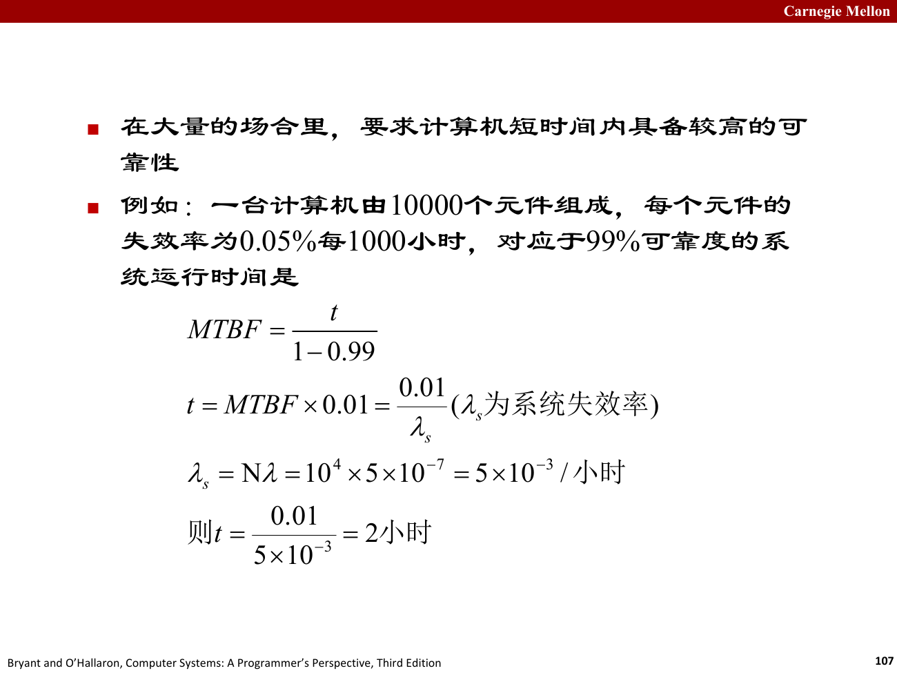
</div>

这个例子说明：元件很多时，即使单个元件看起来很可靠，系统总失效率也会快速上升．

### 高可信应用

高可信应用包括航空、航天、核电站、银行、证券、制造、物流、交通等需要长时间连续运行的系统．课件提到 $99.999\%$ 可用性，也就是常说的 five nines．一年有 $365\times24\times60=525600$ 分钟，$0.001\%$ 的不可用时间约为 $5.256$ 分钟，所以 five nines 大约意味着一年故障时间只有 5 分钟左右．

### Fault Avoidance 和 Fault Tolerance

可靠性技术可以分成两条路：

+ Fault avoidance：避错，努力减少故障进入系统，例如元器件筛选、严格设计评审、静态检查、规范开发．
+ Fault tolerance：容错，承认故障可能发生，并让系统检测、隔离、恢复或降级，例如冗余、表决、纠错码、主备切换．

容错的基本方法是冗余：

+ 硬件冗余：用多个硬件单元抵抗元器件老化或损坏．
+ 时间冗余：重复执行或重试，抵抗瞬时错误．
+ 信息冗余：加入校验码、纠错码，抵抗数据错误．
+ 软件冗余：用多版本实现、独立检查、监控恢复等方式抵抗设计错误．

<div style="text-align: center; margin-top: 15px;">

</div>

软件容错的问题描述可以概括为：设计、老化、环境和操作都可能导致软件失效，所以系统需要自我诊断与恢复，技术手段包括冗余、检测、表决、屏蔽、切换和降级．

## 软件复杂性和路径爆炸

### 软件和硬件有什么不同

硬件会老化，软件本身不会像电容、电阻那样物理磨损．但软件有另一个更难的问题：复杂性．

课件列出一些源代码规模例子，比如操作系统、数据库、Office、浏览器和大型互联网项目都可能有数百万到数千万行代码．代码超过一定规模后，靠人脑完整枚举所有路径已经不现实．

### 例子：软件路径问题

课件给出一个控制流图：循环体中有 5 条可能路径，循环最多重复 20 次．

<div style="text-align: center; margin-top: 15px;">
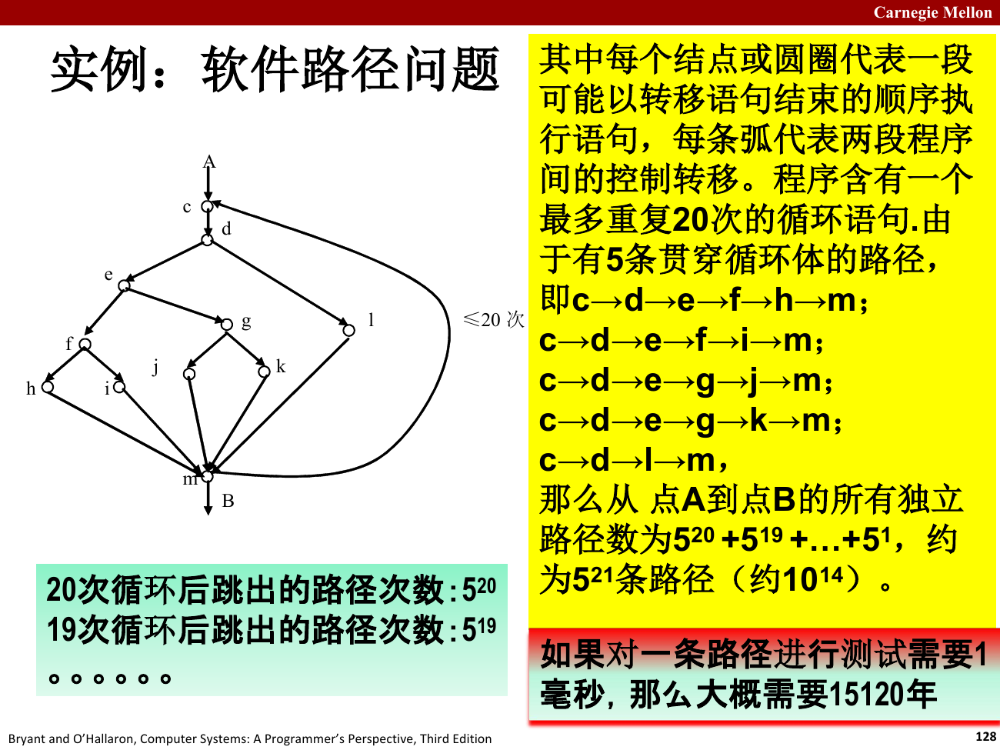
</div>

如果循环执行 1 次后退出，路径数约为 $5^1$．执行 2 次后退出，路径数约为 $5^2$．一直到执行 20 次后退出，路径数约为 $5^{20}$．总路径数是等比和 $5^{20}+5^{19}+\cdots+5^1=\frac{5^{21}-5}{4}$，数量级约为 $10^{14}$．

如果每条路径只用 1 毫秒测试，按 $5^{21}$ 这个粗略量级估算，也需要约 15120 年．即使用更精确的等比和估算，也远远超出任何项目周期．

> [!warning]+ 穷举测试不可行
>
> 这个例子说明，测试不能靠“把所有路径跑一遍”．真实项目必须基于风险、边界、等价类、业务场景和代码结构来选测试用例．

## 经典事故和案例

### Dijkstra 的提醒

课件引用 Dijkstra 的观点：Testing can only show the presence of defects, not their absence．

意思是：测试能证明“这里有缺陷”，但不能证明“软件没有缺陷”．即使所有测试都通过，也只能说明这些测试覆盖的条件下没有暴露问题．

### 案例一：Ariane 5 火箭

1996 年 6 月 4 日，Ariane 5 火箭升空约 40 秒后偏离轨道、解体并爆炸，造成巨大损失．课件强调这是软件工程中著名的复用和数值转换事故．

事故相关代码可抽象成：

```C
double d_bh;
short s_bh;

sense_horizontal_velocity(&d_bh);
s_bh = d_bh;   // Operand Error
```

<div style="text-align: center; margin-top: 15px;">
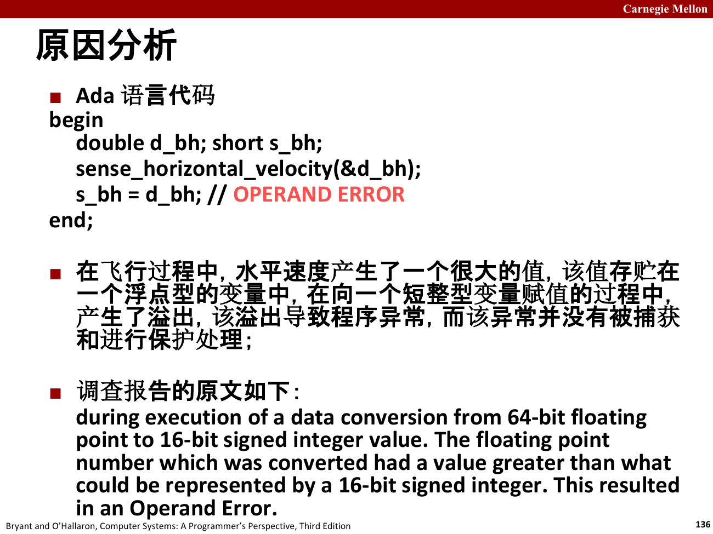
</div>

问题是：飞行过程中水平速度产生了一个很大的浮点值，超过了 16 位有符号整数能表示的范围．从 64 位浮点数转换到 16 位整数时发生溢出，触发 Operand Error，而这个异常没有被捕获和保护．

为什么测试没有发现？

+ 测试数据来自 Ariane 4 的实际轨道数据．
+ Ariane 5 的飞行指标与 Ariane 4 差异很大，测试中没有出现会溢出的数据．
+ 类似转换代码共有 7 处，其中 4 处有异常保护，3 处没有．
+ 程序员认为这处数据“不可能”达到溢出范围．

> [!example]+ Ariane 5 的教训
>
> 代码复用时，旧系统中的前提条件可能已经失效．“以前没出过事”不等于“在新环境里仍然安全”．对数值范围、单位、边界和异常处理的假设必须写成合同、测试和保护代码．

### 案例二：Therac-25 辐射治疗仪

Therac-25 是一种辐射治疗设备，1985 年到 1987 年间发生多起严重医疗事故，造成患者死亡或严重灼伤．课件把它作为时序、资源冲突和系统级测试失败的案例．

Therac-25 有两种模式：

+ 低能量模式：可以直接照射病人．
+ 高能量模式：需要屏蔽过滤装置．

事故条件大致是：

1. 操作员先选择高能量模式，机器开始配置．
2. 机器配置需要 8 秒，并且这段时间内相关任务不接受新命令．
3. 熟练操作员在 8 秒内撤销前面选择，改选低能量模式，并启动放射．
4. 系统其他部分没有收到新设置，仍按高能量方式照射．

<div style="text-align: center; margin-top: 15px;">
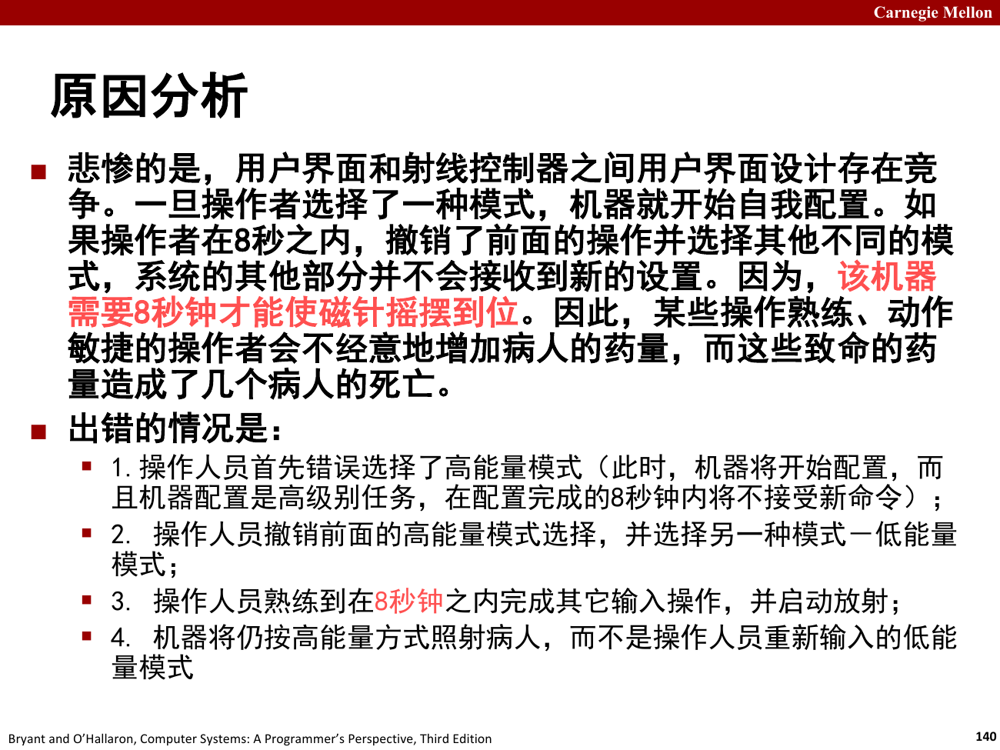
</div>

这本质上是用户界面、设备配置、控制器之间的竞态和状态同步问题．

测试教训：

+ 有严格时序关系的流程必须设计时序测试．
+ 系统要分析资源冲突和状态切换条件．
+ 操作熟练用户可能比测试人员更快触发极端时序．
+ 改进型产品不能因为前代组件用过就默认整体安全．

### 案例三：错误释放栈上数组

课件给出一个 C 语言例子：

```C
void someFunction()
{
    char someString[10];
    /* use someString */
    free(someString);
}
```

`someString` 是栈上数组，不是 `malloc` 得到的堆内存．`free` 只能释放堆上动态分配的内存，所以 `free(someString)` 会破坏运行时内存管理结构，导致程序莫名崩溃．

正确理解：

+ 栈内存由函数调用和返回自动管理．
+ 堆内存由 `malloc` / `calloc` / `realloc` 分配，必须用 `free` 释放．
+ 谁申请，谁释放；没有申请，就不能释放．

这类问题用代码扫描、编译器 warning、Valgrind、AddressSanitizer 都可能提前发现．如果拖到系统测试，现象往往只是“偶发崩溃”，定位成本极高．

### 案例四：调试消息框遗留到上线系统

课件讲了一个无人值守数字录音系统的例子．开发者为了定位数据库超过 10 万条记录后的错误，在程序中加入“每增加一定数量记录就弹出消息框”的调试逻辑．上线时消息框没有去掉，程序弹框后停住等待用户点击，但系统无人值守，于是录音功能停止工作．

这个案例有两层问题：

+ 调试代码进入生产环境，说明发布前测试和配置管理失败．
+ 第三方数据库在大数据量下确实有问题，说明依赖组件也要测试．

> [!warning]+ 调试功能也要可控
>
> 调试日志、弹框、断言、诊断开关都可能改变系统行为．生产环境中必须通过配置、构建类型和发布检查控制它们．

### 案例五：广州商业银行 ATM 取款

课件中的 ATM 案例是：某 ATM 升级后出现异常，1000 元以上取款交易中，每取款 1000 元只按 1 元形成交易报文发送给银行主机．也就是 ATM 出钞 1000 元，但账户只扣 1 元．

问题不是一个函数算错这么简单，而是多系统集成失败：

+ ATM 终端软件把交易额缩小了 1000 倍．
+ ATM 服务端、银行前置机、核心系统没有再次核查渠道业务规则．
+ 变更直接上线，缺少版本管理和回归测试．

应该怎样测：

+ 对升级后的交易报文做字段级校验．
+ 对 100、999、1000、1001 等边界金额做测试．
+ 在核心系统侧验证 ATM 渠道金额规则．
+ 做端到端集成测试，而不是只测单台 ATM．

### 案例六：Debug 版日志导致多线程异常

课件描述：多线程程序在 Debug 版中会向同一个日志文件输出状态信息，Release 版关闭日志．测试现象是 Release 版稳定，Debug 版总出问题．

根因是多个线程竞争同一个文件资源．如果没有互斥量、队列或专门日志线程，多个线程同时打开、写入、关闭同一文件，就可能产生异常或数据交错．

<div style="text-align: center; margin-top: 15px;">
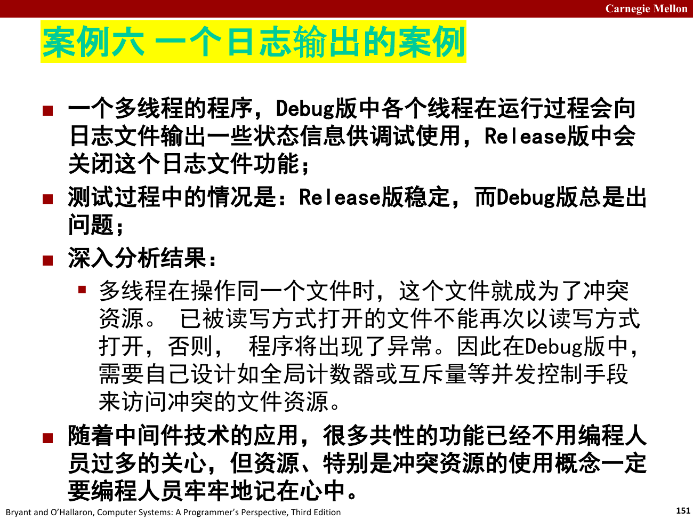
</div>

这个例子说明：调试代码不是“无害附属品”．日志会改变时序，也会引入共享资源．多线程程序里，任何共享资源都要明确同步策略．

### 案例七：挪威网银账号截断

某用户转账时多输入了一个数字．标准账号是 11 位，最后 1 位是校验和；用户输入了 12 位，系统自动截断为前 11 位．巧合的是，截断后的账号通过校验，并且属于另一个人．

系统缺陷在于：**对非法输入做了静默修正，而不是明确报错**．

正确策略应该是：

+ 输入长度不等于 11 位时直接拒绝．
+ 明确提示用户账号位数错误．
+ 不要在资金交易中自动截断关键字段．
+ 确认页要展示收款人姓名或其他强校验信息．

### 案例八：ATM 异地取现导致负余额

某银行核心系统测试发现：本地 ATM 可以取出全部余额；异地 ATM 取出全部余额时，由于手续费在取款后扣收，账户出现负值．

缺陷不是“扣费公式不会写”，而是业务规则处理顺序错了．正确逻辑应该在出钞前检查：余额是否足够覆盖取款金额和所有手续费．

测试启发：

+ 业务规则是测试设计的一部分．
+ 本地、异地、跨行、手续费、最低留存余额都要组合覆盖．
+ 系统测试和验收测试更容易发现这类业务语义缺陷．

### 案例九：证券行权“提交成功”不等于“交易成功”

课件讲了一个认购权证行权案例．用户根据交易系统显示的“可买数量”提交行权，系统提示“委托已成功提交”，但后续交易因为数量超过实际权证数量而失败，导致损失．

根因：

+ 券商端和交易所端各自业务逻辑可能都正确，但端到端提示误导用户．
+ 系统是异步处理，提交成功只表示请求发出，不表示交易成功．
+ 券商端没有在提交前检查实际可行权数量．
+ 开发和测试对业务理解不足．

<div style="text-align: center; margin-top: 15px;">

</div>

> [!warning]+ 异步系统的提示语要精确
>
> “提交成功”不能写成或暗示“交易成功”．凡是需要后端确认、交易所撮合、银行清算的流程，都必须区分 accepted、processing、confirmed、failed 等状态．

## 软件测试

### 软件测试的定义

软件测试是为了发现错误而执行软件的过程．更完整地说，测试是根据需求说明、设计说明和程序内部结构，精心设计测试用例，执行软件并发现错误的过程．

测试不是为了证明程序员厉害，也不是为了证明软件完美．测试的目标是尽早、尽可能低成本地暴露缺陷．

### 七条测试原则

课件列出 ISTQB 常见原则：

| 原则 | 解释 |
| --- | --- |
| 测试显示存在缺陷 | 测试能证明有 bug，不能证明没有 bug |
| 穷尽测试不可能 | 除极小程序外，不可能覆盖所有输入和路径 |
| 早期测试 | 需求阶段就应开始测试设计，也叫测试左移 |
| 缺陷集群性 | 大量缺陷常集中在少数模块中 |
| 杀虫剂悖论 | 一直跑同一批测试会越来越难发现新缺陷 |
| 测试背景依赖性 | 医疗软件、游戏、银行系统测试重点不同 |
| 无缺陷谬论 | 即使没有发现缺陷，如果不满足用户需求也不是好软件 |

实施指导原则包括：

+ 独立测试：尽量让独立角色测试，避免作者盲点．
+ 追溯用户需求：测试应能对应到需求．
+ 严格执行计划：避免随意测试．
+ 保存文档：便于回归测试、审计和维护．

### 测试层次

软件测试过程通常包括：

| 层次 | 目标 | 典型问题 |
| --- | --- | --- |
| 单元测试 | 检查最小模块是否正确 | 函数边界、内存释放、局部算法 |
| 集成测试 | 检查模块接口和组合 | 参数约定不一致、资源冲突、协议误解 |
| 确认测试 | 确认产品满足需求 | 功能是否符合需求规格 |
| 系统测试 | 对完整系统做综合检验 | 性能、可靠性、兼容性、端到端流程 |
| 验收测试 | 向用户证明系统按预期工作 | 真实业务流程、用户可接受标准 |

集成测试有两种：

+ 非增式集成：先分别单元测试，再把模块一次性连起来整体测试．
+ 增式集成：不断把待测模块接入已测模块集合，边集成边测．

### 测试和开发的关系：V 模型

V 模型把开发阶段和测试阶段对应起来：

+ 需求分析对应系统测试．
+ 概要设计对应集成测试．
+ 详细设计对应单元测试．
+ 编码位于 V 的底部．

<div style="text-align: center; margin-top: 15px;">
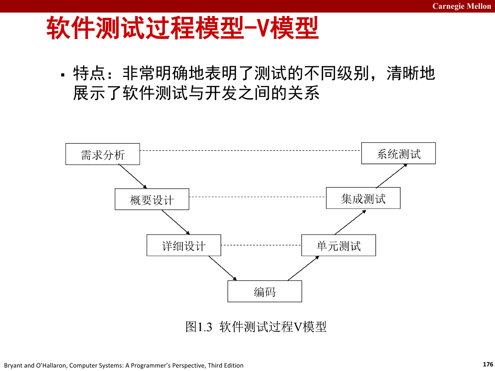
</div>

V 模型的优点是清晰说明不同测试层次和开发产物之间的关系．但它容易让人误以为测试只在编码后发生．所以后来还有 W 模型，强调测试活动应贯穿需求、设计、编码全过程．

<div style="text-align: center; margin-top: 15px;">
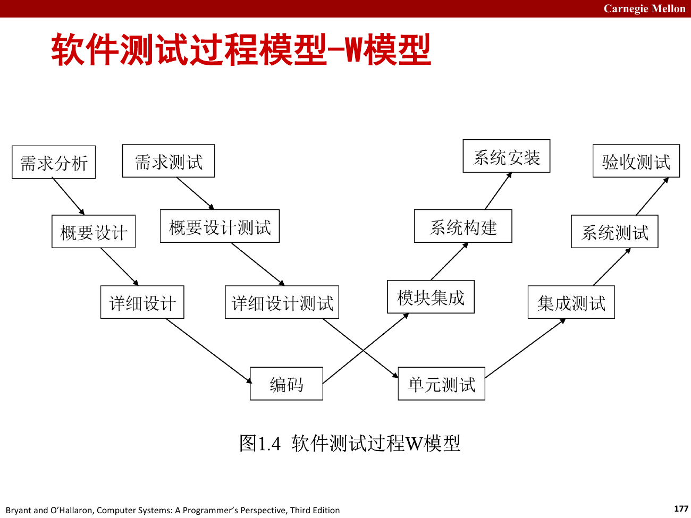
</div>

### 黑盒测试

黑盒测试也叫功能测试或基于规格说明的测试．它把程序看作从输入定义域到输出值域的映射，只关心输入和输出，不关心内部实现．

课件用一个简单图示说明：如果只从外部观察输入输出，我们可能不知道里面是 $y=2x$，还是 $y=x^2$，除非选到能区分它们的测试点．比如输入 $x=2$ 时两者都输出 `4`，但输入 $x=3$ 时分别输出 `6` 和 `9`．

<div style="text-align: center; margin-top: 15px;">
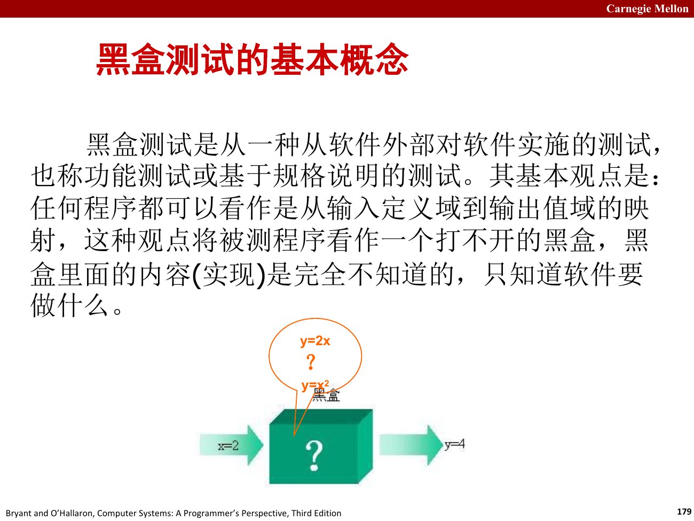
</div>

黑盒测试关注：

+ 功能是否符合需求．
+ 是否有功能遗漏．
+ 人机交互是否合理．
+ 数据库、文件、外部接口是否正确．
+ 性能和行为是否满足要求．
+ 初始化和终止是否正确．

优点：

+ 与具体实现无关，代码重构后测试仍可能复用．
+ 测试设计可以和实现并行，从需求阶段开始．

常用方法：

+ 等价类划分：把输入分成行为相同的类别，每类选代表值．
+ 边界值分析：重点测边界附近，例如 `0`、`1`、最大值、最小值．
+ 决策表测试：适合多条件组合业务规则．
+ 因果图：把输入条件和输出结果的逻辑关系画出来．
+ 正交法：用较少用例覆盖多因素组合．
+ 状态图：适合状态机和流程系统．
+ 场景法：从真实用户流程设计端到端测试．

### 白盒测试

白盒测试也叫透明盒测试或逻辑驱动测试．它根据程序内部逻辑结构设计用例，目标是覆盖代码、分支、条件和路径等．

白盒测试常见策略：

+ Desk Check：程序员在单元测试前自己桌前检查代码．
+ Peer Review：程序员和测试人员组成评审小组阅读、讨论代码．
+ Walkthrough：走查代码执行流程，检查逻辑问题．

白盒测试内容包括：

+ 静态测试：结构分析、质量度量、代码检查．
+ 动态测试：逻辑覆盖、功能验证、插桩、变异测试、性能分析．

### 黑盒和白盒的比较

<div style="text-align: center; margin-top: 15px;">
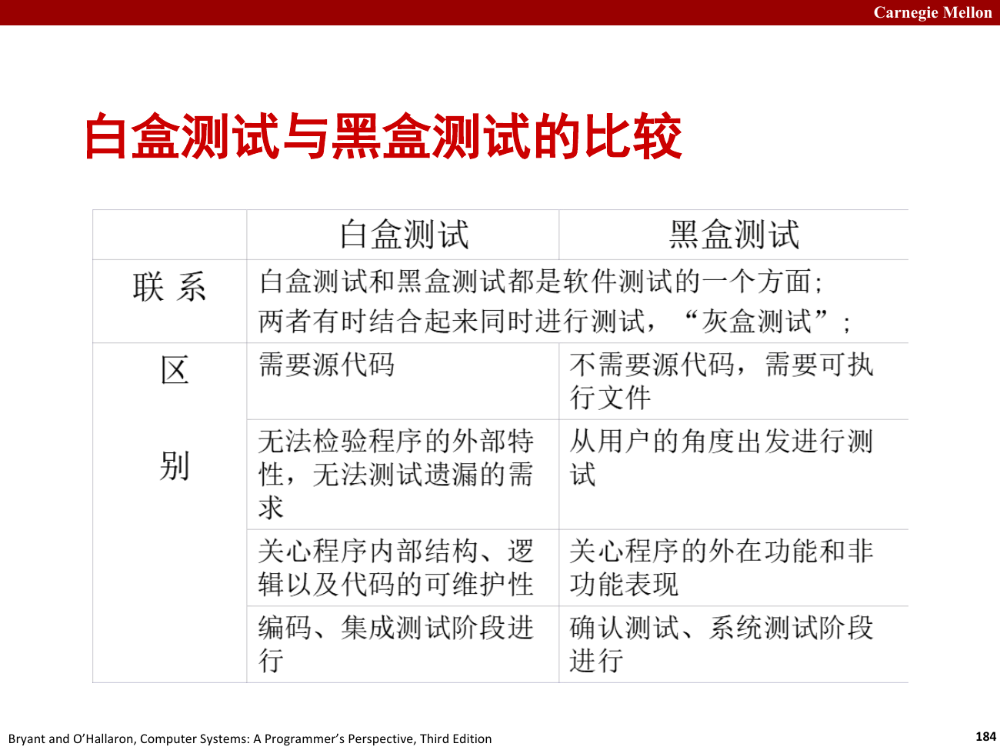
</div>

简化对比如下：

| 角度 | 白盒测试 | 黑盒测试 |
| --- | --- | --- |
| 是否需要源代码 | 需要 | 不需要，但需要可执行程序和规格 |
| 关注点 | 内部结构、逻辑、可维护性 | 外部功能、用户行为、非功能表现 |
| 常见阶段 | 编码、单元测试、集成测试 | 确认测试、系统测试、验收测试 |
| 优势 | 能发现内部路径和结构问题 | 更贴近用户和需求 |
| 局限 | 不容易发现遗漏需求和外部体验问题 | 不容易定位内部根因 |

真正项目里两者要结合使用．例如 Ariane 5 的数值转换适合白盒检查和单元边界测试；ATM 金额扣错和证券状态提示误导，则更依赖系统级黑盒测试和业务场景测试．

### 测试工具

测试工具是通过自动化或管理手段检测缺陷的辅助工具．可以粗略分成：

+ 自动化测试工具：模拟用户操作、运行单元测试、接口测试、性能测试等，提高执行效率．
+ 测试管理工具：管理用例、缺陷、版本、测试计划和报告．
+ 静态分析工具：不运行程序就检查代码坏味道、潜在缺陷和规范问题．
+ 动态分析工具：运行时检查内存、线程、覆盖率和性能，例如 Valgrind、sanitizer、profiler．

工具不能替代测试思维．工具擅长重复执行和机械检查，但测试人员仍要理解需求、业务规则、架构约束和风险优先级．

## 总结

这份课件把调试、设计、可靠性和测试连成了一条线：

+ 程序一定会有缺陷，所以调试要系统化．
+ 人脑处理复杂性有限，所以设计要可读、模块化、可测试．
+ 失效可能来自代码、硬件、环境、业务规则和人机交互，所以可靠性要从系统角度看．
+ 测试不能证明没有缺陷，只能不断提高我们对系统的信心．

最实用的行动清单是：

1. 编译时打开 `-Wall -Werror`．
2. 内存相关 C/C++ 程序优先跑 Valgrind 或 sanitizer．
3. 遇到复杂 bug 时写下假设、预测、实验和观察．
4. 把每个修复过的 failure 加入回归测试．
5. 写代码时优先让它可读、可拆、可测．
6. 对业务系统做端到端测试，不只测单个函数．
7. 对“不会发生”的假设保持警惕，把假设写进合同、断言和测试．
